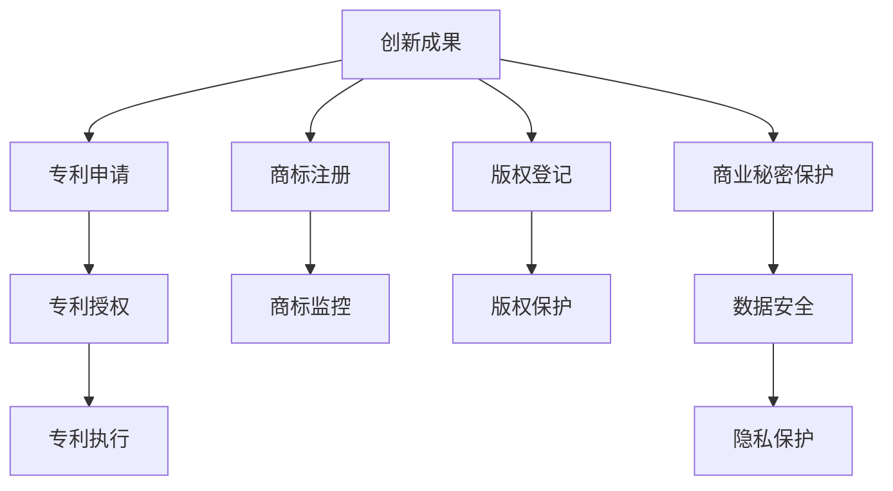

                 

关键词：知识产权、数字时代、创新、数据安全、技术保护、法律挑战、商业模式变革

> 摘要：本文旨在探讨数字时代下知识产权所面临的挑战与机遇。随着技术的飞速发展，知识产权不仅在保护创新成果方面发挥了重要作用，同时也面临着前所未有的挑战。本文将分析知识产权保护体系在数字化环境下的变化，探讨其在促进技术创新、确保数据安全和应对商业模式变革方面的作用，并展望未来的发展趋势。

## 1. 背景介绍

知识产权是指通过法律手段赋予个人或组织对某种创造性成果的专有权利，包括专利、商标、版权和商业秘密等。传统的知识产权保护体系主要针对物理世界中的创新成果，如机械设备、药品配方和文学作品等。然而，随着数字技术的兴起，知识产权的保护对象和范围发生了显著变化。

数字时代，知识产权面临的挑战主要集中在以下几个方面：首先是技术的迅速迭代，使得传统知识产权保护体系难以适应新的创新模式；其次是数据安全与隐私保护问题日益突出，知识产权保护必须兼顾数据安全和个人隐私；再次是商业模式变革对知识产权的保护提出了新的要求。

与此同时，数字时代也带来了知识产权保护的机遇。技术创新的加速推动了知识产权法律制度的完善，为知识产权保护提供了更加有效的手段。同时，数字技术的普及为知识产权的传播和利用提供了新的平台，促进了知识产权价值的实现。

## 2. 核心概念与联系

### 2.1 知识产权保护体系

知识产权保护体系是一个复杂的法律体系，包括专利法、商标法、版权法和商业秘密法等。这些法律共同构成了知识产权保护的基石。

#### 2.1.1 专利法

专利法主要保护发明创造，赋予专利权人一定期限的独占权。在数字时代，专利法面临的挑战是如何应对软件专利和生物技术专利的保护问题。

#### 2.1.2 商标法

商标法保护企业的商标标识，防止他人擅自使用相同或相似的商标。在数字时代，商标法的保护对象扩展到了网络域名和电子商标。

#### 2.1.3 版权法

版权法保护文学、艺术和科学作品，包括文字、音乐、绘画等。在数字时代，版权法面临的最大挑战是如何应对数字作品的版权保护问题。

#### 2.1.4 商业秘密法

商业秘密法保护企业的商业信息，防止他人非法获取、使用或披露。在数字时代，商业秘密的保护需要适应网络环境下的数据安全挑战。

### 2.2 数字时代的知识产权保护架构

在数字时代，知识产权保护架构需要融入新的技术和法律手段。以下是一个简化的 Mermaid 流程图，展示了知识产权保护的关键环节：



### 2.3 数字时代知识产权保护的趋势

随着数字技术的发展，知识产权保护体系也在不断进化。以下是数字时代知识产权保护的主要趋势：

#### 2.3.1 法规的国际化

随着全球化的加深，知识产权保护的法规逐步国际化。例如，《伯尔尼公约》、《巴黎公约》和《世界知识产权组织条约》等国际条约为知识产权保护提供了法律基础。

#### 2.3.2 数字版权管理（DRM）

数字版权管理技术通过加密和数字签名等技术手段，实现对数字作品的版权保护。DRM技术在数字时代发挥着越来越重要的作用。

#### 2.3.3 数据隐私保护

在数字时代，数据隐私保护成为知识产权保护的重要组成部分。隐私保护法规如《通用数据保护条例》（GDPR）等，对企业的数据处理行为提出了严格要求。

#### 2.3.4 商业模式创新

数字时代，商业模式不断创新，知识产权保护需要适应新的商业模式。例如，共享经济和区块链技术等新兴商业模式对知识产权保护提出了新的挑战。

## 3. 核心算法原理 & 具体操作步骤

### 3.1 算法原理概述

在数字时代，知识产权保护算法主要涉及数字版权管理、加密技术和区块链技术。以下是对这些算法的简要概述：

#### 3.1.1 数字版权管理

数字版权管理（DRM）是一种通过加密和数字签名等技术手段，实现对数字作品版权保护的方法。DRM技术包括内容加密、访问控制和许可管理等功能。

#### 3.1.2 加密技术

加密技术通过将数据转换为不可读的密文，实现对数据的保护。常见的加密算法有对称加密和非对称加密。对称加密算法如AES，非对称加密算法如RSA。

#### 3.1.3 区块链技术

区块链技术通过分布式账本和智能合约，实现对数字资产的追踪和管理。区块链技术具有去中心化、透明和不可篡改等特点，适用于知识产权保护。

### 3.2 算法步骤详解

以下是数字时代知识产权保护算法的具体操作步骤：

#### 3.2.1 数字版权管理

1. **内容加密**：将数字作品加密为密文，防止未经授权的访问。
2. **访问控制**：设置访问控制策略，限制用户对数字作品的访问权限。
3. **许可管理**：根据用户身份和权限，发放和撤销许可，控制数字作品的传播和使用。

#### 3.2.2 加密技术

1. **密钥生成**：生成一对密钥（私钥和公钥），用于加密和解密数据。
2. **数据加密**：使用公钥加密数据，确保数据在传输过程中的安全性。
3. **数据解密**：使用私钥解密数据，确保数据在接收端的完整性。

#### 3.2.3 区块链技术

1. **数字资产登记**：将数字资产登记在区块链上，实现资产的可追溯性。
2. **智能合约执行**：通过智能合约自动执行版权交易和许可管理。
3. **数据监控**：实时监控区块链上的版权交易，确保版权的合法性和安全性。

### 3.3 算法优缺点

#### 3.3.1 数字版权管理

**优点**：可以有效防止数字作品的非法传播和使用。

**缺点**：用户使用体验较差，可能影响数字作品的传播和利用。

#### 3.3.2 加密技术

**优点**：可以确保数据在传输过程中的安全性。

**缺点**：加密算法可能被破解，数据安全性存在一定风险。

#### 3.3.3 区块链技术

**优点**：具有去中心化、透明和不可篡改等特点，适用于知识产权保护。

**缺点**：区块链技术的性能和扩展性仍需提升，适用于大规模场景的能力有限。

### 3.4 算法应用领域

#### 3.4.1 数字版权管理

数字版权管理适用于数字音乐、电子书、电影等数字作品的保护。

#### 3.4.2 加密技术

加密技术适用于数据传输、存储和隐私保护等领域。

#### 3.4.3 区块链技术

区块链技术适用于数字资产追踪、版权交易和许可管理等领域。

## 4. 数学模型和公式 & 详细讲解 & 举例说明

### 4.1 数学模型构建

在数字时代，知识产权保护涉及的数学模型主要包括加密算法模型和区块链模型。以下是这两个模型的简要介绍：

#### 4.1.1 加密算法模型

加密算法模型主要涉及对称加密和非对称加密两种算法。以下是这两个算法的数学模型：

- **对称加密模型**：
  $$C = E_K(P)$$
  $$P = D_K(C)$$
  其中，$C$为密文，$P$为明文，$K$为密钥，$E$和$D$分别为加密和解密函数。

- **非对称加密模型**：
  $$C = E_K^1(P)$$
  $$P = D_K^2(C)$$
  其中，$K_1$为公钥，$K_2$为私钥，$E$和$D$分别为加密和解密函数。

#### 4.1.2 区块链模型

区块链模型主要涉及区块链的数据结构、加密技术和智能合约。以下是这三个方面的数学模型：

- **区块链数据结构模型**：
  区块链由一系列按时间顺序排列的区块组成，每个区块包含一个时间戳、一个随机数和一个前一个区块的哈希值。

- **加密技术模型**：
  区块链中的数据传输和存储采用加密技术，以保证数据的安全性和完整性。

- **智能合约模型**：
  智能合约是自动执行的合约，其数学模型基于条件判断和逻辑运算。

### 4.2 公式推导过程

以下是对加密算法模型的推导过程：

#### 对称加密模型推导

- **加密过程**：
  $$C = E_K(P)$$
  其中，$E_K$为加密函数，$K$为密钥，$P$为明文。

- **解密过程**：
  $$P = D_K(C)$$
  其中，$D_K$为解密函数，$K$为密钥，$C$为密文。

- **加密解密关系**：
  $$D_K(E_K(P)) = P$$
  $$E_K(D_K(C)) = C$$

#### 非对称加密模型推导

- **加密过程**：
  $$C = E_K^1(P)$$
  其中，$E_K^1$为加密函数，$K_1$为公钥，$P$为明文。

- **解密过程**：
  $$P = D_K^2(C)$$
  其中，$D_K^2$为解密函数，$K_2$为私钥，$C$为密文。

- **加密解密关系**：
  $$D_K^2(E_K^1(P)) = P$$
  $$E_K^1(D_K^2(C)) = C$$

### 4.3 案例分析与讲解

以下是一个关于区块链模型的应用案例：

#### 案例背景

假设一个版权交易场景，版权方（Alice）将一部小说的版权出售给出版方（Bob）。双方通过区块链平台进行交易，确保版权的合法性和安全性。

#### 案例步骤

1. **版权登记**：
   Alice 将小说的版权信息（如标题、作者、出版日期等）上传到区块链平台，进行版权登记。

2. **交易协商**：
   Bob 对 Alice 的版权信息进行查询，并与 Alice 协商购买事宜。

3. **智能合约执行**：
   双方达成购买协议后，通过智能合约自动执行交易。智能合约定义了交易的条款，如购买价格、交付时间和版权使用许可等。

4. **交易记录**：
   智能合约执行完成后，交易记录将被永久存储在区块链上，确保交易的合法性和透明性。

5. **版权使用**：
   Bob 可以根据智能合约的授权，合法使用小说版权，如出版、发行等。

### 4.4 运行结果展示

在区块链平台上，版权交易的结果将如下展示：

- **版权信息**：小说的标题、作者、出版日期等基本信息。
- **交易记录**：交易时间、双方参与者、交易金额和版权使用许可等信息。
- **版权状态**：版权的使用状态，如已出售、已授权等。

## 5. 项目实践：代码实例和详细解释说明

### 5.1 开发环境搭建

在数字时代，知识产权保护的实现需要依赖多种技术手段。以下是一个基于区块链和智能合约的知识产权保护项目的开发环境搭建步骤：

1. **安装Node.js**：
   - 访问 Node.js 官网（https://nodejs.org/），下载并安装适合操作系统的 Node.js 版本。
   - 安装完成后，通过命令行运行 `node -v` 验证安装是否成功。

2. **安装Truffle**：
   - 通过 npm 安装 Truffle：`npm install -g truffle`
   - 安装完成后，通过命令行运行 `truffle version` 验证安装是否成功。

3. **创建项目**：
   - 在合适的位置创建一个新的文件夹，如 `知识产权保护项目`。
   - 在该文件夹中通过命令行运行 `truffle init` 初始化项目。

4. **安装Ganache**：
   - 通过 npm 安装 Ganache：`npm install -g ganache-cli`
   - 安装完成后，通过命令行运行 `ganache -h` 验证安装是否成功。

5. **启动开发环境**：
   - 通过命令行运行 `truffle develop` 启动 Truffle 开发环境。
   - 在另一个命令行窗口中运行 `ganache` 启动 Ganache 模拟区块链节点。

### 5.2 源代码详细实现

以下是该知识产权保护项目的源代码实现：

```javascript
// 合约代码
pragma solidity ^0.8.0;

contract IntellectualProperty {
    // 智能合约变量
    struct License {
        address licensee;
        string licenseType;
        uint256 issueDate;
        uint256 expirationDate;
    }

    // 许可证数组
    mapping(uint256 => License) public licenses;

    // 许可证ID计数器
    uint256 public licenseIdCounter;

    // 添加许可证
    function addLicense(address licensee, string memory licenseType, uint256 issueDate, uint256 expirationDate) public {
        licenses[licenseIdCounter] = License({
            licensee: licensee,
            licenseType: licenseType,
            issueDate: issueDate,
            expirationDate: expirationDate
        });
        licenseIdCounter++;
    }

    // 获取许可证详情
    function getLicense(uint256 licenseId) public view returns (address, string memory, uint256, uint256) {
        License memory license = licenses[licenseId];
        return (license.licensee, license.licenseType, license.issueDate, license.expirationDate);
    }

    // 判断许可证是否有效
    function isLicenseValid(uint256 licenseId, uint256 currentDate) public view returns (bool) {
        License memory license = licenses[licenseId];
        if (currentDate >= license.issueDate && currentDate <= license.expirationDate) {
            return true;
        }
        return false;
    }
}
```

### 5.3 代码解读与分析

1. **合约结构**：
   该合约名为 `IntellectualProperty`，定义了一个许可证结构体 `License` 和一个许可证映射表 `licenses`。

2. **变量说明**：
   - `licenses`：存储所有许可证的映射表。
   - `licenseIdCounter`：许可证ID计数器，用于生成新的许可证ID。

3. **函数实现**：
   - `addLicense`：添加新许可证，接受许可人地址、许可证类型、生效日期和失效日期作为参数。
   - `getLicense`：获取指定许可证ID的详细信息。
   - `isLicenseValid`：判断指定许可证是否有效，根据当前日期与许可证生效日期和失效日期进行比较。

4. **合约部署**：
   - 通过 Truffle 开发环境部署该合约到 Ganache 模拟区块链上。
   - 部署完成后，可以通过 Truffle 接口与合约进行交互。

### 5.4 运行结果展示

1. **合约地址**：
   - 部署完成后，通过命令行运行 `truffle console` 进入 Truffle 控制台。
   - 输入 `IntellectualProperty.address` 查看合约地址。

2. **添加许可证**：
   - 在控制台创建一个新的许可证，调用 `addLicense` 函数，输入许可人地址、许可证类型、生效日期和失效日期。
   - 输入 `getLicense` 函数，查看添加的许可证详情。

3. **判断许可证有效性**：
   - 调用 `isLicenseValid` 函数，输入许可证ID和当前日期，判断许可证是否有效。

## 6. 实际应用场景

### 6.1 数字音乐版权保护

数字音乐版权保护是知识产权保护的一个重要领域。随着数字音乐平台的兴起，音乐创作者的版权保护需求日益增长。以下是一个实际应用案例：

- **案例背景**：一位独立音乐人（Alice）创作了一首原创歌曲，并将其上传到一个数字音乐平台（Bob）。
- **案例步骤**：
  1. Alice 使用区块链技术登记歌曲的版权信息，确保版权的唯一性和不可篡改性。
  2. Bob 在收到歌曲后，通过智能合约验证歌曲的版权信息，确保歌曲的合法性和版权归属。
  3. 当用户在平台上购买或播放歌曲时，智能合约会自动发放许可，确保用户的合法使用。
  4. 若出现版权争议，Alice 和 Bob 可以通过区块链上的交易记录和智能合约日志，证明歌曲的版权归属和合法使用。

### 6.2 软件版权保护

软件版权保护是知识产权保护的另一个重要领域。随着软件产业的发展，软件版权保护的需求不断增长。以下是一个实际应用案例：

- **案例背景**：一家软件开发公司（Alice）开发了一款新的软件产品，并将其授权给另一个公司（Bob）使用。
- **案例步骤**：
  1. Alice 使用数字版权管理技术对软件进行加密，确保软件在分发过程中的安全性。
  2. Bob 在获得软件授权后，通过智能合约执行授权协议，确保软件的合法使用。
  3. 在软件授权期内，Bob 可以根据智能合约的许可，合法使用软件。
  4. 若出现软件侵权行为，Alice 可以通过区块链上的交易记录和智能合约日志，追究侵权方的责任。

### 6.3 商业秘密保护

商业秘密保护是知识产权保护的另一个重要领域。随着企业竞争的加剧，商业秘密的重要性日益凸显。以下是一个实际应用案例：

- **案例背景**：一家高科技企业（Alice）研发了一项核心商业秘密，并将其存储在企业内部数据库中。
- **案例步骤**：
  1. Alice 使用加密技术对商业秘密进行加密，确保商业秘密在存储和传输过程中的安全性。
  2. 企业内部员工在访问商业秘密时，需要通过智能合约验证其身份和权限。
  3. 商业秘密的访问记录将被存储在区块链上，确保访问过程的透明性和可追溯性。
  4. 若出现商业秘密泄露事件，Alice 可以通过区块链上的访问记录和智能合约日志，追究相关员工的责任。

## 7. 未来应用展望

### 7.1 数字版权保护

随着数字技术的不断发展，数字版权保护将面临新的挑战和机遇。未来，数字版权保护有望在以下几个方面取得突破：

- **智能合约应用**：智能合约将在数字版权保护中发挥更大作用，通过自动化执行版权许可和管理，提高版权保护效率。
- **区块链技术的普及**：区块链技术将为数字版权保护提供更加透明和安全的平台，促进数字版权交易的公平性和可信度。
- **版权保护算法创新**：随着技术的进步，新的版权保护算法将不断涌现，提高数字版权保护的技术水平和用户体验。

### 7.2 商业模式创新

数字时代，商业模式不断创新，知识产权保护也需要适应新的商业模式。以下是一些可能出现的商业模式创新：

- **共享经济**：共享经济模式将带来新的知识产权挑战，如共享产品的版权归属和许可问题。知识产权保护需要适应共享经济的特殊需求。
- **区块链+物联网**：区块链与物联网的结合将实现智能设备之间的数据共享和交互，为知识产权保护提供新的应用场景。
- **人工智能+版权**：人工智能技术在版权识别、侵权检测和版权交易等方面具有巨大潜力，有望推动版权保护的智能化和自动化。

### 7.3 数据隐私保护

随着数据隐私保护法规的不断完善，知识产权保护需要兼顾数据隐私保护。未来，数据隐私保护将面临以下挑战：

- **隐私计算技术**：隐私计算技术如联邦学习、差分隐私等，将为数据隐私保护提供新的手段，提高数据共享的安全性。
- **隐私保护法律框架**：数据隐私保护法规的完善和国际化，将为知识产权保护提供更加明确的指导。
- **隐私计算与知识产权保护结合**：隐私计算与知识产权保护的结合，将实现数据隐私保护与知识产权保护的双赢。

## 8. 工具和资源推荐

### 8.1 学习资源推荐

- **《区块链：从入门到精通》**：本书详细介绍了区块链的基础知识、应用场景和实现技术，适合初学者学习。
- **《智能合约开发实战》**：本书通过实际案例，讲解了智能合约的开发流程和常见问题，适合有一定编程基础的读者。
- **《数字版权管理技术》**：本书系统地介绍了数字版权管理的基本原理和技术，包括加密、授权和追踪等方面。

### 8.2 开发工具推荐

- **Truffle**：Truffle 是一个流行的智能合约开发框架，提供了一套完整的工具集，包括开发环境、测试框架和部署工具。
- **Ganache**：Ganache 是一个轻量级的区块链节点模拟器，用于开发和测试智能合约。
- **Ethers.js**：Ethers.js 是一个JavaScript库，用于与以太坊区块链进行交互，提供了一套便捷的API接口。

### 8.3 相关论文推荐

- **《区块链与数字版权保护》**：该论文探讨了区块链技术在数字版权保护中的应用，分析了区块链技术的优势和应用场景。
- **《智能合约的安全性分析》**：该论文分析了智能合约的安全性问题，提出了几种智能合约安全性的评估方法。
- **《数字版权管理中的加密技术》**：该论文详细介绍了数字版权管理中的加密技术，包括对称加密、非对称加密和混合加密等。

## 9. 总结：未来发展趋势与挑战

### 9.1 研究成果总结

数字时代，知识产权保护取得了显著的成果。区块链技术和智能合约的兴起，为知识产权保护提供了新的手段。数字版权管理技术的不断完善，提高了数字作品的保护水平。数据隐私保护法规的逐步完善，为知识产权保护提供了法律保障。

### 9.2 未来发展趋势

未来，知识产权保护将继续向智能化、自动化和全球化方向发展。智能合约和区块链技术的应用将更加广泛，为知识产权保护提供更加高效和安全的解决方案。数字版权管理技术将不断创新，满足数字时代的需求。数据隐私保护法规将逐步完善，为知识产权保护提供更加明确的法律指导。

### 9.3 面临的挑战

尽管知识产权保护取得了显著成果，但未来仍面临以下挑战：

- **技术挑战**：随着技术的不断发展，知识产权保护需要适应新的技术需求，如人工智能、物联网等。
- **法律挑战**：知识产权保护法规的完善和国际化仍需努力，确保全球范围内的知识产权保护。
- **商业模式挑战**：新兴商业模式对知识产权保护提出了新的要求，如共享经济、区块链等。

### 9.4 研究展望

未来，知识产权保护研究应重点关注以下几个方面：

- **技术创新**：研究新型加密算法和数字版权管理技术，提高知识产权保护的技术水平。
- **法律研究**：深入研究知识产权保护法规，推动全球范围内的知识产权保护法律体系的完善。
- **应用研究**：探讨知识产权保护在新兴商业模式中的应用，为知识产权保护提供新的应用场景。

### 9.5 附录：常见问题与解答

#### 问题1：数字版权管理是否会影响用户体验？

**解答**：是的，数字版权管理可能会对用户体验产生一定影响。加密技术和访问控制策略可能需要用户进行额外的操作，如授权许可和身份验证等。然而，随着技术的进步，数字版权管理正逐渐变得更加便捷和用户友好。

#### 问题2：区块链技术在知识产权保护中的优势是什么？

**解答**：区块链技术在知识产权保护中的优势主要体现在以下几个方面：

- **透明性**：区块链上的数据透明可查，有利于知识产权的保护和争议解决。
- **不可篡改性**：区块链上的数据一旦被记录，就无法被篡改，确保了知识产权的合法性和真实性。
- **去中心化**：区块链的去中心化特性，降低了知识产权保护的成本和风险。

#### 问题3：智能合约在知识产权保护中的应用有哪些？

**解答**：智能合约在知识产权保护中的应用主要包括以下几个方面：

- **版权交易**：智能合约可以自动执行版权交易，确保交易的合法性和透明性。
- **许可管理**：智能合约可以自动发放和撤销许可，控制数字作品的传播和使用。
- **版权追踪**：智能合约可以记录版权交易和许可信息，方便版权追踪和管理。

### 作者署名

作者：禅与计算机程序设计艺术 / Zen and the Art of Computer Programming
----------------------------------------------------------------

以上就是本篇文章的完整内容。希望这篇文章能够帮助您了解数字时代知识产权保护的挑战与机遇，以及相关技术和应用的发展趋势。如果您有任何问题或建议，欢迎在评论区留言交流。感谢您的阅读！


