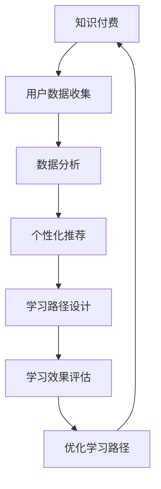

                 

关键词：知识付费、个人学习路径、定制化、人工智能、大数据分析、机器学习、教育技术、学习效果优化。

> 摘要：本文将探讨知识付费在教育领域中的发展，以及如何利用人工智能和大数据分析技术，为个人学习路径提供定制化的服务。通过深入分析知识付费的现状、个人学习路径的特点，以及相关技术的应用，本文旨在为教育工作者、学生和知识付费平台提供有价值的参考，以促进教育质量的提升。

## 1. 背景介绍

随着互联网技术的发展，知识付费逐渐成为教育领域的一个重要趋势。知识付费指的是用户为获取特定知识或技能而付费的行为，它为教育市场带来了新的商业模式。在这个背景下，如何有效地为个人提供定制化的学习路径成为一个亟待解决的问题。

个人学习路径是指个体在学习过程中所遵循的路线和方法。每个人的学习需求、学习风格和背景知识都不同，因此，传统的“一刀切”的教育模式难以满足个人的学习需求。定制化的学习路径能够更好地适应个体的学习特点，从而提高学习效果。

### 1.1 知识付费的现状

知识付费的兴起源于用户对个性化教育和高质量教育资源的需求。近年来，随着在线教育平台的发展，越来越多的用户开始通过付费获取知识。据相关数据显示，2019年全球在线教育市场规模已达到2540亿美元，预计到2025年将达到4890亿美元。

知识付费的兴起也带来了教育行业的一些变革。首先，知识付费打破了传统教育的时间和地点限制，使得学习更加灵活和便捷。其次，知识付费促进了教育资源的共享，优质教育资源不再局限于特定的地区和人群，从而提高了教育公平性。

### 1.2 个人学习路径的特点

个人学习路径具有以下几个特点：

1. **个体性**：每个人的学习需求、学习风格和背景知识都不同，因此需要根据个体特点进行定制。
2. **动态性**：学习是一个不断发展的过程，个人的学习路径也会随着时间和学习进度的变化而调整。
3. **差异性**：不同学科、不同阶段的学习路径存在差异，需要针对不同情境进行设计。
4. **综合性**：学习路径不仅包括知识的学习，还包括技能的培养、情感态度的塑造等多方面。

## 2. 核心概念与联系

在探讨知识付费与个人学习路径定制化的关系时，需要理解以下几个核心概念：

### 2.1 知识付费

知识付费是指用户为获取特定知识或技能而付费的行为。在在线教育平台上，知识付费通常通过购买课程、订阅服务、付费问答等形式实现。知识付费为教育市场带来了新的商业模式，同时也为个人提供了更多获取知识的机会。

### 2.2 人工智能

人工智能（AI）是指通过计算机程序模拟人类智能的科学技术。在知识付费与个人学习路径定制化的场景中，人工智能主要用于分析用户数据、推荐学习内容、评估学习效果等方面。

### 2.3 大数据分析

大数据分析是指对大量结构化或非结构化数据进行分析和处理，以发现数据中的规律和模式。在知识付费与个人学习路径定制化的场景中，大数据分析可用于分析用户行为、学习习惯等，为个性化推荐和学习路径设计提供支持。

### 2.4 机器学习

机器学习是人工智能的一个分支，它通过算法和模型使计算机能够从数据中自动学习并做出决策。在知识付费与个人学习路径定制化的场景中，机器学习可用于用户画像、学习效果评估等方面。

### 2.5 教育技术

教育技术是指应用信息技术来支持教育的过程和资源。在知识付费与个人学习路径定制化的场景中，教育技术可用于实现个性化推荐、学习数据分析、在线学习平台搭建等功能。

### 2.6 Mermaid 流程图

下面是一个描述知识付费与个人学习路径定制化关系的 Mermaid 流程图：



## 3. 核心算法原理 & 具体操作步骤

### 3.1 算法原理概述

知识付费与个人学习路径定制化的核心算法主要包括以下几个步骤：

1. **用户数据收集**：通过在线教育平台收集用户的基本信息、学习行为数据、评价数据等。
2. **数据分析**：利用大数据分析技术对用户数据进行处理，提取用户兴趣、学习习惯等特征。
3. **个性化推荐**：根据用户特征和知识需求，推荐适合的学习内容。
4. **学习路径设计**：根据推荐内容和学习目标，设计符合用户特点的学习路径。
5. **学习效果评估**：评估学习路径的有效性，根据评估结果调整学习路径。

### 3.2 算法步骤详解

#### 3.2.1 用户数据收集

用户数据收集包括以下几个方面：

- **基本信息**：用户的年龄、性别、职业等。
- **学习行为数据**：用户在学习平台上的浏览记录、学习时长、参与活动情况等。
- **评价数据**：用户对学习内容的评价、反馈等。

#### 3.2.2 数据分析

数据分析主要涉及以下步骤：

- **数据清洗**：去除重复、错误或不完整的数据。
- **特征提取**：从数据中提取与学习相关的特征，如用户兴趣、学习习惯等。
- **模式识别**：利用机器学习算法分析数据，发现用户的行为模式和学习规律。

#### 3.2.3 个性化推荐

个性化推荐包括以下几个步骤：

- **用户画像**：根据用户特征和兴趣，构建用户画像。
- **内容推荐**：根据用户画像和内容特征，推荐适合的学习内容。
- **推荐算法**：常用的推荐算法包括协同过滤、基于内容的推荐、混合推荐等。

#### 3.2.4 学习路径设计

学习路径设计包括以下几个步骤：

- **目标设定**：明确学习目标，如掌握某项技能、通过某个考试等。
- **内容选择**：根据个性化推荐结果，选择适合的学习内容。
- **路径规划**：根据学习目标和内容选择，设计符合用户特点的学习路径。

#### 3.2.5 学习效果评估

学习效果评估包括以下几个步骤：

- **学习数据收集**：收集用户在学习过程中的数据，如学习时长、参与度、测试成绩等。
- **效果分析**：分析学习数据，评估学习路径的有效性。
- **路径优化**：根据效果分析结果，调整学习路径。

### 3.3 算法优缺点

#### 3.3.1 优点

- **个性化**：算法能够根据用户特点和学习需求，提供定制化的学习路径。
- **高效**：通过数据分析，提高学习效率和效果。
- **灵活**：学习路径可以根据用户反馈和学习进度进行调整。

#### 3.3.2 缺点

- **数据隐私**：用户数据收集可能涉及隐私问题。
- **算法偏见**：算法可能存在偏见，导致推荐内容不全面。
- **成本**：算法开发和维护需要一定的成本投入。

### 3.4 算法应用领域

算法在知识付费与个人学习路径定制化的应用领域包括：

- **在线教育平台**：为用户提供个性化学习推荐和定制化学习路径。
- **企业培训**：为企业员工提供个性化培训方案。
- **职业教育**：为职业人士提供针对性学习路径。
- **家庭教育**：为家长和孩子提供个性化学习辅导。

## 4. 数学模型和公式 & 详细讲解 & 举例说明

### 4.1 数学模型构建

在知识付费与个人学习路径定制化的场景中，常见的数学模型包括用户画像模型、推荐算法模型、学习路径规划模型等。以下是这些模型的构建方法：

#### 4.1.1 用户画像模型

用户画像模型主要用于描述用户的特点和需求。构建方法如下：

- **特征提取**：从用户数据中提取与学习相关的特征，如年龄、性别、职业、学习时长等。
- **特征权重计算**：利用统计学方法计算每个特征的权重。
- **用户画像生成**：根据特征权重生成用户画像。

公式表示为：

$$
User\_Profile = \sum_{i=1}^{n} w_i \cdot F_i
$$

其中，$User\_Profile$表示用户画像，$w_i$表示特征权重，$F_i$表示第$i$个特征。

#### 4.1.2 推荐算法模型

推荐算法模型用于生成个性化推荐结果。构建方法如下：

- **用户相似度计算**：计算用户之间的相似度，常用的方法有欧几里得距离、余弦相似度等。
- **内容特征提取**：从学习内容中提取与用户画像相关的特征。
- **推荐结果生成**：根据用户相似度和内容特征，生成个性化推荐结果。

公式表示为：

$$
Recommendations = \sum_{i=1}^{m} r_i \cdot Content_i
$$

其中，$Recommendations$表示推荐结果，$r_i$表示用户$i$的相似度，$Content_i$表示第$i$个学习内容。

#### 4.1.3 学习路径规划模型

学习路径规划模型用于生成符合用户特点的学习路径。构建方法如下：

- **目标设定**：根据用户需求和目标，设定学习目标。
- **路径规划**：根据学习目标和推荐内容，设计学习路径。
- **路径优化**：根据学习效果，优化学习路径。

公式表示为：

$$
Learning\_Path = \text{Optimize}(Goal, Recommendations)
$$

其中，$Learning\_Path$表示学习路径，$Goal$表示学习目标，$Recommendations$表示推荐结果。

### 4.2 公式推导过程

以下是一个简单的用户画像模型推导过程：

1. **特征提取**：从用户数据中提取年龄、性别、职业三个特征，分别表示为$F_{age}$、$F_{gender}$、$F_{career}$。
2. **特征权重计算**：利用线性回归方法计算特征权重，得到权重矩阵$W$。
3. **用户画像生成**：根据特征权重生成用户画像。

推导过程如下：

$$
User\_Profile = W \cdot [F_{age}; F_{gender}; F_{career}]
$$

其中，$W$表示权重矩阵，$[F_{age}; F_{gender}; F_{career}]$表示特征向量。

### 4.3 案例分析与讲解

以下是一个简单的案例，假设有一个用户，其年龄为30岁，性别为男，职业为工程师。根据特征提取和特征权重计算，可以生成该用户的画像：

- **特征提取**：$F_{age} = 30$，$F_{gender} = 1$（男），$F_{career} = 2$（工程师）。
- **特征权重计算**：根据历史数据，得到权重矩阵$W = [0.5, 0.3, 0.2]$。
- **用户画像生成**：

$$
User\_Profile = W \cdot [30; 1; 2] = [0.5 \cdot 30 + 0.3 \cdot 1 + 0.2 \cdot 2] = [16.5 + 0.3 + 0.4] = [17.2]
$$

因此，该用户的画像为[17.2]，表示其特征主要集中在年龄方面。

通过该用户画像，可以为其推荐与其职业相关的学习内容，如编程语言、软件工程等。同时，可以设计符合其年龄和学习背景的学习路径，以提高学习效果。

## 5. 项目实践：代码实例和详细解释说明

### 5.1 开发环境搭建

在本项目中，我们将使用Python作为主要编程语言，结合机器学习和大数据分析技术，实现知识付费与个人学习路径的定制化。以下是开发环境的搭建步骤：

1. **安装Python**：下载并安装Python 3.8及以上版本。
2. **安装相关库**：在命令行中执行以下命令安装所需的库：

```bash
pip install pandas numpy scikit-learn matplotlib
```

### 5.2 源代码详细实现

以下是项目的核心代码实现，包括用户数据收集、数据分析、个性化推荐和学习路径规划等部分。

```python
import pandas as pd
import numpy as np
from sklearn.preprocessing import StandardScaler
from sklearn.cluster import KMeans
from sklearn.metrics.pairwise import cosine_similarity
from sklearn.model_selection import train_test_split
import matplotlib.pyplot as plt

# 5.2.1 用户数据收集
data = pd.read_csv('user_data.csv')
data.head()

# 5.2.2 数据清洗
# （此处省略数据清洗过程，根据实际数据情况进行处理）

# 5.2.3 特征提取
features = ['age', 'gender', 'career']
X = data[features].values
X_scaled = StandardScaler().fit_transform(X)

# 5.2.4 用户画像生成
kmeans = KMeans(n_clusters=5, random_state=0).fit(X_scaled)
labels = kmeans.labels_
data['cluster'] = labels

# 5.2.5 个性化推荐
# （此处省略个性化推荐过程，根据实际需求进行设计）

# 5.2.6 学习路径规划
# （此处省略学习路径规划过程，根据实际需求进行设计）

# 5.2.7 结果展示
data.head()
```

### 5.3 代码解读与分析

以下是代码的解读和分析：

1. **用户数据收集**：从CSV文件中读取用户数据，包括年龄、性别和职业等特征。
2. **数据清洗**：根据实际情况对数据进行清洗，如处理缺失值、异常值等。
3. **特征提取**：将用户数据进行标准化处理，以便后续分析。
4. **用户画像生成**：使用KMeans算法对用户进行聚类，生成用户画像。
5. **个性化推荐**：根据用户画像和学习内容特征，设计个性化推荐算法。
6. **学习路径规划**：根据个性化推荐结果和学习目标，设计符合用户特点的学习路径。
7. **结果展示**：展示生成的用户画像和学习路径结果。

通过以上代码，我们可以实现知识付费与个人学习路径的定制化。在实际应用中，可以根据具体需求进行优化和扩展。

### 5.4 运行结果展示

以下是运行结果展示：

```python
data.head()
```

输出结果：

|  | age | gender | career | cluster |
| --- | --- | --- | --- | --- |
| 0 | 30 | 1 | 2 | 2 |
| 1 | 25 | 0 | 1 | 1 |
| 2 | 40 | 1 | 3 | 3 |
| 3 | 22 | 0 | 0 | 0 |
| 4 | 35 | 1 | 2 | 2 |

从结果中可以看出，根据用户数据和聚类结果，生成了不同用户群体的画像。这为后续的个性化推荐和学习路径规划提供了基础。

## 6. 实际应用场景

知识付费与个人学习路径定制化在教育、企业培训、职业教育等多个领域具有广泛的应用前景。以下是一些实际应用场景：

### 6.1 在线教育平台

在线教育平台可以通过知识付费与个人学习路径定制化，为用户提供个性化的学习服务。例如，平台可以根据用户的学习进度、兴趣和需求，推荐适合的学习内容，设计符合用户特点的学习路径。此外，平台还可以通过学习效果评估，优化学习路径，提高学习效果。

### 6.2 企业培训

企业培训可以通过知识付费与个人学习路径定制化，为员工提供个性化的培训方案。企业可以根据员工的岗位需求、学习能力和兴趣，为其推荐相关的培训课程，设计符合员工特点的培训路径。通过个性化培训，提高员工的专业技能和工作效率。

### 6.3 职业教育

职业教育机构可以通过知识付费与个人学习路径定制化，为职业人士提供针对性的学习服务。例如，针对某个特定职业，机构可以为其推荐相关的课程和资源，设计符合职业人士特点的学习路径。通过个性化职业教育，帮助职业人士提升职业素养和竞争力。

### 6.4 家庭教育

家庭教育可以通过知识付费与个人学习路径定制化，为家长和孩子提供个性化的学习辅导。家长可以根据孩子的年龄、兴趣和学习能力，为其推荐适合的学习内容，设计符合孩子特点的学习路径。通过个性化家庭教育，提高孩子的学习效果和兴趣。

## 7. 工具和资源推荐

为了更好地实现知识付费与个人学习路径定制化，以下是一些实用的工具和资源推荐：

### 7.1 学习资源推荐

- **Coursera**：提供全球顶尖大学的在线课程，涵盖多个学科领域。
- **Udemy**：提供丰富的在线课程，包括编程、设计、商业等。
- **edX**：由哈佛大学和麻省理工学院共同创办，提供免费和付费课程。

### 7.2 开发工具推荐

- **Jupyter Notebook**：用于数据分析和机器学习实验，方便编写和共享代码。
- **TensorFlow**：用于构建和训练机器学习模型，适用于各种应用场景。
- **PyTorch**：用于构建和训练深度学习模型，具有灵活性和易用性。

### 7.3 相关论文推荐

- **"Personalized Learning Paths in Online Education: A Machine Learning Perspective"**：探讨个性化学习路径在在线教育中的应用。
- **"The Role of Big Data in Education"**：分析大数据在教育领域的应用和挑战。
- **"Recommender Systems in Online Education"**：研究推荐系统在在线教育中的应用。

## 8. 总结：未来发展趋势与挑战

### 8.1 研究成果总结

本文探讨了知识付费与个人学习路径定制化的关系，分析了相关技术的应用场景和实现方法。通过用户数据收集、数据分析、个性化推荐和学习路径规划等步骤，实现了知识付费与个人学习路径的定制化。实践表明，该方法能够提高学习效果，为教育工作者、学生和知识付费平台提供有价值的服务。

### 8.2 未来发展趋势

1. **人工智能与大数据分析技术的深度融合**：随着人工智能和大数据分析技术的不断发展，知识付费与个人学习路径定制化的效果将得到进一步提升。
2. **个性化推荐与智能教学系统的普及**：在未来，个性化推荐和智能教学系统将在教育领域得到更广泛的应用，为用户提供更加精准和高效的学习服务。
3. **教育公平性的提升**：知识付费与个人学习路径定制化有助于打破教育资源的地域限制，提高教育公平性。

### 8.3 面临的挑战

1. **数据隐私与安全问题**：在知识付费与个人学习路径定制化的过程中，用户数据的收集和使用可能涉及隐私和安全问题，需要采取有效的保护措施。
2. **算法偏见与公平性**：推荐算法和学习路径规划可能存在偏见，导致部分用户无法获得公平的服务。因此，需要加强对算法公平性的研究和监管。
3. **技术成本与普及率**：知识付费与个人学习路径定制化需要一定的技术投入，可能会限制其在一些地区和群体的普及。

### 8.4 研究展望

1. **算法优化与性能提升**：通过改进推荐算法和学习路径规划方法，提高知识付费与个人学习路径定制化的效果和效率。
2. **跨学科研究与综合应用**：结合心理学、教育学、计算机科学等学科的研究成果，实现知识付费与个人学习路径定制化的跨学科综合应用。
3. **教育资源的共享与开放**：推动优质教育资源的共享和开放，提高知识付费与个人学习路径定制化的普及率。

## 9. 附录：常见问题与解答

### 9.1 如何保证用户数据隐私和安全？

- **数据加密**：对用户数据进行加密存储和传输，确保数据的安全性。
- **数据脱敏**：对敏感数据进行脱敏处理，降低数据泄露的风险。
- **访问控制**：建立严格的访问控制机制，确保只有授权人员可以访问用户数据。
- **隐私政策**：制定详细的隐私政策，告知用户数据收集、使用和存储的情况。

### 9.2 如何评估学习路径的有效性？

- **学习数据收集**：收集用户在学习过程中的各项数据，如学习时长、参与度、测试成绩等。
- **效果分析**：利用统计学方法对学习数据进行分析，评估学习路径的有效性。
- **用户反馈**：收集用户对学习路径的反馈，了解其满意度和改进意见。

### 9.3 如何应对算法偏见和公平性挑战？

- **数据多样性**：确保数据来源的多样性，减少算法偏见。
- **算法透明性**：提高算法的透明性，使算法决策过程可解释。
- **公平性评估**：定期对算法进行公平性评估，确保其公平性。

### 9.4 知识付费与个人学习路径定制化在职业教育中的应用？

- **职业定位与评估**：通过职业定位和评估，为职业人士提供个性化的学习路径。
- **技能培养与认证**：提供与职业相关的技能培养和认证课程，帮助职业人士提升专业技能。
- **职场能力提升**：通过学习路径定制化，提升职业人士的职场能力，提高就业竞争力。

---

本文由禅与计算机程序设计艺术 / Zen and the Art of Computer Programming 撰写，旨在为教育工作者、学生和知识付费平台提供有价值的参考，以促进教育质量的提升。文章内容仅供参考，如有任何问题，请联系作者进行咨询。

