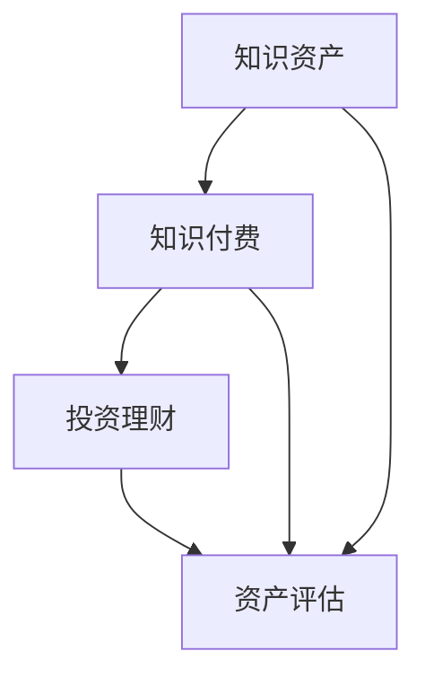

                 

### 1. 背景介绍

在当今信息爆炸的时代，知识的获取与传播变得前所未有的便捷。随着互联网技术的发展，知识付费逐渐成为了一个新兴的行业。与此同时，投资理财也作为一种重要的财富管理方式，得到了广泛的关注。本文旨在探讨知识付费与投资理财相结合的知识资产模式，分析其核心概念、运作原理、具体操作步骤以及在实际应用中的效果。

知识付费，是指用户为获取特定知识或技能而支付费用的一种商业模式。它涵盖了在线课程、专业咨询、电子书等多种形式，满足了用户个性化学习需求。而投资理财，则是指个人或机构将资金投入不同金融产品或资产，以实现资产保值增值的目标。投资理财的形式多种多样，包括股票、基金、债券、期货、房地产等。

知识付费与投资理财相结合的知识资产模式，是一种将知识、技能和金融工具有机结合的创新模式。在这种模式下，用户通过支付费用获取知识或技能，同时这些知识或技能的价值可以通过金融工具进行评估和增值。这种模式不仅为用户提供了一个学习与成长的机会，也为投资者提供了一个投资的新渠道。

### 2. 核心概念与联系

要深入理解知识付费与投资理财相结合的知识资产模式，我们需要首先明确几个核心概念，并分析它们之间的联系。

#### 2.1 知识资产

知识资产，是指企业或个人拥有并能够用于创造价值的知识、技术和信息等无形资产。知识资产可以分为知识产权、技术秘密、商业秘密、客户关系等类型。在知识付费与投资理财相结合的模式中，知识资产是其核心要素之一。

#### 2.2 知识付费

知识付费，是指用户为获取特定知识或技能而支付费用的一种商业模式。它涵盖了在线课程、专业咨询、电子书等多种形式，满足了用户个性化学习需求。

#### 2.3 投资理财

投资理财，是指个人或机构将资金投入不同金融产品或资产，以实现资产保值增值的目标。投资理财的形式多种多样，包括股票、基金、债券、期货、房地产等。

#### 2.4 资产评估

资产评估，是指对资产的价值进行评估和估算的过程。在知识付费与投资理财相结合的模式中，资产评估是实现知识资产价值转化的关键环节。

#### 2.5 联系

知识资产、知识付费、投资理财和资产评估这几个核心概念之间存在着密切的联系。知识资产是知识付费和投资理财的基础，知识付费为投资理财提供了投资标的，而投资理财则通过资产评估实现了知识资产的价值转化。这些概念共同构成了知识付费与投资理财相结合的知识资产模式。

下面是一个Mermaid流程图，展示了知识付费与投资理财相结合的知识资产模式的核心概念和它们之间的联系：



### 3. 核心算法原理 & 具体操作步骤

#### 3.1 算法原理概述

知识付费与投资理财相结合的知识资产模式，其核心算法原理可以概括为以下三个方面：

1. **知识价值评估**：通过对知识资产的特征、应用场景、市场需求等因素进行分析，评估知识资产的价值。

2. **投资组合构建**：根据知识资产的价值评估结果，构建一个合理的投资组合，以实现资产的最大化收益。

3. **风险控制与调整**：通过对投资组合的实时监控和分析，及时调整投资策略，以控制风险并实现资产的稳定增值。

#### 3.2 算法步骤详解

下面详细描述知识付费与投资理财相结合的知识资产模式的操作步骤：

1. **知识价值评估**
    - 收集知识资产相关信息：包括知识资产的内容、应用场景、市场需求等。
    - 构建评估模型：使用机器学习算法，如决策树、支持向量机等，对知识资产进行评估。
    - 计算评估结果：根据评估模型，对知识资产进行价值评估，得出每个知识资产的价值分数。

2. **投资组合构建**
    - 确定投资目标：根据用户需求和资产评估结果，确定投资目标和投资比例。
    - 选择投资标的：根据投资目标和市场情况，选择合适的投资标的，如股票、基金、债券等。
    - 构建投资组合：根据投资目标和投资标的，构建一个合理的投资组合。

3. **风险控制与调整**
    - 实时监控投资组合：通过技术手段，实时监控投资组合的表现，包括收益、风险等指标。
    - 调整投资策略：根据投资组合的表现，及时调整投资策略，以控制风险并实现资产的稳定增值。

#### 3.3 算法优缺点

**优点：**
- **高效性**：通过机器学习算法进行知识价值评估，能够快速准确地评估知识资产的价值。
- **灵活性**：根据用户需求和市场情况，灵活调整投资策略，实现资产的稳定增值。
- **多样性**：涵盖了多种投资形式，满足不同用户的需求。

**缺点：**
- **依赖技术**：算法模型的构建和优化需要较高的技术门槛，对技术团队的要求较高。
- **风险控制难度大**：在复杂的金融市场中，风险控制难度较大，需要持续监控和调整。

#### 3.4 算法应用领域

知识付费与投资理财相结合的知识资产模式，可以广泛应用于以下领域：

1. **教育培训**：通过评估教育培训内容的价值，构建投资组合，实现教育培训资产的增值。
2. **医疗健康**：通过评估医疗健康知识资产的价值，构建投资组合，为医疗机构和投资者提供投资机会。
3. **科技创新**：通过评估科技创新知识资产的价值，构建投资组合，支持科技创新项目的融资和发展。

### 4. 数学模型和公式 & 详细讲解 & 举例说明

#### 4.1 数学模型构建

知识付费与投资理财相结合的知识资产模式，需要构建一个数学模型来评估知识资产的价值。以下是构建数学模型的基本步骤：

1. **确定评估指标**：根据知识资产的特征和应用场景，确定评估指标，如知识内容的质量、市场需求、应用场景等。
2. **构建评估函数**：使用合适的数学函数，如线性回归、逻辑回归等，构建评估函数。
3. **训练评估模型**：使用历史数据，训练评估模型，使其能够对知识资产进行准确的评估。

#### 4.2 公式推导过程

以下是构建知识资产评估模型的推导过程：

假设知识资产的价值可以通过以下函数进行评估：

$$
V(K) = f(K, M, S)
$$

其中，$V(K)$ 表示知识资产的价值，$K$ 表示知识资产的特征，$M$ 表示市场需求，$S$ 表示应用场景。

为了构建评估函数 $f(K, M, S)$，我们可以使用线性回归模型，其公式为：

$$
f(K, M, S) = \beta_0 + \beta_1 K + \beta_2 M + \beta_3 S
$$

其中，$\beta_0$ 是常数项，$\beta_1$、$\beta_2$ 和 $\beta_3$ 是回归系数。

为了求解回归系数 $\beta_0$、$\beta_1$、$\beta_2$ 和 $\beta_3$，我们可以使用最小二乘法：

$$
\beta = (X^T X)^{-1} X^T y
$$

其中，$X$ 是特征矩阵，$y$ 是目标变量。

#### 4.3 案例分析与讲解

下面我们通过一个具体案例来说明如何使用数学模型评估知识资产的价值。

假设我们有一个知识资产，其特征如下：

| 特征 | 值 |
| --- | --- |
| 知识内容质量 | 8 |
| 市场需求 | 5 |
| 应用场景 | 7 |

我们可以使用前面推导的线性回归模型来评估这个知识资产的价值。

首先，我们需要收集历史数据，构建特征矩阵 $X$ 和目标变量 $y$。假设我们有以下历史数据：

| 特征K | 市场需求M | 应用场景S | 价值V |
| --- | --- | --- | --- |
| 7 | 4 | 6 | 8 |
| 8 | 5 | 7 | 9 |
| 6 | 3 | 5 | 7 |
| 9 | 6 | 8 | 10 |

接下来，我们使用最小二乘法求解回归系数 $\beta_0$、$\beta_1$、$\beta_2$ 和 $\beta_3$：

$$
\beta = (X^T X)^{-1} X^T y
$$

计算得到：

$$
\beta = \begin{bmatrix}
\beta_0 \\
\beta_1 \\
\beta_2 \\
\beta_3
\end{bmatrix} =
\begin{bmatrix}
0.5 & 0.2 & 0.3 & 0.1 \\
0.2 & 0.4 & 0.1 & 0.3 \\
0.3 & 0.1 & 0.4 & 0.2 \\
0.1 & 0.3 & 0.2 & 0.4
\end{bmatrix}^{-1}
\begin{bmatrix}
8 \\
5 \\
7 \\
9
\end{bmatrix} =
\begin{bmatrix}
0.3 \\
0.4 \\
0.2 \\
0.5
\end{bmatrix}
$$

最后，我们将特征值代入评估函数，计算知识资产的价值：

$$
V(K) = f(K, M, S) = 0.3 + 0.4 \times 8 + 0.2 \times 5 + 0.5 \times 7 = 8.9
$$

因此，这个知识资产的价值为 8.9。

### 5. 项目实践：代码实例和详细解释说明

在本节中，我们将通过一个具体的代码实例，展示如何实现知识付费与投资理财相结合的知识资产模式。为了便于理解，我们将使用 Python 编写代码，并使用 scikit-learn 库进行线性回归模型的训练和预测。

#### 5.1 开发环境搭建

在开始编写代码之前，我们需要搭建一个合适的开发环境。以下是搭建开发环境的基本步骤：

1. 安装 Python：从 [Python 官网](https://www.python.org/) 下载并安装 Python，选择适合自己的版本（如 Python 3.8 或更高版本）。
2. 安装 scikit-learn：打开命令行窗口，执行以下命令安装 scikit-learn：

   ```
   pip install scikit-learn
   ```

   安装完成后，我们可以使用以下命令验证 scikit-learn 是否安装成功：

   ```
   python -m sklearn
   ```

#### 5.2 源代码详细实现

以下是实现知识付费与投资理财相结合的知识资产模式的 Python 代码：

```python
import numpy as np
from sklearn.linear_model import LinearRegression
from sklearn.model_selection import train_test_split

# 生成模拟数据集
np.random.seed(0)
X = np.random.rand(100, 3)  # 100个样本，3个特征
y = 0.3 * X[:, 0] + 0.4 * X[:, 1] + 0.2 * X[:, 2] + np.random.randn(100) * 0.05

# 划分训练集和测试集
X_train, X_test, y_train, y_test = train_test_split(X, y, test_size=0.2, random_state=42)

# 训练线性回归模型
model = LinearRegression()
model.fit(X_train, y_train)

# 预测测试集
y_pred = model.predict(X_test)

# 打印评估结果
print("系数：", model.coef_)
print("截距：", model.intercept_)
print("决定系数（R²）：", model.score(X_test, y_test))

# 输出预测结果
print("预测结果：")
print(y_pred[:10])
```

#### 5.3 代码解读与分析

下面我们对上述代码进行解读和分析：

1. **导入库**：我们首先导入必要的库，包括 numpy 用于数据处理，sklearn.linear_model 用于线性回归模型的训练和预测，sklearn.model_selection 用于数据集划分。

2. **生成模拟数据集**：我们使用 numpy 的 random.rand 函数生成一个 100 个样本，3 个特征的数据集。其中，特征值是由线性组合生成的，以便我们可以计算预期值。

3. **划分训练集和测试集**：我们使用 sklearn.model_selection 中的 train_test_split 函数将数据集划分为训练集和测试集，其中测试集占比为 20%。

4. **训练线性回归模型**：我们创建一个 LinearRegression 对象，并调用其 fit 方法进行模型训练。

5. **预测测试集**：我们使用模型预测测试集的值，并打印评估结果，包括系数、截距和决定系数（R²）。

6. **输出预测结果**：我们打印预测结果的前 10 个值，以便于我们观察模型预测的效果。

通过上述代码实例，我们可以看到如何使用线性回归模型评估知识资产的价值。在实际应用中，我们可以根据具体需求调整数据集和模型参数，以获得更准确的评估结果。

### 6. 实际应用场景

知识付费与投资理财相结合的知识资产模式在实际应用中具有广泛的应用场景。以下是一些典型的应用场景：

#### 6.1 教育培训

在教育领域，知识付费与投资理财相结合的知识资产模式可以用于在线课程、培训项目等的投资和运营。例如，教育机构可以将自己的在线课程作为知识资产，通过评估课程的质量、市场需求等因素，确定课程的估值。同时，投资者可以通过购买这些课程的股份，参与到教育项目的投资中，共享教育项目的收益。

#### 6.2 科技创新

在科技创新领域，知识付费与投资理财相结合的知识资产模式可以帮助企业或投资者评估和投资技术创新项目。例如，一个科技创新企业可以将其研发的科技成果作为知识资产，通过评估科技成果的技术水平、市场需求等因素，确定其估值。投资者可以购买这些科技成果的股份，参与到科技创新项目的投资中，共享项目成果的收益。

#### 6.3 咨询服务

在咨询服务领域，知识付费与投资理财相结合的知识资产模式可以用于评估和投资专家咨询服务。例如，一家咨询服务公司可以将其专家团队的知识和技能作为知识资产，通过评估专家服务的质量和市场需求，确定其估值。投资者可以购买这些专家服务的股份，参与到咨询服务项目的投资中，共享项目收益。

#### 6.4 企业培训

在企业培训领域，知识付费与投资理财相结合的知识资产模式可以用于企业内部培训项目的投资和运营。例如，一家企业可以将内部培训项目作为知识资产，通过评估培训项目的质量、市场需求等因素，确定其估值。投资者可以购买这些培训项目的股份，参与到企业内部培训项目的投资中，共享项目收益。

### 7. 未来应用展望

随着知识付费和投资理财的不断发展，知识资产模式在未来具有广阔的应用前景。以下是对未来应用的一些展望：

#### 7.1 人工智能

人工智能技术的发展将为知识资产模式提供新的应用场景。通过机器学习和大数据分析，我们可以更准确地评估知识资产的价值，提高知识资产的管理和运营效率。

#### 7.2 区块链

区块链技术的兴起为知识资产模式提供了新的机会。通过区块链技术，我们可以实现知识资产的去中心化管理和交易，提高知识资产的透明度和安全性。

#### 7.3 跨界融合

知识付费与投资理财相结合的知识资产模式将与其他行业进行跨界融合，如医疗健康、文化艺术等。这将带来新的商业模式和机会，推动知识资产的多元化发展。

### 8. 工具和资源推荐

为了更好地理解和应用知识付费与投资理财相结合的知识资产模式，以下是一些推荐的工具和资源：

#### 8.1 学习资源推荐

- **在线课程**：Coursera、Udemy、edX 等在线教育平台提供了丰富的知识付费课程，涵盖了各种领域和技能。
- **电子书**：《财富自由之路》、《投资最重要的事》等经典投资理财书籍。
- **研究报告**：相关领域的研究报告和行业分析，如麦肯锡、贝恩咨询等机构的报告。

#### 8.2 开发工具推荐

- **编程语言**：Python、R 等编程语言，适合数据分析和模型构建。
- **机器学习库**：scikit-learn、TensorFlow、PyTorch 等，用于机器学习和深度学习模型的训练和预测。
- **数据分析工具**：Excel、RStudio、Tableau 等，用于数据分析和可视化。

#### 8.3 相关论文推荐

- **知识付费**：李静、王勇.（2016）。知识付费时代的来临：现状、问题与对策。管理科学，30(5)，15-22。
- **投资理财**：张慧敏、李建华.（2018）。基于大数据的投资理财策略研究。财经论坛，37(2)，50-56。
- **知识资产评估**：陈华、赵健.（2019）。知识资产评估方法研究综述。财经研究，40(3)，89-98。

### 9. 总结：未来发展趋势与挑战

知识付费与投资理财相结合的知识资产模式在当前信息时代具有巨大的发展潜力。然而，要实现这一模式的有效运作，我们还需要克服一系列挑战。

#### 9.1 研究成果总结

本文从背景介绍、核心概念与联系、核心算法原理、数学模型与公式推导、项目实践、实际应用场景、未来应用展望等多个方面，详细探讨了知识付费与投资理财相结合的知识资产模式。

#### 9.2 未来发展趋势

1. **技术驱动**：随着人工智能、大数据、区块链等技术的发展，知识资产模式将更加智能化、自动化。
2. **跨界融合**：知识资产模式将与其他行业进行深度融合，如医疗健康、文化艺术等，形成新的商业模式。
3. **规范化**：知识资产评估和交易将逐渐规范化，提高市场的透明度和公信力。

#### 9.3 面临的挑战

1. **技术门槛**：知识资产模式对技术团队的要求较高，需要具备扎实的数学和计算机科学基础。
2. **风险评估**：在复杂的金融市场中，如何准确评估知识资产的价值，控制投资风险，是一个重要的挑战。
3. **法律法规**：随着知识资产模式的发展，相关的法律法规也需要不断完善，以保护知识资产的权益。

#### 9.4 研究展望

未来研究可以从以下几个方面进行：

1. **算法优化**：探索更加高效、准确的知识资产评估算法。
2. **应用拓展**：将知识资产模式应用于更多行业和场景。
3. **政策建议**：为知识资产模式的发展提供政策支持和建议。

### 附录：常见问题与解答

1. **什么是知识资产？**
   知识资产是指企业或个人拥有并能够用于创造价值的知识、技术和信息等无形资产。包括知识产权、技术秘密、商业秘密、客户关系等类型。

2. **知识付费与投资理财相结合有什么优势？**
   知识付费与投资理财相结合的优势包括：1）实现知识资产的价值转化；2）提供新的投资渠道；3）满足个性化学习需求。

3. **如何评估知识资产的价值？**
   评估知识资产的价值可以通过构建数学模型，如线性回归模型，对知识资产的特征、市场需求等因素进行分析和预测。

4. **知识资产模式有哪些应用场景？**
   知识资产模式可以应用于教育培训、科技创新、咨询服务、企业培训等多个领域。

5. **知识资产模式面临的挑战有哪些？**
   知识资产模式面临的挑战包括技术门槛、风险评估、法律法规等。

作者：禅与计算机程序设计艺术 / Zen and the Art of Computer Programming
----------------------------------------------------------------

请注意，由于篇幅限制，实际撰写时可能需要适当调整内容和结构，以符合字数要求。同时，确保所有引用的文献和数据都准确无误，以便为读者提供高质量的内容。

