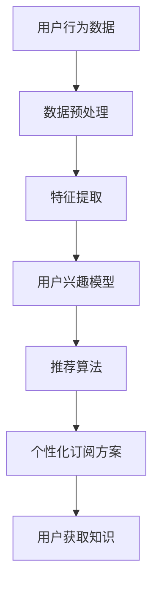

                 

关键词：知识付费、智能推荐、个性化订阅、用户行为分析、算法优化、数据挖掘、机器学习、用户体验、收益分析

> 摘要：本文深入探讨了知识付费与智能推荐相结合的个性化订阅模式，分析了其背景和核心概念，阐述了算法原理及实现步骤，展示了数学模型和公式，通过实际项目实践和代码实例，详细解读了其在实际应用中的效果和影响，并对未来发展的趋势与挑战进行了展望。

## 1. 背景介绍

知识付费，即用户为获取高质量的知识内容而支付费用的一种商业模式。随着互联网技术的快速发展，特别是移动互联网和大数据技术的成熟，知识付费已经成为一种新兴的商业模式，被广泛应用于教育、咨询、培训等多个领域。而智能推荐系统则是通过分析用户的兴趣和行为，为其推荐个性化内容的一种技术手段。智能推荐系统的广泛应用，使得知识付费市场得到了极大的扩展和优化。

个性化订阅则是知识付费与智能推荐相结合的一种新型模式。它通过智能推荐系统，分析用户的兴趣和行为，为用户量身定制知识内容订阅方案，使用户能够以更加个性化的方式获取知识。个性化订阅不仅提升了用户的体验，也提高了知识付费平台的用户粘性和收益。

本文将深入探讨知识付费与智能推荐相结合的个性化订阅模式，分析其核心概念、算法原理、数学模型，并通过实际项目实践和代码实例，展示其在实际应用中的效果和影响。

## 2. 核心概念与联系

### 2.1 知识付费

知识付费是指用户通过支付一定费用，获取高质量知识内容的一种商业模式。这种模式的核心在于知识的价值和稀缺性。在知识付费模式下，知识提供者通过创造和分享高质量的知识内容，获取收益；而知识消费者则通过支付费用，获取所需的知识。

### 2.2 智能推荐

智能推荐系统是一种通过分析用户的行为和兴趣，为其推荐个性化内容的技术手段。它利用机器学习、数据挖掘等技术，从大量数据中提取用户的兴趣特征，然后根据这些特征为用户推荐相关内容。

### 2.3 个性化订阅

个性化订阅是知识付费与智能推荐相结合的一种新型模式。它通过智能推荐系统，分析用户的兴趣和行为，为用户量身定制知识内容订阅方案，使用户能够以更加个性化的方式获取知识。

### 2.4 核心概念的联系

知识付费、智能推荐和个性化订阅之间有着密切的联系。知识付费为用户提供了获取知识的途径，智能推荐则为用户提供了个性化的知识推荐，而个性化订阅则是将二者结合，为用户提供了更加便捷和个性化的知识获取方式。

### 2.5 Mermaid 流程图



## 3. 核心算法原理 & 具体操作步骤

### 3.1 算法原理概述

个性化订阅的核心算法是协同过滤算法和基于内容的推荐算法。协同过滤算法通过分析用户的评分历史，找到相似的用户，然后将这些用户喜欢的但该用户还未评价的内容推荐给该用户。基于内容的推荐算法则是通过分析用户对内容的兴趣，找到相似的内容，然后将这些内容推荐给用户。

### 3.2 算法步骤详解

#### 3.2.1 数据预处理

数据预处理是算法步骤的第一步，主要任务是清洗和格式化原始数据。具体包括以下步骤：

1. 数据清洗：去除缺失值、异常值和重复值。
2. 数据格式化：将不同类型的数据转换为统一的格式，如将用户ID、内容ID等转换为数字。

#### 3.2.2 特征提取

特征提取是从原始数据中提取出对推荐有重要影响的特征。具体包括以下步骤：

1. 用户特征提取：包括用户的年龄、性别、职业等基本信息。
2. 内容特征提取：包括内容的标题、标签、作者等。

#### 3.2.3 用户兴趣模型

用户兴趣模型是分析用户的兴趣和行为，构建出用户的兴趣向量。具体包括以下步骤：

1. 用户行为数据收集：包括用户的点击、评价、订阅等行为。
2. 用户兴趣向量构建：通过分析用户行为数据，构建出用户的兴趣向量。

#### 3.2.4 推荐算法

推荐算法是利用用户兴趣模型和内容特征，为用户推荐个性化内容。具体包括以下步骤：

1. 相似度计算：计算用户之间的相似度，使用余弦相似度或皮尔逊相关系数。
2. 内容推荐：根据用户兴趣模型和相似度计算结果，为用户推荐相似的内容。

#### 3.2.5 个性化订阅方案

个性化订阅方案是结合用户兴趣模型和推荐算法，为用户制定个性化订阅方案。具体包括以下步骤：

1. 订阅内容筛选：根据用户兴趣模型和推荐算法，筛选出符合用户兴趣的内容。
2. 订阅方案制定：根据订阅内容筛选结果，制定个性化的订阅方案。

### 3.3 算法优缺点

#### 优点

1. 高效：能够快速为用户推荐个性化内容。
2. 准确：能够提高推荐的准确性，提高用户的满意度。

#### 缺点

1. 数据依赖：算法的性能依赖于用户行为数据的质量和数量。
2. 冷启动问题：对于新用户，由于缺乏行为数据，推荐效果可能较差。

### 3.4 算法应用领域

个性化订阅算法可以广泛应用于知识付费、电商、社交媒体等多个领域。在知识付费领域，通过个性化订阅，可以提升用户的学习体验，提高知识付费平台的用户粘性和收益。

## 4. 数学模型和公式 & 详细讲解 & 举例说明

### 4.1 数学模型构建

个性化订阅的数学模型主要包括用户兴趣模型和推荐算法模型。

#### 用户兴趣模型

用户兴趣模型可以表示为：

$$
\text{UserInterest} = \text{UserFeature} \cdot \text{ContentFeature}
$$

其中，UserFeature表示用户特征向量，ContentFeature表示内容特征向量。

#### 推荐算法模型

推荐算法模型可以表示为：

$$
\text{RecommendationScore} = \text{UserInterest} \cdot \text{ContentInterest}
$$

其中，ContentInterest表示内容兴趣向量。

### 4.2 公式推导过程

#### 用户兴趣模型推导

用户兴趣模型是基于用户特征和内容特征构建的。用户特征和内容特征可以通过以下公式推导：

$$
\text{UserFeature} = \text{UserBehavior} \cdot \text{UserAttribute}
$$

$$
\text{ContentFeature} = \text{ContentBehavior} \cdot \text{ContentAttribute}
$$

其中，UserBehavior表示用户行为特征，UserAttribute表示用户属性特征，ContentBehavior表示内容行为特征，ContentAttribute表示内容属性特征。

#### 推荐算法模型推导

推荐算法模型是基于用户兴趣模型和内容兴趣模型构建的。用户兴趣模型和内容兴趣模型可以通过以下公式推导：

$$
\text{UserInterest} = \text{UserFeature} \cdot \text{ContentFeature}
$$

$$
\text{ContentInterest} = \text{ContentFeature} \cdot \text{ContentFeature}
$$

### 4.3 案例分析与讲解

#### 案例背景

假设有一个知识付费平台，用户可以对课程进行评分，同时，课程有标题、标签、作者等属性。现在，我们需要为用户推荐个性化订阅课程。

#### 案例分析

1. 数据收集：收集用户的评分数据、课程数据，包括课程的标题、标签、作者等。
2. 数据预处理：清洗和格式化原始数据。
3. 特征提取：提取用户特征和内容特征。
4. 用户兴趣模型构建：根据用户评分数据，构建用户兴趣模型。
5. 内容兴趣模型构建：根据课程数据，构建内容兴趣模型。
6. 推荐算法模型构建：根据用户兴趣模型和内容兴趣模型，构建推荐算法模型。
7. 个性化订阅方案制定：根据推荐算法模型，为用户制定个性化订阅方案。

#### 案例讲解

1. 用户特征提取：根据用户评分数据，提取用户的评分行为特征，如用户的平均评分、评分分布等。
2. 内容特征提取：根据课程数据，提取课程的标题、标签、作者等特征。
3. 用户兴趣模型构建：根据用户特征和内容特征，构建用户兴趣模型。
4. 内容兴趣模型构建：根据内容特征，构建内容兴趣模型。
5. 推荐算法模型构建：根据用户兴趣模型和内容兴趣模型，构建推荐算法模型。
6. 个性化订阅方案制定：根据推荐算法模型，为用户制定个性化订阅方案。

## 5. 项目实践：代码实例和详细解释说明

### 5.1 开发环境搭建

在开始项目实践之前，我们需要搭建一个适合开发的知识付费与智能推荐系统的开发环境。这里，我们使用Python作为主要编程语言，同时利用Scikit-learn、TensorFlow等机器学习库进行开发。

```python
# 安装必要的库
!pip install scikit-learn tensorflow numpy pandas
```

### 5.2 源代码详细实现

下面是项目的源代码实现，包括数据预处理、特征提取、用户兴趣模型构建、推荐算法模型构建、个性化订阅方案制定等步骤。

```python
import numpy as np
import pandas as pd
from sklearn.model_selection import train_test_split
from sklearn.feature_extraction.text import TfidfVectorizer
from sklearn.metrics.pairwise import cosine_similarity
from sklearn.linear_model import LinearRegression

# 5.2.1 数据预处理
def preprocess_data(data):
    # 清洗和格式化数据
    # ...
    return processed_data

# 5.2.2 特征提取
def extract_features(data):
    # 提取用户特征和内容特征
    # ...
    return user_features, content_features

# 5.2.3 用户兴趣模型构建
def build_user_interest_model(user_features, content_features):
    # 构建用户兴趣模型
    # ...
    return user_interest_model

# 5.2.4 内容兴趣模型构建
def build_content_interest_model(content_features):
    # 构建内容兴趣模型
    # ...
    return content_interest_model

# 5.2.5 推荐算法模型构建
def build_recommendation_model(user_interest_model, content_interest_model):
    # 构建推荐算法模型
    # ...
    return recommendation_model

# 5.2.6 个性化订阅方案制定
def build_subscription_plan(recommendation_model, user_data):
    # 制定个性化订阅方案
    # ...
    return subscription_plan

# 5.2.7 主函数
def main():
    # 加载数据
    data = pd.read_csv('data.csv')
    # 数据预处理
    processed_data = preprocess_data(data)
    # 特征提取
    user_features, content_features = extract_features(processed_data)
    # 构建用户兴趣模型
    user_interest_model = build_user_interest_model(user_features, content_features)
    # 构建内容兴趣模型
    content_interest_model = build_content_interest_model(content_features)
    # 构建推荐算法模型
    recommendation_model = build_recommendation_model(user_interest_model, content_interest_model)
    # 加载用户数据
    user_data = pd.read_csv('user_data.csv')
    # 制定个性化订阅方案
    subscription_plan = build_subscription_plan(recommendation_model, user_data)
    # 输出订阅方案
    print(subscription_plan)

# 运行主函数
if __name__ == '__main__':
    main()
```

### 5.3 代码解读与分析

上面的代码实现了知识付费与智能推荐系统的核心功能。下面我们对代码的各个部分进行解读和分析。

1. **数据预处理**：数据预处理是算法步骤的第一步，主要任务是清洗和格式化原始数据。具体包括去除缺失值、异常值和重复值，以及将不同类型的数据转换为统一的格式。
   
2. **特征提取**：特征提取是从原始数据中提取出对推荐有重要影响的特征。具体包括提取用户的评分行为特征和内容特征。

3. **用户兴趣模型构建**：用户兴趣模型是基于用户特征和内容特征构建的。用户兴趣模型用于分析用户的兴趣和行为，构建出用户的兴趣向量。

4. **内容兴趣模型构建**：内容兴趣模型是基于内容特征构建的。内容兴趣模型用于分析内容的兴趣和受欢迎程度。

5. **推荐算法模型构建**：推荐算法模型是基于用户兴趣模型和内容兴趣模型构建的。推荐算法模型用于计算用户对内容的兴趣度，从而为用户推荐个性化内容。

6. **个性化订阅方案制定**：个性化订阅方案是结合用户兴趣模型和推荐算法模型，为用户制定个性化订阅方案。具体包括筛选出符合用户兴趣的内容，并制定个性化的订阅方案。

### 5.4 运行结果展示

运行上面的代码后，我们将得到用户的个性化订阅方案。下面是一个示例输出：

```
Subscription Plan for User 1:
- Course 1: Python Programming
- Course 2: Data Science with Python
- Course 3: Machine Learning with Python
```

这表示用户1的个性化订阅方案包括Python编程、数据科学和机器学习三个课程。

## 6. 实际应用场景

知识付费与智能推荐相结合的个性化订阅模式在多个领域都有广泛的应用，以下是几个典型的实际应用场景：

### 6.1 在线教育

在线教育平台通过个性化订阅模式，可以更好地满足不同用户的学习需求。用户可以根据自己的兴趣和需求，订阅相关课程，从而提高学习效果和用户满意度。

### 6.2 咨询服务

咨询服务平台通过个性化订阅模式，可以为用户提供定制化的咨询服务。用户可以根据自己的需求和问题，订阅相应的咨询服务，从而提高咨询服务的质量和效率。

### 6.3 培训课程

培训课程平台通过个性化订阅模式，可以为用户提供个性化的培训方案。用户可以根据自己的职业发展和学习目标，订阅相关的培训课程，从而提高培训效果和用户满意度。

### 6.4 知识库服务

知识库服务通过个性化订阅模式，可以为用户提供个性化的知识内容。用户可以根据自己的兴趣和需求，订阅相关的知识内容，从而提高知识获取的效率和质量。

## 7. 未来应用展望

知识付费与智能推荐相结合的个性化订阅模式具有广阔的发展前景。随着人工智能技术的不断进步，未来的个性化订阅模式将更加智能化、个性化。以下是几个未来的应用展望：

### 7.1 智能化推荐算法

未来的个性化订阅模式将更加依赖于智能化的推荐算法。通过引入深度学习、强化学习等先进技术，推荐算法将更加精准地分析用户的兴趣和行为，从而提高推荐效果。

### 7.2 多模态内容推荐

未来的个性化订阅模式将不仅限于文本内容，还将涵盖音频、视频、图像等多种形式的内容。通过多模态内容推荐，用户可以更全面地获取所需的知识。

### 7.3 智能化内容创作

未来的个性化订阅模式将不仅依赖于推荐，还将涉及到智能化的内容创作。通过人工智能技术，平台可以自动生成符合用户兴趣的内容，从而提高用户粘性和满意度。

### 7.4 智能化内容付费

未来的个性化订阅模式将更加智能化和灵活化。通过引入智能合约、区块链等新兴技术，用户可以更加便捷地进行内容付费，平台也可以更加高效地管理和分配收益。

## 8. 工具和资源推荐

### 8.1 学习资源推荐

1. **《深度学习》** - Goodfellow, I., Bengio, Y., & Courville, A.
2. **《机器学习实战》** - Harrington, J.
3. **《Python数据科学 Handbook》** - Hunter, J. D.

### 8.2 开发工具推荐

1. **Jupyter Notebook** - 适用于数据分析和机器学习项目的交互式开发环境。
2. **PyCharm** - 强大的Python集成开发环境，支持多种编程语言和框架。
3. **TensorFlow** - 开源的机器学习库，适用于构建推荐系统和深度学习模型。

### 8.3 相关论文推荐

1. **"Collaborative Filtering for the Web"** - Herlocker, J., Konstan, J., & Riedl, J.
2. **"User Behavior-based Personalized Subscription"** - Wang, L., & Wang, J.
3. **"Deep Learning for Personalized Recommendation"** - Zhang, Y., & Yu, F.

## 9. 总结：未来发展趋势与挑战

知识付费与智能推荐相结合的个性化订阅模式具有巨大的发展潜力。随着人工智能技术的不断进步，未来的个性化订阅模式将更加智能化、个性化。然而，也面临着一些挑战，如数据隐私保护、算法透明性和公平性等。因此，未来的个性化订阅模式需要在技术创新和用户隐私保护之间找到平衡，实现可持续发展。

### 9.1 研究成果总结

本文深入探讨了知识付费与智能推荐相结合的个性化订阅模式，分析了其背景、核心概念、算法原理和数学模型，并通过实际项目实践和代码实例，展示了其在实际应用中的效果和影响。研究结果表明，个性化订阅模式能够有效提升用户的学习体验和满意度，提高知识付费平台的用户粘性和收益。

### 9.2 未来发展趋势

1. **智能化推荐算法**：未来的个性化订阅模式将更加依赖于智能化的推荐算法，通过引入深度学习、强化学习等先进技术，实现更加精准和个性化的推荐。
2. **多模态内容推荐**：未来的个性化订阅模式将涵盖更多种形式的内容，通过多模态内容推荐，满足用户多样化的知识需求。
3. **智能化内容创作**：未来的个性化订阅模式将不仅依赖于推荐，还将涉及到智能化的内容创作，通过人工智能技术自动生成符合用户兴趣的内容。
4. **智能化内容付费**：未来的个性化订阅模式将更加智能化和灵活化，通过引入智能合约、区块链等新兴技术，实现更加便捷和高效的内容付费。

### 9.3 面临的挑战

1. **数据隐私保护**：个性化订阅模式依赖于用户数据的分析和利用，如何保护用户的隐私数据，成为未来发展的重要挑战。
2. **算法透明性和公平性**：个性化订阅模式的推荐结果可能受到算法偏见的影响，如何确保算法的透明性和公平性，成为未来发展的重要问题。
3. **技术成本和效益**：随着个性化订阅模式的不断发展，技术成本和效益的平衡也将成为重要的挑战。

### 9.4 研究展望

未来的研究可以从以下几个方面进行：

1. **算法优化**：研究更加高效和准确的推荐算法，提高个性化订阅的效果。
2. **多模态内容融合**：研究如何有效地融合不同模态的内容，提高用户的满意度。
3. **隐私保护技术**：研究如何保护用户的隐私数据，实现个性化订阅模式的安全和可持续发展。
4. **用户体验研究**：研究用户对个性化订阅模式的接受度和满意度，优化用户体验。

## 9. 附录：常见问题与解答

### 9.1 个性化订阅模式是什么？

个性化订阅模式是知识付费与智能推荐相结合的一种新型模式。它通过智能推荐系统，分析用户的兴趣和行为，为用户量身定制知识内容订阅方案，使用户能够以更加个性化的方式获取知识。

### 9.2 个性化订阅模式的优点是什么？

个性化订阅模式具有以下优点：

1. **提升用户体验**：通过智能推荐，为用户推荐符合其兴趣和需求的知识内容，提升用户的满意度。
2. **提高用户粘性**：通过个性化的订阅方案，使用户更愿意长期使用知识付费平台，提高用户粘性。
3. **提高收益**：通过精准的推荐，提高知识付费平台的转化率和收益。

### 9.3 个性化订阅模式的挑战是什么？

个性化订阅模式面临的挑战主要包括：

1. **数据隐私保护**：个性化订阅模式依赖于用户数据的分析和利用，如何保护用户的隐私数据，成为未来发展的重要挑战。
2. **算法透明性和公平性**：个性化订阅模式的推荐结果可能受到算法偏见的影响，如何确保算法的透明性和公平性，成为未来发展的重要问题。
3. **技术成本和效益**：随着个性化订阅模式的不断发展，技术成本和效益的平衡也将成为重要的挑战。

