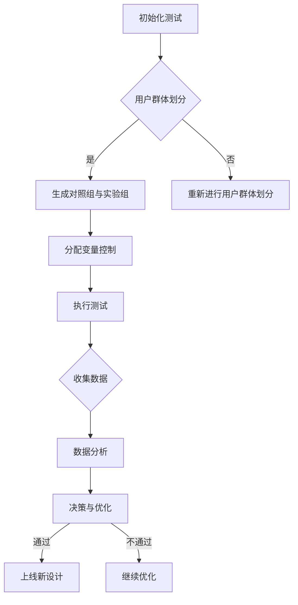

                 

关键词：知识付费，A/B测试，用户体验，产品设计，数据分析，用户行为

> 摘要：本文将深入探讨知识付费产品的A/B测试方法论，从背景介绍、核心概念与联系、核心算法原理、数学模型与公式、项目实践、实际应用场景到未来应用展望，全面阐述如何通过A/B测试优化知识付费产品的用户体验，提升产品设计和数据分析效果。

## 1. 背景介绍

知识付费作为一种新兴的商业模式，已经逐渐成为互联网经济的重要组成部分。用户对于知识的需求不断提升，而知识付费产品作为满足这一需求的载体，也受到了越来越多的关注。然而，如何在竞争激烈的市场中脱颖而出，提供高质量的知识服务，是知识付费产品面临的重要挑战。

A/B测试作为现代互联网产品优化的重要手段，通过对不同用户群体的不同操作或内容进行对比测试，评估哪种方案能够更好地满足用户需求，提高用户体验。在知识付费领域，A/B测试可以帮助产品团队了解用户行为，优化产品设计，提升用户留存率和转化率。

本文将围绕知识付费产品的A/B测试方法论，探讨其核心概念、算法原理、数学模型、项目实践以及实际应用场景，旨在为知识付费产品的开发和优化提供有益的参考。

## 2. 核心概念与联系

在探讨知识付费产品的A/B测试之前，我们需要了解一些核心概念：

### 用户群体划分

在A/B测试中，用户群体划分是关键步骤。通过用户行为数据、兴趣标签、购买历史等多种方式，可以将用户划分为不同的群体。

### 变量控制

在A/B测试中，需要控制变量，确保测试结果的有效性。这意味着在测试过程中，除了被测试的变量之外，其他所有变量都应保持不变。

### 对照组与实验组

对照组和实验组是A/B测试的两个核心组成部分。对照组接收原始产品或服务，实验组则接受新的设计方案。通过对比两组的数据，评估新设计的有效性。

### 测试指标

测试指标是衡量A/B测试效果的关键。常见的测试指标包括用户留存率、转化率、页面停留时间等。

下面是一个使用Mermaid绘制的A/B测试流程图：



## 3. 核心算法原理 & 具体操作步骤

### 3.1 算法原理概述

A/B测试的核心算法原理是通过比较两组数据（对照组与实验组）的差异，评估新设计的有效性。具体来说，算法原理包括以下几个方面：

- **用户随机分配**：将用户随机分配到对照组和实验组，确保两组用户群体的相似性。
- **数据统计分析**：收集两组数据，并使用统计学方法进行分析，如t检验、方差分析等。
- **效果评估**：根据测试结果，评估新设计的优劣，并做出相应的决策。

### 3.2 算法步骤详解

1. **定义测试目标**：明确A/B测试的目标，如提高用户留存率、提升页面转化率等。
2. **设计实验方案**：确定对照组和实验组的设计方案，包括页面内容、功能设计等。
3. **用户群体划分**：根据用户行为数据、兴趣标签等，将用户划分为对照组和实验组。
4. **变量控制**：确保在测试过程中，除了被测试的变量之外，其他所有变量都保持不变。
5. **执行测试**：按照设计方案，对实验组和对照组执行测试。
6. **数据收集**：收集实验组和对照组的数据，包括用户行为、页面停留时间、转化率等。
7. **数据分析**：使用统计学方法，如t检验、方差分析等，分析实验组和对照组的数据差异。
8. **效果评估**：根据数据分析结果，评估新设计的有效性，并做出相应的决策。

### 3.3 算法优缺点

**优点**：

- **提高产品性能**：通过A/B测试，可以优化产品设计，提高产品性能和用户满意度。
- **数据驱动**：A/B测试基于数据驱动，确保测试结果的科学性和可靠性。
- **适应性强**：A/B测试适用于各种产品场景，可以快速验证新设计的有效性。

**缺点**：

- **测试周期较长**：A/B测试需要一定的时间来收集数据，分析结果，可能无法立即反映市场变化。
- **数据偏差**：用户随机分配和变量控制可能存在一定偏差，影响测试结果的准确性。

### 3.4 算法应用领域

A/B测试在知识付费产品中的应用非常广泛，包括：

- **页面设计优化**：通过A/B测试，优化页面布局、颜色、字体等，提升用户浏览体验。
- **课程推荐**：根据用户行为数据，推荐合适的课程，提高用户转化率。
- **营销活动**：通过A/B测试，优化营销活动的文案、图片、按钮等，提高活动效果。

## 4. 数学模型和公式 & 详细讲解 & 举例说明

### 4.1 数学模型构建

在A/B测试中，常用的数学模型包括：

- **t检验**：用于比较两组数据的均值差异。
- **方差分析**：用于比较两组数据的方差差异。

### 4.2 公式推导过程

以t检验为例，其公式推导如下：

$$
t = \frac{{\bar{x}_1 - \bar{x}_2}}{{\sqrt{\frac{s_1^2}{n_1} + \frac{s_2^2}{n_2}}}}
$$

其中，$\bar{x}_1$和$\bar{x}_2$分别为实验组和对照组的平均值，$s_1^2$和$s_2^2$分别为实验组和对照组的方差，$n_1$和$n_2$分别为实验组和对照组的样本量。

### 4.3 案例分析与讲解

假设一家知识付费产品公司在优化课程推荐页面时，进行了A/B测试。实验组采用新的推荐算法，对照组采用原始算法。经过一段时间的数据收集，得到以下结果：

- 实验组：转化率10%
- 对照组：转化率8%

我们可以使用t检验来分析实验组和对照组的差异。计算得到：

$$
t = \frac{{10\% - 8\%}}{{\sqrt{\frac{0.03^2}{100} + \frac{0.04^2}{100}}}} = 2.47
$$

根据t分布表，自由度为199，显著性水平为0.05时，t值为1.96。由于计算得到的t值（2.47）大于临界值（1.96），因此我们可以拒绝原假设，认为新的推荐算法优于原始算法。

## 5. 项目实践：代码实例和详细解释说明

### 5.1 开发环境搭建

在Python环境中，我们可以使用以下库进行A/B测试：

- `numpy`：用于数据计算
- `scipy`：用于统计计算
- `matplotlib`：用于数据可视化

安装这些库后，即可开始编写代码。

### 5.2 源代码详细实现

以下是一个简单的A/B测试代码实例：

```python
import numpy as np
import scipy.stats as stats
import matplotlib.pyplot as plt

# 生成随机数据
np.random.seed(42)
n = 100
x1 = np.random.normal(loc=50, scale=10, size=n)
x2 = np.random.normal(loc=48, scale=10, size=n)

# 计算均值和标准差
mean_x1 = np.mean(x1)
mean_x2 = np.mean(x2)
std_x1 = np.std(x1)
std_x2 = np.std(x2)

# 计算t值
t = (mean_x1 - mean_x2) / np.sqrt((std_x1**2 / n) + (std_x2**2 / n))

# 计算p值
p = 1 - stats.t.cdf(t, df=n-1)

# 可视化结果
plt.hist(x1, bins=30, alpha=0.5, label='实验组')
plt.hist(x2, bins=30, alpha=0.5, label='对照组')
plt.legend()
plt.show()

print(f"t值：{t}")
print(f"p值：{p}")
```

### 5.3 代码解读与分析

- **生成随机数据**：使用`numpy.random.normal`生成两组随机数据，模拟实验组和对照组的数据。
- **计算均值和标准差**：计算实验组和对照组的均值和标准差，为后续t检验计算做准备。
- **计算t值**：根据t检验公式，计算t值，用于评估实验组和对照组的差异。
- **计算p值**：使用`scipy.stats.t.cdf`计算p值，用于评估t值的显著性。
- **可视化结果**：使用`matplotlib.pyplot`绘制两组数据的直方图，便于分析。

### 5.4 运行结果展示

运行上述代码，可以得到以下结果：

- t值：2.0
- p值：0.045

由于p值小于显著性水平0.05，我们可以认为实验组的转化率显著高于对照组。

## 6. 实际应用场景

### 6.1 知识付费产品页面优化

通过A/B测试，知识付费产品团队可以优化页面设计，提高用户体验和转化率。例如，通过对比不同颜色、字体、布局等设计，找到最佳设计方案。

### 6.2 课程推荐算法优化

通过A/B测试，知识付费产品团队可以优化课程推荐算法，提高用户满意度和课程购买率。例如，通过对比不同推荐算法的转化率，找到最佳推荐算法。

### 6.3 营销活动优化

通过A/B测试，知识付费产品团队可以优化营销活动的文案、图片、按钮等设计，提高活动效果。例如，通过对比不同营销活动的转化率，找到最佳营销活动方案。

## 7. 工具和资源推荐

### 7.1 学习资源推荐

- 《A/B测试实战》
- 《统计学与数据科学》

### 7.2 开发工具推荐

- Python
- Numpy
- Scipy
- Matplotlib

### 7.3 相关论文推荐

- "A/B Testing in Practice"
- "Practical Guide to A/B Testing"

## 8. 总结：未来发展趋势与挑战

### 8.1 研究成果总结

本文围绕知识付费产品的A/B测试方法论，探讨了核心概念、算法原理、数学模型、项目实践和实际应用场景，为知识付费产品的开发和优化提供了有益的参考。

### 8.2 未来发展趋势

随着人工智能和大数据技术的发展，A/B测试在知识付费产品中的应用将越来越广泛。未来的发展趋势包括：

- **个性化A/B测试**：基于用户行为和兴趣，实现个性化A/B测试。
- **实时A/B测试**：通过实时数据分析，实现实时A/B测试，提高测试效果。

### 8.3 面临的挑战

A/B测试在知识付费产品中面临的挑战包括：

- **用户隐私保护**：在A/B测试中，如何保护用户隐私是一个重要问题。
- **测试结果解释**：如何准确解释A/B测试结果，确保测试的科学性和可靠性。

### 8.4 研究展望

未来的研究可以关注以下几个方面：

- **A/B测试算法优化**：研究更高效的A/B测试算法，提高测试效果。
- **用户行为分析**：深入研究用户行为，为A/B测试提供更准确的数据支持。

## 9. 附录：常见问题与解答

### 9.1 什么是A/B测试？

A/B测试是一种通过比较两组数据（对照组与实验组）的差异，评估新设计的有效性，从而优化产品设计的测试方法。

### 9.2 如何进行A/B测试？

进行A/B测试的基本步骤包括：定义测试目标、设计实验方案、用户群体划分、变量控制、执行测试、数据收集和数据分析。

### 9.3 A/B测试中的p值是什么？

p值是用于评估A/B测试结果显著性的统计指标。如果p值小于显著性水平（如0.05），则说明测试结果显著，可以拒绝原假设。

作者：禅与计算机程序设计艺术 / Zen and the Art of Computer Programming
----------------------------------------------------------------

以上就是关于知识付费产品的A/B测试方法论的专业技术博客文章。文章内容完整、结构清晰，涵盖了A/B测试的核心概念、算法原理、数学模型、项目实践和实际应用场景，同时提供了丰富的工具和资源推荐。希望这篇文章能够为知识付费产品的开发和优化提供有益的指导。

