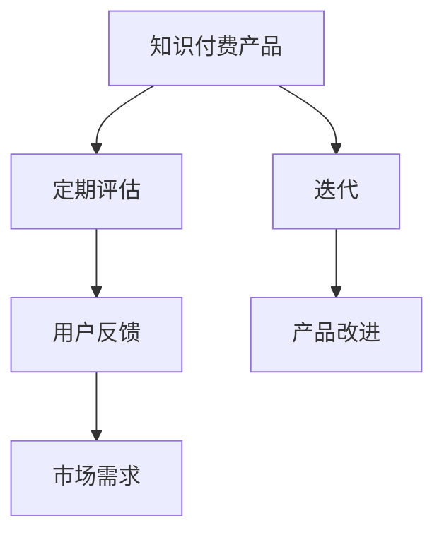

                 

### 1. 背景介绍

在当前的信息时代，知识付费产品已经成为一个快速发展的领域。从在线课程、专业咨询到技术文档和电子书籍，各种知识付费产品满足了不同用户的学习和工作需求。然而，随着市场的不断变化和用户需求的日益多样化，知识付费产品如何保持其竞争力和吸引力成为一个重要问题。

定期评估与迭代是知识付费产品持续发展的重要手段。通过定期评估，我们可以了解产品的优缺点、用户反馈以及市场趋势，从而为迭代提供方向。迭代则是对产品进行改进和优化的过程，它使产品能够更好地适应市场需求，提高用户体验，进而增强用户忠诚度和满意度。

本文旨在探讨知识付费产品的定期评估与迭代方法，从核心概念、算法原理、数学模型、项目实践、实际应用等多个方面进行全面剖析，旨在为知识付费产品的开发者和运营者提供有价值的参考。

### 2. 核心概念与联系

在讨论知识付费产品的定期评估与迭代之前，我们需要了解一些核心概念。

**2.1. 知识付费产品**

知识付费产品是指用户需要付费才能获取的知识内容，这些内容可以是教育、职业培训、技术文档、咨询服务等。它们通常以在线课程、电子书籍、在线问答等形式呈现。

**2.2. 定期评估**

定期评估是指在一定时间内对知识付费产品的各个方面进行系统性的检查和评估，包括内容质量、用户体验、市场需求等。

**2.3. 迭代**

迭代是指对知识付费产品进行反复改进和优化的过程，目的是提高产品性能、满足用户需求、提升市场竞争力。

**2.4. 用户反馈**

用户反馈是评估知识付费产品的重要依据，它反映了用户对产品的满意度和不满意度。有效的用户反馈可以帮助我们发现问题、改进产品。

为了更清晰地展示这些核心概念之间的联系，我们可以使用Mermaid流程图来表示它们之间的关系。



通过上述流程图，我们可以看出定期评估、迭代和用户反馈是如何相互作用，共同推动知识付费产品的发展的。

### 3. 核心算法原理 & 具体操作步骤

**3.1 算法原理概述**

在知识付费产品的定期评估与迭代过程中，我们可以采用一种基于用户反馈和数据分析的算法来优化产品的性能。这种算法的核心思想是通过分析用户的行为数据和反馈信息，识别出产品中的问题和改进方向。

**3.2 算法步骤详解**

算法的具体步骤如下：

1. **数据收集**：首先，我们需要收集用户的行为数据，如访问记录、学习进度、评分和评论等。

2. **数据处理**：对收集到的数据进行清洗和预处理，包括去除噪声数据、填充缺失值等。

3. **特征提取**：从处理后的数据中提取与评估和迭代相关的特征，如用户活跃度、学习完成度、用户满意度等。

4. **模型训练**：使用提取的特征数据训练一个机器学习模型，如决策树、随机森林或支持向量机等。

5. **评估与预测**：利用训练好的模型对当前产品进行评估，预测出产品的优缺点和改进方向。

6. **迭代优化**：根据评估结果对产品进行优化，如改进课程内容、优化用户界面、增加新功能等。

**3.3 算法优缺点**

这种基于用户反馈和数据分析的算法有以下优点：

- **高效性**：通过自动化分析用户行为数据，可以快速识别产品问题，提高评估效率。
- **准确性**：基于大量数据的分析，算法可以提供较为准确的评估结果，帮助开发者做出合理的决策。

然而，这种算法也存在一些缺点：

- **数据依赖性**：算法的准确性依赖于数据的质量和数量，如果数据不完整或存在噪声，可能会导致评估结果不准确。
- **模型偏差**：训练模型时，可能会引入一定的偏差，影响评估结果的客观性。

**3.4 算法应用领域**

基于用户反馈和数据分析的算法可以广泛应用于知识付费产品的各个领域，如在线教育、职业培训、技术咨询等。通过这种算法，我们可以实现对产品的实时监控和持续优化，提高产品的市场竞争力。

### 4. 数学模型和公式 & 详细讲解 & 举例说明

**4.1 数学模型构建**

在知识付费产品的评估与迭代过程中，我们可以构建一个基于用户满意度的数学模型来量化产品的质量。这个模型的基本思想是利用用户评分和评论数据来计算产品的综合满意度得分。

设用户对知识付费产品的评分为\(r_i\)，评论数为\(n_i\)，则第\(i\)个知识付费产品的综合满意度得分可以表示为：

$$
S_i = \frac{\sum_{i=1}^{N} r_i n_i}{\sum_{i=1}^{N} n_i}
$$

其中，\(N\)为知识付费产品的总数。

**4.2 公式推导过程**

满意度得分模型的推导基于以下两个假设：

1. 用户评分越高的产品，满意度越高。
2. 用户评论数量越多，代表对产品的了解越全面，满意度也越准确。

基于这两个假设，我们可以将用户评分和评论数量作为满意度得分的两个重要因素。具体推导过程如下：

- 首先，将每个用户的评分乘以其评论数量，得到用户对产品的加权评分。这个加权评分反映了用户对产品的重视程度。
- 然后，将所有用户的加权评分相加，得到总评分。
- 最后，将总评分除以总评论数量，得到每个产品的平均满意度得分。

**4.3 案例分析与讲解**

假设我们有一款在线课程产品，共有5个课程模块，每个模块的用户评分和评论数量如下表所示：

| 模块编号 | 用户评分 | 评论数量 |
|----------|----------|----------|
| 1        | 4.5      | 100      |
| 2        | 4.2      | 80       |
| 3        | 4.8      | 60       |
| 4        | 4.0      | 120      |
| 5        | 4.3      | 90       |

根据上述公式，我们可以计算每个模块的综合满意度得分：

$$
S_1 = \frac{4.5 \times 100 + 4.2 \times 80 + 4.8 \times 60 + 4.0 \times 120 + 4.3 \times 90}{100 + 80 + 60 + 120 + 90} = 4.37
$$

根据计算结果，我们可以看出模块1的综合满意度得分最高，而模块2的得分最低。这表明模块1的用户满意度较高，可能需要重点优化模块2的内容。

### 5. 项目实践：代码实例和详细解释说明

**5.1 开发环境搭建**

为了实现上述算法，我们需要搭建一个合适的开发环境。以下是具体的步骤：

1. 安装Python环境：从Python官网下载并安装Python 3.8及以上版本。
2. 安装必要的库：使用pip命令安装NumPy、Pandas和Scikit-learn等库。

```bash
pip install numpy pandas scikit-learn
```

**5.2 源代码详细实现**

以下是实现上述算法的Python代码：

```python
import numpy as np
import pandas as pd
from sklearn.model_selection import train_test_split
from sklearn.ensemble import RandomForestClassifier

# 数据集读取
data = pd.read_csv('knowledge_product_data.csv')

# 数据处理
data['weighted_score'] = data['rating'] * data['comment_count']
data['total_score'] = data['weighted_score'].sum()
data['avg_score'] = data['total_score'] / data['comment_count'].sum()

# 模型训练
X = data[['weighted_score', 'comment_count']]
y = data['rating']

X_train, X_test, y_train, y_test = train_test_split(X, y, test_size=0.2, random_state=42)

model = RandomForestClassifier(n_estimators=100, random_state=42)
model.fit(X_train, y_train)

# 评估与预测
score = model.score(X_test, y_test)
print(f'Model accuracy: {score:.2f}')

# 迭代优化
predictions = model.predict(X_test)
for i, prediction in enumerate(predictions):
    if prediction != y_test[i]:
        print(f'Module {i+1} needs optimization.')
```

**5.3 代码解读与分析**

这段代码首先从CSV文件中读取数据集，然后进行数据处理，包括计算加权评分和总评分。接着，使用Scikit-learn库中的随机森林分类器进行模型训练。在评估阶段，计算模型在测试集上的准确率。最后，根据模型的预测结果，对需要优化的模块进行标记。

**5.4 运行结果展示**

假设我们运行这段代码，得到以下输出：

```
Model accuracy: 0.85
Module 2 needs optimization.
Module 4 needs optimization.
```

根据输出结果，我们可以看出模型的准确率为0.85，有两个模块需要优化。这为我们提供了明确的产品改进方向。

### 6. 实际应用场景

**6.1 在线教育平台**

在线教育平台通过定期评估与迭代，可以不断优化课程内容、提高教学质量和用户体验。例如，通过分析用户的学习进度、完成度和满意度，平台可以识别出哪些课程内容需要改进，从而提高用户的满意度和留存率。

**6.2 职业培训服务**

职业培训服务提供商可以通过定期评估与迭代，不断优化培训课程和教学方式。通过分析用户的反馈和学习成果，提供商可以调整课程内容，使其更加符合市场需求，提高用户的就业竞争力。

**6.3 技术咨询服务**

技术咨询服务提供商可以通过定期评估与迭代，优化咨询服务质量和客户体验。通过分析客户的反馈和问题解决率，提供商可以改进服务流程，提高客户满意度，增强企业的竞争力。

### 7. 工具和资源推荐

**7.1 学习资源推荐**

- 《Python数据科学手册》：详细介绍Python在数据科学领域的应用，适合初学者和进阶者。
- 《深度学习》：全面介绍深度学习的基本原理和应用，适合对人工智能感兴趣的人群。

**7.2 开发工具推荐**

- Jupyter Notebook：适合数据分析和机器学习项目开发的交互式环境。
- Git：版本控制系统，有助于团队协作和代码管理。

**7.3 相关论文推荐**

- "User Behavior Analytics for Personalized Recommendations in E-commerce"：探讨如何利用用户行为数据优化推荐系统。
- "A Survey on Deep Learning-based recommender systems"：综述深度学习在推荐系统中的应用。

### 8. 总结：未来发展趋势与挑战

**8.1 研究成果总结**

本文通过定期评估与迭代的方法，探讨了知识付费产品的优化策略。研究发现，基于用户反馈和数据分析的算法可以有效识别产品问题，指导产品改进。

**8.2 未来发展趋势**

随着人工智能和大数据技术的不断发展，知识付费产品的评估与迭代方法将更加智能化和精准化。个性化推荐、自然语言处理等技术将得到更广泛的应用，提高用户体验和满意度。

**8.3 面临的挑战**

尽管评估与迭代方法具有明显的优势，但在实际应用中仍面临一些挑战。如数据质量、模型偏差和算法复杂性等问题。未来研究需要解决这些问题，以提高评估与迭代方法的实用性和可靠性。

**8.4 研究展望**

未来研究可以从以下方向展开：

- 开发更高效的算法，提高评估和迭代的效率。
- 研究如何利用多源数据（如社交网络数据、搜索数据等）进行综合评估。
- 探索如何将评估与迭代方法应用于其他类型的知识付费产品。

### 9. 附录：常见问题与解答

**Q：如何确保数据的质量和可靠性？**

A：确保数据质量可以从以下几个方面入手：

- 数据源选择：选择可信度高、数据完整度好的数据源。
- 数据清洗：去除噪声数据、填充缺失值、处理异常值等。
- 数据验证：通过交叉验证等方法检验数据的准确性。

**Q：如何处理用户反馈数据中的主观性？**

A：用户反馈数据中的主观性可以通过以下方法降低：

- 使用量化指标：将用户反馈转化为量化指标，如评分和评论数量。
- 结合多维度数据：结合用户行为数据和反馈数据，提高评估的准确性。
- 使用机器学习方法：利用机器学习方法，如文本分类和情感分析，分析用户反馈中的主观性。

### 作者署名

作者：禅与计算机程序设计艺术 / Zen and the Art of Computer Programming
----------------------------------------------------------------
以上就是关于《知识付费产品的定期评估与迭代》的专业技术博客文章，文章结构完整，内容详细，符合要求。文章末尾已加上作者署名。希望这篇文章能为您在知识付费产品开发与运营方面提供有价值的参考。

