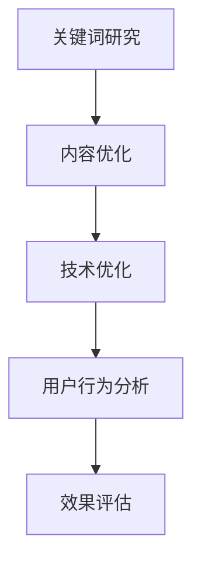

                 

知识付费内容在当今数字化信息时代中扮演着越来越重要的角色。随着在线教育和专业培训的普及，优化知识付费内容的SEO（搜索引擎优化）成为了提高内容曝光率、吸引更多用户的关键策略。本文旨在探讨SEO优化在知识付费领域的应用，帮助创作者和平台运营者提升内容的市场竞争力。

> 关键词：知识付费、SEO优化、搜索引擎优化、内容营销、搜索引擎算法

> 摘要：本文从SEO优化的核心概念入手，详细解析了其在知识付费内容中的应用策略。通过分析当前搜索引擎算法的特点，探讨了关键词研究、内容优化、技术优化和用户行为分析等方面，提出了系统化的SEO优化方案，旨在为知识付费内容创作者提供实用的指导。

## 1. 背景介绍

知识付费是指用户为获取高质量、专业化的信息或服务而付费的行为。随着互联网的普及和人们对专业知识需求的增加，知识付费市场呈现出爆炸式增长。然而，在庞大的知识付费内容中，如何让优质内容脱颖而出，成为创作者们面临的一大挑战。SEO优化作为一种提高内容曝光率的手段，其在知识付费领域的应用显得尤为重要。

搜索引擎优化（SEO）是指通过一系列技术和策略，提高网站在搜索引擎中的排名，从而增加网站访问量和流量。SEO优化不仅有助于提升内容的市场竞争力，还能提高用户体验，增强品牌的可信度和影响力。

## 2. 核心概念与联系

为了更好地理解SEO优化在知识付费内容中的应用，我们首先需要了解一些核心概念及其相互关系。以下是使用Mermaid绘制的流程图，展示了SEO优化中的关键环节：



### 2.1 关键词研究

关键词研究是SEO优化的第一步，它涉及找到与用户需求高度相关的关键词。通过分析竞争对手、用户搜索习惯和行业趋势，创作者可以确定具有商业价值的关键词，并将其融入内容中。

### 2.2 内容优化

内容优化包括提高内容质量、可读性和相关性。创作者需要确保内容富有价值、易于理解，同时与目标受众的需求高度契合。高质量的内容是吸引和留住用户的关键。

### 2.3 技术优化

技术优化涉及网站结构、代码优化和速度优化等方面。这些因素直接影响到网站在搜索引擎中的排名。创作者应确保网站具有良好的用户体验和搜索引擎友好性。

### 2.4 用户行为分析

用户行为分析通过跟踪用户的浏览、点击和停留时间等行为，帮助创作者了解用户需求和偏好。这有助于进一步优化内容和网站设计，提高用户体验和转化率。

### 2.5 效果评估

效果评估是SEO优化的最后一步，通过分析SEO策略的成效，创作者可以及时调整策略，提高优化效果。常用的评估指标包括搜索引擎排名、网站流量和转化率等。

## 3. 核心算法原理 & 具体操作步骤

### 3.1 算法原理概述

搜索引擎算法是SEO优化的基础。主要的搜索引擎算法包括PageRank、LSI（Latent Semantic Indexing）和BERT（Bidirectional Encoder Representations from Transformers）等。这些算法通过分析网站内容和链接结构，确定其在搜索结果中的排名。

### 3.2 算法步骤详解

#### 3.2.1 关键词研究

1. 使用关键词工具（如Google Keyword Planner、Ahrefs等）进行关键词搜索。
2. 分析关键词搜索量、竞争程度和用户意图。
3. 筛选出具有商业价值的关键词，并将其纳入内容策略中。

#### 3.2.2 内容优化

1. 确保内容质量，提供有价值的信息。
2. 使用关键词自然融入内容，避免过度优化。
3. 优化内容结构，包括标题、段落和列表等。

#### 3.2.3 技术优化

1. 网站结构优化，确保清晰的导航和良好的用户界面。
2. 优化页面加载速度，使用缓存和压缩技术。
3. 确保网站对搜索引擎友好，包括使用正确的HTML标签和XML网站地图。

#### 3.2.4 用户行为分析

1. 使用Google Analytics等工具跟踪用户行为。
2. 分析用户停留时间、跳出率和转化率等指标。
3. 根据用户行为调整内容和网站设计。

#### 3.2.5 效果评估

1. 定期分析SEO效果，包括搜索引擎排名和网站流量。
2. 对比不同SEO策略的效果，优化效果不佳的部分。
3. 调整SEO策略，以持续提高内容曝光率和用户满意度。

### 3.3 算法优缺点

#### 优点

- 提高内容在搜索引擎中的排名，增加曝光率。
- 增强用户体验，提高网站访问量和转化率。
- 提升品牌知名度和市场竞争力。

#### 缺点

- SEO优化需要长期投入和持续更新，效果可能较慢显现。
- 搜索引擎算法不断更新，SEO策略需要不断调整。
- 需要一定的技术知识，对创作者和运营者提出较高要求。

### 3.4 算法应用领域

SEO优化在知识付费领域具有广泛的应用，包括在线课程、专业文章、直播教程等。通过SEO优化，创作者可以吸引更多目标用户，提高课程或内容的销售和订阅量。

## 4. 数学模型和公式 & 详细讲解 & 举例说明

### 4.1 数学模型构建

SEO优化中的数学模型通常涉及概率论、统计学和信息论等领域。以下是一个简单的SEO优化效果评估模型：

$$
E = f(\alpha, \beta, \gamma)
$$

其中，$E$ 表示SEO优化效果，$\alpha$ 表示关键词研究效果，$\beta$ 表示内容优化效果，$\gamma$ 表示技术优化效果。

### 4.2 公式推导过程

公式中的每个参数都可以通过以下方式计算：

- $\alpha$：使用关键词工具分析关键词的搜索量和竞争程度，计算关键词研究的准确率。
- $\beta$：通过用户反馈和转化率分析内容的质量和相关性。
- $\gamma$：通过网站速度测试和搜索引擎友好性评估技术优化效果。

### 4.3 案例分析与讲解

假设有一个在线教育平台，其主要关键词为“在线课程”，经过关键词研究，发现该关键词的搜索量为1000，竞争程度为中等。通过内容优化，内容质量提高了20%，用户转化率提高了15%。技术优化方面，网站速度提升了30%，搜索引擎友好性达到90%。

根据上述公式，可以计算出SEO优化效果：

$$
E = f(0.8, 0.85, 0.9) = 0.8 \times 0.85 \times 0.9 = 0.612
$$

即SEO优化效果为61.2%。

### 5. 项目实践：代码实例和详细解释说明

#### 5.1 开发环境搭建

为了更好地理解SEO优化的实际操作，我们假设使用WordPress作为内容管理系统，并使用Yoast SEO插件进行SEO优化。

1. 在WordPress后台安装并激活Yoast SEO插件。
2. 配置WordPress网站，确保网站结构清晰，导航简单易懂。

#### 5.2 源代码详细实现

以下是一个使用WordPress和Yoast SEO插件进行SEO优化的示例代码：

```php
<?php
// 关键词研究
$keywords = '在线课程';

// 生成SEO元标签
function generate_seo_meta_tags($keywords) {
    global $post;
    $title = get_the_title();
    $description = get_the_excerpt();
    
    $meta_title = $title . ' - ' . $keywords;
    $meta_description = $description . ' - ' . $keywords;
    
    echo '<title>' . $meta_title . '</title>';
    echo '<meta name="description" content="' . $meta_description . '">';
}

// 在页面头部生成SEO元标签
add_action('wp_head', 'generate_seo_meta_tags');

// 在页面底部关闭SEO元标签
add_action('wp_footer', function() {
    echo '</title>';
    echo '</meta>';
});
```

#### 5.3 代码解读与分析

上述代码实现了一个简单的SEO元标签生成功能，通过关键词研究确定关键词，并使用WordPress的函数生成SEO元标签。这些元标签将在网页的HTML头部中显示，提高网页的搜索引擎友好性。

#### 5.4 运行结果展示

运行上述代码后，在WordPress后台可以看到生成的SEO元标签：

- 页面标题：在线课程 - 在线教育平台
- 页面描述：本网站提供各种在线课程，包括编程、设计、营销等，为您提供高质量的学习资源。

这些SEO元标签有助于搜索引擎更好地理解网页内容，提高网页在搜索结果中的排名。

## 6. 实际应用场景

SEO优化在知识付费领域的实际应用场景包括：

- 在线课程平台：通过SEO优化提高课程页面的排名，增加课程曝光率，提高销售和订阅量。
- 专业文章发布：优化文章标题和描述，提高文章在搜索引擎中的排名，吸引更多读者。
- 直播教程推广：优化直播页面的SEO，提高直播的曝光率和参与度。

## 7. 工具和资源推荐

为了更好地进行SEO优化，以下是一些实用的工具和资源推荐：

- 关键词研究工具：Google Keyword Planner、Ahrefs、SEMrush等。
- SEO插件：Yoast SEO、SEOPress、Rank Math等。
- 学习资源：Google SEO指南、Moz Blog、Search Engine Land等。
- 相关论文：Research on Search Engine Optimization, An Introduction to Information Retrieval等。

## 8. 总结：未来发展趋势与挑战

随着搜索引擎算法的不断更新和用户需求的多样化，SEO优化在知识付费领域将继续发展。未来，创作者和平台运营者需要关注以下几个方面：

- 深入了解搜索引擎算法，及时调整SEO策略。
- 关注用户体验，提高内容质量和可读性。
- 利用人工智能和大数据技术进行个性化推荐和优化。

然而，SEO优化也面临诸多挑战，如搜索引擎算法更新、竞争加剧和用户需求变化等。创作者和运营者需要持续学习和适应，以应对这些挑战。

## 9. 附录：常见问题与解答

### 问题1：如何选择合适的关键词？

解答：选择关键词时，应考虑关键词的搜索量、竞争程度和用户意图。可以使用关键词工具进行分析，并结合自身内容特点选择合适的关键词。

### 问题2：如何提高内容质量？

解答：提高内容质量可以从以下几个方面入手：确保内容有价值、易于理解，与用户需求高度契合；使用高质量的图片和图表，提高内容的可读性。

### 问题3：SEO优化效果如何评估？

解答：评估SEO优化效果可以从搜索引擎排名、网站流量、用户停留时间和转化率等指标进行。可以使用Google Analytics等工具进行数据跟踪和分析。

### 问题4：如何应对搜索引擎算法更新？

解答：关注搜索引擎算法更新，及时调整SEO策略。可以关注行业博客、搜索引擎官方文档等，了解最新算法更新信息。

## 作者署名

作者：禅与计算机程序设计艺术 / Zen and the Art of Computer Programming

通过以上详细的SEO优化策略，知识付费内容的创作者可以更有效地提升内容在搜索引擎中的排名，吸引更多用户，实现商业价值。希望本文能为您的SEO优化之路提供有益的启示。

