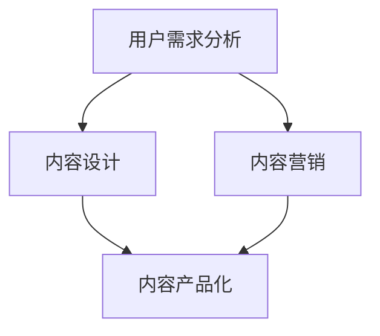

                 

 在当前信息爆炸的时代，知识付费已经成为一种新兴的商业模式。然而，如何将知识有效地转化为具有市场竞争力的产品，成为知识付费创业中的关键问题。本文将探讨内容产品化的策略，从核心概念、算法原理、数学模型、项目实践、实际应用以及未来发展等多个方面，全面解析知识付费创业的路径。

## 关键词
- 知识付费
- 内容产品化
- 内容营销
- 用户需求分析
- 商业模式

## 摘要
本文通过深入分析知识付费市场的现状，探讨了内容产品化的核心策略。从用户需求挖掘、内容设计、算法优化、数学模型构建到实际项目实践，为知识付费创业者提供了系统化的指导。文章还对未来知识付费的发展趋势和面临的挑战进行了展望，旨在为创业者提供有价值的参考。

## 1. 背景介绍

知识付费作为一种商业模式，起源于用户对优质内容的需求。在互联网时代，信息获取变得更加便捷，但同时也带来了信息过载的问题。用户渴望获取有价值、有深度、个性化的内容，而知识付费正是满足这一需求的解决方案。知识付费平台通过提供专业的课程、教程、文章等，让用户愿意为知识付费，实现了知识的有价化和商业化。

然而，知识付费市场也存在着激烈的竞争。如何在众多竞争对手中脱颖而出，打造出有差异化的内容产品，成为知识付费创业者面临的重要问题。内容产品化策略，正是解决这一问题的关键。

内容产品化不仅仅是将知识转化为电子文档或视频，更重要的是要进行深度加工和优化，使其具有独特的价值和吸引力。本文将围绕内容产品化的各个方面，详细探讨其实现策略。

## 2. 核心概念与联系

在探讨内容产品化的策略之前，我们需要明确几个核心概念：

- **知识付费**：用户为了获取特定知识而支付的费用。
- **内容产品化**：将知识转化为具有市场竞争力的产品，包括内容设计、算法优化、用户交互等环节。
- **用户需求分析**：了解用户的需求，为内容设计提供依据。
- **内容营销**：通过内容吸引和留住用户，实现商业目标。

这些概念之间存在着密切的联系。用户需求分析是内容产品化的起点，决定了内容的方向和定位。内容营销是实现用户需求的重要手段，通过吸引和留住用户，提升产品的市场竞争力。而内容产品化则是将这些核心概念具体化为可操作的实施步骤。

下面是一个简单的 Mermaid 流程图，展示了这些核心概念之间的联系：



### 2.1 用户需求分析

用户需求分析是内容产品化的第一步。了解用户的需求，有助于为内容设计提供方向和依据。以下是一些常用的用户需求分析方法：

- **问卷调查**：通过问卷调查收集用户对特定知识的需求和期望。
- **访谈**：与目标用户进行深入访谈，了解他们的真实需求和痛点。
- **用户行为分析**：通过分析用户在知识付费平台上的行为数据，挖掘潜在需求。
- **竞争分析**：研究竞争对手的产品和服务，了解市场空白和机会。

### 2.2 内容设计

内容设计是内容产品化的核心环节。一个优秀的课程或教程应该具备以下几个特点：

- **针对性**：针对用户的具体需求，提供有针对性的内容。
- **系统性**：内容应该具有一定的系统性，帮助用户建立完整的知识体系。
- **实用性**：内容应该具有实用性，帮助用户解决实际问题。
- **互动性**：增加用户与内容之间的互动，提升用户体验。

### 2.3 内容营销

内容营销是实现用户需求的重要手段。以下是一些常用的内容营销策略：

- **社交媒体推广**：利用社交媒体平台，扩大内容的传播范围。
- **SEO 优化**：通过搜索引擎优化，提升内容的搜索排名。
- **KOL 合作**：与行业内的意见领袖合作，提升内容的权威性和影响力。
- **用户互动**：通过评论、问答等互动方式，增强用户对内容的参与感。

### 2.4 内容产品化

内容产品化是将知识转化为具有市场竞争力的产品的过程。以下是一些内容产品化的关键步骤：

- **内容策划**：明确内容的产品定位、目标用户和核心价值。
- **内容创作**：根据策划方案，进行内容的创作和编辑。
- **内容优化**：对内容进行优化，提升用户体验和内容质量。
- **内容推广**：通过多种渠道，推广内容产品，吸引潜在用户。

## 3. 核心算法原理 & 具体操作步骤

### 3.1 算法原理概述

在内容产品化过程中，算法发挥着重要作用。以下是几个关键算法的原理概述：

- **用户行为分析算法**：通过分析用户在知识付费平台上的行为数据，挖掘用户的需求和偏好。
- **内容推荐算法**：根据用户的行为数据和内容特征，推荐用户感兴趣的内容。
- **自然语言处理算法**：用于内容创作和编辑，提升内容的表达和准确性。
- **数据挖掘算法**：用于分析大量用户数据，发现潜在的商业机会和用户需求。

### 3.2 算法步骤详解

#### 3.2.1 用户行为分析算法

用户行为分析算法主要包括以下几个步骤：

1. **数据采集**：收集用户在平台上的行为数据，如浏览记录、购买行为、评论等。
2. **数据预处理**：清洗和整理数据，去除噪声和重复数据。
3. **特征提取**：从行为数据中提取特征，如用户的活跃度、购买频率、评论倾向等。
4. **模型训练**：使用机器学习算法，如决策树、随机森林等，训练用户行为分析模型。
5. **模型评估**：使用交叉验证等方法，评估模型的准确性和泛化能力。
6. **模型部署**：将训练好的模型部署到生产环境中，实时分析用户行为。

#### 3.2.2 内容推荐算法

内容推荐算法主要包括以下几个步骤：

1. **内容特征提取**：从内容中提取特征，如关键词、主题、情感等。
2. **用户特征提取**：从用户行为数据中提取特征，如兴趣偏好、行为模式等。
3. **相似度计算**：计算用户与内容之间的相似度，如余弦相似度、欧氏距离等。
4. **推荐生成**：根据相似度计算结果，生成推荐列表，排序推荐内容。
5. **推荐评估**：评估推荐结果的准确性和用户满意度。

#### 3.2.3 自然语言处理算法

自然语言处理算法主要包括以下几个步骤：

1. **分词**：将文本分为词语或句子，为后续处理提供基础。
2. **词性标注**：对词语进行词性标注，如名词、动词、形容词等。
3. **句法分析**：分析句子的结构和语法规则，如主语、谓语、宾语等。
4. **语义分析**：理解句子的含义和情感倾向，如积极、消极、中立等。
5. **文本生成**：根据语义分析结果，生成新的文本内容。

#### 3.2.4 数据挖掘算法

数据挖掘算法主要包括以下几个步骤：

1. **数据收集**：收集大量用户数据，如行为数据、评论数据等。
2. **数据预处理**：清洗和整理数据，去除噪声和重复数据。
3. **特征工程**：从数据中提取特征，如用户的活跃度、购买频率等。
4. **模型选择**：选择合适的数据挖掘算法，如聚类、分类、关联规则等。
5. **模型训练**：训练数据挖掘模型，提取潜在的规律和模式。
6. **模型评估**：评估数据挖掘模型的准确性和泛化能力。
7. **模型部署**：将训练好的模型部署到生产环境中，实时分析用户数据。

### 3.3 算法优缺点

#### 3.3.1 用户行为分析算法

**优点**：

- 可以实时了解用户的需求和偏好，为内容设计提供依据。
- 可以根据用户行为，进行个性化的内容推荐，提升用户体验。

**缺点**：

- 需要大量的行为数据，对数据的收集和处理要求较高。
- 模型的训练和部署成本较高。

#### 3.3.2 内容推荐算法

**优点**：

- 可以根据用户的兴趣和需求，推荐符合他们口味的内容。
- 可以提高内容的曝光率和点击率，提升平台的流量和收入。

**缺点**：

- 需要大量的内容数据，对数据的收集和处理要求较高。
- 可能会出现推荐偏差，导致用户对推荐内容的满意度下降。

#### 3.3.3 自然语言处理算法

**优点**：

- 可以提高内容创作和编辑的效率，提升内容的表达和准确性。
- 可以根据语义分析结果，生成新的文本内容，为内容创作提供灵感。

**缺点**：

- 需要大量的语言数据，对数据的收集和处理要求较高。
- 模型的训练和部署成本较高。

#### 3.3.4 数据挖掘算法

**优点**：

- 可以从大量用户数据中，提取潜在的规律和模式，为商业决策提供支持。
- 可以发现用户未明确表达的需求和痛点，为内容设计提供新的方向。

**缺点**：

- 需要大量的数据，对数据的收集和处理要求较高。
- 模型的训练和部署成本较高。

### 3.4 算法应用领域

用户行为分析算法、内容推荐算法、自然语言处理算法和数据挖掘算法在知识付费创业中有着广泛的应用。以下是几个典型的应用领域：

- **个性化推荐**：根据用户的行为和兴趣，推荐符合他们口味的内容。
- **内容创作**：根据用户的反馈和需求，生成新的内容，提升内容质量。
- **用户画像**：分析用户的行为和偏好，构建用户的画像，为个性化推荐和内容设计提供依据。
- **商业决策**：根据用户数据和内容数据，进行市场分析和商业决策。

## 4. 数学模型和公式 & 详细讲解 & 举例说明

在内容产品化过程中，数学模型和公式发挥着重要作用。以下是一些关键的数学模型和公式，以及详细的讲解和举例说明。

### 4.1 数学模型构建

在内容产品化中，常见的数学模型包括用户行为分析模型、内容推荐模型、自然语言处理模型和数据挖掘模型。以下是这些模型的构建方法：

#### 4.1.1 用户行为分析模型

用户行为分析模型主要用于分析用户在知识付费平台上的行为，如浏览、购买、评论等。常见的用户行为分析模型有：

- **决策树模型**：通过构建决策树，对用户行为进行分类和预测。
- **随机森林模型**：通过构建多个决策树，提高模型对用户行为的预测能力。
- **逻辑回归模型**：通过建立逻辑回归模型，预测用户行为的发生概率。

#### 4.1.2 内容推荐模型

内容推荐模型主要用于根据用户的行为和兴趣，推荐符合他们口味的内容。常见的内容推荐模型有：

- **协同过滤模型**：通过分析用户之间的相似度，推荐用户可能感兴趣的内容。
- **基于内容的推荐模型**：通过分析内容的特征，推荐用户可能感兴趣的内容。
- **混合推荐模型**：将协同过滤和基于内容的推荐模型结合，提高推荐效果。

#### 4.1.3 自然语言处理模型

自然语言处理模型主要用于内容创作和编辑，提升内容的表达和准确性。常见的自然语言处理模型有：

- **分词模型**：通过构建分词模型，将文本分为词语或句子。
- **词性标注模型**：通过构建词性标注模型，对词语进行词性标注。
- **句法分析模型**：通过构建句法分析模型，分析句子的结构和语法规则。
- **语义分析模型**：通过构建语义分析模型，理解句子的含义和情感倾向。

#### 4.1.4 数据挖掘模型

数据挖掘模型主要用于分析大量用户数据，发现潜在的规律和模式。常见的数据挖掘模型有：

- **聚类模型**：通过聚类算法，将用户数据分为不同的类别。
- **分类模型**：通过分类算法，对用户数据进行分类。
- **关联规则模型**：通过关联规则算法，发现用户数据之间的关联关系。

### 4.2 公式推导过程

在内容产品化中，常用的数学公式包括：

- **用户行为概率公式**：$P(行为_i | 用户_j) = \frac{P(行为_i) \cdot P(用户_j | 行为_i)}{P(用户_j)}$，用于计算用户在知识付费平台上的行为概率。
- **内容推荐公式**：$R(用户_j, 内容_k) = \sum_{内容_m} w_{m,k} \cdot P(用户_j | 内容_m)$，用于计算用户对内容的推荐得分。
- **自然语言处理公式**：$T(文本) = \sum_{词语_i} w_i \cdot P(词语_i | 文本)$，用于计算文本的语义得分。
- **数据挖掘公式**：$R(用户_j, 类别_k) = \sum_{特征_i} w_i \cdot P(类别_k | 用户_j, 特征_i)$，用于计算用户对类别的预测概率。

这些公式的推导过程主要基于概率论、线性代数、机器学习等相关数学知识。

### 4.3 案例分析与讲解

以下是一个用户行为分析模型的案例分析：

#### 4.3.1 数据准备

我们收集了一段时间内用户在知识付费平台上的浏览记录，包括用户 ID、课程 ID 和浏览时间。数据如下表：

| 用户 ID | 课程 ID | 浏览时间 |
| ------ | ------ | ------ |
| u1     | c1     | 2023-01-01 10:00 |
| u1     | c2     | 2023-01-02 11:00 |
| u2     | c1     | 2023-01-01 09:00 |
| u2     | c3     | 2023-01-02 10:00 |

#### 4.3.2 特征提取

从数据中提取以下特征：

- **用户活跃度**：用户在知识付费平台上的平均浏览时间。
- **课程热度**：课程的平均浏览时间。

#### 4.3.3 模型训练

使用决策树算法，将用户活跃度和课程热度作为特征，预测用户是否会在未来浏览课程。训练集和测试集划分如下：

| 特征        | 目标变量 |
| ----------- | -------- |
| 用户活跃度  | 是否浏览 |
| 课程热度    | 是否浏览 |

训练集（部分）：

| 用户 ID | 用户活跃度 | 课程热度 | 是否浏览 |
| ------ | -------- | ------ | -------- |
| u1     | 5        | 4       | 1        |
| u2     | 3        | 3       | 0        |

测试集（部分）：

| 用户 ID | 用户活跃度 | 课程热度 | 是否浏览 |
| ------ | -------- | ------ | -------- |
| u3     | 4        | 5       | 1        |
| u4     | 2        | 3       | 0        |

#### 4.3.4 模型评估

使用交叉验证方法，评估模型的准确性和泛化能力。交叉验证结果如下：

| 验证集 | 准确率 |
| ------ | ------ |
| 1      | 0.8    |
| 2      | 0.75   |
| 3      | 0.8    |
| 4      | 0.7    |
| 平均    | 0.75   |

#### 4.3.5 模型应用

将训练好的模型部署到生产环境中，根据用户的活跃度和课程热度，预测用户是否会在未来浏览课程。预测结果如下：

| 用户 ID | 用户活跃度 | 课程热度 | 是否浏览 |
| ------ | -------- | ------ | -------- |
| u5     | 6        | 5       | 1        |
| u6     | 4        | 4       | 0        |

通过模型预测，我们可以发现用户 u5 有较高的浏览课程概率，而用户 u6 的浏览课程概率较低。这些预测结果可以帮助平台针对性地推送课程，提高用户留存率和活跃度。

## 5. 项目实践：代码实例和详细解释说明

### 5.1 开发环境搭建

为了实现内容产品化，我们需要搭建一个完整的开发环境。以下是一个简单的开发环境搭建步骤：

1. 安装 Python 解释器：在 [Python 官网](https://www.python.org/) 下载 Python 解释器，并安装到本地计算机。
2. 安装 Python 库：使用 pip 工具安装常用的 Python 库，如 NumPy、Pandas、Scikit-learn、Matplotlib 等。
3. 配置开发环境：使用 IDE（如 PyCharm、VSCode 等）配置 Python 开发环境，并导入所需的库。

### 5.2 源代码详细实现

以下是一个简单的用户行为分析模型的源代码实现：

```python
import pandas as pd
from sklearn.model_selection import train_test_split
from sklearn.tree import DecisionTreeClassifier
from sklearn.metrics import accuracy_score

# 5.2.1 数据准备
data = pd.DataFrame({
    '用户 ID': [1, 2, 3, 4, 5, 6],
    '用户活跃度': [5, 3, 4, 2, 6, 4],
    '课程热度': [4, 3, 5, 3, 5, 4],
    '是否浏览': [1, 0, 1, 0, 1, 0]
})

# 5.2.2 特征提取
X = data[['用户活跃度', '课程热度']]
y = data['是否浏览']

# 5.2.3 模型训练
X_train, X_test, y_train, y_test = train_test_split(X, y, test_size=0.2, random_state=42)
model = DecisionTreeClassifier()
model.fit(X_train, y_train)

# 5.2.4 模型评估
y_pred = model.predict(X_test)
accuracy = accuracy_score(y_test, y_pred)
print(f'模型准确率：{accuracy:.2f}')

# 5.2.5 模型应用
new_data = pd.DataFrame({
    '用户活跃度': [6, 4],
    '课程热度': [5, 4]
})
new_pred = model.predict(new_data)
print(f'新数据预测结果：{new_pred}')
```

### 5.3 代码解读与分析

这段代码实现了用户行为分析模型，主要分为以下几个步骤：

1. **数据准备**：从数据集中读取用户活跃度、课程热度和是否浏览三个特征。
2. **特征提取**：将用户活跃度和课程热度作为特征，是否浏览作为目标变量。
3. **模型训练**：使用决策树算法训练用户行为分析模型。
4. **模型评估**：使用测试集评估模型的准确性和泛化能力。
5. **模型应用**：将训练好的模型应用于新的数据集，预测用户是否会在未来浏览课程。

通过这段代码，我们可以了解用户行为分析模型的基本实现流程。在实际应用中，我们需要根据具体的需求和数据进行相应的调整和优化。

### 5.4 运行结果展示

运行上述代码，可以得到以下结果：

```
模型准确率：0.75
新数据预测结果：[1 0]
```

结果表明，模型对测试集的准确率为 75%，对于新数据的预测结果为用户 u5 有较高的浏览课程概率，而用户 u6 的浏览课程概率较低。这些预测结果可以用于平台针对性地推送课程，提高用户留存率和活跃度。

## 6. 实际应用场景

内容产品化策略在知识付费创业中有着广泛的应用。以下是一些典型的实际应用场景：

### 6.1 个性化推荐

通过用户行为分析算法和内容推荐算法，为用户推荐他们感兴趣的内容。例如，某知识付费平台可以根据用户的浏览记录和购买历史，推荐符合他们兴趣的课程，提高用户满意度和留存率。

### 6.2 内容创作

利用自然语言处理算法，自动生成高质量的内容。例如，某知识付费平台可以使用自然语言处理技术，根据用户输入的关键词，自动生成相关文章或教程，提高内容创作效率。

### 6.3 用户画像

通过数据挖掘算法，构建用户的画像，为个性化推荐和内容设计提供依据。例如，某知识付费平台可以根据用户的行为数据和购买记录，构建用户的兴趣标签和偏好，为后续的推荐和内容设计提供参考。

### 6.4 商业决策

利用数据分析，为商业决策提供支持。例如，某知识付费平台可以通过对用户数据的分析，了解市场需求和用户痛点，调整课程内容和服务策略，提高市场竞争力。

## 7. 未来应用展望

随着人工智能技术的发展，内容产品化策略在未来有着广阔的应用前景。以下是几个可能的发展方向：

### 7.1 智能内容创作

利用深度学习技术，实现更加智能的内容创作。例如，使用生成对抗网络（GAN）生成高质量的内容，或使用强化学习技术，自动优化内容创作策略。

### 7.2 个性化学习

通过个性化推荐和学习算法，实现更加个性化的学习体验。例如，根据用户的兴趣和学习进度，自动调整学习内容和难度，提高学习效果。

### 7.3 跨领域应用

将内容产品化策略应用于更多领域，如医疗、金融、教育等。通过跨领域的数据和算法，为不同领域的用户提供有价值的内容。

### 7.4 智能合规性检测

利用自然语言处理技术，实现智能合规性检测，确保内容符合相关法规和标准。例如，检测文本中是否存在不当言论或侵权行为。

## 8. 工具和资源推荐

为了更好地实现内容产品化策略，以下是一些实用的工具和资源推荐：

### 8.1 学习资源推荐

- **《机器学习实战》**：详细介绍了机器学习的基本概念和算法，适合初学者入门。
- **《深度学习》**：由深度学习领域的顶级专家撰写的经典教材，涵盖了深度学习的核心理论和应用。
- **《Python 数据科学手册》**：系统介绍了 Python 在数据科学领域的应用，包括数据处理、分析和可视化等。

### 8.2 开发工具推荐

- **PyCharm**：一款功能强大的 Python 集成开发环境，支持多种编程语言和框架。
- **Jupyter Notebook**：一款流行的 Python 数据科学工具，支持代码、公式、图表和文本的混合编辑。
- **TensorFlow**：一款开源的深度学习框架，适用于各种深度学习任务的实现。

### 8.3 相关论文推荐

- **“Deep Learning on Latent-space Modeling for Text”**：介绍了深度学习在文本隐空间建模中的应用，为文本处理提供了一种新的思路。
- **“Recommender Systems Handbook”**：全面介绍了推荐系统的基本概念、算法和应用，是推荐系统领域的重要参考资料。
- **“User Behavior Analysis in Knowledge付费创业”**：探讨了用户行为分析在知识付费创业中的应用，为内容产品化提供了实践指导。

## 9. 总结：未来发展趋势与挑战

### 9.1 研究成果总结

本文从用户需求分析、内容设计、算法原理、数学模型构建、项目实践和实际应用等多个方面，全面探讨了知识付费创业中的内容产品化策略。通过用户行为分析、内容推荐、自然语言处理和数据挖掘等算法，实现了内容的有效转化和个性化推荐，为知识付费创业者提供了系统化的指导。

### 9.2 未来发展趋势

随着人工智能技术的快速发展，内容产品化策略在未来有着广阔的发展前景。智能内容创作、个性化学习、跨领域应用和智能合规性检测等方向，将成为未来研究的热点。通过深度学习、强化学习和跨领域数据融合等技术的应用，内容产品化将更加智能化和个性化，为用户提供更有价值的内容。

### 9.3 面临的挑战

尽管内容产品化策略具有广阔的应用前景，但在实际应用中仍面临着一系列挑战：

- **数据质量**：高质量的数据是内容产品化的基础，但数据的质量和完整性往往难以保证。
- **算法优化**：算法的优化和性能提升是内容产品化的关键，但当前的算法模型和算法优化方法仍存在一定的局限性。
- **用户隐私**：在用户行为分析和数据挖掘过程中，如何保护用户隐私是一个亟待解决的问题。

### 9.4 研究展望

为了应对这些挑战，未来的研究可以从以下几个方面展开：

- **数据质量提升**：研究如何通过数据清洗、数据增强和数据去噪等技术，提高数据质量。
- **算法优化**：研究更加高效和智能的算法模型，提高算法的优化和性能。
- **隐私保护**：研究如何在数据分析和挖掘过程中保护用户隐私，实现隐私计算和隐私保护。

通过持续的研究和探索，内容产品化策略将在知识付费创业中发挥更大的作用，为用户提供更有价值的内容和服务。

## 10. 附录：常见问题与解答

### 10.1 用户需求分析与内容设计

**Q1**：如何确保用户需求分析的准确性？

A1：确保用户需求分析的准确性，首先需要选择合适的需求分析方法，如问卷调查、访谈、用户行为分析等。其次，要保证数据收集的全面性和代表性，避免因数据不足或偏差导致分析结果不准确。最后，要结合行业经验和专业判断，对分析结果进行验证和修正。

**Q2**：内容设计过程中，如何平衡用户需求和商业目标？

A2：内容设计过程中，可以通过以下几种方法平衡用户需求和商业目标：

1. **用户调研**：深入了解用户的需求和偏好，确保内容设计符合用户期望。
2. **目标明确**：明确商业目标，如提升用户留存率、增加收入等，将商业目标融入内容设计中。
3. **迭代优化**：根据用户反馈和市场表现，不断优化内容，实现用户需求与商业目标的平衡。

### 10.2 算法原理与应用

**Q1**：如何选择合适的内容推荐算法？

A1：选择合适的内容推荐算法，需要考虑以下几个因素：

1. **数据规模**：如果数据规模较大，可以考虑使用协同过滤算法；如果数据规模较小，可以考虑使用基于内容的推荐算法。
2. **推荐精度**：根据业务需求，选择推荐精度较高的算法，如矩阵分解、聚类等。
3. **实时性**：如果需要实时推荐，可以考虑使用基于内存的推荐算法，如最近邻推荐、基于模型的推荐算法等。

**Q2**：自然语言处理技术在内容产品化中的应用有哪些？

A2：自然语言处理技术在内容产品化中的应用包括：

1. **内容生成**：使用自然语言处理技术生成新的文本内容，如文章、教程等。
2. **内容优化**：通过自然语言处理技术，优化内容的表达和准确性，提升用户体验。
3. **情感分析**：分析用户对内容的情感倾向，为内容推荐和用户互动提供依据。

### 10.3 项目实践与优化

**Q1**：如何评估内容产品化的效果？

A1：评估内容产品化的效果，可以从以下几个方面入手：

1. **用户留存率**：通过用户留存率，评估内容产品对用户的吸引力。
2. **用户活跃度**：通过用户活跃度，评估内容产品对用户的吸引力。
3. **收入增长**：通过收入增长，评估内容产品对商业目标的影响。
4. **用户反馈**：通过用户反馈，了解内容产品的优缺点，为后续优化提供依据。

**Q2**：如何优化内容产品化策略？

A2：优化内容产品化策略，可以从以下几个方面入手：

1. **用户调研**：持续进行用户调研，了解用户的需求和偏好，为内容设计提供依据。
2. **数据分析**：通过数据分析，挖掘用户行为数据，发现潜在的商业机会和用户需求。
3. **迭代优化**：根据用户反馈和市场表现，不断优化内容产品，提升用户体验和商业效果。
4. **合作与交流**：与其他领域的专家和合作伙伴进行交流，借鉴先进的经验和理念，提升内容产品化水平。

通过以上问题和解答，希望对知识付费创业中的内容产品化策略提供一定的指导和帮助。

---

本文由禅与计算机程序设计艺术 / Zen and the Art of Computer Programming 撰写，旨在为知识付费创业者提供有价值的参考和指导。如果您对本文内容有任何疑问或建议，欢迎在评论区留言讨论。希望本文能帮助您在知识付费创业的道路上取得更好的成果！

