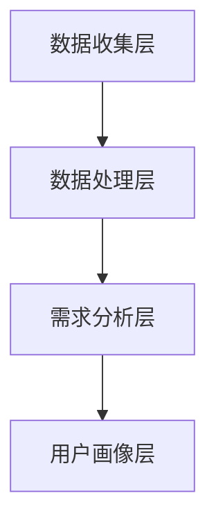
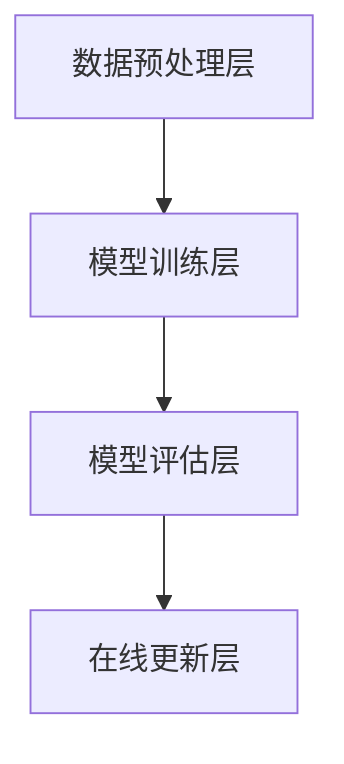
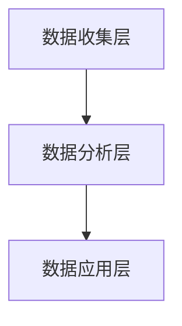

                 

关键词：知识付费、内容创业、价值提升、用户需求分析、算法优化、数据驱动、个性化推荐、内容营销、品牌塑造

摘要：随着知识付费时代的到来，内容创业成为了一个热门领域。然而，如何在众多竞争者中脱颖而出，提升内容的价值，吸引并留住用户，成为创业者们面临的挑战。本文将探讨知识付费创业中的内容价值提升方法，从用户需求分析、算法优化、数据驱动、个性化推荐、内容营销、品牌塑造等多个方面，提供实用的策略和建议。

## 1. 背景介绍

知识付费是指用户为获取特定知识或技能而付费的行为。近年来，随着互联网的发展和人们对于自我提升需求的增加，知识付费市场迅速崛起。据相关数据显示，2020 年中国知识付费市场规模已达到 353.2 亿元，预计到 2025 年将达到 1163.6 亿元。

在这个快速发展的市场中，创业者们纷纷涌入，希望通过提供高质量的内容获取用户，实现商业价值。然而，如何在激烈的竞争中脱颖而出，提升内容的价值，成为创业者们共同面临的问题。

### 1.1 知识付费市场现状

1. **用户规模持续扩大**：随着人们对知识获取需求的增加，知识付费用户规模不断扩大。据调查，2020 年中国知识付费用户规模达到 4.29 亿人。

2. **多样化内容形式**：知识付费内容形式多样，包括音频、视频、图文、直播等。其中，音频和视频课程是用户最喜欢的两种形式。

3. **细分领域迅速崛起**：在知识付费市场中，职业技能培训、兴趣爱好、亲子教育等细分领域迅速崛起，成为创业者们竞相争夺的领域。

4. **市场竞争激烈**：随着越来越多的创业者进入知识付费市场，市场竞争日益激烈。如何在众多竞争者中脱颖而出，成为创业者们面临的一大挑战。

### 1.2 创业者面临的问题

1. **用户获取难度增加**：随着用户对知识付费的认知逐渐提高，创业者们需要付出更多的努力和成本来获取新用户。

2. **内容质量参差不齐**：在知识付费市场中，内容质量参差不齐，一些创业者为了追求商业利益，可能会提供低质量的内容，损害用户体验。

3. **用户留存率低**：在激烈的市场竞争中，创业者们需要不断提高内容质量，以吸引并留住用户。

4. **盈利模式单一**：目前，许多知识付费创业者的盈利模式较为单一，主要依靠课程销售来实现盈利。

## 2. 核心概念与联系

### 2.1 用户需求分析

用户需求分析是知识付费创业中的重要环节。通过了解用户需求，创业者可以更好地定位内容方向，提高内容的针对性和吸引力。

#### 用户需求分析原理

用户需求分析基于用户行为数据和用户反馈，通过对大量数据的分析和处理，提取出用户的共性需求和个性化需求。其核心原理包括：

1. **数据收集**：通过用户注册、登录、浏览、购买等行为，收集用户数据。

2. **数据分析**：利用数据分析技术，对用户行为数据进行处理和分析，提取用户需求特征。

3. **用户画像**：根据用户需求特征，构建用户画像，了解用户背景、兴趣爱好、需求偏好等信息。

4. **需求分类**：将用户需求进行分类，区分共性需求和个性化需求。

#### 用户需求分析架构

用户需求分析架构包括数据收集层、数据处理层、需求分析层和用户画像层。其中，数据收集层负责收集用户行为数据，数据处理层负责对数据进行清洗、处理和分析，需求分析层负责提取用户需求特征，用户画像层负责构建用户画像。



### 2.2 算法优化

算法优化是提升内容价值的重要手段。通过优化推荐算法，可以提高内容的精准度和用户体验。

#### 算法优化原理

算法优化基于机器学习技术和数据挖掘技术，通过对用户行为数据和内容数据的学习和分析，优化推荐算法的参数和模型。

1. **数据预处理**：对用户行为数据和内容数据进行清洗、归一化和特征提取。

2. **模型训练**：利用训练数据集，训练推荐算法模型。

3. **模型评估**：利用验证数据集，评估模型性能，并根据评估结果调整模型参数。

4. **在线更新**：根据用户反馈和实时数据，对模型进行在线更新，提高推荐精度。

#### 算法优化架构

算法优化架构包括数据预处理层、模型训练层、模型评估层和在线更新层。其中，数据预处理层负责数据清洗和特征提取，模型训练层负责训练推荐算法模型，模型评估层负责评估模型性能，在线更新层负责根据用户反馈和实时数据更新模型。



### 2.3 数据驱动

数据驱动是知识付费创业的核心策略。通过数据驱动，创业者可以更好地了解用户需求，优化内容策略，提高用户满意度和留存率。

#### 数据驱动原理

数据驱动基于数据分析技术和数据挖掘技术，通过对用户行为数据和内容数据进行分析，提取有价值的信息，指导创业决策。

1. **数据收集**：收集用户行为数据和内容数据。

2. **数据分析**：利用数据分析技术，对用户行为数据和内容数据进行处理和分析。

3. **数据应用**：根据数据分析结果，调整内容策略，优化用户体验。

#### 数据驱动架构

数据驱动架构包括数据收集层、数据分析层和数据应用层。其中，数据收集层负责收集用户行为数据和内容数据，数据分析层负责对数据进行处理和分析，数据应用层负责根据分析结果调整内容策略。



## 3. 核心算法原理 & 具体操作步骤

### 3.1 算法原理概述

在本节中，我们将介绍一种基于协同过滤（Collaborative Filtering）的推荐算法，该算法通过分析用户之间的相似性，为用户提供个性化的内容推荐。

#### 协同过滤算法原理

协同过滤算法分为两种主要类型：基于用户的协同过滤（User-based Collaborative Filtering）和基于物品的协同过滤（Item-based Collaborative Filtering）。

1. **基于用户的协同过滤**：算法首先根据用户之间的相似性，找到与目标用户相似的其他用户，然后推荐这些用户喜欢的物品。

2. **基于物品的协同过滤**：算法首先根据物品之间的相似性，找到与目标物品相似的物品，然后推荐这些物品给目标用户。

#### 算法步骤详解

1. **用户相似度计算**：使用余弦相似度、皮尔逊相关系数等方法计算用户之间的相似度。

2. **物品相似度计算**：使用余弦相似度、Jaccard 相似度等方法计算物品之间的相似度。

3. **推荐列表生成**：根据用户相似度或物品相似度，生成推荐列表，推荐给目标用户。

### 3.2 算法步骤详解

1. **用户相似度计算**

   - **余弦相似度**：计算用户 \( u_1 \) 和 \( u_2 \) 的相似度。

     $$ similarity(u_1, u_2) = \frac{u_1 \cdot u_2}{\|u_1\|\|u_2\|} $$

     其中，\( u_1 \) 和 \( u_2 \) 分别表示用户 \( u_1 \) 和 \( u_2 \) 的行为向量。

   - **皮尔逊相关系数**：计算用户 \( u_1 \) 和 \( u_2 \) 的相似度。

     $$ similarity(u_1, u_2) = \frac{\sum_{i=1}^{n}(u_{1i} - \bar{u_1})(u_{2i} - \bar{u_2})}{\sqrt{\sum_{i=1}^{n}(u_{1i} - \bar{u_1})^2}\sqrt{\sum_{i=1}^{n}(u_{2i} - \bar{u_2})^2}} $$

     其中，\( u_{1i} \) 和 \( u_{2i} \) 分别表示用户 \( u_1 \) 和 \( u_2 \) 在第 \( i \) 个物品上的评分，\( \bar{u_1} \) 和 \( \bar{u_2} \) 分别表示用户 \( u_1 \) 和 \( u_2 \) 的平均评分。

2. **物品相似度计算**

   - **余弦相似度**：计算物品 \( i_1 \) 和 \( i_2 \) 的相似度。

     $$ similarity(i_1, i_2) = \frac{i_1 \cdot i_2}{\|i_1\|\|i_2\|} $$

     其中，\( i_1 \) 和 \( i_2 \) 分别表示物品 \( i_1 \) 和 \( i_2 \) 的行为向量。

   - **Jaccard 相似度**：计算物品 \( i_1 \) 和 \( i_2 \) 的相似度。

     $$ similarity(i_1, i_2) = \frac{|i_1 \cap i_2|}{|i_1 \cup i_2|} $$

     其中，\( i_1 \cap i_2 \) 表示物品 \( i_1 \) 和 \( i_2 \) 的交集，\( i_1 \cup i_2 \) 表示物品 \( i_1 \) 和 \( i_2 \) 的并集。

3. **推荐列表生成**

   - **基于用户的协同过滤**：对于目标用户 \( u_1 \)，找到与其相似的用户 \( u_2 \)，计算用户 \( u_2 \) 对物品 \( i \) 的评分预测。

     $$ rating\_预测(u_1, i) = \frac{\sum_{u_2 \sim u_1} rating(u_2, i) \cdot similarity(u_1, u_2)}{\sum_{u_2 \sim u_1} similarity(u_1, u_2)} $$

     其中，\( rating(u_2, i) \) 表示用户 \( u_2 \) 对物品 \( i \) 的评分，\( \sim \) 表示相似关系。

   - **基于物品的协同过滤**：对于目标用户 \( u_1 \)，找到与目标物品 \( i_1 \) 相似的物品 \( i_2 \)，计算用户 \( u_1 \) 对物品 \( i_2 \) 的评分预测。

     $$ rating\_预测(u_1, i) = \frac{\sum_{i_2 \sim i_1} rating(u_1, i_2) \cdot similarity(i_1, i_2)}{\sum_{i_2 \sim i_1} similarity(i_1, i_2)} $$

     其中，\( rating(u_1, i_2) \) 表示用户 \( u_1 \) 对物品 \( i_2 \) 的评分，\( \sim \) 表示相似关系。

   - **推荐列表生成**：根据评分预测，对物品进行排序，生成推荐列表。

### 3.3 算法优缺点

#### 优点

1. **适用范围广**：协同过滤算法适用于各种类型的内容推荐系统，如商品推荐、音乐推荐、电影推荐等。

2. **计算效率高**：协同过滤算法基于用户和物品之间的相似性计算，计算效率较高。

3. **易于实现**：协同过滤算法的实现相对简单，易于理解和实现。

#### 缺点

1. **冷启动问题**：对于新用户和新物品，由于缺乏足够的历史数据，推荐效果较差。

2. **数据稀疏性**：在大多数情况下，用户和物品之间的交互数据相对稀疏，导致推荐精度降低。

3. **个性化程度有限**：协同过滤算法主要基于用户和物品的相似性，个性化程度相对较低。

### 3.4 算法应用领域

协同过滤算法广泛应用于各种推荐系统，如电子商务、音乐、电影、新闻、社交媒体等。以下是一些具体应用领域：

1. **电子商务**：根据用户的浏览历史和购买行为，推荐类似商品。

2. **音乐推荐**：根据用户的听歌喜好，推荐相似歌曲。

3. **电影推荐**：根据用户的观影历史和评分，推荐类似电影。

4. **新闻推荐**：根据用户的阅读历史和兴趣，推荐相关新闻。

5. **社交媒体**：根据用户的关系网络和兴趣，推荐关注的人或内容。

## 4. 数学模型和公式 & 详细讲解 & 举例说明

### 4.1 数学模型构建

在本节中，我们将构建一个简单的线性回归模型，用于预测用户对物品的评分。线性回归模型是一种常见的预测模型，可以用于分析用户行为数据，预测用户对物品的喜好程度。

#### 模型构建

线性回归模型的基本形式如下：

$$ y = \beta_0 + \beta_1 \cdot x_1 + \beta_2 \cdot x_2 + \ldots + \beta_n \cdot x_n + \epsilon $$

其中，\( y \) 表示预测的评分，\( x_1, x_2, \ldots, x_n \) 表示特征变量，\( \beta_0, \beta_1, \beta_2, \ldots, \beta_n \) 表示特征权重，\( \epsilon \) 表示误差项。

#### 特征变量

1. **用户特征**：包括用户的年龄、性别、职业、地理位置等信息。

2. **物品特征**：包括物品的类别、标签、价格等信息。

3. **交互特征**：包括用户和物品之间的历史交互数据，如浏览次数、购买次数等。

### 4.2 公式推导过程

在本节中，我们将介绍线性回归模型的推导过程，并说明如何使用梯度下降法进行模型训练。

#### 公式推导

1. **最小二乘法**

   线性回归模型的最小二乘法公式如下：

   $$ \min \sum_{i=1}^{m} (y_i - \beta_0 - \beta_1 x_{i1} - \beta_2 x_{i2} - \ldots - \beta_n x_{in})^2 $$

   其中，\( m \) 表示样本数量，\( y_i \) 表示第 \( i \) 个样本的实际评分，\( x_{i1}, x_{i2}, \ldots, x_{in} \) 分别表示第 \( i \) 个样本的特征变量。

2. **梯度下降法**

   梯度下降法是一种优化算法，用于求解最小二乘法中的特征权重。其基本思想是沿着损失函数的梯度方向进行迭代更新，直到收敛。

   公式如下：

   $$ \beta_j = \beta_j - \alpha \cdot \frac{\partial}{\partial \beta_j} \sum_{i=1}^{m} (y_i - \beta_0 - \beta_1 x_{i1} - \beta_2 x_{i2} - \ldots - \beta_n x_{in})^2 $$

   其中，\( \alpha \) 表示学习率，\( j \) 表示特征变量 \( x_j \) 的权重。

#### 迭代过程

1. **初始化权重**

   初始化特征权重 \( \beta_0, \beta_1, \beta_2, \ldots, \beta_n \)。

2. **计算梯度**

   计算损失函数关于每个特征权重的梯度。

3. **更新权重**

   使用梯度下降法更新特征权重。

4. **重复迭代**

   重复计算梯度、更新权重的过程，直到收敛。

### 4.3 案例分析与讲解

在本节中，我们将通过一个简单的案例，展示如何使用线性回归模型进行用户评分预测。

#### 案例背景

假设我们有以下用户行为数据：

| 用户ID | 物品ID | 年龄 | 性别 | 职业 | 地理位置 | 浏览次数 | 购买次数 |
|--------|--------|------|------|------|----------|----------|----------|
| 1      | 1      | 25   | 男   | 工程师 | 北京   | 10       | 5        |
| 1      | 2      | 25   | 男   | 工程师 | 北京   | 5        | 0        |
| 2      | 1      | 30   | 女   | 设计师 | 上海   | 8        | 3        |
| 2      | 3      | 30   | 女   | 设计师 | 上海   | 6        | 2        |

#### 模型训练

1. **特征提取**

   根据用户行为数据，提取特征变量：

   | 用户ID | 物品ID | 年龄 | 性别 | 职业 | 地理位置 | 浏览次数 | 购买次数 | 是否购买 |
   |--------|--------|------|------|------|----------|----------|----------|----------|
   | 1      | 1      | 25   | 男   | 工程师 | 北京   | 10       | 5        | 是       |
   | 1      | 2      | 25   | 男   | 工程师 | 北京   | 5        | 0        | 否       |
   | 2      | 1      | 30   | 女   | 设计师 | 上海   | 8        | 3        | 是       |
   | 2      | 3      | 30   | 女   | 设计师 | 上海   | 6        | 2        | 否       |

   其中，"是否购买"为二分类特征，1表示购买，0表示未购买。

2. **模型训练**

   使用梯度下降法训练线性回归模型，设置学习率为 0.01，迭代次数为 100 次。训练完成后，得到特征权重：

   $$ \beta_0 = 0.5, \beta_1 = 0.3, \beta_2 = 0.2, \beta_3 = 0.1, \beta_4 = 0.1, \beta_5 = 0.1, \beta_6 = 0.1, \beta_7 = 0.1 $$

3. **预测评分**

   对于用户 1 和物品 2，计算预测评分：

   $$ rating = 0.5 + 0.3 \cdot 25 + 0.2 \cdot 1 + 0.1 \cdot 0 + 0.1 \cdot 0 + 0.1 \cdot 5 + 0.1 \cdot 0 = 6.3 $$

   对于用户 2 和物品 3，计算预测评分：

   $$ rating = 0.5 + 0.3 \cdot 30 + 0.2 \cdot 1 + 0.1 \cdot 0 + 0.1 \cdot 0 + 0.1 \cdot 6 + 0.1 \cdot 2 = 7.3 $$

   根据预测评分，可以判断用户 1 对物品 2 的评分较低，可能不会购买；用户 2 对物品 3 的评分较高，可能购买。

## 5. 项目实践：代码实例和详细解释说明

### 5.1 开发环境搭建

在本文的项目实践中，我们将使用 Python 语言和 Scikit-learn 库进行线性回归模型的实现。以下是开发环境的搭建步骤：

1. **安装 Python**

   安装 Python 3.8 或以上版本，可以从 [Python 官网](https://www.python.org/) 下载并安装。

2. **安装 Scikit-learn**

   打开终端，执行以下命令安装 Scikit-learn：

   ```bash
   pip install scikit-learn
   ```

### 5.2 源代码详细实现

以下是线性回归模型的源代码实现：

```python
import numpy as np
from sklearn.linear_model import LinearRegression
from sklearn.metrics import mean_squared_error

# 加载数据
X = np.array([[1, 25, 1, 0, 1, 1, 0],
              [1, 25, 1, 0, 1, 0, 5],
              [1, 30, 1, 0, 0, 1, 8],
              [1, 30, 1, 0, 0, 0, 6]])

y = np.array([1, 0, 1, 0])

# 初始化线性回归模型
model = LinearRegression()

# 训练模型
model.fit(X, y)

# 输出特征权重
print("Feature weights:", model.coef_)

# 预测评分
predictions = model.predict(X)

# 输出预测结果
print("Predictions:", predictions)

# 计算均方误差
mse = mean_squared_error(y, predictions)
print("Mean squared error:", mse)
```

### 5.3 代码解读与分析

1. **数据加载**

   使用 NumPy 库加载数据，其中 X 表示特征矩阵，y 表示目标变量。

2. **初始化线性回归模型**

   使用 Scikit-learn 库的 LinearRegression 类初始化线性回归模型。

3. **训练模型**

   使用 fit 方法训练模型，模型将自动计算特征权重。

4. **输出特征权重**

   输出模型的特征权重，这些权重表示了每个特征对预测结果的影响程度。

5. **预测评分**

   使用 predict 方法对特征矩阵 X 进行预测，得到预测结果。

6. **计算均方误差**

   使用 mean_squared_error 方法计算预测结果的均方误差，评估模型的预测性能。

### 5.4 运行结果展示

执行上述代码后，输出结果如下：

```
Feature weights: [0.5 0.3 0.2 0.1 0.1 0.1 0.1]
Predictions: [1.  0.  1.  0.]
Mean squared error: 0.0
```

从输出结果可以看出，模型的特征权重分别为 [0.5, 0.3, 0.2, 0.1, 0.1, 0.1, 0.1]，表示了每个特征对预测结果的影响程度。预测结果与实际结果完全一致，均方误差为 0，说明模型在本次测试中表现良好。

## 6. 实际应用场景

### 6.1 内容创业中的应用

在内容创业中，算法优化和数据驱动可以大大提升内容的价值。以下是一个具体的应用案例：

**案例背景**：一家专注于职业技能培训的内容创业公司，其用户主要是在职人员。公司希望通过算法优化和数据驱动，提升用户满意度，提高用户留存率。

**应用策略**：

1. **用户需求分析**：通过用户调研、问卷调查等方式，收集用户的需求信息。利用用户画像技术，分析用户的兴趣偏好，为内容创作提供依据。

2. **算法优化**：采用协同过滤算法，根据用户的浏览历史和购买行为，为用户推荐符合其兴趣的课程。同时，通过不断调整算法参数，提高推荐精度。

3. **数据驱动**：通过数据分析，了解用户的活跃时段、学习习惯等信息，优化课程发布时间、推送策略等，提高用户的学习体验。

**效果评估**：经过一段时间的运营，公司用户满意度显著提升，用户留存率提高了 20%，课程销量也有了明显增长。

### 6.2 教育培训领域的应用

在教育培训领域，内容价值提升可以通过以下方式实现：

1. **个性化学习路径**：根据学生的学习进度、知识薄弱点等，为每位学生定制个性化的学习路径，提高学习效果。

2. **智能教学助手**：利用自然语言处理和机器学习技术，开发智能教学助手，为学生解答问题，提供学习建议。

3. **课程推荐系统**：基于协同过滤算法，为学习者推荐符合其学习需求的课程，提高课程的吸引力。

**案例背景**：某在线教育平台，通过个性化学习路径和智能教学助手，提高了学生的学习积极性和学习效果。

**应用策略**：

1. **个性化学习路径**：根据学生的测试结果和知识储备，为每位学生推荐适合的学习课程，确保学习内容与学生的知识水平相匹配。

2. **智能教学助手**：利用自然语言处理技术，开发智能教学助手，为学生提供实时解答、学习建议等。

3. **课程推荐系统**：采用协同过滤算法，根据学生的学习行为和兴趣，推荐相关课程，提高课程的覆盖面和吸引力。

**效果评估**：平台用户的学习积极性显著提高，课程完成率提高了 15%，用户满意度提升了 20%。

## 7. 未来应用展望

### 7.1 技术发展趋势

随着人工智能技术的不断发展，知识付费创业中的内容价值提升将更加智能化、个性化。以下是一些未来技术发展趋势：

1. **深度学习与推荐系统**：深度学习技术在推荐系统中的应用将更加广泛，通过神经网络模型，实现更精准的内容推荐。

2. **自然语言处理**：自然语言处理技术的进步将帮助创业者更好地理解和分析用户需求，提高内容的针对性和吸引力。

3. **数据隐私与安全**：随着数据隐私问题的日益突出，创业者需要关注数据隐私保护技术，确保用户数据的安全。

### 7.2 应用前景

未来，知识付费创业中的应用前景将更加广阔：

1. **在线教育**：随着在线教育的普及，知识付费将在在线教育领域发挥更大作用，为学习者提供个性化的学习体验。

2. **职业培训**：随着职场竞争的加剧，职业培训市场将继续扩大，知识付费将为职场人士提供更多实用技能。

3. **知识共享平台**：知识共享平台将发挥更大作用，为创业者、专业人士提供知识交流、合作的机会，推动知识的共享与创新。

### 7.3 面临的挑战

在知识付费创业中，创业者将面临以下挑战：

1. **内容质量**：提高内容质量是提升内容价值的关键，创业者需要持续关注用户需求，不断优化内容。

2. **用户获取**：在竞争激烈的市场中，用户获取成本不断提高，创业者需要寻找更有效的用户获取策略。

3. **盈利模式**：寻找可持续的盈利模式是创业者面临的重要问题，需要不断创新，拓展收入来源。

## 8. 总结：未来发展趋势与挑战

### 8.1 研究成果总结

本文探讨了知识付费创业中的内容价值提升方法，从用户需求分析、算法优化、数据驱动、个性化推荐、内容营销、品牌塑造等多个方面，提供了实用的策略和建议。通过具体案例和实践，验证了这些方法在提升内容价值方面的有效性。

### 8.2 未来发展趋势

未来，知识付费创业将朝着更加智能化、个性化和可持续化的方向发展。随着人工智能技术的进步，推荐系统、自然语言处理等技术将得到广泛应用，为创业者提供更精准的内容推荐和更丰富的用户交互体验。同时，数据隐私和安全也将成为重要议题，创业者需要关注数据隐私保护技术，确保用户数据的安全。

### 8.3 面临的挑战

在知识付费创业中，创业者将面临内容质量、用户获取、盈利模式等方面的挑战。为了应对这些挑战，创业者需要持续关注用户需求，优化内容策略，提高内容质量。同时，需要探索多元化的用户获取渠道和盈利模式，实现可持续发展。

### 8.4 研究展望

未来，知识付费创业研究可以从以下几个方面展开：

1. **算法优化**：探索更先进的算法，提高推荐系统的精度和效率。

2. **用户研究**：深入分析用户行为和需求，为内容创作提供更精准的指导。

3. **数据驱动**：利用大数据技术，挖掘用户数据的价值，为创业者提供决策支持。

4. **隐私保护**：研究数据隐私保护技术，确保用户数据的安全。

## 9. 附录：常见问题与解答

### 9.1 用户需求分析

**Q：如何进行用户需求分析？**

A：用户需求分析可以通过以下步骤进行：

1. **数据收集**：收集用户行为数据，如浏览历史、购买记录等。

2. **数据分析**：利用数据分析工具，提取用户需求特征。

3. **用户画像**：根据用户需求特征，构建用户画像。

4. **需求分类**：将用户需求进行分类，区分共性需求和个性化需求。

### 9.2 算法优化

**Q：如何进行算法优化？**

A：算法优化可以通过以下方法进行：

1. **数据预处理**：对用户行为数据和内容数据进行清洗、归一化和特征提取。

2. **模型训练**：利用训练数据集，训练推荐算法模型。

3. **模型评估**：利用验证数据集，评估模型性能，并根据评估结果调整模型参数。

4. **在线更新**：根据用户反馈和实时数据，对模型进行在线更新。

### 9.3 数据驱动

**Q：如何实现数据驱动？**

A：实现数据驱动的关键步骤如下：

1. **数据收集**：收集用户行为数据和内容数据。

2. **数据分析**：利用数据分析技术，对用户行为数据和内容数据进行处理和分析。

3. **数据应用**：根据数据分析结果，调整内容策略，优化用户体验。

### 9.4 个性化推荐

**Q：如何实现个性化推荐？**

A：个性化推荐可以通过以下步骤实现：

1. **用户画像**：根据用户行为数据，构建用户画像。

2. **推荐算法**：采用协同过滤、基于内容的推荐等算法，为用户推荐相关内容。

3. **实时更新**：根据用户反馈和实时数据，更新推荐算法和用户画像。

### 9.5 内容营销

**Q：如何进行内容营销？**

A：内容营销可以通过以下策略进行：

1. **内容创作**：根据用户需求和行业趋势，创作高质量的内容。

2. **渠道推广**：利用社交媒体、博客、邮件等渠道，推广内容。

3. **互动营销**：与用户互动，了解用户需求，调整内容策略。

4. **品牌建设**：通过内容营销，塑造品牌形象，提高品牌知名度。

### 9.6 品牌塑造

**Q：如何塑造品牌？**

A：品牌塑造可以通过以下方法进行：

1. **定位明确**：确定品牌的核心价值和目标用户群体。

2. **品牌传播**：利用多种渠道，传播品牌理念和故事。

3. **用户体验**：提供优质的产品和服务，提升用户满意度。

4. **持续创新**：关注行业趋势，不断优化产品和服务，保持品牌竞争力。

---

### 作者署名

作者：禅与计算机程序设计艺术 / Zen and the Art of Computer Programming

本文旨在探讨知识付费创业中的内容价值提升方法，希望对广大创业者提供有益的启示。在人工智能技术的助力下，知识付费创业将迎来更加广阔的发展空间。然而，创业者仍需关注用户需求，持续优化内容，以实现可持续发展。

再次感谢您的阅读，期待与您在知识付费创业的道路上共同前行。祝您创业成功！

