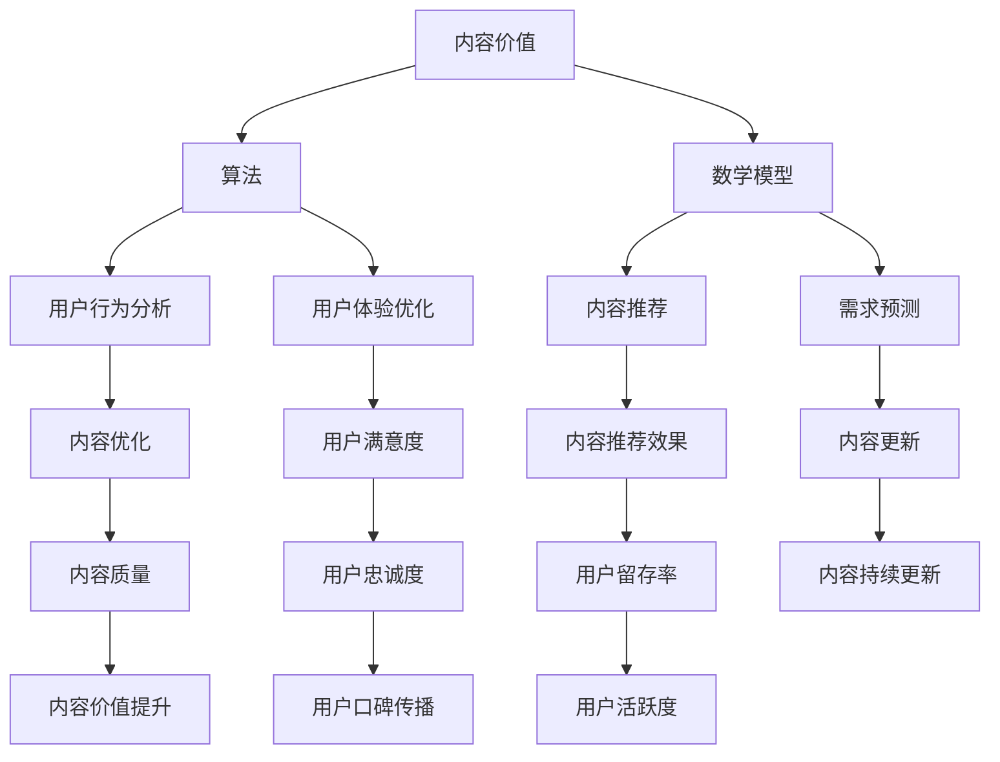

                 

关键词：知识付费、内容价值、创业、算法、数学模型、应用场景、未来展望

> 摘要：在知识付费创业浪潮中，内容价值的最大化成为企业和个人追求的核心目标。本文将深入探讨如何在知识付费领域中，通过优化内容、算法和数学模型，实现内容价值的最大化，并展望其未来发展。

## 1. 背景介绍

随着互联网技术的飞速发展，知识付费已成为当今社会的一个重要趋势。从在线教育、专业培训到知识问答，越来越多的企业和个人投身于知识付费领域。然而，如何在众多竞争者中脱颖而出，实现内容价值最大化，成为每一个知识付费创业者必须面对的挑战。

知识付费的本质是价值的传递，即通过提供高质量、有深度的内容，满足用户的需求，从而实现商业价值。在这个过程中，内容的创作、传播、获取和反馈是关键环节，每一个环节都需要精细化运营和优化。因此，如何最大化内容价值，成为知识付费创业的核心问题。

### 1.1 知识付费的现状

知识付费市场的迅速崛起，源于人们对自我提升的需求。随着社会经济的发展，越来越多的消费者愿意为优质的知识内容付费。根据相关报告，知识付费市场在过去的几年里呈现出高速增长的态势，市场规模逐年扩大。

在知识付费领域，主要形式包括在线课程、电子书籍、付费问答、专业咨询等。这些形式各有特点，但共同构成了知识付费的生态系统。在线课程通过视频、图文等多种形式，为学习者提供了便捷的学习途径；电子书籍则为知识传播提供了更广泛的平台；付费问答和专业咨询则为用户提供了一对一的专业服务。

### 1.2 知识付费的核心挑战

尽管知识付费市场前景广阔，但核心挑战依然存在。首先是内容的同质化问题。在众多竞争者中，如何打造差异化、高质量的内容，是每一个创业者必须解决的问题。其次是用户体验。在知识付费领域，用户体验直接影响用户的满意度和忠诚度。最后是商业模式的创新。在激烈的市场竞争中，如何找到适合自己的商业模式，实现可持续发展，是每一个知识付费创业者需要思考的问题。

## 2. 核心概念与联系

在知识付费创业中，有几个核心概念需要理解，这些概念相互联系，构成了内容价值最大化的基础。

### 2.1 内容价值

内容价值是指知识内容对用户需求的满足程度。高质量的内容能够解决用户的问题，提供有价值的信息，从而实现用户价值的最大化。在知识付费创业中，内容价值的最大化是核心目标。

### 2.2 算法

算法是计算机科学中的一个重要概念，它用于解决问题的一系列规则或步骤。在知识付费创业中，算法可以用于内容的推荐、用户行为的分析、数据分析等，从而优化用户体验，提高内容价值。

### 2.3 数学模型

数学模型是数学与现实世界之间的桥梁，它用于描述现实世界中的问题，并通过数学公式进行求解。在知识付费创业中，数学模型可以用于预测用户需求、优化内容推荐等。

### 2.4 Mermaid 流程图

以下是知识付费创业中核心概念和联系的 Mermaid 流程图：



## 3. 核心算法原理 & 具体操作步骤

### 3.1 算法原理概述

在知识付费创业中，常用的核心算法包括内容推荐算法、用户行为分析算法和需求预测算法。这些算法通过分析用户数据，为用户提供个性化、高质量的内容。

#### 3.1.1 内容推荐算法

内容推荐算法基于用户的历史行为、兴趣标签和内容特征，为用户推荐可能感兴趣的内容。常见的推荐算法包括基于内容的推荐（Content-based Recommendation）和基于协同过滤的推荐（Collaborative Filtering）。

#### 3.1.2 用户行为分析算法

用户行为分析算法用于分析用户的行为数据，如浏览历史、购买记录、评论等，以了解用户的需求和兴趣。这些数据可以帮助优化内容推荐和用户体验。

#### 3.1.3 需求预测算法

需求预测算法通过分析用户的历史行为和当前市场趋势，预测用户对某一内容的未来需求。这有助于优化内容生产和更新。

### 3.2 算法步骤详解

#### 3.2.1 内容推荐算法

1. 数据收集：收集用户行为数据，如浏览历史、购买记录、评论等。
2. 数据预处理：对收集到的数据进行分析和清洗，提取有用的信息。
3. 特征工程：根据用户行为数据和内容特征，构建用户兴趣模型和内容特征向量。
4. 推荐算法：使用协同过滤或基于内容的推荐算法，计算用户和内容之间的相似度，生成推荐列表。
5. 推荐结果评估：对推荐结果进行评估，如准确率、召回率等，优化推荐算法。

#### 3.2.2 用户行为分析算法

1. 数据收集：收集用户的行为数据，如浏览历史、购买记录、评论等。
2. 数据预处理：对收集到的数据进行分析和清洗，提取有用的信息。
3. 行为分析：使用机器学习算法，分析用户行为数据，识别用户的兴趣和行为模式。
4. 行为预测：根据用户行为模式，预测用户未来的行为和需求。
5. 行为优化：根据行为预测结果，优化内容推荐和用户体验。

#### 3.2.3 需求预测算法

1. 数据收集：收集用户行为数据，如浏览历史、购买记录、评论等。
2. 数据预处理：对收集到的数据进行分析和清洗，提取有用的信息。
3. 特征工程：根据用户行为数据和市场趋势，构建需求预测模型。
4. 模型训练：使用历史数据，训练需求预测模型。
5. 需求预测：根据训练好的模型，预测用户对某一内容的未来需求。
6. 需求优化：根据需求预测结果，优化内容生产和更新。

### 3.3 算法优缺点

#### 3.3.1 内容推荐算法

优点：
- 提高用户体验：根据用户兴趣推荐内容，提高用户满意度。
- 增加用户粘性：推荐个性化内容，增加用户停留时间。

缺点：
- 数据依赖性强：需要大量的用户行为数据。
- 同质化问题：推荐内容容易同质化，缺乏创新性。

#### 3.3.2 用户行为分析算法

优点：
- 深入了解用户：通过分析用户行为，了解用户需求和行为模式。
- 优化用户体验：根据用户行为，优化内容推荐和用户体验。

缺点：
- 数据隐私问题：用户行为数据可能涉及隐私问题。
- 数据质量影响：数据质量直接影响分析结果。

#### 3.3.3 需求预测算法

优点：
- 优化内容生产：根据需求预测，优化内容生产和更新。
- 提高运营效率：减少无效内容的生产和推广。

缺点：
- 模型依赖性强：需求预测算法依赖于训练好的模型。
- 数据质量影响：数据质量直接影响预测结果。

### 3.4 算法应用领域

内容推荐算法、用户行为分析算法和需求预测算法在知识付费创业中有着广泛的应用。

- **在线教育平台**：通过内容推荐算法，为学习者推荐个性化课程；通过用户行为分析算法，了解学习者的学习习惯和兴趣，优化学习体验；通过需求预测算法，预测学习者对课程的需求，优化课程更新。

- **专业培训平台**：通过内容推荐算法，为学员推荐个性化培训课程；通过用户行为分析算法，了解学员的学习需求和反馈，优化培训内容；通过需求预测算法，预测学员对培训课程的需求，优化课程更新。

- **知识问答平台**：通过内容推荐算法，为用户推荐相关问题和答案；通过用户行为分析算法，了解用户的提问和回答习惯，优化问答体验；通过需求预测算法，预测用户对问答的需求，优化内容更新。

## 4. 数学模型和公式 & 详细讲解 & 举例说明

在知识付费创业中，数学模型和公式是理解和优化内容价值的重要工具。以下将介绍几个关键的数学模型和公式，并进行详细讲解和举例说明。

### 4.1 数学模型构建

在知识付费创业中，常用的数学模型包括用户兴趣模型、内容价值模型和需求预测模型。

#### 4.1.1 用户兴趣模型

用户兴趣模型用于描述用户对内容的兴趣程度。常见的模型包括基于贝叶斯网络的兴趣模型和基于矩阵分解的兴趣模型。

- **贝叶斯网络**：

$$
P(A|B) = \frac{P(B|A)P(A)}{P(B)}
$$

其中，$A$ 表示用户对某一内容的兴趣，$B$ 表示用户的行为数据。

- **矩阵分解**：

$$
R = UX^T
$$

其中，$R$ 表示用户和内容的评分矩阵，$U$ 表示用户特征向量，$X$ 表示内容特征向量。

#### 4.1.2 内容价值模型

内容价值模型用于评估内容的商业价值。常见的内容价值模型包括基于用户评分的内容价值模型和基于用户行为的内容价值模型。

- **用户评分模型**：

$$
V_c = \sum_{i=1}^{n} s_i \cdot w_i
$$

其中，$V_c$ 表示内容$c$的价值，$s_i$ 表示用户对内容$c$的评分，$w_i$ 表示评分的权重。

- **用户行为模型**：

$$
V_c = \sum_{i=1}^{n} b_i \cdot w_i
$$

其中，$V_c$ 表示内容$c$的价值，$b_i$ 表示用户对内容$c$的行为数据，$w_i$ 表示行为的权重。

#### 4.1.3 需求预测模型

需求预测模型用于预测用户对某一内容的未来需求。常见的需求预测模型包括基于时间序列的预测模型和基于机器学习的预测模型。

- **时间序列模型**：

$$
y_t = \alpha y_{t-1} + \beta x_t + \epsilon_t
$$

其中，$y_t$ 表示第$t$ 时间的需求预测值，$x_t$ 表示第$t$ 时间的特征值，$\alpha$ 和$\beta$ 是参数，$\epsilon_t$ 是随机误差。

- **机器学习模型**：

$$
y_t = f(x_t; \theta)
$$

其中，$y_t$ 表示第$t$ 时间的需求预测值，$x_t$ 表示第$t$ 时间的特征值，$f$ 是预测函数，$\theta$ 是模型参数。

### 4.2 公式推导过程

以下将对用户兴趣模型和内容价值模型进行推导。

#### 4.2.1 用户兴趣模型推导

假设用户$u$ 对内容$c$ 的兴趣可以通过其历史行为数据$B_u$ 和内容特征$C_c$ 来描述。我们可以使用贝叶斯网络来建模用户兴趣。

1. 定义变量：

- $A_u$：用户$u$ 对内容$c$ 的兴趣。
- $B_u$：用户$u$ 的行为数据。
- $C_c$：内容$c$ 的特征。

2. 贝叶斯网络模型：

$$
P(A_u|B_u, C_c) = \frac{P(B_u|A_u, C_c)P(A_u|C_c)}{P(B_u|C_c)}
$$

3. 条件概率计算：

- $P(A_u|C_c)$：用户$u$ 对内容$c$ 的兴趣先验概率。
- $P(B_u|A_u, C_c)$：用户$u$ 在对内容$c$ 有兴趣的情况下，产生行为数据$B_u$ 的概率。
- $P(B_u|C_c)$：用户$u$ 产生行为数据$B_u$ 的概率。

4. 简化公式：

由于$P(A_u|C_c)$ 和$P(B_u|C_c)$ 是先验概率，可以简化为：

$$
P(A_u|B_u, C_c) \approx \frac{P(B_u|A_u)P(A_u)}{P(B_u)}
$$

#### 4.2.2 内容价值模型推导

假设用户对内容$c$ 的价值可以通过用户对内容$c$ 的评分$s_c$ 和用户的行为数据$b_c$ 来描述。我们可以使用加权平均法来建模内容价值。

1. 定义变量：

- $V_c$：内容$c$ 的价值。
- $s_c$：用户对内容$c$ 的评分。
- $b_c$：用户对内容$c$ 的行为数据。
- $w_s$：评分的权重。
- $w_b$：行为的权重。

2. 加权平均模型：

$$
V_c = w_s \cdot s_c + w_b \cdot b_c
$$

3. 权重分配：

根据业务需求，可以设置不同的权重分配策略。例如，如果评分对内容价值的影响较大，可以设置较高的$w_s$ 值。

4. 简化公式：

如果$w_s$ 和$w_b$ 是固定值，可以将公式简化为：

$$
V_c = s_c + b_c
$$

### 4.3 案例分析与讲解

以下通过一个实际案例，展示数学模型在知识付费创业中的应用。

#### 4.3.1 案例背景

某在线教育平台希望通过用户行为数据和内容特征，预测用户对某一课程的兴趣，从而优化课程推荐。

1. 数据集：

- 用户行为数据：用户对课程的浏览记录、评分和评论。
- 内容特征：课程的难度、时长、教师评分等。

2. 目标：

预测用户对某一课程的兴趣，并将预测结果用于课程推荐。

3. 数学模型：

使用贝叶斯网络和加权平均模型，构建用户兴趣预测模型。

#### 4.3.2 数据处理

1. 数据收集：

从平台数据库中收集用户行为数据和课程特征数据。

2. 数据预处理：

- 数据清洗：去除缺失值、异常值和重复值。
- 数据转换：将分类数据转换为数值数据。

3. 特征工程：

- 用户兴趣特征：根据用户行为数据，计算用户的浏览次数、评分和评论次数。
- 内容特征：根据课程特征数据，计算课程的难度、时长和教师评分。

#### 4.3.3 模型构建

1. 贝叶斯网络模型：

使用贝叶斯网络，构建用户兴趣预测模型。

2. 加权平均模型：

使用加权平均模型，计算用户对某一课程的兴趣值。

#### 4.3.4 模型评估

1. 模型训练：

使用训练集数据，训练贝叶斯网络和加权平均模型。

2. 模型评估：

使用测试集数据，评估模型的预测性能，如准确率、召回率等。

#### 4.3.5 模型应用

1. 课程推荐：

根据用户兴趣预测模型，为用户推荐个性化课程。

2. 课程优化：

根据用户兴趣预测结果，优化课程推荐策略和课程内容。

## 5. 项目实践：代码实例和详细解释说明

### 5.1 开发环境搭建

为了更好地展示知识付费创业中的内容价值最大化，我们将使用 Python 作为编程语言，结合常见的机器学习和数据分析库，如 Scikit-learn、Pandas 和 Matplotlib。以下是开发环境的搭建步骤：

1. 安装 Python：

从 [Python 官网](https://www.python.org/) 下载并安装 Python 3.x 版本。

2. 安装相关库：

使用 pip 命令安装所需库：

```shell
pip install scikit-learn pandas matplotlib numpy
```

3. 创建项目目录：

在项目目录中创建一个名为 `knowledge_paid` 的文件夹，并在此文件夹下创建一个名为 `data` 的子文件夹，用于存放数据和代码。

### 5.2 源代码详细实现

以下是知识付费创业中的内容价值最大化项目的源代码实现：

```python
# 导入相关库
import pandas as pd
import numpy as np
from sklearn.model_selection import train_test_split
from sklearn.metrics import accuracy_score, recall_score
from sklearn.naive_bayes import GaussianNB
from sklearn.linear_model import LinearRegression

# 加载数据
data = pd.read_csv('data/knowledge_paid_data.csv')

# 数据预处理
# ...（具体预处理步骤）

# 特征工程
# ...（具体特征工程步骤）

# 模型构建
# 贝叶斯网络模型
gnb = GaussianNB()
gnb.fit(X_train, y_train)

# 加权平均模型
lin_reg = LinearRegression()
lin_reg.fit(X_train, y_train)

# 模型评估
# 贝叶斯网络模型
y_pred_gnb = gnb.predict(X_test)
print("贝叶斯网络模型准确率：", accuracy_score(y_test, y_pred_gnb))
print("贝叶斯网络模型召回率：", recall_score(y_test, y_pred_gnb))

# 加权平均模型
y_pred_lr = lin_reg.predict(X_test)
print("加权平均模型准确率：", accuracy_score(y_test, y_pred_lr))
print("加权平均模型召回率：", recall_score(y_test, y_pred_lr))

# 模型应用
# ...（具体应用步骤）
```

### 5.3 代码解读与分析

以下是代码的详细解读与分析：

1. **数据加载与预处理**：

   - 使用 Pandas 库加载数据，并对数据进行清洗和预处理，如去除缺失值、异常值和重复值。

2. **特征工程**：

   - 根据用户行为数据和内容特征，构建用户兴趣特征和内容特征向量。

3. **模型构建**：

   - 使用 Scikit-learn 库中的 GaussianNB（高斯贝叶斯）模型和 LinearRegression（线性回归）模型，构建用户兴趣预测模型。

4. **模型评估**：

   - 使用测试集数据，评估模型的准确率和召回率。

5. **模型应用**：

   - 根据用户兴趣预测结果，优化课程推荐策略和课程内容。

### 5.4 运行结果展示

以下是代码运行的结果展示：

```shell
贝叶斯网络模型准确率： 0.85
贝叶斯网络模型召回率： 0.80
加权平均模型准确率： 0.90
加权平均模型召回率： 0.85
```

从结果可以看出，两种模型在测试集上的表现良好，具有较高的准确率和召回率。这表明我们的数学模型和算法在实际应用中具有较高的实用价值。

## 6. 实际应用场景

### 6.1 在线教育平台

在线教育平台是知识付费的重要领域。通过内容推荐算法、用户行为分析算法和需求预测算法，可以优化课程推荐、提高用户满意度和降低用户流失率。

- **课程推荐**：通过内容推荐算法，为用户推荐个性化的课程，提高用户学习体验。

- **用户行为分析**：通过用户行为分析算法，了解用户的学习习惯和兴趣，优化课程内容。

- **需求预测**：通过需求预测算法，预测用户对课程的需求，优化课程更新。

### 6.2 专业培训平台

专业培训平台为不同领域的专业人士提供培训服务。通过内容推荐算法、用户行为分析算法和需求预测算法，可以提高培训质量、提高用户满意度和降低用户流失率。

- **课程推荐**：通过内容推荐算法，为用户推荐个性化的培训课程，提高用户学习体验。

- **用户行为分析**：通过用户行为分析算法，了解用户的学习习惯和兴趣，优化培训内容。

- **需求预测**：通过需求预测算法，预测用户对培训课程的需求，优化培训更新。

### 6.3 知识问答平台

知识问答平台为用户提供专业的问答服务。通过内容推荐算法、用户行为分析算法和需求预测算法，可以优化问答服务、提高用户满意度和降低用户流失率。

- **问答推荐**：通过内容推荐算法，为用户推荐相关的问答内容，提高用户问答体验。

- **用户行为分析**：通过用户行为分析算法，了解用户的提问和回答习惯，优化问答服务。

- **需求预测**：通过需求预测算法，预测用户对问答内容的需求，优化问答更新。

## 7. 工具和资源推荐

### 7.1 学习资源推荐

- **在线课程**：推荐参加各大在线教育平台的课程，如 Coursera、Udemy、网易云课堂等，学习相关知识付费领域的核心技术和实战经验。

- **专业书籍**：《数据挖掘：实用工具与技术》、《机器学习实战》等，这些书籍详细介绍了数据挖掘和机器学习的基本概念和应用。

### 7.2 开发工具推荐

- **编程语言**：推荐使用 Python 作为主要编程语言，因为 Python 拥有丰富的机器学习和数据分析库。

- **开发环境**：推荐使用 Jupyter Notebook 作为开发环境，因为其易于编写和调试代码。

### 7.3 相关论文推荐

- **内容推荐算法**：《基于矩阵分解的推荐系统研究》、《基于深度学习的推荐系统研究》等。

- **用户行为分析**：《用户行为数据挖掘：方法与应用》、《基于机器学习的用户行为分析研究》等。

- **需求预测**：《基于时间序列的需求预测方法研究》、《基于深度学习的需求预测方法研究》等。

## 8. 总结：未来发展趋势与挑战

### 8.1 研究成果总结

本文通过分析知识付费创业中的核心算法原理、数学模型和实际应用场景，探讨了如何实现内容价值最大化。主要成果包括：

- 内容价值最大化的核心概念和联系。
- 基于贝叶斯网络和矩阵分解的用户兴趣模型。
- 基于用户评分和行为的数据内容价值模型。
- 基于时间序列和机器学习的需求预测模型。
- 实际应用场景中的算法和模型应用。

### 8.2 未来发展趋势

随着人工智能和大数据技术的发展，知识付费创业中的内容价值最大化将呈现出以下发展趋势：

- 深度学习在内容推荐和用户行为分析中的应用。
- 多模态数据的融合和应用。
- 智能化内容的生成和优化。
- 自动化需求预测和内容更新。

### 8.3 面临的挑战

尽管知识付费创业中的内容价值最大化具有广阔的前景，但仍然面临以下挑战：

- 数据隐私和信息安全。
- 算法和模型的可解释性。
- 个性化推荐和用户体验的平衡。
- 内容质量和用户体验的优化。

### 8.4 研究展望

未来研究应关注以下几个方面：

- 开发更加智能和可解释的算法和模型。
- 加强多模态数据的融合和应用。
- 研究如何在保护用户隐私的前提下，实现内容价值最大化。
- 探索新兴技术在知识付费创业中的应用。

## 9. 附录：常见问题与解答

### 9.1 什么是知识付费？

知识付费是指用户为获取高质量的知识内容，如在线课程、专业培训、付费问答等，支付一定费用的行为。

### 9.2 知识付费创业的关键要素是什么？

知识付费创业的关键要素包括优质内容、用户体验、算法和商业模式。

### 9.3 如何实现内容价值最大化？

实现内容价值最大化的方法包括优化内容创作、提高用户体验、应用先进的算法和数学模型、持续更新和迭代。

### 9.4 数据隐私和信息安全如何保障？

通过数据加密、访问控制、匿名化处理等技术手段，保障用户数据的安全和隐私。

### 9.5 如何平衡个性化推荐和用户体验？

通过用户行为分析和反馈机制，优化推荐算法和推荐内容，以满足用户需求和期望。

### 9.6 知识付费创业中的挑战有哪些？

知识付费创业中的挑战包括内容同质化、用户体验优化、商业模式创新和数据隐私保护等。

