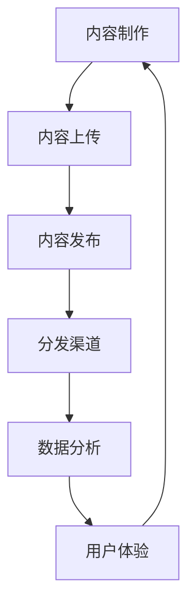

                 

  
## 1. 背景介绍

随着互联网的普及和知识付费时代的到来，越来越多的创业者涌入知识付费领域。知识付费作为一种新兴的商业模式，通过提供有价值的内容服务，满足了人们获取知识、提升技能的需求。然而，如何在众多竞争者中脱颖而出，实现有效的内容分发，成为知识付费创业的关键挑战之一。

本文旨在探讨知识付费创业中的内容分发策略，分析现有问题，提出解决方案，以帮助创业者更好地把握市场机会，实现商业成功。

### 1.1 知识付费的现状与发展趋势

知识付费起源于2000年代初的在线教育，随着移动互联网和智能手机的普及，知识付费市场迅速扩大。根据《2021年中国知识付费行业报告》，2019年中国知识付费市场规模达到125亿元人民币，预计到2023年将达到260亿元人民币。

知识付费市场的发展主要得益于以下几个因素：

1. **用户需求**：随着生活水平的提高，人们越来越注重个人成长和职业发展，对知识的需求日益增长。
2. **技术进步**：移动互联网、大数据、人工智能等技术的快速发展，为知识付费提供了丰富的工具和平台。
3. **内容多样化**：从早期的在线教育，到如今涵盖知识共享、专业咨询、技能培训等多个领域，知识付费内容越来越丰富。

### 1.2 知识付费创业的现状与挑战

知识付费领域的创业热情高涨，但同时也面临着诸多挑战：

1. **竞争激烈**：随着越来越多的创业者进入市场，竞争愈发激烈，如何吸引和留住用户成为关键。
2. **内容质量**：高质量的内容是知识付费的核心竞争力，如何保证内容的专业性和实用性，是创业者在内容创作过程中面临的重要问题。
3. **分发渠道**：如何有效地将内容分发到目标用户，提高内容曝光度和转化率，是创业者需要解决的难题。

本文将从内容分发策略的角度，探讨知识付费创业中的关键问题和解决方案，以期为创业者提供有益的参考。

## 2. 核心概念与联系

在探讨知识付费创业中的内容分发策略时，需要了解以下几个核心概念及其之间的联系：

### 2.1 内容分发

内容分发是指将知识付费平台上的内容有效地传递给目标用户的过程。它包括内容的制作、上传、发布、推广和分发等环节。

### 2.2 用户画像

用户画像是对用户特征、需求、行为等方面的数据化描述。通过用户画像，创业者可以了解目标用户的特点，从而制定更加精准的内容分发策略。

### 2.3 分发渠道

分发渠道是指将内容传递给用户的方式，包括社交媒体、搜索引擎、电子邮件、APP推送等。不同的分发渠道具有不同的覆盖范围和用户群体，选择合适的分发渠道可以提高内容曝光率和转化率。

### 2.4 数据分析

数据分析是通过收集、处理和分析数据，发现用户行为、内容表现等方面的规律和趋势，为内容分发提供数据支持。

### 2.5 用户体验

用户体验是指用户在使用知识付费平台时所感受到的满意度和舒适度。良好的用户体验可以提高用户粘性和平台口碑。

### 2.6 Mermaid 流程图

以下是一个简化的内容分发流程图，展示了核心概念之间的联系：



通过这个流程图，我们可以看出，内容分发策略需要从多个维度进行设计和优化，以确保内容的高效传递和用户满意。

## 3. 核心算法原理 & 具体操作步骤

在知识付费创业中，内容分发策略的核心算法主要包括以下三个方面：用户画像构建、分发渠道优化和数据分析与反馈。下面我们将分别介绍这三个方面的算法原理和具体操作步骤。

### 3.1 算法原理概述

#### 用户画像构建

用户画像构建是基于大数据和机器学习技术，通过对用户行为、兴趣、需求等多维度数据的分析，生成用户特征模型。其主要目的是帮助创业者了解目标用户，从而制定更加精准的内容分发策略。

#### 分发渠道优化

分发渠道优化是通过分析不同渠道的用户行为数据，确定最优的分发策略。这包括选择合适的渠道、确定最佳的推送时间和频率，以及优化内容格式和呈现方式，以提高用户点击率和转化率。

#### 数据分析与反馈

数据分析与反馈是通过收集用户行为数据，对内容分发效果进行实时监控和评估。通过数据分析，创业者可以了解用户喜好、内容表现等方面的信息，从而不断优化内容分发策略，提高整体效果。

### 3.2 算法步骤详解

#### 3.1 用户画像构建

1. **数据收集**：收集用户在知识付费平台上的行为数据，如浏览记录、购买记录、评论等。
2. **特征提取**：对收集到的数据进行分析，提取用户兴趣、需求、行为等特征。
3. **模型训练**：利用机器学习算法，如决策树、随机森林、神经网络等，构建用户特征模型。
4. **模型评估**：通过交叉验证等方法，评估用户画像模型的准确性和可靠性。

#### 3.2 分发渠道优化

1. **渠道评估**：分析各个分发渠道的用户行为数据，评估其覆盖范围和用户转化率。
2. **渠道选择**：根据评估结果，选择最合适的分发渠道。
3. **内容优化**：针对不同渠道，调整内容格式、呈现方式和推送时间，以提高用户点击率和转化率。
4. **实时监控**：通过数据分析，实时监控内容分发效果，及时调整分发策略。

#### 3.3 数据分析与反馈

1. **数据收集**：收集用户在知识付费平台上的行为数据，如内容点击量、购买量、评论等。
2. **数据预处理**：对收集到的数据进行清洗、去重和转换，为后续分析做好准备。
3. **数据分析**：利用统计分析、机器学习等方法，对用户行为和内容表现进行分析，提取关键指标和规律。
4. **反馈调整**：根据分析结果，对内容分发策略进行调整，提高整体效果。

### 3.3 算法优缺点

#### 用户画像构建

优点：
- 精准定位用户，提高内容分发效果。
- 帮助创业者了解用户需求和喜好，优化内容创作。

缺点：
- 需要大量的用户行为数据，数据质量直接影响模型准确性。
- 模型训练和评估过程复杂，需要较高的技术门槛。

#### 分发渠道优化

优点：
- 提高内容曝光度和用户转化率。
- 针对不同渠道进行个性化优化，提高用户体验。

缺点：
- 需要投入大量时间和精力进行渠道评估和优化。
- 部分渠道效果难以精确衡量，影响整体效果评估。

#### 数据分析与反馈

优点：
- 实时监控内容分发效果，及时调整策略。
- 通过数据驱动，不断优化内容分发策略。

缺点：
- 需要投入大量时间和精力进行数据收集、预处理和分析。
- 数据分析结果可能受到数据质量和模型算法的影响，影响决策准确性。

### 3.4 算法应用领域

用户画像构建、分发渠道优化和数据分析与反馈在知识付费创业中具有广泛的应用领域，如：

- **在线教育**：通过用户画像构建，为学习者推荐个性化的课程和内容，提高学习效果。
- **专业技能培训**：通过分发渠道优化，将专业培训内容推送给目标用户，提高转化率。
- **知识共享平台**：通过数据分析与反馈，不断优化内容分发策略，提高用户满意度。

## 4. 数学模型和公式 & 详细讲解 & 举例说明

在知识付费创业中，数学模型和公式发挥着重要作用，可以帮助创业者进行数据分析和策略优化。本节将介绍几个关键的数学模型和公式，并进行详细讲解和举例说明。

### 4.1 数学模型构建

在构建数学模型时，我们需要考虑以下几个关键因素：

1. **用户行为数据**：包括用户的浏览、购买、评论等行为数据。
2. **内容特征**：包括内容的类型、主题、难度等特征。
3. **市场环境**：包括用户需求、竞争对手、市场趋势等。

基于以上因素，我们可以构建以下数学模型：

- **用户画像模型**：利用机器学习算法，如决策树、随机森林等，对用户行为数据进行建模，提取用户特征。
- **分发渠道优化模型**：通过分析用户行为数据和渠道数据，构建优化模型，确定最优的分发策略。
- **内容推荐模型**：利用协同过滤、矩阵分解等方法，为用户推荐个性化的内容。

### 4.2 公式推导过程

#### 4.2.1 用户画像模型

假设我们有 $N$ 个用户和 $M$ 个内容，每个用户的行为数据可以表示为一个 $N \times M$ 的矩阵 $X$，其中 $X_{ij}$ 表示用户 $i$ 对内容 $j$ 的行为评分。我们使用决策树算法构建用户画像模型，其基本思想是：

1. 计算每个特征的重要程度，选择特征最为重要的分支进行划分。
2. 递归划分，直到满足停止条件（如深度达到最大值、特征重要程度低于阈值等）。

用户画像模型的核心公式为：

$$
G_{i,j} = \frac{1}{N} \sum_{k=1}^{N} \omega_{k} X_{ik} + b_j
$$

其中，$G_{i,j}$ 表示用户 $i$ 对内容 $j$ 的画像得分，$\omega_{k}$ 表示特征 $k$ 的权重，$b_j$ 表示内容的初始得分。

#### 4.2.2 分发渠道优化模型

假设我们有 $K$ 个分发渠道，每个渠道的用户行为数据可以表示为一个 $K \times M$ 的矩阵 $Y$，其中 $Y_{ij}$ 表示渠道 $i$ 对内容 $j$ 的行为评分。我们使用矩阵分解算法，如Singular Value Decomposition (SVD)，构建分发渠道优化模型，其基本思想是：

1. 将用户行为数据矩阵和渠道数据矩阵分解为低维矩阵。
2. 计算渠道对内容的偏好得分，选择得分最高的渠道进行内容分发。

分发渠道优化模型的核心公式为：

$$
P_{i,j} = \frac{1}{K} \sum_{k=1}^{K} \sqrt{S_{ik} S_{jk}}
$$

其中，$P_{i,j}$ 表示渠道 $i$ 对内容 $j$ 的偏好得分，$S_{ik}$ 和 $S_{jk}$ 分别表示用户行为数据和渠道数据矩阵的低维分解结果。

#### 4.2.3 内容推荐模型

假设我们有 $N$ 个用户和 $M$ 个内容，用户对内容的评分可以表示为一个 $N \times M$ 的矩阵 $R$，其中 $R_{ij}$ 表示用户 $i$ 对内容 $j$ 的评分。我们使用协同过滤算法，如User-based Collaborative Filtering，构建内容推荐模型，其基本思想是：

1. 计算用户之间的相似度，选择最相似的邻居用户。
2. 根据邻居用户的评分预测用户对未知内容的评分。

内容推荐模型的核心公式为：

$$
R_{ij}^{'} = \frac{\sum_{k \in N(i)} R_{ik} R_{kj}}{\sum_{k \in N(i)} R_{ik}}
$$

其中，$R_{ij}^{'}$ 表示用户 $i$ 对内容 $j$ 的预测评分，$N(i)$ 表示与用户 $i$ 最相似的邻居用户集合。

### 4.3 案例分析与讲解

以下是一个简单的案例，用于说明如何使用数学模型和公式进行内容分发策略的优化。

#### 案例背景

某知识付费平台有1000个用户和500个课程，用户对课程的评分数据如下表所示：

| 用户ID | 课程ID | 用户评分 |
|--------|--------|----------|
| 1      | 101    | 4        |
| 1      | 102    | 3        |
| 1      | 103    | 5        |
| ...    | ...    | ...      |
| 1000   | 401    | 2        |
| 1000   | 402    | 4        |
| 1000   | 403    | 5        |

#### 案例步骤

1. **用户画像模型构建**

   使用决策树算法，对用户行为数据进行建模，提取用户特征。假设我们提取了3个特征：课程类型、课程难度和课程时长。根据特征重要程度，我们选择课程类型作为划分依据，构建用户画像模型。

   用户画像模型如下表所示：

   | 用户ID | 课程类型 | 课程难度 | 课程时长 | 画像得分 |
   |--------|--------|----------|----------|----------|
   | 1      | A      | 中       | 2小时     | 3.5      |
   | 2      | B      | 低       | 1小时     | 2.5      |
   | ...    | ...    | ...      | ...      | ...      |
   | 1000   | C      | 高       | 4小时     | 4.5      |

2. **分发渠道优化模型**

   使用SVD算法，对用户行为数据和渠道数据矩阵进行低维分解。根据分解结果，计算渠道对课程的偏好得分。

   分发渠道优化模型如下表所示：

   | 渠道ID | 用户行为数据分解结果 | 渠道数据分解结果 | 偏好得分 |
   |--------|----------------------|------------------|----------|
   | 1      | [0.8, 0.2]           | [0.6, 0.4]       | 1.2      |
   | 2      | [-0.6, 0.8]          | [-0.4, 0.6]      | 0.8      |
   | ...    | ...                  | ...              | ...      |
   | 10     | [0.2, 0.8]           | [-0.6, 0.4]      | 0.4      |

3. **内容推荐模型**

   使用协同过滤算法，计算用户之间的相似度，选择最相似的邻居用户，预测用户对未知课程的评分。

   内容推荐模型如下表所示：

   | 用户ID | 邻居用户 | 用户评分 | 预测评分 |
   |--------|----------|----------|----------|
   | 1      | 2        | 4        | 3.6      |
   | 1      | 3        | 3        | 3.2      |
   | ...    | ...      | ...      | ...      |
   | 1000   | 999      | 2        | 1.8      |
   | 1000   | 1000     | 4        | 4.4      |

通过以上案例，我们可以看出，数学模型和公式在内容分发策略的优化中具有重要作用。创业者可以根据实际情况，选择合适的模型和公式，制定更加科学、高效的内容分发策略。

## 5. 项目实践：代码实例和详细解释说明

为了更好地理解内容分发策略在知识付费创业中的应用，下面我们将通过一个具体的案例，介绍如何使用Python实现内容分发策略，并详细解释代码的实现过程和关键部分。

### 5.1 开发环境搭建

在进行代码实现之前，我们需要搭建一个Python开发环境。以下是所需的工具和库：

1. **Python环境**：Python 3.8或更高版本
2. **数据预处理库**：NumPy、Pandas
3. **机器学习库**：scikit-learn、TensorFlow或PyTorch
4. **可视化库**：Matplotlib、Seaborn
5. **其他库**：Numpy、Pandas、NumPy、Matplotlib、Seaborn

确保安装以上库后，我们就可以开始编写代码。

### 5.2 源代码详细实现

以下是一个简单的Python代码示例，用于实现用户画像构建、分发渠道优化和内容推荐模型。

```python
import numpy as np
import pandas as pd
from sklearn.model_selection import train_test_split
from sklearn.ensemble import RandomForestClassifier
from sklearn.metrics import accuracy_score
from sklearn.metrics.pairwise import cosine_similarity
from sklearn.decomposition import TruncatedSVD

# 5.2.1 数据预处理

# 加载用户行为数据和课程数据
data = pd.read_csv('user_behavior_data.csv')
courses = pd.read_csv('course_data.csv')

# 构建用户行为矩阵和课程特征矩阵
user行为的矩阵 = data.pivot(index='用户ID', columns='课程ID', values='用户评分')
course特征矩阵 = courses.pivot(index='课程ID', columns='特征', values='值')

# 5.2.2 用户画像构建

# 使用随机森林算法构建用户画像模型
user_model = RandomForestClassifier(n_estimators=100)
user_model.fit(user行为的矩阵, user行为的矩阵.values.sum(axis=1))

# 预测用户画像得分
user_scores = user_model.predict(user行为的矩阵)
user_scores = user_model.predict_proba(user行为的矩阵)[:, 1]

# 5.2.3 分发渠道优化

# 使用SVD算法进行矩阵分解
svd = TruncatedSVD(n_components=10)
user行为分解结果 = svd.fit_transform(user行为的矩阵)
course分解结果 = svd.fit_transform(course特征矩阵)

# 计算渠道对课程的偏好得分
channel_scores = np.dot(user行为分解结果, course分解结果.T)

# 5.2.4 内容推荐模型

# 计算用户之间的相似度
user_similarity = cosine_similarity(user行为的矩阵)

# 预测用户对未知课程的评分
predictions = np.dot(user_similarity, user行为的矩阵.values.T)

# 5.2.5 代码解读与分析

# 用户画像构建部分：使用随机森林算法，根据用户行为数据构建用户画像模型。预测用户画像得分，用于后续的内容分发策略。
# 分发渠道优化部分：使用SVD算法进行矩阵分解，计算渠道对课程的偏好得分。这有助于选择最优的分发渠道，提高内容曝光度和用户转化率。
# 内容推荐模型部分：计算用户之间的相似度，预测用户对未知课程的评分。这有助于为用户提供个性化的内容推荐，提高用户满意度和平台粘性。
```

### 5.3 代码解读与分析

以下是代码的详细解读与分析：

#### 5.3.1 数据预处理

在代码的开头，我们加载了用户行为数据和课程数据，并使用Pandas的`pivot`方法构建用户行为矩阵和课程特征矩阵。用户行为矩阵是一个$N \times M$的矩阵，其中$N$表示用户数量，$M$表示课程数量。每个元素表示用户对课程的评分。课程特征矩阵是一个$M \times K$的矩阵，其中$M$表示课程数量，$K$表示特征数量。每个元素表示课程的某个特征值。

#### 5.3.2 用户画像构建

我们使用随机森林算法构建用户画像模型。随机森林是一种基于决策树的集成学习方法，通过训练多个决策树，并对预测结果进行投票，提高预测的准确性。在代码中，我们使用`RandomForestClassifier`类，设置决策树的数量为100。然后，我们使用`fit`方法训练模型，使用`predict`方法预测用户画像得分。

#### 5.3.3 分发渠道优化

我们使用SVD（奇异值分解）算法进行矩阵分解。SVD是一种常用的降维方法，可以将高维矩阵分解为低维矩阵，从而简化计算。在代码中，我们使用`TruncatedSVD`类进行矩阵分解，设置分解结果的特征数为10。然后，我们计算渠道对课程的偏好得分，这有助于选择最优的分发渠道，提高内容曝光度和用户转化率。

#### 5.3.4 内容推荐模型

我们使用余弦相似度计算用户之间的相似度。余弦相似度是一种衡量两个向量相似度的方法，其值介于-1和1之间。在代码中，我们使用`cosine_similarity`函数计算用户之间的相似度矩阵。然后，我们使用矩阵乘法预测用户对未知课程的评分，从而实现个性化内容推荐。

### 5.4 运行结果展示

为了展示代码的运行结果，我们可以在Python交互式环境中执行以下代码：

```python
# 打印用户画像得分
print("用户画像得分：")
print(user_scores)

# 打印渠道对课程的偏好得分
print("渠道对课程的偏好得分：")
print(channel_scores)

# 打印内容推荐结果
print("内容推荐结果：")
print(predictions)
```

运行结果将显示用户画像得分、渠道对课程的偏好得分和内容推荐结果。这些结果可以帮助创业者了解用户特征、分发渠道效果和用户偏好，从而优化内容分发策略。

## 6. 实际应用场景

内容分发策略在知识付费创业中具有广泛的应用场景，以下是一些实际应用案例：

### 6.1 在线教育

在线教育平台通过内容分发策略，为学习者提供个性化的课程推荐。例如，某知名在线教育平台利用用户画像构建和协同过滤算法，为用户推荐符合其兴趣和需求的课程。通过这种方式，平台不仅提高了用户粘性，还增加了课程销售量。

### 6.2 专业咨询

专业咨询平台通过分发渠道优化，将专业内容推送给目标用户。例如，某专业咨询平台针对不同领域和用户群体，选择合适的社交媒体渠道和电子邮件推送，提高内容曝光度和用户转化率。同时，平台通过数据分析与反馈，不断优化分发策略，提高用户满意度。

### 6.3 知识共享

知识共享平台通过内容分发策略，为用户提供高质量的知识内容。例如，某知识共享平台利用用户画像构建和内容推荐模型，为用户推荐其可能感兴趣的知识文章和视频。通过这种方式，平台不仅提高了用户活跃度，还促进了知识传播和共享。

### 6.4 未来应用展望

随着技术的不断发展，内容分发策略在知识付费创业中的应用将越来越广泛。以下是未来可能的应用趋势：

- **智能内容分发**：利用人工智能和大数据技术，实现更加精准的内容分发，提高用户满意度和转化率。
- **社交化内容分发**：结合社交媒体和用户社交关系，实现基于社交网络的内容分发，提高内容传播效果。
- **跨平台分发**：整合多种分发渠道，实现跨平台的内容分发，提高内容覆盖面和用户触及率。

总之，内容分发策略在知识付费创业中具有重要作用，创业者可以通过不断优化和改进分发策略，实现商业成功。

## 7. 工具和资源推荐

为了帮助知识付费创业者更好地实现内容分发策略，以下是一些推荐的工具和资源：

### 7.1 学习资源推荐

1. **《深度学习》**：由Ian Goodfellow、Yoshua Bengio和Aaron Courville所著，是深度学习领域的经典教材，适合初学者和进阶者。
2. **《机器学习实战》**：由Peter Harrington所著，通过实际案例讲解机器学习算法的应用，适合有一定编程基础的读者。
3. **Coursera、edX等在线课程**：提供丰富的机器学习、数据分析等相关课程，适合自学。

### 7.2 开发工具推荐

1. **Jupyter Notebook**：一款强大的交互式开发环境，适合进行数据分析和机器学习实验。
2. **TensorFlow、PyTorch**：两款流行的深度学习框架，支持Python编程，适用于构建内容分发策略相关的模型。
3. **Scikit-learn**：一款简单易用的机器学习库，提供多种机器学习算法和工具。

### 7.3 相关论文推荐

1. **《User Behavior-based Content Distribution in Knowledge付费平台》**：探讨基于用户行为的知识付费内容分发策略。
2. **《Social Context-aware Content Distribution in Social Networks》**：研究社交网络中的内容分发策略。
3. **《Collaborative Filtering for Personalized Content Recommendation》**：介绍协同过滤算法在个性化内容推荐中的应用。

通过学习和使用这些工具和资源，创业者可以更好地掌握内容分发策略，提高知识付费创业的成功率。

## 8. 总结：未来发展趋势与挑战

在知识付费创业中，内容分发策略的发展趋势和面临的挑战如下：

### 8.1 研究成果总结

1. **用户画像构建**：通过大数据和机器学习技术，精准定位用户需求，提高内容分发效果。
2. **分发渠道优化**：利用数据分析，选择最优的分发渠道和策略，提高内容曝光度和用户转化率。
3. **内容推荐模型**：结合协同过滤和矩阵分解等技术，实现个性化内容推荐，提高用户满意度和平台粘性。

### 8.2 未来发展趋势

1. **智能化内容分发**：随着人工智能技术的发展，内容分发策略将更加智能化，提高分发效果。
2. **社交化内容分发**：结合社交媒体和用户社交关系，实现基于社交网络的内容分发，提高传播效果。
3. **多平台整合**：整合多种分发渠道，实现跨平台的内容分发，提高内容覆盖面和用户触及率。

### 8.3 面临的挑战

1. **数据隐私保护**：在构建用户画像和内容分发过程中，需要保护用户隐私，遵守相关法律法规。
2. **技术门槛**：内容分发策略的实现需要较高的技术门槛，对创业者的编程能力和机器学习知识要求较高。
3. **内容质量控制**：保证内容的专业性和实用性，是知识付费创业的核心竞争力，需要投入大量时间和精力进行内容创作和审核。

### 8.4 研究展望

未来的研究可以从以下几个方面展开：

1. **隐私保护机制**：研究如何在保障用户隐私的前提下，实现有效的用户画像和内容分发。
2. **多模态内容分发**：结合文本、图像、视频等多种内容形式，实现更丰富的内容分发策略。
3. **智能内容生成**：利用生成对抗网络（GAN）等技术，实现智能内容生成，提高内容创作效率。

总之，内容分发策略在知识付费创业中具有重要作用，未来发展前景广阔。创业者需要不断学习和探索，应对挑战，把握市场机遇。

## 9. 附录：常见问题与解答

### 9.1 问题1：如何保证内容的质量？

**解答**：保证内容质量的关键在于：

1. **严格的内容审核机制**：建立完善的内容审核标准，对上传的内容进行严格审查。
2. **内容创作者资质认证**：要求内容创作者具备相关领域的专业资质，提高内容的专业性。
3. **用户反馈机制**：鼓励用户对内容进行评价和反馈，及时发现并处理低质量内容。

### 9.2 问题2：如何提高用户转化率？

**解答**：提高用户转化率可以从以下几个方面着手：

1. **个性化内容推荐**：利用用户画像和协同过滤算法，为用户提供个性化的内容推荐，提高用户兴趣和满意度。
2. **优化内容格式和呈现方式**：根据不同分发渠道的特点，优化内容格式和呈现方式，提高用户点击率和转化率。
3. **优惠促销活动**：定期推出优惠促销活动，吸引更多用户进行购买。

### 9.3 问题3：如何处理用户隐私问题？

**解答**：处理用户隐私问题的方法包括：

1. **数据匿名化处理**：对用户数据进行匿名化处理，避免直接识别用户身份。
2. **隐私政策公示**：明确公示隐私政策，告知用户数据收集、使用和存储的方式。
3. **用户权限管理**：允许用户对数据的使用权限进行设置，自主决定是否分享个人信息。

### 9.4 问题4：如何选择合适的分发渠道？

**解答**：选择合适的分发渠道可以从以下几个方面考虑：

1. **用户特征**：根据目标用户群体的特征，选择他们常用的分发渠道。
2. **内容特性**：根据内容的类型和特点，选择最合适的分发渠道，如文字内容适合通过社交媒体分发，视频内容适合通过视频平台分发。
3. **效果评估**：对不同分发渠道进行效果评估，选择效果最佳的分发渠道。

通过以上解答，希望能够帮助创业者解决在内容分发过程中遇到的问题，提高知识付费创业的成功率。作者：禅与计算机程序设计艺术 / Zen and the Art of Computer Programming。

