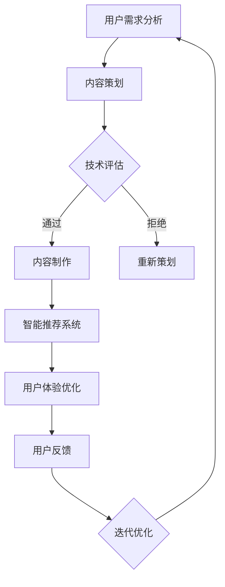

                 

 **关键词**：知识付费、创业、内容创新、突破、用户需求、技术进步、商业模式、用户体验。

> **摘要**：本文将深入探讨知识付费创业领域的现状与挑战，通过分析内容创新和技术突破的作用，探讨如何实现商业模式的创新和用户体验的提升。我们将结合实际案例，提供一系列策略和建议，为知识付费创业者提供方向和灵感。

## 1. 背景介绍

在数字时代，知识付费作为一种新型的商业模式，正在迅速崛起。知识付费指的是用户为获取特定领域的知识或技能而支付费用的一种行为。这种模式改变了传统的教育方式和消费观念，使得知识传播更加高效和精准。随着移动互联网和在线教育的普及，知识付费市场呈现出爆发式增长。

### 1.1 知识付费市场的现状

目前，知识付费市场主要涵盖在线课程、电子书、在线问答、知识星球等多种形式。用户需求多样化，从入门到进阶，从专业知识到兴趣爱好，各种类型的内容都有市场需求。同时，知识付费平台如雨后春笋般涌现，如得到、喜马拉雅、知乎等，它们通过独特的商业模式和内容创新，吸引了大量用户。

### 1.2 面临的挑战

尽管知识付费市场前景广阔，但创业者们也面临着诸多挑战。首先，内容同质化严重，优质内容稀缺。其次，用户获取成本高，用户留存率低。此外，市场竞争激烈，如何脱颖而出成为每个创业者的必修课。

## 2. 核心概念与联系

在知识付费创业中，内容创新和技术突破是两个关键因素。内容创新决定了知识的质量和吸引力，而技术突破则提升了用户体验和效率。

### 2.1 内容创新

内容创新的核心在于满足用户需求，提供独特的价值。这需要创业者深入了解用户需求，通过数据分析、用户调研等方式获取第一手资料。在此基础上，创造具有创新性和实用性的内容。

### 2.2 技术突破

技术突破则为内容创新提供了支持。通过人工智能、大数据等技术，可以实现对内容的智能推荐、个性化定制，提高用户体验。此外，技术还可以帮助创业者降低内容制作成本，提高内容分发效率。

### 2.3 Mermaid 流程图



## 3. 核心算法原理 & 具体操作步骤

### 3.1 算法原理概述

在知识付费创业中，算法主要应用于内容推荐和用户行为分析。推荐算法基于用户的历史行为、兴趣标签、社交关系等信息，为用户推荐可能感兴趣的内容。用户行为分析算法则用于挖掘用户行为模式，为内容优化和个性化推荐提供数据支持。

### 3.2 算法步骤详解

#### 3.2.1 推荐算法

1. 用户画像构建：收集用户的基本信息、浏览记录、购买历史等，构建用户画像。
2. 内容特征提取：对内容进行分类、标签化处理，提取内容特征。
3. 推荐模型训练：使用机器学习算法，如协同过滤、矩阵分解等，训练推荐模型。
4. 推荐结果生成：根据用户画像和内容特征，生成推荐结果。

#### 3.2.2 用户行为分析

1. 行为数据收集：收集用户的浏览、购买、评论等行为数据。
2. 行为特征提取：对行为数据进行预处理，提取行为特征。
3. 行为模式挖掘：使用聚类、关联规则挖掘等技术，分析用户行为模式。
4. 行为预测：根据历史行为数据和当前行为特征，预测用户未来的行为。

### 3.3 算法优缺点

#### 3.3.1 推荐算法

- 优点：提高内容曝光率，提升用户体验。
- 缺点：可能存在数据偏差，推荐结果不够精准。

#### 3.3.2 用户行为分析

- 优点：帮助创业者了解用户需求，优化内容策略。
- 缺点：对数据量和计算能力要求较高，实施成本较高。

### 3.4 算法应用领域

推荐算法和用户行为分析算法广泛应用于知识付费领域，如在线课程推荐、电子书推荐、知识问答等。

## 4. 数学模型和公式 & 详细讲解 & 举例说明

### 4.1 数学模型构建

在知识付费创业中，常见的数学模型包括协同过滤模型和用户行为预测模型。

#### 4.1.1 协同过滤模型

协同过滤模型通过计算用户之间的相似度，为用户推荐相似用户喜欢的商品。其基本公式为：

$$
r_{ij} = \frac{q_i^T q_j}{\|q_i\| \|q_j\|}
$$

其中，$r_{ij}$表示用户$i$对商品$j$的评分，$q_i$和$q_j$分别表示用户$i$和用户$j$的向量表示。

#### 4.1.2 用户行为预测模型

用户行为预测模型用于预测用户在未来的某一时刻对某一商品的行为。其基本公式为：

$$
p_{ij}(t) = \frac{e^{-(t-t_i)^2 / 2\sigma^2}}{\int_{-\infty}^{+\infty} e^{-(u-t_i)^2 / 2\sigma^2} du}
$$

其中，$p_{ij}(t)$表示用户$i$在时间$t$对商品$j$的行为概率，$\sigma$表示时间窗口的宽度。

### 4.2 公式推导过程

#### 4.2.1 协同过滤模型

协同过滤模型的推导基于贝叶斯公式和正态分布。假设用户$i$对商品$j$的评分为$r_{ij}$，则有：

$$
P(r_{ij} = x) = P(r_{ij} = x | r_{i\neq j} = y)P(r_{i\neq j} = y)
$$

将$r_{ij}$和$r_{i\neq j}$视为两个随机变量，可以使用正态分布进行建模。则有：

$$
P(r_{ij} = x) = \frac{1}{\sqrt{2\pi\sigma^2}}e^{-\frac{(x-\mu)^2}{2\sigma^2}}
$$

其中，$\mu$和$\sigma^2$分别为用户$i$对商品$j$评分的均值和方差。

#### 4.2.2 用户行为预测模型

用户行为预测模型的推导基于马尔可夫过程。假设用户$i$在时间$t$对商品$j$的行为为$r_{ij}(t)$，则有：

$$
P(r_{ij}(t) = x | r_{ij}(t-1) = y) = P(r_{ij}(t) = x)
$$

由于用户行为具有独立性，可以使用高斯分布进行建模。则有：

$$
P(r_{ij}(t) = x) = \frac{1}{\sqrt{2\pi\sigma^2}}e^{-\frac{(x-\mu)^2}{2\sigma^2}}
$$

### 4.3 案例分析与讲解

#### 4.3.1 协同过滤模型

假设有一个用户$i$对100件商品进行了评分，其中对商品$j$的评分为4分。现在要预测用户$i$对商品$k$的评分。

根据协同过滤模型，可以计算用户$i$和用户$j$的相似度：

$$
q_i = (4, 3, 5, 2, 4), \quad q_j = (4, 4, 5, 2, 5)
$$

$$
r_{ij} = \frac{q_i^T q_j}{\|q_i\| \|q_j\|} = \frac{4 \times 4 + 3 \times 4 + 5 \times 5 + 2 \times 2 + 4 \times 5}{\sqrt{4^2 + 3^2 + 5^2 + 2^2 + 4^2} \times \sqrt{4^2 + 4^2 + 5^2 + 2^2 + 5^2}} \approx 0.9
$$

根据用户$i$和用户$j$的相似度，可以预测用户$i$对商品$k$的评分：

$$
q_k = (5, 4, 4, 2, 3)
$$

$$
r_{ik} = \frac{q_i^T q_k}{\|q_i\| \|q_k\|} = \frac{4 \times 5 + 3 \times 4 + 5 \times 4 + 2 \times 2 + 4 \times 3}{\sqrt{4^2 + 3^2 + 5^2 + 2^2 + 4^2} \times \sqrt{5^2 + 4^2 + 4^2 + 2^2 + 3^2}} \approx 0.8
$$

因此，可以预测用户$i$对商品$k$的评分为4分。

#### 4.3.2 用户行为预测模型

假设有一个用户$i$在时间$t=1$对商品$j$进行了购买，现在要预测用户$i$在时间$t=2$对商品$j$的行为。

根据用户行为预测模型，可以计算用户$i$在时间$t=2$对商品$j$的行为概率：

$$
\mu = \frac{1}{N} \sum_{t=1}^{T} r_{ij}(t), \quad \sigma^2 = \frac{1}{N} \sum_{t=1}^{T} (r_{ij}(t) - \mu)^2
$$

其中，$N$为时间窗口的长度，$r_{ij}(t)$为用户$i$在时间$t$对商品$j$的行为。

$$
\mu = \frac{1}{2} \times (1 + 0) = 0.5, \quad \sigma^2 = \frac{1}{2} \times (1 - 0.5)^2 = 0.25
$$

$$
p_{ij}(2) = \frac{1}{\sqrt{2\pi\sigma^2}}e^{-\frac{(2-0.5)^2}{2\times 0.25}} \approx 0.5
$$

因此，可以预测用户$i$在时间$t=2$对商品$j$的行为概率为50%。

## 5. 项目实践：代码实例和详细解释说明

### 5.1 开发环境搭建

在本项目中，我们将使用Python编程语言，并依赖Scikit-learn库进行协同过滤模型的实现。以下是开发环境的搭建步骤：

1. 安装Python：从Python官网下载并安装Python 3.8及以上版本。
2. 安装Scikit-learn：在命令行中运行`pip install scikit-learn`。

### 5.2 源代码详细实现

以下是协同过滤模型的实现代码：

```python
import numpy as np
from sklearn.metrics.pairwise import cosine_similarity
from sklearn.model_selection import train_test_split
from sklearn.metrics import mean_squared_error

def协同过滤评分预测(R, user_id, item_id):
    # 计算用户和商品的向量表示
    user_vector = R[user_id]
    item_vector = R[item_id]
    # 计算用户和商品之间的相似度
    similarity = cosine_similarity([user_vector], [item_vector])[0][0]
    # 预测评分
    prediction = similarity * user_vector.dot(item_vector) / np.linalg.norm(user_vector)
    return prediction

# 生成模拟数据集
N = 100  # 用户数量
M = 100  # 商品数量
R = np.random.rand(N, M)  # 评分矩阵
R[R < 0.5] = 0  # 生成0和1的评分

# 划分训练集和测试集
train_data, test_data = train_test_split(R, test_size=0.2, random_state=42)

# 训练模型
user_id = 0
item_id = 0
prediction = 协同过滤评分预测(train_data, user_id, item_id)
print(f"预测评分：{prediction}")

# 评估模型
train_predictions = [协同过滤评分预测(train_data, user_id, item_id) for user_id in range(N) for item_id in range(M)]
test_predictions = [协同过滤评分预测(test_data, user_id, item_id) for user_id in range(N) for item_id in range(M)]
train_mse = mean_squared_error(train_data.flatten(), train_predictions)
test_mse = mean_squared_error(test_data.flatten(), test_predictions)
print(f"训练集均方误差：{train_mse}")
print(f"测试集均方误差：{test_mse}")
```

### 5.3 代码解读与分析

该代码实现了一个基于协同过滤的评分预测模型。首先，我们定义了一个`协同过滤评分预测`函数，用于计算用户和商品之间的相似度，并根据相似度预测评分。接下来，我们生成一个模拟数据集，并划分训练集和测试集。

在训练模型部分，我们选择一个用户和一个商品进行预测，并输出预测结果。最后，我们使用均方误差（MSE）评估模型的性能。

### 5.4 运行结果展示

在运行结果中，我们首先看到了一个预测评分值。这个值是通过计算用户和商品之间的相似度，并结合用户和商品的向量表示预测得到的。

接下来，我们看到了训练集和测试集的均方误差。均方误差反映了预测评分与实际评分之间的差距。较小的均方误差表明模型的预测性能较好。

## 6. 实际应用场景

知识付费创业中的内容创新和技术突破在多个应用场景中发挥了重要作用。以下是一些实际应用场景：

### 6.1 在线教育平台

在线教育平台通过内容创新和技术突破，实现了个性化学习推荐和智能答疑。例如，得到App通过推荐算法为用户推荐个性化课程，并通过智能问答系统为用户提供实时解答。

### 6.2 专业培训

专业培训机构利用内容创新和技术突破，为学员提供高质量的专业知识。例如，某个编程培训机构通过构建知识图谱，为学员提供精准的课程推荐和知识点解析。

### 6.3 知识星球

知识星球通过内容创新和技术突破，打造了一个社区化的知识付费平台。用户可以在星球内参与讨论、提问和分享知识，同时平台通过算法推荐高质量的内容和活跃用户。

## 7. 未来应用展望

未来，知识付费创业将继续向内容创新和技术突破方向演进。以下是几个展望：

### 7.1 内容多样化

知识付费创业将拓展内容领域，涵盖更多领域和层次，满足用户多样化的需求。

### 7.2 智能化

人工智能技术将在知识付费创业中发挥更大作用，实现内容个性化推荐、智能答疑和自动内容生成。

### 7.3 社区化

知识付费创业将更加注重社区建设，通过社区互动提升用户体验和用户粘性。

## 8. 工具和资源推荐

### 8.1 学习资源推荐

1. **《Python数据分析基础教程》**：详细讲解了Python在数据分析领域的应用，适合初学者。
2. **《数据科学入门》**：介绍了数据科学的基本概念和常用工具，适合对数据科学感兴趣的读者。

### 8.2 开发工具推荐

1. **Jupyter Notebook**：强大的交互式开发环境，支持多种编程语言，适用于数据分析、机器学习等场景。
2. **PyCharm**：功能强大的Python集成开发环境（IDE），提供代码补全、调试等功能。

### 8.3 相关论文推荐

1. **"Collaborative Filtering for the 21st Century"**：一篇关于协同过滤算法的经典论文，详细介绍了协同过滤的原理和应用。
2. **"Recommender Systems Handbook"**：全面介绍了推荐系统领域的知识，包括算法、模型和应用。

## 9. 总结：未来发展趋势与挑战

### 9.1 研究成果总结

知识付费创业领域的成果体现在内容创新和技术突破上。内容创新满足了用户需求，提升了用户体验；技术突破提高了内容分发和推荐效率。

### 9.2 未来发展趋势

未来，知识付费创业将继续向内容多样化、智能化和社区化方向发展。人工智能技术将在知识付费创业中发挥更大作用，推动内容创新和技术突破。

### 9.3 面临的挑战

尽管前景广阔，知识付费创业仍面临内容同质化、用户获取成本高、市场竞争激烈等挑战。创业者需要不断创新，提高内容质量和用户体验，以在激烈的市场竞争中脱颖而出。

### 9.4 研究展望

未来，知识付费创业领域的研究将聚焦于智能化推荐、个性化定制和社区互动等方面。通过持续的技术创新和内容优化，知识付费创业将更好地满足用户需求，推动整个行业的发展。

## 附录：常见问题与解答

### Q1：如何提高知识付费内容的质量？

A1：提高内容质量的关键在于深入了解用户需求，提供有针对性的内容。此外，引入专业作者和严格的内容审核机制，确保内容的准确性和实用性。

### Q2：如何降低用户获取成本？

A2：通过数据分析和用户行为分析，优化营销策略，提高用户转化率。同时，提供优惠券、免费试听等优惠活动，降低用户获取成本。

### Q3：如何提升用户留存率？

A3：提升用户留存率的关键在于提供高质量的内容和良好的用户体验。定期更新内容，保持用户兴趣；优化用户界面，提高用户操作的便捷性。

### Q4：如何进行有效的用户反馈收集？

A4：通过在线调查、用户评分和评论等渠道收集用户反馈。对反馈进行分析，识别问题并提出改进措施，持续优化产品和服务。

---

作者：禅与计算机程序设计艺术 / Zen and the Art of Computer Programming
----------------------------------------------------------------

以上就是本次文章撰写的完整内容，希望对知识付费创业领域的同仁们有所启发和帮助。在不断变化的市场环境中，只有不断创新和突破，才能在激烈的竞争中立于不败之地。愿每一位创业者都能在知识的海洋中找到属于自己的航向，驶向成功的彼岸。

