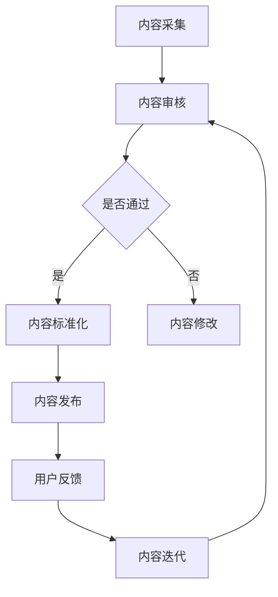

                 

关键词：知识付费、内容标准化、规模化、知识管理、技术解决方案、商业模式创新

> 摘要：随着知识经济的崛起，知识付费成为新的商业机会。然而，如何有效地实现内容标准化与规模化，是知识付费创业中面临的重大挑战。本文从技术视角出发，探讨知识付费领域的核心概念、算法原理、数学模型、实际应用案例，并展望其未来发展趋势与挑战。

## 1. 背景介绍

知识付费，顾名思义，是用户为获取特定知识或信息而支付的费用。在互联网时代，知识付费呈现出爆发式增长，尤其在教育、技能培训、专业咨询等领域。随着知识付费市场的不断扩展，内容的质量与标准化问题日益凸显。一方面，高质量的内容能够吸引更多用户，提升用户满意度；另一方面，内容标准化有助于降低生产成本，实现规模化运营。因此，如何实现知识付费内容的标准化和规模化，成为知识付费创业的重要课题。

### 内容标准化的重要性

内容标准化是知识付费领域的基础，具有以下几个方面的意义：

1. **提高内容质量**：标准化有助于确保内容的质量和一致性，减少内容冗余和错误。
2. **降低生产成本**：标准化可以简化内容生产流程，提高效率，降低生产成本。
3. **提升用户体验**：标准化的内容更容易被用户接受，提高用户满意度和粘性。
4. **促进规模化运营**：标准化的内容可以轻松复制和推广，实现规模化运营。

### 内容规模化的意义

内容规模化是知识付费创业的关键，主要体现在以下几个方面：

1. **扩大市场份额**：通过规模化生产，可以降低单个用户的获取成本，扩大市场份额。
2. **增加收入来源**：规模化运营可以带来更多的收入，提高企业的盈利能力。
3. **提升品牌影响力**：规模化的内容生产和推广有助于提升品牌知名度和影响力。
4. **优化商业模式**：规模化运营可以为企业提供更多的商业模式创新机会，如订阅制、付费会员等。

## 2. 核心概念与联系

### 核心概念

在知识付费创业中，核心概念包括：

- **内容生产**：知识付费的核心在于高质量的内容生产。
- **内容标准化**：通过标准化确保内容的质量和一致性。
- **规模化运营**：通过规模化降低成本，提高效率。

### 架构与流程

以下是一个简化的知识付费内容生产与标准化的 Mermaid 流程图：



### 流程说明

1. **内容采集**：收集各种来源的知识内容，如专家讲座、专业文章、实践经验等。
2. **内容审核**：对采集的内容进行初步审核，确保内容的真实性和合法性。
3. **内容标准化**：对审核通过的内容进行标准化处理，包括格式调整、内容梳理等。
4. **内容发布**：将标准化后的内容发布到知识付费平台。
5. **用户反馈**：收集用户对内容的反馈，用于改进内容。
6. **内容迭代**：根据用户反馈和内容审核结果，对内容进行迭代更新。

## 3. 核心算法原理 & 具体操作步骤

### 3.1 算法原理概述

在知识付费领域，内容标准化与规模化需要依赖一系列算法技术。以下介绍几种核心算法及其原理：

- **自然语言处理（NLP）**：用于内容分析和理解，包括分词、词性标注、句法分析等。
- **机器学习**：用于预测用户偏好和内容推荐，包括分类、聚类、关联规则挖掘等。
- **数据挖掘**：用于发现内容之间的关系和潜在价值，包括关联分析、关联规则挖掘等。

### 3.2 算法步骤详解

1. **内容采集**：使用 NLP 技术对采集到的内容进行预处理，如分词、去噪等。
2. **内容审核**：使用分类算法对内容进行初步审核，如恶意内容检测、版权验证等。
3. **内容标准化**：使用数据清洗和变换技术，对内容进行格式统一、内容梳理等。
4. **内容推荐**：使用机器学习算法，根据用户行为和偏好推荐相关内容。
5. **用户反馈**：收集用户对内容的评价和反馈，用于内容迭代和优化。

### 3.3 算法优缺点

- **自然语言处理（NLP）**：
  - 优点：能够深入理解和分析文本内容，提高内容质量。
  - 缺点：计算复杂度高，对大规模数据处理能力有限。

- **机器学习**：
  - 优点：能够自动发现用户偏好，提高内容推荐效果。
  - 缺点：需要大量数据支持，模型训练和优化成本高。

- **数据挖掘**：
  - 优点：能够发现内容之间的关联关系，提高内容价值。
  - 缺点：对数据处理要求高，实现难度较大。

### 3.4 算法应用领域

- **内容审核**：用于确保知识付费平台上的内容合法性和真实性。
- **内容推荐**：用于提高用户满意度和留存率。
- **内容迭代**：用于根据用户反馈优化内容质量。

## 4. 数学模型和公式 & 详细讲解 & 举例说明

### 4.1 数学模型构建

在知识付费领域，常用的数学模型包括：

- **用户行为模型**：用于预测用户偏好和需求，如贝叶斯网络、决策树等。
- **内容质量模型**：用于评估内容的质量和效果，如评分模型、词频模型等。

### 4.2 公式推导过程

以下是一个简单的贝叶斯网络模型公式推导过程：

$$
P(\text{内容质量}|\text{用户评价}) = \frac{P(\text{用户评价}|\text{内容质量}) \cdot P(\text{内容质量})}{P(\text{用户评价})}
$$

其中，$P(\text{内容质量}|\text{用户评价})$ 表示在用户评价为正的前提下，内容质量的概率；$P(\text{用户评价}|\text{内容质量})$ 表示内容质量为高时，用户评价为正的概率；$P(\text{内容质量})$ 表示内容质量的先验概率；$P(\text{用户评价})$ 表示用户评价的正概率。

### 4.3 案例分析与讲解

以一个具体的知识付费平台为例，分析其用户行为模型和内容质量模型的应用。

**用户行为模型**：

1. **用户行为数据收集**：收集用户在知识付费平台上的行为数据，如浏览记录、购买行为、评价等。
2. **用户行为特征提取**：对用户行为数据进行处理，提取用户兴趣标签、行为模式等。
3. **用户行为模型构建**：使用贝叶斯网络等模型，对用户行为特征进行建模，预测用户偏好。

**内容质量模型**：

1. **内容评价数据收集**：收集用户对知识付费平台内容的评价数据，如评分、评论等。
2. **内容质量特征提取**：对内容评价数据进行处理，提取内容质量特征，如文本长度、关键词分布等。
3. **内容质量模型构建**：使用评分模型等模型，对内容质量特征进行建模，评估内容质量。

## 5. 项目实践：代码实例和详细解释说明

### 5.1 开发环境搭建

**环境要求**：

- Python 3.8+
- Scikit-learn 0.23.2+
- Pandas 1.3.3+
- Numpy 1.21.2+

**安装步骤**：

1. 安装 Python 3.8+，可以从 [Python 官网](https://www.python.org/) 下载安装。
2. 安装 Scikit-learn、Pandas 和 Numpy，可以使用 pip 命令安装：

```bash
pip install scikit-learn pandas numpy
```

### 5.2 源代码详细实现

以下是一个简单的知识付费平台用户行为模型和内容质量模型的实现示例。

```python
import pandas as pd
from sklearn.feature_extraction.text import CountVectorizer
from sklearn.naive_bayes import MultinomialNB

# 用户行为数据示例
user_data = {
    'user_id': [1, 2, 3],
    'content_id': [101, 102, 103],
    'rating': [4, 5, 3]
}

# 内容评价数据示例
content_data = {
    'content_id': [101, 102, 103],
    'content_text': [
        '这是一篇高质量的内容。',
        '这篇文章很有启发性。',
        '这篇内容有点无聊。'
    ]
}

# 构建 DataFrame
user_df = pd.DataFrame(user_data)
content_df = pd.DataFrame(content_data)

# 用户行为模型
def build_user_model(user_df):
    # 提取用户行为特征
    vectorizer = CountVectorizer()
    X = vectorizer.fit_transform(user_df['content_text'])
    # 训练模型
    model = MultinomialNB()
    model.fit(X, user_df['rating'])
    return model, vectorizer

# 内容质量模型
def build_content_model(content_df):
    # 提取内容质量特征
    vectorizer = CountVectorizer()
    X = vectorizer.fit_transform(content_df['content_text'])
    # 训练模型
    model = MultinomialNB()
    model.fit(X, content_df['rating'])
    return model, vectorizer

# 构建模型
user_model, user_vectorizer = build_user_model(user_df)
content_model, content_vectorizer = build_content_model(content_df)

# 用户行为预测
def predict_user_behavior(user_vectorizer, user_model, content_text):
    X = user_vectorizer.transform([content_text])
    prediction = user_model.predict(X)
    return prediction

# 内容质量预测
def predict_content_quality(content_vectorizer, content_model, content_text):
    X = content_vectorizer.transform([content_text])
    prediction = content_model.predict(X)
    return prediction

# 测试
print(predict_user_behavior(user_vectorizer, user_model, '这是一篇很有启发性

