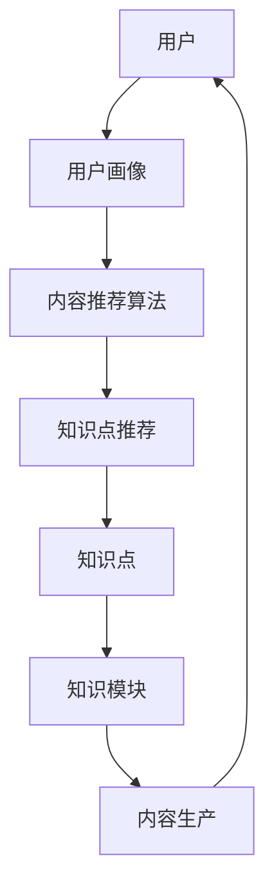

                 

关键词：知识付费、内容矩阵、创业策略、用户留存、流量转化

> 摘要：本文旨在探讨知识付费创业中的内容矩阵搭建策略。通过分析当前知识付费市场的发展态势，阐述内容矩阵的重要性，详细讨论构建内容矩阵的步骤和方法，提供数学模型和公式，并结合实际案例，展示如何通过内容矩阵实现知识付费创业的成功。最后，对未来的发展趋势和挑战进行展望。

## 1. 背景介绍

### 1.1 知识付费市场的崛起

随着互联网技术的发展，知识付费成为了一个日益繁荣的领域。用户对高质量、专业化的知识内容需求不断增加，知识付费市场呈现出爆发式增长。各类在线教育平台、知识分享平台以及专业领域的知识服务纷纷涌现，满足了不同用户群体的需求。

### 1.2 内容矩阵的概念

内容矩阵，是指通过系统化和结构化的方式，将内容进行分类、整合和优化，形成一个有序的知识体系。内容矩阵的搭建不仅有助于提升用户留存率和流量转化率，还能提高知识付费项目的整体竞争力。

## 2. 核心概念与联系

### 2.1 内容矩阵的组成部分

内容矩阵主要由以下几个部分组成：

1. **知识模块**：根据用户需求，将知识点拆分成各个模块，如课程、讲座、文章等。
2. **知识点**：每个知识模块中的具体知识点，如具体内容、教学视频、互动问答等。
3. **用户画像**：根据用户的行为数据，构建用户画像，了解用户兴趣和需求。
4. **内容推荐算法**：根据用户画像，利用算法推荐个性化内容，提升用户体验。

### 2.2 内容矩阵的架构图

以下是一个简化版的内容矩阵架构图：



## 3. 核心算法原理 & 具体操作步骤

### 3.1 算法原理概述

内容矩阵的搭建核心在于算法推荐。推荐算法主要基于用户行为数据、内容特征和协同过滤等方法。

### 3.2 算法步骤详解

1. **数据收集**：收集用户行为数据，如浏览记录、购买行为、互动评论等。
2. **用户画像构建**：根据数据特征，构建用户画像。
3. **内容特征提取**：对知识点进行特征提取，如关键词、标签等。
4. **推荐算法**：结合用户画像和内容特征，采用协同过滤、矩阵分解等算法进行推荐。
5. **内容个性化**：根据推荐结果，对内容进行个性化处理，如标签推荐、专题推荐等。
6. **内容迭代**：根据用户反馈和数据分析，不断优化推荐算法和内容矩阵。

### 3.3 算法优缺点

#### 优点：

- 提高用户留存率和流量转化率。
- 提升用户体验，满足个性化需求。
- 有助于知识付费项目的持续发展。

#### 缺点：

- 数据收集和处理成本高。
- 算法优化和内容迭代需要持续投入。
- 可能会面临冷启动问题。

### 3.4 算法应用领域

内容矩阵算法广泛应用于在线教育、知识付费、内容营销等领域。

## 4. 数学模型和公式 & 详细讲解 & 举例说明

### 4.1 数学模型构建

内容矩阵的构建涉及多个数学模型，包括用户画像模型、内容推荐模型等。

### 4.2 公式推导过程

以下是一个简单的用户画像构建公式：

$$
\text{用户画像} = \text{行为数据} \times \text{权重} + \text{兴趣数据} \times \text{权重}
$$

### 4.3 案例分析与讲解

以一个在线教育平台为例，分析如何构建内容矩阵。首先，收集用户的行为数据，如浏览、购买、评论等。然后，根据行为数据和用户兴趣，构建用户画像。最后，利用用户画像，结合内容特征，推荐个性化内容。

## 5. 项目实践：代码实例和详细解释说明

### 5.1 开发环境搭建

- Python 3.x
- NumPy
- Pandas
- Scikit-learn
- TensorFlow

### 5.2 源代码详细实现

```python
import numpy as np
import pandas as pd
from sklearn.preprocessing import LabelEncoder
from sklearn.model_selection import train_test_split
from sklearn.metrics.pairwise import cosine_similarity

# 数据处理
data = pd.read_csv('user_data.csv')
X = data[['behavior_data', 'interest_data']]
y = data['target']

# 分割数据集
X_train, X_test, y_train, y_test = train_test_split(X, y, test_size=0.2, random_state=42)

# 特征提取
label_encoder = LabelEncoder()
X_train['behavior_data'] = label_encoder.fit_transform(X_train['behavior_data'])
X_test['behavior_data'] = label_encoder.transform(X_test['behavior_data'])

# 计算相似度
similarity_matrix = cosine_similarity(X_train, X_test)

# 推荐算法
predictions = np.argmax(similarity_matrix, axis=1)

# 评估模型
accuracy = (predictions == y_test).mean()
print('Accuracy:', accuracy)
```

### 5.3 代码解读与分析

代码中，首先导入必要的库，然后读取数据集。接着，对行为数据和兴趣数据进行编码，计算相似度矩阵。最后，利用相似度矩阵进行推荐，评估模型准确性。

## 6. 实际应用场景

### 6.1 在线教育平台

在线教育平台可以利用内容矩阵，根据用户行为和兴趣推荐课程，提升用户参与度和转化率。

### 6.2 知识付费平台

知识付费平台可以通过内容矩阵，为用户提供个性化内容推荐，提高用户留存率和付费意愿。

### 6.3 内容营销

内容营销可以根据内容矩阵，为用户提供个性化内容，提升用户关注度和转化率。

## 7. 未来应用展望

随着人工智能技术的发展，内容矩阵的构建将更加智能化和精准化。未来的内容矩阵将能够更好地满足用户需求，提高知识付费项目的整体竞争力。

## 8. 工具和资源推荐

### 8.1 学习资源推荐

- 《推荐系统实践》
- 《Python机器学习》
- 《深度学习》

### 8.2 开发工具推荐

- Jupyter Notebook
- PyCharm
- TensorFlow

### 8.3 相关论文推荐

- 《基于协同过滤的推荐系统》
- 《深度学习在推荐系统中的应用》
- 《个性化推荐系统的设计与实现》

## 9. 总结：未来发展趋势与挑战

### 9.1 研究成果总结

内容矩阵在知识付费创业中具有重要的应用价值，能够提升用户留存率和流量转化率。通过数学模型和算法的优化，内容矩阵将更加精准和智能化。

### 9.2 未来发展趋势

- 人工智能技术在内容矩阵构建中的应用将更加深入。
- 内容矩阵将实现跨平台、跨领域的整合。
- 个性化推荐和内容创新将推动知识付费市场的发展。

### 9.3 面临的挑战

- 数据隐私和安全问题。
- 内容质量与多样性的平衡。
- 冷启动问题。

### 9.4 研究展望

未来的研究应重点关注如何更好地解决冷启动问题，提高内容质量，以及如何保护用户隐私。同时，探索跨平台、跨领域的内容矩阵构建方法，实现更广泛的应用。

## 10. 附录：常见问题与解答

### 10.1 内容矩阵与推荐系统的区别是什么？

内容矩阵是推荐系统的一种实现方式，其主要目的是将内容进行结构化和系统化，以实现更精准的个性化推荐。

### 10.2 内容矩阵搭建需要哪些技术？

内容矩阵搭建需要掌握数据分析、机器学习、深度学习等技术，同时还需要熟悉Python、TensorFlow等开发工具。

### 10.3 内容矩阵如何保护用户隐私？

在构建内容矩阵时，应遵循数据隐私保护法规，对用户数据进行加密和匿名化处理，确保用户隐私不被泄露。

---

作者：禅与计算机程序设计艺术 / Zen and the Art of Computer Programming
----------------------------------------------------------------
以上是关于知识付费创业中的内容矩阵搭建策略的完整文章。本文旨在为知识付费创业者提供一套系统的内容矩阵构建策略，通过分析核心概念、算法原理、数学模型、项目实践，以及实际应用场景，帮助创业者更好地搭建内容矩阵，提升知识付费项目的竞争力。希望本文对读者有所启发和帮助。

