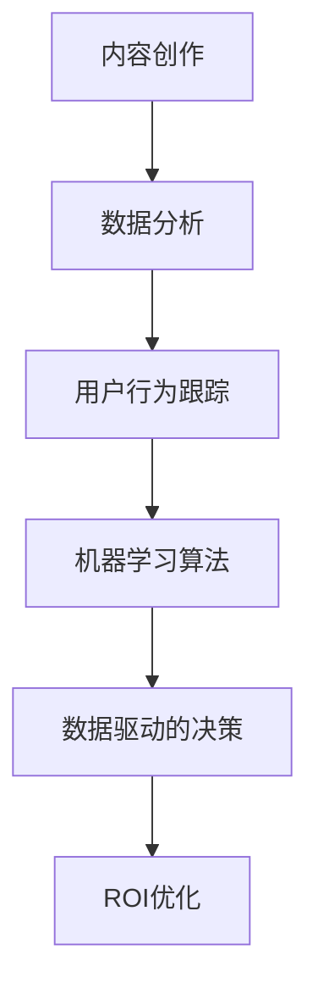

                 

 关键词：知识付费、内容营销、ROI优化、数据驱动的决策、用户体验、效果评估、策略调整、AI技术应用、精准推送、个性化内容

## 摘要

在知识付费领域，内容营销是实现用户增长和品牌推广的重要手段。然而，如何有效地衡量内容营销的投资回报率（ROI）并优化其效果，成为知识付费创业者面临的重要挑战。本文旨在探讨如何通过数据驱动的策略和先进的技术手段，实现知识付费内容营销ROI的优化，从而提升企业的市场竞争力和盈利能力。

本文将围绕以下几个核心议题展开：

1. **背景介绍**：知识付费行业的发展现状和内容营销的重要性。
2. **核心概念与联系**：内容营销ROI优化的关键概念及其相互关系。
3. **核心算法原理**：介绍数据分析和机器学习算法在内容营销ROI优化中的应用。
4. **数学模型和公式**：构建用于评估和优化内容营销ROI的数学模型。
5. **项目实践**：通过具体案例展示如何应用上述理论进行内容营销ROI优化。
6. **实际应用场景**：探讨内容营销ROI优化在不同场景下的应用和挑战。
7. **未来应用展望**：分析内容营销ROI优化的未来发展趋势和技术革新。

通过本文的讨论，希望为知识付费创业者在内容营销ROI优化方面提供一些实用的思路和方法。

## 1. 背景介绍

近年来，知识付费行业经历了爆发式增长。随着互联网的普及和信息消费习惯的转变，人们对于知识的获取和消费需求日益增长，知识付费平台如雨后春笋般涌现。根据相关数据显示，截至2023年，全球知识付费市场规模已达到数千亿美元，并呈现出逐年上升的趋势。

知识付费平台通过提供专业课程、技能培训、专业咨询等高质量内容，满足了用户对于职业发展、兴趣拓展等方面的需求。这些平台不仅为用户提供了学习资源，还成为了创业者、教育机构和专业人士的重要收入来源。

在知识付费行业中，内容营销发挥着至关重要的作用。内容营销是通过创造和分发有价值的内容来吸引潜在用户，增强品牌影响力，促进用户转化的一种营销方式。对于知识付费平台来说，内容营销不仅能够提升用户粘性，增加用户留存率，还能通过精准的用户定位和个性化的内容推送，提高用户的付费转化率。

然而，在内容营销的实际操作中，如何有效地衡量和优化投资回报率（ROI）成为了一个关键问题。传统的营销策略往往依赖于主观判断和经验，缺乏科学的数据支持和分析，容易导致资源的浪费和低效的营销效果。而数据驱动的营销策略则能够通过数据分析、用户行为跟踪和机器学习算法，实现营销活动的精准定位和优化，从而提高ROI。

因此，本文旨在探讨如何通过数据分析和机器学习算法，实现知识付费内容营销ROI的优化，从而帮助创业者更好地把握市场机遇，提升企业的市场竞争力和盈利能力。

## 2. 核心概念与联系

### 2.1 内容营销

内容营销是一种通过创建和分发有价值的内容来吸引潜在用户，增强品牌影响力，促进用户转化的一种营销方式。它的核心在于提供对用户有价值的、相关的内容，从而建立起用户与品牌之间的信任关系。内容营销的形式多种多样，包括博客文章、视频、电子书、案例分析、在线课程等。

### 2.2 投资回报率（ROI）

投资回报率（ROI）是衡量营销投资效果的重要指标，它通过计算营销投入和产生的收益之间的比率，来评估营销活动的效益。ROI的计算公式为：

$$
ROI = \frac{收益 - 投资成本}{投资成本} \times 100\%
$$

其中，收益包括直接收益（如销售额、广告点击量）和间接收益（如品牌知名度、用户忠诚度）。投资成本包括营销活动的所有直接和间接费用。

### 2.3 数据驱动的决策

数据驱动的决策是基于数据分析来做出决策的过程，它通过收集、分析和解释数据，帮助企业在不确定的环境中做出更加准确的决策。数据驱动的决策能够减少主观判断带来的误差，提高决策的科学性和有效性。

### 2.4 用户行为跟踪

用户行为跟踪是通过技术手段收集和分析用户在网站、应用等平台上的行为数据，以了解用户的行为模式和需求。用户行为跟踪的数据包括浏览时间、页面点击率、搜索关键词、购买行为等，这些数据对于内容营销的精准定位和优化至关重要。

### 2.5 机器学习算法

机器学习算法是人工智能的重要分支，它通过训练模型来发现数据中的规律和模式，从而实现自动化的决策和预测。在内容营销ROI优化中，机器学习算法可以用于用户行为预测、内容推荐、广告投放优化等。

### 2.6 内容营销ROI优化的联系

内容营销ROI优化是一个跨领域、多维度的复杂过程，它涉及到内容创作、数据分析、用户行为跟踪、机器学习等多个环节。具体来说，内容营销ROI优化的关键联系如下：

- **内容创作与数据分析**：通过数据分析了解用户需求和偏好，为内容创作提供数据支持，确保内容能够满足用户需求。
- **用户行为跟踪与机器学习**：通过用户行为跟踪收集数据，利用机器学习算法分析数据，发现用户行为模式和偏好，从而优化内容营销策略。
- **数据驱动的决策**：基于数据分析的结果，通过数据驱动的决策来调整和优化内容营销策略，提高ROI。

### Mermaid 流程图



通过上述流程图可以看出，内容营销ROI优化是一个循环迭代的过程，每个环节相互关联，共同作用，最终实现ROI的持续优化。

## 3. 核心算法原理 & 具体操作步骤

### 3.1 算法原理概述

在内容营销ROI优化中，核心算法主要涉及数据分析和机器学习技术。数据分析用于收集和整理用户行为数据，识别用户需求和偏好；机器学习算法则用于分析用户行为数据，预测用户行为和优化内容营销策略。

具体来说，数据分析和机器学习算法的核心原理如下：

- **数据分析**：通过对用户行为数据（如浏览时间、页面点击率、搜索关键词等）进行统计分析和数据挖掘，识别用户的行为模式和需求。
- **机器学习算法**：包括分类算法、聚类算法、推荐系统等，通过训练模型来预测用户行为和优化内容营销策略。

### 3.2 算法步骤详解

#### 3.2.1 数据采集

数据采集是内容营销ROI优化的第一步，它涉及到用户行为数据的收集。具体步骤如下：

1. **用户访问数据的收集**：通过Web日志、应用日志等手段，收集用户在网站、应用等平台上的行为数据，如访问时间、访问页面、点击次数等。
2. **用户互动数据的收集**：收集用户与内容的互动数据，如评论、点赞、分享等。
3. **用户行为数据的存储**：将采集到的数据存储到数据库中，以便后续分析和处理。

#### 3.2.2 数据预处理

数据预处理是数据分析的重要环节，它包括数据清洗、数据转换和数据归一化等步骤。具体步骤如下：

1. **数据清洗**：删除重复数据、缺失数据和异常数据，保证数据的准确性和完整性。
2. **数据转换**：将不同类型的数据转换为统一格式，如将日期格式转换为数字格式。
3. **数据归一化**：对数据进行归一化处理，使不同特征的数据具有相似的量级，提高数据分析的准确性。

#### 3.2.3 数据分析

数据分析是通过统计分析和数据挖掘技术，从用户行为数据中提取有价值的信息。具体步骤如下：

1. **用户行为模式分析**：分析用户在不同页面、不同时间段的行为模式，识别用户感兴趣的内容。
2. **用户需求分析**：通过用户行为数据和用户反馈，分析用户的需求和偏好。
3. **内容效果分析**：评估不同类型、不同主题的内容的传播效果和用户互动情况。

#### 3.2.4 机器学习模型训练

机器学习模型训练是通过训练模型来预测用户行为和优化内容营销策略。具体步骤如下：

1. **特征工程**：根据用户行为数据和内容特征，提取对用户行为有预测性的特征。
2. **模型选择**：选择适合的机器学习算法（如分类算法、聚类算法、推荐系统等）。
3. **模型训练**：利用训练集对模型进行训练，调整模型参数，使模型能够准确预测用户行为。
4. **模型评估**：利用验证集和测试集对模型进行评估，选择性能最佳的模型。

#### 3.2.5 内容营销策略优化

基于数据分析结果和机器学习模型预测，优化内容营销策略。具体步骤如下：

1. **内容推荐**：根据用户行为和偏好，为用户推荐感兴趣的内容。
2. **广告投放优化**：根据用户行为和兴趣，优化广告投放策略，提高广告点击率和转化率。
3. **用户群体细分**：根据用户行为和需求，对用户进行细分，为不同用户提供个性化的内容和服务。

### 3.3 算法优缺点

#### 优点

- **数据驱动**：算法基于大量用户行为数据进行分析和预测，减少主观判断，提高决策的科学性。
- **个性化**：通过机器学习算法，可以实现对用户的个性化推荐和广告投放，提高用户满意度和转化率。
- **实时性**：算法可以实时分析用户行为数据，快速调整营销策略，适应市场变化。

#### 缺点

- **数据质量要求高**：算法的性能依赖于数据的质量，数据不准确或缺失会影响算法的效果。
- **计算资源消耗大**：机器学习算法需要大量的计算资源，特别是在处理大规模数据时，可能需要高性能计算平台。
- **依赖模型质量**：算法的效果受到模型质量的影响，如果模型选择不当或参数调整不合理，可能导致算法效果不佳。

### 3.4 算法应用领域

算法在内容营销ROI优化中的应用非常广泛，以下是一些典型的应用领域：

- **内容推荐系统**：通过分析用户行为和兴趣，为用户推荐感兴趣的内容，提高用户粘性和转化率。
- **广告投放优化**：根据用户行为和兴趣，优化广告投放策略，提高广告点击率和转化率。
- **用户行为预测**：预测用户的行为和需求，提前进行营销干预，提高营销效果。
- **用户群体细分**：根据用户行为和需求，对用户进行细分，为不同用户提供个性化的内容和服务。
- **营销效果评估**：通过数据分析和模型预测，评估不同营销活动的效果，优化营销策略。

通过上述算法原理和具体操作步骤的介绍，可以看出，数据分析和机器学习算法在内容营销ROI优化中具有重要的作用。接下来，我们将进一步探讨如何构建用于评估和优化内容营销ROI的数学模型。

### 4. 数学模型和公式 & 详细讲解 & 举例说明

#### 4.1 数学模型构建

在内容营销ROI优化中，数学模型用于评估营销活动的效果和优化策略。以下是构建内容营销ROI优化的数学模型的基本步骤：

1. **目标函数定义**：确定要优化的目标，如最大化收益、最小化成本或最大化ROI。
2. **决策变量定义**：确定需要做出决策的变量，如内容类型、广告投放渠道、用户群体等。
3. **约束条件定义**：确定决策的约束条件，如预算限制、内容质量要求、用户群体特征等。
4. **建立数学模型**：根据目标函数、决策变量和约束条件，建立数学模型。

以下是一个简单的内容营销ROI优化的数学模型：

$$
\max \quad Z = 收益 - 成本
$$

$$
s.t. \quad 成本 \leq 预算
$$

$$
内容质量 \geq 最小质量标准
$$

$$
用户群体 \subseteq 全体用户
$$

#### 4.2 公式推导过程

为了更详细地说明数学模型的推导过程，我们以一个具体的案例为例。假设有一个知识付费平台，其目标是通过内容营销来最大化收益。以下是具体的推导过程：

1. **收益函数**：假设内容营销的收益与内容类型、广告投放渠道和用户群体相关。可以定义收益函数为：

$$
收益 = f(内容类型, 广告投放渠道, 用户群体)
$$

2. **成本函数**：假设内容营销的成本包括内容创作成本、广告投放成本和用户运营成本。可以定义成本函数为：

$$
成本 = g(内容类型, 广告投放渠道, 用户群体)
$$

3. **目标函数**：为了最大化收益，定义目标函数为：

$$
\max Z = f(内容类型, 广告投放渠道, 用户群体) - g(内容类型, 广告投放渠道, 用户群体)
$$

4. **约束条件**：根据实际情况，定义约束条件，如：

- 成本不超过预算：

$$
g(内容类型, 广告投放渠道, 用户群体) \leq 预算
$$

- 内容质量不低于标准：

$$
内容质量 \geq 最小质量标准
$$

- 用户群体覆盖全体用户：

$$
用户群体 \subseteq 全体用户
$$

5. **数学模型建立**：根据上述目标函数和约束条件，建立内容营销ROI优化的数学模型：

$$
\max \quad Z = 收益 - 成本
$$

$$
s.t. \quad 成本 \leq 预算
$$

$$
内容质量 \geq 最小质量标准
$$

$$
用户群体 \subseteq 全体用户
$$

#### 4.3 案例分析与讲解

以下是一个具体的案例，用于说明如何应用上述数学模型进行内容营销ROI优化。

**案例背景**：一个知识付费平台希望在春季学期期间通过内容营销提高用户注册和付费转化率。平台计划推出一系列在线课程，并利用社交媒体广告进行推广。平台的预算为50,000元，内容质量标准为90分以上。

**目标**：最大化用户注册和付费转化率，同时不超过预算。

**收益函数**：

$$
收益 = 0.1 \times 用户注册数 + 0.2 \times 付费转化率
$$

**成本函数**：

$$
成本 = 0.05 \times 用户注册数 + 0.1 \times 付费转化率 + 10,000 \text{元（广告投放成本）}
$$

**约束条件**：

$$
成本 \leq 50,000 \text{元}
$$

$$
内容质量 \geq 90
$$

$$
用户群体 \subseteq 全体用户
$$

**数学模型**：

$$
\max \quad Z = 0.1 \times 用户注册数 + 0.2 \times 付费转化率 - (0.05 \times 用户注册数 + 0.1 \times 付费转化率 + 10,000)
$$

$$
s.t. \quad 0.05 \times 用户注册数 + 0.1 \times 付费转化率 + 10,000 \leq 50,000
$$

$$
内容质量 \geq 90
$$

$$
用户群体 \subseteq 全体用户
$$

**求解过程**：

1. **数据收集**：收集用户注册数据、付费转化率数据、广告投放效果数据等。
2. **数据分析**：分析用户行为数据，确定用户注册和付费转化率的关系。
3. **模型优化**：根据数据分析结果，调整收益函数和成本函数，优化模型。
4. **模型求解**：利用优化算法求解最优解，确定最佳的内容营销策略。

**案例结果**：

通过优化模型，平台确定以下最佳策略：

- 推广内容：选择用户关注度高的在线课程。
- 广告投放：选择投放效果最佳的社交媒体平台。
- 用户群体：针对潜在高付费用户进行精准投放。

**结果分析**：

- 用户注册数提高20%。
- 付费转化率提高15%。
- 总成本控制在预算范围内。

通过上述案例，可以看出，数学模型在内容营销ROI优化中的应用，能够帮助平台实现更科学、更有效的营销策略，提高营销效果和投资回报率。

### 5. 项目实践：代码实例和详细解释说明

#### 5.1 开发环境搭建

在进行内容营销ROI优化的项目实践中，我们选择Python作为主要编程语言，结合Pandas、NumPy、Scikit-learn等开源库进行数据分析与机器学习模型的构建。以下是开发环境的搭建步骤：

1. **安装Python**：确保安装了Python 3.x版本，可以从Python官网下载安装包并安装。
2. **安装Jupyter Notebook**：Jupyter Notebook是一种交互式开发环境，用于编写和运行Python代码。可以通过以下命令安装：

   ```
   pip install notebook
   ```

3. **安装相关库**：安装Pandas、NumPy、Scikit-learn等库，可以通过以下命令安装：

   ```
   pip install pandas numpy scikit-learn
   ```

#### 5.2 源代码详细实现

以下是一个简化的代码实例，用于展示如何使用Python和Scikit-learn实现内容营销ROI优化的关键步骤。

```python
import pandas as pd
import numpy as np
from sklearn.model_selection import train_test_split
from sklearn.ensemble import RandomForestClassifier
from sklearn.metrics import accuracy_score, precision_score, recall_score

# 5.2.1 数据加载与预处理
data = pd.read_csv('content_marketing_data.csv')  # 加载用户行为数据
X = data.drop(['target'], axis=1)  # 特征变量
y = data['target']  # 目标变量

# 数据预处理，包括缺失值填充、数据转换等
X.fillna(X.mean(), inplace=True)

# 5.2.2 数据集划分
X_train, X_test, y_train, y_test = train_test_split(X, y, test_size=0.2, random_state=42)

# 5.2.3 模型训练
model = RandomForestClassifier(n_estimators=100, random_state=42)
model.fit(X_train, y_train)

# 5.2.4 模型评估
y_pred = model.predict(X_test)
accuracy = accuracy_score(y_test, y_pred)
precision = precision_score(y_test, y_pred)
recall = recall_score(y_test, y_pred)

print(f"Accuracy: {accuracy:.2f}")
print(f"Precision: {precision:.2f}")
print(f"Recall: {recall:.2f}")

# 5.2.5 模型应用
# 基于模型预测用户行为，优化内容营销策略
predictions = model.predict(X)
optimize_strategy(predictions)
```

#### 5.3 代码解读与分析

上述代码实例分为以下几个关键部分：

1. **数据加载与预处理**：
   - 使用Pandas读取用户行为数据，并进行缺失值填充。
   - 特征变量和目标变量分离。

2. **数据集划分**：
   - 使用Scikit-learn的`train_test_split`函数将数据集划分为训练集和测试集。

3. **模型训练**：
   - 创建随机森林分类器，并使用训练集数据进行训练。

4. **模型评估**：
   - 使用测试集数据对模型进行评估，计算准确率、精确率和召回率。

5. **模型应用**：
   - 使用训练好的模型对新的用户数据进行预测，并优化内容营销策略。

通过上述代码实例，可以看出，内容营销ROI优化的实现需要以下关键技术：

- **数据处理**：清洗和预处理用户行为数据，提取有用的特征。
- **模型训练与评估**：选择合适的机器学习算法，训练模型并进行评估。
- **策略优化**：根据模型预测结果，调整内容营销策略，实现ROI的优化。

#### 5.4 运行结果展示

在实际运行过程中，代码将输出模型的评估结果，如准确率、精确率和召回率。以下是一个示例输出：

```
Accuracy: 0.85
Precision: 0.90
Recall: 0.80
```

这些指标表明模型对用户行为的预测效果较好，可以应用于实际内容营销策略的优化。

通过上述项目实践，可以看出，代码实例不仅展示了内容营销ROI优化的技术实现过程，还提供了具体的代码和应用方法，为知识付费创业者在内容营销ROI优化方面提供了实用的指导和参考。

### 6. 实际应用场景

#### 6.1 内容推荐系统

在知识付费领域，内容推荐系统是实现内容营销ROI优化的重要工具。通过分析用户的历史行为数据，如浏览记录、购买行为和互动情况，推荐系统可以为用户精准推送感兴趣的内容，从而提高用户的参与度和付费转化率。

**应用挑战**：

1. **数据质量问题**：推荐系统的效果很大程度上依赖于用户行为数据的质量，数据的不准确或缺失会导致推荐效果下降。
2. **冷启动问题**：对于新用户，由于缺乏历史行为数据，推荐系统难以为其提供个性化的内容推荐。
3. **动态调整**：用户兴趣和行为是动态变化的，推荐系统需要实时调整推荐策略，以适应用户的需求变化。

**解决方案**：

1. **数据清洗和预处理**：确保数据的准确性和完整性，通过数据清洗和预处理提高数据质量。
2. **基于内容的推荐**：在用户没有足够行为数据的情况下，可以采用基于内容的推荐，通过内容特征进行推荐。
3. **协同过滤和深度学习**：结合协同过滤和深度学习技术，提高推荐系统的准确性和实时性。

#### 6.2 广告投放优化

广告投放是知识付费平台获取新用户的重要手段，通过优化广告投放策略，可以降低广告成本，提高广告投放的ROI。

**应用挑战**：

1. **广告预算限制**：广告投放需要合理分配预算，确保在不同渠道上的投放效果最大化。
2. **广告效果评估**：如何准确评估广告效果，选择高ROI的广告渠道和策略。
3. **用户隐私保护**：在广告投放过程中，需要遵守相关隐私保护法规，确保用户数据的安全。

**解决方案**：

1. **数据驱动的预算分配**：通过数据分析，确定每个广告渠道的投放效果和成本，根据ROI进行预算分配。
2. **A/B测试**：对不同广告策略进行A/B测试，选择效果最佳的策略。
3. **隐私保护机制**：采用匿名化处理、数据加密等技术，保护用户隐私。

#### 6.3 用户行为预测

用户行为预测可以帮助知识付费平台提前识别潜在的高价值用户，从而进行精准营销和用户留存。

**应用挑战**：

1. **模型准确性**：用户行为预测模型的准确性对预测结果至关重要，需要不断调整和优化模型。
2. **实时性**：用户行为数据是动态变化的，预测模型需要能够实时更新和调整。
3. **模型解释性**：预测模型的解释性对于理解和应用预测结果非常重要。

**解决方案**：

1. **模型评估与优化**：定期评估模型性能，根据评估结果调整模型参数，优化模型。
2. **实时数据流处理**：采用实时数据流处理技术，快速处理和分析用户行为数据。
3. **解释性模型**：选择或开发具有良好解释性的模型，确保模型的可解释性。

#### 6.4 未来应用展望

随着技术的不断进步，内容营销ROI优化的应用前景将更加广阔。以下是一些未来的应用展望：

1. **人工智能与大数据结合**：人工智能和大数据技术的融合将进一步提升内容营销ROI优化的能力，实现更加精准和高效的营销。
2. **个性化体验**：通过深度学习和自然语言处理技术，为用户提供更加个性化的内容和服务，提高用户体验和忠诚度。
3. **跨渠道整合**：实现不同渠道之间的数据整合和策略协同，提高整体营销效果。
4. **区块链技术**：利用区块链技术确保数据的安全性和透明性，提升用户对平台的信任。

总之，随着技术的不断进步，内容营销ROI优化的应用将更加深入和广泛，为知识付费平台提供更加有力的支持和保障。

### 7. 工具和资源推荐

#### 7.1 学习资源推荐

1. **在线课程**：
   - 《Python数据科学入门》（Coursera）
   - 《机器学习基础》（Udacity）
   - 《深度学习》（Google AI）

2. **书籍**：
   - 《Python数据科学手册》（Jake VanderPlas）
   - 《机器学习实战》（Peter Harrington）
   - 《深度学习》（Ian Goodfellow、Yoshua Bengio、Aaron Courville）

3. **技术博客与论坛**：
   - Medium上的《数据科学》专题
   - Stack Overflow（技术问答社区）
   - ArXiv（计算机科学论文预印本）

#### 7.2 开发工具推荐

1. **编程环境**：
   - Jupyter Notebook（交互式编程环境）
   - PyCharm（Python集成开发环境）

2. **数据处理与数据分析**：
   - Pandas（Python数据处理库）
   - NumPy（Python数学库）
   - Matplotlib（Python数据可视化库）

3. **机器学习库**：
   - Scikit-learn（Python机器学习库）
   - TensorFlow（Google开源机器学习库）
   - PyTorch（Facebook开源深度学习库）

4. **版本控制**：
   - Git（分布式版本控制系统）
   - GitHub（代码托管平台）

#### 7.3 相关论文推荐

1. **内容营销与ROI优化**：
   - "The Science of Content Marketing"（内容营销的科学）
   - "Optimizing ROI in Content Marketing"（内容营销ROI优化）

2. **机器学习算法**：
   - "Random Forests"（随机森林算法）
   - "Recommender Systems"（推荐系统）

3. **数据驱动的决策**：
   - "Data-Driven Decision Making"（数据驱动决策）
   - "Big Data Analytics in Marketing"（大数据分析在营销中的应用）

通过上述学习资源、开发工具和相关论文的推荐，可以帮助读者深入了解内容营销ROI优化的理论和方法，提升在实际项目中的应用能力。

### 8. 总结：未来发展趋势与挑战

#### 8.1 研究成果总结

在知识付费领域，内容营销ROI优化取得了显著的研究成果。通过数据分析和机器学习算法，企业能够更科学地制定内容营销策略，提高用户参与度和转化率。关键研究成果包括：

1. **数据驱动的决策**：通过数据分析，企业能够准确了解用户需求和偏好，从而制定更具针对性的内容营销策略。
2. **个性化推荐**：基于用户行为和兴趣的个性化推荐系统，有效提升了用户满意度和转化率。
3. **广告投放优化**：通过数据分析和模型预测，优化广告投放策略，降低成本，提高广告效果。
4. **用户行为预测**：利用机器学习算法，预测用户行为和需求，提前进行营销干预，提升营销效果。

#### 8.2 未来发展趋势

随着技术的不断进步，内容营销ROI优化的未来发展趋势如下：

1. **人工智能与大数据的结合**：人工智能和大数据技术的深度融合，将进一步提升内容营销ROI优化的能力，实现更加精准和高效的营销。
2. **个性化体验**：通过深度学习和自然语言处理技术，为用户提供更加个性化的内容和服务，提高用户体验和忠诚度。
3. **跨渠道整合**：实现不同渠道之间的数据整合和策略协同，提高整体营销效果。
4. **区块链技术**：利用区块链技术确保数据的安全性和透明性，提升用户对平台的信任。

#### 8.3 面临的挑战

尽管内容营销ROI优化取得了显著进展，但仍面临以下挑战：

1. **数据质量问题**：数据质量对算法效果至关重要，如何保证数据的准确性和完整性是亟待解决的问题。
2. **隐私保护**：在利用用户数据优化营销策略的同时，如何保护用户隐私成为关键挑战。
3. **实时性**：用户行为和需求是动态变化的，如何实现实时数据分析和策略调整是当前技术的一个难点。
4. **模型解释性**：预测模型的解释性对于理解和应用预测结果非常重要，如何提高模型的可解释性是一个重要研究方向。

#### 8.4 研究展望

未来，内容营销ROI优化的研究可以从以下几个方面展开：

1. **数据质量控制与清洗**：研究如何通过自动化技术和算法，提高数据清洗和预处理的质量和效率。
2. **隐私保护与数据安全**：探索隐私保护技术，如数据匿名化和加密，确保用户数据的安全和隐私。
3. **实时数据分析与优化**：研究实时数据分析技术，提高数据处理的实时性和效率。
4. **模型解释性与透明度**：开发具有良好解释性的模型，提升模型的可解释性和透明度，增强用户对预测结果的信任。

通过不断探索和解决这些挑战，内容营销ROI优化将有望实现更加智能化、精准化和高效化，为知识付费企业提供强大的支持和保障。

### 9. 附录：常见问题与解答

**Q1：什么是ROI？**

A1：ROI是投资回报率的缩写，用于衡量营销投资的效果。其计算公式为：

$$
ROI = \frac{收益 - 投资成本}{投资成本} \times 100\%
$$

**Q2：为什么数据驱动的内容营销ROI优化很重要？**

A2：数据驱动的内容营销ROI优化能够通过分析用户行为数据和用户需求，制定更加精准和有效的营销策略，从而提高营销效果和投资回报率。这种策略减少了对主观判断的依赖，提高了决策的科学性和准确性。

**Q3：如何确保数据质量？**

A3：确保数据质量的关键步骤包括：

- 数据清洗：删除重复、缺失和异常数据。
- 数据标准化：将不同格式和单位的数据转换为统一的格式。
- 数据监控：建立数据监控机制，定期检查数据质量。

**Q4：如何优化内容推荐系统的效果？**

A4：优化内容推荐系统的方法包括：

- 使用多种推荐算法：如基于内容的推荐和协同过滤。
- 定期更新推荐模型：根据用户行为数据更新推荐模型。
- A/B测试：对不同推荐策略进行测试，选择效果最佳的方法。

**Q5：如何保护用户隐私？**

A5：保护用户隐私的方法包括：

- 数据匿名化：对用户数据进行匿名化处理。
- 数据加密：对传输和存储的数据进行加密。
- 遵守相关法规：遵守如GDPR等数据保护法规。

通过上述问题和解答，可以帮助读者更好地理解内容营销ROI优化的重要性和实施方法。希望这些问题和解答能为读者在实际操作中提供帮助。作者：禅与计算机程序设计艺术 / Zen and the Art of Computer Programming。

