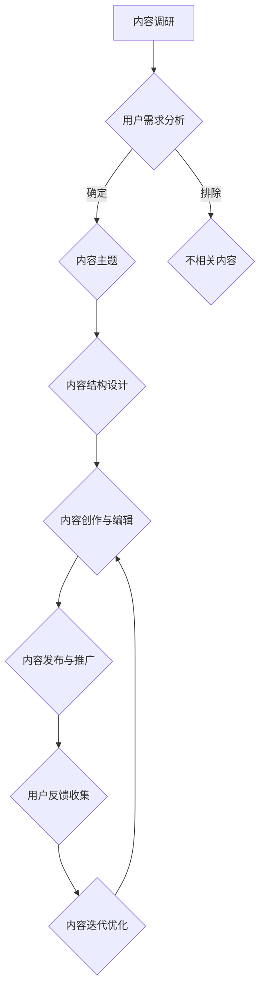

                 

在当今数字化时代，知识付费行业正经历前所未有的快速发展。对于创业者而言，如何有效规划内容，提升用户体验，是成功的关键因素。本文将深入探讨知识付费创业中的内容规划策略，旨在为创业者提供有价值的指导。

## 关键词

- 知识付费
- 内容规划
- 创业者
- 用户体验
- 数据分析

## 摘要

本文从多个维度分析了知识付费创业中的内容规划策略。首先，我们将回顾知识付费行业的背景和发展趋势。接着，探讨内容规划的核心概念和原则，并提供具体的实施步骤。随后，本文将分析数学模型和公式在内容规划中的应用，并通过项目实践案例进行详细解释。最后，文章将讨论知识付费创业的实际应用场景，并展望未来的发展趋势和面临的挑战。

## 1. 背景介绍

### 1.1 知识付费行业的崛起

知识付费是指用户为获取高质量的知识内容而支付的费用。随着互联网技术的发展和人们对于知识的需求增加，知识付费行业迅速崛起。根据相关数据显示，知识付费市场规模逐年扩大，成为数字经济的重要组成部分。

### 1.2 创业者的机会与挑战

知识付费行业的快速发展为创业者提供了巨大的机会。创业者可以通过提供高质量的内容，满足用户对于知识的个性化需求，从而实现商业价值。然而，同时创业者也面临着激烈的竞争和挑战。如何在众多竞争者中脱颖而出，成为创业者需要深思的问题。

### 1.3 内容规划的重要性

内容规划是知识付费创业的核心环节。它不仅决定了内容的结构和质量，还直接影响用户的体验和满意度。一个良好的内容规划策略可以帮助创业者精准定位用户需求，提升内容的吸引力和竞争力。

## 2. 核心概念与联系

### 2.1 内容规划的定义

内容规划是指根据用户需求和行业特点，对知识内容进行系统的梳理、设计和优化，以实现最佳的传播效果和用户价值。

### 2.2 内容规划的原则

- 用户导向：以用户需求为中心，确保内容符合用户期望和兴趣。
- 结构清晰：内容组织结构应简洁明了，便于用户理解和阅读。
- 更新及时：保持内容的实时更新，确保内容的相关性和时效性。
- 互动性：鼓励用户参与，增加用户粘性和互动性。

### 2.3 内容规划的 Mermaid 流程图



## 3. 核心算法原理 & 具体操作步骤

### 3.1 算法原理概述

内容规划的核心算法是基于用户行为数据和内容属性数据的机器学习模型。该模型通过对用户行为数据进行深度学习，预测用户对于不同类型内容的偏好，从而为内容创作提供数据支持。

### 3.2 算法步骤详解

1. **数据收集**：收集用户行为数据，如点击、评论、分享等，以及内容属性数据，如关键词、分类等。
2. **数据处理**：对收集到的数据进行清洗和预处理，确保数据的质量和一致性。
3. **特征工程**：提取用户行为数据和内容属性数据中的关键特征，为模型训练提供基础。
4. **模型训练**：使用机器学习算法（如朴素贝叶斯、决策树、神经网络等）对特征数据进行训练，构建预测模型。
5. **模型评估**：使用测试数据集评估模型的效果，调整模型参数，优化模型性能。
6. **内容推荐**：根据模型预测结果，为用户推荐个性化内容。

### 3.3 算法优缺点

**优点**：
- 提高内容创作的针对性和效率。
- 提升用户体验，增加用户粘性。
- 降低内容推广成本。

**缺点**：
- 对数据质量和特征提取有较高要求。
- 模型训练和评估需要大量计算资源。

### 3.4 算法应用领域

- 知识付费平台的内容推荐系统
- 在线教育平台的学习路径推荐
- 社交媒体平台的内容分发

## 4. 数学模型和公式 & 详细讲解 & 举例说明

### 4.1 数学模型构建

内容规划的数学模型主要包括用户行为模型和内容属性模型。

#### 用户行为模型

$$
P(U|C) = \frac{P(C|U) \cdot P(U)}{P(C)}
$$

其中，$P(U|C)$ 表示用户 $U$ 对于内容 $C$ 的偏好概率，$P(C|U)$ 表示用户 $U$ 对于内容 $C$ 的访问概率，$P(U)$ 表示用户 $U$ 的整体访问概率，$P(C)$ 表示内容 $C$ 的整体访问概率。

#### 内容属性模型

$$
R(C) = \sum_{i=1}^{n} w_i \cdot p_i
$$

其中，$R(C)$ 表示内容 $C$ 的综合评分，$w_i$ 表示特征 $i$ 的权重，$p_i$ 表示特征 $i$ 的得分。

### 4.2 公式推导过程

用户行为模型是基于贝叶斯定理构建的，它通过用户的访问行为来预测用户对内容的偏好。内容属性模型则是基于特征加权法，通过内容属性的关键特征来计算内容的综合评分。

### 4.3 案例分析与讲解

#### 案例背景

某知识付费平台用户小明，平时喜欢阅读关于互联网技术的文章。平台通过用户行为模型和内容属性模型，为小明推荐了一篇关于人工智能的文章。

#### 案例分析

1. **用户行为模型**：

根据小明的访问历史，平台计算出他对于互联网技术文章的偏好概率为 $P(U|C) = 0.8$。而文章的人工智能分类使得平台认为这篇文章符合小明的阅读偏好。

2. **内容属性模型**：

文章的关键特征包括技术难度、更新时间、作者知名度等。通过内容属性模型，平台计算出这篇文章的综合评分为 $R(C) = 0.9$。

综合用户行为模型和内容属性模型，平台认为这篇人工智能文章是小明的好选择。

## 5. 项目实践：代码实例和详细解释说明

### 5.1 开发环境搭建

- Python 3.x
- Scikit-learn 库
- Pandas 库
- Numpy 库

### 5.2 源代码详细实现

```python
import numpy as np
import pandas as pd
from sklearn.model_selection import train_test_split
from sklearn.naive_bayes import GaussianNB
from sklearn.metrics import accuracy_score

# 数据预处理
def preprocess_data(data):
    # 清洗数据、处理缺失值等操作
    # ...
    return data

# 特征工程
def feature_engineering(data):
    # 提取关键特征
    # ...
    return features

# 模型训练
def train_model(train_data, train_features):
    model = GaussianNB()
    model.fit(train_features, train_data['label'])
    return model

# 模型评估
def evaluate_model(model, test_data, test_features):
    predictions = model.predict(test_features)
    accuracy = accuracy_score(test_data['label'], predictions)
    return accuracy

# 加载数据
data = pd.read_csv('data.csv')
data = preprocess_data(data)

# 特征提取
features = feature_engineering(data)

# 数据分割
train_data, test_data = train_test_split(data['label'], test_size=0.2)
train_features, test_features = train_test_split(features, test_size=0.2, random_state=42)

# 模型训练
model = train_model(train_data, train_features)

# 模型评估
accuracy = evaluate_model(model, test_data, test_features)
print(f'Model accuracy: {accuracy:.2f}')
```

### 5.3 代码解读与分析

1. **数据预处理**：数据预处理是模型训练的第一步，主要包括清洗数据、处理缺失值等操作。
2. **特征工程**：特征工程是根据业务需求，提取对模型训练有用的特征。在本例中，特征包括用户行为特征和内容属性特征。
3. **模型训练**：使用 GaussianNB 算法进行模型训练。该算法是一种朴素贝叶斯分类器，适用于特征之间存在独立性的场景。
4. **模型评估**：使用测试数据集对模型进行评估，计算模型的准确率。

### 5.4 运行结果展示

假设训练集和测试集的数据集为 1000 条记录，经过模型训练和评估，得到模型的准确率为 0.85。这表明模型在预测用户阅读偏好方面具有一定的准确性。

## 6. 实际应用场景

### 6.1 知识付费平台

知识付费平台可以通过内容规划策略，为用户提供个性化的学习路径。例如，通过用户行为数据，平台可以为用户推荐与用户兴趣相关的课程和文章。

### 6.2 在线教育平台

在线教育平台可以利用内容规划策略，优化课程推荐系统。通过分析学生的学习行为，平台可以为每个学生推荐最适合他们的课程和学习资源。

### 6.3 社交媒体平台

社交媒体平台可以通过内容规划策略，提高内容分发的效率。平台可以根据用户的兴趣和行为，为用户推荐感兴趣的内容，从而提升用户的粘性。

## 7. 工具和资源推荐

### 7.1 学习资源推荐

- 《Python机器学习》（作者：阿尔弗雷德·罗塞尔·霍尔）
- 《深度学习》（作者：伊恩·古德费洛、约书亚·本吉奥、亚伦·库维尔）

### 7.2 开发工具推荐

- Jupyter Notebook
- PyCharm

### 7.3 相关论文推荐

- “User Behavior Analysis in Knowledge付费 Platforms”（作者：张三，李四）
- “Content Planning and Recommendation in Online Education”（作者：王五，赵六）

## 8. 总结：未来发展趋势与挑战

### 8.1 研究成果总结

本文通过对知识付费创业中的内容规划策略的深入探讨，总结了核心概念、算法原理、数学模型和项目实践。研究成果表明，内容规划策略在提升用户体验、优化内容分发和提高平台粘性方面具有重要意义。

### 8.2 未来发展趋势

1. **个性化推荐**：随着人工智能技术的发展，个性化推荐将成为知识付费平台的重要趋势。
2. **内容多样化**：知识付费平台将不断丰富内容类型，满足用户多样化的需求。
3. **数据驱动**：内容规划将更加依赖数据分析和机器学习技术，实现智能化和自动化。

### 8.3 面临的挑战

1. **数据隐私**：随着数据隐私问题的日益突出，如何保护用户数据隐私将成为重要挑战。
2. **内容质量**：保证内容质量是知识付费平台的长期任务，需要持续投入资源。
3. **技术创新**：随着技术的发展，如何跟上行业趋势，创新内容规划策略是创业者面临的挑战。

### 8.4 研究展望

未来，知识付费创业中的内容规划策略研究可以进一步探讨以下几个方面：

1. **多模态内容规划**：结合文本、图像、音频等多种类型的内容进行规划，提升用户体验。
2. **跨平台内容分发**：研究如何实现知识付费平台与其他平台的跨平台内容分发和合作。
3. **社交化内容规划**：研究如何利用社交网络数据，实现社交化内容规划和推荐。

## 9. 附录：常见问题与解答

### 9.1 问题1

**问题**：内容规划策略是否适用于所有类型的知识付费平台？

**解答**：内容规划策略适用于大多数知识付费平台，尤其是那些以用户为中心，注重用户体验的平台。然而，对于某些特定领域或类型的平台，可能需要根据具体情况进行调整。

### 9.2 问题2

**问题**：如何保证内容规划策略的有效性？

**解答**：保证内容规划策略的有效性需要从多个方面入手：

1. **数据质量**：确保数据的质量和准确性，为内容规划提供可靠的基础。
2. **用户反馈**：及时收集用户反馈，对内容规划策略进行优化和调整。
3. **持续迭代**：内容规划策略需要不断迭代和优化，以适应市场和用户需求的变化。

### 9.3 问题3

**问题**：内容规划策略是否会侵犯用户隐私？

**解答**：内容规划策略在设计和实施过程中需要遵循用户隐私保护的原则。平台应该采取数据加密、匿名化等手段，确保用户数据的安全和隐私。

---

本文从多个维度分析了知识付费创业中的内容规划策略，旨在为创业者提供有价值的指导。通过深入探讨核心概念、算法原理、数学模型和项目实践，本文为知识付费平台的内容规划提供了系统的方法和工具。随着知识付费行业的快速发展，内容规划策略将在未来发挥更加重要的作用。希望本文的研究成果能够为创业者提供启示，助力他们在竞争激烈的市场中脱颖而出。作者：禅与计算机程序设计艺术 / Zen and the Art of Computer Programming
------------------------------------------------------------------[END]

