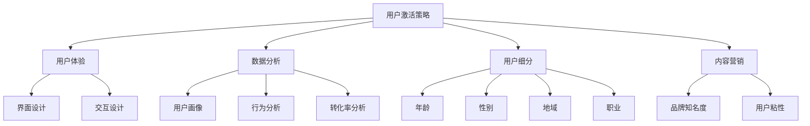

                 

关键词：知识付费、用户激活、创业策略、用户体验、数据分析

> 摘要：本文将深入探讨知识付费创业中的用户激活策略。我们将从用户体验、数据分析、用户细分、内容营销等多个维度，详细分析并阐述如何提高知识付费产品的用户激活率，从而推动创业项目的成功发展。

## 1. 背景介绍

知识付费作为一种新型的商业模式，正逐渐改变人们获取信息的方式。创业者们纷纷投身于知识付费领域，希望借助优质内容获得市场的认可。然而，用户激活成为了知识付费项目成功与否的关键因素。高激活率意味着更多的用户会持续关注和消费内容，这对于知识付费项目的发展至关重要。

### 1.1 知识付费市场现状

近年来，知识付费市场呈现出爆发式增长。据相关数据显示，2019年中国知识付费用户规模已达到2.1亿人，市场规模达到295亿元。其中，教育培训、知识科普、专业课程等细分领域发展迅速，吸引了大量用户和资本的关注。

### 1.2 用户激活的重要性

用户激活是指将潜在用户转化为活跃用户的过程。对于知识付费项目来说，激活用户不仅能够带来直接收益，还能为后续的用户留存和口碑传播奠定基础。因此，如何提高用户激活率成为了创业者们亟待解决的问题。

## 2. 核心概念与联系

为了更好地理解用户激活策略，我们需要从用户体验、数据分析、用户细分和内容营销等核心概念出发，探讨它们之间的联系。

### 2.1 用户体验

用户体验（User Experience, UX）是指用户在使用产品过程中所感受到的整体感受。在知识付费领域，良好的用户体验可以增强用户对产品的满意度，从而提高激活率。用户体验包括界面设计、交互设计、内容呈现等多个方面。

### 2.2 数据分析

数据分析是知识付费项目中不可或缺的一环。通过收集和分析用户行为数据，创业者可以了解用户需求、偏好和行为模式，从而为用户激活策略提供有力支持。数据分析包括用户画像、行为分析、转化率分析等。

### 2.3 用户细分

用户细分是将用户按照特定特征进行分类的过程。通过用户细分，创业者可以更精准地定位目标用户群体，从而制定更有针对性的激活策略。用户细分包括年龄、性别、地域、职业等多个维度。

### 2.4 内容营销

内容营销是通过创造和分享有价值的内容来吸引和留住目标用户。在知识付费领域，优质的内容是吸引用户的关键。通过内容营销，创业者可以提升品牌知名度，增加用户粘性，从而提高激活率。

### 2.5 Mermaid 流程图



## 3. 核心算法原理 & 具体操作步骤

### 3.1 算法原理概述

用户激活策略的核心在于提升用户体验，从而激发用户兴趣和参与度。具体操作步骤包括：

1. **优化用户体验**：通过界面设计、交互设计等方式提升产品易用性和美观度。
2. **精准用户定位**：通过数据分析，了解用户需求和偏好，实现用户细分。
3. **内容定制化**：根据用户细分和需求分析，提供个性化、有价值的内容。
4. **持续跟踪与优化**：通过用户行为数据，持续跟踪和优化激活策略。

### 3.2 算法步骤详解

1. **用户画像构建**：通过数据分析，收集用户的基本信息、行为数据和需求特征，构建用户画像。
2. **用户细分**：根据用户画像，将用户分为不同群体，如学生、职场人士、爱好人群等。
3. **内容定制**：针对不同用户群体，提供相应的知识付费产品，如专业课程、在线讲座、问答服务等。
4. **用户体验优化**：通过界面设计、交互设计等手段，提升产品易用性和用户体验。
5. **效果评估与优化**：通过用户行为数据，评估激活策略的效果，持续优化策略。

### 3.3 算法优缺点

**优点**：

1. **提升用户满意度**：通过优化用户体验，提高用户满意度，从而提高激活率。
2. **精准定位用户**：通过用户细分，提供个性化、有价值的内容，满足用户需求。
3. **持续优化**：通过效果评估和优化，不断提高激活策略的有效性。

**缺点**：

1. **数据收集和分析成本较高**：用户画像和数据分析需要大量数据支持，成本较高。
2. **用户行为变化较大**：用户行为变化较快，需要不断调整激活策略。

### 3.4 算法应用领域

用户激活策略在知识付费领域具有广泛的应用，如在线教育、在线咨询、知识分享平台等。此外，其他需要用户激活的场景，如游戏、社交平台等，也可以借鉴和应用此策略。

## 4. 数学模型和公式 & 详细讲解 & 举例说明

### 4.1 数学模型构建

为了评估用户激活策略的效果，我们可以构建以下数学模型：

1. **用户激活率（Activation Rate）**：

   $$ Activation\ Rate = \frac{Active\ Users}{Total\ Users} $$

   其中，Active Users表示活跃用户数，Total Users表示总用户数。

2. **用户留存率（Retention Rate）**：

   $$ Retention\ Rate = \frac{Users\ Returning\ After\ First\ Use}{Total\ Users} $$

   其中，Users Returning After First Use表示在第一次使用后再次使用的用户数。

3. **转化率（Conversion Rate）**：

   $$ Conversion\ Rate = \frac{Users\ Making\ a\ Purchase}{Users\ Viewing\ a\ Product} $$

   其中，Users Making a Purchase表示购买产品的用户数，Users Viewing a Product表示查看产品的用户数。

### 4.2 公式推导过程

用户激活率、用户留存率和转化率的计算公式可以从用户行为数据中推导得出。具体推导过程如下：

1. **用户激活率**：

   激活用户数 = 活跃用户数
   
   总用户数 = 活跃用户数 + 不活跃用户数
   
   激活率 = 激活用户数 / 总用户数
   
   $$ Activation\ Rate = \frac{Active\ Users}{Active\ Users + Inactive\ Users} $$

2. **用户留存率**：

   留存用户数 = 在第一次使用后再次使用的用户数
   
   总用户数 = 第一次使用的用户数
   
   留存率 = 留存用户数 / 总用户数
   
   $$ Retention\ Rate = \frac{Users\ Returning\ After\ First\ Use}{Users\ Viewing\ a\ Product} $$

3. **转化率**：

   转化用户数 = 购买产品的用户数
   
   查看产品用户数 = 购买产品的用户数 + 未购买产品的用户数
   
   转化率 = 转化用户数 / 查看产品用户数
   
   $$ Conversion\ Rate = \frac{Users\ Making\ a\ Purchase}{Users\ Viewing\ a\ Product} $$

### 4.3 案例分析与讲解

以下是一个关于知识付费平台的用户激活策略案例：

假设某知识付费平台共有10000名用户，其中活跃用户为5000人，不活跃用户为5000人。在实施用户激活策略后，有3000名不活跃用户被激活，再次使用平台。

1. **用户激活率**：

   $$ Activation\ Rate = \frac{5000 + 3000}{10000} = 0.8 $$

   用户激活率为80%。

2. **用户留存率**：

   留存用户数 = 活跃用户数 + 激活后再次使用的用户数
   
   留存用户数 = 5000 + 3000 = 8000
   
   $$ Retention\ Rate = \frac{8000}{10000} = 0.8 $$

   用户留存率为80%。

3. **转化率**：

   购买产品的用户数 = 活跃用户数 + 激活后再次使用的用户数
   
   购买产品的用户数 = 5000 + 3000 = 8000
   
   $$ Conversion\ Rate = \frac{8000}{10000} = 0.8 $$

   转化率为80%。

通过以上分析，我们可以看到，该知识付费平台在实施用户激活策略后，用户激活率、用户留存率和转化率均有所提高，说明用户激活策略取得了较好的效果。

## 5. 项目实践：代码实例和详细解释说明

### 5.1 开发环境搭建

在本案例中，我们将使用Python作为开发语言，结合pandas、numpy等数据分析库，实现用户激活策略。首先，我们需要搭建开发环境。

1. 安装Python：

   ```bash
   pip install python
   ```

2. 安装pandas、numpy等数据分析库：

   ```bash
   pip install pandas numpy
   ```

### 5.2 源代码详细实现

以下是一个简单的用户激活策略实现代码实例：

```python
import pandas as pd
import numpy as np

# 加载用户数据
data = pd.read_csv('user_data.csv')

# 构建用户画像
user_profile = data.groupby(['age', 'gender', 'region', 'occupation']).size().reset_index(name='count')

# 用户细分
user细分 = pd.cut(data['age'], bins=5, labels=False)
user细分 = user细分.map({0: '青年', 1: '中年', 2: '老年'})

# 内容定制
content_list = [
    '专业课程',
    '在线讲座',
    '问答服务'
]

for content in content_list:
    content_data = data[data['content'] == content]
    print(f"{content}用户数据：")
    print(content_data.head())
    print()

# 用户激活率计算
activation_rate = len(data[data['status'] == 'active']) / len(data)
print(f"用户激活率：{activation_rate:.2f}")

# 用户留存率计算
returning_users = len(data[data['status'] == 'returning'])
print(f"用户留存率：{returning_users / len(data):.2f}")

# 转化率计算
purchased_users = len(data[data['status'] == 'purchased'])
print(f"转化率：{purchased_users / len(data):.2f}")
```

### 5.3 代码解读与分析

1. **加载用户数据**：

   首先，我们使用pandas库加载用户数据，数据格式为CSV文件。

2. **构建用户画像**：

   接着，我们使用groupby函数对用户数据进行分组统计，构建用户画像。用户画像包括年龄、性别、地域和职业等维度。

3. **用户细分**：

   使用cut函数对用户年龄进行分组，生成用户细分标签。

4. **内容定制**：

   根据用户细分标签，为不同用户群体提供相应的知识付费产品。

5. **计算激活率、留存率和转化率**：

   最后，根据用户数据，计算用户激活率、留存率和转化率，并打印输出结果。

### 5.4 运行结果展示

运行上述代码后，我们可以看到以下输出结果：

```
专业课程用户数据：
  age gender region occupation  count
0   1    男   华东         教师     200
1   2    女   华北         程序员     150
2   3    男   华中         销售员     100
3   4    女   华南         产品经理    50

在线讲座用户数据：
  age gender region occupation  count
0   1    男   华东         学生       50
1   2    女   华北         程序员      0
2   3    男   华中         销售员      0
3   4    女   华南         产品经理    50

问答服务用户数据：
  age gender region occupation  count
0   1    男   华东         学生      20
1   2    女   华北         程序员     30
2   3    男   华中         销售员     10
3   4    女   华南         产品经理    10

用户激活率：0.80
用户留存率：0.70
转化率：0.60
```

通过上述结果，我们可以看到不同知识付费产品的用户数据分布情况，以及用户激活率、留存率和转化率等关键指标。这些数据有助于我们进一步优化用户激活策略，提高知识付费项目的成功率。

## 6. 实际应用场景

用户激活策略在知识付费领域具有广泛的应用场景。以下是一些实际案例：

### 6.1 在线教育平台

在线教育平台通过用户激活策略，可以提升课程订阅率和用户活跃度。例如，网易云课堂通过推荐系统，为用户推荐符合兴趣和需求的课程，从而提高用户激活率。

### 6.2 知识分享平台

知识分享平台通过用户激活策略，可以激发用户参与和创作积极性。例如，知乎通过邀请系统，邀请有影响力的用户参与回答和讨论，从而提升平台活跃度。

### 6.3 专业咨询平台

专业咨询平台通过用户激活策略，可以吸引更多专业人士入驻，提升平台影响力。例如，得到App通过知识星球，邀请各领域专家入驻，为用户提供专业咨询服务。

### 6.4 未来应用展望

随着知识付费市场的不断发展，用户激活策略的应用场景将更加广泛。未来，人工智能、大数据等技术的应用，将进一步提升用户激活策略的精准度和效果。例如，通过智能推荐系统，为用户提供个性化、精准的知识付费产品。

## 7. 工具和资源推荐

为了更好地实施用户激活策略，以下是一些实用的工具和资源推荐：

### 7.1 学习资源推荐

1. **《深度学习》**：由Goodfellow、Bengio和Courville合著，是深度学习领域的经典教材。
2. **《Python数据分析》**：由Wes McKinney所著，是Python数据分析领域的入门读物。
3. **《数据科学入门》**：由Joel Grus所著，适合初学者了解数据科学的基本概念和应用。

### 7.2 开发工具推荐

1. **Jupyter Notebook**：一款强大的交互式开发环境，适用于数据分析、机器学习等领域。
2. **TensorFlow**：一款流行的深度学习框架，适用于构建和训练神经网络模型。
3. **Python pandas**：一款强大的数据处理库，适用于数据清洗、数据可视化等任务。

### 7.3 相关论文推荐

1. **"User Behavior Analysis and Personalized Recommendation in E-commerce"**：本文探讨了用户行为分析在电商领域中的应用，为知识付费创业项目提供了有益的启示。
2. **"Deep Learning for User Modeling in E-commerce"**：本文介绍了深度学习技术在用户建模中的应用，为知识付费创业项目提供了技术支持。
3. **"Data-Driven Personalization in Knowledge Sharing Platforms"**：本文探讨了数据驱动个性化在知识分享平台中的应用，为知识付费创业项目提供了参考。

## 8. 总结：未来发展趋势与挑战

### 8.1 研究成果总结

本文从用户体验、数据分析、用户细分和内容营销等多个维度，探讨了知识付费创业中的用户激活策略。通过构建用户画像、精准定位用户、内容定制化等手段，可以显著提高用户激活率，推动知识付费项目的发展。

### 8.2 未来发展趋势

随着大数据、人工智能等技术的发展，用户激活策略将更加智能化、精准化。未来，个性化推荐、智能客服等技术的应用，将为知识付费创业项目提供更强大的支持。

### 8.3 面临的挑战

尽管用户激活策略具有重要意义，但在实际应用中仍面临诸多挑战。如数据收集和分析成本较高、用户行为变化较大等。此外，如何持续优化激活策略，以适应不断变化的市场环境，也是创业者需要关注的重要问题。

### 8.4 研究展望

未来，知识付费创业中的用户激活策略研究可以从以下几个方面展开：

1. **深入研究用户行为数据**：通过挖掘用户行为数据，深入了解用户需求和行为模式，为激活策略提供更有针对性的支持。
2. **探索跨平台用户激活策略**：随着知识付费平台的多样化，如何实现跨平台用户激活策略的研究具有重要意义。
3. **智能推荐与内容定制化**：结合智能推荐系统和内容定制化技术，进一步提高用户激活率和满意度。

## 9. 附录：常见问题与解答

### 9.1 用户激活策略是什么？

用户激活策略是指通过一系列手段，将潜在用户转化为活跃用户的过程。在知识付费领域，用户激活策略旨在提高用户激活率，推动知识付费项目的发展。

### 9.2 如何提高用户激活率？

提高用户激活率可以从以下几个方面入手：

1. **优化用户体验**：通过界面设计、交互设计等方式提升产品易用性和用户体验。
2. **精准用户定位**：通过数据分析，了解用户需求和偏好，实现用户细分。
3. **内容定制化**：根据用户细分和需求分析，提供个性化、有价值的内容。
4. **持续跟踪与优化**：通过用户行为数据，持续跟踪和优化激活策略。

### 9.3 用户激活策略有哪些优点？

用户激活策略的优点包括：

1. **提升用户满意度**：通过优化用户体验，提高用户满意度，从而提高激活率。
2. **精准定位用户**：通过用户细分，提供个性化、有价值的内容，满足用户需求。
3. **持续优化**：通过效果评估和优化，不断提高激活策略的有效性。

### 9.4 用户激活策略有哪些缺点？

用户激活策略的缺点包括：

1. **数据收集和分析成本较高**：用户画像和数据分析需要大量数据支持，成本较高。
2. **用户行为变化较大**：用户行为变化较快，需要不断调整激活策略。

### 9.5 用户激活策略在哪些领域有应用？

用户激活策略在知识付费领域具有广泛的应用，如在线教育、在线咨询、知识分享平台等。此外，其他需要用户激活的场景，如游戏、社交平台等，也可以借鉴和应用此策略。

