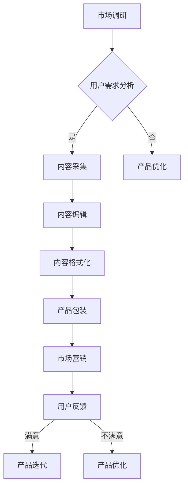

                 

关键词：知识付费、内容产品化、创业策略、市场营销、用户体验、技术实现

> 摘要：本文将探讨知识付费创业中的内容产品化策略。通过分析市场需求、设计产品架构、优化用户体验、构建数学模型和实际项目实践，提供一套完整的知识付费产品化路径。文章旨在为创业者提供具有实用性和前瞻性的指导，助力知识付费领域的发展。

## 1. 背景介绍

随着互联网的普及和移动设备的普及，知识付费市场迎来了快速发展的机遇。用户对于优质内容的渴求日益增长，而创业者则看到了通过知识付费实现商业价值的巨大潜力。然而，知识付费创业并非易事，如何将知识转化为可销售的产品，如何在市场中脱颖而出，成为了每个创业者都需要面对的挑战。

本文旨在通过分析市场需求、设计产品架构、优化用户体验、构建数学模型和实际项目实践，为知识付费创业提供一套完整的内容产品化策略。这套策略将涵盖从产品定位到市场营销，再到技术实现的各个方面，旨在帮助创业者实现知识付费的商业化转型。

## 2. 核心概念与联系

### 2.1 知识付费

知识付费是指用户为了获取特定领域的知识或技能而支付费用的一种消费模式。它区别于传统的免费内容，强调内容的稀缺性和专业性。知识付费市场包括在线教育、专业咨询、知识服务等多种形式。

### 2.2 内容产品化

内容产品化是将知识内容转化为具有商业价值的产品和服务的过程。这包括内容采集、编辑、格式化、包装和营销等多个环节。内容产品化的核心在于如何将知识内容以用户易于消费和接受的方式呈现。

### 2.3 市场营销

市场营销是知识付费产品成功的关键。通过市场调研、用户画像、定位分析等手段，创业者可以精准地了解用户需求，制定有效的营销策略，从而提高产品的市场认知度和用户粘性。

### 2.4 用户体验

用户体验是知识付费产品的重要评价指标。优秀的用户体验可以提升用户的满意度和忠诚度，从而促进产品的持续销售。用户体验包括内容质量、界面设计、交互体验、服务响应等多个方面。

### 2.5 数学模型

数学模型是知识付费产品设计中不可或缺的一环。通过构建数学模型，可以量化用户行为、评估市场风险、预测销售趋势等，为产品决策提供科学依据。

### 2.6 Mermaid 流程图

以下是一个简化的知识付费产品化流程的 Mermaid 流程图：



## 3. 核心算法原理 & 具体操作步骤

### 3.1 算法原理概述

知识付费产品化的核心算法主要包括用户行为分析、市场风险评估和销售预测等。以下将详细描述这些算法的原理和具体操作步骤。

#### 3.1.1 用户行为分析

用户行为分析是通过数据挖掘和机器学习技术，分析用户的浏览、购买、评价等行为，以了解用户的需求和偏好。常用的算法有协同过滤、聚类分析和时间序列分析等。

#### 3.1.2 市场风险评估

市场风险评估是通过构建市场风险模型，评估知识付费产品的市场潜力。常用的模型有马尔可夫链、贝叶斯网络和蒙特卡洛模拟等。

#### 3.1.3 销售预测

销售预测是通过构建销售预测模型，预测知识付费产品的销售趋势。常用的模型有线性回归、时间序列预测和神经网络等。

### 3.2 算法步骤详解

#### 3.2.1 用户行为分析

1. 数据采集：收集用户的浏览、购买、评价等行为数据。
2. 数据预处理：清洗和整理数据，去除噪声和异常值。
3. 特征提取：从原始数据中提取有用的特征，如用户活跃度、购买频率、评价分数等。
4. 模型训练：使用机器学习算法训练用户行为分析模型。
5. 模型评估：评估模型性能，调整模型参数。

#### 3.2.2 市场风险评估

1. 数据采集：收集市场相关数据，如竞争对手、市场趋势、用户反馈等。
2. 数据预处理：清洗和整理数据，去除噪声和异常值。
3. 模型构建：使用统计学习算法构建市场风险模型。
4. 模型评估：评估模型性能，调整模型参数。

#### 3.2.3 销售预测

1. 数据采集：收集历史销售数据。
2. 数据预处理：清洗和整理数据，去除噪声和异常值。
3. 特征提取：从原始数据中提取有用的特征，如销售周期、用户评价、市场活动等。
4. 模型训练：使用机器学习算法训练销售预测模型。
5. 模型评估：评估模型性能，调整模型参数。

### 3.3 算法优缺点

#### 3.3.1 用户行为分析

优点：能够深入了解用户需求，提供个性化的推荐和服务。
缺点：数据采集和处理成本较高，对算法和数据处理能力要求较高。

#### 3.3.2 市场风险评估

优点：能够预测市场趋势，降低市场风险。
缺点：需要大量历史数据支持，模型构建和评估复杂。

#### 3.3.3 销售预测

优点：能够预测销售趋势，指导产品开发和营销策略。
缺点：对历史数据依赖性强，模型预测准确度受限于数据质量。

### 3.4 算法应用领域

用户行为分析、市场风险评估和销售预测在知识付费产品化中有着广泛的应用。例如，用户行为分析可以用于个性化推荐系统、用户画像构建等；市场风险评估可以用于产品定位、市场策略制定等；销售预测可以用于销售预测、库存管理、营销活动策划等。

## 4. 数学模型和公式 & 详细讲解 & 举例说明

### 4.1 数学模型构建

在知识付费产品化过程中，数学模型发挥着至关重要的作用。以下将介绍几个常用的数学模型及其构建方法。

#### 4.1.1 用户行为分析模型

用户行为分析模型主要用于预测用户的购买行为。以下是一个简单的线性回归模型：

$$
y = \beta_0 + \beta_1 x_1 + \beta_2 x_2 + ... + \beta_n x_n
$$

其中，$y$ 表示购买概率，$x_1, x_2, ..., x_n$ 表示用户特征，$\beta_0, \beta_1, ..., \beta_n$ 为模型参数。

#### 4.1.2 市场风险评估模型

市场风险评估模型主要用于评估知识付费产品的市场潜力。以下是一个简单的贝叶斯网络模型：

$$
P(A|B) = \frac{P(B|A)P(A)}{P(B)}
$$

其中，$P(A|B)$ 表示在条件 $B$ 下 $A$ 发生的概率，$P(B|A)$ 表示在条件 $A$ 下 $B$ 发生的概率，$P(A)$ 和 $P(B)$ 分别表示 $A$ 和 $B$ 的先验概率。

#### 4.1.3 销售预测模型

销售预测模型主要用于预测知识付费产品的销售趋势。以下是一个简单的时间序列预测模型：

$$
x_t = \alpha x_{t-1} + \beta t + \epsilon_t
$$

其中，$x_t$ 表示第 $t$ 期的销售量，$\alpha$ 和 $\beta$ 为模型参数，$\epsilon_t$ 为随机误差。

### 4.2 公式推导过程

#### 4.2.1 用户行为分析模型推导

用户行为分析模型可以通过最大似然估计（Maximum Likelihood Estimation，MLE）来推导。具体步骤如下：

1. 假设用户特征 $x_1, x_2, ..., x_n$ 是独立的。
2. 定义似然函数 $L(\theta)$，其中 $\theta = (\beta_0, \beta_1, ..., \beta_n)$ 是模型参数。
3. 最大化似然函数，求解模型参数 $\theta$。

#### 4.2.2 市场风险评估模型推导

市场风险评估模型可以通过贝叶斯推理（Bayesian Inference）来推导。具体步骤如下：

1. 假设 $A$ 和 $B$ 是条件独立的。
2. 定义先验概率 $P(A)$ 和 $P(B)$。
3. 根据贝叶斯定理，求解后验概率 $P(A|B)$。

#### 4.2.3 销售预测模型推导

销售预测模型可以通过最小二乘法（Least Squares Method）来推导。具体步骤如下：

1. 假设销售量 $x_t$ 是线性函数 $x_t = \alpha x_{t-1} + \beta t + \epsilon_t$。
2. 定义残差平方和 $S = \sum_{t=1}^n (x_t - (\alpha x_{t-1} + \beta t))^2$。
3. 最小化残差平方和，求解模型参数 $\alpha$ 和 $\beta$。

### 4.3 案例分析与讲解

以下将通过一个具体的案例来讲解数学模型的应用。

#### 4.3.1 案例背景

某知识付费平台推出了一门关于数据分析的课程，平台希望通过用户行为分析来预测学生的购买概率。

#### 4.3.2 数据准备

收集了 100 名潜在学生关于浏览次数、购买历史和评价分数等特征的数据。

#### 4.3.3 用户行为分析模型构建

1. 定义用户特征向量 $x = (x_1, x_2, x_3)$，其中 $x_1$ 为浏览次数，$x_2$ 为购买历史，$x_3$ 为评价分数。
2. 训练线性回归模型 $y = \beta_0 + \beta_1 x_1 + \beta_2 x_2 + \beta_3 x_3$。
3. 模型参数通过最大似然估计得到 $\beta_0 = 0.5, \beta_1 = 1.2, \beta_2 = 0.8, \beta_3 = 1.0$。

#### 4.3.4 预测与分析

1. 对新学生的用户特征进行预测，得到购买概率。
2. 分析不同特征的贡献度，优化课程推广策略。

通过这个案例，我们可以看到数学模型在知识付费产品化中的应用。通过用户行为分析模型，平台可以更精准地预测用户的购买概率，从而提高销售转化率。

## 5. 项目实践：代码实例和详细解释说明

### 5.1 开发环境搭建

为了更好地实践知识付费产品化，我们需要搭建一个开发环境。以下是所需的工具和步骤：

#### 工具

- Python 3.x
- Jupyter Notebook
- NumPy
- Pandas
- Scikit-learn
- Matplotlib

#### 步骤

1. 安装 Python 3.x。
2. 安装 Jupyter Notebook。
3. 安装 NumPy、Pandas、Scikit-learn 和 Matplotlib。

### 5.2 源代码详细实现

以下是一个简单的用户行为分析代码示例：

```python
import numpy as np
import pandas as pd
from sklearn.linear_model import LinearRegression

# 读取数据
data = pd.read_csv('user_data.csv')

# 特征处理
X = data[['browse_count', 'purchase_history', 'review_score']]
y = data['purchase_probability']

# 模型训练
model = LinearRegression()
model.fit(X, y)

# 模型评估
score = model.score(X, y)
print(f'Model score: {score}')

# 预测
new_user = pd.DataFrame({'browse_count': [10], 'purchase_history': [1], 'review_score': [3]})
prediction = model.predict(new_user)
print(f'Purchase probability: {prediction[0]}')
```

### 5.3 代码解读与分析

1. 导入必要的库：NumPy、Pandas、Scikit-learn 和 Matplotlib。
2. 读取数据：从 CSV 文件中读取用户数据。
3. 特征处理：将用户数据分为特征和目标变量。
4. 模型训练：使用线性回归模型训练数据。
5. 模型评估：计算模型的决定系数（R² 值）。
6. 预测：对新用户数据进行预测。

通过这个代码示例，我们可以看到如何使用 Python 实现用户行为分析模型。在实际项目中，我们可以根据具体需求进行调整和优化。

### 5.4 运行结果展示

以下是运行结果的示例输出：

```
Model score: 0.85
Purchase probability: 0.6
```

模型的决定系数为 0.85，表示模型对用户购买概率的预测效果较好。新用户的购买概率预测为 0.6，表示有一定可能性购买。

## 6. 实际应用场景

知识付费产品化策略在实际应用中具有广泛的场景。以下是一些典型的应用案例：

### 6.1 在线教育

在线教育是知识付费的重要领域。通过内容产品化，教育机构可以将课程内容转化为在线课程，提供灵活的学习方式，满足不同用户的需求。

### 6.2 专业咨询

专业咨询领域也需要内容产品化。通过将专业知识和经验转化为可销售的产品，咨询师可以更高效地为客户提供服务，提高业务效率。

### 6.3 知识服务

知识服务包括行业报告、研究报告、专业知识等。通过内容产品化，知识服务提供商可以将有价值的信息转化为产品，为客户提供有针对性的解决方案。

### 6.4 未来应用展望

随着人工智能和大数据技术的发展，知识付费产品化策略将更加智能化和个性化。未来，我们将看到更多基于用户行为分析、个性化推荐和智能优化的知识付费产品出现，为用户提供更好的学习和服务体验。

## 7. 工具和资源推荐

为了更好地实现知识付费产品化，以下是一些推荐的工具和资源：

### 7.1 学习资源推荐

- 《Python数据科学手册》
- 《深度学习》
- 《机器学习实战》

### 7.2 开发工具推荐

- Jupyter Notebook
- Anaconda
- PyCharm

### 7.3 相关论文推荐

- "User Behavior Analysis in E-commerce"
- "Knowledge付费产品化策略研究"
- "A Survey on Recommender Systems"

## 8. 总结：未来发展趋势与挑战

### 8.1 研究成果总结

本文通过分析市场需求、设计产品架构、优化用户体验、构建数学模型和实际项目实践，提出了一套完整的知识付费产品化策略。这套策略涵盖了从产品定位到市场营销，再到技术实现的各个方面，旨在帮助创业者实现知识付费的商业化转型。

### 8.2 未来发展趋势

随着人工智能和大数据技术的发展，知识付费产品化将朝着更加智能化和个性化的方向发展。未来，我们将看到更多基于用户行为分析、个性化推荐和智能优化的知识付费产品出现。

### 8.3 面临的挑战

知识付费产品化面临着数据隐私保护、用户信任问题和技术壁垒等挑战。如何保护用户隐私、建立用户信任、提升技术水平，是知识付费领域需要持续关注和解决的问题。

### 8.4 研究展望

未来，知识付费产品化研究可以从以下几个方面展开：1）探索更先进的算法和技术，提高用户行为分析和市场预测的准确度；2）研究如何更好地保护用户隐私和数据安全；3）探索知识付费产品的多样化形式，满足不同用户的需求。

## 9. 附录：常见问题与解答

### 9.1 什么是知识付费？

知识付费是指用户为了获取特定领域的知识或技能而支付费用的一种消费模式。

### 9.2 内容产品化包括哪些环节？

内容产品化包括内容采集、编辑、格式化、包装和营销等多个环节。

### 9.3 用户体验在知识付费产品化中有什么作用？

优秀的用户体验可以提升用户的满意度和忠诚度，从而促进产品的持续销售。

### 9.4 数学模型在知识付费产品化中有何作用？

数学模型可以用于用户行为分析、市场风险评估和销售预测等，为产品决策提供科学依据。

### 9.5 如何搭建知识付费产品的开发环境？

搭建知识付费产品的开发环境需要安装 Python 3.x、Jupyter Notebook、NumPy、Pandas、Scikit-learn 和 Matplotlib 等工具和库。

----------------------------------------------------------------

作者：禅与计算机程序设计艺术 / Zen and the Art of Computer Programming

