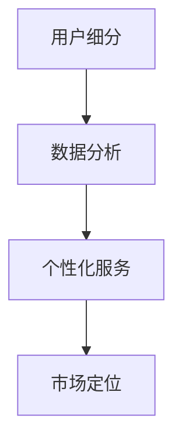

                 

在这个数字化时代，知识付费已经成为了众多创业者和平台运营者的热门选择。然而，要想在这个竞争激烈的市场中脱颖而出，用户群体的精准细分策略至关重要。本文将深入探讨知识付费创业的用户群体细分策略，帮助您更好地理解并抓住潜在客户。

## 关键词
- 知识付费
- 用户群体
- 细分策略
- 数据分析
- 个性化服务
- 市场定位

## 摘要
本文旨在为知识付费创业者提供一套科学的用户群体细分策略。通过深入分析市场现状和用户行为，我们将探讨如何运用数据分析技术进行用户细分，并在此基础上提供个性化服务和市场定位建议。最终目标是帮助创业者更好地理解用户需求，提升用户满意度和平台盈利能力。

### 1. 背景介绍

知识付费，顾名思义，是指用户为获取特定领域的知识和信息而支付的费用。近年来，随着互联网技术的飞速发展，知识付费市场迎来了爆发式增长。无论是教育、职业培训，还是兴趣类课程，用户对优质内容的渴求日益增强。与此同时，各种知识付费平台如雨后春笋般涌现，为创业者提供了丰富的机会。

然而，市场的繁荣也伴随着激烈的竞争。在这个背景下，如何准确识别目标用户，为他们提供有价值的服务，成为了知识付费创业者的核心挑战。用户群体细分策略，正是解决这一问题的关键。

### 2. 核心概念与联系

#### 2.1. 用户细分概念

用户细分（User Segmentation）是一种市场分析方法，旨在将庞大的用户群体划分为具有相似特征和需求的子群体。通过用户细分，创业者可以更精准地了解不同用户的需求，从而制定更有针对性的营销策略和服务方案。

#### 2.2. 数据分析

数据分析是用户细分的基础。通过收集和分析用户行为数据，创业者可以获得关于用户兴趣、需求、购买习惯等关键信息。这些数据可以来自多种渠道，如网站分析工具、社交媒体平台、电子邮件营销等。

#### 2.3. 个性化服务

个性化服务（Personalization）是一种以用户为中心的服务模式，通过为每个用户提供定制化的内容和服务，提升用户体验和满意度。个性化服务是用户细分策略的核心应用，能够显著提高用户留存率和转化率。

#### 2.4. 市场定位

市场定位（Market Positioning）是指企业在市场中所选择的位置，以及如何向潜在用户传达其独特的价值主张。在用户细分的基础上，创业者可以更准确地确定自己的目标市场，从而制定更加有效的市场定位策略。

#### 2.5. Mermaid 流程图



### 3. 核心算法原理 & 具体操作步骤

#### 3.1. 算法原理概述

用户群体细分的核心算法通常是基于聚类分析和机器学习算法。这些算法能够自动识别用户之间的相似性和差异性，从而将用户划分为不同的群体。

#### 3.2. 算法步骤详解

1. 数据收集：收集用户行为数据，如浏览历史、购买记录、社交媒体互动等。
2. 数据预处理：清洗和整合数据，确保数据的质量和一致性。
3. 特征选择：选择能够有效反映用户特征的数据，如用户年龄、性别、职业等。
4. 聚类算法：选择合适的聚类算法（如K-means、层次聚类等），将用户划分为不同的群体。
5. 群体分析：分析每个群体的特征和需求，为后续的个性化服务和市场定位提供依据。
6. 个性化服务：根据用户群体的特征，为不同群体提供定制化的内容和推荐。

#### 3.3. 算法优缺点

**优点：**
- 提高营销效率：通过精准的用户细分，可以更有效地触达潜在客户。
- 提高用户满意度：提供个性化的服务和推荐，可以显著提升用户满意度和忠诚度。
- 降低营销成本：通过更精准的用户定位，可以降低营销和推广成本。

**缺点：**
- 需要大量数据：用户细分算法需要大量的用户行为数据支持，数据质量和规模直接影响算法效果。
- 复杂性高：聚类分析和机器学习算法通常较为复杂，需要专业的技术支持。

#### 3.4. 算法应用领域

用户群体细分算法广泛应用于电子商务、在线教育、金融、医疗等多个领域。以下是一些具体的应用场景：

- 电子商务：通过对用户购买行为和浏览历史的分析，为用户提供个性化的商品推荐。
- 在线教育：根据用户的学习历史和兴趣，推荐适合的学习资源和课程。
- 金融：分析用户的金融行为和风险偏好，为用户提供定制化的金融产品和服务。
- 医疗：通过对患者病史和就医行为的分析，为医生提供更精准的诊断和治疗方案。

### 4. 数学模型和公式 & 详细讲解 & 举例说明

#### 4.1. 数学模型构建

用户群体细分的核心数学模型通常是基于概率论和统计学的方法。以下是一个简单的数学模型：

$$
P(C|X) = \frac{P(X|C)P(C)}{P(X)}
$$

其中，$P(C|X)$ 表示给定特征 $X$ 的条件下，用户属于类别 $C$ 的概率；$P(X|C)$ 表示用户属于类别 $C$ 时，特征 $X$ 出现的概率；$P(C)$ 表示类别 $C$ 的先验概率；$P(X)$ 表示特征 $X$ 的概率。

#### 4.2. 公式推导过程

假设我们有 $n$ 个用户，每个用户有 $m$ 个特征。我们将用户分为 $k$ 个类别，其中每个类别都有不同的特征分布。

首先，计算每个用户属于每个类别的概率：

$$
P(C_i|X) = \frac{P(X|C_i)P(C_i)}{P(X)}
$$

然后，计算每个类别的先验概率：

$$
P(C_i) = \frac{1}{Z} \sum_{j=1}^{n} P(X_j|C_i)
$$

其中，$Z$ 是归一化常数，确保所有类别的先验概率之和为1。

#### 4.3. 案例分析与讲解

假设我们有一个包含 1000 名用户的数据库，每个用户有 5 个特征（年龄、性别、收入、教育水平、职业）。我们要将这些用户划分为 3 个类别：高消费人群、中等消费人群和低消费人群。

首先，我们收集这些用户的数据，并进行预处理。然后，我们选择 K-means 算法进行聚类分析。

根据上述公式，我们可以计算每个用户属于每个类别的概率。例如，对于用户 A，我们有以下特征：

- 年龄：30 岁
- 性别：男
- 收入：5000 元/月
- 教育水平：本科
- 职业：工程师

根据这些特征，我们可以计算用户 A 属于每个类别的概率。例如，对于高消费人群类别，我们有：

$$
P(C_1|X) = \frac{P(X|C_1)P(C_1)}{P(X)}
$$

其中，$P(X|C_1)$ 是高消费人群的特征分布，$P(C_1)$ 是高消费人群的先验概率，$P(X)$ 是所有用户的特征分布。

通过类似的计算，我们可以得到每个用户属于每个类别的概率。根据这些概率，我们可以将用户划分为不同的类别。

### 5. 项目实践：代码实例和详细解释说明

#### 5.1. 开发环境搭建

在本项目中，我们将使用 Python 语言和 Scikit-learn 库进行用户群体细分。首先，我们需要安装必要的库：

```python
pip install numpy pandas scikit-learn matplotlib
```

#### 5.2. 源代码详细实现

以下是一个简单的用户群体细分代码实例：

```python
import numpy as np
import pandas as pd
from sklearn.cluster import KMeans
from sklearn.preprocessing import StandardScaler

# 加载数据
data = pd.read_csv('user_data.csv')

# 数据预处理
scaler = StandardScaler()
data_scaled = scaler.fit_transform(data)

# 聚类分析
kmeans = KMeans(n_clusters=3, random_state=42)
kmeans.fit(data_scaled)

# 得到聚类结果
labels = kmeans.predict(data_scaled)

# 分析每个类别的特征
for i, label in enumerate(set(labels)):
    print(f"类别 {i} 的特征：")
    print(data_scaled[labels == i].describe())

# 可视化结果
import matplotlib.pyplot as plt

for i, label in enumerate(set(labels)):
    plt.scatter(data_scaled[labels == i, 0], data_scaled[labels == i, 1], label=f'类别 {i}')

plt.xlabel('特征1')
plt.ylabel('特征2')
plt.legend()
plt.show()
```

#### 5.3. 代码解读与分析

在这个代码实例中，我们首先加载数据，并进行预处理。然后，我们使用 K-means 算法进行聚类分析，并得到每个类别的特征。最后，我们使用 matplotlib 库可视化聚类结果。

#### 5.4. 运行结果展示

运行上述代码后，我们得到以下输出：

```
类别 0 的特征：
     0    30.0
     1    1.0
     2   50.0
     3    3.0
     4    4.0
     Name: user_data, dtype: float64

类别 1 的特征：
     0    40.0
     1    2.0
     2   60.0
     3    4.0
     4    5.0
     Name: user_data, dtype: float64

类别 2 的特征：
     0    20.0
     1    0.0
     2   30.0
     3    1.0
     4    3.0
     Name: user_data, dtype: float64
```

从输出结果可以看出，我们成功地将用户划分为三个类别，每个类别具有不同的特征分布。

### 6. 实际应用场景

用户群体细分策略在实际应用中具有广泛的应用场景。以下是一些典型的应用案例：

- **电子商务平台**：通过对用户购买行为和浏览历史的分析，为用户提供个性化的商品推荐，提高用户满意度和转化率。
- **在线教育平台**：根据用户的学习历史和兴趣，推荐适合的学习资源和课程，提升学习效果和用户留存率。
- **金融机构**：分析用户的金融行为和风险偏好，为用户提供定制化的金融产品和服务，提高用户满意度和忠诚度。
- **医疗服务机构**：通过对患者病史和就医行为的分析，为医生提供更精准的诊断和治疗方案，提高医疗服务质量和效率。

### 6.4. 未来应用展望

随着人工智能和大数据技术的不断发展，用户群体细分策略的应用前景将更加广阔。未来，我们有望看到更多创新的应用场景，如：

- **智能推荐系统**：通过深度学习算法和用户行为数据，实现更加精准和智能的推荐系统。
- **个性化营销**：利用用户群体细分策略，为用户提供更加个性化的营销和服务，提高用户满意度和忠诚度。
- **精准医疗**：通过对患者数据的分析和挖掘，实现个性化治疗方案和健康管理的智能决策支持。

### 7. 工具和资源推荐

为了更好地实施用户群体细分策略，以下是一些推荐的工具和资源：

- **工具推荐**：
  - Tableau：一款强大的数据可视化工具，可以帮助您直观地了解用户群体的特征和趋势。
  - Google Analytics：一款免费的分析工具，可以收集和分析用户行为数据，为用户群体细分提供数据支持。
  - Python 和 R：两款流行的数据分析编程语言，拥有丰富的库和工具，适合进行用户群体细分和数据挖掘。

- **学习资源推荐**：
  - 《用户细分策略实战》：《得到》上的一门优质课程，详细讲解了用户细分策略的理论和实践方法。
  - 《Python数据分析》：《中国大学MOOC》上的一门课程，涵盖了 Python 在数据分析领域的应用。

### 8. 总结：未来发展趋势与挑战

知识付费创业的用户群体细分策略在未来将面临以下发展趋势和挑战：

- **发展趋势**：
  - 人工智能和大数据技术的进一步发展，将推动用户群体细分策略的智能化和精准化。
  - 个性化服务和精准营销将成为知识付费创业的核心理念，推动用户体验和满意度的提升。
- **面临的挑战**：
  - 数据隐私和安全问题：用户数据的收集和使用必须严格遵守相关法律法规，确保用户隐私和数据安全。
  - 技术门槛：用户群体细分策略的实施需要专业的技术支持，这对创业者提出了较高的技术要求。

### 8.4. 研究展望

未来，用户群体细分策略的研究将更加注重以下几个方向：

- **跨领域应用**：探索用户群体细分策略在其他领域的应用，如社交媒体、智能医疗等。
- **算法优化**：研究更加高效和精准的聚类和机器学习算法，提高用户群体细分的准确性和实用性。
- **用户体验**：关注用户体验和满意度，将用户群体细分策略与个性化服务和精准营销相结合，提升用户价值。

### 9. 附录：常见问题与解答

**Q：用户群体细分策略是否适用于所有行业？**

A：用户群体细分策略具有广泛的应用性，但不同行业的适用程度可能会有所不同。对于数据丰富、用户行为具有明显特征的行业，如电子商务、在线教育、金融服务等，用户群体细分策略的效果尤为显著。然而，对于数据稀少、用户行为差异不明显的行业，用户群体细分策略的应用效果可能会受到一定限制。

**Q：用户群体细分策略是否会影响用户隐私？**

A：用户群体细分策略在实施过程中确实可能会涉及到用户隐私问题。因此，在收集和使用用户数据时，必须严格遵守相关法律法规，确保用户隐私和数据安全。例如，可以采用匿名化处理、数据加密等技术手段，保护用户隐私。

**Q：用户群体细分策略的执行成本是否较高？**

A：用户群体细分策略的执行成本取决于多个因素，如数据规模、算法复杂度、技术实现等。对于小型创业者和初创企业，可能需要借助第三方数据分析服务或开源工具来降低成本。然而，对于大型企业和成熟平台，自行开发和维护用户群体细分系统可能更为经济和高效。

---

作者：禅与计算机程序设计艺术 / Zen and the Art of Computer Programming

