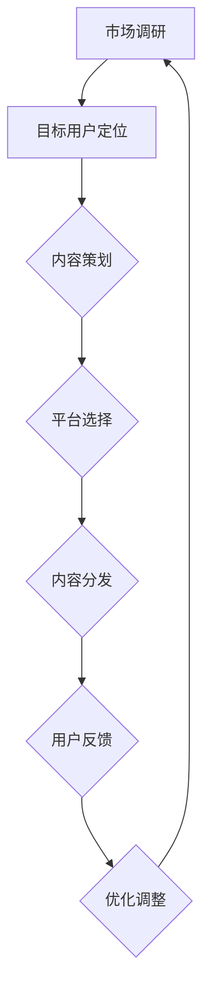

                 

关键词：知识付费、创业、跨平台运营、策略、人工智能

摘要：本文将探讨知识付费创业的跨平台运营策略，分析其在当前市场环境中的重要性，并提供详细的执行步骤、工具推荐和未来发展趋势。文章旨在帮助知识付费创业者构建一个成功的跨平台运营体系。

## 1. 背景介绍

### 1.1 知识付费市场现状

随着互联网技术的发展和用户需求的变化，知识付费市场呈现出快速增长的趋势。根据相关数据，全球知识付费市场规模已经突破百亿美元，并且预计在未来几年内将继续保持高速增长。

### 1.2 跨平台运营的概念

跨平台运营是指企业在不同的操作系统、应用场景和用户群体之间进行运营和推广的活动。这种模式能够帮助企业覆盖更广泛的用户群体，提高品牌知名度和用户粘性。

## 2. 核心概念与联系

下面我们将使用Mermaid流程图来展示知识付费创业的跨平台运营策略的核心概念和流程。



### 2.1 市场调研

在开始跨平台运营之前，企业需要进行充分的市场调研，了解目标市场的需求、竞争态势和用户行为。

### 2.2 目标用户定位

根据市场调研的结果，企业需要明确目标用户群体，为其提供有价值的内容。

### 2.3 内容策划

内容策划是跨平台运营的核心，企业需要根据目标用户的需求，策划出有趣、有深度、有价值的内容。

### 2.4 平台选择

企业需要选择适合的跨平台运营工具，如社交媒体、内容平台、电子商务平台等，以覆盖更广泛的用户群体。

### 2.5 内容分发

内容分发是将策划好的内容通过不同的平台进行推广和分发，吸引用户关注。

### 2.6 用户反馈

用户反馈是跨平台运营的重要环节，企业需要收集用户反馈，了解用户的需求和满意度，不断优化内容和服务。

### 2.7 优化调整

根据用户反馈，企业需要不断优化调整运营策略，提高用户体验和用户粘性。

## 3. 核心算法原理 & 具体操作步骤

### 3.1 算法原理概述

跨平台运营的核心算法主要包括数据分析和机器学习算法，用于用户行为分析和个性化推荐。

### 3.2 算法步骤详解

#### 3.2.1 数据收集

企业需要收集用户的行为数据，如浏览记录、购买记录、互动行为等。

#### 3.2.2 数据清洗

对收集到的数据进行清洗，去除无效和重复的数据。

#### 3.2.3 数据分析

使用数据分析算法，对清洗后的数据进行分析，提取有价值的信息。

#### 3.2.4 个性化推荐

根据数据分析结果，使用机器学习算法，为用户推荐感兴趣的内容。

### 3.3 算法优缺点

#### 优点

- 提高用户体验：通过个性化推荐，提高用户对内容的满意度和粘性。
- 提高转化率：通过用户行为分析，优化内容和服务，提高转化率。

#### 缺点

- 数据隐私：收集用户行为数据可能涉及到数据隐私问题。
- 算法复杂度：机器学习算法的计算复杂度较高，需要大量的计算资源和时间。

### 3.4 算法应用领域

跨平台运营算法可以广泛应用于知识付费、电商、社交网络等多个领域。

## 4. 数学模型和公式 & 详细讲解 & 举例说明

### 4.1 数学模型构建

在跨平台运营中，常见的数学模型包括用户行为预测模型和内容推荐模型。

### 4.2 公式推导过程

用户行为预测模型可以使用线性回归模型，其公式为：

$$y = \beta_0 + \beta_1x_1 + \beta_2x_2 + ... + \beta_nx_n$$

其中，$y$ 为用户行为预测值，$x_1, x_2, ..., x_n$ 为用户行为特征，$\beta_0, \beta_1, \beta_2, ..., \beta_n$ 为模型参数。

内容推荐模型可以使用协同过滤算法，其公式为：

$$r_{ij} = \frac{\sum_{k=1}^{n}u_{ik}v_{kj}}{\sum_{k=1}^{n}u_{ik}^2}$$

其中，$r_{ij}$ 为用户$i$对内容$j$的评分预测值，$u_{ik}$ 为用户$i$对内容$k$的评分，$v_{kj}$ 为内容$j$对用户$k$的评分。

### 4.3 案例分析与讲解

以一个知识付费平台的用户行为预测为例，假设用户A对课程1、课程2、课程3的评分分别为4、3、5，我们使用线性回归模型预测用户A对课程4的评分。

首先，收集用户A的行为数据，包括课程1、课程2、课程3的评分和课程4的相关特征（如课程时长、难度等）。

然后，使用线性回归模型进行训练，得到模型参数$\beta_0, \beta_1, \beta_2, \beta_3$。

最后，使用训练好的模型预测用户A对课程4的评分：

$$y = \beta_0 + \beta_1x_1 + \beta_2x_2 + \beta_3x_3$$

其中，$x_1, x_2, x_3$ 分别为课程4的相关特征值。

## 5. 项目实践：代码实例和详细解释说明

### 5.1 开发环境搭建

在Python环境中搭建开发环境，安装必要的库，如NumPy、Scikit-learn等。

### 5.2 源代码详细实现

以下是使用Python实现用户行为预测的示例代码：

```python
import numpy as np
from sklearn.linear_model import LinearRegression

# 用户行为数据
X = np.array([[4, 3, 5], [3, 4, 5], [5, 4, 3]])
y = np.array([4, 3, 5])

# 创建线性回归模型
model = LinearRegression()

# 模型训练
model.fit(X, y)

# 模型预测
x_new = np.array([4, 4, 4])  # 课程4的相关特征
y_pred = model.predict(x_new)

print("预测评分：", y_pred)
```

### 5.3 代码解读与分析

代码首先导入必要的库，然后定义用户行为数据矩阵$X$和预测值矩阵$y$。接着，创建线性回归模型，使用训练数据进行模型训练。最后，使用训练好的模型预测课程4的评分。

### 5.4 运行结果展示

运行代码后，输出预测评分结果。根据预测结果，我们可以为用户推荐相应的课程。

## 6. 实际应用场景

### 6.1 知识付费平台

知识付费平台可以使用跨平台运营策略，根据用户行为数据进行个性化推荐，提高用户满意度和转化率。

### 6.2 电商

电商可以使用跨平台运营策略，根据用户购物行为进行个性化推荐，提高用户购买意愿和销售额。

### 6.3 社交网络

社交网络可以使用跨平台运营策略，根据用户互动行为进行个性化推荐，提高用户活跃度和留存率。

## 7. 工具和资源推荐

### 7.1 学习资源推荐

- 《机器学习实战》：详细介绍了机器学习的基础知识和应用案例。
- 《深度学习》：介绍了深度学习的基本概念和经典算法。

### 7.2 开发工具推荐

- Jupyter Notebook：用于数据分析和模型训练。
- PyCharm：Python开发环境。

### 7.3 相关论文推荐

- 《 collaborative filtering for the 21st century》：介绍了协同过滤算法的最新进展。

## 8. 总结：未来发展趋势与挑战

### 8.1 研究成果总结

本文总结了知识付费创业的跨平台运营策略，包括市场调研、目标用户定位、内容策划、平台选择、内容分发、用户反馈和优化调整等环节。

### 8.2 未来发展趋势

随着人工智能技术的发展，知识付费创业的跨平台运营策略将更加智能化和个性化。

### 8.3 面临的挑战

跨平台运营面临的主要挑战包括数据隐私保护、算法复杂度和计算资源需求等。

### 8.4 研究展望

未来，知识付费创业的跨平台运营策略将更加注重用户需求的挖掘和个性化推荐的优化，以提高用户体验和用户粘性。

## 9. 附录：常见问题与解答

### 9.1 跨平台运营的优势是什么？

跨平台运营可以覆盖更广泛的用户群体，提高品牌知名度和用户粘性，从而提高转化率和销售额。

### 9.2 如何保护用户隐私？

企业可以通过数据加密、匿名化和数据去重等技术手段，保护用户隐私。

### 9.3 跨平台运营需要哪些技术支持？

跨平台运营需要大数据分析、机器学习和人工智能等技术支持，以实现个性化推荐和优化调整。

作者：禅与计算机程序设计艺术 / Zen and the Art of Computer Programming
----------------------------------------------------------------


