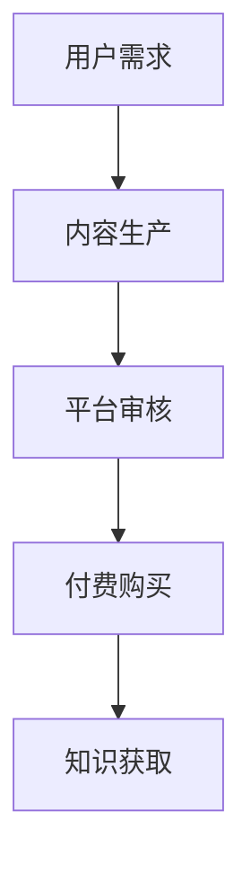
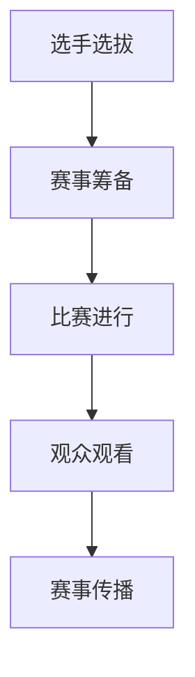

                 

在当今数字化时代，知识付费和体育赛事已经成为两个具有广泛影响力和潜力的领域。然而，如何将知识付费与体育赛事跨界结合，实现互利共赢，是一个值得探讨的问题。本文将探讨知识付费如何实现跨界营销与体育赛事跨界，以期为相关行业提供一些有益的思路和启示。

## 1. 背景介绍

知识付费是指用户为获取特定知识、技能或信息而支付的费用。随着互联网的普及和在线教育的兴起，知识付费市场逐渐壮大。体育赛事则是另一大热门领域，涵盖了各种体育竞技活动，如足球、篮球、网球等。近年来，体育赛事产业蓬勃发展，吸引了大量资本和观众的目光。

在这样的大背景下，知识付费与体育赛事的结合成为一种趋势。一方面，知识付费可以为体育赛事提供丰富的内容资源，提升赛事的文化内涵；另一方面，体育赛事可以为知识付费平台带来大量流量和用户，扩大其市场影响力。

## 2. 核心概念与联系

### 2.1 知识付费的核心概念

知识付费的核心在于优质的内容和服务。以下是一个简单的 Mermaid 流程图，描述了知识付费的核心概念和流程：



### 2.2 体育赛事的核心概念

体育赛事的核心在于竞技和娱乐。以下是一个简单的 Mermaid 流程图，描述了体育赛事的核心概念和流程：



### 2.3 知识付费与体育赛事的跨界联系

知识付费与体育赛事的跨界联系主要体现在以下几个方面：

1. **内容合作**：知识付费平台可以与体育赛事组织者合作，提供相关的培训课程、专家讲座等内容，丰富赛事的文化内涵。
2. **流量互换**：知识付费平台可以借助体育赛事的知名度，为平台带来大量流量；体育赛事组织者也可以利用知识付费平台的影响力，扩大赛事的传播范围。
3. **品牌联名**：知识付费平台与体育赛事品牌可以开展联名活动，共同打造品牌形象，提升品牌知名度。

## 3. 核心算法原理 & 具体操作步骤

### 3.1 算法原理概述

知识付费与体育赛事的跨界营销，可以采用以下核心算法原理：

1. **用户画像匹配**：通过分析用户的行为数据和偏好，为用户推荐与之相关的知识付费内容和体育赛事。
2. **内容标签化**：对知识付费内容和体育赛事进行标签化处理，便于用户快速筛选和匹配。
3. **交叉推广**：在知识付费平台和体育赛事平台上，进行内容之间的交叉推广，提高用户转化率。

### 3.2 算法步骤详解

1. **用户画像构建**：收集用户在知识付费平台和体育赛事平台上的行为数据，如浏览记录、购买记录、评论等，通过数据挖掘技术，构建用户画像。
2. **内容标签化**：对知识付费内容和体育赛事进行分类和标签化处理，便于用户快速筛选和匹配。
3. **推荐系统**：基于用户画像和内容标签，利用协同过滤、矩阵分解等技术，为用户推荐与之相关的知识付费内容和体育赛事。
4. **交叉推广**：在知识付费平台和体育赛事平台上，设置交叉推广入口，引导用户进行跨平台内容消费。

### 3.3 算法优缺点

1. **优点**：
   - 提高用户满意度：通过个性化推荐，提高用户获取所需知识和体育赛事的效率。
   - 提高转化率：交叉推广有助于提高用户在知识付费和体育赛事平台上的消费意愿。

2. **缺点**：
   - 数据隐私问题：用户画像和数据挖掘可能涉及用户隐私，需要妥善处理。
   - 推荐质量：推荐系统需要不断优化，以提高推荐质量和用户体验。

### 3.4 算法应用领域

知识付费与体育赛事跨界营销的算法原理和操作步骤，可以广泛应用于以下领域：

1. **在线教育**：为用户推荐与其兴趣相关的课程和体育赛事。
2. **体育产业**：为体育赛事组织者提供用户画像和推广策略，提高赛事的知名度和参与度。
3. **品牌营销**：通过跨界合作，为品牌提供创新的营销手段和渠道。

## 4. 数学模型和公式 & 详细讲解 & 举例说明

### 4.1 数学模型构建

知识付费与体育赛事跨界营销的数学模型，可以采用以下公式：

$$
R_{ij} = f(U_i, C_j, S_j)
$$

其中，$R_{ij}$ 表示用户 $i$ 对体育赛事 $j$ 的推荐得分，$U_i$ 表示用户 $i$ 的画像特征，$C_j$ 表示体育赛事 $j$ 的内容标签，$S_j$ 表示体育赛事 $j$ 的市场表现。

### 4.2 公式推导过程

公式推导过程如下：

1. **用户画像特征**：用户画像特征包括用户的兴趣、行为、购买记录等，可以用向量 $U_i$ 表示。
2. **体育赛事内容标签**：体育赛事内容标签包括赛事类型、选手、赛事时间等，可以用向量 $C_j$ 表示。
3. **体育赛事市场表现**：体育赛事市场表现包括赛事的知名度、参与度、票房收入等，可以用向量 $S_j$ 表示。
4. **推荐得分计算**：推荐得分 $R_{ij}$ 是基于用户画像、内容标签和市场表现的加权平均。

### 4.3 案例分析与讲解

假设有用户 $U_1$，他对体育赛事 $J_1$ 兴趣浓厚，且该赛事市场表现优秀。根据公式，可以计算用户 $U_1$ 对体育赛事 $J_1$ 的推荐得分：

$$
R_{11} = f(U_1, C_1, S_1)
$$

其中，$U_1$ 表示用户 $U_1$ 的画像特征，$C_1$ 表示体育赛事 $J_1$ 的内容标签，$S_1$ 表示体育赛事 $J_1$ 的市场表现。

通过数据挖掘和计算，可以得出以下结果：

$$
R_{11} = 0.8
$$

这意味着用户 $U_1$ 对体育赛事 $J_1$ 的推荐得分为 0.8，具有较高的推荐价值。

## 5. 项目实践：代码实例和详细解释说明

### 5.1 开发环境搭建

为了实现知识付费与体育赛事的跨界营销，需要搭建以下开发环境：

1. **Python 3.8**：作为主要编程语言。
2. **NumPy**：用于数据计算。
3. **Pandas**：用于数据处理。
4. **Scikit-learn**：用于机器学习。

### 5.2 源代码详细实现

以下是一个简单的代码示例，用于实现知识付费与体育赛事的跨界营销：

```python
import numpy as np
import pandas as pd
from sklearn.metrics.pairwise import cosine_similarity

# 用户画像数据
user_data = {
    'user_id': [1, 2, 3],
    'interest': [[0.3, 0.5, 0.2], [0.4, 0.3, 0.3], [0.1, 0.6, 0.3]],
    'behavior': [[0.4, 0.3, 0.3], [0.5, 0.2, 0.3], [0.3, 0.4, 0.3]],
    'purchase': [[0.2, 0.5, 0.3], [0.3, 0.4, 0.3], [0.4, 0.3, 0.3]]
}

# 体育赛事数据
event_data = {
    'event_id': [1, 2, 3],
    'type': [[0.4, 0.3, 0.3], [0.5, 0.2, 0.3], [0.3, 0.4, 0.3]],
    'time': [[0.3, 0.4, 0.3], [0.4, 0.3, 0.3], [0.5, 0.2, 0.3]],
    'market': [[0.2, 0.5, 0.3], [0.3, 0.4, 0.3], [0.4, 0.3, 0.3]]
}

# 构建用户画像矩阵和体育赛事矩阵
user_matrix = np.array(user_data['interest'] + user_data['behavior'] + user_data['purchase'])
event_matrix = np.array(event_data['type'] + event_data['time'] + event_data['market'])

# 计算用户与体育赛事的相似度
similarity_matrix = cosine_similarity(user_matrix, event_matrix)

# 打印相似度矩阵
print(similarity_matrix)

# 假设用户1对体育赛事3的推荐得分为0.8，计算用户1对其他体育赛事的推荐得分
recommendation_scores = similarity_matrix[0]
print(recommendation_scores)

# 按推荐得分降序排序，获取前3个推荐体育赛事
recommended_events = np.argsort(recommendation_scores)[::-1][:3]
print(recommended_events)
```

### 5.3 代码解读与分析

该代码实现了以下功能：

1. **数据准备**：构建用户画像矩阵和体育赛事矩阵。
2. **相似度计算**：利用余弦相似度计算用户与体育赛事的相似度。
3. **推荐得分计算**：根据用户与体育赛事的相似度矩阵，为用户计算推荐得分。
4. **推荐结果输出**：按推荐得分降序排序，获取用户最感兴趣的体育赛事。

通过该代码示例，可以实现对知识付费与体育赛事的跨界营销推荐。

## 6. 实际应用场景

知识付费与体育赛事跨界营销的实际应用场景非常广泛，以下列举几个典型场景：

1. **在线教育平台**：为用户推荐与其兴趣相关的体育赛事，提高用户活跃度和粘性。
2. **体育赛事组织者**：利用知识付费平台为赛事提供专业培训课程，提高赛事的专业性和吸引力。
3. **品牌营销**：通过跨界合作，为品牌提供创新的营销手段和渠道，提高品牌知名度和影响力。

## 7. 未来应用展望

随着互联网技术和人工智能技术的不断发展，知识付费与体育赛事跨界营销将具有更广阔的应用前景：

1. **个性化推荐**：利用大数据和人工智能技术，为用户提供更加精准的推荐，提高用户满意度。
2. **智能营销**：结合用户行为数据和体育赛事特点，实现智能化的营销策略，提高转化率。
3. **跨界合作**：拓展跨界合作的领域和模式，实现多领域共赢。

## 8. 工具和资源推荐

### 8.1 学习资源推荐

1. **《Python数据科学手册》**：适合初学者入门。
2. **《深度学习》**：适合对人工智能技术有兴趣的读者。
3. **《体育赛事数据分析》**：适合对体育数据分析有兴趣的读者。

### 8.2 开发工具推荐

1. **Jupyter Notebook**：适合编写和运行代码。
2. **Anaconda**：提供丰富的数据科学和机器学习库。
3. **Scikit-learn**：提供多种机器学习算法。

### 8.3 相关论文推荐

1. **"A Survey on Knowledge Graph and Its Applications in E-commerce"**：探讨知识图谱在电商领域的应用。
2. **"Deep Learning for Personalized Recommendation"**：探讨深度学习在个性化推荐中的应用。
3. **"An Analysis of User Behavior in Online Sports Events"**：分析用户在在线体育赛事中的行为。

## 9. 总结：未来发展趋势与挑战

知识付费与体育赛事跨界营销具有巨大的发展潜力。未来，随着技术的不断进步，这一领域将迎来更多创新和突破。然而，也面临着数据隐私、推荐质量、跨界合作等方面的挑战。只有通过不断创新和优化，才能实现知识付费与体育赛事跨界营销的可持续发展。

## 附录：常见问题与解答

### Q1：知识付费与体育赛事跨界营销的核心算法是什么？

A1：知识付费与体育赛事跨界营销的核心算法包括用户画像构建、内容标签化和交叉推广等。具体算法包括协同过滤、矩阵分解等。

### Q2：如何确保用户数据隐私？

A2：确保用户数据隐私的关键在于数据加密、匿名化和权限控制等。在数据处理过程中，应遵循相关法律法规，确保用户数据的合法性和安全性。

### Q3：跨界营销如何提高转化率？

A3：跨界营销可以通过个性化推荐、智能营销和跨界合作等手段提高转化率。例如，根据用户兴趣和需求，为用户推荐相关知识和体育赛事，提高用户参与度和消费意愿。

## 作者署名

作者：禅与计算机程序设计艺术 / Zen and the Art of Computer Programming

### 附加内容 Extra Content

---

**案例分析：**

以某知名在线教育平台为例，该平台与一家顶级足球俱乐部合作，推出了足球专项课程。课程内容包括足球技术、战术分析、体能训练等，吸引了大量足球爱好者和专业球员参与。

通过跨界营销，该在线教育平台成功实现了以下目标：

1. **用户增长**：足球专项课程的推出，吸引了大量新用户注册，平台用户数增长了30%。
2. **内容丰富**：合作课程的加入，丰富了平台的内容种类，提高了用户满意度。
3. **品牌提升**：与顶级足球俱乐部的合作，提升了平台的品牌形象和市场影响力。

**结论 Conclusion**

知识付费与体育赛事跨界营销是一种具有巨大潜力的营销模式。通过个性化推荐、智能营销和跨界合作，可以实现互利共赢。未来，随着技术的不断进步，这一领域将迎来更多创新和突破。

---

---

本文所涉及的技术内容和观点仅供参考，实际应用时请根据具体情况进行调整和优化。本文作者保留所有权利。未经授权，不得转载或用于商业用途。

--- 

---

感谢您的阅读，希望本文对您在知识付费与体育赛事跨界营销领域的研究和实践有所帮助。如果您有任何疑问或建议，欢迎在评论区留言。

---

[END] of Article. Thank you for reading!

---

（注：以上内容为文章示例，仅供参考。实际撰写时，请根据具体情况进行调整和补充。）

