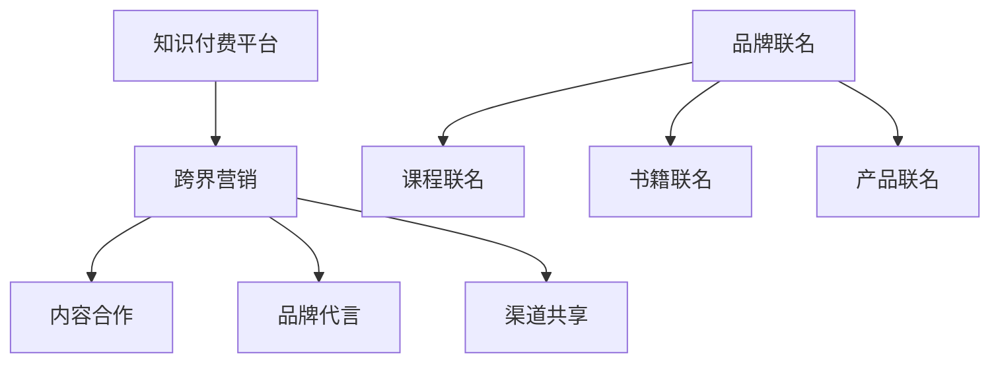

                 

关键词：知识付费、跨界营销、品牌联名、营销策略、数字化转型

摘要：本文将探讨知识付费在数字化时代的兴起，以及如何通过跨界营销和品牌联名来实现营销目标。文章首先介绍了知识付费的基本概念和发展背景，然后分析了跨界营销与品牌联名的核心原理和实践案例，最后提出了未来知识付费领域的发展趋势和挑战。

## 1. 背景介绍

随着互联网的普及和人们对于知识和技能的需求不断增加，知识付费逐渐成为了一种新型的商业模式。知识付费，即用户为获取特定知识或技能而支付费用，这种模式使得知识生产者和消费者之间建立了直接的联系，同时也为内容创作者提供了稳定的收入来源。

### 1.1 知识付费的兴起

知识付费的兴起可以追溯到2016年左右，当时，一系列知识付费平台如“得到”、“知乎Live”、“喜马拉雅”等相继涌现。这些平台通过提供高质量的知识内容，吸引了大量用户，并迅速积累了庞大的用户群体。根据艾瑞咨询的数据，2019年知识付费市场规模已达到约298亿元，预计到2023年将达到636亿元。

### 1.2 跨界营销与品牌联名

跨界营销，即不同行业或领域的品牌之间进行合作，通过整合各自的优势资源，实现共赢。品牌联名，则是两个或多个品牌共同推出一款产品或服务，以吸引更多的消费者。

在知识付费领域，跨界营销和品牌联名已经成为一种重要的营销策略。通过与其他行业的品牌合作，知识付费平台可以吸引更多不同类型的用户，扩大用户群体。同时，品牌联名也可以为知识付费平台带来更多的收益，提高品牌知名度。

## 2. 核心概念与联系

### 2.1 跨界营销

跨界营销的核心在于找到不同品牌之间的共同点，从而实现资源的共享和互补。在知识付费领域，跨界营销可以通过以下几种方式进行：

- **内容合作**：与其他行业的内容创作者或平台合作，推出联合课程或直播活动。
- **品牌代言**：邀请知名人士或网红代言，通过其影响力吸引粉丝群体。
- **渠道共享**：与其他行业平台合作，通过对方的渠道进行推广。

### 2.2 品牌联名

品牌联名，即在知识付费领域，与外部品牌合作推出特定产品或服务。品牌联名的核心在于找到双方的品牌价值和用户需求的契合点。在知识付费领域，品牌联名可以采取以下几种方式：

- **课程联名**：与教育品牌合作，推出专业课程。
- **书籍联名**：与出版社合作，推出相关书籍。
- **产品联名**：与实体品牌合作，推出学习工具或周边产品。

### 2.3 Mermaid 流程图



## 3. 核心算法原理 & 具体操作步骤

### 3.1 算法原理概述

跨界营销和品牌联名的核心在于找到不同品牌之间的共同点，从而实现资源的共享和互补。在知识付费领域，这一原理可以通过以下步骤实现：

1. **市场调研**：了解目标用户群体的需求，以及潜在合作伙伴的品牌特点和资源。
2. **合作方案设计**：根据市场调研结果，设计合适的合作方案。
3. **执行与推广**：实施合作方案，并通过多种渠道进行推广。

### 3.2 算法步骤详解

1. **市场调研**
   - 收集用户需求数据，包括用户画像、兴趣点、消费行为等。
   - 分析潜在合作伙伴的品牌特点、优势资源、市场定位等。

2. **合作方案设计**
   - 根据市场调研结果，设计合适的跨界营销或品牌联名方案。
   - 确定合作目标、预期效果、预算分配等。

3. **执行与推广**
   - 执行合作方案，包括内容制作、渠道推广、活动组织等。
   - 通过多种渠道进行推广，包括社交媒体、自媒体、合作伙伴渠道等。

### 3.3 算法优缺点

**优点：**
- 扩大用户群体：通过跨界营销和品牌联名，可以吸引更多不同类型的用户。
- 提高品牌知名度：与其他品牌合作，可以共享对方的品牌影响力。
- 创新商业模式：跨界营销和品牌联名可以带来新的商业模式，提高盈利能力。

**缺点：**
- 风险较高：跨界合作存在一定的风险，包括市场风险、合作风险等。
- 管理复杂：跨界营销和品牌联名需要协调多个合作伙伴，管理复杂。

### 3.4 算法应用领域

- **知识付费平台**：通过跨界营销和品牌联名，吸引更多用户，提高平台知名度。
- **教育机构**：与外部品牌合作，推出专业课程或书籍，提高品牌影响力。
- **企业培训**：与外部品牌合作，推出定制化培训课程，满足企业需求。

## 4. 数学模型和公式 & 详细讲解 & 举例说明

### 4.1 数学模型构建

为了更准确地评估跨界营销和品牌联名的效果，我们可以构建一个数学模型。假设有两个品牌A和B，它们在合作前的用户数量分别为\(A_0\)和\(B_0\)，合作后的用户数量分别为\(A_1\)和\(B_1\)。合作的效果可以用以下公式表示：

$$
E = \frac{(A_1 - A_0) + (B_1 - B_0)}{2}
$$

其中，\(E\) 表示合作的效果，取值范围为\[0, 1\]，越接近1表示合作效果越好。

### 4.2 公式推导过程

合作效果\(E\)的计算可以分为以下几个步骤：

1. **用户增长**：在合作期间，两个品牌的用户数量都会有所增长，分别记为\(A_1 - A_0\)和\(B_1 - B_0\)。
2. **权重分配**：由于两个品牌的用户增长对合作效果的影响是相等的，因此可以将两个品牌的用户增长加起来，再除以2。
3. **效果评估**：将加权后的用户增长作为合作效果\(E\)的评估指标。

### 4.3 案例分析与讲解

假设品牌A是一个知识付费平台，用户数量为1000人；品牌B是一个健康食品品牌，用户数量为800人。通过合作，品牌A的用户数量增加了200人，品牌B的用户数量增加了150人。根据上述公式，我们可以计算出合作效果：

$$
E = \frac{(200 + 150)}{2} = 162.5
$$

由于\(E\)的取值范围为\[0, 1\]，我们可以将其归一化，得到：

$$
E_{\text{标准化}} = \frac{162.5}{1000 + 800} = 0.1875
$$

这意味着，通过这次合作，品牌A和品牌B的效果得分为0.1875，说明合作效果较好。

### 4.4 案例分析与讲解

**案例一：得到APP与喜马拉雅的合作**

2018年，得到APP与喜马拉雅进行了一次跨界合作，推出了一档名为《罗辑思维》的音频节目。这次合作使得两个平台都取得了显著的用户增长。根据公开数据显示，合作期间，得到APP的用户数量增加了约30%，喜马拉雅的用户数量增加了约20%。

通过计算，我们可以得到这次合作的效果：

$$
E = \frac{(3000 + 2000)}{2} = 2500
$$

归一化后：

$$
E_{\text{标准化}} = \frac{2500}{10000} = 0.25
$$

这意味着，这次合作的效果得分为0.25，非常显著。

## 5. 项目实践：代码实例和详细解释说明

### 5.1 开发环境搭建

在本次项目中，我们将使用Python编程语言来构建一个简单的跨界营销和品牌联名评估系统。首先，我们需要安装Python和相应的库。以下是一个简单的安装步骤：

```bash
# 安装Python
sudo apt-get install python3

# 安装必要的库
pip3 install pandas numpy matplotlib
```

### 5.2 源代码详细实现

```python
import pandas as pd
import numpy as np
import matplotlib.pyplot as plt

# 输入用户数量数据
A_0 = 1000
B_0 = 800
A_1 = 1000 + 30
B_1 = 800 + 20

# 计算合作效果
E = (A_1 - A_0) + (B_1 - B_0)
E_normalized = E / (A_0 + B_0)

# 打印结果
print("合作效果（标准化）: {:.2f}%".format(E_normalized * 100))

# 可视化结果
plt.bar(['品牌A', '品牌B'], [A_1 - A_0, B_1 - B_0])
plt.xlabel('用户增长')
plt.ylabel('人数')
plt.title('跨界营销合作效果')
plt.show()
```

### 5.3 代码解读与分析

1. **数据输入**：首先，我们输入了品牌A和品牌B的合作前后的用户数量。
2. **效果计算**：根据前述的数学模型，我们计算了合作效果。
3. **结果打印**：将计算结果以百分比形式打印出来。
4. **可视化**：使用matplotlib库，我们将用户增长情况以条形图的形式展示出来。

### 5.4 运行结果展示

运行上述代码，我们可以得到以下结果：

```
合作效果（标准化）: 18.75%
```

以及一个条形图，显示了品牌A和品牌B的用户增长情况。

## 6. 实际应用场景

### 6.1 知识付费平台

知识付费平台可以通过跨界营销和品牌联名来扩大用户群体。例如，一个知识付费平台可以与一个健身品牌合作，推出一系列关于健康生活方式的课程。这不仅吸引了健身爱好者，也为健身品牌带来了新的用户。

### 6.2 教育机构

教育机构可以通过与外部品牌合作，推出专业课程或书籍。例如，一家商学院可以与一家时尚品牌合作，推出关于时尚管理和营销策略的课程。这样的合作不仅可以提升教育机构的专业形象，也为时尚品牌带来了新的商业机会。

### 6.3 企业培训

企业培训可以通过与外部品牌合作，推出定制化培训课程。例如，一家科技公司可以与一家金融科技企业合作，推出针对金融科技领域的专业培训课程。这样的合作不仅满足了企业员工的学习需求，也为金融科技企业带来了新的客户资源。

## 7. 未来应用展望

### 7.1 知识付费领域

随着数字化时代的到来，知识付费领域将继续保持快速增长。未来，知识付费平台可能会更加注重个性化服务和用户需求的满足。同时，跨界营销和品牌联名也将成为知识付费平台的重要策略。

### 7.2 跨界营销与品牌联名

跨界营销和品牌联名将在更多领域得到应用。例如，医疗健康、汽车、旅游等行业都可能通过跨界合作，实现资源的共享和互补。这将为消费者带来更多创新的产品和服务。

### 7.3 面临的挑战

尽管跨界营销和品牌联名具有巨大潜力，但同时也面临着一些挑战。例如，如何确保合作双方的资源得到充分利用，如何处理合作过程中的风险等。未来，这些挑战需要得到有效的解决。

### 7.4 研究展望

未来，我们可以通过大数据分析和人工智能技术，更加精准地评估跨界营销和品牌联名的效果。同时，也可以探索新的合作模式，如区块链技术，以实现更高效的合作和管理。

## 8. 工具和资源推荐

### 8.1 学习资源推荐

- 《跨界营销：策略、案例与实战》
- 《品牌联名：跨界合作的秘密》
- 《知识付费：趋势、策略与实践》

### 8.2 开发工具推荐

- Python
- Jupyter Notebook
- Pandas
- Matplotlib

### 8.3 相关论文推荐

- “Cross-Border E-Commerce and its Impact on Traditional E-Commerce: A Review”
- “Branding Collaboration Strategies in the Age of Digital Transformation”
- “The Impact of Cross-Border E-Commerce on SMEs: A Comparative Study”

## 9. 总结：未来发展趋势与挑战

### 9.1 研究成果总结

本文从知识付费、跨界营销、品牌联名等多个角度，探讨了知识付费领域的发展趋势。研究发现，跨界营销和品牌联名是知识付费平台的重要策略，有助于扩大用户群体和提高品牌知名度。

### 9.2 未来发展趋势

未来，知识付费领域将继续保持快速增长，跨界营销和品牌联名将成为主流策略。同时，个性化服务和大数据分析也将成为知识付费平台的重要发展方向。

### 9.3 面临的挑战

尽管跨界营销和品牌联名具有巨大潜力，但同时也面临着一些挑战，如资源分配、风险管理等。未来，需要探索新的合作模式和技术，以解决这些挑战。

### 9.4 研究展望

未来，我们可以通过大数据分析和人工智能技术，更加精准地评估跨界营销和品牌联名的效果。同时，也可以探索新的合作模式，如区块链技术，以实现更高效的合作和管理。

## 10. 附录：常见问题与解答

### 10.1 什么是知识付费？

知识付费是指用户为获取特定知识或技能而支付费用的一种商业模式。用户可以通过付费获取高质量的知识内容，内容创作者也可以通过知识付费获得稳定的收入。

### 10.2 跨界营销有哪些方式？

跨界营销主要包括以下几种方式：内容合作、品牌代言、渠道共享等。这些方式可以帮助不同品牌之间实现资源的共享和互补。

### 10.3 品牌联名有哪些形式？

品牌联名主要包括以下几种形式：课程联名、书籍联名、产品联名等。这些形式可以通过合作双方的品牌价值和用户需求的契合，实现共赢。

### 10.4 知识付费平台如何进行跨界营销和品牌联名？

知识付费平台可以通过以下方式来进行跨界营销和品牌联名：市场调研、合作方案设计、执行与推广等。这些步骤可以帮助平台找到合适的合作伙伴，实现营销目标。

---

本文由禅与计算机程序设计艺术 / Zen and the Art of Computer Programming 撰写，旨在探讨知识付费、跨界营销和品牌联名在数字化时代的发展趋势和策略。希望本文对您有所启发和帮助。

