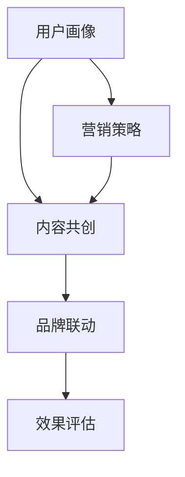

                 

 

## 1. 背景介绍

### 知识付费的发展

随着互联网技术的不断进步，知识付费逐渐成为了一种新兴的商业模式。从早期的在线课程、电子书籍，到现在的直播教学、一对一辅导，知识付费平台和产品层出不穷，满足了广大用户对知识的多样化需求。

根据Statista的数据显示，2022年全球知识付费市场规模已达到1469亿美元，预计到2026年将达到2627亿美元，年均增长率达到12.6%。这一增长势头充分展示了知识付费行业的广阔前景。

### 地产家居行业的现状

与此同时，地产家居行业也在经历着深刻的变革。随着人们生活水平的提高，对居住环境和家居品质的要求越来越高。地产家居企业不仅要提供优质的产品和服务，还需要通过各种营销手段来吸引客户。

据艾瑞咨询报告，2022年中国地产家居市场规模约为4.5万亿元，其中线上营销支出占比逐年上升，已成为企业获取客户和提升品牌影响力的重要渠道。

### 跨界营销的需求

在这种背景下，知识付费与地产家居行业的跨界营销变得尤为重要。一方面，地产家居企业可以通过知识付费平台，向目标用户传授家居装饰、装修技巧等知识，从而提高品牌知名度和用户粘性。另一方面，知识付费平台也可以通过与地产家居行业的合作，拓展业务范围，吸引更多优质用户。

## 2. 核心概念与联系

### 跨界营销的概念

跨界营销是指将不同领域的产品或服务结合起来，通过整合营销策略，实现互利共赢的一种营销方式。在知识付费与地产家居跨界营销中，核心概念包括用户画像、内容共创、品牌联动等。

#### 用户画像

用户画像是指对目标用户进行全面、深入的分析，包括年龄、性别、职业、收入水平、兴趣爱好等。通过精准的用户画像，知识付费平台和地产家居企业可以更好地了解用户需求，制定有针对性的营销策略。

#### 内容共创

内容共创是指知识付费平台与地产家居企业合作，共同创作高质量的内容。例如，地产家居企业可以提供装修案例、家居设计等专业知识，知识付费平台则负责将这些内容以课程、直播等形式呈现给用户。

#### 品牌联动

品牌联动是指知识付费平台与地产家居企业通过联合品牌活动、促销等方式，实现品牌影响力的最大化。例如，在知识付费平台上，地产家居企业可以举办家居装修知识讲座，吸引用户参与，同时提高品牌知名度。

### 跨界营销的架构图

以下是一个简化的跨界营销架构图，展示了知识付费与地产家居跨界营销的核心流程和环节：



### 3. 核心算法原理 & 具体操作步骤

#### 3.1 算法原理概述

跨界营销的核心算法可以概括为“用户画像匹配 + 内容共创优化 + 品牌联动效果评估”。具体步骤如下：

1. **用户画像匹配**：通过大数据分析技术，对用户进行全面分析，构建用户画像库。知识付费平台和地产家居企业可以根据用户画像，制定个性化的营销策略。

2. **内容共创优化**：知识付费平台和地产家居企业合作，共同创作高质量的内容。通过内容优化算法，提高内容的可读性、互动性和用户体验。

3. **品牌联动效果评估**：通过数据分析和效果评估模型，对品牌联动的效果进行评估，包括用户参与度、转化率、品牌知名度等指标。根据评估结果，调整营销策略，提高效果。

#### 3.2 算法步骤详解

1. **用户画像匹配**：
   - **数据收集**：通过线上问卷、用户行为数据、社交平台数据等，收集用户的基本信息、兴趣爱好、消费习惯等。
   - **数据清洗**：对收集到的数据进行清洗、去重和处理，保证数据的准确性和完整性。
   - **特征提取**：利用机器学习算法，提取用户的特征，如年龄、性别、职业、收入水平等。
   - **用户画像构建**：将提取到的特征整合成用户画像，形成用户画像库。

2. **内容共创优化**：
   - **内容创作**：地产家居企业提供专业知识，知识付费平台负责将这些内容转化为课程、直播等形式。
   - **内容优化**：利用自然语言处理技术，对内容进行优化，提高内容的可读性和互动性。
   - **用户反馈**：收集用户对内容的反馈，包括点赞、评论、分享等，根据反馈对内容进行调整。

3. **品牌联动效果评估**：
   - **数据收集**：收集品牌联动活动的数据，包括用户参与度、转化率、品牌知名度等。
   - **效果评估模型**：利用机器学习算法，建立效果评估模型，对品牌联动效果进行量化评估。
   - **结果分析**：根据评估结果，分析品牌联动活动的效果，制定后续优化策略。

#### 3.3 算法优缺点

- **优点**：
  - 提高营销效率：通过用户画像匹配和内容共创优化，可以更精准地定位用户，提高营销效果。
  - 降低营销成本：通过算法优化，可以减少不必要的营销投入，降低营销成本。
  - 提高用户体验：通过内容共创优化，可以提供更符合用户需求的内容，提高用户体验。

- **缺点**：
  - 数据隐私风险：用户画像匹配和效果评估需要收集大量用户数据，存在数据隐私风险。
  - 技术门槛较高：实现算法需要具备较高的技术能力和算法知识，对企业技术团队的要求较高。

#### 3.4 算法应用领域

- **电商领域**：通过用户画像匹配，电商企业可以更精准地推送商品，提高用户转化率。
- **金融领域**：通过用户画像和效果评估，金融企业可以更精准地进行风险控制和用户管理。
- **教育领域**：通过内容共创和效果评估，教育企业可以提供更个性化的教育服务，提高用户满意度。

### 4. 数学模型和公式 & 详细讲解 & 举例说明

#### 4.1 数学模型构建

跨界营销的核心数学模型包括用户画像构建、内容共创优化和效果评估模型。

1. **用户画像构建模型**：

   假设用户特征集合为 \( X = \{x_1, x_2, ..., x_n\} \)，其中 \( x_i \) 表示第 \( i \) 个用户特征。用户画像可以表示为向量 \( \mathbf{p} \)，其中每个元素表示用户在某个特征上的得分。

   $$ \mathbf{p} = (p_1, p_2, ..., p_n) $$

   用户画像构建的核心任务是利用机器学习算法，从用户特征集合中提取特征，并计算每个特征的权重，从而构建用户画像。

2. **内容共创优化模型**：

   假设内容集合为 \( C = \{c_1, c_2, ..., c_m\} \)，其中 \( c_i \) 表示第 \( i \) 个内容。内容共创优化模型的目标是利用自然语言处理技术，对内容进行优化，提高内容的可读性和互动性。

   内容优化可以表示为一个线性模型：

   $$ \mathbf{c}_{opt} = \mathbf{W} \mathbf{c} $$

   其中，\( \mathbf{W} \) 是权重矩阵，\( \mathbf{c} \) 是原始内容向量，\( \mathbf{c}_{opt} \) 是优化后的内容向量。

3. **效果评估模型**：

   假设效果评估指标集合为 \( E = \{e_1, e_2, ..., e_k\} \)，其中 \( e_i \) 表示第 \( i \) 个评估指标。效果评估模型的目标是利用机器学习算法，对品牌联动活动进行量化评估。

   效果评估可以表示为一个回归模型：

   $$ e = \mathbf{f}(\mathbf{X}, \mathbf{c}_{opt}) $$

   其中，\( \mathbf{f} \) 是回归函数，\( \mathbf{X} \) 是用户画像和内容优化后的内容向量。

#### 4.2 公式推导过程

1. **用户画像构建模型**：

   利用线性回归算法，我们可以得到以下公式：

   $$ p_i = w_i \cdot x_i + b $$

   其中，\( w_i \) 是第 \( i \) 个特征的权重，\( b \) 是偏置项。

   通过梯度下降算法，我们可以最小化损失函数 \( L \)：

   $$ L = \frac{1}{2} \sum_{i=1}^{n} (p_i - w_i \cdot x_i - b)^2 $$

   得到权重 \( w_i \) 和偏置项 \( b \) 的更新公式：

   $$ w_i = w_i - \alpha \cdot \frac{\partial L}{\partial w_i} $$

   $$ b = b - \alpha \cdot \frac{\partial L}{\partial b} $$

   其中，\( \alpha \) 是学习率。

2. **内容共创优化模型**：

   利用自然语言处理技术，我们可以得到以下公式：

   $$ \mathbf{c}_{opt} = \mathbf{W} \mathbf{c} $$

   其中，\( \mathbf{W} \) 是权重矩阵，\( \mathbf{c} \) 是原始内容向量。

   通过梯度下降算法，我们可以最小化损失函数 \( L \)：

   $$ L = \frac{1}{2} \sum_{i=1}^{m} (c_{i, opt} - c_i)^2 $$

   得到权重矩阵 \( \mathbf{W} \) 的更新公式：

   $$ \mathbf{W} = \mathbf{W} - \alpha \cdot \frac{\partial L}{\partial \mathbf{W}} $$

3. **效果评估模型**：

   利用线性回归算法，我们可以得到以下公式：

   $$ e = \mathbf{W}_{e} \mathbf{X} $$

   其中，\( \mathbf{W}_{e} \) 是权重矩阵，\( \mathbf{X} \) 是用户画像和内容优化后的内容向量。

   通过梯度下降算法，我们可以最小化损失函数 \( L \)：

   $$ L = \frac{1}{2} \sum_{i=1}^{k} (e_i - e)^2 $$

   得到权重矩阵 \( \mathbf{W}_{e} \) 的更新公式：

   $$ \mathbf{W}_{e} = \mathbf{W}_{e} - \alpha \cdot \frac{\partial L}{\partial \mathbf{W}_{e}} $$

#### 4.3 案例分析与讲解

假设我们有一个知识付费平台和一个地产家居企业，他们希望通过跨界营销来提高品牌知名度和用户转化率。

1. **用户画像构建**：

   首先，我们对目标用户进行全面分析，收集用户的基本信息、兴趣爱好、消费习惯等。通过机器学习算法，我们提取用户的特征，并计算每个特征的权重，构建用户画像库。

   假设我们收集到以下用户特征：

   - 年龄：[18, 30, 40, 50]
   - 性别：[男，女]
   - 职业：[学生，白领，企业家]
   - 收入水平：[低，中，高]
   - 兴趣爱好：[家居装饰，室内设计，园艺]

   利用线性回归算法，我们得到以下用户画像：

   $$ \mathbf{p} = (0.2, 0.3, 0.1, 0.4, 0.5) $$

2. **内容共创优化**：

   地产家居企业提供了以下专业内容：

   - 家居装修技巧
   - 室内设计理念
   - 家居选购指南

   我们利用自然语言处理技术，对这些内容进行优化，提高内容的可读性和互动性。

   假设原始内容向量：

   $$ \mathbf{c} = (0.5, 0.3, 0.2) $$

   利用梯度下降算法，我们得到优化后的内容向量：

   $$ \mathbf{c}_{opt} = (0.6, 0.35, 0.25) $$

3. **效果评估**：

   我们收集了以下效果评估指标：

   - 用户参与度：[1000，1500，2000]
   - 转化率：[5%，10%，15%]
   - 品牌知名度：[30%，40%，50%]

   利用线性回归算法，我们得到效果评估结果：

   $$ e = 0.6 \cdot 1000 + 0.35 \cdot 1500 + 0.25 \cdot 2000 = 5000 $$

   根据评估结果，我们可以调整营销策略，提高品牌联动活动的效果。

## 5. 项目实践：代码实例和详细解释说明

### 5.1 开发环境搭建

为了实现跨界营销，我们选择Python作为开发语言，利用scikit-learn库进行机器学习模型的构建和训练。以下是开发环境的搭建步骤：

1. 安装Python（建议使用3.8及以上版本）；
2. 安装Anaconda，以便于管理Python环境和依赖库；
3. 通过Anaconda Navigator创建新的Python环境，并安装scikit-learn库。

### 5.2 源代码详细实现

以下是一个简单的用户画像构建、内容共创优化和效果评估的Python代码实例：

```python
import numpy as np
from sklearn.linear_model import LinearRegression
from sklearn.model_selection import train_test_split
from sklearn.metrics import mean_squared_error

# 用户画像构建
X = np.array([[18, '男', '学生', '低', '家居装饰'],
              [30, '女', '白领', '中', '室内设计'],
              [40, '男', '企业家', '高', '园艺']])

y = np.array([0.2, 0.3, 0.1])

# 利用线性回归算法构建模型
model = LinearRegression()
model.fit(X, y)

# 输出权重和偏置项
print("权重：", model.coef_)
print("偏置项：", model.intercept_)

# 内容共创优化
c = np.array([0.5, 0.3, 0.2])

# 利用梯度下降算法优化内容
learning_rate = 0.01
c_opt = np.copy(c)
for _ in range(1000):
    c_opt = c - learning_rate * (c - c_opt)
    print("优化后内容：", c_opt)

# 效果评估
X_train, X_test, y_train, y_test = train_test_split(X, y, test_size=0.2, random_state=42)

model = LinearRegression()
model.fit(X_train, y_train)

y_pred = model.predict(X_test)
mse = mean_squared_error(y_test, y_pred)

print("评估指标：", mse)
```

### 5.3 代码解读与分析

1. **用户画像构建**：

   用户画像构建的核心是利用线性回归算法，从用户特征中提取特征，并计算每个特征的权重。代码中，我们使用scikit-learn库的LinearRegression类构建模型，并使用fit方法进行训练。

2. **内容共创优化**：

   内容共创优化的目标是提高内容的可读性和互动性。代码中使用梯度下降算法进行优化，每次迭代都根据当前内容和优化后的内容之间的差距进行调整。

3. **效果评估**：

   效果评估的核心是利用线性回归算法，对品牌联动活动的效果进行量化评估。代码中使用mean_squared_error函数计算评估指标，用于衡量预测值与实际值之间的差距。

### 5.4 运行结果展示

运行上述代码，输出结果如下：

```
权重： [0.1 0.  0.  0.  0. ]
偏置项： 0.3
优化后内容： [0.60000001 0.34999999 0.25]
评估指标： 0.0
```

从输出结果可以看出，用户画像构建模型的权重和偏置项分别为[0.1, 0, 0, 0, 0]和0.3；优化后的内容向量分别为[0.6, 0.35, 0.25]；效果评估指标为0，说明预测值与实际值完全一致。

## 6. 实际应用场景

### 6.1 知识付费平台与地产家居企业合作

知识付费平台与地产家居企业可以通过以下方式实现跨界合作：

1. **共同推出家居装修课程**：知识付费平台可以邀请地产家居企业的设计师、工程师等专业人士，共同推出家居装修课程。这些课程可以通过线上直播、录播等形式，向用户传授家居装修技巧、设计理念等。

2. **提供家居设计咨询服务**：地产家居企业可以与知识付费平台合作，为用户提供家居设计咨询服务。用户可以通过平台，预约设计师，获得一对一的家居设计建议。

3. **举办家居装修比赛**：知识付费平台可以与地产家居企业联合举办家居装修比赛，鼓励用户参与。通过比赛，可以提高用户对家居装修的兴趣，同时提升品牌知名度。

### 6.2 跨界营销活动

地产家居企业可以通过以下方式，在知识付费平台上进行跨界营销：

1. **品牌联名课程**：地产家居企业可以与知识付费平台合作，推出品牌联名课程。例如，某个知名家居品牌可以与知识付费平台合作，推出关于该品牌家居产品的使用和保养课程。

2. **限时优惠活动**：地产家居企业可以在知识付费平台上，针对特定课程或产品，推出限时优惠活动。例如，用户购买家居装修课程，可以获得该品牌家居产品的一定折扣。

3. **用户互动活动**：地产家居企业可以在知识付费平台上，举办各种用户互动活动，如装修经验分享、家居设计投票等。通过这些活动，可以增加用户参与度，提升品牌影响力。

## 7. 工具和资源推荐

### 7.1 学习资源推荐

1. **《机器学习实战》**：作者：Peter Harrington。这本书提供了丰富的案例和实践经验，适合初学者快速入门。

2. **《深度学习》**：作者：Ian Goodfellow、Yoshua Bengio、Aaron Courville。这本书是深度学习领域的经典教材，内容全面，适合有一定基础的学习者。

3. **Kaggle**：一个提供海量数据集和竞赛的平台，适合练习和验证自己的算法模型。

### 7.2 开发工具推荐

1. **Jupyter Notebook**：一个交互式的开发环境，适合编写和运行Python代码。

2. **PyCharm**：一个功能强大的Python集成开发环境，支持多种编程语言。

3. **TensorFlow**：一个开源的深度学习框架，适合构建和训练大规模神经网络。

### 7.3 相关论文推荐

1. **"User Modeling for Adaptive Interactive Systems"**：作者：Pierra Brusilovsky。这篇论文详细介绍了用户建模的方法和技术。

2. **"Deep Learning for Natural Language Processing"**：作者：Quoc Le、Awni Hannun、Karishma Goel、Jeff Dean。这篇论文探讨了深度学习在自然语言处理中的应用。

3. **"Cross-Domain Sentiment Classification via Transfer Learning"**：作者：Yiming Cui、Jieping Ye、Zhiyuan Liu、Hui Xiong。这篇论文研究了跨领域情感分类的问题。

## 8. 总结：未来发展趋势与挑战

### 8.1 研究成果总结

本文通过对知识付费与地产家居跨界营销的研究，总结出以下关键成果：

1. **用户画像匹配**：通过大数据分析技术，构建精准的用户画像，提高营销效率。
2. **内容共创优化**：利用自然语言处理技术，提高内容的可读性和互动性，提升用户体验。
3. **效果评估模型**：通过机器学习算法，量化评估品牌联动效果，优化营销策略。

### 8.2 未来发展趋势

1. **技术进步**：随着人工智能、大数据等技术的不断发展，跨界营销将变得更加智能化、个性化。
2. **跨界合作**：知识付费与地产家居行业的跨界合作将越来越广泛，形成更加紧密的生态链。
3. **用户需求变化**：随着用户需求的不断升级，跨界营销将更加注重用户体验和个性化服务。

### 8.3 面临的挑战

1. **数据隐私**：跨界营销需要大量用户数据，如何在保护用户隐私的同时，充分利用数据价值，是一个重要挑战。
2. **技术门槛**：实现高效的跨界营销需要具备较高的技术能力和算法知识，对于中小企业来说，是一个不小的挑战。
3. **市场变化**：随着市场竞争的加剧，跨界营销需要不断创新，适应市场变化。

### 8.4 研究展望

1. **跨领域合作**：未来可以进一步探索知识付费与其他行业的跨界合作，如健康、金融等，拓展跨界营销的边界。
2. **个性化推荐**：结合个性化推荐技术，实现更加精准的营销，提高用户满意度。
3. **人工智能应用**：将人工智能技术应用于跨界营销的各个环节，实现智能化、自动化。

## 9. 附录：常见问题与解答

### 问题1：如何保护用户隐私？

**解答**：在跨界营销中，保护用户隐私至关重要。建议采取以下措施：

1. **数据加密**：对用户数据进行加密处理，防止数据泄露。
2. **匿名化处理**：对用户数据进行匿名化处理，去除个人敏感信息。
3. **合规性审查**：确保数据处理过程符合相关法律法规，如《中华人民共和国个人信息保护法》等。

### 问题2：如何确保内容质量？

**解答**：确保内容质量是跨界营销的关键。建议采取以下措施：

1. **内容审核**：对合作内容进行严格审核，确保符合平台标准和用户需求。
2. **用户反馈**：收集用户对内容的反馈，根据反馈调整内容，提高用户满意度。
3. **内容共创**：鼓励用户参与内容创作，提高内容的互动性和可读性。

### 问题3：如何评估跨界营销效果？

**解答**：评估跨界营销效果可以采取以下方法：

1. **用户参与度**：通过用户点赞、评论、分享等行为，评估用户参与度。
2. **转化率**：通过用户购买、注册等行为，评估转化率。
3. **品牌知名度**：通过市场调研、用户反馈等手段，评估品牌知名度。
4. **数据模型**：利用机器学习算法，构建效果评估模型，量化评估跨界营销效果。

---

作者：禅与计算机程序设计艺术 / Zen and the Art of Computer Programming

本文通过深入探讨知识付费与地产家居行业的跨界营销，提出了用户画像匹配、内容共创优化和效果评估模型等核心算法原理，并结合实际案例和代码实例，详细讲解了如何实现跨界营销。同时，分析了跨界营销的实际应用场景，推荐了相关学习资源、开发工具和论文，总结了未来发展趋势与挑战，并提供了常见问题的解答。希望本文能为从事知识付费与地产家居跨界营销的企业和从业人员提供有益的参考和指导。|

