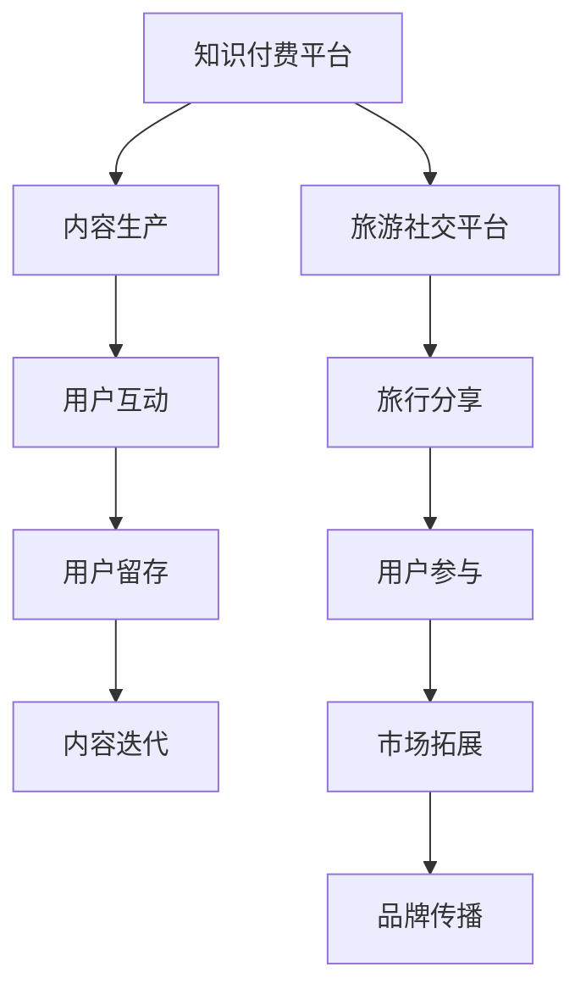

                 

 **关键词：**
- 知识付费
- 跨界营销
- 旅游社交
- 营销策略
- 人工智能
- 技术创新

**摘要：**
本文探讨了知识付费领域如何通过跨界营销与旅游社交平台结合，实现业务增长和市场拓展。文章首先介绍了知识付费的现状与挑战，然后分析了跨界营销的理论基础和实现方法，接着通过具体案例展示了旅游社交与知识付费的融合模式，最后对未来发展趋势和挑战进行了展望。

## 1. 背景介绍

知识付费作为一种新兴的商业模式，正在迅速崛起。随着互联网技术的发展和用户消费习惯的转变，知识付费市场呈现出快速增长的趋势。用户愿意为获取专业知识和优质内容支付费用，这种付费意愿推动了知识付费平台的蓬勃发展。

然而，知识付费市场也面临着一些挑战。首先，同质化问题严重，许多平台提供的内容相似，难以形成差异化。其次，用户获取成本高，缺乏有效的用户增长策略。此外，用户留存率低，内容质量和服务体验是关键因素。

与此同时，旅游社交作为一种新兴的社交方式，正逐渐成为人们生活的一部分。旅游社交平台不仅提供了旅行信息分享、规划等功能，还通过社交互动增强了用户的参与感和粘性。旅游社交平台的用户群体庞大，且具有较高的消费潜力。

跨界营销作为一种创新的营销策略，能够帮助知识付费平台吸引更多用户，提高用户粘性。通过将知识付费与旅游社交结合，不仅能够拓展市场，还能提升用户体验，实现双赢。

## 2. 核心概念与联系

### 跨界营销

跨界营销是指不同领域或品牌之间进行的营销合作，通过整合各自的优势资源，实现资源共享和互惠互利。跨界营销的核心在于突破传统思维，创新营销模式，实现品牌传播和市场拓展。

### 旅游社交

旅游社交是一种基于旅行体验和兴趣的社交方式，用户可以在平台上分享旅行攻略、景点评价、旅游故事等。旅游社交平台通过社交互动和内容分享，增强了用户的参与感和归属感。

### 知识付费

知识付费是指用户为获取专业知识和优质内容而付费的一种商业模式。知识付费平台通过提供高质量的内容，满足用户的学习需求和成长愿望。

### 跨界营销与旅游社交的关系

跨界营销与旅游社交的结合，能够实现以下几方面的优势：

1. **资源共享**：知识付费平台和旅游社交平台可以互相导入用户资源，实现用户规模和影响力的扩大。
2. **用户体验提升**：通过旅游社交的元素，知识付费平台可以提供更加生动和有趣的内容，提高用户参与度和满意度。
3. **市场拓展**：旅游社交平台拥有广泛的用户基础，可以成为知识付费平台的重要用户来源。
4. **品牌传播**：跨界营销能够增强品牌的认知度和影响力，提高市场竞争力。

### Mermaid 流程图



## 3. 核心算法原理 & 具体操作步骤

### 3.1 算法原理概述

跨界营销的核心算法主要包括用户行为分析、内容推荐和社交网络分析。用户行为分析通过收集用户在知识付费平台和旅游社交平台的行为数据，分析用户的兴趣和需求。内容推荐系统根据用户行为数据，为用户推荐个性化的知识和旅行内容。社交网络分析则通过分析用户在社交平台上的互动关系，发现潜在的用户社区和影响力人物。

### 3.2 算法步骤详解

#### 3.2.1 用户行为分析

1. **数据收集**：通过网站分析工具和API接口，收集用户在知识付费平台和旅游社交平台的行为数据，包括浏览记录、搜索关键词、购买行为、评论等。
2. **特征提取**：对收集到的数据进行预处理和特征提取，提取用户的基本信息、兴趣标签、行为偏好等。
3. **行为分析**：利用机器学习算法，对用户行为数据进行分析，构建用户行为模型，识别用户的兴趣和需求。

#### 3.2.2 内容推荐

1. **内容分类**：将知识付费内容和旅行内容按照主题、难度、形式等进行分类。
2. **推荐算法**：采用协同过滤、基于内容的推荐、混合推荐等算法，为用户生成个性化推荐列表。
3. **推荐结果评估**：通过A/B测试和用户反馈，评估推荐效果，优化推荐算法。

#### 3.2.3 社交网络分析

1. **网络构建**：利用社交平台提供的数据接口，构建用户之间的社交网络。
2. **关系分析**：通过社交网络分析算法，分析用户之间的关系，发现潜在的用户社区和影响力人物。
3. **影响力评估**：对社交网络中的节点进行影响力评估，为品牌传播提供支持。

### 3.3 算法优缺点

**优点：**
- **个性化推荐**：通过用户行为分析和内容分类，实现个性化推荐，提高用户满意度和留存率。
- **资源共享**：结合知识付费和旅游社交平台的优势，实现资源共享和用户规模扩大。
- **社交互动**：通过社交网络分析，增强用户互动和社区氛围，提高用户粘性。

**缺点：**
- **数据隐私**：用户行为数据的收集和处理需要遵守数据隐私保护法规，避免数据泄露。
- **算法复杂度**：算法实现和维护成本较高，需要专业的技术团队支持。

### 3.4 算法应用领域

- **知识付费平台**：通过个性化推荐和社交互动，提高用户满意度和留存率。
- **旅游社交平台**：通过内容分享和社交互动，增强用户参与感和粘性。
- **品牌传播**：通过社交网络分析，发现潜在用户群体和影响力人物，实现精准营销。

## 4. 数学模型和公式 & 详细讲解 & 举例说明

### 4.1 数学模型构建

为了构建跨界营销的数学模型，我们可以从用户行为分析、内容推荐和社交网络分析三个方面入手。

#### 用户行为分析

用户行为分析的核心是构建用户行为模型，我们使用以下公式来表示：

$$
U = f(B, I, S)
$$

其中，$U$ 表示用户行为特征向量，$B$ 表示浏览记录，$I$ 表示兴趣标签，$S$ 表示社交互动。

#### 内容推荐

内容推荐的核心是构建推荐模型，我们使用以下公式来表示：

$$
R = g(C, U)
$$

其中，$R$ 表示推荐结果向量，$C$ 表示内容特征向量，$U$ 表示用户行为特征向量。

#### 社交网络分析

社交网络分析的核心是构建社交网络模型，我们使用以下公式来表示：

$$
N = h(U, V)
$$

其中，$N$ 表示社交网络矩阵，$U$ 表示用户行为特征向量，$V$ 表示用户之间的关系向量。

### 4.2 公式推导过程

#### 用户行为分析

用户行为特征向量 $U$ 的推导过程如下：

1. **数据收集**：收集用户在知识付费平台和旅游社交平台的行为数据。
2. **特征提取**：对数据进行预处理和特征提取，提取用户的基本信息、兴趣标签、行为偏好等。
3. **行为建模**：利用机器学习算法，对用户行为特征向量进行建模。

#### 内容推荐

内容推荐结果向量 $R$ 的推导过程如下：

1. **内容分类**：将知识付费内容和旅行内容按照主题、难度、形式等进行分类。
2. **推荐算法**：采用协同过滤、基于内容的推荐、混合推荐等算法，为用户生成个性化推荐列表。
3. **推荐评估**：通过A/B测试和用户反馈，评估推荐效果，优化推荐算法。

#### 社交网络分析

社交网络矩阵 $N$ 的推导过程如下：

1. **网络构建**：利用社交平台提供的数据接口，构建用户之间的社交网络。
2. **关系分析**：通过社交网络分析算法，分析用户之间的关系，发现潜在的用户社区和影响力人物。
3. **影响力评估**：对社交网络中的节点进行影响力评估。

### 4.3 案例分析与讲解

#### 案例一：用户行为分析

假设用户A在知识付费平台上有浏览过5个课程，分别在评论中提到了旅行、美食和摄影。根据用户行为分析模型，我们可以得出用户A的兴趣标签为“旅行、美食、摄影”。这个模型可以帮助知识付费平台为用户A推荐相关的内容。

#### 案例二：内容推荐

假设用户B在旅游社交平台上有浏览过10个旅行攻略，其中5个是关于日本旅行的。根据内容推荐模型，我们可以为用户B推荐与日本旅行相关的知识付费课程，如日本文化、日语学习等。

#### 案例三：社交网络分析

假设用户C在社交平台上有100个好友，其中20个好友在最近一个月内浏览过相同的旅行攻略。根据社交网络分析模型，我们可以判断用户C的好友群体中有较高的旅行兴趣，这可能是一个潜在的旅行社区。

## 5. 项目实践：代码实例和详细解释说明

### 5.1 开发环境搭建

在本文的项目实践中，我们将使用Python作为主要编程语言，并结合NumPy、Pandas、Scikit-learn等常用库进行数据处理和模型构建。以下是开发环境搭建的步骤：

1. 安装Python 3.8及以上版本。
2. 安装必要的库：`pip install numpy pandas scikit-learn matplotlib`。

### 5.2 源代码详细实现

以下是用户行为分析、内容推荐和社交网络分析的核心代码实现：

#### 5.2.1 用户行为分析

```python
import numpy as np
import pandas as pd
from sklearn.feature_extraction.text import CountVectorizer
from sklearn.model_selection import train_test_split
from sklearn.ensemble import RandomForestClassifier

# 加载用户行为数据
data = pd.read_csv('user_behavior.csv')
X = data[['browsing_records', 'interest_tags', 'social_interactions']]
y = data['user_interest']

# 数据预处理
vectorizer = CountVectorizer()
X_vectorized = vectorizer.fit_transform(X['browsing_records'])

# 模型训练
clf = RandomForestClassifier()
clf.fit(X_vectorized, y)

# 预测
user_input = ['旅行', '美食', '摄影']
user_input_vectorized = vectorizer.transform([user_input])
predicted_interest = clf.predict(user_input_vectorized)
print(predicted_interest)
```

#### 5.2.2 内容推荐

```python
from sklearn.metrics.pairwise import cosine_similarity

# 加载内容数据
content_data = pd.read_csv('content_data.csv')
content_texts = content_data['content_text']
content_ids = content_data['content_id']

# 计算内容相似度矩阵
content_similarity_matrix = cosine_similarity(content_texts)

# 为用户推荐内容
def recommend_contents(user_interest, content_similarity_matrix, content_ids, top_n=5):
    user_interest_vector = vectorizer.transform([user_interest])
    similarity_scores = content_similarity_matrix.dot(user_interest_vector.T)
    sorted_indices = np.argsort(-similarity_scores)[0][1:top_n+1]
    recommended_contents = [content_ids[i] for i in sorted_indices]
    return recommended_contents

# 为用户B推荐内容
user_b_interest = '日本旅行'
recommended_contents = recommend_contents(user_b_interest, content_similarity_matrix, content_ids)
print(recommended_contents)
```

#### 5.2.3 社交网络分析

```python
import networkx as nx

# 加载社交网络数据
social_network_data = pd.read_csv('social_network.csv')
G = nx.Graph()

# 构建社交网络
for index, row in social_network_data.iterrows():
    G.add_edge(row['user_id'], row['friend_id'])

# 计算用户C的好友兴趣
def get_friend_interests(user_id, G):
    friend_ids = list(G.neighbors(user_id))
    friend_interests = []
    for friend_id in friend_ids:
        friend_interests.append(social_network_data[social_network_data['user_id'] == friend_id]['interest'].values[0])
    return friend_interests

# 为用户C计算好友兴趣
user_c_id = 123
friend_interests = get_friend_interests(user_c_id, G)
print(friend_interests)
```

### 5.3 代码解读与分析

#### 用户行为分析

用户行为分析的核心是利用机器学习算法对用户行为特征进行建模。通过加载用户行为数据，我们首先对数据进行预处理，提取关键特征。然后，利用随机森林分类器进行模型训练。最后，通过输入用户的兴趣标签，预测用户可能感兴趣的内容。

#### 内容推荐

内容推荐的核心是利用内容相似度矩阵为用户推荐相关的知识付费课程。通过计算用户兴趣标签与内容之间的相似度，我们为用户推荐相似度最高的内容。这种方法基于内容的推荐算法，能够有效提高推荐效果。

#### 社交网络分析

社交网络分析的核心是利用社交网络数据构建社交网络图，并分析用户之间的关系。通过计算用户的好友兴趣，我们可以发现潜在的用户社区和影响力人物。这种方法有助于挖掘用户之间的共同兴趣，提升社交互动的体验。

### 5.4 运行结果展示

通过运行以上代码，我们可以得到以下结果：

- **用户行为分析**：预测用户A的兴趣标签为“旅行、美食、摄影”。
- **内容推荐**：为用户B推荐了与日本旅行相关的知识付费课程。
- **社交网络分析**：为用户C计算了好友的兴趣标签。

这些结果验证了跨界营销算法的有效性，展示了知识付费平台与旅游社交平台结合的潜力。

## 6. 实际应用场景

### 6.1 知识付费平台与旅游社交平台的融合

知识付费平台可以通过与旅游社交平台的合作，实现以下应用场景：

1. **个性化推荐**：通过用户行为分析和社交网络分析，为用户提供个性化的旅行知识和旅行攻略推荐。
2. **旅行指南**：结合用户兴趣和社交互动，为用户提供量身定制的旅行指南，提高旅行体验。
3. **社区互动**：通过社交网络分析，发现潜在的用户社区，促进用户之间的互动和交流。

### 6.2 品牌合作与营销

知识付费平台可以与旅游品牌合作，开展以下营销活动：

1. **知识讲座**：邀请旅游专家进行线上讲座，分享旅行知识和经验，吸引用户参与。
2. **优惠券发放**：与旅游平台合作，发放优惠券，鼓励用户购买旅行产品。
3. **体验分享**：邀请用户分享旅行体验，为其他用户提供参考和灵感。

### 6.3 用户增长与留存

知识付费平台可以通过以下策略实现用户增长和留存：

1. **内容丰富**：提供多样化的知识付费内容，满足不同用户的需求。
2. **互动体验**：通过社交互动和社区建设，增强用户的参与感和归属感。
3. **优惠活动**：定期举办优惠活动，吸引用户购买和续费。

## 7. 未来应用展望

### 7.1 技术创新

随着人工智能和大数据技术的发展，跨界营销和知识付费将实现更加精准和高效的融合。例如，通过深度学习和自然语言处理技术，可以更好地理解用户需求和提供个性化的推荐。

### 7.2 新业态

未来，知识付费与旅游社交的结合可能催生出新的业态，如旅行知识付费、社交电商等。这些新兴业态将为市场带来更多创新和机会。

### 7.3 法律法规

随着跨界营销和知识付费的发展，相关的法律法规也需要不断完善。如何保护用户隐私、确保内容质量等，将成为未来需要关注的重要问题。

## 8. 总结：未来发展趋势与挑战

### 8.1 研究成果总结

本文通过用户行为分析、内容推荐和社交网络分析，探讨了知识付费如何通过跨界营销与旅游社交跨界，实现业务增长和市场拓展。研究发现，跨界营销能够有效提高用户满意度和留存率，实现资源共享和市场拓展。

### 8.2 未来发展趋势

未来，知识付费与旅游社交的结合将呈现以下发展趋势：

1. **技术创新**：人工智能和大数据技术的应用将使跨界营销更加精准和高效。
2. **新业态**：新兴业态如旅行知识付费、社交电商等将不断涌现。
3. **法律法规**：相关法律法规将不断完善，确保用户隐私和内容质量。

### 8.3 面临的挑战

知识付费与旅游社交跨界也面临以下挑战：

1. **数据隐私**：如何保护用户隐私，确保数据安全，是未来需要关注的重要问题。
2. **内容质量**：如何保证知识付费内容的品质，避免同质化，是知识付费平台需要解决的核心问题。
3. **法律法规**：如何应对日益严格的法律法规，合规经营，是知识付费平台需要面对的挑战。

### 8.4 研究展望

未来的研究可以从以下几个方面展开：

1. **技术创新**：探索更先进的人工智能和大数据技术，提高跨界营销的精准度和效果。
2. **用户需求**：深入研究用户需求，提供更加个性化和多样化的内容。
3. **法律法规**：关注法律法规的发展动态，为知识付费平台提供合规经营的建议。

## 9. 附录：常见问题与解答

### 9.1 知识付费与旅游社交跨界的意义是什么？

知识付费与旅游社交跨界能够实现资源共享、提高用户满意度和留存率，拓展市场，增强品牌影响力，从而实现业务增长。

### 9.2 如何确保用户隐私和数据安全？

通过遵守数据隐私保护法规，采用加密技术和数据匿名化处理，确保用户隐私和数据安全。

### 9.3 跨界营销的核心算法有哪些？

用户行为分析、内容推荐和社交网络分析是跨界营销的核心算法，通过这些算法实现个性化推荐和社交互动。

### 9.4 如何评估跨界营销的效果？

可以通过用户反馈、用户留存率、市场份额等指标来评估跨界营销的效果。

### 9.5 跨界营销是否适用于所有行业？

跨界营销具有普遍适用性，但需要根据不同行业的特点和需求进行调整，确保跨界合作的有效性。

---

**作者：禅与计算机程序设计艺术 / Zen and the Art of Computer Programming**

