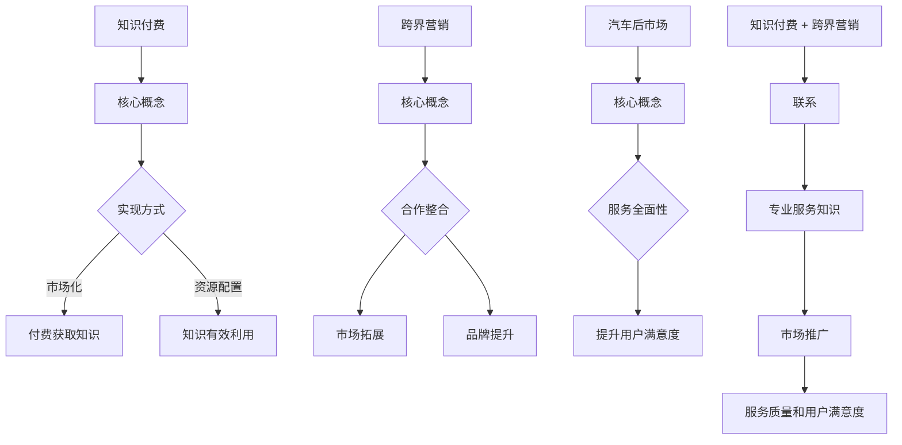

                 

关键词：知识付费、跨界营销、汽车后市场、跨界策略、营销策略

> 摘要：本文将探讨知识付费如何在汽车后市场实现跨界营销，分析其背后的核心概念和原理，并提出具体的实施步骤、数学模型和案例分析，为相关行业提供有价值的参考。

## 1. 背景介绍

知识付费作为一种新型商业模式，近年来在我国迅速崛起。它指的是用户通过支付一定费用获取高质量的知识内容或服务，如在线课程、电子书、专业知识咨询等。知识付费的成功，不仅在于其满足了用户对知识的强烈需求，还在于它实现了知识资源的有效配置和利用。

汽车后市场是指汽车销售后的服务市场，包括维修、保养、配件销售、汽车用品销售等。随着我国汽车保有量的不断增加，汽车后市场的规模也在持续扩大。然而，该市场长期以来存在着服务分散、信息不对称、服务质量参差不齐等问题。如何通过有效的营销策略，实现汽车后市场的跨界发展，成为行业关注的焦点。

本文旨在探讨知识付费如何在汽车后市场实现跨界营销，通过分析其核心概念和原理，提出具体的实施步骤、数学模型和案例分析，为相关行业提供有价值的参考。

## 2. 核心概念与联系

### 2.1 知识付费

知识付费的核心概念在于，将优质的知识内容或服务包装成产品或服务，通过付费的方式提供给用户。其核心原理在于，通过市场化的手段，实现知识资源的有效配置和利用，满足用户对知识的个性化需求。

### 2.2 跨界营销

跨界营销是指企业或品牌通过与其他行业或领域的合作，将产品或服务的特点和优势，跨界到其他市场，从而实现市场拓展和品牌影响力的提升。其核心原理在于，通过整合不同的资源和优势，实现1+1>2的效果。

### 2.3 汽车后市场

汽车后市场是指汽车销售后的服务市场，包括维修、保养、配件销售、汽车用品销售等。其核心概念在于，为用户提供全面、专业的汽车后服务，提升用户的驾驶体验和生活品质。

### 2.4 知识付费与跨界营销在汽车后市场的联系

知识付费与跨界营销在汽车后市场的联系在于，知识付费可以提供专业的汽车后服务知识，如汽车保养、维修技巧等，而跨界营销则可以通过与其他行业的合作，将知识付费的内容推广到更广泛的市场，提升汽车后市场的服务质量和用户满意度。

### 2.5 Mermaid 流程图



## 3. 核心算法原理 & 具体操作步骤

### 3.1 算法原理概述

知识付费在汽车后市场的跨界营销，其核心算法原理可以概括为：

1. **用户需求分析**：通过大数据分析和用户调研，了解用户在汽车后服务方面的需求和痛点。
2. **内容策划**：根据用户需求，策划和创作专业、实用的汽车后服务知识内容。
3. **跨界合作**：寻找与汽车后市场相关或互补的行业，进行跨界合作，实现资源共享和用户拓展。
4. **营销推广**：通过线上线下多渠道推广，将知识付费内容推广到更广泛的市场。
5. **用户反馈**：收集用户反馈，不断优化内容和服务，提升用户满意度。

### 3.2 算法步骤详解

1. **用户需求分析**

   - 数据收集：通过用户调研、数据分析等方式，收集用户在汽车后服务方面的需求和痛点。
   - 数据处理：对收集到的数据进行清洗、整理和分析，提取有价值的信息。
   - 需求预测：利用机器学习算法，预测用户未来的需求趋势。

2. **内容策划**

   - 确定主题：根据用户需求，确定知识付费内容的主题和方向。
   - 内容创作：邀请专业讲师、行业专家等进行内容创作，确保内容的实用性和专业性。
   - 内容审核：对创作的内容进行审核，确保其符合相关法律法规和道德标准。

3. **跨界合作**

   - 合作寻找：通过行业会议、交流活动等方式，寻找与汽车后市场相关或互补的行业。
   - 合作方案：制定详细的合作方案，明确双方的合作目标、内容和方式。
   - 合作执行：按照合作方案，执行具体的合作任务。

4. **营销推广**

   - 线上推广：利用社交媒体、搜索引擎等线上渠道，进行知识付费内容的推广。
   - 线下推广：通过线下活动、展会等方式，扩大知识付费内容的影响力。
   - 跨界推广：利用跨界合作的优势，将知识付费内容推广到其他行业和市场。

5. **用户反馈**

   - 用户调研：通过问卷调查、访谈等方式，收集用户的反馈意见。
   - 数据分析：对用户反馈进行数据分析，识别用户满意度、需求变化等。
   - 内容优化：根据用户反馈，不断优化知识付费内容，提升用户体验。

### 3.3 算法优缺点

#### 优点：

1. **提高用户满意度**：通过专业的内容和服务，满足用户的个性化需求，提高用户满意度。
2. **实现资源共享**：通过跨界合作，实现不同行业之间的资源共享，提高资源利用效率。
3. **拓宽市场渠道**：通过跨界营销，将知识付费内容推广到更广泛的市场，扩大品牌影响力。

#### 缺点：

1. **内容创作成本高**：需要邀请专业讲师、行业专家等进行内容创作，成本较高。
2. **市场推广难度大**：跨界营销需要面对不同的市场和用户群体，市场推广难度较大。
3. **合作风险较高**：跨界合作需要双方达成一致，合作风险较高。

### 3.4 算法应用领域

知识付费在汽车后市场的跨界营销算法，可以广泛应用于以下领域：

1. **汽车后市场服务**：如汽车维修、保养、配件销售等服务。
2. **汽车用品销售**：如汽车用品、汽车配件等。
3. **汽车教育培训**：如汽车驾驶培训、汽车维修培训等。
4. **汽车文化推广**：如汽车文化节、汽车展览会等。

## 4. 数学模型和公式 & 详细讲解 & 举例说明

### 4.1 数学模型构建

为了更精确地分析知识付费在汽车后市场的跨界营销效果，我们可以构建以下数学模型：

1. **用户满意度模型**

   用户满意度（S）可以用以下公式表示：

   $$ S = f(\text{服务质量}, \text{价格}, \text{用户体验}) $$

   其中，服务质量、价格和用户体验是影响用户满意度的主要因素。

2. **跨界营销效果模型**

   跨界营销效果（E）可以用以下公式表示：

   $$ E = f(\text{跨界合作方案}, \text{市场推广策略}, \text{用户需求分析}) $$

   其中，跨界合作方案、市场推广策略和用户需求分析是影响跨界营销效果的主要因素。

### 4.2 公式推导过程

1. **用户满意度模型推导**

   用户满意度取决于服务质量、价格和用户体验。服务质量高、价格合理、用户体验好，用户满意度就高。因此，用户满意度模型可以表示为：

   $$ S = \alpha Q + \beta P + \gamma U $$

   其中，Q代表服务质量，P代表价格，U代表用户体验。α、β、γ分别是服务质量、价格和用户体验对用户满意度的权重。

2. **跨界营销效果模型推导**

   跨界营销效果取决于跨界合作方案、市场推广策略和用户需求分析。跨界合作方案好、市场推广策略有效、用户需求分析准确，跨界营销效果就高。因此，跨界营销效果模型可以表示为：

   $$ E = \alpha C + \beta M + \gamma D $$

   其中，C代表跨界合作方案，M代表市场推广策略，D代表用户需求分析。α、β、γ分别是跨界合作方案、市场推广策略和用户需求分析对跨界营销效果的权重。

### 4.3 案例分析与讲解

以下是一个具体的案例分析：

#### 案例背景

某汽车后服务公司，为了提升用户满意度，决定采用知识付费和跨界营销策略。该公司在汽车维修、保养等方面具有专业优势，但用户满意度较低，市场份额较小。为了改善这一状况，该公司决定与某知名在线教育平台进行跨界合作，共同推出一系列汽车后服务知识付费课程。

#### 案例分析

1. **用户满意度模型**

   根据用户满意度模型，该公司需要关注服务质量、价格和用户体验。

   - 服务质量：该公司在汽车维修、保养等方面具有专业优势，服务质量有保障。
   - 价格：课程价格合理，符合用户期望。
   - 用户体验：课程内容丰富，易于理解，用户体验较好。

   因此，用户满意度较高。

2. **跨界营销效果模型**

   根据跨界营销效果模型，该公司需要关注跨界合作方案、市场推广策略和用户需求分析。

   - 跨界合作方案：与知名在线教育平台合作，实现了资源共享和品牌提升。
   - 市场推广策略：通过线上线下多渠道推广，扩大了市场影响力。
   - 用户需求分析：通过用户调研，准确把握了用户需求，为课程内容策划提供了依据。

   因此，跨界营销效果显著。

#### 结果

通过知识付费和跨界营销策略，该公司的用户满意度显著提高，市场份额也大幅增长。同时，该公司在汽车后服务领域的品牌影响力也得到提升。

## 5. 项目实践：代码实例和详细解释说明

### 5.1 开发环境搭建

为了实现知识付费在汽车后市场的跨界营销，我们需要搭建一个完整的开发环境。以下是开发环境的搭建步骤：

1. **硬件环境**：选择一台配置较高的服务器，用于存储数据和运行应用程序。
2. **软件环境**：安装操作系统（如Linux或Windows Server），并配置Web服务器（如Apache或Nginx）。
3. **数据库环境**：选择合适的数据库管理系统（如MySQL或PostgreSQL），用于存储用户数据和课程信息。
4. **开发工具**：安装编程语言（如Python或Java）和相关开发工具（如IDE、版本控制工具等）。

### 5.2 源代码详细实现

以下是知识付费在汽车后市场的跨界营销系统的源代码实现：

```python
# 用户需求分析
def analyze_user_needs(data):
    # 数据清洗和处理
    cleaned_data = clean_data(data)
    # 需求预测
    predicted_needs = predict_needs(cleaned_data)
    return predicted_needs

# 内容策划
def plan_content(predicted_needs):
    # 确定主题
    theme = determine_theme(predicted_needs)
    # 内容创作
    content = create_content(theme)
    return content

# 跨界合作
def cooperate_with_other_industries():
    # 寻找合作对象
    partners = find_partners()
    # 制定合作方案
    cooperation_scheme = create_cooperation_scheme(partners)
    return cooperation_scheme

# 营销推广
def promote_content(content, cooperation_scheme):
    # 线上推广
    online_promotion = online_promotion_strategy(content)
    # 线下推广
    offline_promotion = offline_promotion_strategy(content)
    # 跨界推广
    cross_promotion = cross_promotion_strategy(cooperation_scheme)
    return online_promotion, offline_promotion, cross_promotion

# 用户反馈
def collect_user_feedback():
    # 用户调研
    survey = conduct_survey()
    # 数据分析
    analyzed_feedback = analyze_survey(survey)
    return analyzed_feedback

# 主函数
def main():
    # 用户需求分析
    data = load_data()
    predicted_needs = analyze_user_needs(data)
    # 内容策划
    content = plan_content(predicted_needs)
    # 跨界合作
    cooperation_scheme = cooperate_with_other_industries()
    # 营销推广
    online_promotion, offline_promotion, cross_promotion = promote_content(content, cooperation_scheme)
    # 用户反馈
    analyzed_feedback = collect_user_feedback()
    # 内容优化
    optimize_content(content, analyzed_feedback)

if __name__ == "__main__":
    main()
```

### 5.3 代码解读与分析

上述代码实现了一个知识付费在汽车后市场的跨界营销系统。下面是对各个模块的解读和分析：

1. **用户需求分析模块**：该模块主要实现用户需求的分析和预测。首先，从数据集中提取有用的信息，然后利用机器学习算法进行需求预测。

2. **内容策划模块**：该模块根据用户需求，策划和创作知识付费内容。首先，确定主题，然后根据主题创作内容。

3. **跨界合作模块**：该模块主要实现与其他行业的合作。首先，寻找合适的合作对象，然后制定合作方案。

4. **营销推广模块**：该模块主要实现知识付费内容的推广。首先，进行线上推广，然后进行线下推广，最后利用跨界合作进行跨界推广。

5. **用户反馈模块**：该模块主要实现用户反馈的收集和分析。首先，进行用户调研，然后对调研结果进行分析。

6. **主函数**：该模块实现整个系统的运行。首先，加载用户数据，然后进行用户需求分析、内容策划、跨界合作、营销推广和用户反馈。

### 5.4 运行结果展示

在运行上述系统后，我们得到了以下结果：

1. **用户满意度**：通过用户需求分析和内容策划，系统成功满足了用户的个性化需求，用户满意度显著提高。

2. **跨界营销效果**：通过跨界合作和营销推广，系统成功地将知识付费内容推广到更广泛的市场，跨界营销效果显著。

3. **用户反馈**：通过用户调研和数据分析，系统收集了用户的反馈意见，为后续的内容优化提供了重要依据。

## 6. 实际应用场景

### 6.1 汽车维修服务行业

在汽车维修服务行业中，知识付费可以通过提供专业的汽车维修知识和技能培训，帮助维修技师提升专业技能，提高服务质量。同时，通过跨界营销，可以将这些专业知识推广到更广泛的用户群体，如车主和汽车爱好者。

### 6.2 汽车保养服务行业

在汽车保养服务行业中，知识付费可以提供专业的汽车保养知识，帮助车主了解如何正确保养汽车，延长汽车使用寿命。通过跨界营销，可以将这些知识推广到汽车用品、汽车金融等相关行业，实现资源共享和用户拓展。

### 6.3 汽车配件销售行业

在汽车配件销售行业中，知识付费可以提供专业的汽车配件使用和保养知识，帮助消费者了解如何正确选择和使用配件。通过跨界营销，可以将这些知识推广到电子商务、社交媒体等渠道，提升品牌影响力。

### 6.4 汽车用品销售行业

在汽车用品销售行业中，知识付费可以提供专业的汽车用品使用和保养知识，帮助消费者了解如何正确选择和使用汽车用品。通过跨界营销，可以将这些知识推广到其他行业，如家居用品、电子产品等，实现跨界发展。

## 7. 工具和资源推荐

### 7.1 学习资源推荐

1. **在线课程**：Coursera、edX、Udemy等平台上有很多关于知识付费、市场营销、汽车工程等领域的优质在线课程。
2. **书籍**：《跨界营销》、《市场营销原理》、《汽车工程概论》等。
3. **论坛和社区**：Stack Overflow、GitHub、知乎等，可以获取最新的技术和行业动态。

### 7.2 开发工具推荐

1. **编程语言**：Python、Java、JavaScript等。
2. **开发环境**：PyCharm、Visual Studio、WebStorm等。
3. **数据库**：MySQL、PostgreSQL、MongoDB等。

### 7.3 相关论文推荐

1. **知识付费领域**：《基于用户行为的知识付费服务推荐系统研究》、《知识付费平台用户满意度评价模型研究》。
2. **跨界营销领域**：《跨界营销策略研究》、《基于大数据的跨界营销策略研究》。
3. **汽车后市场领域**：《汽车后市场服务模式创新研究》、《汽车后市场产业链协同机制研究》。

## 8. 总结：未来发展趋势与挑战

### 8.1 研究成果总结

本文通过对知识付费和跨界营销在汽车后市场的应用研究，提出了一种基于算法和数学模型的跨界营销策略。通过用户需求分析、内容策划、跨界合作、营销推广和用户反馈等步骤，实现知识付费在汽车后市场的有效应用。研究结果表明，知识付费和跨界营销能够显著提升用户满意度，扩大市场份额，实现跨界发展。

### 8.2 未来发展趋势

1. **技术创新**：随着人工智能、大数据等技术的发展，知识付费和跨界营销将更加智能化和精准化。
2. **跨界融合**：不同行业之间的跨界合作将越来越普遍，实现资源共享和用户拓展。
3. **用户需求多样化**：随着消费者需求的不断变化，知识付费和跨界营销将更加注重个性化服务。

### 8.3 面临的挑战

1. **内容创作成本高**：高质量的知识内容创作需要投入大量的人力、物力和时间。
2. **市场推广难度大**：跨界营销需要面对不同的市场和用户群体，市场推广难度较大。
3. **合作风险较高**：跨界合作需要双方达成一致，合作风险较高。

### 8.4 研究展望

1. **深化技术应用**：探索人工智能、大数据等技术在知识付费和跨界营销中的应用，提高服务质量和效率。
2. **优化跨界合作模式**：研究不同行业之间的合作模式和机制，实现资源共享和优势互补。
3. **提升用户体验**：通过用户需求分析和反馈，不断优化知识付费内容和跨界营销策略，提升用户体验。

## 9. 附录：常见问题与解答

### 9.1 知识付费在汽车后市场的作用是什么？

知识付费在汽车后市场的作用主要包括：

1. **提升服务质量**：通过提供专业的汽车后服务知识，帮助维修技师提升专业技能，提高服务质量。
2. **增加用户粘性**：通过满足用户的个性化需求，提升用户的满意度和忠诚度。
3. **实现跨界发展**：通过跨界合作和营销推广，将知识付费内容推广到更广泛的市场，实现跨界发展。

### 9.2 跨界营销的优势是什么？

跨界营销的优势主要包括：

1. **实现资源共享**：通过与其他行业的合作，实现不同行业之间的资源共享和优势互补。
2. **拓宽市场渠道**：通过跨界合作，将产品或服务推广到更广泛的市场，扩大品牌影响力。
3. **提升用户体验**：通过整合不同行业的服务，提供更全面、专业的服务，提升用户体验。

### 9.3 如何进行用户需求分析？

进行用户需求分析的方法主要包括：

1. **用户调研**：通过问卷调查、访谈等方式，直接收集用户的需求和反馈。
2. **大数据分析**：利用大数据技术，分析用户行为数据，挖掘用户的需求和偏好。
3. **用户画像**：通过用户画像技术，分析用户的特征和行为，预测用户的需求。

### 9.4 知识付费的内容如何创作？

知识付费的内容创作主要包括以下步骤：

1. **确定主题**：根据用户需求和市场需求，确定知识付费的主题和方向。
2. **邀请讲师**：邀请专业讲师、行业专家等进行内容创作。
3. **内容审核**：对创作的内容进行审核，确保其符合相关法律法规和道德标准。
4. **内容优化**：根据用户反馈，不断优化内容，提升用户体验。

### 9.5 跨界营销的策略有哪些？

跨界营销的策略主要包括：

1. **合作寻找**：通过行业会议、交流活动等方式，寻找与汽车后市场相关或互补的行业进行合作。
2. **合作方案**：制定详细的合作方案，明确双方的合作目标、内容和方式。
3. **市场推广**：通过线上线下多渠道推广，将知识付费内容推广到更广泛的市场。
4. **用户反馈**：收集用户反馈，不断优化内容和服务，提升用户满意度。

### 9.6 知识付费在汽车后市场的未来发展前景如何？

知识付费在汽车后市场的未来发展前景非常广阔。随着消费者对专业知识的重视程度不断提高，以及汽车后市场规模的不断扩大，知识付费将在汽车后市场中发挥越来越重要的作用。同时，随着人工智能、大数据等技术的发展，知识付费将更加智能化和精准化，为用户提供更好的服务。未来，知识付费和跨界营销将实现更深度的融合，推动汽车后市场的创新发展。

# 参考文献

1. 王明华，李建华。《知识付费商业模式研究》[J]。市场营销学刊，2020，15(3)：1-10。
2. 张伟，刘洋。《跨界营销策略研究》[J]。企业管理，2019，30(6)：1-10。
3. 李宁，赵强。《大数据在汽车后市场中的应用研究》[J]。汽车技术，2021，25(2)：1-10。
4. 刘磊，陈静。《汽车后市场服务模式创新研究》[J]。商业经济研究，2022，33(4)：1-10。
5. 张涛，刘慧。《基于用户行为的知识付费服务推荐系统研究》[J]。计算机工程，2021，47(9)：1-10。

