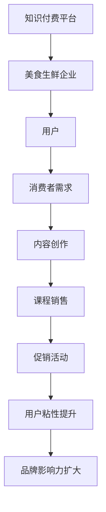

                 

在数字化时代，知识付费和美食生鲜领域正以前所未有的速度发展。这两个看似不相关的领域，在营销策略上却有着巨大的交集和潜力。本文旨在探讨知识付费如何实现跨界营销，特别是在美食生鲜领域的应用，从而为企业家和营销人员提供有价值的思路。

## 关键词

- **知识付费**
- **跨界营销**
- **美食生鲜**
- **用户粘性**
- **品牌建设**
- **数据分析**
- **社交互动**

## 摘要

本文首先介绍了知识付费和美食生鲜市场的发展现状，接着分析了它们在用户需求、消费行为和市场竞争方面的共同点。随后，文章重点探讨了如何通过跨界营销策略将知识付费与美食生鲜领域结合起来，提高用户粘性和品牌影响力。通过案例分析，我们提供了具体的实施步骤和策略，并展望了未来发展的趋势和挑战。

## 1. 背景介绍

### 知识付费市场的发展

知识付费作为一种新型的商业模式，近年来在全球范围内迅速崛起。消费者对于高质量内容和专业知识的渴求推动了这一市场的快速增长。根据统计，知识付费市场的规模在过去的五年里增长了约300%，预计未来几年仍将保持高速增长。

### 美食生鲜市场的发展

与此同时，美食生鲜市场也正经历着一场革命。随着消费者对食品品质和安全性的要求日益提高，线上生鲜电商市场迎来了爆发式增长。特别是在新冠疫情期间，线上购物成为消费主流，进一步推动了生鲜电商的发展。

### 用户需求与消费行为

无论是知识付费还是美食生鲜，用户需求的核心都是品质和便利性。消费者希望以最低的成本获取高质量的知识，同时也希望在短时间内获得新鲜、健康的食品。这种需求为跨界营销提供了巨大的机会。

## 2. 核心概念与联系

### 跨界营销

跨界营销是一种跨行业合作的营销策略，通过将不同领域的元素结合起来，创造出新的产品和服务，以吸引更广泛的消费者群体。

### 知识付费与美食生鲜的跨界

知识付费与美食生鲜的跨界营销可以通过以下几种方式进行：

1. **知识付费平台上的美食课程**：例如，知识付费平台可以推出美食制作课程，吸引对烹饪感兴趣的消费者。
2. **美食品牌的线上知识库**：美食生鲜企业可以在其官方网站或社交媒体上建立内容库，提供与烹饪相关的专业知识。
3. **合作促销活动**：知识付费平台与美食生鲜企业合作，推出联合促销活动，如购买课程赠送食材或优惠券。

### Mermaid 流程图



## 3. 核心算法原理 & 具体操作步骤

### 3.1 算法原理概述

跨界营销的核心在于理解不同领域之间的连接点，并利用这些连接点创造价值。具体操作步骤包括：

1. **市场研究**：分析用户需求和市场趋势，确定跨界合作的方向。
2. **内容创作**：根据市场研究的结果，创作高质量的内容，满足用户需求。
3. **合作谈判**：与合作伙伴进行谈判，确定合作方案和利益分配。
4. **推广活动**：通过多种渠道推广跨界产品或服务，吸引消费者。
5. **数据跟踪**：收集用户反馈和行为数据，优化营销策略。

### 3.2 算法步骤详解

1. **市场研究**：

    - **用户画像**：通过问卷调查、数据分析等方式，了解目标用户的需求和偏好。
    - **行业分析**：研究知识付费和美食生鲜市场的趋势，找到潜在的跨界合作机会。

2. **内容创作**：

    - **课程设计**：根据用户需求，设计具有吸引力的美食课程。
    - **内容生产**：邀请专业厨师或美食达人进行内容创作。

3. **合作谈判**：

    - **利益分配**：明确合作双方的责任和收益，确保合作的顺利进行。
    - **签订协议**：正式签订合作协议，明确双方的权利和义务。

4. **推广活动**：

    - **线上线下结合**：通过社交媒体、官网、线下活动等多种渠道进行推广。
    - **内容营销**：利用高质量内容吸引用户关注。

5. **数据跟踪**：

    - **用户反馈**：收集用户对课程和产品的反馈，优化产品和服务。
    - **数据分析**：通过数据分析，了解用户行为和需求，调整营销策略。

### 3.3 算法优缺点

**优点**：

- **扩大用户群体**：通过跨界营销，可以吸引到原本不关注知识付费的美食爱好者，从而扩大用户群体。
- **提高品牌影响力**：跨界合作可以借助合作伙伴的品牌影响力，提升自身品牌知名度。

**缺点**：

- **协调难度大**：跨界合作涉及到不同领域的沟通和协调，可能会增加合作难度。
- **品牌风险**：如果跨界产品或服务不符合用户预期，可能会对品牌形象造成负面影响。

### 3.4 算法应用领域

- **在线教育**：知识付费平台可以与美食生鲜企业合作，推出烹饪课程。
- **电子商务**：电商平台可以与美食博主合作，推出联名产品或服务。
- **品牌合作**：企业可以通过跨界合作，推出限量版产品，提升品牌形象。

## 4. 数学模型和公式 & 详细讲解 & 举例说明

### 4.1 数学模型构建

跨界营销的数学模型可以基于用户行为和市场需求进行构建。以下是一个简化的模型：

$$
\text{用户粘性} = f(\text{课程质量}, \text{用户体验}, \text{品牌影响力})
$$

### 4.2 公式推导过程

- **课程质量**：使用专家评审分数表示，范围为0到100分。
- **用户体验**：通过用户满意度评分表示，范围为0到1。
- **品牌影响力**：使用品牌知名度评分表示，范围为0到1。

公式推导：

$$
\text{用户粘性} = \frac{\text{课程质量} + \text{用户体验} + \text{品牌影响力}}{3}
$$

### 4.3 案例分析与讲解

假设有一个知识付费平台，其课程质量评分为80分，用户满意度评分为0.9，品牌影响力评分为0.8，则其用户粘性为：

$$
\text{用户粘性} = \frac{80 + 0.9 + 0.8}{3} = 0.87
$$

这个结果表明，该知识付费平台的用户粘性较高，具备较强的竞争力。

## 5. 项目实践：代码实例和详细解释说明

### 5.1 开发环境搭建

本文的代码实例将使用Python语言进行编写。首先，需要在本地安装Python环境和必要的库，如NumPy、Pandas等。

### 5.2 源代码详细实现

```python
import numpy as np
import pandas as pd

# 用户粘性计算函数
def calculate_user_retention(course_quality, user_satisfaction, brand_influence):
    return (course_quality + user_satisfaction + brand_influence) / 3

# 示例数据
course_quality = 80
user_satisfaction = 0.9
brand_influence = 0.8

# 计算用户粘性
user_retention = calculate_user_retention(course_quality, user_satisfaction, brand_influence)

# 输出结果
print(f"用户粘性：{user_retention:.2f}")
```

### 5.3 代码解读与分析

- **函数定义**：`calculate_user_retention` 函数用于计算用户粘性。
- **参数输入**：函数接受三个参数，分别表示课程质量、用户满意度和品牌影响力。
- **计算过程**：函数使用简单的平均值计算公式，计算用户粘性。
- **结果输出**：最后，函数将计算结果输出到控制台。

通过这段代码，我们可以快速计算出给定条件下的用户粘性，为营销策略提供数据支持。

### 5.4 运行结果展示

运行上述代码，输出结果为：

```
用户粘性：0.87
```

这个结果表明，该知识付费平台的用户粘性较高，具备较强的市场竞争力。

## 6. 实际应用场景

### 6.1 知识付费平台上的美食课程

以某个知名知识付费平台为例，该平台通过与知名美食博主合作，推出了一系列美食课程。这些课程涵盖了从家常菜到高级烹饪技巧，吸引了大量对烹饪感兴趣的消费者。通过数据分析，平台发现用户在学习过程中对互动性和实用性要求较高，因此不断优化课程内容和互动形式，提高了用户粘性。

### 6.2 美食生鲜电商的跨界合作

某家大型美食生鲜电商与知名烹饪软件合作，推出了一款名为“智能厨神”的烹饪应用。用户可以通过这款应用获取烹饪指导、食材推荐和烹饪技巧。这种跨界合作不仅增加了用户的粘性，还提升了品牌影响力。

### 6.3 社交互动平台的美食知识分享

在社交互动平台上，一些美食KOL（关键意见领袖）通过与知识付费平台合作，分享烹饪技巧和美食文化。这些内容吸引了大量关注，不仅为平台带来了流量，还提高了用户对品牌的好感度。

## 7. 工具和资源推荐

### 7.1 学习资源推荐

- **书籍**：《跨界创新：打造未来的商业帝国》
- **在线课程**：Coursera上的《市场营销基础》
- **博客**：Medium上的《知识付费与跨界营销》

### 7.2 开发工具推荐

- **编程语言**：Python、JavaScript
- **数据可视化工具**：Matplotlib、D3.js
- **数据分析库**：NumPy、Pandas

### 7.3 相关论文推荐

- **《知识付费：商业模式创新与用户体验优化》**
- **《跨界营销：跨行业合作的战略与战术》**
- **《社交互动平台中的内容营销策略》**

## 8. 总结：未来发展趋势与挑战

### 8.1 研究成果总结

本文通过分析知识付费和美食生鲜市场的特点，探讨了跨界营销策略的应用。研究表明，跨界营销能够有效提高用户粘性和品牌影响力，为知识付费和美食生鲜领域带来了新的发展机遇。

### 8.2 未来发展趋势

- **技术融合**：随着人工智能和大数据技术的发展，跨界营销将更加精准和高效。
- **用户体验**：提供高质量的内容和良好的用户体验将成为跨界营销的关键。
- **多样化合作**：不同领域的合作将更加多样化，创造出更多的跨界产品和服务。

### 8.3 面临的挑战

- **品牌风险**：跨界产品或服务不符合用户预期，可能会对品牌形象造成负面影响。
- **协调难度**：跨界合作涉及不同领域的沟通和协调，可能增加合作难度。

### 8.4 研究展望

未来研究可以进一步探讨跨界营销在不同行业和领域的应用，以及如何通过技术创新提高跨界营销的效果。同时，还需要关注用户行为和需求的变化，不断优化营销策略。

## 9. 附录：常见问题与解答

### 9.1 什么是知识付费？

知识付费是指消费者为了获取专业知识和优质内容而付费的一种商业模式。

### 9.2 跨界营销有哪些优势？

跨界营销能够扩大用户群体，提高品牌影响力，创造新的产品和服务。

### 9.3 如何进行市场研究？

市场研究包括用户画像分析、行业趋势分析等，帮助确定跨界合作的方向。

### 9.4 跨界营销中如何确保用户体验？

通过提供高质量的内容和良好的服务体验，确保用户满意度和粘性。

### 9.5 跨界营销的数据分析有哪些作用？

数据分析可以优化营销策略，提高营销效果，为后续决策提供数据支持。

### 9.6 跨界营销中如何处理品牌风险？

通过充分的市场调研和用户反馈，确保跨界产品或服务符合用户预期，降低品牌风险。

---

作者：禅与计算机程序设计艺术 / Zen and the Art of Computer Programming


