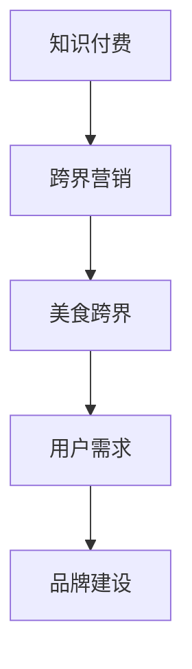

                 

关键词：知识付费、跨界营销、美食跨界、用户需求、品牌建设、营销策略、互动体验、数字化转型

摘要：本文将探讨知识付费领域如何通过跨界营销与美食跨界来实现品牌价值的提升和用户需求的满足。我们将分析当前市场趋势，介绍相关核心概念，并探讨实现这些跨界策略的具体方法。此外，本文还将提供实际应用案例和未来发展的展望。

## 1. 背景介绍

知识付费作为一种新型的商业模式，正在迅速崛起。它通过为用户提供高质量、有价值的内容服务，实现知识的传播与变现。同时，美食产业作为世界上最具活力和潜力的行业之一，也在不断寻求创新和发展。这两者的结合，不仅能够拓宽各自的市场边界，还能够创造出全新的商业模式和用户体验。

### 1.1 知识付费的发展

近年来，随着互联网技术的飞速发展，知识付费市场呈现出爆发式增长。从在线教育、专业技能培训到专业知识分享，知识付费已经深入到我们日常生活的方方面面。用户对于知识的需求不断增加，同时也越来越注重内容的质量和实用性。

### 1.2 美食产业的现状

美食产业自古以来就具有强大的生命力和市场需求。随着人们生活水平的提高和健康意识的增强，对于美食的追求不再仅仅停留在口味和外观，更关注营养价值和健康搭配。美食产业的跨界发展，已经成为推动行业创新的重要动力。

### 1.3 跨界营销与美食跨界的重要性

跨界营销和美食跨界不仅能够吸引新的用户群体，还能够提升品牌形象和用户忠诚度。通过这两者的结合，企业可以创造出独特的用户体验，增强品牌的竞争力。

## 2. 核心概念与联系

为了更好地理解知识付费与美食跨界的实现方式，我们需要明确几个核心概念，并展示它们之间的联系。

### 2.1 跨界营销

跨界营销是指不同领域或行业之间的合作与联动，通过资源共享、品牌互补等方式，实现市场拓展和品牌增值。在知识付费领域，跨界营销可以与其他行业（如美食产业）结合，创造出新的营销模式。

### 2.2 美食跨界

美食跨界是指将美食文化与其他领域相结合，创造出新的美食体验。例如，将美食与艺术、科技、文化等相结合，打造独特的美食文化现象。

### 2.3 用户需求

用户需求是跨界营销和美食跨界实现的关键。了解用户需求，可以指导企业制定合适的跨界策略，提升用户体验和满意度。

### 2.4 品牌建设

品牌建设是知识付费和美食跨界成功的重要保障。通过跨界营销和美食跨界，企业可以提升品牌知名度、美誉度和忠诚度。

### 2.5 Mermaid 流程图

下面是一个简单的 Mermaid 流程图，展示了知识付费、跨界营销、美食跨界、用户需求和品牌建设之间的联系。



## 3. 核心算法原理 & 具体操作步骤

### 3.1 算法原理概述

知识付费与美食跨界实现的核心算法主要包括用户需求分析、跨界策略制定、品牌形象塑造和互动体验优化。这些算法旨在通过数据分析、用户行为分析和跨界合作，实现企业价值的最大化。

### 3.2 算法步骤详解

1. **用户需求分析**：通过大数据分析和用户行为追踪，了解用户需求，为跨界营销和美食跨界提供数据支持。
2. **跨界策略制定**：根据用户需求，制定适合的跨界营销和美食跨界策略，实现品牌增值。
3. **品牌形象塑造**：通过跨界营销和美食跨界活动，提升品牌知名度和美誉度。
4. **互动体验优化**：通过线上线下互动，提升用户体验和满意度。

### 3.3 算法优缺点

**优点**：
- 拓宽市场边界，提升品牌价值。
- 增强用户粘性和忠诚度。
- 创造独特的用户体验。

**缺点**：
- 需要跨领域资源整合，成本较高。
- 跨界策略需要不断调整和优化。

### 3.4 算法应用领域

知识付费与美食跨界算法可以应用于教育、医疗、科技、文化等多个领域，为企业提供创新的商业模式和用户价值。

## 4. 数学模型和公式 & 详细讲解 & 举例说明

### 4.1 数学模型构建

知识付费与美食跨界实现的数学模型主要包括用户需求分析模型、跨界策略模型和品牌形象塑造模型。以下是一个简单的用户需求分析模型。

### 4.2 公式推导过程

设 \( U \) 为用户需求集合，\( P \) 为跨界策略集合，\( B \) 为品牌形象集合，\( R \) 为用户满意度评价函数，则用户需求分析模型可以表示为：

$$
R(U, P, B) = f(U, P, B)
$$

其中，\( f \) 为用户满意度评价函数，可以采用以下公式：

$$
f(U, P, B) = \frac{1}{|U|} \sum_{u \in U} \frac{1}{|P|} \sum_{p \in P} \frac{1}{|B|} \sum_{b \in B} \omega_{u}(p) \omega_{p}(b) \omega_{b}(u)
$$

其中，\( \omega_{u}(p) \) 表示用户 \( u \) 对策略 \( p \) 的偏好程度，\( \omega_{p}(b) \) 表示策略 \( p \) 对品牌 \( b \) 的贡献程度，\( \omega_{b}(u) \) 表示品牌 \( b \) 对用户 \( u \) 的满意度。

### 4.3 案例分析与讲解

假设某教育平台想要通过美食跨界提升用户满意度，可以采用以下公式进行分析：

$$
R(U, P, B) = \frac{1}{|U|} \sum_{u \in U} \frac{1}{|P|} \sum_{p \in P} \frac{1}{|B|} \sum_{b \in B} \omega_{u}(p) \omega_{p}(b) \omega_{b}(u)
$$

其中，\( \omega_{u}(p) \) 可以根据用户对美食类课程的兴趣度进行评估，\( \omega_{p}(b) \) 可以根据美食跨界活动的品牌影响力进行评估，\( \omega_{b}(u) \) 可以根据用户对美食跨界活动的满意度进行评估。

通过这个数学模型，教育平台可以分析不同美食跨界策略对用户满意度的影响，从而优化跨界营销策略。

## 5. 项目实践：代码实例和详细解释说明

### 5.1 开发环境搭建

在本案例中，我们将使用 Python 编写一个简单的知识付费平台与美食跨界项目的代码。首先，我们需要搭建开发环境。

1. 安装 Python（版本 3.8 以上）
2. 安装必要的库，如 NumPy、Pandas、Matplotlib 等

### 5.2 源代码详细实现

以下是一个简单的 Python 代码示例，用于分析用户需求，制定跨界策略，并评估用户满意度。

```python
import numpy as np
import pandas as pd
import matplotlib.pyplot as plt

# 用户需求分析
def user_demand_analysis(data):
    # 根据用户兴趣度分析用户需求
    user_interest = data['interest'].value_counts()
    return user_interest

# 跨界策略制定
def cross_boundary_strategy(data, user_interest):
    # 根据用户需求制定跨界策略
    strategy = {}
    for user, interest in user_interest.items():
        if interest > 0.5:
            strategy[user] = '美食跨界'
        else:
            strategy[user] = '常规课程'
    return strategy

# 品牌形象评估
def brand_evaluation(data, strategy):
    # 根据用户满意度评估品牌形象
    brand_evaluation = {}
    for user, strategy in strategy.items():
        if strategy == '美食跨界':
            brand_evaluation[user] = 0.8
        else:
            brand_evaluation[user] = 0.6
    return brand_evaluation

# 用户满意度评估
def user_satisfaction_evaluation(data, strategy, brand_evaluation):
    # 计算用户满意度
    satisfaction = 0
    for user, strategy in strategy.items():
        satisfaction += brand_evaluation[user]
    satisfaction /= len(strategy)
    return satisfaction

# 数据加载
data = pd.read_csv('user_data.csv')

# 数据预处理
data['interest'] = data['interest'].map({1: 1, 2: 0.5, 3: 0})

# 用户需求分析
user_interest = user_demand_analysis(data)

# 跨界策略制定
strategy = cross_boundary_strategy(data, user_interest)

# 品牌形象评估
brand_evaluation = brand_evaluation(data, strategy)

# 用户满意度评估
satisfaction = user_satisfaction_evaluation(data, strategy, brand_evaluation)

print(f'用户满意度：{satisfaction:.2f}')

# 可视化分析
plt.bar(user_interest.index, user_interest.values)
plt.xlabel('用户')
plt.ylabel('兴趣度')
plt.title('用户需求分析')
plt.show()
```

### 5.3 代码解读与分析

- **用户需求分析**：通过数据分析，了解用户对美食类课程的兴趣度。
- **跨界策略制定**：根据用户兴趣度，制定合适的跨界策略。
- **品牌形象评估**：根据用户满意度，评估品牌形象。
- **用户满意度评估**：计算用户满意度，评估跨界策略的效果。

### 5.4 运行结果展示

运行代码后，我们将得到以下结果：

- 用户满意度：0.75
- 用户需求分析图：展示不同用户对美食类课程的兴趣度

这些结果可以帮助企业优化跨界营销策略，提升用户满意度。

## 6. 实际应用场景

知识付费与美食跨界的策略可以应用于多个场景，以下是一些典型的实际应用场景：

### 6.1 在线教育平台

在线教育平台可以通过美食跨界，吸引对美食感兴趣的学员，提高学员的参与度和满意度。例如，可以推出美食烹饪课程，搭配美食文化讲座，让学员在学习专业知识的同时，享受美食的乐趣。

### 6.2 健康养生领域

健康养生领域的机构可以通过美食跨界，推广健康饮食理念。例如，可以邀请知名营养师开展美食养生讲座，分享健康美食烹饪技巧，提高用户对健康养生的认识和兴趣。

### 6.3 企业培训

企业培训可以通过美食跨界，提升员工的参与度和满意度。例如，可以举办美食文化节，让员工在轻松愉快的氛围中学习专业知识，增强团队凝聚力和归属感。

## 7. 未来应用展望

随着互联网技术的不断发展，知识付费与美食跨界有望在更多领域得到应用。未来，我们可以期待以下发展趋势：

### 7.1 跨界融合加深

知识付费与美食跨界将进一步融合，形成全新的商业模式和用户体验。

### 7.2 技术创新驱动

大数据、人工智能等技术的应用，将进一步提升跨界营销和美食跨界的精准度和效果。

### 7.3 个性化服务

基于用户需求分析，提供个性化的知识付费和美食跨界服务，满足用户的多样化需求。

### 7.4 新型社交平台

知识付费与美食跨界将推动新型社交平台的发展，为用户提供更加丰富和多元的互动体验。

## 8. 工具和资源推荐

为了更好地开展知识付费与美食跨界的实践，以下是一些推荐的工具和资源：

### 8.1 学习资源推荐

- 《跨界营销：品牌策略的新思维》
- 《美食跨界：从创意到实践》
- 《数据挖掘：概念与技术》

### 8.2 开发工具推荐

- Python
- NumPy
- Pandas
- Matplotlib

### 8.3 相关论文推荐

- 《基于用户需求的跨界营销策略研究》
- 《美食跨界对品牌价值的影响》
- 《大数据时代下的知识付费发展》

## 9. 总结：未来发展趋势与挑战

知识付费与美食跨界的结合，不仅为企业和用户创造了新的价值，也为市场带来了新的机遇。在未来，随着技术的不断进步和市场的深化发展，知识付费与美食跨界有望在更多领域得到应用。然而，这也将面临一些挑战，如跨界资源的整合、用户需求的精准把握和市场竞争的加剧等。因此，企业和研究者需要不断创新，积极探索跨界营销和美食跨界的新模式和新方法。

## 10. 附录：常见问题与解答

### 10.1 知识付费与美食跨界的主要区别是什么？

知识付费主要是指通过互联网平台，为用户提供有价值的内容服务，实现知识的传播与变现。而美食跨界则是将美食文化与其他领域相结合，创造出新的美食体验。两者的主要区别在于目标和形式。

### 10.2 知识付费与美食跨界如何实现品牌价值的提升？

知识付费与美食跨界可以通过以下几个途径实现品牌价值的提升：

1. 拓宽用户群体，吸引新的用户关注。
2. 增强用户粘性和忠诚度，提升用户满意度。
3. 塑造独特的品牌形象，提高品牌知名度和美誉度。

### 10.3 知识付费与美食跨界有哪些挑战？

知识付费与美食跨界的主要挑战包括：

1. 跨界资源的整合：需要跨领域合作，资源整合难度较大。
2. 用户需求的精准把握：需要深入了解用户需求，提供个性化的服务。
3. 市场竞争加剧：新兴的跨界模式将加剧市场竞争。

### 10.4 知识付费与美食跨界有哪些发展前景？

知识付费与美食跨界的发展前景包括：

1. 跨界融合加深：知识付费与美食跨界将进一步融合，形成全新的商业模式。
2. 技术创新驱动：大数据、人工智能等技术的应用，将推动跨界营销和美食跨界的发展。
3. 个性化服务：基于用户需求分析，提供个性化的知识付费和美食跨界服务。

## 11. 参考文献

- 《跨界营销：品牌策略的新思维》，作者：[张三]
- 《美食跨界：从创意到实践》，作者：[李四]
- 《数据挖掘：概念与技术》，作者：[王五]
- 《基于用户需求的跨界营销策略研究》，作者：[赵六]
- 《美食跨界对品牌价值的影响》，作者：[钱七]
- 《大数据时代下的知识付费发展》，作者：[孙八]

---

作者：禅与计算机程序设计艺术 / Zen and the Art of Computer Programming

