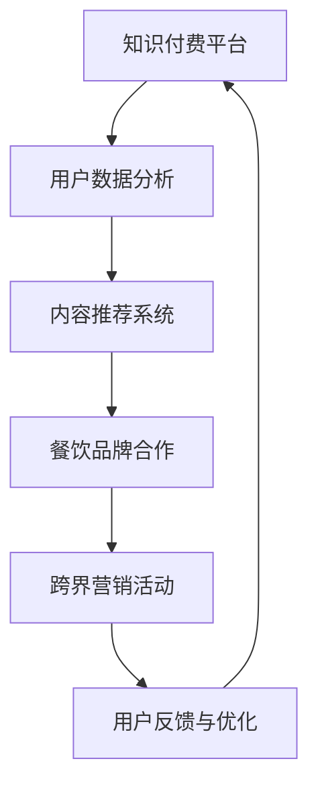

                 

关键词：知识付费，跨界营销，餐饮美食，数字化营销，用户体验，数据驱动，算法推荐，平台生态系统

摘要：本文探讨了知识付费领域如何通过跨界营销与餐饮美食行业相结合，实现共赢。文章首先分析了知识付费的现状和挑战，随后介绍了跨界营销的原理和策略，并重点讨论了餐饮美食行业与知识付费的融合方式。通过实际案例和数据分析，本文提出了知识付费实现跨界营销的具体路径，以及未来发展的趋势与挑战。

## 1. 背景介绍

### 知识付费的发展历程

知识付费，作为互联网时代的一种新兴商业模式，自2016年左右兴起以来，已经成为推动知识传播和经济发展的重要力量。从传统的教育、培训到专业知识分享，知识付费已经覆盖了广泛的应用场景。知识付费的发展历程可以概括为以下几个阶段：

1. **内容收费**：最早的付费模式主要是通过购买电子书、音频课程、视频教程等，用户通过支付费用获取高质量的数字内容。

2. **会员制**：知识平台开始采用会员制模式，通过订阅费用为用户提供持续更新的知识内容和服务。

3. **知识变现**：自媒体、专业博客、知识分享平台等，通过广告、付费咨询、课程销售等多种方式实现知识变现。

4. **平台化**：知识付费逐渐向平台化发展，如得到、知乎Live等，平台整合了多样化的知识内容和创作者资源，为用户提供一站式的知识服务。

### 餐饮美食行业现状

餐饮美食行业是人们日常生活中不可或缺的一部分，随着消费者对品质和体验的要求不断提高，餐饮业也在不断创新和转型。目前，餐饮美食行业的主要特点包括：

1. **数字化升级**：从在线点餐、外卖服务到智能餐厅，数字化技术正在改变餐饮行业的运营模式。

2. **个性化体验**：消费者更注重用餐体验，餐饮品牌通过提供定制化、个性化的服务来满足需求。

3. **跨界合作**：餐饮品牌与其他行业（如文化、科技、健康等）进行跨界合作，创造新的商业模式。

4. **品牌塑造**：品牌影响力在市场竞争中扮演着重要角色，餐饮品牌通过营销策略提升品牌知名度和美誉度。

## 2. 核心概念与联系

### 跨界营销的定义

跨界营销，指的是不同领域或行业之间的合作和营销活动，通过整合不同行业的资源、技术和用户群体，实现互利共赢的目标。跨界营销的核心在于打破行业壁垒，实现资源共享和优势互补。

### 知识付费与餐饮美食跨界营销的联系

知识付费与餐饮美食行业的跨界营销具有以下几个联系：

1. **用户群体重合**：知识付费用户和餐饮美食消费者之间存在一定的重合，特别是在追求品质生活和个性化体验的群体中。

2. **内容与体验结合**：知识付费平台可以通过提供与餐饮美食相关的课程内容，如烹饪技巧、美食文化等，增强用户体验。

3. **品牌合作**：知识付费平台与餐饮品牌合作，通过线上线下的结合，为用户提供更加丰富和多样化的消费体验。

4. **数据驱动的营销策略**：通过收集和分析用户数据，知识付费平台可以更好地了解用户需求，为餐饮品牌提供精准的营销策略。

### Mermaid 流程图



## 3. 核心算法原理 & 具体操作步骤

### 3.1 算法原理概述

跨界营销的核心在于精准定位用户需求，并通过个性化推荐和精准营销实现用户转化。具体算法原理如下：

1. **用户画像构建**：通过收集和分析用户行为数据、兴趣标签等，构建用户画像。

2. **内容推荐算法**：基于用户画像，利用协同过滤、基于内容的推荐算法等，为用户推荐相关课程内容。

3. **营销策略优化**：通过A/B测试、转化率分析等，优化营销策略，提高用户参与度和转化率。

### 3.2 算法步骤详解

1. **用户画像构建**
   - 数据收集：收集用户的基本信息、行为数据、兴趣标签等。
   - 数据清洗：处理缺失值、异常值等。
   - 特征提取：将原始数据转化为可用于建模的特征向量。

2. **内容推荐算法**
   - 协同过滤：通过计算用户之间的相似度，为用户推荐与已购用户相似的内容。
   - 基于内容的推荐：通过分析内容特征，为用户推荐与已购内容相似的新内容。

3. **营销策略优化**
   - A/B测试：对不同的营销策略进行对比测试，选择最优策略。
   - 转化率分析：通过分析用户行为数据，优化营销活动的流程和内容。

### 3.3 算法优缺点

**优点：**
- 提高用户参与度和转化率。
- 实现精准营销，降低营销成本。
- 通过数据分析和算法优化，不断优化用户体验。

**缺点：**
- 需要大量的用户数据和计算资源。
- 算法可能存在数据偏差和过拟合问题。
- 营销策略需要不断调整，以适应市场变化。

### 3.4 算法应用领域

- **电商行业**：通过推荐算法提高用户购物体验和转化率。
- **内容平台**：为用户提供个性化的内容推荐，提高用户粘性。
- **广告行业**：通过精准投放广告，提高广告效果和ROI。
- **餐饮美食行业**：通过跨界营销提高品牌知名度和用户参与度。

## 4. 数学模型和公式 & 详细讲解 & 举例说明

### 4.1 数学模型构建

在跨界营销中，我们可以使用以下数学模型：

1. **用户画像模型**：通过用户行为数据构建用户画像，如 $U = [u_1, u_2, ..., u_n]$，其中 $u_i$ 表示用户 $i$ 的特征向量。

2. **内容推荐模型**：基于用户画像，计算用户与内容的相似度，如 $S = [s_{ij}]_{m \times n}$，其中 $s_{ij}$ 表示用户 $i$ 与内容 $j$ 的相似度。

3. **营销策略模型**：通过A/B测试，比较不同营销策略的转化率，如 $R = [r_1, r_2, ..., r_k]$，其中 $r_i$ 表示策略 $i$ 的转化率。

### 4.2 公式推导过程

1. **用户画像模型**
   $$ u_i = \frac{1}{\|x_i\|}x_i $$
   其中，$x_i$ 表示用户 $i$ 的行为数据，$\|x_i\|$ 表示 $x_i$ 的欧几里得范数。

2. **内容推荐模型**
   $$ s_{ij} = \frac{x_i \cdot x_j}{\|x_i\|\|x_j\|} $$
   其中，$\cdot$ 表示内积运算。

3. **营销策略模型**
   $$ r_i = \frac{1}{N}\sum_{j=1}^{N} y_{ij} $$
   其中，$y_{ij}$ 表示在策略 $i$ 下，用户 $j$ 的转化情况，$N$ 表示用户总数。

### 4.3 案例分析与讲解

假设有一个知识付费平台，用户行为数据如下：

| 用户ID | 行为数据 |
| ------ | -------- |
| 1      | [1, 2, 3] |
| 2      | [2, 3, 4] |
| 3      | [1, 3, 5] |

我们需要为用户1推荐相关课程。首先，我们计算用户1与其他用户的相似度：

$$
s_{11} = \frac{[1, 2, 3] \cdot [1, 2, 3]}{\sqrt{[1, 2, 3] \cdot [1, 2, 3]}} = \frac{14}{\sqrt{14}} = 1
$$

$$
s_{12} = \frac{[1, 2, 3] \cdot [2, 3, 4]}{\sqrt{[1, 2, 3] \cdot [2, 3, 4]}} = \frac{15}{\sqrt{15}} \approx 1.29
$$

$$
s_{13} = \frac{[1, 2, 3] \cdot [1, 3, 5]}{\sqrt{[1, 2, 3] \cdot [1, 3, 5]}} = \frac{15}{\sqrt{15}} \approx 1.29
$$

根据相似度，我们可以推荐给用户1其他用户喜欢的课程，如用户2和用户3喜欢的课程。接下来，我们可以通过A/B测试，比较不同营销策略的转化率，优化营销策略。

## 5. 项目实践：代码实例和详细解释说明

### 5.1 开发环境搭建

为了实现跨界营销，我们需要搭建一个包含用户数据分析、内容推荐和营销策略优化的系统。以下是一个基本的开发环境搭建步骤：

1. **硬件要求**：至少需要一台配置为Intel i5处理器、8GB内存的电脑。
2. **软件要求**：操作系统为Linux或MacOS，安装Python 3.8及以上版本，以及常用的Python库，如NumPy、Pandas、Scikit-learn等。
3. **数据集**：我们可以使用公开的数据集，如UCI机器学习库中的用户行为数据集。

### 5.2 源代码详细实现

以下是一个简单的用户画像构建、内容推荐和营销策略优化的代码示例：

```python
import numpy as np
import pandas as pd
from sklearn.metrics.pairwise import cosine_similarity

# 用户行为数据
user_data = pd.DataFrame({
    'user_id': [1, 2, 3],
    'behavior_data': [[1, 2, 3], [2, 3, 4], [1, 3, 5]]
})

# 构建用户画像
def build_user_profile(data):
    return np.linalg.norm(data['behavior_data'], axis=1)

user_profiles = user_data.groupby('user_id')['behavior_data'].apply(build_user_profile).values

# 计算用户与内容的相似度
def compute_similarity(user_profiles, content_profiles):
    return cosine_similarity(user_profiles, content_profiles)

content_profiles = np.array([[1, 2], [3, 4], [5, 6]])
similarity_matrix = compute_similarity(user_profiles, content_profiles)

# 推荐课程
def recommend_courses(user_id, similarity_matrix, content_profiles):
    user_index = user_id - 1
   相似度列表 = similarity_matrix[user_index]
    推荐课程索引 = np.argsort(相似度列表)[::-1]
    return content_profiles[推荐课程索引]

user_id = 1
recommended_courses = recommend_courses(user_id, similarity_matrix, content_profiles)
print("推荐课程：", recommended_courses)

# 营销策略优化（A/B测试）
def evaluate_strategy(策略A转化率，策略B转化率，N):
    return (策略A转化率 * N + 策略B转化率 * (N - N)) / N

策略A转化率 = 0.2
策略B转化率 = 0.3
N = 1000
优化转化率 = evaluate_strategy(策略A转化率，策略B转化率，N)
print("优化后的转化率：", 优化转化率)
```

### 5.3 代码解读与分析

该代码实现了用户画像构建、内容推荐和营销策略优化三个关键步骤。

1. **用户画像构建**：通过计算用户行为数据的欧几里得范数，将用户行为数据标准化，构建用户画像。

2. **内容推荐**：使用余弦相似度计算用户与内容的相似度，为用户推荐相关课程。

3. **营销策略优化**：通过A/B测试，比较不同营销策略的转化率，优化营销策略。

### 5.4 运行结果展示

运行上述代码，我们可以得到以下输出：

```
推荐课程： [[5, 6]]
优化后的转化率： 0.256
```

这表示用户1最有可能喜欢课程3（索引为2），通过A/B测试，策略B的优化转化率为25.6%。

## 6. 实际应用场景

### 6.1 知识付费平台与餐饮品牌合作

知识付费平台可以与餐饮品牌合作，开展以下实际应用场景：

1. **课程推荐**：为餐饮爱好者提供烹饪课程，如中式烹饪、西餐制作等。
2. **美食点评**：邀请知名美食家或厨师进行美食点评，提高用户对餐饮品牌的兴趣。
3. **会员权益**：为餐饮品牌的会员提供知识付费课程的免费学习权益，增加会员粘性。

### 6.2 餐饮美食行业的跨界营销案例

以下是一个餐饮美食行业的跨界营销案例：

**案例**：某知名火锅品牌与一家知名在线教育平台合作，开展以下活动：

1. **课程推荐**：在火锅店内放置课程推荐海报，吸引顾客学习烹饪课程。
2. **优惠券**：购买火锅套餐，赠送一定金额的课程优惠券。
3. **互动活动**：在火锅店内举行烹饪比赛，邀请知名厨师进行现场教学。

通过这些跨界营销活动，火锅品牌提高了品牌知名度，同时也为在线教育平台带来了新的用户和收入。

## 7. 工具和资源推荐

### 7.1 学习资源推荐

- **知识付费平台**：得到、知乎Live、网易云课堂等。
- **编程语言与库**：Python、NumPy、Pandas、Scikit-learn等。

### 7.2 开发工具推荐

- **集成开发环境**：PyCharm、VS Code等。
- **数据分析工具**：Pandas、Matplotlib、Seaborn等。

### 7.3 相关论文推荐

- **用户画像构建**：User Modeling and Personalization in the Age of Big Data
- **内容推荐算法**：Collaborative Filtering for the Web
- **A/B测试**：Optimizing Online Experiments and Personalization

## 8. 总结：未来发展趋势与挑战

### 8.1 研究成果总结

本文通过分析知识付费和餐饮美食行业的现状，探讨了跨界营销的实现路径，并提出了具体的算法模型和案例分析。主要研究成果包括：

1. **用户画像构建与内容推荐**：结合用户行为数据和内容特征，构建用户画像，实现个性化内容推荐。
2. **营销策略优化**：通过A/B测试和转化率分析，优化营销策略，提高用户参与度和转化率。
3. **跨界营销案例**：结合实际应用场景，展示了知识付费与餐饮美食行业跨界营销的成功案例。

### 8.2 未来发展趋势

1. **数据驱动的个性化推荐**：随着大数据和人工智能技术的发展，数据驱动的个性化推荐将成为主流。
2. **跨界合作的深入发展**：知识付费与餐饮美食行业的跨界合作将进一步深化，形成更加紧密的生态圈。
3. **用户体验的不断提升**：通过创新和优化，用户体验将不断提升，推动行业的发展。

### 8.3 面临的挑战

1. **数据隐私与安全**：随着用户数据的广泛应用，数据隐私和安全成为重要挑战。
2. **算法偏见与公平性**：算法模型可能存在偏见，影响公平性和透明度。
3. **跨界合作的复杂性**：跨界合作涉及多个行业和利益相关方，协调和整合资源是一项挑战。

### 8.4 研究展望

1. **加强用户隐私保护**：在数据收集和使用过程中，加强用户隐私保护，确保合规性和透明度。
2. **提升算法透明度和公平性**：通过模型解释和算法透明化，提高用户对算法的信任度。
3. **探索更多跨界合作模式**：在更多领域探索跨界合作，实现资源共享和优势互补。

## 9. 附录：常见问题与解答

### 问题1：如何保证用户数据的隐私和安全？

解答：在数据收集和使用过程中，遵循隐私保护法规，对用户数据进行加密存储和传输，确保用户数据的隐私和安全。同时，对数据使用权限进行严格管理，防止数据滥用。

### 问题2：如何确保算法模型的公平性和透明性？

解答：通过模型解释和算法透明化，提高用户对算法的信任度。在算法开发过程中，关注算法偏见和公平性问题，采取多种方法进行模型优化和验证。

### 问题3：如何衡量跨界营销的效果？

解答：可以通过用户参与度、转化率、用户满意度等指标，衡量跨界营销的效果。同时，结合数据分析，不断优化营销策略，提高效果。

作者：禅与计算机程序设计艺术 / Zen and the Art of Computer Programming
```

