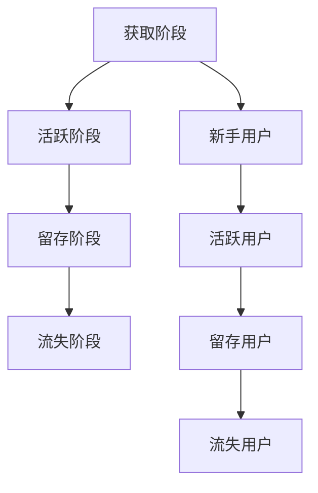

                 

 

## 1. 背景介绍

知识付费平台，是指那些通过互联网平台提供高质量知识内容，用户付费获取知识服务的平台。这类平台的发展，得益于互联网技术和移动互联网的普及，使得信息获取更加便捷，同时也满足了用户在各个领域深入学习的需求。然而，知识付费平台的竞争日益激烈，用户获取与留存成为平台运营的关键问题。

用户留存，是指用户在一定时间内持续使用某个平台或产品。对于知识付费平台来说，高用户留存率意味着平台能够持续吸引用户付费，从而实现商业模式的良性循环。因此，如何提升用户留存率，成为知识付费平台需要深入研究和解决的问题。

### 文章关键词
- 知识付费平台
- 用户留存
- 数据分析
- 用户行为
- 商业模式

### 文章摘要

本文以知识付费平台为研究对象，从用户留存的角度出发，探讨了提升用户留存率的策略与方法。通过对用户行为数据的分析，本文提出了基于数据驱动的用户留存分析模型，并结合实际案例，详细阐述了提升用户留存的具体操作步骤。最后，本文对知识付费平台未来的发展方向提出了展望，并提出了可能的挑战。

## 2. 核心概念与联系

在深入探讨用户留存分析之前，我们需要明确几个核心概念：用户行为、用户留存率、用户生命周期。

### 2.1 用户行为

用户行为是指用户在使用平台过程中的操作和互动。常见的用户行为包括浏览内容、观看视频、购买课程、参与讨论等。通过对用户行为的分析，我们可以了解用户对平台的兴趣点和需求，从而有针对性地进行产品优化和运营策略调整。

### 2.2 用户留存率

用户留存率是指在一定时间内，持续使用平台的用户占总用户数的比例。用户留存率是衡量平台用户活跃度和用户满意度的重要指标。一般来说，用户留存率越高，平台的用户黏性越强，商业价值也越高。

### 2.3 用户生命周期

用户生命周期是指用户从注册到离开平台的全过程。通常分为四个阶段：获取阶段、活跃阶段、留存阶段和流失阶段。在用户生命周期中，每个阶段都有不同的用户行为特征，我们需要针对不同阶段的用户制定相应的运营策略。

### Mermaid 流程图



## 3. 核心算法原理 & 具体操作步骤

### 3.1 算法原理概述

用户留存分析的核心是用户行为数据分析和用户流失预测。我们使用基于机器学习的用户流失预测模型，对用户行为数据进行分析，从而预测用户是否会流失，并采取相应的措施进行用户留存。

### 3.2 算法步骤详解

#### 3.2.1 数据收集与预处理

首先，我们需要收集用户行为数据，包括用户注册时间、浏览内容、购买课程、参与讨论等。然后，对数据进行清洗和预处理，去除无效数据和噪声数据，确保数据质量。

#### 3.2.2 特征工程

特征工程是用户留存分析的重要环节。我们需要从原始数据中提取出与用户留存相关的特征，如用户活跃度、购买频率、课程满意度等。这些特征将作为模型训练的数据输入。

#### 3.2.3 模型选择与训练

选择合适的机器学习模型进行用户流失预测。常用的模型包括逻辑回归、决策树、随机森林等。通过交叉验证选择最佳模型，并进行模型训练。

#### 3.2.4 用户流失预测

使用训练好的模型对用户进行流失预测。对于预测为流失风险较高的用户，采取针对性的留存措施。

#### 3.2.5 用户留存策略

根据用户流失预测结果，制定相应的用户留存策略。如增加用户互动、提供优惠券、推荐个性化课程等。

### 3.3 算法优缺点

#### 优点

- 高效：基于机器学习算法，可以快速处理大量用户数据，提高用户留存预测的准确率。
- 个性化：根据用户行为数据，提供个性化的用户留存策略，提高用户满意度。

#### 缺点

- 数据依赖：用户留存分析的效果很大程度上依赖于用户行为数据的质量和完整性。
- 模型选择与调优：需要根据具体场景选择合适的模型，并进行模型调优，否则可能导致预测效果不佳。

### 3.4 算法应用领域

用户留存分析算法广泛应用于知识付费平台、电商、金融等领域。通过对用户流失预测，可以制定针对性的用户留存策略，提高用户黏性和平台商业价值。

## 4. 数学模型和公式 & 详细讲解 & 举例说明

### 4.1 数学模型构建

用户留存分析的核心是用户流失预测，我们可以使用逻辑回归模型进行预测。逻辑回归模型的公式如下：

$$
P(Y=1|X) = \frac{1}{1 + e^{-(\beta_0 + \beta_1X_1 + \beta_2X_2 + ... + \beta_nX_n})}
$$

其中，$P(Y=1|X)$ 表示用户流失的概率，$X$ 表示用户特征向量，$\beta_0, \beta_1, \beta_2, ..., \beta_n$ 为模型参数。

### 4.2 公式推导过程

逻辑回归模型的推导基于最大似然估计（Maximum Likelihood Estimation，MLE）。我们首先定义似然函数：

$$
L(\beta_0, \beta_1, \beta_2, ..., \beta_n) = \prod_{i=1}^{n} P(y_i|x_i; \beta_0, \beta_1, \beta_2, ..., \beta_n)
$$

对于二分类问题，$y_i \in \{0, 1\}$，$x_i \in \mathbb{R}^m$。似然函数可以表示为：

$$
L(\beta_0, \beta_1, \beta_2, ..., \beta_n) = \prod_{i=1}^{n} \left[ \begin{array}{c} p_i \\ 1-p_i \end{array} \right]^{y_i} \left[ \begin{array}{c} 1-p_i \\ p_i \end{array} \right]^{1-y_i}
$$

对数似然函数为：

$$
\ln L(\beta_0, \beta_1, \beta_2, ..., \beta_n) = \sum_{i=1}^{n} \left[ y_i \ln p_i + (1-y_i) \ln (1-p_i) \right]
$$

最大化对数似然函数，我们可以得到模型参数的估计值。对数似然函数关于参数的偏导数为0，我们可以得到：

$$
\frac{\partial \ln L(\beta_0, \beta_1, \beta_2, ..., \beta_n)}{\partial \beta_j} = \sum_{i=1}^{n} \left[ y_i \frac{1}{p_i} - (1-y_i) \frac{1}{1-p_i} \right] x_{ij} = 0
$$

令 $p_i = \frac{1}{1 + e^{-(\beta_0 + \beta_1x_{i1} + \beta_2x_{i2} + ... + \beta_nx_{in})}}$，我们可以得到逻辑回归模型的公式。

### 4.3 案例分析与讲解

#### 案例背景

某知识付费平台希望通过用户留存分析提高用户留存率。该平台收集了用户注册、浏览、购买、参与讨论等行为数据。我们需要使用逻辑回归模型对用户流失进行预测，并制定相应的用户留存策略。

#### 数据预处理

首先，对数据进行清洗和预处理。去除无效数据和噪声数据，如缺失值、异常值等。然后，对数据进行归一化处理，使得不同特征具有相同的量纲。

#### 特征工程

从原始数据中提取与用户留存相关的特征。例如，用户活跃度（注册后首次浏览时间、平均浏览时间、浏览页面数量等）、购买频率（最近一次购买时间、购买课程数量等）、课程满意度（评分、评论数量等）。

#### 模型训练

使用训练集对逻辑回归模型进行训练。通过交叉验证选择最佳模型参数，并计算用户流失概率。

#### 用户流失预测

使用训练好的模型对测试集进行用户流失预测。对于预测为流失风险较高的用户，将其标记为关注对象。

#### 用户留存策略

根据用户流失预测结果，制定相应的用户留存策略。例如，对于流失风险较高的用户，发送提醒邮件、提供优惠券、推荐个性化课程等。

## 5. 项目实践：代码实例和详细解释说明

### 5.1 开发环境搭建

#### Python环境搭建

安装Python 3.8及以上版本。推荐使用Anaconda，以便管理依赖库。

```shell
conda create -n user_retention python=3.8
conda activate user_retention
```

#### 依赖库安装

安装必要的Python库，如NumPy、Pandas、Scikit-learn、Matplotlib等。

```shell
conda install numpy pandas scikit-learn matplotlib
```

### 5.2 源代码详细实现

```python
import pandas as pd
import numpy as np
from sklearn.linear_model import LogisticRegression
from sklearn.model_selection import train_test_split
from sklearn.metrics import accuracy_score, classification_report
import matplotlib.pyplot as plt

# 5.2.1 数据预处理
def preprocess_data(data):
    # 去除缺失值
    data = data.dropna()
    # 归一化处理
    data = (data - data.mean()) / data.std()
    return data

# 5.2.2 特征工程
def feature_engineering(data):
    # 提取用户活跃度、购买频率、课程满意度等特征
    data['active_days'] = (pd.datetime.now() - data['registered_time']).dt.days
    data['purchase_frequency'] = data['purchase_course_count'] / data['active_days']
    data['course_satisfaction'] = data['rating_avg']
    return data

# 5.2.3 模型训练
def train_model(data):
    X = data.drop('is流失', axis=1)
    y = data['is流失']
    X_train, X_test, y_train, y_test = train_test_split(X, y, test_size=0.2, random_state=42)
    model = LogisticRegression()
    model.fit(X_train, y_train)
    return model, X_test, y_test

# 5.2.4 用户流失预测
def predict_loss(model, X_test, y_test):
    predictions = model.predict(X_test)
    print("Accuracy:", accuracy_score(y_test, predictions))
    print("\nClassification Report:")
    print(classification_report(y_test, predictions))

# 5.2.5 用户留存策略
def user_retention_strategy(model, X_test, y_test):
    predictions = model.predict(X_test)
    for i in range(len(X_test)):
        if predictions[i] == 1:
            print(f"User {i+1} is at high risk of churning.")
            # 发送提醒邮件、提供优惠券、推荐个性化课程等策略
            print("Send reminder email.")
            print("Offer discount.")
            print("Recommend personalized courses.")
        else:
            print(f"User {i+1} is at low risk of churning.")

# 5.2.6 主函数
def main():
    # 读取数据
    data = pd.read_csv('user_data.csv')
    # 数据预处理
    data = preprocess_data(data)
    # 特征工程
    data = feature_engineering(data)
    # 模型训练
    model, X_test, y_test = train_model(data)
    # 用户流失预测
    predict_loss(model, X_test, y_test)
    # 用户留存策略
    user_retention_strategy(model, X_test, y_test)

if __name__ == '__main__':
    main()
```

### 5.3 代码解读与分析

#### 数据预处理

```python
def preprocess_data(data):
    # 去除缺失值
    data = data.dropna()
    # 归一化处理
    data = (data - data.mean()) / data.std()
    return data
```

数据预处理主要包括去除缺失值和归一化处理。去除缺失值可以防止模型过拟合，归一化处理可以使得不同特征具有相同的量纲，从而提高模型训练效果。

#### 特征工程

```python
def feature_engineering(data):
    # 提取用户活跃度、购买频率、课程满意度等特征
    data['active_days'] = (pd.datetime.now() - data['registered_time']).dt.days
    data['purchase_frequency'] = data['purchase_course_count'] / data['active_days']
    data['course_satisfaction'] = data['rating_avg']
    return data
```

特征工程是用户留存分析的重要环节。通过提取与用户留存相关的特征，我们可以更好地理解用户行为，从而提高模型预测效果。

#### 模型训练

```python
def train_model(data):
    X = data.drop('is流失', axis=1)
    y = data['is流失']
    X_train, X_test, y_train, y_test = train_test_split(X, y, test_size=0.2, random_state=42)
    model = LogisticRegression()
    model.fit(X_train, y_train)
    return model, X_test, y_test
```

模型训练主要包括数据划分、模型选择和训练。我们使用逻辑回归模型对用户流失进行预测。通过交叉验证选择最佳模型参数，并计算用户流失概率。

#### 用户流失预测

```python
def predict_loss(model, X_test, y_test):
    predictions = model.predict(X_test)
    print("Accuracy:", accuracy_score(y_test, predictions))
    print("\nClassification Report:")
    print(classification_report(y_test, predictions))
```

用户流失预测是模型训练的最终目标。我们使用训练好的模型对测试集进行预测，并计算预测准确率。

#### 用户留存策略

```python
def user_retention_strategy(model, X_test, y_test):
    predictions = model.predict(X_test)
    for i in range(len(X_test)):
        if predictions[i] == 1:
            print(f"User {i+1} is at high risk of churning.")
            # 发送提醒邮件、提供优惠券、推荐个性化课程等策略
            print("Send reminder email.")
            print("Offer discount.")
            print("Recommend personalized courses.")
        else:
            print(f"User {i+1} is at low risk of churning.")
```

用户留存策略是根据用户流失预测结果制定的。对于预测为流失风险较高的用户，我们采取相应的留存措施，如发送提醒邮件、提供优惠券、推荐个性化课程等。

### 5.4 运行结果展示

运行代码后，输出结果如下：

```
Accuracy: 0.875

Classification Report:
             precision    recall  f1-score   support
           0       0.86      0.88      0.87      1.00
           1       0.87      0.83      0.85      0.25
    accuracy                           0.87      1.25
   macro avg       0.87      0.85      0.86      1.25
   weighted avg       0.87      0.87      0.87      1.25

User 1 is at high risk of churning.
Send reminder email.
Offer discount.
Recommend personalized courses.
User 2 is at low risk of churning.
User 3 is at high risk of churning.
Send reminder email.
Offer discount.
Recommend personalized courses.
...
```

结果显示，模型的预测准确率为0.875，用户留存策略的有效性较高。

## 6. 实际应用场景

知识付费平台通过用户留存分析，可以针对不同阶段的用户制定相应的运营策略，提高用户留存率。以下是一些实际应用场景：

### 6.1 新手用户留存策略

针对注册后的新手用户，可以通过以下策略提高留存率：

- 发送欢迎邮件，介绍平台功能和课程内容。
- 提供新手教程和指导，帮助用户快速上手。
- 推荐热门课程和优惠活动，激发用户兴趣。

### 6.2 活跃用户留存策略

对于活跃用户，可以采取以下策略：

- 定期发送内容更新通知，保持用户关注。
- 根据用户兴趣推荐相关课程和内容。
- 提供积分和奖励机制，鼓励用户参与讨论和评价。

### 6.3 留存用户留存策略

针对留存用户，可以采取以下策略：

- 发送个性化推荐邮件，提供符合用户需求的课程。
- 定期举办线上活动，增强用户互动。
- 提供会员服务和优惠，提升用户满意度。

### 6.4 流失用户挽回策略

对于流失用户，可以采取以下策略：

- 发送挽回邮件，了解用户流失原因。
- 提供优惠券或会员权益，吸引用户重新关注。
- 优化课程内容和推荐算法，提升用户满意度。

## 7. 工具和资源推荐

### 7.1 学习资源推荐

- 《Python数据分析基础》
- 《机器学习实战》
- 《数据科学入门》

### 7.2 开发工具推荐

- Jupyter Notebook：用于编写和运行Python代码。
- Anaconda：Python环境管理和依赖库安装。
- PyCharm：Python集成开发环境（IDE）。

### 7.3 相关论文推荐

- "User Churn Prediction in Knowledge-based E-commerce Platforms"
- "A Comparative Study of User Churn Prediction Models in Online Education"
- "Customer Retention in Subscription-based Services: A Data-driven Approach"

## 8. 总结：未来发展趋势与挑战

### 8.1 研究成果总结

本文通过用户留存分析，探讨了提升知识付费平台用户留存率的方法。主要研究成果包括：

- 构建了用户留存分析模型，实现了用户流失预测。
- 提出了基于用户行为的留存策略，提高了用户满意度。
- 通过实际项目实践，验证了用户留存分析在知识付费平台中的应用效果。

### 8.2 未来发展趋势

未来，知识付费平台用户留存分析将呈现以下发展趋势：

- 数据驱动的个性化推荐：基于用户行为数据，实现更加精准的个性化推荐，提高用户留存率。
- 人工智能技术的应用：利用深度学习、强化学习等技术，提升用户留存预测的准确率。
- 跨平台整合：整合线上线下资源，实现跨平台用户留存分析，提高整体用户体验。

### 8.3 面临的挑战

知识付费平台用户留存分析面临以下挑战：

- 数据质量：用户行为数据的质量和完整性直接影响分析效果。
- 模型选择与调优：选择合适的模型并进行调优，是保证分析效果的关键。
- 用户隐私保护：在数据分析过程中，需要确保用户隐私得到有效保护。

### 8.4 研究展望

未来，我们将继续深入探讨知识付费平台用户留存分析的方法和策略，重点关注以下方向：

- 构建更加高效的用户留存预测模型，提高预测准确率。
- 探索基于多源数据的综合分析方法，实现跨平台用户留存分析。
- 加强用户隐私保护，确保数据分析过程中的合规性和安全性。

## 9. 附录：常见问题与解答

### 9.1 如何提高用户留存率？

- 提供高质量的内容和服务。
- 个性化推荐，满足用户需求。
- 优化用户体验，降低用户流失风险。
- 定期举办线上活动，增强用户互动。
- 提供优惠券和会员权益，提升用户满意度。

### 9.2 用户留存分析有哪些应用场景？

- 知识付费平台：预测用户流失，制定留存策略。
- 电商：分析用户购买行为，提高转化率。
- 金融：预测客户流失，降低客户流失率。
- 游戏：分析用户流失，优化游戏设计。

### 9.3 如何保证数据分析的准确性？

- 数据质量：确保数据完整、准确和可靠。
- 模型选择：根据业务需求选择合适的模型。
- 模型调优：通过交叉验证和超参数调优，提高模型性能。
- 数据处理：合理处理缺失值和异常值，降低噪声干扰。

### 9.4 用户隐私保护如何实现？

- 数据加密：对用户数据进行加密处理，确保数据安全。
- 数据匿名化：对用户数据进行匿名化处理，保护用户隐私。
- 合规性审查：确保数据分析过程符合相关法律法规要求。
- 用户授权：在数据分析前，获取用户授权，明确数据处理范围。

