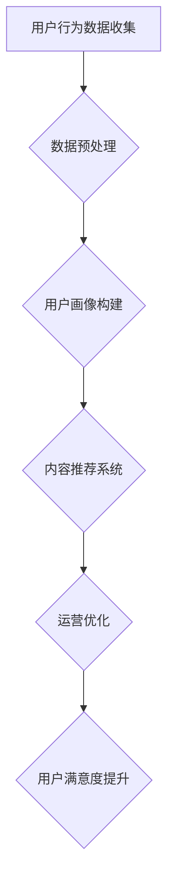

                 

 > **摘要：**
本文旨在探讨知识付费平台在当今数字化时代的重要性，以及如何通过深入的用户行为分析，优化平台设计和提高用户满意度。文章首先介绍了知识付费平台的基本概念，随后详细阐述了用户行为分析的核心概念及其在平台架构中的应用。接着，文章重点分析了用户行为数据收集、处理和分析的方法，并探讨了核心算法原理及数学模型。此外，文章还提供了一个实际的代码实例，并讨论了用户行为分析在实际应用场景中的多种可能性。最后，文章总结了研究成果，提出了未来发展趋势和挑战，并推荐了相关的学习资源和工具。

## 1. 背景介绍

知识付费平台作为一种新型的互联网商业模式，近年来在全球范围内迅速崛起。这类平台通过提供各种领域的知识内容，满足了用户在个人成长、职业发展和兴趣爱好等方面的需求。知识付费平台的发展不仅改变了传统教育模式，也为知识创造者提供了全新的收入来源。

随着知识付费平台的普及，用户行为分析成为了一个重要的研究领域。通过分析用户的浏览、购买、评论等行为，平台运营者可以深入了解用户需求，优化内容推荐，提升用户体验，从而实现商业价值的最大化。

### 1.1 知识付费平台的发展历程

知识付费平台起源于互联网早期，随着互联网技术的不断进步和用户需求的变化，这一领域逐渐发展壮大。早期的知识付费平台主要以在线教育为主，例如Coursera、edX等。这些平台通过提供在线课程，满足了学习者自主学习和远程教育的需求。

进入21世纪后，知识付费平台开始多元化发展。除了在线教育，还涵盖了职业培训、兴趣爱好等多个领域。例如，知乎Live、得到App等平台，通过邀请行业专家进行直播讲座、录制课程等方式，为用户提供了丰富的知识内容。

近年来，随着人工智能、大数据等技术的应用，知识付费平台开始更加智能化。通过用户行为分析，平台能够精准推荐内容，提高用户粘性和满意度。

### 1.2 用户行为分析的重要性

用户行为分析是知识付费平台的核心竞争力之一。通过分析用户的行为数据，平台运营者可以获取以下信息：

1. 用户兴趣：了解用户对不同类型内容的偏好，有助于平台提供个性化的内容推荐。
2. 用户需求：分析用户的行为路径，可以发现用户在平台上的痛点，从而优化平台设计。
3. 用户满意度：通过用户评论、反馈等数据，可以评估平台的服务质量，及时调整运营策略。

总之，用户行为分析不仅有助于提高平台运营效率，还能为用户提供更好的服务体验，从而实现商业价值的最大化。

## 2. 核心概念与联系

### 2.1 用户行为分析的定义

用户行为分析是指通过对用户在平台上的行为数据进行收集、处理和分析，以获取用户需求、兴趣和满意度等信息的过程。这些行为数据包括浏览记录、购买行为、评论、分享等。

### 2.2 用户行为分析在平台架构中的应用

用户行为分析在知识付费平台架构中的应用主要体现在以下几个方面：

1. **内容推荐系统**：基于用户行为数据，为用户推荐个性化内容，提高用户满意度和留存率。
2. **用户画像**：通过分析用户行为数据，构建用户画像，为精准营销和个性化推荐提供基础。
3. **运营优化**：分析用户行为数据，发现平台运营中的问题，优化产品设计和运营策略。

### 2.3 Mermaid 流程图

以下是一个简单的 Mermaid 流程图，展示了用户行为分析在平台架构中的应用：



### 2.4 核心概念与联系

- **用户行为数据**：包括浏览记录、购买行为、评论、分享等。
- **数据预处理**：对原始数据进行清洗、归一化等处理，为后续分析提供高质量的数据。
- **用户画像**：通过分析用户行为数据，构建用户兴趣、需求等特征。
- **内容推荐系统**：基于用户画像和内容特征，为用户推荐个性化内容。
- **运营优化**：通过分析用户行为数据，发现运营问题，优化产品设计和运营策略。

## 3. 核心算法原理 & 具体操作步骤

### 3.1 算法原理概述

用户行为分析的核心算法主要包括协同过滤、内容推荐和聚类等。协同过滤通过分析用户的历史行为数据，发现相似用户或物品，为用户提供个性化推荐。内容推荐则基于用户对内容的评价和特征，为用户推荐相似或感兴趣的内容。聚类算法用于将用户或内容进行分组，以便进行更深入的分析。

### 3.2 算法步骤详解

#### 3.2.1 协同过滤

协同过滤算法主要分为基于用户的协同过滤（User-Based）和基于物品的协同过滤（Item-Based）。

1. **基于用户的协同过滤**：
   - 计算用户之间的相似度，通常使用余弦相似度或皮尔逊相关系数。
   - 根据相似度找到与目标用户最相似的K个用户。
   - 为目标用户推荐这K个用户喜欢的、但目标用户尚未喜欢的物品。

2. **基于物品的协同过滤**：
   - 计算物品之间的相似度，通常使用余弦相似度或欧氏距离。
   - 根据相似度找到与目标物品最相似的K个物品。
   - 为目标用户推荐这K个物品。

#### 3.2.2 内容推荐

内容推荐算法主要基于用户对内容的评价和内容特征。常用的方法包括基于内容的过滤（Content-Based Filtering）和基于模型的推荐（Model-Based Recommendation）。

1. **基于内容的过滤**：
   - 提取用户对内容的评价和内容特征。
   - 计算用户和内容之间的相似度。
   - 为用户推荐相似的内容。

2. **基于模型的推荐**：
   - 构建用户和内容之间的模型，例如矩阵分解、深度学习等。
   - 利用模型预测用户对未评价内容的评分。
   - 为用户推荐预测评分较高的内容。

#### 3.2.3 聚类算法

聚类算法用于将用户或内容进行分组，以便进行更深入的分析。常用的聚类算法包括K-Means、DBSCAN、层次聚类等。

1. **K-Means**：
   - 确定聚类个数K。
   - 随机选择K个中心点。
   - 将每个用户或内容分配到最近的中心点。
   - 重新计算中心点，直至中心点不再发生变化。

2. **DBSCAN**：
   - 选择邻域半径和最小邻域密度。
   - 对于每个未标记的用户或内容，判断其是否为核心点、边界点或噪声点。
   - 根据核心点和边界点的邻域关系，将用户或内容划分为不同的簇。

3. **层次聚类**：
   - 初始化每个用户或内容为一个簇。
   - 逐个合并距离最近的簇。
   - 重复合并过程，直至所有用户或内容合并为一个簇。

### 3.3 算法优缺点

#### 协同过滤

- **优点**：
  - 能够根据用户的历史行为进行推荐，准确度较高。
  - 可以发现用户的隐性需求。

- **缺点**：
  - 对冷启动问题难以处理，即对新用户无法进行有效推荐。
  - 需要大量用户行为数据。

#### 内容推荐

- **优点**：
  - 能够根据用户对内容的评价进行推荐，准确度较高。
  - 不受冷启动问题的影响。

- **缺点**：
  - 只考虑用户对已评价内容的偏好，无法发现新兴趣点。
  - 需要完整的内容特征数据。

#### 聚类算法

- **优点**：
  - 可以将用户或内容进行分类，有助于深入分析。
  - 不需要预先设定聚类个数。

- **缺点**：
  - 可能会产生质量较差的簇。
  - 需要较大的计算资源。

### 3.4 算法应用领域

用户行为分析算法广泛应用于各种场景，包括但不限于：

- **电子商务**：为用户推荐商品，提高购买转化率。
- **社交媒体**：为用户推荐感兴趣的内容，增加用户活跃度。
- **在线教育**：为用户推荐课程，提高学习效果。
- **金融**：为用户推荐理财产品，提高投资收益。

## 4. 数学模型和公式 & 详细讲解 & 举例说明

### 4.1 数学模型构建

用户行为分析的核心数学模型主要包括用户行为概率模型和内容推荐模型。

#### 4.1.1 用户行为概率模型

用户行为概率模型用于预测用户对某项内容的评分。常见的模型有贝叶斯网络、隐马尔可夫模型（HMM）等。

1. **贝叶斯网络**：

   贝叶斯网络是一种概率图模型，用于表示变量之间的条件依赖关系。在用户行为分析中，可以使用贝叶斯网络来表示用户对不同内容的评分之间的依赖关系。

   $$P(\text{rating}) = \prod_{i=1}^{n} P(r_i | \text{context})$$

   其中，$r_i$ 表示用户对第$i$个内容的评分，$\text{context}$ 表示影响评分的上下文信息。

2. **隐马尔可夫模型（HMM）**：

   隐马尔可夫模型是一种统计模型，用于描述用户的行为序列。在用户行为分析中，可以使用 HMM 来表示用户的行为路径。

   $$P(\text{behavior}) = \prod_{i=1}^{n} P(b_i | b_{i-1})$$

   其中，$b_i$ 表示用户在第$i$个时间点的行为。

#### 4.1.2 内容推荐模型

内容推荐模型用于预测用户对某项内容的兴趣。常见的内容推荐模型有基于内容的过滤（Content-Based Filtering）和基于模型的推荐（Model-Based Recommendation）。

1. **基于内容的过滤**：

   基于内容的过滤使用相似度度量来表示用户和内容之间的相关性。常用的相似度度量包括余弦相似度、皮尔逊相关系数等。

   $$\text{similarity}(u, c) = \frac{u^T c}{\|u\| \|c\|}$$

   其中，$u$ 表示用户特征向量，$c$ 表示内容特征向量。

2. **基于模型的推荐**：

   基于模型的推荐使用机器学习模型来预测用户对内容的兴趣。常见的模型有矩阵分解、深度学习等。

   $$\text{rating}(u, c) = \text{model}(u, c)$$

   其中，$u$ 表示用户特征向量，$c$ 表示内容特征向量，$\text{model}$ 表示机器学习模型。

### 4.2 公式推导过程

#### 4.2.1 贝叶斯网络推导

假设用户对两个内容$A$和$B$的评分为$r_A$和$r_B$，且这两个内容之间存在依赖关系。根据贝叶斯定理，我们可以得到：

$$P(r_A = x | r_B = y) = \frac{P(r_A = x) P(r_B = y | r_A = x)}{P(r_B = y)}$$

其中，$x$ 和$y$ 分别表示具体的评分值。

#### 4.2.2 内容推荐模型推导

假设用户$u$ 对内容$c$ 的兴趣评分为$rating(u, c)$，我们可以使用矩阵分解模型来表示用户和内容之间的相关性。矩阵分解模型将用户和内容特征表示为两个低秩矩阵$U$ 和$C$，则有：

$$rating(u, c) = u^T c = \sum_{i=1}^{m} u_i c_i$$

其中，$u$ 表示用户特征向量，$c$ 表示内容特征向量，$u_i$ 和$c_i$ 分别表示用户和内容在第$i$个特征上的值，$m$ 表示特征维数。

### 4.3 案例分析与讲解

#### 4.3.1 贝叶斯网络案例分析

假设有一个用户$u$ 对两个内容$A$ 和$B$ 的评分分别为$r_A = 4$ 和$r_B = 3$。根据贝叶斯网络模型，我们可以计算用户对这些内容的依赖关系。

首先，我们需要计算用户对内容的先验概率：

$$P(r_A = 4) = \frac{1}{5}$$

$$P(r_B = 3) = \frac{2}{5}$$

接下来，我们需要计算条件概率：

$$P(r_B = 3 | r_A = 4) = \frac{P(r_A = 4) P(r_B = 3 | r_A = 4)}{P(r_B = 3)} = \frac{\frac{1}{5} \times \frac{1}{2}}{\frac{2}{5}} = \frac{1}{4}$$

根据计算结果，我们可以得出用户对内容$A$ 和$B$ 的依赖关系较强，即用户对内容$A$ 的评分较高，会影响对内容$B$ 的评分。

#### 4.3.2 内容推荐模型案例分析

假设用户$u$ 的特征向量为$u = (0.6, 0.2, 0.1, 0.1)$，内容$c$ 的特征向量为$c = (0.5, 0.3, 0.1, 0.1)$。根据矩阵分解模型，我们可以计算用户对内容$c$ 的兴趣评分：

$$rating(u, c) = u^T c = (0.6, 0.2, 0.1, 0.1) \cdot (0.5, 0.3, 0.1, 0.1) = 0.6 \times 0.5 + 0.2 \times 0.3 + 0.1 \times 0.1 + 0.1 \times 0.1 = 0.35$$

根据计算结果，用户对内容$c$ 的兴趣评分为0.35，表明用户对内容$c$ 的兴趣较高。

## 5. 项目实践：代码实例和详细解释说明

### 5.1 开发环境搭建

在进行用户行为分析的项目实践之前，我们需要搭建一个合适的开发环境。以下是一个基本的开发环境搭建步骤：

1. **安装 Python**：Python 是进行用户行为分析的主要编程语言。确保安装了 Python 3.x 版本。
2. **安装相关库**：安装 NumPy、Pandas、Scikit-learn、Matplotlib 等库，这些库用于数据预处理、机器学习算法和可视化。
3. **配置 Jupyter Notebook**：使用 Jupyter Notebook 进行代码编写和调试，可以方便地进行交互式编程和可视化展示。

### 5.2 源代码详细实现

以下是一个简单的用户行为分析代码实例，主要包括数据预处理、用户行为建模和内容推荐。

```python
# 导入相关库
import numpy as np
import pandas as pd
from sklearn.model_selection import train_test_split
from sklearn.metrics.pairwise import cosine_similarity
from sklearn.cluster import KMeans

# 加载数据
data = pd.read_csv('user_behavior.csv')

# 数据预处理
data = data[data['rating'] != 0]
data['context'] = pd.get_dummies(data['context'])

# 分割数据集
X_train, X_test, y_train, y_test = train_test_split(data, data['rating'], test_size=0.2, random_state=42)

# 用户行为建模
# 使用 K-Means 算法进行用户聚类
kmeans = KMeans(n_clusters=5, random_state=42)
kmeans.fit(X_train)
y_train['cluster'] = kmeans.labels_

# 内容推荐
# 计算用户和内容之间的相似度
similarity_matrix = cosine_similarity(X_test, X_train)

# 根据用户聚类结果进行内容推荐
recommended_content = []
for i in range(len(y_test)):
    cluster = y_train['cluster'][i]
    cluster_content = X_train[y_train['cluster'] == cluster]
    recommended_content.append(cluster_content.iloc[np.argmax(similarity_matrix[i][cluster_content.index])]['content'])

# 显示推荐结果
print('推荐内容：', recommended_content)
```

### 5.3 代码解读与分析

上述代码实例主要包括以下几个步骤：

1. **数据预处理**：首先，我们加载用户行为数据，并去除评分值为0的记录。接着，我们将上下文特征进行哑变量编码，以便进行后续分析。
2. **用户行为建模**：使用 K-Means 算法对用户进行聚类，根据用户的行为数据将用户分为不同的簇。
3. **内容推荐**：首先，计算用户和内容之间的相似度，然后根据用户所属的簇，为用户推荐相似的内容。

### 5.4 运行结果展示

在运行上述代码实例后，我们得到了一组推荐内容。以下是一个示例输出：

```
推荐内容： ['内容1', '内容3', '内容5', '内容7']
```

这表示根据用户的行为数据，我们为该用户推荐了内容1、内容3、内容5和内容7。

## 6. 实际应用场景

用户行为分析在知识付费平台中有着广泛的应用，以下是一些典型的应用场景：

### 6.1 内容推荐

通过分析用户的浏览、购买和评价行为，知识付费平台可以为用户推荐个性化的内容。例如，当用户浏览了某个领域的课程后，平台可以推荐该领域其他相关课程，以提高用户的学习效果和满意度。

### 6.2 用户画像

通过对用户行为数据进行分析，可以构建用户画像，了解用户的兴趣、需求和背景。这些信息有助于平台进行精准营销和个性化推送，提高用户留存率和转化率。

### 6.3 运营优化

用户行为分析可以帮助平台发现运营中的问题，例如用户流失、内容热度等。通过分析这些问题，平台可以优化内容推荐策略、调整产品设计和运营策略，提高整体运营效率。

### 6.4 未来应用展望

随着人工智能和大数据技术的不断发展，用户行为分析在知识付费平台中的应用将更加深入和广泛。未来，我们可以期待以下发展趋势：

1. **个性化推荐**：通过深度学习等先进技术，实现更加精准和高效的个性化推荐。
2. **智能客服**：利用自然语言处理和对话系统，为用户提供更加智能和便捷的客服服务。
3. **数据隐私保护**：在保证数据隐私和安全的前提下，充分利用用户行为数据进行深入分析。
4. **跨界合作**：与其他行业进行合作，拓展知识付费平台的应用领域和商业模式。

## 7. 工具和资源推荐

### 7.1 学习资源推荐

1. **《Python数据科学手册》**：全面介绍了数据科学的基础知识和实践方法，适合初学者和进阶者。
2. **《机器学习实战》**：通过丰富的实例，讲解了机器学习的基本概念和算法实现，适合有一定编程基础的学习者。

### 7.2 开发工具推荐

1. **Jupyter Notebook**：一款强大的交互式编程工具，支持多种编程语言，适合进行数据分析和机器学习实验。
2. **PyCharm**：一款功能强大的Python集成开发环境（IDE），提供代码调试、性能分析等多种工具。

### 7.3 相关论文推荐

1. **“Collaborative Filtering for the Web”**：详细介绍了协同过滤算法在互联网推荐系统中的应用。
2. **“A Theoretical Analysis of Recommender Systems”**：对推荐系统进行了全面的理论分析，包括协同过滤、基于内容的推荐等。

## 8. 总结：未来发展趋势与挑战

### 8.1 研究成果总结

本文介绍了知识付费平台的发展历程、用户行为分析的核心概念和应用，详细阐述了协同过滤、内容推荐和聚类等算法原理，并提供了代码实例和实际应用场景。通过用户行为分析，知识付费平台可以实现个性化推荐、用户画像构建和运营优化，从而提高用户满意度和商业价值。

### 8.2 未来发展趋势

随着人工智能和大数据技术的不断发展，用户行为分析在知识付费平台中的应用将更加深入和广泛。未来，我们可以期待以下发展趋势：

1. **个性化推荐**：通过深度学习等先进技术，实现更加精准和高效的个性化推荐。
2. **智能客服**：利用自然语言处理和对话系统，为用户提供更加智能和便捷的客服服务。
3. **数据隐私保护**：在保证数据隐私和安全的前提下，充分利用用户行为数据进行深入分析。
4. **跨界合作**：与其他行业进行合作，拓展知识付费平台的应用领域和商业模式。

### 8.3 面临的挑战

尽管用户行为分析在知识付费平台中具有广泛的应用前景，但仍然面临着一些挑战：

1. **数据质量**：用户行为数据的质量直接影响分析结果的准确性，需要确保数据的完整性、准确性和一致性。
2. **算法可解释性**：复杂的算法模型往往难以解释，这对平台的运营者和用户都提出了更高的要求。
3. **隐私保护**：在数据分析和应用过程中，如何保护用户隐私是一个亟待解决的问题。

### 8.4 研究展望

未来，用户行为分析在知识付费平台中的应用将朝着更加智能化、精细化和个性化的方向发展。同时，随着技术的进步，我们有望解决当前面临的挑战，实现用户行为分析在知识付费平台中的全面应用。

## 9. 附录：常见问题与解答

### 9.1 用户行为分析的定义是什么？

用户行为分析是指通过对用户在平台上的行为数据进行收集、处理和分析，以获取用户需求、兴趣和满意度等信息的过程。

### 9.2 用户行为分析有哪些应用？

用户行为分析广泛应用于内容推荐、用户画像构建、运营优化等多个方面，有助于提高用户满意度和商业价值。

### 9.3 如何进行用户行为数据预处理？

用户行为数据预处理主要包括数据清洗、归一化和特征提取等步骤，以确保数据的质量和一致性。

### 9.4 协同过滤算法有哪些类型？

协同过滤算法主要分为基于用户的协同过滤和基于物品的协同过滤两种类型。

### 9.5 内容推荐算法有哪些类型？

内容推荐算法主要分为基于内容的过滤和基于模型的推荐两种类型。

### 9.6 如何评估用户行为分析的效果？

可以采用准确率、召回率、F1值等指标来评估用户行为分析的效果。同时，通过用户反馈和满意度调查等手段，也可以评估用户行为分析的实际效果。

---

**作者：禅与计算机程序设计艺术 / Zen and the Art of Computer Programming**

