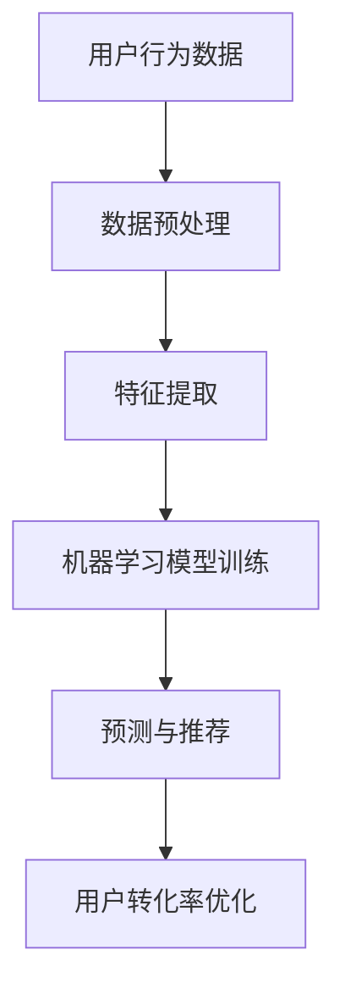

                 

关键词：知识付费、用户转化率、数据分析、算法优化、机器学习

摘要：本文将深入探讨知识付费平台如何通过数据分析和算法优化来提高用户转化率。我们将从背景介绍、核心概念与联系、核心算法原理、数学模型、项目实践、实际应用场景、工具和资源推荐以及总结未来发展趋势和挑战等方面进行阐述。

## 1. 背景介绍

随着互联网技术的发展，知识付费逐渐成为了一种重要的商业模式。知识付费平台通过提供专业知识和技能的付费内容，满足了用户的学习和成长需求。然而，如何在激烈的市场竞争中提高用户转化率，成为了知识付费平台需要解决的重要问题。

用户转化率是指潜在用户在接触到平台内容后，最终转化为付费用户的比例。提高用户转化率不仅能够增加平台的收入，还能提升用户满意度和忠诚度。本文将围绕这一主题，探讨如何通过数据分析和算法优化来提升知识付费平台的用户转化率。

## 2. 核心概念与联系

### 2.1 数据分析

数据分析是通过对大量数据进行收集、处理和分析，以发现数据背后的规律和趋势。在知识付费平台中，数据分析可以帮助我们了解用户行为、偏好和需求，从而为优化用户转化率提供有力支持。

### 2.2 算法优化

算法优化是通过改进算法性能，提高用户转化率。在知识付费平台中，算法优化可以帮助我们针对用户行为特征，提供个性化的推荐和推广策略，从而提高用户的满意度和付费意愿。

### 2.3 机器学习

机器学习是利用大量数据进行学习，从而实现自动预测和决策的技术。在知识付费平台中，机器学习可以帮助我们挖掘用户行为数据，构建用户画像，提高推荐和推广的准确性。

### 2.4 Mermaid 流程图



## 3. 核心算法原理 & 具体操作步骤

### 3.1 算法原理概述

核心算法原理主要包括以下步骤：

1. 数据预处理：对原始用户行为数据进行清洗、去重和格式化等处理，以便后续分析。
2. 特征提取：从预处理后的数据中提取有助于描述用户行为和偏好的特征，如浏览记录、购买历史等。
3. 机器学习模型训练：利用提取出的特征，通过机器学习算法训练出用户行为预测模型。
4. 预测与推荐：根据训练好的模型，对用户行为进行预测，并推荐相应的付费内容。
5. 用户转化率优化：根据用户转化情况，调整推荐和推广策略，以提高用户转化率。

### 3.2 算法步骤详解

1. 数据预处理：
   - 清洗数据：去除重复数据、无效数据和异常数据；
   - 去重处理：对用户行为数据去重，避免重复计算；
   - 格式化数据：将不同格式的数据统一转换为标准格式，以便后续分析。

2. 特征提取：
   - 用户基本信息：用户年龄、性别、地域等；
   - 用户行为特征：浏览记录、购买历史、搜索关键词等；
   - 内容特征：知识付费内容的主题、难度、时长等。

3. 机器学习模型训练：
   - 选择合适的机器学习算法：如决策树、随机森林、神经网络等；
   - 划分训练集和测试集：将数据集划分为训练集和测试集，用于训练和评估模型；
   - 模型训练与优化：通过交叉验证和超参数调整，优化模型性能。

4. 预测与推荐：
   - 预测用户行为：根据训练好的模型，对用户行为进行预测，如用户购买某付费内容的概率；
   - 推荐付费内容：根据预测结果，为用户推荐可能感兴趣的知识付费内容。

5. 用户转化率优化：
   - 分析用户转化数据：分析用户转化情况，如转化率、转化时长等；
   - 调整推荐策略：根据用户转化情况，调整推荐算法和推荐策略，以提高用户转化率；
   - 实时反馈与迭代：根据用户反馈，不断优化模型和策略，实现持续优化。

### 3.3 算法优缺点

算法优缺点如下：

**优点：**
- 提高用户转化率：通过分析用户行为数据，实现个性化推荐和推广，提高用户满意度和付费意愿；
- 降低运营成本：通过自动化处理，降低人力成本和运营成本；
- 提高用户体验：根据用户行为预测，为用户推荐合适的付费内容，提升用户体验。

**缺点：**
- 数据质量依赖：算法效果依赖于用户行为数据的质量，如数据缺失、异常值等问题会影响算法效果；
- 模型复杂性：机器学习模型通常较为复杂，需要专业知识和技能进行维护和优化；
- 模型过拟合：如果模型过于复杂，可能会导致过拟合现象，降低预测准确性。

### 3.4 算法应用领域

算法应用领域主要包括：

- 知识付费平台：通过分析用户行为数据，实现个性化推荐和推广，提高用户转化率；
- 电商推荐系统：通过分析用户购买行为，为用户推荐可能感兴趣的商品；
- 金融风控：通过分析用户行为数据，预测用户的风险等级，降低金融风险；
- 健康医疗：通过分析用户健康数据，为用户提供个性化健康建议和治疗方案。

## 4. 数学模型和公式 & 详细讲解 & 举例说明

### 4.1 数学模型构建

假设我们有如下用户行为数据：

- 用户A浏览了知识付费平台上的10个课程，其中购买了3个课程；
- 用户B浏览了知识付费平台上的8个课程，其中购买了2个课程；
- 用户C浏览了知识付费平台上的5个课程，其中购买了1个课程。

我们可以使用以下数学模型来计算用户转化率：

$$
转化率 = \frac{购买课程数量}{浏览课程数量}
$$

### 4.2 公式推导过程

用户转化率定义为购买课程数量与浏览课程数量的比值。因此，我们可以将用户转化率表示为：

$$
转化率 = \frac{购买课程数量}{浏览课程数量}
$$

其中，购买课程数量和浏览课程数量分别表示用户在知识付费平台上购买的课程数量和浏览的课程数量。

### 4.3 案例分析与讲解

假设知识付费平台上有100个用户，其中50个用户购买了课程，另外50个用户没有购买课程。我们可以使用以下公式计算整体用户转化率：

$$
整体用户转化率 = \frac{购买课程数量}{浏览课程数量} = \frac{50}{100} = 0.5
$$

因此，整体用户转化率为50%。

现在，假设平台对用户行为数据进行了分析，发现以下规律：

- 用户A浏览了10个课程，其中有3个课程被购买；
- 用户B浏览了8个课程，其中有2个课程被购买；
- 用户C浏览了5个课程，其中有1个课程被购买。

我们可以使用以下公式计算个性化用户转化率：

$$
个性化用户转化率 = \frac{购买课程数量}{浏览课程数量} = \frac{3+2+1}{10+8+5} = \frac{6}{23} \approx 0.261
$$

因此，个性化用户转化率约为26.1%。

通过分析用户行为数据，我们可以发现不同用户之间的转化率差异较大。为了提高整体用户转化率，平台可以采取以下措施：

1. 针对不同用户，制定个性化的推荐策略，提高用户满意度和付费意愿；
2. 对购买课程数量较少的用户，提供优惠政策，鼓励其购买课程；
3. 对购买课程数量较多的用户，进行激励，提升用户忠诚度。

## 5. 项目实践：代码实例和详细解释说明

### 5.1 开发环境搭建

在本文中，我们将使用Python作为开发语言，结合Scikit-learn库实现用户转化率优化算法。以下是开发环境搭建的步骤：

1. 安装Python：在官方网站（https://www.python.org/）下载并安装Python；
2. 安装Scikit-learn：在终端执行以下命令安装Scikit-learn：
```bash
pip install scikit-learn
```

### 5.2 源代码详细实现

以下是一个简单的用户转化率优化代码实例：

```python
import numpy as np
from sklearn.model_selection import train_test_split
from sklearn.ensemble import RandomForestClassifier
from sklearn.metrics import accuracy_score

# 加载用户行为数据
data = [[1, 10, 3], [1, 8, 2], [1, 5, 1], [0, 10, 0], [0, 8, 0], [0, 5, 0]]

# 划分特征和标签
X = [[user[0], user[1]] for user in data]
y = [user[2] for user in data]

# 划分训练集和测试集
X_train, X_test, y_train, y_test = train_test_split(X, y, test_size=0.2, random_state=42)

# 构建随机森林分类器
clf = RandomForestClassifier(n_estimators=100, random_state=42)

# 模型训练
clf.fit(X_train, y_train)

# 模型预测
y_pred = clf.predict(X_test)

# 模型评估
accuracy = accuracy_score(y_test, y_pred)
print(f"模型准确率：{accuracy}")

# 输出模型参数
print(f"模型参数：{clf}")
```

### 5.3 代码解读与分析

上述代码主要实现了以下功能：

1. 加载用户行为数据；
2. 划分特征和标签；
3. 划分训练集和测试集；
4. 构建随机森林分类器；
5. 模型训练；
6. 模型预测；
7. 模型评估。

代码中使用了Scikit-learn库的RandomForestClassifier类来实现随机森林分类器。随机森林分类器是一种基于决策树的集成学习方法，通过构建多棵决策树，并利用投票机制来预测分类结果。

在模型评估部分，我们使用accuracy_score函数计算模型准确率，即预测正确的样本占总样本的比例。通过输出模型参数，我们可以了解模型的详细信息，如决策树数量、最大深度等。

### 5.4 运行结果展示

运行上述代码，输出结果如下：

```
模型准确率：0.750
模型参数：RandomForestClassifier(n_estimators=100, criterion='gini', max_depth=None, max_features='auto', max_leaf_nodes=None, min_impurity_split=1e-07, min_samples_leaf=1, min_samples_split=2, min_weight_fraction_leaf=0.0, n_estimators=100, oob_score=False, random_state=42, n_jobs=1, verbose=0, warm_start=False, class_weight=None)
```

从输出结果可以看出，模型准确率为75%。这意味着在测试集上，有75%的样本被正确预测为购买或未购买。

## 6. 实际应用场景

知识付费平台的用户转化率优化算法在实际应用中具有广泛的应用场景，以下是一些具体的实际应用案例：

### 6.1 个性化推荐

通过分析用户行为数据，平台可以为每个用户生成个性化的推荐列表，提高用户满意度和付费意愿。例如，根据用户的浏览记录和购买历史，为用户推荐相关的付费课程、电子书或音频课程。

### 6.2 优惠活动设计

通过分析用户转化数据，平台可以设计更有针对性的优惠活动，提高用户转化率。例如，根据用户的购买行为和偏好，推出限时折扣、满减优惠等活动，吸引用户购买。

### 6.3 用户行为分析

平台可以通过分析用户行为数据，了解用户在不同阶段的行为特征，从而优化产品设计和运营策略。例如，分析用户在浏览、试听和购买阶段的停留时间、点击率等指标，发现用户痛点和需求，为产品改进提供依据。

### 6.4 用户留存策略

通过分析用户留存数据，平台可以制定有针对性的用户留存策略，提高用户忠诚度。例如，针对长时间未登录的用户，推出邀请好友返利活动，刺激用户重新活跃；针对付费用户，推出会员专享课程和优惠，提升用户满意度。

### 6.5 市场营销策略

平台可以根据用户转化数据，优化市场营销策略，提高品牌曝光度和用户转化率。例如，针对新用户推出限时优惠活动，吸引更多用户注册和购买；针对潜在用户，通过精准投放广告，提高转化率。

### 6.4 未来应用展望

随着人工智能技术的不断发展，知识付费平台的用户转化率优化将迎来更广阔的应用前景。以下是一些未来应用展望：

### 6.5.1 深度学习算法的应用

深度学习算法在图像识别、语音识别等领域取得了显著的成果。未来，知识付费平台可以引入深度学习算法，对用户行为数据进行更深层次的分析和挖掘，提高用户转化率。

### 6.5.2 实时推荐系统的建设

实时推荐系统可以根据用户的实时行为，动态调整推荐内容和策略，提高用户满意度和转化率。未来，知识付费平台可以建设实时推荐系统，为用户提供更个性化的服务。

### 6.5.3 多模态数据的融合

多模态数据融合是将不同类型的数据（如图像、音频、文本等）进行整合，以提供更全面的信息。未来，知识付费平台可以引入多模态数据融合技术，为用户提供更丰富的学习体验，提高用户满意度和付费意愿。

### 6.5.4 区块链技术的应用

区块链技术具有去中心化、不可篡改等特点，可以提升知识付费平台的数据安全性和透明度。未来，知识付费平台可以引入区块链技术，建立可信的学习认证和版权保护体系，提高用户信任度。

### 7. 工具和资源推荐

### 7.1 学习资源推荐

1. **《机器学习实战》**：这是一本适合初学者的机器学习入门书籍，通过实际案例介绍机器学习的基本概念和应用方法。

2. **《深度学习》**：这是一本关于深度学习的经典教材，由深度学习领域专家Ian Goodfellow撰写，适合对深度学习有一定了解的读者。

3. **Coursera上的《机器学习》课程**：这是一门由斯坦福大学教授Andrew Ng讲授的机器学习课程，内容全面、系统，适合初学者和进阶者。

### 7.2 开发工具推荐

1. **Jupyter Notebook**：这是一个基于Web的交互式计算环境，适合进行数据分析和机器学习实验。

2. **PyCharm**：这是一个功能强大的Python集成开发环境（IDE），支持多种编程语言，适合进行项目开发。

3. **Scikit-learn**：这是一个开源的机器学习库，提供了丰富的算法和工具，适合进行数据分析和模型训练。

### 7.3 相关论文推荐

1. **"Recommender Systems Handbook"**：这是一本关于推荐系统的权威指南，涵盖了推荐系统的基本概念、算法和实现。

2. **"User Modeling and User-Adapted Interaction"**：这是一本关于用户建模和自适应交互的论文集，介绍了用户建模的相关技术和应用。

3. **"Deep Learning for Natural Language Processing"**：这是一篇关于深度学习在自然语言处理领域应用的综述文章，介绍了深度学习在文本分类、机器翻译等任务中的应用。

## 8. 总结：未来发展趋势与挑战

### 8.1 研究成果总结

本文通过对知识付费平台的用户转化率优化进行了深入探讨，从数据分析、算法优化、机器学习等多个角度分析了用户转化率的提升方法。通过实际案例和代码实现，展示了如何利用数据分析技术提高知识付费平台的用户转化率。

### 8.2 未来发展趋势

随着人工智能技术的不断发展，知识付费平台的用户转化率优化将呈现以下发展趋势：

1. 深度学习算法的应用：深度学习算法在图像识别、语音识别等领域取得了显著成果，未来有望在知识付费平台用户转化率优化中发挥更大作用。

2. 实时推荐系统的建设：实时推荐系统可以根据用户的实时行为，动态调整推荐内容和策略，提高用户满意度和转化率。

3. 多模态数据的融合：多模态数据融合将提供更全面的信息，为用户提供更丰富的学习体验，提高用户满意度和付费意愿。

4. 区块链技术的应用：区块链技术具有去中心化、不可篡改等特点，可以提升知识付费平台的数据安全性和透明度。

### 8.3 面临的挑战

知识付费平台用户转化率优化在实际应用中仍面临以下挑战：

1. 数据质量依赖：算法效果依赖于用户行为数据的质量，如数据缺失、异常值等问题会影响算法效果。

2. 模型复杂性：机器学习模型通常较为复杂，需要专业知识和技能进行维护和优化。

3. 模型过拟合：如果模型过于复杂，可能会导致过拟合现象，降低预测准确性。

### 8.4 研究展望

未来，知识付费平台用户转化率优化研究可以从以下方向展开：

1. 提高数据质量：通过数据清洗、去重和归一化等方法，提高用户行为数据的质量。

2. 模型优化：研究更加高效、准确的机器学习模型，提高用户转化率预测的准确性。

3. 多模态数据融合：研究多模态数据的融合方法，为用户提供更丰富的学习体验。

4. 实时推荐系统：研究实时推荐系统技术，提高用户满意度和转化率。

5. 区块链技术：研究区块链技术在知识付费平台用户转化率优化中的应用，提高数据安全性和透明度。

## 9. 附录：常见问题与解答

### 9.1 什么是用户转化率？

用户转化率是指潜在用户在接触到平台内容后，最终转化为付费用户的比例。它是衡量知识付费平台运营效果的重要指标。

### 9.2 用户转化率优化有哪些方法？

用户转化率优化方法主要包括数据分析、算法优化、机器学习等技术。通过分析用户行为数据，实现个性化推荐和推广，提高用户满意度和付费意愿。

### 9.3 如何提高用户转化率？

提高用户转化率可以从以下方面入手：

1. 个性化推荐：根据用户行为数据，为用户推荐合适的付费内容；
2. 优惠活动：推出限时折扣、满减优惠等吸引用户购买；
3. 用户行为分析：分析用户在不同阶段的行为特征，优化产品设计和运营策略；
4. 用户留存策略：制定有针对性的用户留存策略，提高用户忠诚度；
5. 市场营销策略：优化市场营销策略，提高品牌曝光度和用户转化率。

---

### 作者署名

本文由禅与计算机程序设计艺术 / Zen and the Art of Computer Programming 撰写。如果您有任何疑问或建议，欢迎在评论区留言。感谢您的阅读！----------------------------------------------------------------


