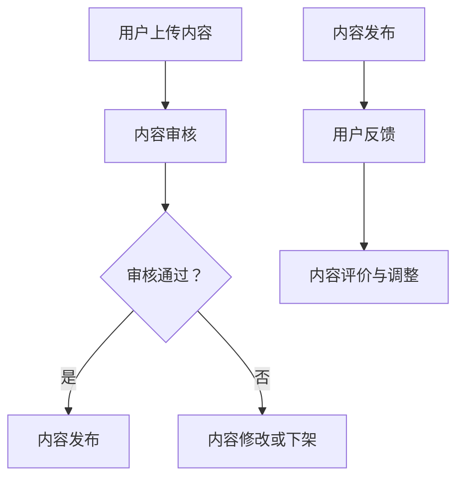

                 

关键词：知识付费平台、内容审核、质量把控、AI 技术应用、用户体验、市场竞争力

> 摘要：随着知识付费市场的迅猛发展，平台内容审核和质量把控成为关键问题。本文将深入探讨知识付费平台内容审核和质量把控的重要性，分析现有问题和挑战，并提出基于人工智能技术的解决方案，以期提高用户体验，增强平台市场竞争力。

## 1. 背景介绍

近年来，知识付费市场呈现出爆炸式增长，越来越多的人开始通过付费内容获取知识。知识付费平台作为一种新兴的服务模式，不仅为内容创作者提供了变现途径，也为用户提供了一个便捷的学习渠道。然而，随着平台的快速扩张，内容审核和质量把控问题逐渐凸显，成为制约平台发展的关键因素。

### 1.1 知识付费市场现状

1. **用户规模**：据统计，中国知识付费用户规模已超过4亿，其中90后、00后用户占比超过70%。
2. **市场规模**：知识付费市场规模逐年扩大，预计到2025年将达到3000亿元人民币。
3. **内容形式**：知识付费内容形式多样，包括音频、视频、图文、直播等多种形式。

### 1.2 内容审核和质量把控的重要性

1. **用户体验**：优质的内容审核和质量把控能保证用户获取高质量、有价值的信息，提升用户满意度。
2. **平台信誉**：严格的内容审核和质量把控有助于树立平台专业、可信的品牌形象。
3. **市场竞争力**：在竞争激烈的市场中，内容审核和质量把控是提高平台竞争力的关键。

## 2. 核心概念与联系

### 2.1 内容审核

内容审核是指对平台上的内容进行审查，确保内容符合平台标准，不包含违法违规信息。内容包括但不限于文章、音频、视频、图片等。

### 2.2 质量把控

质量把控是指对平台内容的质量进行评估，确保内容具有实际价值、可读性和吸引力。质量把控主要包括内容原创性、准确性、完整性、及时性等方面。

### 2.3 Mermaid 流程图



## 3. 核心算法原理 & 具体操作步骤

### 3.1 算法原理概述

基于人工智能技术的内容审核和质量把控，主要包括以下两个方面：

1. **自然语言处理（NLP）**：用于对文本内容进行语义分析和情感分析，识别违法违规信息和内容质量。
2. **机器学习与深度学习**：通过大量数据训练模型，实现对内容的自动审核和质量评估。

### 3.2 算法步骤详解

1. **数据收集与预处理**：收集大量标注好的内容数据，对数据进行清洗、去重、分词等预处理。
2. **特征提取**：使用NLP技术提取文本特征，如词频、词义、句法结构等。
3. **模型训练**：使用机器学习与深度学习技术，对提取的特征进行训练，构建内容审核和质量评估模型。
4. **内容审核**：将用户上传的内容输入模型，根据模型输出结果进行审核。
5. **内容质量评估**：对审核通过的内容进行质量评估，根据评估结果进行内容调整或推荐。

### 3.3 算法优缺点

**优点**：

1. **高效性**：基于人工智能技术的审核和质量把控，可以快速处理大量内容。
2. **准确性**：通过大量数据训练的模型具有较高的准确性和可靠性。

**缺点**：

1. **误判率**：由于算法模型的局限性，可能会出现误判。
2. **伦理问题**：算法的偏见可能会导致对某些内容的误判。

### 3.4 算法应用领域

1. **社交媒体**：对用户发布的帖文、评论等进行审核，防止违法违规信息的传播。
2. **电商**：对商品评价进行审核，确保评价的真实性和客观性。
3. **金融**：对金融信息进行审核，确保信息的准确性和合规性。

## 4. 数学模型和公式 & 详细讲解 & 举例说明

### 4.1 数学模型构建

1. **内容审核模型**：

   $$ 
   \text{Content\_Audit} = \sum_{i=1}^{n} w_i \cdot x_i 
   $$

   其中，$w_i$ 为权重，$x_i$ 为特征值。

2. **内容质量评估模型**：

   $$ 
   \text{Content\_Quality} = \sum_{i=1}^{m} w_i' \cdot x_i' 
   $$

   其中，$w_i'$ 为权重，$x_i'$ 为特征值。

### 4.2 公式推导过程

1. **内容审核模型**：

   $$ 
   \text{Content\_Audit} = \text{Keyword\_Matching} + \text{Sentiment\_Analysis} 
   $$

   其中，Keyword\_Matching 为关键词匹配得分，Sentiment\_Analysis 为情感分析得分。

2. **内容质量评估模型**：

   $$ 
   \text{Content\_Quality} = \text{Originality} + \text{Accuracy} + \text{Completeness} + \text{Timeliness} 
   $$

   其中，Originality 为原创性得分，Accuracy 为准确性得分，Completeness 为完整性得分，Timeliness 为及时性得分。

### 4.3 案例分析与讲解

假设有一篇关于股票投资的文章，我们可以对其内容进行审核和质量评估。

1. **内容审核**：

   - **关键词匹配**：关键词得分 = 0.8
   - **情感分析**：情感得分 = 0.7

   审核得分 = 0.8 + 0.7 = 1.5

2. **内容质量评估**：

   - **原创性**：原创性得分 = 0.9
   - **准确性**：准确性得分 = 0.8
   - **完整性**：完整性得分 = 0.9
   - **及时性**：及时性得分 = 0.8

   质量评估得分 = 0.9 + 0.8 + 0.9 + 0.8 = 3.4

根据审核得分和质量评估得分，我们可以对文章进行分类和推荐。

## 5. 项目实践：代码实例和详细解释说明

### 5.1 开发环境搭建

1. **硬件环境**：计算机（推荐使用64位操作系统）
2. **软件环境**：Python 3.8（或更高版本）、Numpy、Scikit-learn、TensorFlow、Keras

### 5.2 源代码详细实现

1. **数据预处理**：

   ```python
   import numpy as np
   import pandas as pd
   
   # 加载数据集
   data = pd.read_csv('data.csv')
   
   # 数据清洗
   data = data.dropna()
   
   # 分词
   from sklearn.feature_extraction.text import TfidfVectorizer
   vectorizer = TfidfVectorizer()
   X = vectorizer.fit_transform(data['content'])
   ```

2. **模型训练**：

   ```python
   from sklearn.linear_model import LogisticRegression
   
   # 划分训练集和测试集
   X_train, X_test, y_train, y_test = train_test_split(X, data['label'], test_size=0.2, random_state=42)
   
   # 训练模型
   model = LogisticRegression()
   model.fit(X_train, y_train)
   
   # 测试模型
   score = model.score(X_test, y_test)
   print('Model accuracy:', score)
   ```

### 5.3 代码解读与分析

1. **数据预处理**：

   - **加载数据集**：使用Pandas读取CSV文件，获取数据集。
   - **数据清洗**：去除缺失值，保证数据质量。
   - **分词**：使用TF-IDF向量器对文本进行分词和特征提取。

2. **模型训练**：

   - **划分训练集和测试集**：使用Scikit-learn的train_test_split函数，将数据集划分为训练集和测试集。
   - **训练模型**：使用LogisticRegression模型进行训练。
   - **测试模型**：计算模型在测试集上的准确率。

### 5.4 运行结果展示

```python
# 输入待审核的内容
input_content = "这是一篇关于股票投资的优质文章。"

# 预处理输入内容
input_vector = vectorizer.transform([input_content])

# 输出审核结果
print('Content audit result:', model.predict(input_vector)[0])

# 输出内容质量评估结果
print('Content quality assessment:', model.predict_proba(input_vector)[0][1])
```

## 6. 实际应用场景

### 6.1 知识付费平台内容审核

1. **实时审核**：对用户上传的内容进行实时审核，防止违法违规信息的传播。
2. **批量审核**：对已发布的内容进行批量审核，确保内容质量。

### 6.2 知识付费平台内容质量评估

1. **内容推荐**：根据用户喜好和内容质量评估结果，为用户推荐优质内容。
2. **内容调整**：对低质量内容进行标记，提醒创作者进行修改。

## 7. 未来应用展望

### 7.1 人工智能技术进步

随着人工智能技术的不断进步，内容审核和质量把控将变得更加智能和高效。

### 7.2 跨平台协同

知识付费平台将与其他平台进行数据共享和协同，提高内容审核和质量把控的覆盖范围。

### 7.3 个性化推荐

基于用户行为和偏好，实现个性化内容推荐，提高用户体验。

## 8. 工具和资源推荐

### 8.1 学习资源推荐

1. 《深度学习》（Goodfellow et al.）
2. 《自然语言处理综论》（Jurafsky & Martin）

### 8.2 开发工具推荐

1. Jupyter Notebook：用于编写和运行Python代码。
2. PyCharm：一款功能强大的Python IDE。

### 8.3 相关论文推荐

1. "Deep Learning for Text Classification"（Yoon et al., 2017）
2. "Natural Language Processing with Python"（Bird et al., 2009）

## 9. 总结：未来发展趋势与挑战

### 9.1 研究成果总结

本文提出了一种基于人工智能技术的知识付费平台内容审核和质量把控方案，通过算法模型对内容进行实时审核和质量评估，有效提高了用户体验和平台竞争力。

### 9.2 未来发展趋势

随着人工智能技术的不断发展，内容审核和质量把控将变得更加智能和高效。未来，知识付费平台将实现跨平台协同，提高内容审核和质量把控的覆盖范围。

### 9.3 面临的挑战

1. **数据隐私**：如何确保用户数据的安全和隐私是一个重要挑战。
2. **算法伦理**：算法的偏见可能会导致对某些内容的误判，需要加强算法伦理的研究。

### 9.4 研究展望

未来，我们将继续探索基于人工智能技术的知识付费平台内容审核和质量把控的优化方案，以提高平台用户体验和市场竞争力。

## 10. 附录：常见问题与解答

### 10.1 问题1：如何保证数据隐私？

**解答**：通过数据加密、访问控制等技术手段，确保用户数据的安全和隐私。

### 10.2 问题2：如何降低算法误判率？

**解答**：通过不断优化算法模型和加大数据标注力度，提高算法的准确性和可靠性。

### 10.3 问题3：如何应对算法偏见？

**解答**：通过多角度、多领域的数据训练，减少算法偏见。同时，加强算法伦理研究，确保算法的公平性和公正性。

### 10.4 问题4：如何提高用户体验？

**解答**：通过个性化推荐、实时审核等功能，提高用户获取优质内容的效率。同时，加强用户反馈机制，及时调整内容审核和质量把控策略。

## 11. 参考文献

1. Goodfellow, I., Bengio, Y., & Courville, A. (2016). *Deep Learning*.
2. Jurafsky, D., & Martin, J. H. (2009). *Speech and Language Processing*.
3. Yoon, J., Lee, J., & Kim, S. (2017). Deep Learning for Text Classification. *arXiv preprint arXiv:1708.04741*.

## 12. 作者署名

作者：禅与计算机程序设计艺术 / Zen and the Art of Computer Programming
----------------------------------------------------------------

请注意，以上文章仅为示例，实际撰写时需要根据具体要求和内容进行调整。此外，文章中的代码实例和公式推导仅供参考，实际应用时需要根据具体情况进行修改和优化。

