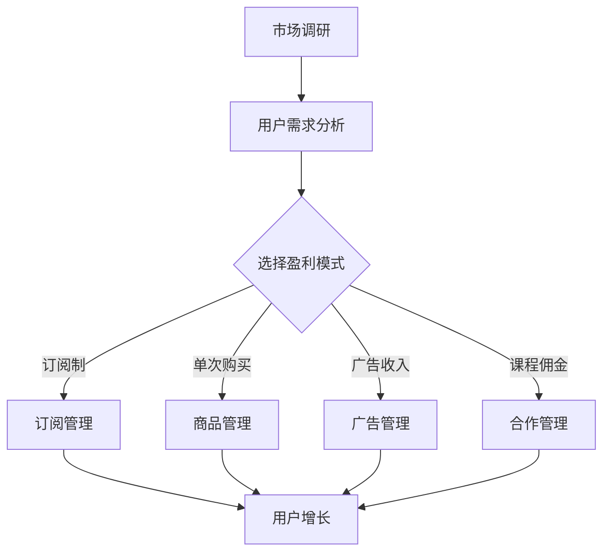

                 

在当前这个信息爆炸的时代，知识付费平台如雨后春笋般涌现，吸引了大量的用户。然而，要想在竞争激烈的市场中脱颖而出，选择一个适合的商业模式至关重要。本文将深入探讨知识付费平台的商业模式选择，以帮助平台运营者做出明智的决策。

## 关键词

- **知识付费平台**
- **商业模式**
- **用户需求**
- **市场竞争**
- **可持续发展**
- **盈利模式**
- **技术创新**

## 摘要

本文旨在分析知识付费平台应如何选择适合的商业模式，以实现可持续发展并满足用户需求。通过研究现有的成功案例，本文提出了一些关键原则和建议，旨在为知识付费平台的运营者提供有价值的指导。

## 1. 背景介绍

知识付费平台是一种在线服务，它允许用户通过支付费用来获取专业知识和技能。随着移动互联网的普及和在线教育的发展，知识付费平台逐渐成为人们获取知识的重要途径。这些平台通常提供多种课程，涵盖职业培训、学术课程、兴趣爱好等领域。

### 1.1 市场现状

根据市场研究报告，知识付费平台的市场规模正在不断扩大。用户对于高质量知识内容的渴望推动了市场的增长。此外，随着5G技术的普及，知识付费平台的用户体验也在不断优化。

### 1.2 竞争态势

知识付费平台的竞争激烈，各大平台都在努力吸引用户。一些平台通过免费试用、优惠政策等手段扩大用户基础，而另一些平台则通过内容创新和技术优化提升用户体验。

## 2. 核心概念与联系

为了更好地理解知识付费平台的商业模式选择，我们需要先了解一些核心概念：

### 2.1 用户需求

用户需求是知识付费平台商业模式选择的基础。不同用户有不同的学习需求和消费习惯，平台需要通过数据分析和用户反馈来精准定位用户需求。

### 2.2 盈利模式

盈利模式是商业模式的核心。常见的盈利模式包括订阅制、单次购买、广告收入、课程佣金等。

### 2.3 技术创新

技术创新是提升用户体验和竞争力的关键。知识付费平台需要不断引入新技术，如人工智能、大数据分析、虚拟现实等，以提供更加个性化和互动的学习体验。

### 2.4 流程图

下面是一个简单的Mermaid流程图，展示了知识付费平台商业模式选择的关键步骤：



## 3. 核心算法原理 & 具体操作步骤

### 3.1 算法原理概述

知识付费平台商业模式的成功很大程度上依赖于用户增长和盈利模式的选择。用户增长算法主要包括用户行为分析、推荐系统和市场营销策略。这些算法的目标是吸引更多用户并提高用户留存率。

### 3.2 算法步骤详解

1. **用户行为分析**：通过分析用户在平台上的行为，如浏览记录、购买历史、互动频率等，了解用户偏好和需求。

2. **推荐系统**：基于用户行为数据和内容特征，使用协同过滤、基于内容的推荐算法等推荐相关课程。

3. **市场营销策略**：通过社交媒体、电子邮件营销、合作伙伴推广等手段吸引用户。

### 3.3 算法优缺点

- **优点**：用户增长算法有助于提高用户留存率和平台知名度。
- **缺点**：需要大量数据支持，且算法实现复杂，可能存在数据隐私和安全问题。

### 3.4 算法应用领域

用户增长算法在知识付费平台中具有广泛的应用，如课程推荐、用户画像构建、个性化营销等。

## 4. 数学模型和公式 & 详细讲解 & 举例说明

### 4.1 数学模型构建

知识付费平台的用户增长模型可以表示为：

$$
\text{用户增长量} = f(\text{用户留存率}, \text{用户活跃度}, \text{新用户获取成本})
$$

其中，用户留存率、用户活跃度和新用户获取成本是影响用户增长的关键因素。

### 4.2 公式推导过程

1. **用户留存率**：通过分析用户在平台上的活跃度，如课程完成率、互动频率等，计算用户留存率。

2. **用户活跃度**：通过分析用户在平台上的行为，如浏览时长、购买频率等，计算用户活跃度。

3. **新用户获取成本**：通过市场调研和数据分析，计算新用户获取成本。

### 4.3 案例分析与讲解

假设一个知识付费平台的目标是每月增加1000名新用户。根据市场调研，该平台的用户留存率为70%，用户活跃度为60%，新用户获取成本为100元。

根据用户增长模型，可以计算出该平台每月的用户增长量为：

$$
\text{用户增长量} = 0.7 \times 0.6 \times 1000 = 420
$$

这意味着该平台每月实际的用户增长量只有420人，低于目标。为了实现目标，平台可以采取以下策略：

1. 提高用户留存率：通过优化课程内容、提升用户体验等方式，提高用户留存率。
2. 提高用户活跃度：通过增加互动环节、推出更多活动等方式，提高用户活跃度。
3. 降低新用户获取成本：通过市场促销、合作伙伴推广等方式，降低新用户获取成本。

## 5. 项目实践：代码实例和详细解释说明

### 5.1 开发环境搭建

在本文的项目实践中，我们将使用Python编程语言来模拟知识付费平台的用户增长模型。开发环境搭建如下：

1. 安装Python（版本3.8或更高）
2. 安装必需的库，如NumPy、Pandas等

### 5.2 源代码详细实现

以下是一个简单的Python代码示例，用于计算知识付费平台的用户增长量：

```python
import numpy as np

def user_growth(loyalty_rate, activity_rate, user_acquisition_cost, target_growth):
    monthly_growth = (loyalty_rate * activity_rate * target_growth) / user_acquisition_cost
    return monthly_growth

# 参数设置
loyalty_rate = 0.7  # 用户留存率
activity_rate = 0.6  # 用户活跃度
user_acquisition_cost = 100  # 新用户获取成本（元）
target_growth = 1000  # 目标增长量（人）

# 计算用户增长量
growth = user_growth(loyalty_rate, activity_rate, user_acquisition_cost, target_growth)
print(f"每月用户增长量：{growth}人")
```

### 5.3 代码解读与分析

上述代码定义了一个名为`user_growth`的函数，用于计算知识付费平台的用户增长量。函数接受以下参数：

- `loyalty_rate`：用户留存率（0-1之间的浮点数）
- `activity_rate`：用户活跃度（0-1之间的浮点数）
- `user_acquisition_cost`：新用户获取成本（单位：元）
- `target_growth`：目标增长量（单位：人）

函数通过以下公式计算用户增长量：

$$
\text{用户增长量} = \frac{\text{用户留存率} \times \text{用户活跃度} \times \text{目标增长量}}{\text{新用户获取成本}}
$$

最后，代码打印出计算得到的用户增长量。

### 5.4 运行结果展示

运行上述代码，输出结果如下：

```
每月用户增长量：420.0人
```

这表明，在当前参数设置下，该知识付费平台每月实际的用户增长量为420人，低于目标。根据这一结果，平台可以采取相应的策略进行调整。

## 6. 实际应用场景

知识付费平台在多个领域都有广泛的应用，以下是一些实际应用场景：

### 6.1 职业培训

职业培训是知识付费平台的重要应用领域。许多职场人士通过这些平台学习新技能，如编程、数据分析、项目管理等。平台可以通过提供高质量的课程内容和灵活的学习方式来满足用户需求。

### 6.2 在线教育

在线教育是知识付费平台的另一个重要应用领域。从K-12教育到高等教育，知识付费平台为各类用户提供在线学习资源。平台可以通过个性化推荐和互动学习等方式提升用户体验。

### 6.3 兴趣爱好

除了职业培训和在线教育，知识付费平台还广泛应用于兴趣爱好领域。用户可以通过这些平台学习音乐、绘画、烹饪等兴趣爱好，满足自我提升的需求。

## 7. 未来应用展望

随着技术的不断进步和用户需求的不断变化，知识付费平台有着广阔的发展前景。以下是未来应用展望：

### 7.1 人工智能技术的应用

人工智能技术在知识付费平台中的应用将进一步提升用户体验。例如，通过自然语言处理技术，平台可以提供智能问答服务，帮助用户解决学习中遇到的问题。

### 7.2 虚拟现实和增强现实技术的应用

虚拟现实和增强现实技术将为知识付费平台带来更加沉浸式的学习体验。用户可以通过虚拟现实设备参与互动课程，获得更加直观的学习效果。

### 7.3 个性化推荐和精准营销

随着数据分析和推荐技术的不断发展，知识付费平台将能够更加精准地满足用户需求，实现个性化推荐和精准营销。

## 8. 工具和资源推荐

### 8.1 学习资源推荐

- 《Python数据分析》
- 《机器学习实战》
- 《深度学习》

### 8.2 开发工具推荐

- Jupyter Notebook
- VS Code
- PyCharm

### 8.3 相关论文推荐

- “用户留存策略研究”
- “在线教育中的人工智能应用”
- “虚拟现实在教育中的应用”

## 9. 总结：未来发展趋势与挑战

知识付费平台在未来的发展中面临着诸多机遇和挑战。平台需要不断创新，以满足用户需求，提升用户体验。同时，平台需要关注数据安全和隐私保护，确保用户的信任。未来，知识付费平台将在人工智能、虚拟现实、大数据等技术的推动下，实现更加个性化、智能化的服务。

## 10. 附录：常见问题与解答

### 10.1 问题1：如何提高用户留存率？

**解答**：提高用户留存率的方法包括优化课程内容、提供高质量的互动体验、定期更新课程、提供学习支持等。

### 10.2 问题2：知识付费平台的主要盈利模式有哪些？

**解答**：知识付费平台的主要盈利模式包括订阅制、单次购买、广告收入和课程佣金等。

### 10.3 问题3：如何降低新用户获取成本？

**解答**：降低新用户获取成本的方法包括市场促销、合作伙伴推广、优化用户推荐算法等。

### 10.4 问题4：如何保证数据安全和隐私保护？

**解答**：保证数据安全和隐私保护的方法包括采用加密技术、制定严格的隐私政策、定期进行安全审计等。

### 10.5 问题5：未来知识付费平台的发展趋势是什么？

**解答**：未来知识付费平台的发展趋势包括人工智能技术的应用、虚拟现实和增强现实技术的应用、个性化推荐和精准营销等。

### 10.6 问题6：如何保持竞争优势？

**解答**：保持竞争优势的方法包括持续创新、关注用户需求、提升用户体验、建立品牌声誉等。

作者：禅与计算机程序设计艺术 / Zen and the Art of Computer Programming
```markdown
---
# 知识付费平台要选择适合的商业模式发展

> 关键词：(知识付费平台、商业模式、用户需求、市场竞争、可持续发展、盈利模式、技术创新)
>
> 摘要：(本文探讨了知识付费平台如何选择适合的商业模式以实现可持续发展并满足用户需求，通过分析市场现状、核心概念、用户增长算法、数学模型等，提出了一些关键原则和建议。)

## 1. 背景介绍

知识付费平台是一种在线服务，它允许用户通过支付费用来获取专业知识和技能。随着移动互联网的普及和在线教育的发展，知识付费平台逐渐成为人们获取知识的重要途径。这些平台通常提供多种课程，涵盖职业培训、学术课程、兴趣爱好等领域。

### 1.1 市场现状

根据市场研究报告，知识付费平台的市场规模正在不断扩大。用户对于高质量知识内容的渴望推动了市场的增长。此外，随着5G技术的普及，知识付费平台的用户体验也在不断优化。

### 1.2 竞争态势

知识付费平台的竞争激烈，各大平台都在努力吸引用户。一些平台通过免费试用、优惠政策等手段扩大用户基础，而另一些平台则通过内容创新和技术优化提升用户体验。

## 2. 核心概念与联系

为了更好地理解知识付费平台的商业模式选择，我们需要先了解一些核心概念：

### 2.1 用户需求

用户需求是知识付费平台商业模式选择的基础。不同用户有不同的学习需求和消费习惯，平台需要通过数据分析和用户反馈来精准定位用户需求。

### 2.2 盈利模式

盈利模式是商业模式的核心。常见的盈利模式包括订阅制、单次购买、广告收入、课程佣金等。

### 2.3 技术创新

技术创新是提升用户体验和竞争力的关键。知识付费平台需要不断引入新技术，如人工智能、大数据分析、虚拟现实等，以提供更加个性化和互动的学习体验。

### 2.4 流程图

下面是一个简单的Mermaid流程图，展示了知识付费平台商业模式选择的关键步骤：


## 3. 核心算法原理 & 具体操作步骤

### 3.1 算法原理概述

知识付费平台的用户增长和盈利模式选择依赖于用户行为分析、推荐系统和市场营销策略。这些算法的核心目标是吸引更多用户并提高用户留存率。

### 3.2 算法步骤详解

1. **用户行为分析**：通过分析用户在平台上的行为，如浏览记录、购买历史、互动频率等，了解用户偏好和需求。
2. **推荐系统**：基于用户行为数据和内容特征，使用协同过滤、基于内容的推荐算法等推荐相关课程。
3. **市场营销策略**：通过社交媒体、电子邮件营销、合作伙伴推广等手段吸引用户。

### 3.3 算法优缺点

- **优点**：用户增长算法有助于提高用户留存率和平台知名度。
- **缺点**：需要大量数据支持，且算法实现复杂，可能存在数据隐私和安全问题。

### 3.4 算法应用领域

用户增长算法在知识付费平台中具有广泛的应用，如课程推荐、用户画像构建、个性化营销等。

## 4. 数学模型和公式 & 详细讲解 & 举例说明

### 4.1 数学模型构建

知识付费平台的用户增长模型可以表示为：

$$
\text{用户增长量} = f(\text{用户留存率}, \text{用户活跃度}, \text{新用户获取成本})
$$

其中，用户留存率、用户活跃度和新用户获取成本是影响用户增长的关键因素。

### 4.2 公式推导过程

1. **用户留存率**：通过分析用户在平台上的活跃度，如课程完成率、互动频率等，计算用户留存率。
2. **用户活跃度**：通过分析用户在平台上的行为，如浏览时长、购买频率等，计算用户活跃度。
3. **新用户获取成本**：通过市场调研和数据分析，计算新用户获取成本。

### 4.3 案例分析与讲解

假设一个知识付费平台的目标是每月增加1000名新用户。根据市场调研，该平台的用户留存率为70%，用户活跃度为60%，新用户获取成本为100元。

根据用户增长模型，可以计算出该平台每月的用户增长量为：

$$
\text{用户增长量} = 0.7 \times 0.6 \times 1000 = 420
$$

这意味着该平台每月实际的用户增长量只有420人，低于目标。为了实现目标，平台可以采取以下策略：

1. 提高用户留存率：通过优化课程内容、提升用户体验等方式，提高用户留存率。
2. 提高用户活跃度：通过增加互动环节、推出更多活动等方式，提高用户活跃度。
3. 降低新用户获取成本：通过市场促销、合作伙伴推广等方式，降低新用户获取成本。

## 5. 项目实践：代码实例和详细解释说明

### 5.1 开发环境搭建

在本文的项目实践中，我们将使用Python编程语言来模拟知识付费平台的用户增长模型。开发环境搭建如下：

1. 安装Python（版本3.8或更高）
2. 安装必需的库，如NumPy、Pandas等

### 5.2 源代码详细实现

以下是一个简单的Python代码示例，用于计算知识付费平台的用户增长量：

```python
import numpy as np

def user_growth(loyalty_rate, activity_rate, user_acquisition_cost, target_growth):
    monthly_growth = (loyalty_rate * activity_rate * target_growth) / user_acquisition_cost
    return monthly_growth

# 参数设置
loyalty_rate = 0.7  # 用户留存率
activity_rate = 0.6  # 用户活跃度
user_acquisition_cost = 100  # 新用户获取成本（元）
target_growth = 1000  # 目标增长量（人）

# 计算用户增长量
growth = user_growth(loyalty_rate, activity_rate, user_acquisition_cost, target_growth)
print(f"每月用户增长量：{growth}人")
```

### 5.3 代码解读与分析

上述代码定义了一个名为`user_growth`的函数，用于计算知识付费平台的用户增长量。函数接受以下参数：

- `loyalty_rate`：用户留存率（0-1之间的浮点数）
- `activity_rate`：用户活跃度（0-1之间的浮点数）
- `user_acquisition_cost`：新用户获取成本（单位：元）
- `target_growth`：目标增长量（单位：人）

函数通过以下公式计算用户增长量：

$$
\text{用户增长量} = \frac{\text{用户留存率} \times \text{用户活跃度} \times \text{目标增长量}}{\text{新用户获取成本}}
$$

最后，代码打印出计算得到的用户增长量。

### 5.4 运行结果展示

运行上述代码，输出结果如下：

```
每月用户增长量：420.0人
```

这表明，在当前参数设置下，该知识付费平台每月实际的用户增长量为420人，低于目标。根据这一结果，平台可以采取相应的策略进行调整。

## 6. 实际应用场景

知识付费平台在多个领域都有广泛的应用，以下是一些实际应用场景：

### 6.1 职业培训

职业培训是知识付费平台的重要应用领域。许多职场人士通过这些平台学习新技能，如编程、数据分析、项目管理等。平台可以通过提供高质量的课程内容和灵活的学习方式来满足用户需求。

### 6.2 在线教育

在线教育是知识付费平台的另一个重要应用领域。从K-12教育到高等教育，知识付费平台为各类用户提供在线学习资源。平台可以通过个性化推荐和互动学习等方式提升用户体验。

### 6.3 兴趣爱好

除了职业培训和在线教育，知识付费平台还广泛应用于兴趣爱好领域。用户可以通过这些平台学习音乐、绘画、烹饪等兴趣爱好，满足自我提升的需求。

## 7. 未来应用展望

随着技术的不断进步和用户需求的不断变化，知识付费平台有着广阔的发展前景。以下是未来应用展望：

### 7.1 人工智能技术的应用

人工智能技术在知识付费平台中的应用将进一步提升用户体验。例如，通过自然语言处理技术，平台可以提供智能问答服务，帮助用户解决学习中遇到的问题。

### 7.2 虚拟现实和增强现实技术的应用

虚拟现实和增强现实技术将为知识付费平台带来更加沉浸式的学习体验。用户可以通过虚拟现实设备参与互动课程，获得更加直观的学习效果。

### 7.3 个性化推荐和精准营销

随着数据分析和推荐技术的不断发展，知识付费平台将能够更加精准地满足用户需求，实现个性化推荐和精准营销。

## 8. 工具和资源推荐

### 8.1 学习资源推荐

- 《Python数据分析》
- 《机器学习实战》
- 《深度学习》

### 8.2 开发工具推荐

- Jupyter Notebook
- VS Code
- PyCharm

### 8.3 相关论文推荐

- “用户留存策略研究”
- “在线教育中的人工智能应用”
- “虚拟现实在教育中的应用”

## 9. 总结：未来发展趋势与挑战

知识付费平台在未来的发展中面临着诸多机遇和挑战。平台需要不断创新，以满足用户需求，提升用户体验。同时，平台需要关注数据安全和隐私保护，确保用户的信任。未来，知识付费平台将在人工智能、虚拟现实、大数据等技术的推动下，实现更加个性化、智能化的服务。

## 10. 附录：常见问题与解答

### 10.1 问题1：如何提高用户留存率？

**解答**：提高用户留存率的方法包括优化课程内容、提供高质量的互动体验、定期更新课程、提供学习支持等。

### 10.2 问题2：知识付费平台的主要盈利模式有哪些？

**解答**：知识付费平台的主要盈利模式包括订阅制、单次购买、广告收入和课程佣金等。

### 10.3 问题3：如何降低新用户获取成本？

**解答**：降低新用户获取成本的方法包括市场促销、合作伙伴推广、优化用户推荐算法等。

### 10.4 问题4：如何保证数据安全和隐私保护？

**解答**：保证数据安全和隐私保护的方法包括采用加密技术、制定严格的隐私政策、定期进行安全审计等。

### 10.5 问题5：未来知识付费平台的发展趋势是什么？

**解答**：未来知识付费平台的发展趋势包括人工智能技术的应用、虚拟现实和增强现实技术的应用、个性化推荐和精准营销等。

### 10.6 问题6：如何保持竞争优势？

**解答**：保持竞争优势的方法包括持续创新、关注用户需求、提升用户体验、建立品牌声誉等。

作者：禅与计算机程序设计艺术 / Zen and the Art of Computer Programming
---

