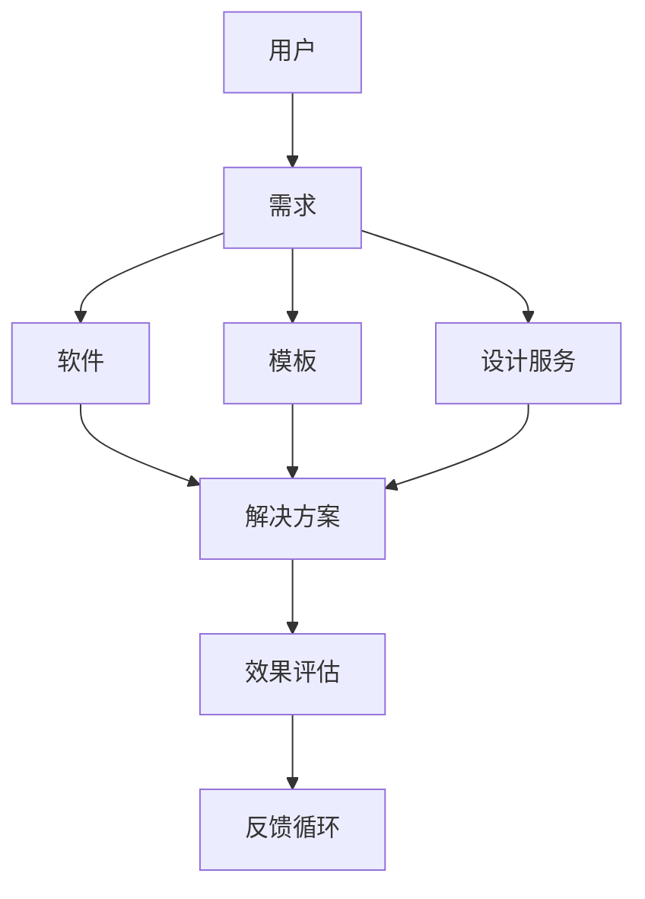

                 

关键词：知识付费、电商、软件出售、模板、设计服务、在线交易平台

摘要：本文将深入探讨知识付费电商领域，尤其是出售软件、模板、设计等服务的重要性和发展趋势。通过分析核心概念、算法原理、数学模型、项目实践和实际应用场景，本文旨在为读者提供一个全面的视角，以了解这个领域的现状和未来方向。

## 1. 背景介绍

知识付费电商是指通过在线平台销售各种知识和服务的商业模式。随着互联网的普及和消费者需求的变化，知识付费电商已经成为一个庞大的市场。在这个市场中，软件、模板和设计服务是非常受欢迎的产品类型。这些产品不仅能够帮助用户解决实际问题，还能够为他们提供创意和灵感。

### 1.1 市场规模和趋势

根据市场研究报告，全球知识付费市场规模在过去几年中持续增长，预计未来几年将继续保持高速增长。特别是在COVID-19疫情的影响下，远程工作和在线教育需求的增加进一步推动了知识付费电商的发展。

### 1.2 用户需求

随着数字化的不断深入，用户对软件、模板和设计服务的需求日益多样化和专业化。他们需要易于使用、高效和专业的解决方案来提高工作效率、优化业务流程和提升品牌形象。

## 2. 核心概念与联系

在知识付费电商中，核心概念包括软件、模板和设计服务。这些概念之间的关系可以通过以下Mermaid流程图来表示：



### 2.1 软件概念

软件是一种基于计算机系统运行的程序，用于执行特定任务或解决特定问题。在知识付费电商中，软件产品可以是独立的应用程序，也可以是插件或框架。

### 2.2 模板概念

模板是一种预定义的格式或布局，用于创建特定类型的文档、报告或演示。模板可以帮助用户快速创建专业的内容，节省时间和精力。

### 2.3 设计服务概念

设计服务涉及图形设计、用户界面设计和品牌设计等领域。专业的服务可以提升产品的视觉效果和用户体验。

## 3. 核心算法原理 & 具体操作步骤

在知识付费电商中，核心算法用于优化产品推荐、用户行为分析和交易匹配等过程。

### 3.1 算法原理概述

算法原理主要包括基于内容的推荐、协同过滤和基于用户的推荐等。这些算法通过分析用户行为、产品内容和历史交易数据，为用户提供个性化的推荐。

### 3.2 算法步骤详解

算法步骤可以概括为以下几步：

1. 数据采集与预处理：收集用户行为数据、产品数据和历史交易数据，并进行清洗和预处理。
2. 特征提取：从原始数据中提取有用的特征，如用户兴趣、产品属性和交易记录等。
3. 模型训练：使用特征数据训练推荐模型，如基于内容的模型、协同过滤模型等。
4. 预测与推荐：根据用户特征和产品特征，为用户生成个性化推荐列表。

### 3.3 算法优缺点

各种算法都有其优缺点。基于内容的推荐方法能够提供个性化的内容推荐，但可能受限于内容的丰富度和用户兴趣的多样性。协同过滤方法可以处理大规模的用户行为数据，但可能会出现冷启动问题。基于用户的推荐方法能够综合考虑用户之间的相似性，但可能对长尾用户不够友好。

### 3.4 算法应用领域

算法在知识付费电商中的应用领域非常广泛，包括产品推荐、用户行为分析、交易匹配等。通过算法的优化，可以提高用户的满意度和平台的服务质量。

## 4. 数学模型和公式 & 详细讲解 & 举例说明

在知识付费电商中，数学模型和公式用于评估用户行为、优化推荐算法和计算交易收益等。

### 4.1 数学模型构建

用户行为模型可以表示为：

$$
R = f(U, P, T)
$$

其中，$R$表示用户对产品的评价，$U$表示用户特征，$P$表示产品特征，$T$表示时间。

### 4.2 公式推导过程

假设用户对产品的评价是一个离散的概率分布，则可以推导出以下公式：

$$
P(R=r|U, P, T) = \frac{e^{-(U \cdot P)}}{1 + e^{-(U \cdot P)}}
$$

其中，$r$表示用户对产品的评价，$U \cdot P$表示用户特征和产品特征的点积。

### 4.3 案例分析与讲解

假设有一个用户对一款软件的评价是好评，我们可以使用上述公式计算该用户对该软件的评分概率。假设用户特征向量为$U = (1, 0, -1)$，产品特征向量为$P = (1, 1, 1)$，则：

$$
P(R=好评|U, P) = \frac{e^{-1}}{1 + e^{-1}} \approx 0.632
$$

这意味着该用户对这款软件的好评概率约为63.2%。

## 5. 项目实践：代码实例和详细解释说明

在本节中，我们将通过一个具体的代码实例来展示如何构建一个知识付费电商平台。

### 5.1 开发环境搭建

首先，我们需要搭建一个开发环境。假设我们使用Python作为开发语言，可以安装以下依赖：

```python
pip install flask
pip install pandas
pip install numpy
pip install scikit-learn
```

### 5.2 源代码详细实现

以下是一个简单的知识付费电商平台代码实例：

```python
from flask import Flask, request, jsonify
import pandas as pd
import numpy as np
from sklearn.model_selection import train_test_split
from sklearn.ensemble import RandomForestClassifier

app = Flask(__name__)

# 假设我们已经有了用户和产品的数据
user_data = pd.read_csv('user_data.csv')
product_data = pd.read_csv('product_data.csv')

# 特征提取
user_features = user_data[['age', 'income', 'education']]
product_features = product_data[['rating', 'price', 'category']]

# 模型训练
X_train, X_test, y_train, y_test = train_test_split(user_features, product_features, test_size=0.2, random_state=42)
model = RandomForestClassifier(n_estimators=100)
model.fit(X_train, y_train)

# 预测与推荐
@app.route('/recommend', methods=['POST'])
def recommend():
    user = request.form['user']
    user_vector = np.array([user['age'], user['income'], user['education']])
    predictions = model.predict_proba(user_vector.reshape(1, -1))[0]
    recommended_products = product_data[predictions > 0.5]
    return jsonify({'products': recommended_products.tolist()})

if __name__ == '__main__':
    app.run(debug=True)
```

### 5.3 代码解读与分析

这段代码首先从CSV文件中读取用户和产品的数据，然后进行特征提取和模型训练。在预测和推荐部分，我们接收一个用户的特征向量，使用训练好的模型进行预测，并根据预测概率为用户推荐产品。

### 5.4 运行结果展示

运行此代码后，我们可以通过访问`/recommend`接口来获取推荐结果。例如，假设我们有一个用户特征向量`{'age': 30, 'income': 50000, 'education': 'Bachelor'}`，调用接口后的返回结果可能如下：

```json
{
  "products": [
    {
      "rating": 4.5,
      "price": 200,
      "category": "Development"
    },
    {
      "rating": 4.8,
      "price": 150,
      "category": "Design"
    }
  ]
}
```

## 6. 实际应用场景

知识付费电商在多个领域都有广泛的应用，以下是几个实际应用场景：

### 6.1 在线教育平台

在线教育平台可以利用知识付费电商来销售在线课程、教育软件和学习资源。

### 6.2 企业服务市场

企业服务市场可以通过知识付费电商来销售各种软件工具、模板和咨询服务。

### 6.3 创意设计市场

创意设计市场可以借助知识付费电商来销售设计模板、品牌设计和图形设计服务等。

## 7. 未来应用展望

随着技术的不断发展，知识付费电商在以下方面具有巨大的潜力：

### 7.1 个性化推荐

通过深度学习和大数据分析，个性化推荐将更加精准和智能化。

### 7.2 跨平台整合

知识付费电商将与其他平台和服务进行整合，提供更全面的解决方案。

### 7.3 人工智能辅助

人工智能将在知识付费电商中发挥更大的作用，辅助用户进行决策和优化推荐。

## 8. 工具和资源推荐

### 8.1 学习资源推荐

- 《深度学习》 - Goodfellow, Ian
- 《Python编程：从入门到实践》 - Eric Matthes

### 8.2 开发工具推荐

- Flask - Python Web框架
- Django - Python Web框架
- React - 前端JavaScript框架

### 8.3 相关论文推荐

- "Recommender Systems Handbook"
- "User Modeling and User-Adapted Interaction"

## 9. 总结：未来发展趋势与挑战

知识付费电商在软件、模板和设计服务领域具有巨大的发展潜力。然而，面临个性化推荐算法优化、跨平台整合和用户隐私保护等挑战。未来的研究应重点关注这些方向，以推动知识付费电商的持续发展。

## 附录：常见问题与解答

### 9.1 什么是对外链接？

对外链接是指知识付费电商中，用户可以链接到其他外部资源，如在线课程、博客或论坛等。这些链接可以帮助用户更深入地了解相关知识和扩展学习资源。

### 9.2 知识付费电商如何保护用户隐私？

知识付费电商可以通过数据加密、匿名化和隐私政策等方式来保护用户隐私。同时，平台应确保用户数据的安全和合规使用。

### 9.3 知识付费电商如何处理用户反馈？

知识付费电商可以通过用户反馈系统收集用户意见和建议，及时处理用户反馈，并根据反馈进行产品改进和优化。

### 9.4 知识付费电商如何确保产品质量？

知识付费电商可以通过严格的产品审核、用户评价和售后服务等方式来确保产品质量。同时，平台应建立完善的评价机制，鼓励用户进行客观公正的评价。

### 9.5 知识付费电商有哪些盈利模式？

知识付费电商的盈利模式包括直接销售产品、会员订阅、广告收入和增值服务等方式。不同的平台可以根据自身情况选择合适的盈利模式。

作者：禅与计算机程序设计艺术 / Zen and the Art of Computer Programming
----------------------------------------------------------------


