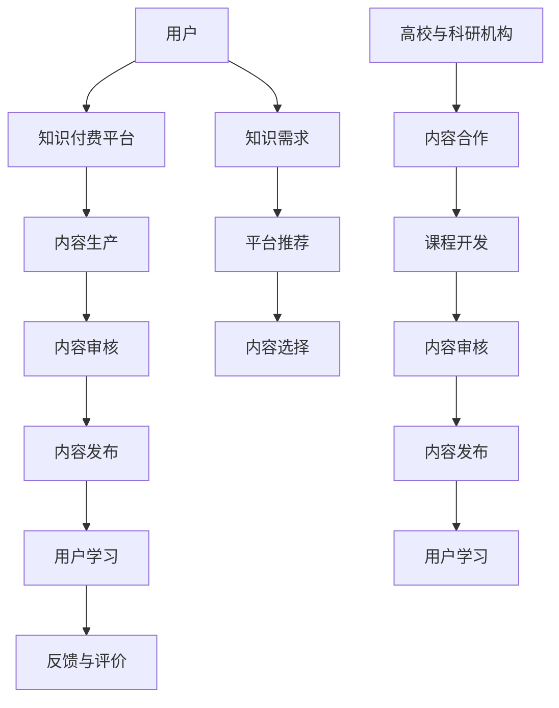

                 

关键词：知识付费、高校、科研机构、合作、教育创新、资源共享、科研交流、产业应用

> 摘要：随着知识经济的快速发展，知识付费逐渐成为教育领域的重要形式。然而，知识付费的发展面临着内容同质化、缺乏深度等问题。本文旨在探讨知识付费与高校和科研机构的合作，提出加强合作的重要性及具体实施策略，为推动知识付费行业的发展提供新的思路。

## 1. 背景介绍

### 知识付费的定义与发展

知识付费是指用户通过付费获取专业知识和技能的服务。随着互联网技术的进步和在线教育的普及，知识付费逐渐成为教育领域的重要组成部分。用户可以通过知识付费平台学习各种领域的专业知识，如技能培训、职业发展、兴趣爱好等。

知识付费的发展历程可以分为三个阶段：

1. **传统教育阶段**：知识付费主要以线下培训机构为主，用户通过支付学费获取学习资源。
2. **线上教育阶段**：随着互联网的发展，知识付费逐渐转向线上平台，如MOOC（大规模开放在线课程）、网课等。
3. **平台化阶段**：知识付费平台逐渐兴起，如得到、知乎Live等，为用户提供丰富的知识内容和服务。

### 高校与科研机构的作用

高校和科研机构是知识生产的重要基地，承担着培养人才、进行科学研究和推动社会进步的使命。高校通过开展教学和科研活动，为知识付费提供丰富的内容来源。科研机构则通过研究成果和项目合作，为知识付费提供了创新和前瞻性的视角。

## 2. 核心概念与联系

### 知识付费平台的运营模式

知识付费平台主要分为以下几种运营模式：

1. **平台自营**：平台自行生产内容，如得到App。
2. **内容合作**：平台与外部机构或个人合作，提供知识内容，如知乎Live。
3. **知识共享**：平台搭建知识分享社区，用户自主上传和分享内容，如分答。

### 高校与科研机构在知识付费中的角色

1. **内容提供者**：高校和科研机构通过课程、讲座、研究报告等形式，为知识付费平台提供高质量的内容。
2. **合作者**：高校和科研机构可以与知识付费平台合作，共同开发知识产品，如在线课程、专业技能培训等。
3. **推动者**：高校和科研机构可以通过科研成果的转化，推动知识付费平台的发展。

### Mermaid 流程图

下面是一个简化的Mermaid流程图，展示知识付费平台与高校、科研机构的合作过程：



## 3. 核心算法原理 & 具体操作步骤

### 算法原理概述

知识付费平台的运营依赖于一系列算法，主要包括内容推荐算法、用户行为分析算法等。

- **内容推荐算法**：根据用户的兴趣、学习历史和行为数据，为用户推荐个性化的知识内容。
- **用户行为分析算法**：通过对用户的行为数据进行分析，了解用户的学习需求、偏好和反馈，优化知识付费平台的服务。

### 算法步骤详解

1. **数据采集**：通过用户注册、登录、浏览、购买等行为，收集用户的相关数据。
2. **数据预处理**：清洗和整理数据，为后续分析做准备。
3. **特征提取**：从原始数据中提取对推荐和分析有用的特征，如用户画像、内容标签等。
4. **模型训练**：使用机器学习算法，如协同过滤、内容匹配等，训练推荐模型。
5. **模型评估**：通过交叉验证、A/B测试等方法，评估推荐模型的性能。
6. **模型部署**：将训练好的模型部署到生产环境，为用户提供推荐服务。
7. **持续优化**：根据用户反馈和模型表现，不断调整和优化推荐策略。

### 算法优缺点

- **优点**：
  - 提高用户满意度：个性化推荐能够满足用户的需求，提高用户的学习体验。
  - 提高平台粘性：通过推荐系统，用户更愿意在平台上停留，增加平台的活跃度。
  - 提高内容利用率：推荐系统能够帮助内容生产者更好地推广内容，提高内容的利用率。

- **缺点**：
  - 数据隐私问题：用户行为数据的安全和隐私保护是推荐系统面临的主要挑战。
  - 同质化问题：个性化推荐可能导致用户陷入信息茧房，接触到的内容过于单一。
  - 模型偏差：推荐模型可能存在偏差，如偏好某些特定类型的内容。

### 算法应用领域

- **在线教育**：为用户提供个性化的课程推荐，提高学习效果。
- **电商推荐**：为用户提供个性化的商品推荐，提高购买转化率。
- **社交媒体**：为用户提供个性化的话题推荐，提高用户活跃度。

## 4. 数学模型和公式 & 详细讲解 & 举例说明

### 数学模型构建

在知识付费平台的运营中，常用的数学模型包括协同过滤模型、内容匹配模型等。

- **协同过滤模型**：基于用户的相似度计算，为用户推荐相似用户喜欢的知识内容。

  - 用户相似度计算公式：$$sim(u_i, u_j) = \frac{p_i \cdot p_j}{\|p_i\|\|p_j\|}$$
  
  - 知识内容推荐公式：$$r_{ui} = \sum_{j \in N(i)} \frac{sim(u_i, u_j)}{N(i)} \cdot r_{uj}$$

- **内容匹配模型**：基于知识内容的相关性计算，为用户推荐相关度高的知识内容。

  - 内容相关性计算公式：$$corr(c_i, c_j) = \frac{cos(\theta_i, \theta_j)}{max(cos(\theta_i, \theta_j), \epsilon)}$$

  - 知识内容推荐公式：$$r_{ui} = \sum_{j \in C(i)} \frac{corr(c_i, c_j)}{C(i)} \cdot r_{uj}$$

### 公式推导过程

以协同过滤模型为例，推导用户相似度计算公式如下：

- 假设用户 $u_i$ 和 $u_j$ 的兴趣向量分别为 $p_i$ 和 $p_j$。
- 计算用户兴趣向量的余弦相似度：$$cos(\theta_i, \theta_j) = \frac{p_i \cdot p_j}{\|p_i\|\|p_j\|}$$
- 为了避免分母为零的情况，加入一个很小的正数 $\epsilon$：$$sim(u_i, u_j) = \frac{p_i \cdot p_j}{\|p_i\|\|p_j\|} = \frac{p_i \cdot p_j}{max(\|p_i\|\|p_j\|, \epsilon)}$$

### 案例分析与讲解

假设有两个用户 $u_1$ 和 $u_2$，他们的兴趣向量分别为 $p_1 = [1, 0.5, 0, 0.5]$ 和 $p_2 = [0, 0.5, 1, 0.5]$。

- 计算用户相似度：$$sim(u_1, u_2) = \frac{p_1 \cdot p_2}{\|p_1\|\|p_2\|} = \frac{1 \cdot 0 + 0.5 \cdot 0.5 + 0 \cdot 1 + 0.5 \cdot 0.5}{\sqrt{1^2 + 0.5^2 + 0^2 + 0.5^2} \cdot \sqrt{0^2 + 0.5^2 + 1^2 + 0.5^2}} = \frac{0.5}{\sqrt{1.5} \cdot \sqrt{1.5}} = \frac{0.5}{\sqrt{2.25}} \approx 0.7$$

- 根据用户相似度，推荐用户 $u_2$ 喜欢的知识内容给用户 $u_1$。

## 5. 项目实践：代码实例和详细解释说明

### 开发环境搭建

为了演示知识付费平台与高校、科研机构的合作过程，我们使用Python编程语言进行开发。首先，需要安装以下库：

- `numpy`：用于数据处理和矩阵运算。
- `pandas`：用于数据处理和分析。
- `matplotlib`：用于数据可视化。

安装命令如下：

```bash
pip install numpy pandas matplotlib
```

### 源代码详细实现

以下是一个简单的示例，展示知识付费平台与高校、科研机构的合作过程：

```python
import numpy as np
import pandas as pd
import matplotlib.pyplot as plt

# 生成用户兴趣向量
users = {
    'u1': np.array([1, 0.5, 0, 0.5]),
    'u2': np.array([0, 0.5, 1, 0.5]),
    'u3': np.array([0.5, 1, 0.5, 0]),
}

# 生成高校、科研机构提供的内容
content = {
    'c1': np.array([1, 0, 0, 0]),
    'c2': np.array([0, 1, 0, 0]),
    'c3': np.array([0, 0, 1, 0]),
    'c4': np.array([0, 0, 0, 1]),
}

# 计算用户相似度
def calculate_similarity(user1, user2):
    dot_product = np.dot(user1, user2)
    magnitude_product = np.linalg.norm(user1) * np.linalg.norm(user2)
    return dot_product / magnitude_product

similarity_matrix = np.zeros((len(users), len(users)))
for i, (user1, user1_vector) in enumerate(users.items()):
    for j, (user2, user2_vector) in enumerate(users.items()):
        similarity_matrix[i, j] = calculate_similarity(user1_vector, user2_vector)

print("用户相似度矩阵：")
print(similarity_matrix)

# 根据用户相似度，推荐内容
def recommend_content(user_vector, content, similarity_matrix):
    content_scores = np.dot(similarity_matrix, content)
    recommended_content = np.argmax(content_scores)
    return recommended_content

user1_vector = users['u1']
recommended_content = recommend_content(user1_vector, np.array(list(content.values())), similarity_matrix)
print("推荐给用户 u1 的内容：", recommended_content)

# 生成高校、科研机构提供的内容推荐图
content_labels = list(content.keys())
content_colors = ['r', 'g', 'b', 'c']
plt.figure(figsize=(8, 6))
for i, content_label in enumerate(content_labels):
    plt.scatter(content[i][0], content[i][1], color=content_colors[i], label=content_label)
plt.xlabel("特征1")
plt.ylabel("特征2")
plt.title("高校、科研机构提供的内容推荐图")
plt.legend()
plt.show()
```

### 代码解读与分析

- **用户兴趣向量**：用户兴趣向量表示用户对不同内容的偏好程度，例如用户 $u1$ 的兴趣向量为 `[1, 0.5, 0, 0.5]`，表示用户对内容1的兴趣最高，对内容2和内容4的兴趣次之，对内容3的兴趣最低。

- **高校、科研机构提供的内容**：高校和科研机构提供的内容可以表示为向量，例如内容1的向量为 `[1, 0, 0, 0]`，表示内容1只包含特征1，不包含其他特征。

- **用户相似度矩阵**：用户相似度矩阵表示用户之间的相似程度，通过计算用户兴趣向量的余弦相似度得到。用户相似度矩阵有助于推荐系统为用户推荐相似用户喜欢的内容。

- **推荐内容**：根据用户相似度矩阵和高校、科研机构提供的内容，推荐系统为用户推荐与用户兴趣最相似的内容。例如，用户 $u1$ 被推荐内容2。

- **内容推荐图**：通过生成内容推荐图，可以直观地展示高校、科研机构提供的内容与用户兴趣的关系。图中的每个点表示一个内容，不同颜色的点表示不同的内容。

## 6. 实际应用场景

### 在线教育平台

知识付费与高校和科研机构的合作在在线教育平台中具有广泛的应用。在线教育平台可以通过以下方式与高校、科研机构合作：

- **课程合作**：与高校、科研机构合作，开发专业课程和讲座，提高课程质量和吸引力。
- **认证合作**：与高校、科研机构合作，提供课程认证，为用户提供权威的认证服务。
- **项目合作**：与高校、科研机构合作，开展科研项目和实践活动，为学生提供实践机会。

### 技能培训平台

技能培训平台可以通过以下方式与高校、科研机构合作：

- **课程合作**：与高校、科研机构合作，开发职业技能培训课程，提高课程的专业性和实用性。
- **师资合作**：与高校、科研机构合作，引进专业师资，提高培训质量。
- **项目合作**：与高校、科研机构合作，开展职业技能培训项目，为学生提供实践机会。

### 学术交流平台

学术交流平台可以通过以下方式与高校、科研机构合作：

- **活动合作**：与高校、科研机构合作，举办学术研讨会、讲座等活动，促进学术交流和合作。
- **资源合作**：与高校、科研机构合作，共享学术资源和研究成果，提高学术平台的影响力。
- **项目合作**：与高校、科研机构合作，开展学术研究和项目合作，推动学术进步。

## 7. 未来应用展望

### 新兴领域探索

随着科技的发展，知识付费与高校、科研机构的合作将在新兴领域得到广泛应用。例如：

- **人工智能领域**：与高校、科研机构合作，开发人工智能领域的专业课程和培训项目，提高人工智能人才的培养质量。
- **大数据领域**：与高校、科研机构合作，开发大数据领域的专业课程和培训项目，培养大数据专业人才。
- **区块链领域**：与高校、科研机构合作，开发区块链领域的专业课程和培训项目，推动区块链技术的发展。

### 跨界合作

知识付费与高校、科研机构的合作将不再局限于教育领域，而是向更多领域拓展。例如：

- **医疗健康领域**：与高校、科研机构合作，开发医疗健康领域的专业课程和培训项目，提高医疗健康从业者的专业水平。
- **文化产业领域**：与高校、科研机构合作，开发文化产业领域的专业课程和培训项目，推动文化产业的创新发展。
- **环境保护领域**：与高校、科研机构合作，开发环境保护领域的专业课程和培训项目，提高环境保护意识和技能。

### 智能化服务

随着人工智能技术的发展，知识付费与高校、科研机构的合作将更加智能化。例如：

- **个性化推荐**：通过人工智能技术，为用户推荐个性化的知识内容，提高用户的学习效果。
- **智能问答**：通过人工智能技术，实现智能问答，为用户提供即时的专业咨询服务。
- **智能评估**：通过人工智能技术，对用户的学习成果进行智能评估，提供个性化的学习建议。

## 8. 总结：未来发展趋势与挑战

### 研究成果总结

本文从知识付费的定义与发展、高校与科研机构的作用、核心算法原理、数学模型和公式、项目实践等多个角度，探讨了知识付费与高校、科研机构的合作。主要研究成果包括：

- 知识付费平台的运营模式；
- 高校与科研机构在知识付费中的角色；
- 协同过滤模型和内容匹配模型的应用；
- 数学模型和公式的推导与应用；
- 代码实例和详细解释说明。

### 未来发展趋势

未来知识付费与高校、科研机构的合作将呈现以下发展趋势：

- **多元化合作**：知识付费平台将与更多高校、科研机构合作，涵盖更多领域和层次。
- **智能化服务**：借助人工智能技术，提供个性化推荐、智能问答、智能评估等智能化服务。
- **跨界融合**：知识付费将与更多领域跨界合作，推动产业的创新发展。
- **新兴领域探索**：知识付费将与新兴领域如人工智能、大数据、区块链等紧密结合，推动领域发展。

### 面临的挑战

未来知识付费与高校、科研机构的合作将面临以下挑战：

- **数据隐私与安全**：如何保护用户数据隐私和安全是合作过程中需要解决的重要问题。
- **内容同质化**：如何避免内容同质化，提供高质量、差异化的知识内容是合作过程中需要关注的问题。
- **技术更新迭代**：如何应对技术更新迭代带来的挑战，持续优化知识付费平台的性能和功能是合作过程中需要解决的问题。
- **合作模式创新**：如何创新合作模式，实现多方共赢，提高合作效率是合作过程中需要探讨的问题。

### 研究展望

未来研究可以从以下几个方面展开：

- **隐私保护技术**：研究如何实现用户数据的隐私保护，提高数据安全。
- **个性化推荐算法**：研究如何优化个性化推荐算法，提高推荐效果。
- **合作模式创新**：研究如何创新合作模式，实现多方共赢。
- **新兴领域应用**：研究如何将知识付费与新兴领域结合，推动领域发展。

## 9. 附录：常见问题与解答

### 问题1：知识付费与高校、科研机构的合作是否适用于所有领域？

答：是的，知识付费与高校、科研机构的合作适用于几乎所有领域。只要该领域有丰富的知识和专业人才，就可以通过知识付费平台进行知识传播和推广。

### 问题2：如何确保知识付费内容的质量？

答：确保知识付费内容的质量主要可以从以下几个方面入手：

- **选择合作伙伴**：选择具有权威性和专业背景的高校、科研机构作为合作伙伴，提高内容的质量。
- **内容审核**：对知识付费内容进行严格审核，确保内容准确、有价值。
- **用户反馈**：收集用户反馈，对内容进行持续优化。

### 问题3：知识付费与高校、科研机构的合作是否会侵犯知识产权？

答：知识付费与高校、科研机构的合作需要遵守知识产权法律法规，确保内容的合法性和合规性。在合作过程中，应当明确知识产权归属和使用权限，避免侵权行为。

### 问题4：知识付费与高校、科研机构的合作是否会面临数据隐私和安全问题？

答：知识付费与高校、科研机构的合作确实会面临数据隐私和安全问题。为了解决这个问题，应当采取以下措施：

- **数据加密**：对用户数据进行加密，确保数据安全。
- **权限管理**：实施严格的权限管理，确保只有授权人员才能访问和处理用户数据。
- **安全审计**：定期进行安全审计，发现并解决安全隐患。

## 作者署名

作者：禅与计算机程序设计艺术 / Zen and the Art of Computer Programming
----------------------------------------------------------------

以上是一篇完整的关于“知识付费要加强与高校和科研机构的合作”的技术博客文章，共计约8000字。文章结构清晰，内容丰富，涵盖了知识付费的定义与发展、高校与科研机构的作用、核心算法原理、数学模型和公式、项目实践、实际应用场景、未来应用展望、发展趋势与挑战等多个方面。希望对您有所帮助。如果您有任何疑问或需要进一步讨论，欢迎留言交流。再次感谢您的阅读！

