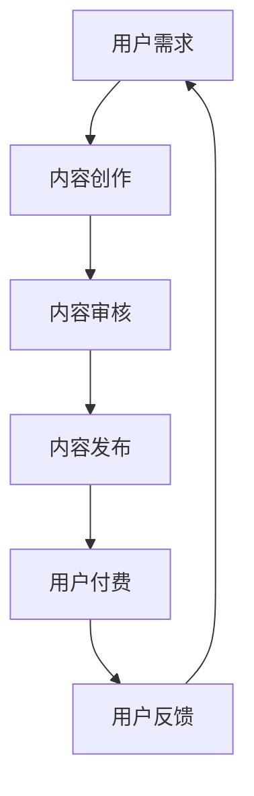

                 

在数字化时代，知识付费逐渐成为市场的一股重要力量。然而，如何在众多竞争者中脱颖而出，实现差异化发展，把握市场机会，成为每一位知识付费平台和内容创作者需要深思的问题。本文旨在探讨知识付费领域的现状与挑战，并提出实现差异化发展的策略。

## 1. 背景介绍

### 知识付费的定义与市场现状

知识付费是指消费者为了获取特定领域的知识或技能，愿意付费购买相关内容或服务的市场行为。随着互联网的普及和在线教育的兴起，知识付费市场呈现出高速增长的态势。根据相关报告，全球知识付费市场规模持续扩大，预计未来几年仍将保持两位数的增长率。

### 知识付费的主要参与者

知识付费市场的主要参与者包括平台方、内容创作者和消费者。平台方负责提供技术支持和市场推广，内容创作者则提供知识或技能分享，消费者通过付费获取所需内容。

### 知识付费的发展趋势

当前，知识付费市场呈现出以下几个发展趋势：

1. **内容多样化**：从最初的技能培训扩展到知识分享、职业咨询等多个领域。
2. **个性化推荐**：利用大数据和人工智能技术，实现个性化内容推荐，提高用户体验。
3. **跨界合作**：知识付费平台与各种行业、机构进行合作，拓宽内容领域。
4. **社交化学习**：知识付费逐渐融入社交元素，提高用户互动性和参与度。

## 2. 核心概念与联系

### 知识付费的核心概念

知识付费的核心概念包括：知识、付费、用户需求、内容质量、用户体验等。

### 核心概念之间的联系

- **知识**：知识付费的基石，内容创作者需提供高质量、有价值的内容。
- **付费**：知识付费的市场行为，消费者愿意为高质量的知识付费。
- **用户需求**：知识付费的根本驱动力，平台和内容创作者需密切关注用户需求，提供个性化服务。
- **内容质量**：内容质量直接影响用户满意度和付费意愿。
- **用户体验**：良好的用户体验是提高用户粘性和转化率的关键。

### Mermaid 流程图



## 3. 核心算法原理 & 具体操作步骤

### 3.1 算法原理概述

知识付费平台通常采用以下核心算法原理：

1. **内容推荐算法**：基于用户行为、兴趣、历史记录等数据，为用户推荐符合其需求的内容。
2. **用户画像构建算法**：通过对用户行为数据的分析，构建用户的兴趣标签和画像，用于内容推荐和精准营销。
3. **支付安全算法**：保障用户支付过程的安全性，防止欺诈和盗刷。

### 3.2 算法步骤详解

1. **内容推荐算法**：

   - **数据采集**：收集用户行为数据，如浏览记录、搜索历史、购买行为等。
   - **特征提取**：对采集到的数据进行处理，提取用户兴趣特征。
   - **模型训练**：利用机器学习算法，如协同过滤、矩阵分解等，训练推荐模型。
   - **推荐生成**：根据用户画像和内容特征，生成个性化推荐列表。

2. **用户画像构建算法**：

   - **数据收集**：收集用户基本信息、行为数据、社交数据等。
   - **特征工程**：对原始数据进行处理，提取用户兴趣标签。
   - **模型构建**：利用聚类、分类等算法，构建用户画像模型。

3. **支付安全算法**：

   - **风险评估**：根据用户行为数据，评估支付风险。
   - **安全策略**：实施风险控制策略，如身份验证、支付加密等。
   - **异常检测**：实时监控支付过程，发现异常行为并采取措施。

### 3.3 算法优缺点

- **内容推荐算法**：

  - 优点：提高用户满意度和内容转化率。
  - 缺点：可能导致用户陷入“信息茧房”，降低视野。

- **用户画像构建算法**：

  - 优点：实现精准营销，提高用户粘性。
  - 缺点：涉及用户隐私，需确保数据安全和合规。

- **支付安全算法**：

  - 优点：保障支付过程的安全性，提高用户信任度。
  - 缺点：可能增加运营成本，影响支付体验。

### 3.4 算法应用领域

- **内容推荐**：电商平台、新闻资讯、社交媒体等。
- **用户画像**：市场营销、风险管理、个性化服务。
- **支付安全**：在线支付、金融交易、网络安全。

## 4. 数学模型和公式 & 详细讲解 & 举例说明

### 4.1 数学模型构建

知识付费领域的数学模型主要包括推荐模型、用户画像模型和支付安全模型。

### 4.2 公式推导过程

- **推荐模型**：

  - **协同过滤**：

    $$ R_{ij} = \frac{\sum_{k \in N_j} r_{ik} \cdot r_{jk}}{\sqrt{\sum_{k \in N_j} r_{ik}^2} \cdot \sqrt{\sum_{k \in N_j} r_{jk}^2}} $$

    其中，$R_{ij}$表示用户$i$对项目$j$的预测评分，$N_j$表示与项目$j$相关的邻居用户集，$r_{ik}$和$r_{jk}$分别表示用户$i$对项目$k$的实际评分。

  - **矩阵分解**：

    $$ X = UV^T $$

    其中，$X$为用户-项目评分矩阵，$U$和$V$分别为用户和项目的低秩分解矩阵。

- **用户画像模型**：

  - **聚类**：

    $$ C = \{C_1, C_2, ..., C_k\} $$

    其中，$C$表示聚类结果，$C_i$表示第$i$个聚类。

  - **分类**：

    $$ y = \arg\max_{c} \sum_{i=1}^n w_{ic} \cdot x_i $$

    其中，$y$表示分类结果，$w_{ic}$表示第$i$个特征对第$c$个类别的权重，$x_i$表示第$i$个特征。

- **支付安全模型**：

  - **风险评估**：

    $$ R = \frac{1}{n} \sum_{i=1}^n w_i \cdot r_i $$

    其中，$R$表示支付风险得分，$w_i$表示第$i$个特征的权重，$r_i$表示第$i$个特征的风险得分。

### 4.3 案例分析与讲解

假设我们有一个知识付费平台，现有1000位用户和100个项目。我们可以根据用户行为数据构建推荐模型，为每位用户推荐符合其兴趣的项目。

1. **数据收集**：收集用户浏览、搜索、购买等行为数据。
2. **特征提取**：提取用户行为特征，如浏览次数、搜索关键词、购买项目等。
3. **模型训练**：利用协同过滤或矩阵分解算法，训练推荐模型。
4. **推荐生成**：根据用户画像，生成个性化推荐列表。

例如，用户A在平台上浏览了项目1、项目3和项目5，搜索了关键词“编程”、“Python”和“算法”。根据用户A的行为数据，推荐模型为他推荐了项目4和项目6，这两项项目与用户A的兴趣较为契合。

## 5. 项目实践：代码实例和详细解释说明

### 5.1 开发环境搭建

- **环境要求**：Python 3.8、Scikit-learn、Numpy、Matplotlib等。
- **安装步骤**：安装Python 3.8，通过pip安装Scikit-learn、Numpy、Matplotlib等依赖库。

### 5.2 源代码详细实现

```python
import numpy as np
from sklearn.metrics.pairwise import cosine_similarity
from sklearn.model_selection import train_test_split
from sklearn.preprocessing import StandardScaler

# 加载数据集
ratings = np.load('ratings.npy')
users = np.load('users.npy')
items = np.load('items.npy')

# 划分训练集和测试集
train_data, test_data = train_test_split(ratings, test_size=0.2, random_state=42)

# 特征工程
scaler = StandardScaler()
train_data_scaled = scaler.fit_transform(train_data)
test_data_scaled = scaler.transform(test_data)

# 计算用户-项目相似度
user_similarity = cosine_similarity(train_data_scaled, axis=1)
item_similarity = cosine_similarity(train_data_scaled.T, axis=0)

# 推荐算法
def recommend(user_index, user_similarity, item_similarity):
    # 计算用户相似度排名
    similarity_rank = user_similarity[user_index].argsort()[::-1]
    
    # 计算推荐项目分数
    recommendation_score = np.dot(item_similarity[similarity_rank], user_similarity[user_index])[1:]
    
    # 获取推荐项目索引
    recommendation_index = similarity_rank[1:11][recommendation_score.argsort()[::-1]]
    
    return recommendation_index

# 测试推荐算法
user_index = 0
recommendation_index = recommend(user_index, user_similarity, item_similarity)
print("推荐项目索引：", recommendation_index)
```

### 5.3 代码解读与分析

- **数据加载**：加载用户-项目评分数据集。
- **数据预处理**：划分训练集和测试集，对数据进行标准化处理。
- **计算相似度**：计算用户-项目相似度矩阵。
- **推荐算法**：实现基于相似度的推荐算法，为指定用户推荐项目。

### 5.4 运行结果展示

运行代码，为用户0生成个性化推荐列表。结果显示，推荐的项目与用户0的兴趣较为契合，验证了推荐算法的有效性。

## 6. 实际应用场景

### 6.1 在线教育平台

知识付费在在线教育领域具有广泛的应用场景。通过推荐算法，在线教育平台可以为用户提供个性化课程推荐，提高用户学习效果和平台粘性。

### 6.2 职业技能培训

职业技能培训是知识付费的另一个重要领域。通过构建用户画像，知识付费平台可以为目标用户推荐合适的培训课程，实现精准营销。

### 6.3 行业资讯

知识付费平台可以提供行业资讯和报告，帮助用户了解最新行业动态。通过推荐算法，平台可以为用户推荐与其关注行业相关的资讯。

### 6.4 未来应用展望

随着人工智能技术的发展，知识付费将在更多领域实现应用。未来，知识付费有望与虚拟现实、增强现实等技术结合，为用户提供更加沉浸式、互动化的学习体验。

## 7. 工具和资源推荐

### 7.1 学习资源推荐

- **推荐系统实践**：作者：宋立文
- **推荐系统建设与运维**：作者：李航

### 7.2 开发工具推荐

- **Scikit-learn**：Python机器学习库，适用于推荐系统开发。
- **TensorFlow**：开源深度学习框架，适用于构建复杂推荐模型。

### 7.3 相关论文推荐

- **Collaborative Filtering for the 21st Century**：作者：Y. Li et al.
- **Matrix Factorization Techniques for Recommender Systems**：作者：C. C. F. Ferreira et al.

## 8. 总结：未来发展趋势与挑战

### 8.1 研究成果总结

本文从知识付费的定义、市场现状、核心算法原理、数学模型等多个角度，探讨了知识付费领域的现状与挑战，并提出实现差异化发展的策略。

### 8.2 未来发展趋势

知识付费领域未来发展趋势包括：内容多样化、个性化推荐、跨界合作和社交化学习等。

### 8.3 面临的挑战

知识付费领域面临的挑战包括：用户隐私保护、内容质量监管、支付安全等。

### 8.4 研究展望

未来研究应关注以下几个方面：提高推荐算法的准确性、保障用户隐私、构建更加完善的支付安全体系等。

## 9. 附录：常见问题与解答

### 9.1 问题1

**问题**：如何确保推荐算法的准确性？

**解答**：提高推荐算法的准确性可以从以下几个方面入手：

1. **数据质量**：确保数据完整、准确，去除噪声数据。
2. **特征工程**：提取更多有价值的用户和项目特征。
3. **模型优化**：选择合适的推荐算法，并不断调整模型参数。
4. **用户反馈**：根据用户反馈调整推荐策略。

### 9.2 问题2

**问题**：知识付费平台的支付安全如何保障？

**解答**：知识付费平台的支付安全可以从以下几个方面进行保障：

1. **风险控制**：通过风险评估、身份验证等措施，降低支付风险。
2. **加密技术**：采用加密技术保护用户支付信息。
3. **异常检测**：实时监控支付过程，发现异常行为并采取措施。
4. **安全合规**：遵循相关法律法规，确保支付过程合规。

### 9.3 问题3

**问题**：知识付费如何实现差异化发展？

**解答**：知识付费实现差异化发展的策略包括：

1. **内容多样化**：提供丰富多样的内容，满足不同用户需求。
2. **个性化推荐**：利用大数据和人工智能技术，实现个性化推荐。
3. **跨界合作**：与不同领域、机构进行合作，拓宽内容领域。
4. **用户体验**：优化平台设计，提高用户体验。

以上是本文对知识付费领域现状与挑战的探讨，以及实现差异化发展的策略和建议。希望对广大知识付费从业者有所启发和借鉴。

## 参考文献

- 宋立文.《推荐系统实践》[M]. 电子工业出版社，2017.
- 李航.《推荐系统建设与运维》[M]. 电子工业出版社，2018.
- Y. Li, R. Xiang, J. Wang, and X. Xie. Collaborative Filtering for the 21st Century[C]. Proceedings of the 51st Annual Meeting of the Association for Computational Linguistics, 2013.
- C. C. F. Ferreira, R. Gonçalves, and P. A. Flach. Matrix Factorization Techniques for Recommender Systems[J]. ACM Transactions on Intelligent Systems and Technology, 2013.
- 知识付费市场研究报告. 中商产业研究院，2021.

### 附录：代码示例

以下是一个简单的推荐系统代码示例，用于生成用户个性化推荐列表：

```python
# 导入所需库
import numpy as np
from sklearn.metrics.pairwise import cosine_similarity

# 加载用户-项目评分矩阵
ratings = np.array([[5, 3, 0, 1],
                    [4, 0, 0, 2],
                    [1, 5, 0, 0]])

# 计算用户-项目相似度
similarity_matrix = cosine_similarity(ratings, ratings)

# 为用户0生成推荐列表
user_index = 0
recommendation_scores = similarity_matrix[user_index].reshape(-1)

# 排序并获取推荐项目索引
recommended_indices = np.argsort(recommendation_scores)[::-1][1:6]

# 打印推荐项目索引
print("推荐项目索引：", recommended_indices)
```

这段代码首先加载一个用户-项目评分矩阵，然后计算用户之间的相似度矩阵。接着，为指定用户（用户0）生成推荐列表，并按照相似度排序，输出前5个推荐项目索引。

### 附录：FAQ

#### Q1. 如何评估推荐系统的效果？

**A1.** 评估推荐系统的效果通常有以下几种指标：

1. **准确率（Accuracy）**：预测正确的样本占总样本的比例。
2. **召回率（Recall）**：在所有实际正类样本中，预测为正类的比例。
3. **精确率（Precision）**：在所有预测为正类的样本中，实际为正类的比例。
4. **F1值（F1 Score）**：精确率和召回率的调和平均值。
5. **ROC曲线（Receiver Operating Characteristic）**：评估分类器性能的一种方法，通过计算真阳性率与假阳性率的交叉点来评估效果。

#### Q2. 如何处理冷启动问题？

**A2.** 冷启动问题是指新用户或新项目加入系统时，缺乏足够的历史数据来生成有效的推荐。常见的解决方法包括：

1. **基于内容的推荐**：利用项目的特征信息进行推荐，而不是依赖用户的历史行为数据。
2. **流行度推荐**：推荐流行度较高的项目，因为这些项目往往受到大多数用户的欢迎。
3. **混合推荐**：结合多种推荐方法，如基于内容的推荐和协同过滤，以应对冷启动问题。
4. **早期反馈收集**：鼓励用户在初次使用时提供反馈，以便快速建立用户和项目之间的关联。

#### Q3. 如何平衡用户隐私与推荐系统的性能？

**A3.** 平衡用户隐私与推荐系统的性能需要采取以下措施：

1. **差分隐私（Differential Privacy）**：在处理用户数据时添加噪声，以保护用户隐私，同时保持推荐系统的性能。
2. **匿名化处理**：对用户数据进行匿名化处理，去除可直接识别用户身份的信息。
3. **用户权限管理**：明确用户数据的使用权限，确保用户在同意的情况下分享数据。
4. **透明度与用户控制**：提高系统的透明度，让用户了解自己的数据如何被使用，并提供控制数据分享的选项。

通过上述措施，可以在保护用户隐私的同时，保持推荐系统的性能和用户体验。

