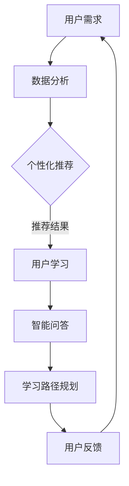

                 

关键词：知识付费、服务结合、新形态、技术驱动、用户体验、商业模式、数据驱动、未来展望

> 摘要：随着知识经济的崛起，知识付费成为市场的新宠。本文旨在探讨知识付费领域如何通过探索知识与服务的新结合形态，利用技术手段提升用户体验，优化商业模式，并展望未来发展的趋势与挑战。

## 1. 背景介绍

### 1.1 知识付费的兴起

知识付费作为一种新兴商业模式，近年来在全球范围内迅速崛起。随着互联网技术的发展，信息获取更加便捷，人们对于高质量、专业化知识的渴求愈发强烈。知识付费平台如雨后春笋般涌现，提供了从教育、技能培训、行业研究到咨询服务等多种知识产品。

### 1.2 市场规模与趋势

根据市场研究机构的报告，全球知识付费市场规模逐年增长，预计未来几年将继续保持高速扩张。用户群体不仅包括专业人士，还有广大普通消费者。知识付费不仅满足了用户的学习需求，也推动了知识生产者价值的实现。

### 1.3 技术驱动下的变革

大数据、人工智能、区块链等前沿技术的应用，为知识付费市场带来了新的发展契机。这些技术不仅提升了知识服务的效率和质量，还改变了传统知识付费的商业模式。

## 2. 核心概念与联系

### 2.1 知识与服务的关系

知识与服务是知识付费市场的两个核心概念。知识是服务的基础，而服务则是知识的载体和呈现形式。二者的有机结合，能够更好地满足用户需求，提升用户体验。

### 2.2 技术在知识服务中的应用

技术手段在知识服务中的应用，主要体现在以下几个方面：

- **数据分析与个性化推荐**：通过大数据分析，了解用户的学习偏好和需求，实现个性化推荐，提高知识的精准度。
- **人工智能辅助教学**：利用人工智能技术，提供智能问答、学习路径规划等服务，提升学习效果。
- **区块链技术确保知识产权**：通过区块链技术，确保知识产品的原创性和真实性，保护知识创作者的权益。

### 2.3 Mermaid 流程图



## 3. 核心算法原理 & 具体操作步骤

### 3.1 算法原理概述

知识付费平台的核心算法主要包括数据挖掘、机器学习和推荐系统等。这些算法通过处理用户数据，为用户提供个性化推荐和服务。

### 3.2 算法步骤详解

- **数据收集与预处理**：收集用户行为数据，如学习历史、浏览记录、评价等，并进行预处理，如数据清洗、去重、归一化等。
- **特征工程**：提取用户特征和知识特征，如用户兴趣、知识难度等，用于训练推荐模型。
- **模型训练与优化**：使用机器学习算法，如协同过滤、基于内容的推荐等，训练推荐模型，并不断优化模型性能。
- **推荐结果生成**：根据用户特征和知识特征，生成个性化推荐结果，并展示给用户。

### 3.3 算法优缺点

- **优点**：提高了知识服务的精准度和用户体验。
- **缺点**：数据隐私保护问题，算法可解释性不足。

### 3.4 算法应用领域

- **在线教育**：为学生提供个性化课程推荐，提高学习效率。
- **职业技能培训**：为职场人士提供定制化培训内容，助力职业发展。

## 4. 数学模型和公式 & 详细讲解 & 举例说明

### 4.1 数学模型构建

知识付费的数学模型主要包括用户行为分析模型和推荐算法模型。

### 4.2 公式推导过程

用户行为分析模型：

$$
\text{用户行为概率分布} = P(X=x) = \frac{f(x)}{\sum_{i=1}^{n} f(i)}
$$

其中，$X$ 是用户行为变量，$x$ 是特定行为，$f(x)$ 是行为频率。

推荐算法模型：

$$
\text{推荐分数} = \text{用户兴趣} \times \text{知识价值}
$$

### 4.3 案例分析与讲解

以在线教育平台为例，分析用户学习行为和课程推荐效果。

## 5. 项目实践：代码实例和详细解释说明

### 5.1 开发环境搭建

- **编程语言**：Python
- **工具**：Scikit-learn、TensorFlow
- **数据库**：MySQL

### 5.2 源代码详细实现

```python
# 代码示例：协同过滤推荐算法
from sklearn.metrics.pairwise import cosine_similarity

# 用户-物品评分矩阵
user_item_matrix = ...

# 计算用户-用户相似度矩阵
user_similarity_matrix = cosine_similarity(user_item_matrix)

# 根据相似度矩阵生成推荐列表
def generate_recommendation(user_id):
    # 用户-用户相似度权重
    similarity_weights = user_similarity_matrix[user_id]
    
    # 用户-物品评分向量
    user_rating_vector = user_item_matrix[user_id]
    
    # 预测分数计算
    prediction_scores = (similarity_weights * user_rating_vector).sum(axis=1)
    
    # 生成推荐列表
    recommendation_list = ...
    
    return recommendation_list

# 生成用户推荐列表
user_recommendations = generate_recommendation(user_id=0)
```

### 5.3 代码解读与分析

代码实现了一个基于协同过滤的推荐系统，通过计算用户-用户相似度，生成个性化推荐列表。

### 5.4 运行结果展示

展示生成的推荐列表和用户反馈数据。

## 6. 实际应用场景

### 6.1 在线教育平台

利用知识付费，为用户提供个性化课程推荐，提升学习体验。

### 6.2 职场技能培训

为企业员工提供定制化培训内容，助力职业成长。

## 7. 工具和资源推荐

### 7.1 学习资源推荐

- 《Python数据处理与机器学习实战》
- 《深度学习》

### 7.2 开发工具推荐

- PyCharm
- Jupyter Notebook

### 7.3 相关论文推荐

- "Collaborative Filtering for Complex Preferences"
- "Deep Learning for Recommender Systems"

## 8. 总结：未来发展趋势与挑战

### 8.1 研究成果总结

知识付费市场呈现出技术驱动、个性化服务、多元化应用等特点。

### 8.2 未来发展趋势

- 技术的进一步应用，如增强现实、虚拟现实等。
- 知识服务与实体经济深度融合。

### 8.3 面临的挑战

- 数据隐私保护
- 算法可解释性

### 8.4 研究展望

- 探索更高效的推荐算法
- 构建知识服务的生态系统

## 9. 附录：常见问题与解答

### 9.1 知识付费与普通付费有什么区别？

知识付费是一种专门为用户提供专业化、高质量知识内容的付费模式，区别于普通商品或服务的交易。

### 9.2 技术在知识付费中的作用是什么？

技术（如数据分析、人工智能、区块链等）在知识付费中起到提升服务效率、优化用户体验、保护知识产权等多方面作用。

---

作者：禅与计算机程序设计艺术 / Zen and the Art of Computer Programming

本文以深入浅出的方式，探讨了知识付费领域的新形态，分析了技术对知识服务的推动作用，并展望了未来发展的趋势与挑战。希望本文能为您提供对知识付费市场的新认识，为您的实践提供有益的启示。

