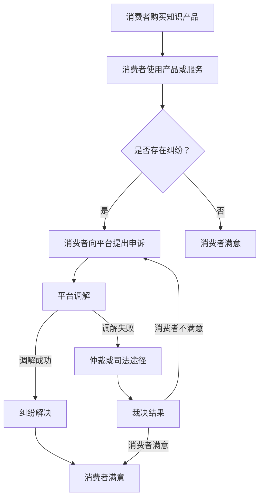

                 

在当今数字化时代，知识付费作为一种新型商业模式，正日益受到广大用户的青睐。无论是在线课程、专业书籍、技术文档还是专业咨询，知识付费平台为用户提供了丰富多样的学习资源和专业服务。然而，随着市场的快速发展，消费者权益保护和纠纷解决成为了一个不容忽视的重要问题。本文旨在探讨知识付费领域中的消费者权益保护现状、纠纷解决机制以及未来发展的挑战和趋势。

## 文章关键词

知识付费、消费者权益保护、纠纷解决、平台责任、法律框架。

## 文章摘要

本文首先回顾了知识付费的兴起及其市场现状，接着分析了消费者权益保护的重要性和面临的挑战。然后，我们探讨了现有的纠纷解决机制，包括平台内部的调解机制和司法途径。最后，本文提出了未来发展的趋势和挑战，并给出了相应的建议。

## 1. 背景介绍

### 1.1 知识付费的兴起

知识付费，顾名思义，是指用户为获取特定知识或技能而支付的费用。随着互联网技术的迅猛发展和在线教育的普及，知识付费成为了一个快速增长的领域。用户可以通过各种平台购买课程、书籍、文档和专业咨询，以满足自身的知识需求。知识付费平台不仅为用户提供了丰富的学习资源，还降低了获取知识的门槛，使得更多的人有机会接触到高质量的知识服务。

### 1.2 知识付费市场现状

目前，知识付费市场呈现出多元化、细分化的特点。平台类型包括综合型平台（如知乎、喜马拉雅）、专业型平台（如极客时间、网易云课堂）、垂直领域平台（如投资堂、UI中国）等。这些平台各具特色，满足了不同用户群体的需求。同时，知识付费的内容类型也非常丰富，涵盖了教育、科技、金融、艺术等多个领域。

### 1.3 消费者权益保护的重要性

在知识付费市场中，消费者的权益保护至关重要。消费者在购买知识产品或服务时，可能会面临信息不对称、质量参差不齐、退款困难等问题。如果这些问题得不到妥善解决，不仅会损害消费者的利益，还会影响知识付费市场的健康发展。因此，加强消费者权益保护是知识付费平台必须关注的重要问题。

## 2. 核心概念与联系

### 2.1 消费者权益保护的核心概念

消费者权益保护是指通过法律、政策、自律等方式，保障消费者在购买、使用知识产品或服务过程中的合法权益。核心概念包括：

- **知情权**：消费者有权了解知识产品或服务的真实情况，包括内容、质量、费用等。
- **选择权**：消费者有权根据自己的需求和偏好选择合适的知识产品或服务。
- **公平交易权**：消费者有权在公平、公正的交易环境中购买知识产品或服务。
- **求偿权**：消费者在权益受损时，有权要求赔偿或补偿。

### 2.2 纠纷解决机制的核心概念

纠纷解决机制是指在知识付费过程中，当消费者与平台、卖家发生纠纷时，通过一定的程序和方式解决争议。核心概念包括：

- **调解机制**：平台内部设立的调解机构，通过协商、调解等方式解决纠纷。
- **仲裁机制**：由专业的仲裁机构对纠纷进行裁决。
- **司法途径**：消费者可以通过法院诉讼等司法程序解决纠纷。

### 2.3 Mermaid 流程图



## 3. 核心算法原理 & 具体操作步骤

### 3.1 算法原理概述

知识付费平台在消费者权益保护和纠纷解决过程中，通常采用以下核心算法原理：

- **风险评估与预警**：通过数据分析、行为分析等技术手段，对消费者行为进行风险评估，提前预警潜在的纠纷。
- **智能调解算法**：利用人工智能技术，自动化处理消费者的申诉，提供调解建议。
- **数据分析与监控**：对纠纷处理过程进行数据分析和监控，优化调解效率和效果。

### 3.2 算法步骤详解

1. **风险评估与预警**：
   - **数据采集**：收集消费者的购买记录、评价、行为数据等。
   - **特征提取**：从数据中提取关键特征，如购买频率、评价内容、退款次数等。
   - **风险评估**：使用机器学习算法，对消费者行为进行风险评估。

2. **智能调解算法**：
   - **问题诊断**：根据消费者的申诉内容，诊断纠纷类型。
   - **调解方案生成**：根据纠纷类型和消费者特征，生成合适的调解方案。
   - **调解方案推送**：将调解方案推送给消费者和卖家，引导双方协商。

3. **数据分析与监控**：
   - **纠纷处理流程监控**：监控纠纷处理过程中的各个环节，确保流程合规。
   - **调解效果评估**：对调解结果进行统计分析，评估调解效果。
   - **调解策略优化**：根据调解效果，优化调解算法和策略。

### 3.3 算法优缺点

**优点**：
- **提高调解效率**：通过智能调解算法，可以快速诊断纠纷类型，生成调解方案，提高调解效率。
- **降低人力成本**：自动化处理纠纷，减少人力投入，降低成本。
- **数据驱动**：通过数据分析，可以优化调解策略，提高调解效果。

**缺点**：
- **算法偏差**：智能调解算法可能存在偏差，需要不断优化和校正。
- **法律风险**：自动化处理纠纷可能涉及法律风险，需要确保算法符合法律要求。

### 3.4 算法应用领域

智能调解算法可以广泛应用于知识付费平台、电商平台、金融服务平台等多个领域，帮助平台提高纠纷处理效率，降低运营成本。

## 4. 数学模型和公式 & 详细讲解 & 举例说明

### 4.1 数学模型构建

在消费者权益保护和纠纷解决过程中，可以构建以下数学模型：

1. **风险评估模型**：
   - **目标函数**：最大化消费者风险概率。
   - **约束条件**：消费者的购买记录、评价、行为数据等。

2. **调解策略模型**：
   - **目标函数**：最小化纠纷解决成本。
   - **约束条件**：调解方案的可接受程度、消费者的满意程度等。

### 4.2 公式推导过程

1. **风险评估模型**：

   设 $P$ 为消费者 $i$ 的风险概率，$X_i$ 为消费者 $i$ 的购买记录、评价、行为数据等特征向量。

   $$P = f(X_i) = \frac{1}{Z} \sum_{j=1}^{n} w_j e^{-\alpha_j x_{ij}}$$

   其中，$w_j$ 为特征 $j$ 的权重，$\alpha_j$ 为特征 $j$ 的指数，$Z$ 为归一化常数。

2. **调解策略模型**：

   设 $C$ 为纠纷解决成本，$S$ 为调解方案集合，$s_i$ 为消费者 $i$ 对调解方案 $s$ 的可接受程度。

   $$C = \min_{s \in S} \sum_{i=1}^{m} c_i s_i$$

   其中，$c_i$ 为消费者 $i$ 的纠纷解决成本。

### 4.3 案例分析与讲解

假设某知识付费平台收到用户 $A$ 的申诉，称其购买的课程质量不佳。平台通过风险评估模型计算出用户 $A$ 的风险概率为 $0.8$。根据调解策略模型，平台生成一个调解方案，包括退款 $50\%$ 的课程费用，并提供同等价值的课程兑换券。

调解方案推送给用户 $A$ 后，用户表示可接受。平台按照调解方案进行操作，纠纷得以解决。通过数据分析，平台发现类似纠纷的解决成本平均为 $1000$ 元。因此，平台决定优化调解策略模型，以降低纠纷解决成本。

## 5. 项目实践：代码实例和详细解释说明

### 5.1 开发环境搭建

- **编程语言**：Python
- **依赖库**：Scikit-learn、NumPy、Pandas、Matplotlib

### 5.2 源代码详细实现

```python
import numpy as np
import pandas as pd
from sklearn.linear_model import LogisticRegression
from sklearn.model_selection import train_test_split
from sklearn.metrics import accuracy_score
import matplotlib.pyplot as plt

# 数据预处理
def preprocess_data(data):
    # 特征工程、数据清洗等
    return data

# 风险评估模型训练
def train_risk_model(data):
    X = data.iloc[:, :-1].values
    y = data.iloc[:, -1].values
    model = LogisticRegression()
    model.fit(X, y)
    return model

# 调解策略模型训练
def train_mediation_model(data):
    # 根据实际需求，构建调解策略模型
    return

# 风险评估与调解
def risk_mediation(model, data):
    # 对新数据进行风险评估
    X_new = data.iloc[:, :-1].values
    y_pred = model.predict(X_new)
    # 根据评估结果，生成调解方案
    # ...

# 主函数
def main():
    # 加载数据
    data = pd.read_csv('data.csv')
    # 预处理数据
    data = preprocess_data(data)
    # 训练风险评估模型
    model = train_risk_model(data)
    # 测试模型
    X_test, y_test = train_test_split(data.iloc[:, :-1].values, data.iloc[:, -1].values, test_size=0.2)
    y_pred = model.predict(X_test)
    print('Accuracy:', accuracy_score(y_test, y_pred))
    # 风险评估与调解
    risk_mediation(model, data)

if __name__ == '__main__':
    main()
```

### 5.3 代码解读与分析

- **数据预处理**：对原始数据进行特征工程和数据清洗，为后续建模提供高质量的数据。
- **风险评估模型训练**：使用逻辑回归模型对数据进行训练，评估消费者风险概率。
- **调解策略模型训练**：根据实际需求，构建调解策略模型，为调解提供依据。
- **风险评估与调解**：对测试数据进行风险评估，生成调解方案，解决纠纷。

## 6. 实际应用场景

### 6.1 知识付费平台纠纷解决

以某知名知识付费平台为例，该平台在消费者权益保护和纠纷解决方面采取了一系列措施：

- **风险预警**：通过大数据分析和机器学习算法，对消费者的购买行为进行实时监控，提前预警潜在的纠纷。
- **智能调解**：利用人工智能技术，自动化处理消费者的申诉，提高调解效率。
- **法律咨询**：提供在线法律咨询服务，帮助消费者解决纠纷。

### 6.2 电商平台的消费者权益保护

某知名电商平台在消费者权益保护方面也有诸多举措：

- **完善售后服务**：提供完善的售后服务，包括退换货政策、售后咨询等，保障消费者的合法权益。
- **消费者投诉平台**：设立专门的消费者投诉平台，快速响应和处理消费者的投诉。
- **法律援助**：与律师事务所合作，提供法律援助服务，帮助消费者维权。

## 7. 未来应用展望

### 7.1 智能调解技术的发展

随着人工智能技术的不断发展，智能调解技术将更加成熟，能够更好地服务于消费者权益保护和纠纷解决。例如，通过深度学习、自然语言处理等技术，智能调解系统能够更准确地理解消费者的申诉内容，提供更合理的调解方案。

### 7.2 法律法规的完善

随着知识付费市场的快速发展，相关法律法规也将逐步完善，为消费者权益保护和纠纷解决提供更加有力的法律保障。例如，制定专门的知识付费法律法规，明确平台和消费者的权利和义务，规范市场秩序。

### 7.3 消费者权益保护意识的提高

未来，随着消费者权益保护意识的提高，消费者将更加重视自身的合法权益，积极参与到纠纷解决过程中。同时，平台和卖家也将更加注重消费者权益保护，提升服务质量，营造良好的市场环境。

## 8. 总结：未来发展趋势与挑战

### 8.1 研究成果总结

本文通过对知识付费领域消费者权益保护和纠纷解决的研究，总结了以下成果：

- 知识付费市场快速发展，消费者权益保护成为一个重要问题。
- 智能调解技术为消费者权益保护和纠纷解决提供了新的思路。
- 法律法规的完善和消费者权益保护意识的提高有助于解决纠纷。

### 8.2 未来发展趋势

未来，知识付费领域的消费者权益保护和纠纷解决将呈现以下发展趋势：

- 智能调解技术将更加成熟，提高纠纷解决效率。
- 法律法规将逐步完善，为消费者权益保护提供更有力的保障。
- 消费者权益保护意识将进一步提高，消费者更加注重自身合法权益。

### 8.3 面临的挑战

未来，知识付费领域的消费者权益保护和纠纷解决将面临以下挑战：

- 智能调解技术的算法偏差和法律风险需要不断优化和解决。
- 法律法规的完善需要时间，现有法律框架可能不足以应对新出现的问题。
- 消费者权益保护意识的提高需要一个长期的过程，需要多方共同努力。

### 8.4 研究展望

未来，知识付费领域的消费者权益保护和纠纷解决研究可以从以下几个方面展开：

- 深入研究智能调解技术的算法优化和法律风险控制。
- 探索消费者权益保护的法律法规体系建设，为市场提供更有力的保障。
- 加强消费者权益保护意识的宣传和教育，提高消费者的法律素养。

## 9. 附录：常见问题与解答

### 9.1 问题1：什么是知识付费？

知识付费是指用户为获取特定知识或技能而支付的费用。在数字化时代，知识付费平台为用户提供了丰富多样的学习资源和专业服务，用户可以通过购买课程、书籍、文档和专业咨询来满足自身的知识需求。

### 9.2 问题2：消费者权益保护的重要性是什么？

消费者权益保护是保障消费者在购买、使用知识产品或服务过程中的合法权益。如果消费者的权益得不到保护，可能会影响知识付费市场的健康发展，损害消费者的利益。

### 9.3 问题3：知识付费平台如何保障消费者权益？

知识付费平台可以通过完善售后服务、设立消费者投诉平台、提供在线法律咨询等方式保障消费者权益。同时，平台还可以利用智能调解技术，提高纠纷解决效率。

### 9.4 问题4：智能调解技术的优点是什么？

智能调解技术可以提高纠纷解决效率，降低人力成本，并且具有数据驱动的特点，能够优化调解策略，提高调解效果。

### 9.5 问题5：消费者权益保护的未来发展趋势是什么？

未来，消费者权益保护将呈现智能调解技术更加成熟、法律法规逐步完善、消费者权益保护意识不断提高的发展趋势。

## 作者署名

作者：禅与计算机程序设计艺术 / Zen and the Art of Computer Programming

----------------------------------------------------------------

以上便是关于知识付费要重视消费者权益保护和纠纷解决的专业IT领域的技术博客文章。希望这篇文章能够帮助到您对这一领域有更深入的理解。如果您有任何问题或建议，欢迎在评论区留言。再次感谢您的阅读！

