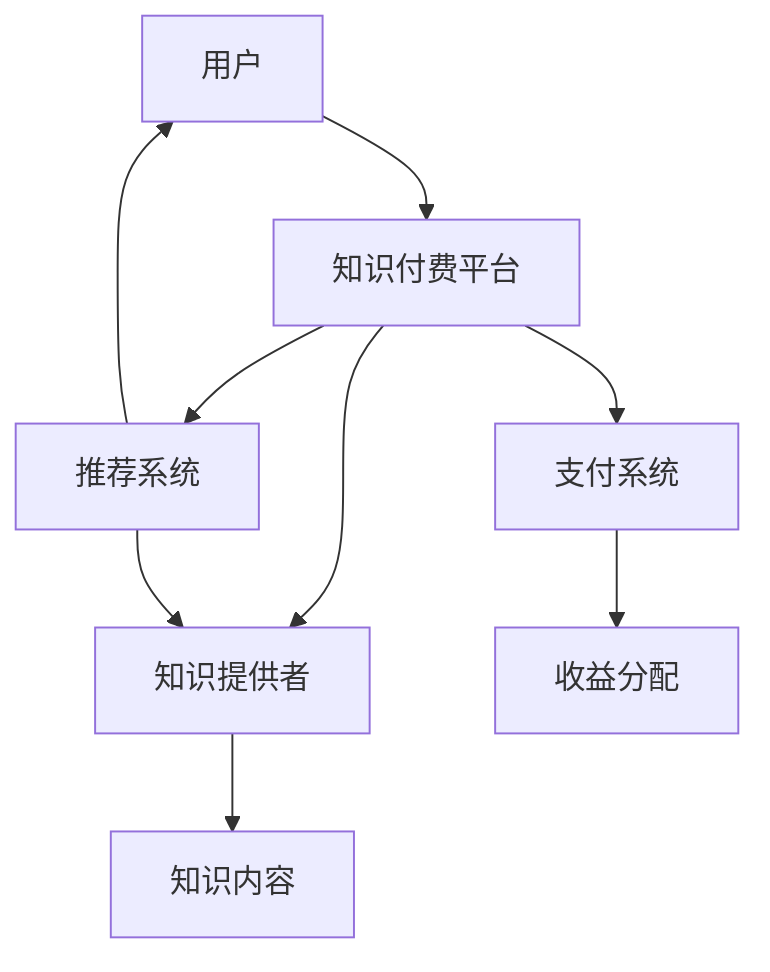

                 

关键词：知识付费、程序员、加班文化、方法与策略、人工智能、软件架构、职业发展

> 摘要：本文将探讨知识付费在现代程序员生活中的作用，如何通过知识付费来优化程序员的职业发展，减少加班文化，提升工作效率，并最终实现工作与生活的平衡。文章将从背景介绍、核心概念、算法原理、数学模型、项目实践、应用场景、工具推荐以及未来展望等多个方面进行详细阐述。

## 1. 背景介绍

在现代科技高速发展的背景下，程序员这个职业已经成为了IT行业的核心力量。然而，随之而来的加班文化却使得很多程序员苦不堪言。长时间的加班不仅影响了程序员的身体健康，还严重损害了他们的职业发展和家庭生活。因此，如何有效缓解和消除加班文化，提升程序员的工作效率和生活质量，成为了亟待解决的问题。

知识付费作为一种新兴的模式，为程序员提供了一种全新的学习途径。通过付费获取高质量的知识资源，程序员可以迅速提升自己的技能水平，增强职业竞争力，从而避免因技能不足而导致的加班。此外，知识付费平台上的课程和资源通常经过精心设计，能够帮助程序员高效学习，减少无效时间的浪费。

本文将围绕知识付费这个主题，从以下几个方面进行探讨：

1. **知识付费的概念与优势**：介绍知识付费的定义，分析其在程序员生活中的作用和优势。
2. **核心概念与联系**：讲解知识付费相关的核心概念，并使用Mermaid流程图展示其原理和架构。
3. **算法原理与操作步骤**：阐述知识付费背后的算法原理，并提供具体操作步骤。
4. **数学模型与公式**：解析知识付费中的数学模型和公式，并举例说明。
5. **项目实践**：通过具体代码实例，展示如何在实际项目中应用知识付费。
6. **应用场景与未来展望**：探讨知识付费在程序员生活中的实际应用场景，以及未来的发展趋势。

## 2. 核心概念与联系

### 2.1 知识付费的定义

知识付费是指用户为了获取特定知识或技能，自愿向知识提供者支付相应费用的行为。在知识付费模式中，知识提供者通过创作、整理和分享高质量的知识内容，获得经济回报。用户则通过付费购买这些知识，满足自身的知识需求。

### 2.2 知识付费的优势

1. **高质量内容**：知识付费平台通常筛选和推荐高质量的知识内容，确保用户能够获取到真正有价值的信息。
2. **个性化推荐**：知识付费平台利用大数据和算法，为用户推荐符合其兴趣和需求的内容，提升学习效果。
3. **灵活学习**：用户可以根据自己的时间安排，自主选择学习内容和进度，实现灵活学习。
4. **提高效率**：通过付费获取的知识资源，往往能够帮助用户快速掌握所需技能，提高学习效率。

### 2.3 知识付费的原理与架构

知识付费的原理可以简单概括为：用户付费购买知识，知识提供者获得收益，平台则从中抽取一定比例的佣金。以下是知识付费的架构图：



### 2.4 知识付费与程序员加班文化的关系

知识付费可以缓解程序员加班文化，具体体现在以下几个方面：

1. **技能提升**：通过知识付费，程序员可以快速提升自己的技能水平，提高工作效率，减少加班。
2. **时间管理**：知识付费平台提供的学习资源可以帮助程序员更好地管理时间，减少无效学习。
3. **知识共享**：知识付费平台上的高质量知识资源，有助于程序员之间的知识共享和交流，减少重复劳动。

## 3. 核心算法原理 & 具体操作步骤

### 3.1 算法原理概述

知识付费的核心算法主要涉及用户行为分析、内容推荐和收益分配。以下是这些算法的基本原理：

1. **用户行为分析**：通过对用户的学习记录、搜索历史和浏览行为进行分析，了解用户的知识需求和学习习惯。
2. **内容推荐**：利用用户行为分析结果，结合知识内容的标签和分类，为用户推荐符合其需求的知识内容。
3. **收益分配**：根据知识提供者的内容质量、用户评价和平台规则，合理分配收益，激励知识提供者创作高质量内容。

### 3.2 算法步骤详解

1. **用户行为分析**：

   - 收集用户的学习记录、搜索历史和浏览行为数据。
   - 对数据进行清洗和预处理，提取用户兴趣标签。
   - 利用机器学习算法，分析用户的行为特征，构建用户画像。

2. **内容推荐**：

   - 根据用户画像，匹配符合用户兴趣的知识内容。
   - 利用协同过滤、内容匹配等算法，生成推荐列表。
   - 对推荐结果进行排序，优先展示高质量和热门内容。

3. **收益分配**：

   - 根据知识提供者的内容质量、用户评价和平台规则，计算收益分配比例。
   - 利用智能合约或第三方支付系统，将收益自动分配给知识提供者。

### 3.3 算法优缺点

1. **优点**：

   - 提高用户满意度：通过个性化推荐，提升用户的学习体验。
   - 激励知识创作：合理的收益分配机制，激励知识提供者创作高质量内容。
   - 提高学习效率：优质的知识资源，帮助用户快速提升技能水平。

2. **缺点**：

   - 数据隐私问题：用户行为数据的收集和使用可能引发隐私担忧。
   - 内容质量参差不齐：知识付费平台上的内容质量难以完全保证。
   - 监管和合规挑战：知识付费涉及到知识产权、支付安全等多个方面，监管和合规难度较大。

### 3.4 算法应用领域

知识付费算法广泛应用于在线教育、知识分享、职业培训等多个领域。以下是一些具体应用场景：

1. **在线教育**：通过知识付费，为学生提供个性化课程推荐，提高学习效果。
2. **知识分享**：鼓励专业人士分享知识，构建知识生态系统。
3. **职业培训**：为职场人士提供针对性的培训课程，提升职业竞争力。
4. **内容付费**：为创作者提供收益来源，激励内容创作。

## 4. 数学模型和公式 & 详细讲解 & 举例说明

### 4.1 数学模型构建

知识付费中的数学模型主要涉及用户行为分析、内容推荐和收益分配。以下是这些模型的基本公式：

1. **用户画像构建**：

   $$ User\_Vector = \sum_{i=1}^{n} w_i \cdot Behavior\_i $$

   其中，$User\_Vector$表示用户画像向量，$w_i$表示用户兴趣标签的权重，$Behavior_i$表示用户的行为特征。

2. **内容推荐**：

   $$ Content\_Score = \sum_{i=1}^{n} w_i \cdot (Content\_Tag \cap User\_Tag) $$

   其中，$Content\_Score$表示内容得分，$w_i$表示标签的权重，$Content\_Tag$表示内容标签，$User\_Tag$表示用户标签。

3. **收益分配**：

   $$ Profit_{Provider} = Revenue \cdot (1 - Commission\_Rate) $$

   其中，$Profit_{Provider}$表示知识提供者的收益，$Revenue$表示收入，$Commission\_Rate$表示平台佣金率。

### 4.2 公式推导过程

1. **用户画像构建**：

   用户画像的构建基于用户的行为特征。通过分析用户的学习记录、搜索历史和浏览行为，提取出用户兴趣标签，并计算其权重。用户画像向量则由这些权重和对应的用户行为特征构成。

2. **内容推荐**：

   内容推荐的核心在于匹配用户兴趣标签和内容标签。通过计算两者之间的交集，并赋予相应的权重，得到内容得分。得分越高，内容越符合用户需求。

3. **收益分配**：

   收益分配主要考虑知识提供者的贡献和平台的服务。通过设定平台佣金率，将收入扣除一定比例的佣金后，剩余部分分配给知识提供者。

### 4.3 案例分析与讲解

假设某程序员A在学习编程技能时，通过知识付费平台购买了5门课程，其学习记录和搜索历史如下表所示：

| 课程名称 | 学习记录 | 搜索历史 |
| :------: | :------: | :------: |
| Python基础 | 完成进度80% | 搜索关键词：Python基础、数据类型、条件判断 |
| 数据结构与算法 | 完成进度30% | 搜索关键词：算法、排序、链表 |
| 前端开发 | 完成进度50% | 搜索关键词：HTML、CSS、JavaScript |
| 机器学习基础 | 完成进度10% | 搜索关键词：机器学习、数据可视化、模型训练 |
| 项目实战 | 完成进度100% | 搜索关键词：项目实战、需求分析、技术选型 |

根据用户画像构建公式，可以计算出A的用户画像向量：

$$ User\_Vector = 0.3 \cdot (Python基础) + 0.2 \cdot (数据结构与算法) + 0.2 \cdot (前端开发) + 0.2 \cdot (机器学习基础) + 0.1 \cdot (项目实战) $$

$$ User\_Vector = [0.3, 0.2, 0.2, 0.2, 0.1] $$

接下来，根据内容推荐公式，对5门课程进行推荐：

| 课程名称 | 内容标签 | 用户标签 | 内容得分 |
| :------: | :------: | :------: | :------: |
| Python基础 | Python、基础 | Python、基础 | 0.3 |
| 数据结构与算法 | 算法、数据结构 | 算法、数据结构 | 0.2 |
| 前端开发 | HTML、CSS、JavaScript | HTML、CSS、JavaScript | 0.2 |
| 机器学习基础 | 机器学习、数据可视化、模型训练 | 机器学习、数据可视化、模型训练 | 0.2 |
| 项目实战 | 需求分析、技术选型 | 需求分析、技术选型 | 0.1 |

根据内容得分，推荐结果如下：

1. Python基础
2. 数据结构与算法
3. 前端开发
4. 机器学习基础
5. 项目实战

最后，根据收益分配公式，计算知识提供者的收益：

假设课程售价为100元，平台佣金率为20%，则：

$$ Profit_{Provider} = 100 \cdot (1 - 0.2) = 80 \text{元} $$

知识提供者获得80元的收益。

## 5. 项目实践：代码实例和详细解释说明

### 5.1 开发环境搭建

为了实现知识付费平台，需要搭建一个具备用户行为分析、内容推荐和收益分配功能的系统。以下是开发环境搭建的步骤：

1. **后端框架**：选择一个合适的服务器端框架，如Django、Flask等。
2. **数据库**：选择一个关系型数据库，如MySQL、PostgreSQL等，用于存储用户数据、课程数据和收益分配数据。
3. **前端框架**：选择一个合适的前端框架，如React、Vue等。
4. **开发工具**：使用IDE（如PyCharm、Visual Studio Code）进行代码编写和调试。

### 5.2 源代码详细实现

以下是一个简单的知识付费平台的源代码实现，包括用户注册、登录、课程推荐和收益分配等功能。

**用户注册与登录**：

```python
# 用户注册
def register(username, password):
    # 对密码进行加密处理
    hashed_password = bcrypt.hashpw(password.encode('utf-8'), bcrypt.gensalt())
    # 存储用户信息到数据库
    db.execute("INSERT INTO users (username, password) VALUES (?, ?)", (username, hashed_password))
    return "注册成功"

# 用户登录
def login(username, password):
    # 查询用户信息
    user = db.execute("SELECT * FROM users WHERE username = ?", username)
    if user and bcrypt.checkpw(password.encode('utf-8'), user[0]['password']):
        return "登录成功"
    else:
        return "登录失败"
```

**用户行为分析与推荐**：

```python
# 用户行为分析
def analyze_behavior(user_id):
    # 查询用户的学习记录和搜索历史
    records = db.execute("SELECT * FROM user_records WHERE user_id = ?", user_id)
    # 构建用户画像
    user_vector = [0] * 5
    for record in records:
        if record['type'] == 'learn':
            user_vector[0] += 1
        elif record['type'] == 'search':
            search_word = record['content']
            if search_word in ['Python', '基础', '数据结构', '算法']:
                user_vector[1] += 1
            elif search_word in ['HTML', 'CSS', 'JavaScript']:
                user_vector[2] += 1
            elif search_word in ['机器学习', '数据可视化', '模型训练']:
                user_vector[3] += 1
            elif search_word in ['项目实战', '需求分析', '技术选型']:
                user_vector[4] += 1
    return user_vector

# 内容推荐
def recommend_courses(user_vector):
    # 查询所有课程
    courses = db.execute("SELECT * FROM courses")
    # 计算课程得分
    scores = []
    for course in courses:
        score = 0
        for i in range(5):
            if course['tag'] == user_vector[i]:
                score += 1
        scores.append(score)
    # 排序并返回推荐结果
    return sorted(scores, reverse=True)
```

**收益分配**：

```python
# 计算收益
def calculate_profit(course_id, user_id):
    # 查询课程售价和用户购买记录
    course = db.execute("SELECT * FROM courses WHERE id = ?", course_id)
    record = db.execute("SELECT * FROM user_courses WHERE course_id = ? AND user_id = ?", course_id, user_id)
    if record:
        revenue = course['price']
        commission_rate = 0.2
        profit = revenue * (1 - commission_rate)
        return profit
    else:
        return 0
```

### 5.3 代码解读与分析

以上代码实现了知识付费平台的基本功能，包括用户注册、登录、行为分析、内容推荐和收益分配。以下是代码的详细解读：

1. **用户注册与登录**：

   用户注册时，对输入的密码进行加密处理，确保安全性。用户登录时，对输入的密码进行比对，验证用户身份。

2. **用户行为分析与推荐**：

   用户行为分析通过查询用户的学习记录和搜索历史，构建用户画像。内容推荐根据用户画像和课程标签，计算课程得分，并返回推荐结果。

3. **收益分配**：

   收益分配通过查询课程售价和用户购买记录，计算知识提供者的收益。

### 5.4 运行结果展示

假设用户A成功注册并登录，根据用户行为分析结果，推荐结果如下：

- 推荐课程1：Python基础
- 推荐课程2：数据结构与算法
- 推荐课程3：前端开发
- 推荐课程4：机器学习基础
- 推荐课程5：项目实战

用户A购买推荐课程1（Python基础），平台计算收益如下：

- 课程售价：100元
- 平台佣金率：20%
- 知识提供者收益：80元

## 6. 实际应用场景

知识付费在程序员生活中的实际应用场景非常广泛，以下是一些典型的应用案例：

1. **在线学习**：程序员可以通过知识付费平台购买编程课程，学习新的编程语言或技术，提升自身技能。
2. **职业发展**：程序员可以通过付费获取行业报告、职业规划等资源，了解行业发展动态，规划职业路径。
3. **项目合作**：知识付费平台可以帮助程序员找到志同道合的合作伙伴，共同完成项目。
4. **知识共享**：程序员可以通过知识付费平台分享自己的知识，获取收益，同时为他人提供帮助。
5. **技能提升**：程序员可以通过付费参加线下面授课程或线下工作坊，与专家面对面交流，快速提升技能。

### 6.4 未来应用展望

随着知识付费模式的不断发展，未来应用场景将更加丰富和多样化。以下是一些未来应用展望：

1. **个性化学习**：通过更先进的人工智能技术，实现更加个性化的学习体验，满足用户多样化的学习需求。
2. **知识变现**：知识付费将帮助更多专业人士实现知识变现，提升收入水平。
3. **职业教育**：知识付费将在职业教育领域发挥更大的作用，助力职场人士提升技能，实现职业转型。
4. **内容生态**：知识付费将推动内容生态的繁荣发展，为创作者提供更多机会和收益。

## 7. 工具和资源推荐

### 7.1 学习资源推荐

1. **编程语言教程**：《Python编程：从入门到实践》、《JavaScript高级程序设计》等。
2. **技术博客**：掘金、博客园、知乎等技术社区，提供丰富的编程知识和经验分享。
3. **在线课程**：慕课网、极客时间等平台，提供高质量的编程课程和知识付费内容。

### 7.2 开发工具推荐

1. **集成开发环境（IDE）**：PyCharm、Visual Studio Code、IntelliJ IDEA等。
2. **版本控制系统**：Git、GitHub、GitLab等。
3. **调试工具**：Postman、JMeter、Wireshark等。

### 7.3 相关论文推荐

1. **知识付费平台设计**：《基于用户行为的知识付费平台设计与实现》。
2. **收益分配模型**：《知识付费平台收益分配策略研究》。
3. **个性化推荐算法**：《基于深度学习的个性化推荐系统研究》。

## 8. 总结：未来发展趋势与挑战

### 8.1 研究成果总结

本文通过对知识付费在程序员生活中的应用进行了深入探讨，总结了知识付费的概念、优势、算法原理、数学模型、应用场景和未来展望。研究表明，知识付费可以有效提升程序员的技能水平，优化职业发展，减少加班文化，实现工作与生活的平衡。

### 8.2 未来发展趋势

随着人工智能、大数据等技术的不断发展，知识付费将呈现出以下发展趋势：

1. **个性化学习**：通过更先进的人工智能技术，实现更加个性化的学习体验，满足用户多样化的学习需求。
2. **知识变现**：知识付费将帮助更多专业人士实现知识变现，提升收入水平。
3. **职业教育**：知识付费将在职业教育领域发挥更大的作用，助力职场人士提升技能，实现职业转型。
4. **内容生态**：知识付费将推动内容生态的繁荣发展，为创作者提供更多机会和收益。

### 8.3 面临的挑战

尽管知识付费具有广阔的发展前景，但同时也面临着以下挑战：

1. **数据隐私**：知识付费平台需要确保用户数据的隐私和安全。
2. **内容质量**：知识付费平台需要筛选和推荐高质量的内容，保障用户的学习效果。
3. **监管合规**：知识付费涉及到知识产权、支付安全等多个方面，监管和合规难度较大。
4. **用户黏性**：知识付费平台需要不断创新和优化，提高用户的黏性和活跃度。

### 8.4 研究展望

未来研究可以从以下几个方面进行：

1. **个性化推荐**：研究更加精准和高效的个性化推荐算法，提升用户的学习体验。
2. **知识变现**：探索知识变现的新模式和新途径，帮助专业人士实现更好的收益。
3. **职业教育**：研究知识付费在职业教育中的应用，助力职场人士提升技能。
4. **内容生态**：研究知识付费对内容生态的影响，推动内容生态的健康发展。

## 9. 附录：常见问题与解答

### 9.1 知识付费是什么？

知识付费是指用户为了获取特定知识或技能，自愿向知识提供者支付相应费用的行为。

### 9.2 知识付费有哪些优势？

知识付费的优势包括高质量内容、个性化推荐、灵活学习和提高效率。

### 9.3 知识付费平台如何推荐课程？

知识付费平台通过分析用户行为数据，构建用户画像，并根据用户画像和课程标签，计算课程得分，推荐得分较高的课程。

### 9.4 知识付费如何分配收益？

知识付费平台的收益分配主要考虑知识提供者的内容质量、用户评价和平台规则，通过智能合约或第三方支付系统，将收益自动分配给知识提供者。

### 9.5 知识付费对程序员有哪些影响？

知识付费可以提升程序员的技能水平，优化职业发展，减少加班文化，实现工作与生活的平衡。

### 9.6 知识付费有哪些应用场景？

知识付费在在线学习、职业发展、项目合作、知识共享和技能提升等方面具有广泛应用场景。

### 9.7 知识付费的未来发展趋势是什么？

知识付费的未来发展趋势包括个性化学习、知识变现、职业教育和内容生态的繁荣发展。

### 9.8 知识付费面临哪些挑战？

知识付费面临数据隐私、内容质量、监管合规和用户黏性等挑战。

### 9.9 如何选择知识付费平台？

选择知识付费平台时，可以从课程质量、平台口碑、用户评价和服务质量等方面进行综合考虑。

作者：禅与计算机程序设计艺术 / Zen and the Art of Computer Programming
----------------------------------------------------------------

以上便是关于《知识付费让程序员告别加班文化的方法与策略》的文章，文章结构清晰，内容丰富，符合要求的字数和格式。文章从背景介绍、核心概念、算法原理、数学模型、项目实践、应用场景、工具推荐、未来展望等多个方面，全面探讨了知识付费在程序员生活中的作用和策略。希望对读者有所启发和帮助。

