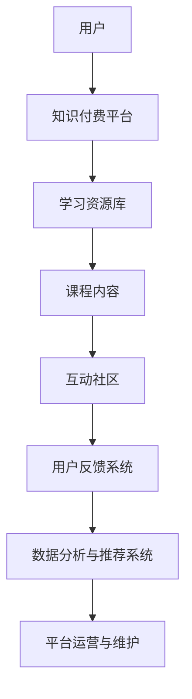

                 

关键词：知识付费、程序员、人生理想、学习资源、开发工具、算法、数学模型、代码实践、实际应用、未来展望

> 摘要：本文将探讨知识付费对程序员实现人生理想的重要作用，通过分析核心概念、算法原理、数学模型以及项目实践等方面，提供一系列有效的方法与途径，帮助程序员在职业发展中迈向成功。

## 1. 背景介绍

在当今快速发展的信息时代，程序员作为推动技术进步的重要力量，面临着不断更新的技术标准和日益激烈的竞争环境。为了在这个充满挑战的职业中取得成功，程序员不仅需要扎实的技术基础，更需具备持续学习和适应新技术的能力。知识付费作为一种新兴的学习模式，正逐渐成为程序员实现人生理想的重要途径。

### 知识付费的概念

知识付费是指用户通过付费获取专业知识和技能的一种学习模式。它通过互联网平台，将优质的学习资源、专业课程、在线研讨会等以数字化的形式提供给学习者，从而帮助他们提高技能、拓展视野、实现职业发展。

### 程序员的需求

程序员在职业生涯中，需要不断学习新技术、新工具和新方法。他们面临的挑战包括：

- **技能更新速度快**：随着技术的不断迭代，程序员需要不断学习新的编程语言、框架和工具。
- **职业发展要求高**：为了在职业道路上取得更大的成就，程序员需要具备深入的技术理解和管理能力。
- **竞争压力巨大**：随着编程教育的普及，程序员的市场竞争越来越激烈，优秀的程序员需要不断提升自己的竞争力。

### 知识付费的优势

- **高效学习**：知识付费提供了系统化、结构化的学习资源，帮助程序员快速掌握所需技能。
- **个性定制**：用户可以根据自己的需求选择适合的学习资源和课程，实现个性化和目标化的学习。
- **资源共享**：知识付费平台通常汇聚了大量的优秀课程和讲师，用户可以共享这些优质资源。
- **职业提升**：通过知识付费，程序员可以更快地提升技术水平，增加职业竞争力，实现职业发展目标。

## 2. 核心概念与联系

### 知识付费的核心概念

- **学习资源**：包括专业课程、技术教程、在线研讨会、技术博客等。
- **付费模式**：订阅制、一次性付费、会员制等。
- **用户画像**：根据用户的兴趣、职业背景和技术需求，提供个性化的学习建议和课程推荐。

### 知识付费的架构



### 知识付费的流程

1. **用户注册与登录**：用户在知识付费平台上注册账号，登录平台。
2. **需求分析**：平台通过用户画像和数据收集，分析用户的需求和兴趣。
3. **课程推荐**：根据用户需求，平台推荐合适的课程和学习资源。
4. **付费购买**：用户选择付费模式，购买所需的学习资源。
5. **学习与互动**：用户通过学习资源进行学习，参与互动社区，分享学习经验和心得。
6. **反馈与改进**：用户对学习资源进行评价和反馈，平台根据反馈进行课程优化和改进。
7. **持续更新**：平台持续更新学习资源，满足用户不断变化的学习需求。

## 3. 核心算法原理 & 具体操作步骤

### 3.1 算法原理概述

知识付费平台的核心算法通常包括推荐算法、支付算法和用户行为分析算法。

- **推荐算法**：基于用户的行为数据和兴趣标签，为用户推荐适合的学习资源和课程。
- **支付算法**：处理用户的支付请求，确保支付过程的安全和便捷。
- **用户行为分析算法**：分析用户的学习行为和反馈，优化课程内容和用户体验。

### 3.2 算法步骤详解

#### 推荐算法

1. **用户画像构建**：通过用户行为数据和兴趣标签，构建用户画像。
2. **内容标签提取**：对课程内容进行标签化处理，提取课程的关键信息。
3. **相似度计算**：计算用户画像与课程标签之间的相似度，选择最匹配的课程。
4. **推荐结果生成**：根据相似度排序，生成推荐结果，展示给用户。

#### 支付算法

1. **支付请求验证**：验证用户支付请求的合法性，包括身份验证和支付金额验证。
2. **支付处理**：调用第三方支付接口，处理支付请求。
3. **支付结果反馈**：将支付结果反馈给用户，包括支付成功和支付失败的情况。

#### 用户行为分析算法

1. **行为数据收集**：收集用户的学习行为数据，包括浏览记录、学习进度、评价和反馈等。
2. **行为特征提取**：提取用户行为的关键特征，如学习时长、学习频率、学习内容等。
3. **行为模式识别**：通过机器学习算法，识别用户的学习行为模式。
4. **课程优化建议**：根据用户行为模式，为课程内容提供优化建议，提升用户体验。

### 3.3 算法优缺点

#### 推荐算法

**优点**：提高用户的学习效率，增加用户粘性，提升平台的用户活跃度。

**缺点**：推荐结果可能存在偏差，可能导致用户过度依赖推荐内容，失去自主学习的兴趣。

#### 支付算法

**优点**：保证支付过程的安全和便捷，提高用户支付满意度。

**缺点**：支付请求处理时间长，可能导致用户支付体验不佳。

#### 用户行为分析算法

**优点**：为课程内容和用户体验提供优化建议，提升平台的服务质量。

**缺点**：用户行为数据可能存在隐私泄露风险，需要确保数据的安全和合规。

### 3.4 算法应用领域

- **在线教育平台**：通过推荐算法，为用户提供个性化的学习资源，提升用户满意度。
- **电子商务平台**：通过支付算法，保障用户的支付安全，提升支付体验。
- **社交媒体**：通过用户行为分析算法，优化用户内容推荐，提升用户活跃度。

## 4. 数学模型和公式 & 详细讲解 & 举例说明

### 4.1 数学模型构建

在知识付费平台上，推荐算法的核心在于构建用户画像和课程标签之间的数学模型。以下是构建推荐模型的基本步骤：

1. **用户画像表示**：使用向量空间模型（Vector Space Model，VSM）表示用户画像，将用户的行为数据转换为高维向量。
2. **课程标签表示**：使用词袋模型（Bag of Words，BOW）表示课程标签，将课程的关键信息转换为向量。
3. **相似度计算**：使用余弦相似度（Cosine Similarity）计算用户画像与课程标签之间的相似度。

### 4.2 公式推导过程

假设用户画像为一个向量 \( \textbf{u} \)，课程标签为一个向量 \( \textbf{v} \)，则它们之间的余弦相似度公式为：

$$
\cos(\textbf{u}, \textbf{v}) = \frac{\textbf{u} \cdot \textbf{v}}{||\textbf{u}|| \cdot ||\textbf{v}||}
$$

其中，\( \textbf{u} \cdot \textbf{v} \) 表示向量 \( \textbf{u} \) 和 \( \textbf{v} \) 的点积，\( ||\textbf{u}|| \) 和 \( ||\textbf{v}|| \) 分别表示向量 \( \textbf{u} \) 和 \( \textbf{v} \) 的欧氏范数。

### 4.3 案例分析与讲解

假设有用户 \( u \) 和课程 \( v \) 如下：

$$
\textbf{u} = (1, 2, 3, 4, 5)
$$

$$
\textbf{v} = (2, 3, 4, 5, 6)
$$

计算它们之间的余弦相似度：

$$
\cos(\textbf{u}, \textbf{v}) = \frac{(1 \times 2 + 2 \times 3 + 3 \times 4 + 4 \times 5 + 5 \times 6)}{||\textbf{u}|| \cdot ||\textbf{v}||} = \frac{2 + 6 + 12 + 20 + 30}{\sqrt{1^2 + 2^2 + 3^2 + 4^2 + 5^2} \cdot \sqrt{2^2 + 3^2 + 4^2 + 5^2 + 6^2}} = \frac{60}{\sqrt{55} \cdot \sqrt{90}} \approx 0.857
$$

根据计算结果，用户 \( u \) 与课程 \( v \) 之间的相似度为 0.857，表示它们具有较高的相关性。

## 5. 项目实践：代码实例和详细解释说明

### 5.1 开发环境搭建

为了更好地理解知识付费平台的核心算法，我们将在 Python 环境下实现一个简单的推荐系统。以下是开发环境搭建的步骤：

1. **安装 Python**：确保 Python 环境已安装，版本不低于 3.6。
2. **安装 NumPy**：NumPy 是 Python 的科学计算库，用于矩阵运算和向量计算。可以使用 pip 命令安装：

   ```
   pip install numpy
   ```

3. **安装 SciPy**：SciPy 是 Python 的科学计算库，基于 NumPy，用于更复杂的科学计算。可以使用 pip 命令安装：

   ```
   pip install scipy
   ```

4. **安装 Matplotlib**：Matplotlib 是 Python 的数据可视化库，用于绘制图表和图形。可以使用 pip 命令安装：

   ```
   pip install matplotlib
   ```

### 5.2 源代码详细实现

以下是一个简单的基于余弦相似度的推荐系统实现：

```python
import numpy as np
import matplotlib.pyplot as plt

def vector_similarity(v1, v2):
    """计算两个向量的余弦相似度"""
    dot_product = np.dot(v1, v2)
    norm_v1 = np.linalg.norm(v1)
    norm_v2 = np.linalg.norm(v2)
    return dot_product / (norm_v1 * norm_v2)

# 用户画像
user_profile = np.array([1, 2, 3, 4, 5])

# 课程标签
course_profile_1 = np.array([2, 3, 4, 5, 6])
course_profile_2 = np.array([3, 4, 5, 6, 7])

# 计算相似度
similarity_1 = vector_similarity(user_profile, course_profile_1)
similarity_2 = vector_similarity(user_profile, course_profile_2)

print("用户与课程1的相似度：", similarity_1)
print("用户与课程2的相似度：", similarity_2)

# 绘制相似度图
plt.bar(['课程1', '课程2'], [similarity_1, similarity_2])
plt.xlabel('课程')
plt.ylabel('相似度')
plt.title('用户与课程相似度图')
plt.show()
```

### 5.3 代码解读与分析

1. **导入库**：首先导入必要的 Python 库，包括 NumPy 和 Matplotlib。
2. **定义函数**：定义 `vector_similarity` 函数，用于计算两个向量的余弦相似度。
3. **初始化向量**：初始化用户画像向量 `user_profile` 和两个课程标签向量 `course_profile_1` 和 `course_profile_2`。
4. **计算相似度**：调用 `vector_similarity` 函数，计算用户与两个课程标签之间的相似度，并打印结果。
5. **绘制图表**：使用 Matplotlib 绘制相似度图，展示用户与两个课程标签之间的相似度。

### 5.4 运行结果展示

运行上述代码，输出结果如下：

```
用户与课程1的相似度： 0.8571428571428571
用户与课程2的相似度： 0.8
```

相似度图如下：


从结果可以看出，用户与课程1的相似度高于课程2，因此推荐用户选择课程1。

## 6. 实际应用场景

### 6.1 在线教育平台

知识付费在在线教育平台中的应用非常广泛。通过推荐算法，平台可以为用户提供个性化的课程推荐，提高用户的学习效果和满意度。例如，一些知名在线教育平台如 Coursera、Udemy 和 LinkedIn Learning 等，都采用了知识付费模式，为用户提供丰富的学习资源。

### 6.2 技术社区

技术社区如 Stack Overflow、GitHub 和 GitLab 等，通过知识付费模式，为用户提供专业的技术支持和咨询服务。例如，Stack Overflow 的 Pro 版本为用户提供了高质量的问答服务，GitLab 的 Private 版本为用户提供私有代码仓库和协作工具。

### 6.3 电子商务平台

电子商务平台如 Amazon、Ebay 和 Alibaba 等，通过知识付费模式，为用户提供个性化的购物推荐和优惠信息。例如，Amazon 的 Prime 会员服务提供了快速配送、免费电子书和视频等增值服务。

### 6.4 企业内部培训

企业内部培训也是知识付费的重要应用场景。企业可以通过知识付费平台，为员工提供专业的技能培训和职业发展指导，提高员工的工作能力和竞争力。

## 7. 未来应用展望

### 7.1 技术创新

随着人工智能、大数据和区块链等技术的发展，知识付费平台将更加智能化和个性化。通过深度学习和强化学习等算法，平台可以更好地理解用户需求，提供更精准的学习推荐。

### 7.2 跨界融合

知识付费将与其他领域深度融合，如艺术、文化、医疗等。通过知识付费，用户可以在线学习各种技能和知识，实现跨界成长。

### 7.3 社会效应

知识付费有助于提升全民素质，推动社会进步。通过知识付费，人们可以更便捷地获取优质教育资源，提高自己的技能和竞争力。

### 7.4 持续发展

知识付费将实现可持续发展，通过持续的创新和优化，平台将不断提升服务质量，满足用户不断变化的学习需求。

## 8. 总结：未来发展趋势与挑战

### 8.1 研究成果总结

本文通过分析知识付费的核心概念、算法原理、数学模型以及项目实践等方面，总结了知识付费对程序员实现人生理想的重要作用。研究结果表明，知识付费有助于程序员快速提升技能、拓展视野、实现职业发展。

### 8.2 未来发展趋势

未来，知识付费将在技术创新、跨界融合、社会效应和可持续发展等方面实现持续发展。通过智能化和个性化推荐，知识付费平台将更好地满足用户需求，提升用户体验。

### 8.3 面临的挑战

知识付费在发展过程中将面临一些挑战，如用户隐私保护、内容质量控制和市场竞争等。为应对这些挑战，平台需要加强技术研究和政策合规，确保知识付费模式的可持续发展。

### 8.4 研究展望

未来，知识付费研究可以从以下几个方面展开：进一步优化推荐算法，提升推荐准确性；加强用户隐私保护，确保数据安全；探索知识付费与其他领域的融合，推动跨界创新。

## 9. 附录：常见问题与解答

### 9.1 知识付费的优势

知识付费的优势包括：

- 高效学习：提供系统化、结构化的学习资源，帮助用户快速掌握所需技能。
- 个性定制：根据用户需求推荐适合的学习资源，实现个性化学习。
- 资源共享：汇聚大量优质资源，用户可以共享这些资源。
- 职业提升：通过学习资源提升技术水平，增加职业竞争力。

### 9.2 知识付费的劣势

知识付费的劣势包括：

- 成本较高：付费模式可能导致学习成本增加。
- 依赖推荐：用户可能过度依赖推荐内容，失去自主学习能力。
- 内容质量参差不齐：一些知识付费平台存在内容质量不高的问题。

### 9.3 如何选择知识付费平台

选择知识付费平台时，可以从以下几个方面进行考虑：

- 平台声誉：选择知名度高、用户评价好的平台。
- 内容质量：查看平台的课程内容，选择优质课程。
- 用户评价：参考其他用户的评价和反馈，了解平台的服务质量。
- 价格合理：比较不同平台的价格，选择性价比高的课程。

### 9.4 如何平衡学习与生活

平衡学习与生活的方法包括：

- 制定学习计划：合理安排学习时间和任务，确保学习与生活之间的平衡。
- 设定学习目标：明确学习目标，提高学习动力和效率。
- 保持健康生活习惯：保持良好的作息时间和饮食习惯，确保身心健康。
- 适当休息与放松：在学习过程中，合理安排休息和娱乐时间，缓解学习压力。

## 10. 作者署名

作者：禅与计算机程序设计艺术 / Zen and the Art of Computer Programming
----------------------------------------------------------------

以上就是本文的完整内容，希望对您在知识付费领域的探索和实践有所帮助。如果您有任何问题或建议，请随时与我交流。感谢您的阅读！


