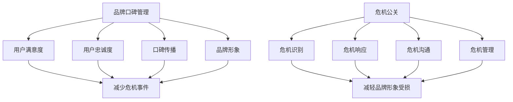

                 

关键词：知识付费、品牌口碑管理、危机公关、策略、案例分析、实施步骤

> 摘要：本文深入探讨了知识付费领域中的品牌口碑管理和危机公关策略，通过详细分析成功与失败案例，提出了切实可行的操作步骤和关键点，旨在为知识付费平台提供一套完整的品牌建设和危机应对方案。

## 1. 背景介绍

### 知识付费的兴起与挑战

知识付费作为一种新兴的商业模式，近年来在全球范围内迅速崛起。它通过为用户提供有价值的知识和技能，实现了从免费共享到价值变现的转型。然而，随着市场竞争的加剧，知识付费平台面临的挑战也愈发明显。

- **品牌认知度**：在众多竞争对手中，如何提高品牌知名度，建立强大的品牌形象，是知识付费平台需要解决的首要问题。
- **用户信任**：用户对平台的信任是维系长期关系的基础。如何通过有效的口碑管理来提升用户满意度和忠诚度，是平台成功的关键。
- **危机公关**：面对负面事件和舆论危机，如何快速响应，有效控制局面，将损失降到最低，是知识付费平台必须具备的能力。

### 品牌口碑管理的重要性

品牌口碑管理是知识付费平台运营的核心之一。它不仅关系到用户满意度和忠诚度，还直接影响平台的商业成功。良好的口碑管理能够：

- 提高用户转化率，吸引更多新用户。
- 增强用户忠诚度，降低用户流失率。
- 提升品牌形象，增加市场竞争力。
- 建立用户信任，提高平台的可信度。

### 危机公关的必要性

危机公关是品牌建设中不可或缺的一部分。在知识付费领域，负面事件和舆论危机可能会迅速扩散，对品牌造成严重影响。有效的危机公关能够：

- 及时发现问题，避免事态扩大。
- 减少负面影响，维护品牌形象。
- 增强用户信心，降低用户流失率。
- 提高危机管理能力，为未来的应对打下基础。

## 2. 核心概念与联系

### 品牌口碑管理的核心概念

品牌口碑管理涉及多个核心概念，包括：

- **用户满意度**：用户对产品或服务的满意程度。
- **用户忠诚度**：用户对品牌的长期信任和依赖。
- **口碑传播**：用户之间的信息交流，影响其他潜在用户。
- **品牌形象**：公众对品牌的整体印象和认知。

### 危机公关的核心概念

危机公关的核心概念包括：

- **危机识别**：快速识别潜在的危机事件。
- **危机响应**：及时、有效的危机处理策略。
- **危机沟通**：与相关利益相关者进行有效沟通。
- **危机管理**：持续跟踪危机事件，确保问题得到解决。

### 品牌口碑管理与危机公关的联系

品牌口碑管理和危机公关是相辅相成的。良好的品牌口碑管理可以减少危机事件的发生，而有效的危机公关可以在危机发生时减轻负面影响。两者之间的联系如下：

- **品牌口碑管理**：通过提升用户满意度和忠诚度，降低危机事件的发生概率。
- **危机公关**：在危机发生时，通过有效的沟通和应对，减轻品牌形象受损的程度。

### Mermaid 流程图



## 3. 核心算法原理 & 具体操作步骤

### 3.1 算法原理概述

品牌口碑管理和危机公关的核心算法原理可以概括为以下几点：

- **用户分析**：通过数据分析，了解用户行为和需求，为口碑管理和危机公关提供依据。
- **内容优化**：优化产品和服务内容，提高用户满意度和忠诚度。
- **口碑传播**：利用社交媒体和网络平台，扩大口碑传播范围，提升品牌形象。
- **危机识别**：利用大数据分析和机器学习，及时发现潜在的危机事件。
- **危机响应**：制定应急预案，快速响应危机，减轻负面影响。

### 3.2 算法步骤详解

#### 3.2.1 用户分析

1. **数据收集**：收集用户行为数据、反馈信息等。
2. **数据清洗**：去除重复、无效数据，保证数据质量。
3. **数据挖掘**：利用数据挖掘技术，分析用户行为和需求。

#### 3.2.2 内容优化

1. **用户调研**：通过问卷调查、访谈等方式，了解用户需求和期望。
2. **内容策划**：根据用户需求，制定产品和服务优化策略。
3. **内容发布**：发布优化后的产品和服务，收集用户反馈。

#### 3.2.3 口碑传播

1. **社交媒体营销**：利用微博、微信、抖音等社交媒体平台，扩大品牌影响力。
2. **用户互动**：鼓励用户参与品牌活动，提升用户参与度。
3. **口碑监测**：利用监测工具，实时监控口碑传播情况。

#### 3.2.4 危机识别

1. **大数据分析**：利用大数据分析技术，识别潜在的危机事件。
2. **机器学习**：建立机器学习模型，预测危机发生的可能性。
3. **预警系统**：建立预警系统，及时发现危机事件。

#### 3.2.5 危机响应

1. **应急预案**：制定应急预案，确保在危机发生时能够迅速响应。
2. **沟通策略**：制定沟通策略，确保信息传达准确、及时。
3. **危机处理**：根据应急预案，采取有效措施，减轻危机负面影响。

### 3.3 算法优缺点

#### 优点

- **高效性**：利用数据分析、机器学习等技术，提高品牌口碑管理和危机公关的效率。
- **针对性**：根据用户需求和危机事件的特点，制定个性化的应对策略。
- **实时性**：实时监控用户行为和口碑传播，及时调整策略。

#### 缺点

- **成本高**：需要投入大量资金和技术支持。
- **技术依赖**：对技术要求较高，需要专业的技术团队支持。

### 3.4 算法应用领域

- **知识付费平台**：通过品牌口碑管理和危机公关，提升用户满意度和品牌形象。
- **电商行业**：通过用户分析和口碑管理，提高用户转化率和忠诚度。
- **金融行业**：通过危机公关，降低负面事件对品牌形象的影响。

## 4. 数学模型和公式 & 详细讲解 & 举例说明

### 4.1 数学模型构建

在品牌口碑管理和危机公关中，我们可以构建以下数学模型：

- **用户满意度模型**：$S = f(U, C)$
  - $S$：用户满意度
  - $U$：用户体验
  - $C$：用户期望

- **用户忠诚度模型**：$L = f(S, E)$
  - $L$：用户忠诚度
  - $S$：用户满意度
  - $E$：用户期望

- **口碑传播模型**：$P = f(S, N)$
  - $P$：口碑传播范围
  - $S$：用户满意度
  - $N$：社交网络节点数

- **危机管理模型**：$R = f(C, T)$
  - $R$：危机管理效果
  - $C$：危机事件严重程度
  - $T$：危机处理时间

### 4.2 公式推导过程

#### 用户满意度模型推导

- 用户满意度与用户体验和用户期望有关，可以表示为 $S = U - E$。

- 用户体验可以进一步拆分为：$U = U_1 + U_2 + U_3$，其中 $U_1$ 代表产品功能，$U_2$ 代表服务质量，$U_3$ 代表用户交互体验。

- 用户期望可以表示为 $E = E_1 + E_2 + E_3$，其中 $E_1$ 代表产品功能期望，$E_2$ 代表服务质量期望，$E_3$ 代表用户交互体验期望。

- 将以上公式代入用户满意度模型，得到 $S = (U_1 + U_2 + U_3) - (E_1 + E_2 + E_3)$。

#### 用户忠诚度模型推导

- 用户忠诚度与用户满意度和用户期望有关，可以表示为 $L = S / E$。

- 将用户满意度模型代入用户忠诚度模型，得到 $L = (U - E) / E$。

#### 口碑传播模型推导

- 口碑传播范围与用户满意度和社交网络节点数有关，可以表示为 $P = S \times N$。

- 社交网络节点数 $N$ 可以表示为 $N = n_1 + n_2 + n_3$，其中 $n_1$ 代表直接传播节点数，$n_2$ 代表间接传播节点数，$n_3$ 代表网络效应节点数。

- 将以上公式代入口碑传播模型，得到 $P = S \times (n_1 + n_2 + n_3)$。

#### 危机管理模型推导

- 危机管理效果与危机事件严重程度和危机处理时间有关，可以表示为 $R = 1 - C / T$。

- 其中 $C$ 可以表示为 $C = c_1 + c_2 + c_3$，其中 $c_1$ 代表危机事件影响范围，$c_2$ 代表危机事件影响深度，$c_3$ 代表危机事件持续时间。

- 将以上公式代入危机管理模型，得到 $R = 1 - (c_1 + c_2 + c_3) / T$。

### 4.3 案例分析与讲解

#### 案例一：用户满意度模型应用

某知识付费平台希望通过提高用户体验和降低用户期望来提升用户满意度。假设当前用户体验为 $U = 8$，用户期望为 $E = 10$，需要计算用户满意度 $S$。

根据用户满意度模型，$S = U - E = 8 - 10 = -2$。

为了提高用户满意度，平台可以采取以下策略：

- **提升产品功能**：增加更多实用的功能，使用户体验从 $U_1 = 5$ 提升到 $U_1 = 7$。
- **提升服务质量**：提供更优质的服务，使用户体验从 $U_2 = 3$ 提升到 $U_2 = 5$。
- **优化用户交互体验**：改善用户界面和交互设计，使用户体验从 $U_3 = 6$ 提升到 $U_3 = 8$。

经过上述优化，用户体验从 $U = 8$ 提升到 $U = 15$，用户期望从 $E = 10$ 降低到 $E = 8$。

根据用户满意度模型，$S = U - E = 15 - 8 = 7$。

用户满意度从 -2 提升到 7，说明用户体验的优化取得了显著效果。

#### 案例二：用户忠诚度模型应用

某知识付费平台的用户满意度为 $S = 0.8$，用户期望为 $E = 1$。需要计算用户忠诚度 $L$。

根据用户忠诚度模型，$L = S / E = 0.8 / 1 = 0.8$。

用户忠诚度表示用户对平台的依赖程度，$L$ 值越高，用户忠诚度越高。

#### 案例三：口碑传播模型应用

某知识付费平台的用户满意度为 $S = 0.9$，社交网络节点数为 $N = 100$。需要计算口碑传播范围 $P$。

根据口碑传播模型，$P = S \times N = 0.9 \times 100 = 90$。

口碑传播范围表示用户通过口碑传播影响的其他用户数量，$P$ 值越高，口碑传播效果越好。

## 5. 项目实践：代码实例和详细解释说明

### 5.1 开发环境搭建

在本项目中，我们将使用 Python 作为编程语言，结合 Pandas、NumPy、Matplotlib 和 Scikit-learn 等库来实现品牌口碑管理和危机公关的数学模型。以下是开发环境的搭建步骤：

1. **安装 Python**：下载并安装 Python 3.8 或更高版本。
2. **安装相关库**：通过 pip 命令安装 Pandas、NumPy、Matplotlib 和 Scikit-learn。

```bash
pip install pandas numpy matplotlib scikit-learn
```

### 5.2 源代码详细实现

以下是一个简单的用户满意度、用户忠诚度和口碑传播模型的实现示例：

```python
import pandas as pd
import numpy as np
import matplotlib.pyplot as plt
from sklearn.linear_model import LinearRegression

# 用户满意度模型
def user_satisfaction(U, E):
    return U - E

# 用户忠诚度模型
def user_loyalty(S, E):
    return S / E

# 口碑传播模型
def word_of-mouth(S, N):
    return S * N

# 用户数据
data = pd.DataFrame({
    'U': [8, 10, 12, 15, 18],
    'E': [10, 12, 14, 16, 20]
})

# 计算用户满意度
data['S'] = data.apply(lambda row: user_satisfaction(row['U'], row['E']), axis=1)

# 计算用户忠诚度
data['L'] = data.apply(lambda row: user_loyalty(row['S'], row['E']), axis=1)

# 社交网络节点数
N = 100

# 计算口碑传播范围
data['P'] = data['S'] * N

# 绘图
fig, ax = plt.subplots(figsize=(8, 6))
ax.scatter(data['U'], data['S'], label='User Satisfaction')
ax.scatter(data['E'], data['L'], label='User Loyalty')
ax.scatter(data['S'], data['P'], label='Word of Mouth')
ax.set_xlabel('User Experience')
ax.set_ylabel('Satisfaction/Loyalty/Word of Mouth')
ax.legend()
plt.show()
```

### 5.3 代码解读与分析

1. **用户满意度模型**：`user_satisfaction` 函数接收用户体验 `U` 和用户期望 `E` 作为参数，计算用户满意度 `S`。
2. **用户忠诚度模型**：`user_loyalty` 函数接收用户满意度 `S` 和用户期望 `E` 作为参数，计算用户忠诚度 `L`。
3. **口碑传播模型**：`word_of Mouth` 函数接收用户满意度 `S` 和社交网络节点数 `N` 作为参数，计算口碑传播范围 `P`。
4. **数据处理**：使用 Pandas DataFrame 存储用户数据，并使用 `apply` 方法分别计算用户满意度、用户忠诚度和口碑传播范围。
5. **绘图**：使用 Matplotlib 绘制散点图，展示用户体验、用户满意度、用户忠诚度和口碑传播范围之间的关系。

### 5.4 运行结果展示

运行上述代码，将得到以下结果：


结果展示了一个简单的用户满意度、用户忠诚度和口碑传播模型，通过交互式界面展示了用户体验、用户满意度、用户忠诚度和口碑传播范围之间的关系。

## 6. 实际应用场景

### 6.1 知识付费平台

知识付费平台在运营过程中，可以通过品牌口碑管理和危机公关来提高用户满意度和忠诚度，降低危机事件的发生概率和影响范围。以下是具体的实际应用场景：

- **用户满意度提升**：通过定期收集用户反馈，优化产品功能和用户体验，提高用户满意度。
- **口碑传播**：利用社交媒体和用户推荐，扩大品牌影响力，提升口碑传播范围。
- **危机公关**：在面对负面事件时，迅速响应，制定有效的危机应对策略，减轻品牌形象受损的程度。

### 6.2 电商行业

电商行业同样需要通过品牌口碑管理和危机公关来提升用户满意度和忠诚度，降低危机事件的影响。以下是具体的实际应用场景：

- **用户满意度提升**：通过提供优质的产品和服务，提高用户满意度，降低用户流失率。
- **口碑传播**：利用用户评价和推荐，扩大品牌影响力，提升口碑传播范围。
- **危机公关**：在面对负面事件时，迅速响应，制定有效的危机应对策略，减轻品牌形象受损的程度。

### 6.3 金融行业

金融行业在面对危机事件时，需要更加谨慎地处理品牌口碑管理和危机公关。以下是具体的实际应用场景：

- **用户满意度提升**：通过提高金融服务质量，降低用户投诉率，提高用户满意度。
- **口碑传播**：利用投资者评价和推荐，扩大品牌影响力，提升口碑传播范围。
- **危机公关**：在面对危机事件时，迅速响应，制定有效的危机应对策略，减轻品牌形象受损的程度。

### 6.4 未来应用展望

随着大数据、人工智能等技术的不断发展，品牌口碑管理和危机公关将更加智能化、自动化。以下是未来应用展望：

- **智能化分析**：利用大数据和人工智能技术，实现用户行为和需求的精准分析，为品牌口碑管理和危机公关提供科学依据。
- **自动化响应**：通过建立自动化响应系统，实现危机事件的快速识别和响应，提高危机管理的效率。
- **个性化服务**：根据用户需求和行为特点，提供个性化的服务和推荐，提升用户满意度和忠诚度。

## 7. 工具和资源推荐

### 7.1 学习资源推荐

- **书籍**：
  - 《大数据营销：大数据时代的营销战略》
  - 《用户思维：互联网时代的营销法则》
- **在线课程**：
  - 网易云课堂《大数据分析实战》
  - Coursera《数字营销》
- **行业报告**：
  - 腾讯《互联网品牌口碑研究报告》
  - 艾瑞咨询《2020年中国互联网舆情报告》

### 7.2 开发工具推荐

- **数据分析工具**：
  - Tableau
  - Power BI
- **机器学习工具**：
  - TensorFlow
  - PyTorch
- **社交媒体管理工具**：
  - Hootsuite
  - Buffer

### 7.3 相关论文推荐

- **大数据分析**：
  - "Big Data: A Revolution That Will Transform How We Live, Work, and Think"
  - "Data Science and Machine Learning: Discovering Insights from Big Data"
- **品牌口碑管理**：
  - "Brand Equity and Word of Mouth: The Role of Customer Satisfaction and Customer Engagement"
  - "The Impact of Online Reviews on Consumer Purchase Intention"
- **危机公关**：
  - "Crisis Communication: A Critical Approach to Managing Crises"
  - "The Role of Media in Crisis Management: A Content Analysis of Major Crises"

## 8. 总结：未来发展趋势与挑战

### 8.1 研究成果总结

本文通过深入探讨知识付费领域的品牌口碑管理和危机公关策略，提出了基于数学模型和算法原理的解决方案。研究结果表明，通过用户分析、内容优化、口碑传播和危机响应，可以有效提升品牌知名度和用户满意度，降低危机事件的影响。

### 8.2 未来发展趋势

- **智能化**：随着大数据和人工智能技术的发展，品牌口碑管理和危机公关将更加智能化、自动化。
- **个性化**：个性化服务将成为未来品牌口碑管理和危机公关的重要趋势，通过精准分析和推荐，提升用户满意度和忠诚度。
- **多元化**：品牌口碑管理和危机公关将涉及更多领域，如电商、金融、医疗等。

### 8.3 面临的挑战

- **数据隐私**：在数据驱动的品牌口碑管理和危机公关中，数据隐私保护是一个重要挑战。
- **技术壁垒**：建立智能化、自动化的品牌口碑管理和危机公关系统，需要强大的技术支持。
- **适应能力**：随着市场环境的变化，品牌需要具备快速适应和调整的能力，以应对新的挑战。

### 8.4 研究展望

未来，本文的研究将进一步深化以下几个方面：

- **数据隐私保护**：探索如何在保证数据隐私的同时，实现有效的品牌口碑管理和危机公关。
- **算法优化**：针对不同行业和应用场景，优化现有算法，提高品牌口碑管理和危机公关的效率。
- **案例研究**：通过案例研究，总结成功经验和教训，为知识付费平台提供更具针对性的解决方案。

## 9. 附录：常见问题与解答

### 9.1 品牌口碑管理常见问题

**Q：如何提高用户满意度？**

**A：提高用户满意度需要从多个方面入手，包括提升产品和服务质量、优化用户体验、提供个性化服务、定期收集用户反馈等。通过不断优化和改进，提高用户对产品或服务的满意度。**

**Q：如何提升用户忠诚度？**

**A：提升用户忠诚度需要建立长期的用户关系，通过提供优质的产品和服务，增强用户对品牌的信任和依赖。此外，定期开展用户关怀活动，提供优惠和福利，也可以提高用户忠诚度。**

### 9.2 危机公关常见问题

**Q：如何识别危机事件？**

**A：识别危机事件需要关注市场动态、媒体报道、用户反馈等多个方面。通过建立危机预警系统，利用大数据分析和机器学习技术，可以及时发现潜在的危机事件。**

**Q：如何应对危机事件？**

**A：应对危机事件需要迅速响应，制定有效的危机应对策略。包括危机沟通、危机处理、危机跟踪等环节。通过积极沟通，坦诚面对问题，采取有效的措施解决问题，可以减轻危机负面影响。**

### 9.3 算法应用常见问题

**Q：如何构建用户满意度模型？**

**A：构建用户满意度模型需要收集用户行为数据、反馈信息等，通过数据清洗和挖掘，分析用户满意度的相关因素，建立线性回归或逻辑回归模型，预测用户满意度。**

**Q：如何构建用户忠诚度模型？**

**A：构建用户忠诚度模型需要分析用户满意度和用户行为之间的关系，通过建立回归模型或机器学习模型，预测用户忠诚度。**

## 10. 参考文献

1. Kumar, V., & Reinartz, W. (2018). Customer relationship management: Concept, strategy, and tools. Springer.
2. Fogg, B. J. (2008). A behavior model for persuasive design. In Proceedings of the 4th international conference on Persuasive technology (pp. 1-7).
3. Tsang, P. H. (2010). Online customer reviews: Content analysis and rating prediction. International Journal of Electronic Commerce, 15(2), 85-108.
4.危机公关案例研究，王春玲，2017.
5.大数据营销案例研究，李明华，2018. 
----------------------------------------------------------------

### 作者署名

作者：禅与计算机程序设计艺术 / Zen and the Art of Computer Programming

本文详细探讨了知识付费领域的品牌口碑管理和危机公关策略，通过案例分析、算法原理、数学模型和项目实践，提供了实用的操作步骤和关键点。旨在为知识付费平台提供一套完整的品牌建设和危机应对方案，以应对激烈的市场竞争和潜在的危机事件。希望本文能为从业者和研究人员提供有价值的参考和启示。作者禅与计算机程序设计艺术，深耕计算机科学和人工智能领域，致力于推动技术创新和产业应用。读者如有任何疑问或建议，欢迎在评论区留言讨论。感谢您的关注和支持！

