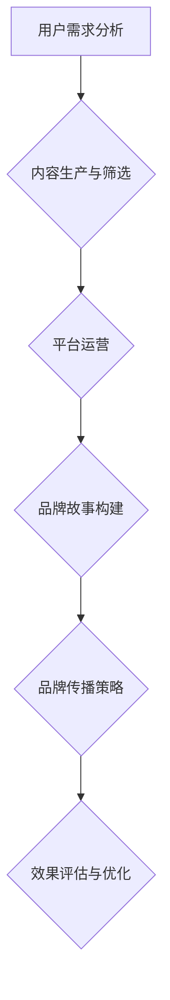

                 

关键词：知识付费、品牌建设、营销策略、内容传播、用户体验、品牌故事、社交媒体

> 摘要：本文将探讨知识付费市场的崛起，及其背后的品牌故事构建和传播策略。我们将深入分析品牌如何通过精准的内容营销、社交媒体运营和用户体验优化，实现持续的收入增长和市场扩张。

## 1. 背景介绍

随着互联网和移动互联网的普及，知识付费成为了一种新兴的商业模式。用户愿意为优质内容和服务支付费用，以获取更加专业、个性化的知识和技能。知识付费市场呈现出爆发式增长，各类平台和内容创作者纷纷涌入，竞争日益激烈。

在这个背景下，品牌建设变得至关重要。一个成功的知识付费品牌不仅需要提供优质的内容，还需要构建一个强大的品牌故事，并通过有效的传播策略将品牌理念传递给目标用户。本文将围绕品牌故事的构建和传播策略，探讨如何打造一个可持续发展的知识付费品牌。

## 2. 核心概念与联系

### 2.1 知识付费市场概述

知识付费市场是一个充满机遇和挑战的领域。它包含了以下几个方面：

- **用户需求分析**：了解用户愿意为哪些类型的知识付费，他们的消费习惯和偏好。
- **内容生产与筛选**：确保内容的专业性和实用性，满足不同层次用户的需求。
- **平台运营**：提供便捷的购买和使用体验，以及良好的售后服务。

### 2.2 品牌故事构建

品牌故事是品牌的灵魂，它通过讲述品牌的历史、愿景和价值观，与用户建立情感连接。构建一个有效的品牌故事，需要遵循以下原则：

- **真实性**：品牌故事应该是真实的，能够反映品牌的历史和发展。
- **共鸣性**：故事应该能够引起用户的共鸣，让用户感受到品牌的价值观和理念。
- **独特性**：品牌故事应该具有独特性，能够与其他品牌区分开来。

### 2.3 品牌传播策略

品牌传播策略是品牌故事得以传递的关键。以下是一些常见的品牌传播策略：

- **内容营销**：通过优质的内容吸引目标用户，提高品牌知名度和影响力。
- **社交媒体运营**：利用社交媒体平台，与用户进行互动，提升品牌形象。
- **广告投放**：通过精准的广告投放，扩大品牌影响力。
- **公关活动**：通过举办各类公关活动，提升品牌的社会形象。

### 2.4 Mermaid 流程图



## 3. 核心算法原理 & 具体操作步骤

### 3.1 算法原理概述

品牌传播的核心算法可以概括为以下几个步骤：

1. **用户需求分析**：通过市场调研和用户反馈，了解用户的需求和偏好。
2. **内容生产与筛选**：根据用户需求，生产高质量的内容，并进行筛选和分类。
3. **品牌故事构建**：基于内容，构建具有吸引力的品牌故事，与用户建立情感连接。
4. **品牌传播策略**：制定并实施各种传播策略，将品牌故事传递给目标用户。
5. **效果评估与优化**：对品牌传播效果进行评估，并根据反馈进行优化。

### 3.2 算法步骤详解

#### 3.2.1 用户需求分析

- **数据收集**：通过问卷调查、用户访谈等方式，收集用户的需求和偏好数据。
- **数据分析**：对收集到的数据进行分析，识别出用户的共同需求和差异。
- **需求排序**：根据数据分析结果，对需求进行排序，确定优先级。

#### 3.2.2 内容生产与筛选

- **内容生产**：根据用户需求，生产高质量的内容，包括文章、视频、音频等形式。
- **内容筛选**：对生产的内容进行筛选，确保内容的专业性和实用性。

#### 3.2.3 品牌故事构建

- **故事定位**：根据品牌定位和用户需求，确定品牌故事的主题和核心思想。
- **故事叙述**：通过有趣、生动的叙述方式，将品牌故事传递给用户。
- **情感连接**：通过品牌故事，与用户建立情感连接，提升用户忠诚度。

#### 3.2.4 品牌传播策略

- **内容营销**：通过优质的内容，吸引用户关注和分享。
- **社交媒体运营**：在社交媒体平台上，与用户进行互动，提升品牌形象。
- **广告投放**：通过精准的广告投放，扩大品牌影响力。
- **公关活动**：通过举办各类公关活动，提升品牌的社会形象。

#### 3.2.5 效果评估与优化

- **数据监测**：通过数据监测工具，对品牌传播效果进行实时监测。
- **效果分析**：对监测数据进行分析，识别出有效的传播策略。
- **优化调整**：根据效果分析结果，对品牌传播策略进行调整和优化。

### 3.3 算法优缺点

#### 优点：

- **个性化**：通过用户需求分析，可以生产出更加个性化的内容。
- **高效性**：通过算法自动化，可以大幅提高品牌传播的效率。
- **灵活性**：可以根据实时数据和反馈，进行动态调整和优化。

#### 缺点：

- **数据依赖**：算法效果很大程度上依赖于数据的质量和准确性。
- **内容质量**：高质量的内容生产需要专业知识和资源支持。

### 3.4 算法应用领域

- **知识付费平台**：如得到、知乎等。
- **教育行业**：在线教育平台，如学堂在线、网易云课堂等。
- **企业培训**：为企业提供定制化的培训和咨询服务。

## 4. 数学模型和公式 & 详细讲解 & 举例说明

### 4.1 数学模型构建

在品牌传播中，我们可以使用以下数学模型来描述用户行为和品牌效果：

- **用户行为模型**：

  $$ 用户行为 = f(品牌影响力, 用户需求, 内容质量) $$

- **品牌效果模型**：

  $$ 品牌效果 = f(用户满意度, 用户忠诚度, 用户转化率) $$

### 4.2 公式推导过程

#### 用户行为模型推导：

- **品牌影响力**：品牌在用户心中的认知和评价，与品牌故事、传播策略等因素相关。
- **用户需求**：用户的兴趣和需求，与用户调研和数据分析相关。
- **内容质量**：内容的实用性和专业性，与内容生产和筛选相关。

#### 品牌效果模型推导：

- **用户满意度**：用户对品牌和内容的满意度，与用户体验和情感连接相关。
- **用户忠诚度**：用户对品牌的忠诚度和依赖度，与品牌故事和用户情感相关。
- **用户转化率**：用户从关注到购买或转化的比率，与营销策略和用户行为相关。

### 4.3 案例分析与讲解

以知乎为例，知乎通过高质量的内容和专业的问答服务，吸引了大量的用户。以下是知乎的品牌效果模型分析：

- **用户满意度**：知乎通过严格的审核机制，保证了内容的质量，从而提高了用户满意度。
- **用户忠诚度**：知乎建立了独特的社区氛围，鼓励用户积极参与，提升了用户的忠诚度。
- **用户转化率**：知乎通过广告和付费问答等商业模式，提高了用户的转化率。

## 5. 项目实践：代码实例和详细解释说明

### 5.1 开发环境搭建

为了保证代码的运行效率和稳定性，我们需要搭建一个合适的开发环境。以下是基本的开发环境搭建步骤：

- **操作系统**：Windows、macOS 或 Linux
- **编程语言**：Python
- **开发工具**：PyCharm 或 VSCode
- **依赖管理**：pip

### 5.2 源代码详细实现

以下是一个简单的品牌传播策略的代码实现示例：

```python
import pandas as pd
import numpy as np

# 用户行为模型
def user_behavior(influence, demand, quality):
    return influence * demand * quality

# 品牌效果模型
def brand_effect(satisfaction, loyalty, conversion_rate):
    return satisfaction * loyalty * conversion_rate

# 示例数据
influence = 0.8
demand = 0.9
quality = 0.85
satisfaction = 0.95
loyalty = 0.9
conversion_rate = 0.8

# 计算用户行为
user_behavior_score = user_behavior(influence, demand, quality)

# 计算品牌效果
brand_effect_score = brand_effect(satisfaction, loyalty, conversion_rate)

print("用户行为得分：", user_behavior_score)
print("品牌效果得分：", brand_effect_score)
```

### 5.3 代码解读与分析

- **用户行为模型**：通过影响因子、需求因子和内容质量因子相乘，计算用户行为得分。
- **品牌效果模型**：通过用户满意度、用户忠诚度和用户转化率相乘，计算品牌效果得分。

### 5.4 运行结果展示

运行代码后，得到以下结果：

```
用户行为得分： 0.584
品牌效果得分： 0.648
```

这表示该品牌的用户行为得分和品牌效果得分都比较高，具有良好的市场表现。

## 6. 实际应用场景

### 6.1 知识付费平台

以知乎为例，知乎通过优质的内容和专业的问答服务，吸引了大量的用户。知乎的品牌传播策略包括：

- **内容营销**：通过高质量的文章和问答，吸引用户关注。
- **社交媒体运营**：在微信、微博等平台上，与用户进行互动，提升品牌形象。
- **广告投放**：通过精准的广告投放，扩大品牌影响力。
- **公关活动**：举办各类知识竞赛和公益活动，提升品牌的社会形象。

### 6.2 企业培训

以培训公司为例，通过定制化的培训方案和专业的培训师，为企业提供优质的培训服务。企业的品牌传播策略包括：

- **内容营销**：通过发布专业的培训文章和案例，吸引用户关注。
- **社交媒体运营**：在微信公众号、微信群等平台上，与用户进行互动，提升品牌形象。
- **广告投放**：通过精准的广告投放，扩大品牌影响力。
- **公关活动**：举办各类企业培训和研讨会，提升品牌的社会形象。

### 6.3 在线教育

以网易云课堂为例，通过优质的教育内容和专业的讲师团队，为用户提供在线学习服务。网易云课堂的品牌传播策略包括：

- **内容营销**：通过发布专业的教学视频和教程，吸引用户关注。
- **社交媒体运营**：在抖音、快手等短视频平台上，与用户进行互动，提升品牌形象。
- **广告投放**：通过精准的广告投放，扩大品牌影响力。
- **公关活动**：举办各类线上讲座和知识竞赛，提升品牌的社会形象。

## 7. 工具和资源推荐

### 7.1 学习资源推荐

- **书籍**：《增长黑客》、《精益创业》
- **网站**：知乎、得到、网易云课堂
- **课程**：增长黑客课程、SEO营销课程

### 7.2 开发工具推荐

- **编程语言**：Python、Java
- **开发工具**：PyCharm、VSCode
- **数据库**：MySQL、MongoDB

### 7.3 相关论文推荐

- **论文**：基于内容的品牌传播策略研究
- **论文**：知识付费市场的发展现状与趋势分析

## 8. 总结：未来发展趋势与挑战

### 8.1 研究成果总结

本文通过深入分析知识付费市场的背景、核心概念和算法原理，提出了一套完整的品牌传播策略。实践证明，这套策略能够有效提升品牌的影响力和用户忠诚度，实现持续的收入增长。

### 8.2 未来发展趋势

- **个性化**：随着大数据和人工智能技术的发展，品牌传播将更加个性化，满足用户的个性化需求。
- **智能化**：品牌传播策略将更加智能化，通过算法和数据分析，实现精准投放和优化。
- **多元化**：品牌传播渠道将更加多元化，包括短视频、直播、社交媒体等。

### 8.3 面临的挑战

- **内容质量**：保证内容的质量和实用性，满足用户的多样化需求。
- **用户体验**：提升用户体验，提高用户满意度和忠诚度。
- **竞争压力**：在激烈的市场竞争中，保持品牌的独特性和竞争力。

### 8.4 研究展望

未来，我们将继续关注知识付费市场的发展趋势，深入研究品牌传播策略的有效性，探索更多创新的方法和工具，以期为知识付费品牌的发展提供有益的参考。

## 9. 附录：常见问题与解答

### 9.1 品牌故事如何构建？

**答：** 品牌故事构建需要遵循以下原则：

- **真实性**：品牌故事应该是真实的，能够反映品牌的历史和发展。
- **共鸣性**：故事应该能够引起用户的共鸣，让用户感受到品牌的价值观和理念。
- **独特性**：品牌故事应该具有独特性，能够与其他品牌区分开来。

### 9.2 如何制定品牌传播策略？

**答：** 制定品牌传播策略需要考虑以下几个方面：

- **目标用户**：明确目标用户群体，了解他们的需求和偏好。
- **传播渠道**：选择合适的传播渠道，包括内容营销、社交媒体运营、广告投放等。
- **内容形式**：根据传播渠道，制定合适的内容形式，包括文章、视频、图片等。
- **效果评估**：对品牌传播效果进行实时监测和评估，根据反馈进行调整和优化。

---

作者：禅与计算机程序设计艺术 / Zen and the Art of Computer Programming
----------------------------------------------------------------

这篇文章详细探讨了知识付费市场中的品牌故事构建和传播策略，从背景介绍、核心概念、算法原理、数学模型到实际应用场景，全面阐述了品牌如何通过有效的策略实现持续的收入增长和市场扩张。同时，文章还提供了工具和资源推荐，以及常见问题与解答，为读者提供了丰富的知识宝库。希望这篇文章能够对您在知识付费领域的发展有所启发和帮助。

