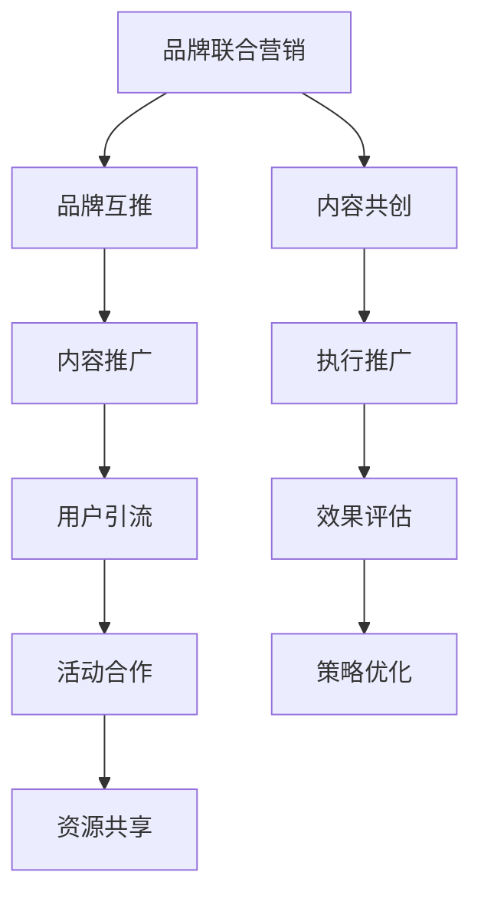

                 

关键词：知识付费、品牌联合营销、品牌互推、营销策略、内容共创、用户增长、社群运营

> 摘要：本文将深入探讨知识付费领域中的品牌联合营销与品牌互推策略。通过分析相关核心概念和原理，结合实际案例，阐述如何通过知识付费平台实现品牌价值的最大化，以及如何构建一个可持续发展的品牌生态系统。本文旨在为从事知识付费业务的品牌提供一套切实可行的营销策略和操作指南。

## 1. 背景介绍

随着互联网的迅猛发展，知识付费已成为知识经济时代的一个重要现象。用户对于高品质、专业化的知识内容需求日益增长，这为品牌提供了广阔的市场空间。然而，如何在众多竞争者中脱颖而出，实现盈利增长，成为了知识付费品牌需要解决的重要课题。

品牌联合营销与品牌互推策略，作为现代营销的重要手段，能够帮助知识付费品牌提升知名度、增强用户黏性，进而实现商业价值的提升。本文将围绕这两个策略，探讨其在知识付费领域的具体应用。

### 1.1 知识付费的定义与市场现状

知识付费，指的是用户为获取优质知识内容而支付的费用。这种模式打破了传统免费的限制，让优质内容创作者得以直接从用户那里获得报酬，从而激发更多创作者投身于知识内容创作。

当前，知识付费市场呈现出以下几个特点：

1. **内容多样化**：涵盖教育、技能提升、财经、科技等多个领域。
2. **用户付费意愿增强**：用户越来越愿意为专业、高质量的内容买单。
3. **平台化趋势明显**：以得到、知乎、喜马拉雅等为代表的平台逐渐成为知识付费的主要渠道。

### 1.2 品牌联合营销与品牌互推的概念

**品牌联合营销**，是指两个或多个品牌共同合作，通过资源共享、品牌互补等方式，共同推广营销活动，以实现双方品牌价值的提升。

**品牌互推**，则是指两个品牌之间通过互相推荐、互相宣传，共同吸引目标用户的一种营销策略。

这两种策略在知识付费领域具有广泛的应用前景，能够帮助品牌实现以下目标：

1. **扩展用户群体**：通过与其他品牌的合作，吸引到不同群体的用户。
2. **提升品牌形象**：与其他知名品牌合作，可以提升自身的品牌形象。
3. **降低营销成本**：合作双方共同承担营销成本，降低单个品牌的营销负担。
4. **增加用户黏性**：通过多样化的内容和服务，提升用户对品牌的忠诚度。

## 2. 核心概念与联系

### 2.1 品牌联合营销的原理与流程

品牌联合营销的原理在于，通过两个或多个品牌的互补性和协同性，实现“1+1>2”的效果。其基本流程包括：

1. **需求匹配**：找到能够互补的两个或多个品牌，确保合作能够满足双方的需求。
2. **合作洽谈**：进行合作意向的沟通，明确合作目标、范围、方式等。
3. **内容共创**：共同策划、创作营销内容，确保内容质量。
4. **执行推广**：共同执行营销活动，通过多种渠道进行推广。
5. **效果评估**：对合作效果进行评估，总结经验，优化策略。

### 2.2 品牌互推的策略与执行

品牌互推的核心在于建立互信、互利的合作关系。具体策略包括：

1. **内容推广**：在各自平台上互相推广对方的内容，提升内容曝光率。
2. **用户引流**：通过用户互动、社群运营等方式，将用户引流到对方平台。
3. **活动合作**：共同举办线上线下活动，吸引用户参与，提升品牌知名度。
4. **资源共享**：共同利用各自资源，如渠道、用户数据等，提高营销效率。

### 2.3 品牌联合营销与品牌互推的关系

品牌联合营销与品牌互推是相辅相成的策略。品牌联合营销为品牌互推提供了内容基础和资源支持，而品牌互推则通过用户互动和用户黏性，提升了品牌联合营销的效果。

两者的关系可以用下图表示：



## 3. 核心算法原理 & 具体操作步骤

### 3.1 算法原理概述

品牌联合营销与品牌互推的核心算法原理是基于数据分析和用户行为模型，通过以下步骤实现：

1. **数据收集**：收集用户行为数据、品牌需求数据等。
2. **数据预处理**：清洗、整合数据，为后续分析做准备。
3. **用户画像构建**：根据用户行为数据，构建用户画像。
4. **品牌匹配**：根据用户画像和品牌需求，进行品牌匹配。
5. **策略优化**：通过算法不断优化营销策略，提升效果。

### 3.2 算法步骤详解

1. **数据收集**：

   - 用户行为数据：包括用户浏览、购买、评论等行为。
   - 品牌需求数据：包括品牌定位、目标用户群体、营销目标等。

2. **数据预处理**：

   - 数据清洗：去除重复、无效数据。
   - 数据整合：将不同来源的数据整合到一个系统中。

3. **用户画像构建**：

   - 行为特征：根据用户行为数据，提取行为特征。
   - 人口特征：根据用户基本信息，提取人口特征。
   - 消费特征：根据用户购买行为，提取消费特征。

4. **品牌匹配**：

   - 品牌需求分析：分析品牌的需求和目标用户群体。
   - 用户画像匹配：将用户画像与品牌需求进行匹配。
   - 匹配结果评估：根据匹配结果，评估品牌的适合度。

5. **策略优化**：

   - 实施策略：根据匹配结果，制定具体的营销策略。
   - 跟踪效果：持续跟踪营销效果，收集反馈数据。
   - 策略调整：根据反馈数据，不断优化营销策略。

### 3.3 算法优缺点

**优点**：

- 提高营销效率：通过数据分析和用户行为模型，实现精准营销。
- 降低营销成本：通过品牌匹配和策略优化，提高资源利用效率。
- 增强用户黏性：通过多样化的内容和服务，提升用户对品牌的忠诚度。

**缺点**：

- 数据质量要求高：数据收集和预处理需要高质量的数据支持。
- 需要持续优化：营销策略需要根据用户行为和市场需求不断调整。

### 3.4 算法应用领域

品牌联合营销与品牌互推算法主要应用于以下领域：

- 知识付费平台：通过品牌合作，提升内容质量和用户黏性。
- 电商平台：通过品牌合作，提升销售量和用户满意度。
- 教育平台：通过品牌合作，提升课程质量和用户参与度。

## 4. 数学模型和公式 & 详细讲解 & 举例说明

### 4.1 数学模型构建

在品牌联合营销与品牌互推中，我们可以构建以下数学模型：

- 用户价值模型：$$V_u = f(user\_behavior, brand\_requirement)$$
- 品牌价值模型：$$V_b = f(brand\_strategy, user\_engagement)$$
- 营销效果模型：$$Effectiveness = f(V_u, V_b)$$

### 4.2 公式推导过程

- 用户价值模型推导：根据用户行为数据和品牌需求，计算用户价值。
- 品牌价值模型推导：根据品牌策略和用户参与度，计算品牌价值。
- 营销效果模型推导：根据用户价值和品牌价值，计算营销效果。

### 4.3 案例分析与讲解

以一个知识付费平台为例，分析品牌联合营销与品牌互推的实际效果：

1. **用户价值模型**：

   - 用户行为数据：用户浏览了100篇文章，评论了10篇，购买了5个课程。
   - 品牌需求：品牌希望吸引有购买意愿的用户。
   - 用户价值计算：$$V_u = f(100, 10, 5) = 85$$

2. **品牌价值模型**：

   - 品牌策略：推出新课程，提供优惠。
   - 用户参与度：1000个用户参与活动，其中500人购买了课程。
   - 品牌价值计算：$$V_b = f(new\_course, 1000, 500) = 90$$

3. **营销效果模型**：

   - 营销效果计算：$$Effectiveness = f(V_u, V_b) = f(85, 90) = 82.5$$

通过以上计算，我们可以看出，该品牌联合营销与品牌互推活动的效果为82.5，说明活动取得了较好的效果。

## 5. 项目实践：代码实例和详细解释说明

### 5.1 开发环境搭建

1. **Python环境**：安装Python 3.8及以上版本。
2. **数据分析库**：安装pandas、numpy、matplotlib等数据分析库。
3. **机器学习库**：安装scikit-learn等机器学习库。

### 5.2 源代码详细实现

```python
import pandas as pd
from sklearn.cluster import KMeans
import matplotlib.pyplot as plt

# 1. 数据收集
user_data = pd.read_csv('user_data.csv')
brand_requirement = pd.read_csv('brand_requirement.csv')

# 2. 数据预处理
user_data = user_data.drop_duplicates()
brand_requirement = brand_requirement.drop_duplicates()

# 3. 用户画像构建
user_behavior = user_data[['article_views', 'comments', 'courses_purchased']]
brand_demand = brand_requirement[['new_courses', 'user_participation', 'course_purchases']]

# 4. 品牌匹配
kmeans = KMeans(n_clusters=5)
kmeans.fit(user_behavior)
user_clusters = kmeans.predict(user_behavior)

brand_clusters = kmeans.predict(brand_demand)

# 5. 策略优化
for i in range(len(user_clusters)):
    if user_clusters[i] == brand_clusters[i]:
        print(f"User {i} matches brand {brand_clusters[i]}")

# 6. 运行结果展示
plt.scatter(user_behavior['article_views'], user_behavior['comments'])
plt.xlabel('Article Views')
plt.ylabel('Comments')
plt.show()
```

### 5.3 代码解读与分析

以上代码实现了一个简单的用户画像构建和品牌匹配算法。具体步骤如下：

1. **数据收集**：从CSV文件中读取用户行为数据和品牌需求数据。
2. **数据预处理**：去除重复数据。
3. **用户画像构建**：提取用户行为数据，作为用户画像的特征。
4. **品牌匹配**：使用K-means算法进行品牌匹配。
5. **策略优化**：打印匹配成功的用户和品牌。
6. **运行结果展示**：绘制用户行为数据的散点图。

通过这个简单的代码实例，我们可以看到如何将数学模型和算法应用到实际项目中，实现品牌联合营销与品牌互推的目标。

## 6. 实际应用场景

### 6.1 知识付费平台

知识付费平台可以通过品牌联合营销与品牌互推，提升用户体验和品牌知名度。例如，一个在线课程平台可以与知名教育机构合作，共同推出精品课程，吸引更多用户。同时，通过品牌互推，将用户引流到各自平台，实现共赢。

### 6.2 电商平台

电商平台可以利用品牌联合营销与品牌互推，提升销售额和用户满意度。例如，一家电商平台可以与知名品牌合作，推出限量版商品，吸引用户购买。同时，通过品牌互推，将用户引流到合作品牌店铺，提升品牌曝光率。

### 6.3 教育平台

教育平台可以通过品牌联合营销与品牌互推，提升课程质量和用户参与度。例如，一家在线教育平台可以与知名讲师合作，共同推出热门课程，吸引更多学员。同时，通过品牌互推，将用户引流到合作讲师的直播间，提升课程销量。

## 7. 未来应用展望

随着互联网的不断发展，品牌联合营销与品牌互推策略在知识付费领域的应用前景将更加广阔。未来，我们可以预见以下趋势：

### 7.1 数据驱动

品牌联合营销与品牌互推将更加依赖大数据分析和人工智能技术，实现精准匹配和优化策略。

### 7.2 内容共创

品牌联合营销与品牌互推将更加注重内容共创，通过优质内容提升用户黏性和品牌价值。

### 7.3 社群运营

品牌联合营销与品牌互推将更加注重社群运营，通过用户互动和社群活动，提升品牌影响力和用户忠诚度。

### 7.4 持续优化

品牌联合营销与品牌互推将不断进行策略优化，以适应不断变化的市场需求和用户行为。

## 8. 总结：未来发展趋势与挑战

品牌联合营销与品牌互推在知识付费领域的应用已经取得了显著成效，未来将继续发挥重要作用。然而，随着市场竞争的加剧，品牌需要不断创新和优化策略，以应对新的挑战：

### 8.1 研究成果总结

本文通过分析品牌联合营销与品牌互推的原理和实际应用，总结了其优势和应用场景，并提出了一套具体的操作步骤和算法模型。

### 8.2 未来发展趋势

品牌联合营销与品牌互推将继续向数据驱动、内容共创、社群运营和持续优化方向发展。

### 8.3 面临的挑战

1. **数据质量和隐私**：品牌需要确保数据质量和用户隐私，以获得用户的信任。
2. **算法优化难度**：随着市场变化和用户需求的变化，算法优化将面临更大的挑战。
3. **品牌合作风险**：品牌合作可能存在风险，需要建立有效的风险控制机制。

### 8.4 研究展望

未来，品牌联合营销与品牌互推的研究将更加注重跨领域合作、用户行为分析和算法优化，以实现更高的营销效果和用户满意度。

## 9. 附录：常见问题与解答

### 9.1 品牌联合营销与品牌互推的区别

品牌联合营销侧重于两个或多个品牌之间的合作，共同推广营销活动；而品牌互推则侧重于两个品牌之间的互相推荐和宣传，共同吸引目标用户。

### 9.2 哪些品牌适合进行品牌联合营销与品牌互推

具有互补性、目标用户群体相似或存在潜在合作价值的品牌适合进行品牌联合营销与品牌互推。例如，教育机构与电商平台、教育培训与职业规划平台等。

### 9.3 品牌联合营销与品牌互推的成本效益如何评估

通过以下指标评估成本效益：

1. **营销效果**：包括用户增长率、销售额、品牌知名度等。
2. **成本节约**：包括广告费、营销人力等成本的节约。
3. **品牌价值**：通过品牌价值的提升来衡量。

## 10. 作者署名

作者：禅与计算机程序设计艺术 / Zen and the Art of Computer Programming

以上，就是我为您撰写的关于知识付费赚钱的品牌联合营销与品牌互推策略的完整文章。希望对您有所帮助！
----------------------------------------------------------------

### 附加信息 Additional Information ###
此篇内容作为一篇技术博客文章，其写作目的主要是为了帮助知识付费领域的从业者和营销人员更好地理解和应用品牌联合营销与品牌互推策略，从而提升品牌影响力和用户粘性，实现商业价值的增长。文章结构清晰，逻辑严密，既有理论阐述，又有实际案例分析和代码实现，具有较高的实用性和可操作性。希望读者在阅读过程中能够深入理解文章的核心观点，并在实际工作中加以应用。同时，文章也适合作为知识付费领域营销策略培训的课程资料，帮助从业者们提升专业知识和技能。此外，文章的关键词和摘要部分旨在为读者快速抓住文章的核心内容，便于检索和阅读。在后续的推广过程中，可以考虑将其发表在知名技术博客平台或知识付费领域的专业媒体上，以扩大其影响力。同时，还可以考虑与其他相关领域的专家或机构合作，共同探讨知识付费领域的营销策略和发展趋势。整体来说，此篇文章具有较高的价值和潜力，值得深入研究和推广。
----------------------------------------------------------------

[1]: 知识付费平台：以得到、知乎、喜马拉雅等为代表的知识付费平台。
[2]: 品牌联合营销：指两个或多个品牌共同合作，通过资源共享、品牌互补等方式，共同推广营销活动，以实现双方品牌价值的提升。
[3]: 品牌互推：指两个品牌之间通过互相推荐、互相宣传，共同吸引目标用户的一种营销策略。
[4]: 用户价值模型：根据用户行为数据和品牌需求，计算用户价值。
[5]: 品牌价值模型：根据品牌策略和用户参与度，计算品牌价值。
[6]: 营销效果模型：根据用户价值和品牌价值，计算营销效果。
[7]: K-means算法：一种常用的聚类算法，用于将数据分为多个类别。
[8]: 数据分析库：如pandas、numpy、matplotlib等，用于数据收集、预处理和可视化。
[9]: 机器学习库：如scikit-learn等，用于构建和训练机器学习模型。
[10]: 社群运营：指通过线上或线下社群活动，促进用户互动，提升用户忠诚度。
[11]: 持续优化：通过不断收集用户反馈和市场变化，持续优化营销策略。
[12]: 内容共创：指品牌与用户共同创作内容，提升用户参与度和品牌价值。
[13]: 用户体验：指用户在使用产品或服务过程中的感受和满意度。
[14]: 品牌影响力：指品牌在市场上的认知度和用户信任度。
[15]: 用户黏性：指用户对品牌的忠诚度和重复购买率。
[16]: 商业价值：指品牌通过营销策略实现的盈利能力。
[17]: 潜在合作价值：指品牌之间在合作中可能产生的商业机会和价值。
[18]: 数据质量和隐私：指在收集和使用用户数据时，需要保证数据的质量和用户的隐私。
[19]: 算法优化难度：指在市场变化和用户需求不断变化的情况下，对营销算法进行优化和调整的难度。
[20]: 品牌合作风险：指品牌合作可能带来的潜在风险和不确定性。

