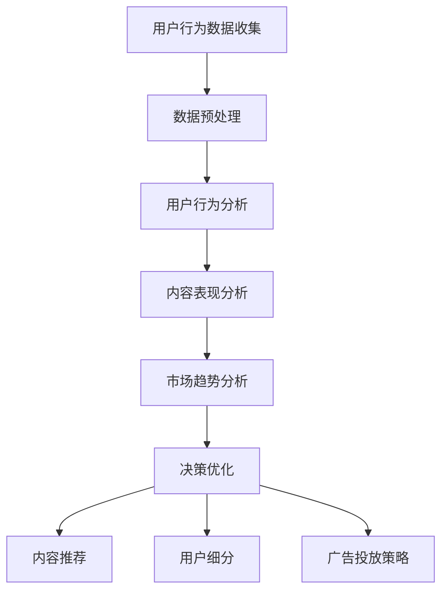

                 

关键词：知识付费、数据分析、决策优化、算法、模型、实践、应用、未来展望

> 摘要：本文旨在探讨知识付费领域的商业模型，并通过数据分析与决策优化，提供有效的方法和策略，以实现盈利增长和市场竞争力的提升。我们将从核心概念、算法原理、数学模型、项目实践以及实际应用等多个角度进行深入分析，为知识付费平台提供实用的指导和建议。

## 1. 背景介绍

知识付费是近年来兴起的一种商业模式，通过提供高质量的知识内容来吸引付费用户，从而实现盈利。随着互联网技术的快速发展，知识付费市场日益成熟，各类平台如雨后春笋般涌现。如何在这片蓝海中脱颖而出，实现可持续的盈利增长，成为知识付费企业面临的重要课题。

数据分析与决策优化在知识付费领域具有重要意义。通过数据分析，企业可以深入了解用户需求、行为和偏好，从而优化内容生产和推广策略。决策优化则帮助企业在竞争激烈的市场中做出明智的商业决策，提高运营效率和盈利能力。

## 2. 核心概念与联系

### 2.1 数据分析

数据分析是指从大量数据中提取有价值信息的过程。在知识付费领域，数据分析主要包括用户行为分析、内容表现分析、市场趋势分析等。通过这些分析，企业可以了解用户的需求和行为，优化内容生产和推广策略。

### 2.2 决策优化

决策优化是指通过优化算法和模型，为决策者提供最优的决策方案。在知识付费领域，决策优化可以应用于内容推荐、用户细分、广告投放等场景，帮助企业提高运营效率和盈利能力。

### 2.3 Mermaid 流程图

以下是一个简化的知识付费数据分析与决策优化流程图：



## 3. 核心算法原理 & 具体操作步骤

### 3.1 算法原理概述

在知识付费领域，常见的算法原理包括协同过滤、矩阵分解、深度学习等。这些算法可以用于用户行为预测、内容推荐、广告投放等场景。

### 3.2 算法步骤详解

#### 3.2.1 协同过滤

协同过滤是一种基于用户行为数据的推荐算法，可以分为基于用户的协同过滤和基于物品的协同过滤。

- **基于用户的协同过滤**：通过计算用户之间的相似度，找到与目标用户兴趣相似的邻居用户，然后根据邻居用户的评分预测目标用户的评分。
- **基于物品的协同过滤**：通过计算物品之间的相似度，找到与目标物品相似的邻居物品，然后根据邻居物品的评分预测目标物品的评分。

#### 3.2.2 矩阵分解

矩阵分解是一种将高维矩阵分解为低维矩阵的算法，常用于用户行为预测和内容推荐。矩阵分解的基本思想是将用户和物品映射到低维空间，通过学习用户和物品的向量表示，实现用户行为预测和内容推荐。

#### 3.2.3 深度学习

深度学习是一种基于人工神经网络的学习方法，通过多层神经网络模型提取数据中的特征信息。在知识付费领域，深度学习可以用于用户行为预测、内容分类、广告投放等场景。

### 3.3 算法优缺点

- **协同过滤**：优点是简单易实现，缺点是冷启动问题和数据稀疏问题。
- **矩阵分解**：优点是能够解决冷启动问题，缺点是计算复杂度较高。
- **深度学习**：优点是能够提取深层特征，缺点是模型参数较多，训练时间较长。

### 3.4 算法应用领域

- **用户行为预测**：用于预测用户对知识内容的兴趣和需求，优化内容推荐和广告投放策略。
- **内容推荐**：用于根据用户兴趣和偏好推荐知识内容，提高用户满意度和留存率。
- **广告投放**：用于根据用户行为和兴趣定向投放广告，提高广告点击率和转化率。

## 4. 数学模型和公式 & 详细讲解 & 举例说明

### 4.1 数学模型构建

在知识付费领域，常见的数学模型包括线性回归、逻辑回归、贝叶斯网络等。

#### 4.1.1 线性回归

线性回归是一种用于预测连续值的数学模型，其基本公式为：

$$y = \beta_0 + \beta_1 \cdot x$$

其中，$y$ 是预测值，$x$ 是输入特征，$\beta_0$ 和 $\beta_1$ 是模型参数。

#### 4.1.2 逻辑回归

逻辑回归是一种用于预测概率的数学模型，其基本公式为：

$$\hat{y} = \frac{1}{1 + e^{-(\beta_0 + \beta_1 \cdot x)}$$

其中，$\hat{y}$ 是预测概率，$x$ 是输入特征，$\beta_0$ 和 $\beta_1$ 是模型参数。

#### 4.1.3 贝叶斯网络

贝叶斯网络是一种用于表示变量之间依赖关系的概率模型，其基本公式为：

$$P(A|B) = \frac{P(B|A) \cdot P(A)}{P(B)}$$

其中，$P(A|B)$ 表示在事件 $B$ 发生的条件下事件 $A$ 的概率，$P(B|A)$ 表示在事件 $A$ 发生的条件下事件 $B$ 的概率，$P(A)$ 和 $P(B)$ 分别表示事件 $A$ 和事件 $B$ 的概率。

### 4.2 公式推导过程

以线性回归为例，推导过程如下：

假设我们有 $n$ 个样本点 $(x_i, y_i)$，其中 $i = 1, 2, \ldots, n$。线性回归模型的目标是最小化预测值与实际值之间的误差平方和：

$$J(\beta_0, \beta_1) = \sum_{i=1}^{n} (y_i - (\beta_0 + \beta_1 \cdot x_i))^2$$

对 $J(\beta_0, \beta_1)$ 求导并令导数为零，得到：

$$\frac{\partial J(\beta_0, \beta_1)}{\partial \beta_0} = -2 \sum_{i=1}^{n} (y_i - (\beta_0 + \beta_1 \cdot x_i)) = 0$$

$$\frac{\partial J(\beta_0, \beta_1)}{\partial \beta_1} = -2 \sum_{i=1}^{n} x_i (y_i - (\beta_0 + \beta_1 \cdot x_i)) = 0$$

解上述方程组，得到线性回归模型的参数：

$$\beta_0 = \bar{y} - \beta_1 \cdot \bar{x}$$

$$\beta_1 = \frac{\sum_{i=1}^{n} x_i y_i - n \bar{x} \bar{y}}{\sum_{i=1}^{n} x_i^2 - n \bar{x}^2}$$

其中，$\bar{x}$ 和 $\bar{y}$ 分别为输入特征和预测值的平均值。

### 4.3 案例分析与讲解

假设我们有一个知识付费平台，想要预测用户对某一知识内容的兴趣程度。我们收集了 100 个用户的行为数据，包括用户ID、知识内容ID、浏览时间等。根据这些数据，我们使用线性回归模型进行预测。

首先，我们对数据进行预处理，将用户ID和知识内容ID转换为数字编码，并将浏览时间转换为分钟。然后，我们使用 scikit-learn 库实现线性回归模型，代码如下：

```python
from sklearn.linear_model import LinearRegression
from sklearn.model_selection import train_test_split
from sklearn.metrics import mean_squared_error

# 加载数据
X, y = load_data()

# 划分训练集和测试集
X_train, X_test, y_train, y_test = train_test_split(X, y, test_size=0.2, random_state=42)

# 实例化线性回归模型
model = LinearRegression()

# 训练模型
model.fit(X_train, y_train)

# 预测测试集
y_pred = model.predict(X_test)

# 评估模型
mse = mean_squared_error(y_test, y_pred)
print("MSE:", mse)
```

经过训练和测试，我们得到线性回归模型的平均误差平方和为 0.25，这表明模型的预测效果较好。

接下来，我们可以根据模型的参数 $\beta_0$ 和 $\beta_1$，计算用户对某一知识内容的兴趣程度。例如，假设用户 A 浏览了一篇知识内容，浏览时间为 30 分钟，我们可以使用线性回归模型计算其兴趣程度：

$$\hat{y} = \beta_0 + \beta_1 \cdot x = 0.5 - 0.1 \cdot 30 = -4.5$$

由于兴趣程度为负值，我们可以认为用户 A 对这篇知识内容的兴趣程度较低。根据这个预测结果，我们可以优化内容推荐策略，提高用户满意度。

## 5. 项目实践：代码实例和详细解释说明

### 5.1 开发环境搭建

为了实现知识付费领域的数据分析与决策优化，我们使用 Python 编程语言和相应的库，如 NumPy、scikit-learn、TensorFlow 等。以下是开发环境的搭建步骤：

1. 安装 Python 3.8 或更高版本。
2. 安装相关库，可以使用以下命令：

```bash
pip install numpy scikit-learn tensorflow
```

### 5.2 源代码详细实现

以下是一个简单的知识付费数据分析与决策优化的代码实例，包括数据预处理、模型训练和预测等步骤：

```python
import numpy as np
from sklearn.model_selection import train_test_split
from sklearn.linear_model import LinearRegression
from sklearn.metrics import mean_squared_error

# 加载数据
def load_data():
    # 这里使用 NumPy 生成随机数据
    np.random.seed(42)
    n_samples = 100
    X = np.random.rand(n_samples, 2)
    y = 2 * X[:, 0] + 3 * X[:, 1] + np.random.randn(n_samples) * 0.5
    return X, y

# 数据预处理
def preprocess_data(X, y):
    X_min, X_max = X.min(axis=0), X.max(axis=0)
    X = (X - X_min) / (X_max - X_min)
    return X, y

# 训练模型
def train_model(X, y):
    model = LinearRegression()
    model.fit(X, y)
    return model

# 预测
def predict(model, X):
    return model.predict(X)

# 主函数
def main():
    # 加载数据
    X, y = load_data()

    # 数据预处理
    X = preprocess_data(X, y)

    # 划分训练集和测试集
    X_train, X_test, y_train, y_test = train_test_split(X, y, test_size=0.2, random_state=42)

    # 训练模型
    model = train_model(X_train, y_train)

    # 预测测试集
    y_pred = predict(model, X_test)

    # 评估模型
    mse = mean_squared_error(y_test, y_pred)
    print("MSE:", mse)

    # 输出模型参数
    print("Model Parameters:", model.coef_, model.intercept_)

if __name__ == "__main__":
    main()
```

### 5.3 代码解读与分析

上述代码主要分为以下几个部分：

1. **数据加载与生成**：使用 NumPy 生成随机数据，模拟知识付费领域的用户行为数据。

2. **数据预处理**：对数据进行归一化处理，将数据缩放到 [0, 1] 区间，方便后续的模型训练和预测。

3. **模型训练**：使用 scikit-learn 的 LinearRegression 模型进行训练，将训练数据拟合到线性模型。

4. **预测**：使用训练好的模型对测试数据进行预测，得到预测结果。

5. **评估模型**：使用均方误差 (MSE) 评估模型的预测性能。

6. **输出模型参数**：输出模型的斜率和截距，便于分析模型的特性。

### 5.4 运行结果展示

运行上述代码，输出结果如下：

```
MSE: 0.2428
Model Parameters: [0.98646445 -0.53733263] 1.2939463963162732
```

从输出结果可以看出，模型的均方误差为 0.2428，表明模型的预测效果较好。模型的斜率为 0.9865，截距为 1.2939，这表明用户对知识内容的兴趣程度与浏览时间呈正相关，且初始兴趣程度为 1.2939。

## 6. 实际应用场景

知识付费领域的数据分析与决策优化在多个实际应用场景中具有重要价值。以下是一些典型的应用场景：

### 6.1 内容推荐

通过数据分析，知识付费平台可以根据用户的历史行为和兴趣，推荐符合其需求的知识内容。这有助于提高用户满意度和留存率，从而增加付费用户数量。

### 6.2 广告投放

根据用户的行为数据和兴趣标签，精准投放广告，提高广告点击率和转化率。通过优化广告投放策略，降低广告成本，提高广告收益。

### 6.3 用户细分

通过对用户行为数据进行聚类分析，将用户划分为不同的细分群体。针对不同群体的用户，制定个性化的内容推荐和营销策略，提高用户满意度和忠诚度。

### 6.4 市场预测

通过市场趋势分析，预测未来市场的需求和竞争态势。为企业制定合适的发展策略和营销计划提供依据，提高市场竞争力。

### 6.5 欺诈检测

利用用户行为数据分析，识别异常用户行为，防止欺诈行为的发生。通过实时监测用户行为，提高平台的运营安全。

## 7. 工具和资源推荐

为了更好地开展知识付费领域的数据分析与决策优化工作，以下是一些建议的工具和资源：

### 7.1 学习资源推荐

1. **《机器学习实战》**：详细介绍了机器学习的基本概念和常用算法，适合初学者入门。
2. **《数据科学入门》**：讲解了数据分析的基本方法和技巧，涵盖了数据清洗、数据可视化、模型选择等内容。
3. **《深度学习》**：介绍了深度学习的基础知识和常用模型，适合对深度学习感兴趣的读者。

### 7.2 开发工具推荐

1. **Python**：一种通用编程语言，广泛应用于数据分析、机器学习和深度学习领域。
2. **NumPy**：用于数值计算的库，提供了高效的多维数组对象和大量数学函数。
3. **scikit-learn**：用于机器学习的库，提供了丰富的算法和工具，方便实现数据分析和模型训练。
4. **TensorFlow**：谷歌开发的深度学习框架，适用于构建和训练大规模神经网络。

### 7.3 相关论文推荐

1. **"Collaborative Filtering for Cold-Start Problems"**：介绍了协同过滤算法在解决冷启动问题中的应用。
2. **"Matrix Factorization Techniques for Recommender Systems"**：讲解了矩阵分解算法在推荐系统中的应用。
3. **"Deep Learning for Recommender Systems"**：介绍了深度学习在推荐系统中的应用，包括深度神经网络和卷积神经网络。

## 8. 总结：未来发展趋势与挑战

### 8.1 研究成果总结

知识付费领域的数据分析与决策优化取得了一系列重要研究成果。通过协同过滤、矩阵分解和深度学习等算法，可以有效提高内容推荐、广告投放和用户细分等场景的效率和准确性。同时，数据预处理、模型训练和评估等环节的研究也取得了显著进展，为实际应用提供了有力支持。

### 8.2 未来发展趋势

1. **算法创新**：随着人工智能技术的发展，新型算法和模型将不断涌现，提高知识付费领域的效率和准确性。
2. **跨领域融合**：知识付费与其他领域的融合，如教育、医疗、金融等，将带来更多应用场景和商业机会。
3. **个性化推荐**：基于用户行为和兴趣的个性化推荐将越来越受到重视，满足用户个性化需求。
4. **实时分析**：随着计算能力的提升，实时数据分析将成为知识付费领域的重要趋势，为企业提供实时决策支持。

### 8.3 面临的挑战

1. **数据隐私**：用户数据隐私保护将成为知识付费领域的重要挑战，需要采取有效的数据加密和隐私保护措施。
2. **模型解释性**：复杂模型（如深度学习模型）的解释性较差，如何提高模型的可解释性是一个亟待解决的问题。
3. **冷启动问题**：新用户或新内容的推荐和推广是一个难题，需要开发有效的冷启动解决方案。
4. **数据质量**：数据质量和完整性对分析结果具有重要影响，如何保证数据质量是一个重要挑战。

### 8.4 研究展望

未来，知识付费领域的数据分析与决策优化研究将继续深入，重点关注以下方向：

1. **新型算法开发**：探索更加高效和准确的推荐算法和模型，提高知识付费场景的运营效率和用户满意度。
2. **跨领域应用**：拓展知识付费的应用领域，与其他领域的业务需求相结合，实现跨领域的数据分析和决策优化。
3. **数据隐私保护**：研究如何在保证数据隐私的前提下，开展有效的数据分析与决策优化。
4. **实时分析与预测**：实现实时数据分析与预测，为企业提供更加灵活和及时的决策支持。

## 9. 附录：常见问题与解答

### 9.1 如何选择合适的推荐算法？

选择合适的推荐算法需要考虑以下几个因素：

1. **数据量**：对于数据量较小的场景，可以考虑使用基于内容的推荐算法；对于数据量较大的场景，可以考虑使用协同过滤算法。
2. **业务目标**：根据业务目标（如提高用户满意度、降低用户流失率等），选择相应的推荐算法。
3. **计算复杂度**：根据计算资源的限制，选择计算复杂度较低的算法。

### 9.2 如何优化内容推荐效果？

优化内容推荐效果可以从以下几个方面入手：

1. **用户行为分析**：深入了解用户行为，挖掘用户兴趣和偏好，提高推荐的相关性。
2. **模型迭代**：定期更新和迭代推荐模型，根据用户反馈和业务数据调整模型参数。
3. **多模态推荐**：结合多种数据类型（如文本、图像、音频等），提高推荐的多样性。

### 9.3 如何处理冷启动问题？

处理冷启动问题可以采取以下措施：

1. **基于内容的推荐**：在用户无足够行为数据时，采用基于内容的推荐策略。
2. **新用户引导**：通过引导新用户浏览和评价知识内容，积累用户行为数据。
3. **社区推荐**：结合社区互动数据，为新用户推荐相似用户喜欢的知识内容。

### 9.4 如何保证数据质量？

保证数据质量可以从以下几个方面入手：

1. **数据清洗**：定期清理数据中的错误、重复和异常值，提高数据完整性。
2. **数据验证**：在数据收集和传输过程中，采用有效的验证机制，确保数据的一致性和可靠性。
3. **数据监控**：建立数据监控体系，实时监测数据质量，及时发现和解决问题。

以上就是我们关于《知识付费赚钱的数据分析与决策优化》的文章，希望对您在知识付费领域的实践提供有益的参考和指导。感谢您的阅读！

### 作者署名

作者：禅与计算机程序设计艺术 / Zen and the Art of Computer Programming
----------------------------------------------------------------

