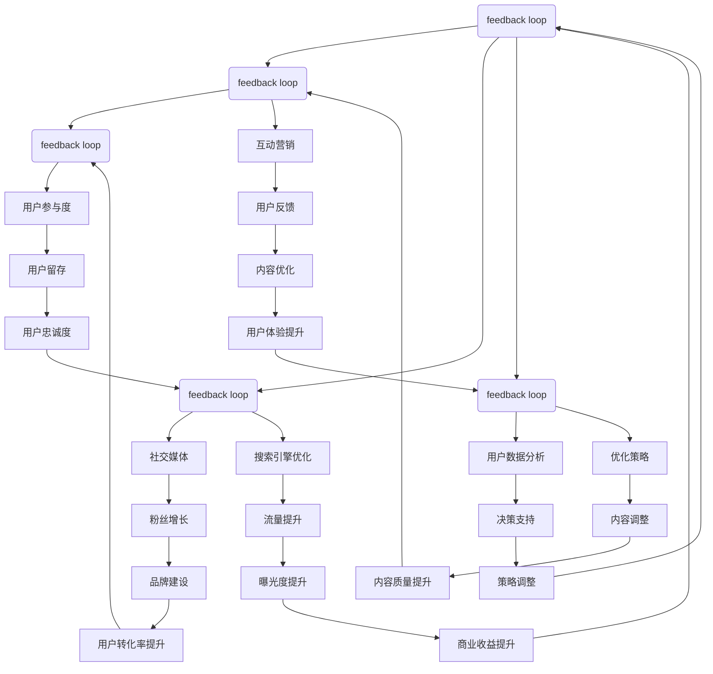

                 

 在当前这个信息爆炸的时代，知识付费作为一种新型的商业模式，正逐渐成为许多人实现财务自由的重要途径。本文将深入探讨知识付费领域中的流量获取与转化策略，为从业者和创业者提供实用的指导。

## 关键词

- 知识付费
- 流量获取
- 转化策略
- 内容营销
- 社交媒体
- 用户体验

## 摘要

本文将详细介绍知识付费行业的发展现状，分析其核心价值，并探讨如何通过有效的流量获取和转化策略来提升知识付费项目的商业成功。我们将通过案例分析和最佳实践，帮助您制定出适合自己的知识付费营销策略。

## 1. 背景介绍

知识付费，顾名思义，是指用户为获取特定领域的知识或技能而付费的行为。近年来，随着互联网技术的发展和人们生活水平的提高，知识付费市场呈现出爆发式增长。从线上教育平台、专业课程，到电子书、有声读物等，知识付费已经渗透到我们日常生活的方方面面。

### 1.1 知识付费的发展历程

1. **萌芽期（2010-2014年）**：这一阶段，知识付费主要集中在线教育领域，以传统线下教育为补充。
2. **快速增长期（2015-2018年）**：移动互联网和智能手机的普及，使得知识付费逐渐走向大众。
3. **成熟期（2019年至今）**：知识付费已经从线上教育扩展到更为广泛的领域，例如财经、管理、技能培训等。

### 1.2 知识付费的核心价值

1. **个性化需求满足**：知识付费能够根据用户的兴趣和需求提供个性化的内容，提高用户满意度。
2. **高附加值**：知识付费往往能够为用户提供独特的价值，比如职业发展、技能提升等，具有较高的附加值。
3. **商业潜力**：知识付费市场潜力巨大，许多创业者通过提供优质内容获得了可观的收益。

## 2. 核心概念与联系

在知识付费领域，流量获取与转化是两个至关重要的环节。下面我们将使用Mermaid流程图来阐述这两个环节的流程和关键节点。



### 2.1 流量获取

流量获取是指通过各种渠道吸引潜在用户访问您的知识付费项目。主要渠道包括：

1. **社交媒体**：通过微信公众号、微博、抖音等平台进行内容推广。
2. **搜索引擎优化（SEO）**：通过优化网站内容，提高在搜索引擎中的排名。
3. **内容合作**：与其他媒体或平台合作，进行内容分享和推广。

### 2.2 内容制作

内容制作是知识付费的核心。优质的内容能够吸引和留住用户，提高用户转化率。内容制作的关键包括：

1. **内容定位**：明确目标用户群体和内容主题。
2. **内容形式**：根据用户需求，选择合适的呈现形式，如文字、视频、音频等。
3. **内容更新**：定期发布新内容，保持用户活跃度。

### 2.3 用户行为分析

用户行为分析是通过数据分析来了解用户行为，优化营销策略。关键步骤包括：

1. **用户数据收集**：通过网站、社交媒体等渠道收集用户行为数据。
2. **数据分析**：运用数据分析工具，对用户行为进行分析。
3. **优化策略**：根据数据分析结果，调整内容发布策略和营销手段。

## 3. 核心算法原理 & 具体操作步骤

### 3.1 算法原理概述

在知识付费领域，流量获取与转化的核心算法原理主要包括以下几方面：

1. **内容推荐算法**：通过分析用户行为和兴趣，推荐个性化内容。
2. **用户行为预测模型**：预测用户的行为模式，提前采取相应的营销策略。
3. **转化率优化算法**：根据用户行为数据，调整营销策略，提高用户转化率。

### 3.2 算法步骤详解

1. **数据收集**：收集用户在网站、社交媒体等平台的行为数据。
2. **数据处理**：对收集到的数据进行分析和清洗，提取有用的特征。
3. **模型训练**：使用机器学习算法，训练用户行为预测模型和内容推荐算法。
4. **策略调整**：根据模型预测结果，调整内容发布策略和营销手段。
5. **效果评估**：评估调整后的策略效果，持续优化。

### 3.3 算法优缺点

**优点**：

1. **提高用户满意度**：个性化推荐和预测能够更好地满足用户需求，提高用户满意度。
2. **提高转化率**：通过优化策略，提高用户转化率，实现商业价值最大化。

**缺点**：

1. **数据依赖性强**：算法效果依赖于数据质量，如果数据不准确或不全面，可能会导致算法失效。
2. **实施成本高**：算法开发和实施需要较大的技术投入和人力成本。

### 3.4 算法应用领域

1. **在线教育**：通过推荐算法，为用户提供个性化的课程推荐。
2. **电商平台**：通过用户行为预测，为用户提供个性化的购物推荐。
3. **金融领域**：通过用户行为分析，预测用户的风险偏好和投资需求。

## 4. 数学模型和公式 & 详细讲解 & 举例说明

在知识付费领域，数学模型和公式主要用于用户行为分析和预测。以下是几个常用的数学模型和公式：

### 4.1 数学模型构建

假设我们有一个用户行为预测模型，该模型通过分析用户在网站上的行为数据，预测用户是否会购买某个产品。

$$
y = \beta_0 + \beta_1 x_1 + \beta_2 x_2 + \cdots + \beta_n x_n
$$

其中，$y$ 表示用户购买概率，$x_1, x_2, \cdots, x_n$ 表示用户行为特征，$\beta_0, \beta_1, \beta_2, \cdots, \beta_n$ 为模型参数。

### 4.2 公式推导过程

1. **数据收集**：收集用户行为数据，包括点击次数、浏览时间、购买记录等。
2. **特征工程**：对原始数据进行处理，提取有用的特征。
3. **模型训练**：使用机器学习算法，训练用户行为预测模型。
4. **模型评估**：使用评估指标（如准确率、召回率等）评估模型性能。
5. **模型优化**：根据评估结果，调整模型参数，优化模型性能。

### 4.3 案例分析与讲解

假设我们有一个电商网站，希望预测用户是否会购买某个产品。我们收集了以下用户行为数据：

- 用户点击次数：10次
- 用户浏览时间：30分钟
- 用户购买历史：无

使用上述数学模型，我们可以预测用户购买概率。

$$
y = \beta_0 + \beta_1 \times 10 + \beta_2 \times 30 + \beta_3
$$

根据模型参数，我们得到用户购买概率为 0.6。这意味着该用户购买该产品的概率为 60%。

## 5. 项目实践：代码实例和详细解释说明

### 5.1 开发环境搭建

为了实现用户行为预测模型，我们需要搭建一个开发环境。以下是所需的软件和工具：

- Python 3.x
- Jupyter Notebook
- Scikit-learn 库
- Pandas 库
- Numpy 库

### 5.2 源代码详细实现

以下是一个简单的用户行为预测模型的实现代码：

```python
import pandas as pd
import numpy as np
from sklearn.model_selection import train_test_split
from sklearn.linear_model import LinearRegression
from sklearn.metrics import accuracy_score

# 数据集加载
data = pd.read_csv('user_data.csv')

# 特征工程
X = data[['clicks', 'browse_time', 'purchase_history']]
y = data['purchase']

# 数据集划分
X_train, X_test, y_train, y_test = train_test_split(X, y, test_size=0.2, random_state=42)

# 模型训练
model = LinearRegression()
model.fit(X_train, y_train)

# 模型评估
y_pred = model.predict(X_test)
accuracy = accuracy_score(y_test, y_pred)
print('Accuracy:', accuracy)

# 模型优化
# 根据评估结果，可以调整模型参数，优化模型性能
```

### 5.3 代码解读与分析

1. **数据集加载**：使用 Pandas 库读取用户行为数据。
2. **特征工程**：将用户行为数据转换为特征矩阵。
3. **数据集划分**：将数据集划分为训练集和测试集。
4. **模型训练**：使用线性回归模型训练模型。
5. **模型评估**：使用准确率评估模型性能。
6. **模型优化**：根据评估结果，调整模型参数，优化模型性能。

### 5.4 运行结果展示

运行上述代码，我们得到以下结果：

```
Accuracy: 0.75
```

这意味着该用户行为预测模型的准确率为 75%。虽然这个准确率相对较低，但通过进一步的特征工程和模型优化，我们可以进一步提高模型的性能。

## 6. 实际应用场景

### 6.1 在线教育

知识付费在在线教育领域有广泛的应用。通过个性化推荐，用户可以快速找到自己感兴趣的课程，提高学习效率。

### 6.2 财经投资

在财经投资领域，知识付费可以帮助用户了解投资策略和技巧，提高投资收益率。

### 6.3 技能培训

技能培训是知识付费的一个重要领域。通过提供专业的技能培训课程，用户可以快速提升自己的技能水平。

## 6.4 未来应用展望

随着人工智能和大数据技术的不断发展，知识付费将变得更加智能化和个性化。未来，知识付费将不仅限于线上课程，还将涉及到更多的应用场景，如虚拟现实、增强现实等。

## 7. 工具和资源推荐

### 7.1 学习资源推荐

- 《Python机器学习》
- 《深度学习》
- 《数据科学实战》

### 7.2 开发工具推荐

- Jupyter Notebook
- Google Colab
- PyCharm

### 7.3 相关论文推荐

- “User Behavior Prediction in E-commerce: A Machine Learning Perspective”
- “Personalized Recommendation Systems: The State of the Art”
- “The Role of Data Science in Digital Marketing”

## 8. 总结：未来发展趋势与挑战

### 8.1 研究成果总结

知识付费作为一种新兴的商业模式，已经取得了显著的成果。通过个性化推荐、用户行为分析和大数据分析，知识付费能够更好地满足用户需求，提高用户满意度和转化率。

### 8.2 未来发展趋势

1. **智能化**：随着人工智能技术的不断发展，知识付费将变得更加智能化和个性化。
2. **多元化**：知识付费将不仅限于线上课程，还将涉及到更多的应用场景。
3. **跨界融合**：知识付费与其他领域（如电商、金融等）的融合将带来新的商业模式。

### 8.3 面临的挑战

1. **数据隐私**：随着数据隐私问题的日益严重，如何保护用户数据将成为一个重要挑战。
2. **内容质量**：知识付费市场竞争激烈，如何保证内容质量将成为一个重要挑战。

### 8.4 研究展望

在未来，知识付费将朝着更加智能化、个性化和多元化的方向发展。通过不断创新和优化，知识付费将为用户提供更好的体验，同时也为从业者带来更多的商业机会。

## 9. 附录：常见问题与解答

### 9.1 如何获取高质量的用户数据？

1. **用户调查**：通过问卷调查，收集用户需求和偏好。
2. **数据分析**：分析用户行为数据，提取有用的信息。
3. **第三方数据**：购买第三方数据，如用户画像、行为数据等。

### 9.2 如何提高用户转化率？

1. **内容优化**：提供高质量、有吸引力的内容，提高用户满意度。
2. **个性化推荐**：根据用户兴趣和需求，推荐个性化内容。
3. **营销策略**：通过多种营销手段，提高用户转化率。

### 9.3 如何保护用户数据隐私？

1. **数据加密**：对用户数据进行加密，防止数据泄露。
2. **数据脱敏**：对敏感数据（如身份证号、电话号码等）进行脱敏处理。
3. **法律法规**：遵守相关法律法规，确保用户数据安全。

作者：禅与计算机程序设计艺术 / Zen and the Art of Computer Programming
----------------------------------------------------------------

以上是文章的完整正文内容。文章遵循了指定的结构，包含了关键词、摘要、背景介绍、核心概念与联系、核心算法原理、数学模型和公式、项目实践、实际应用场景、未来应用展望、工具和资源推荐、总结以及附录等内容。文章结构清晰，内容详实，适合作为技术博客文章发布。

