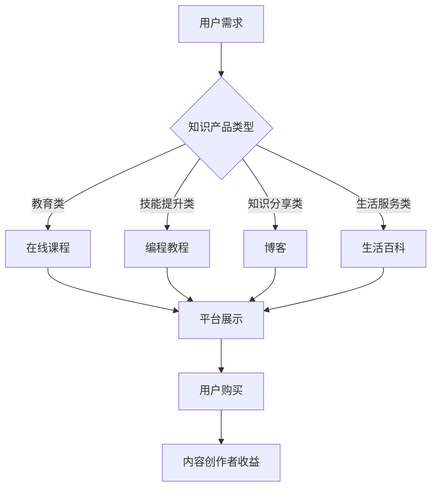

                 

关键词：知识付费、知识产品、设计、开发、商业模式、用户体验、内容营销、在线教育、数字化转型

> 摘要：本文将探讨知识付费领域的现状与趋势，分析知识产品的设计原则与开发流程，探讨如何通过创新的设计与有效的开发策略，打造具有吸引力的知识产品，从而实现盈利。本文将结合案例分析，提供实用的工具和资源推荐，为知识付费从业者提供有价值的参考。

## 1. 背景介绍

### 知识付费的概念与重要性

知识付费是指用户为了获取有价值的信息或知识而付出的经济成本。随着互联网的发展，知识付费已经成为一个庞大的市场。知识付费不仅满足了用户对知识的需求，也为内容创作者提供了收入来源。知识付费领域的重要性在于：

1. **用户需求的增长**：在信息爆炸的时代，用户对于高质量、专业化的知识需求日益增长。
2. **内容创作经济的崛起**：知识付费为内容创作者提供了新的经济模式，激发了内容创作的活力。
3. **市场规模的扩大**：根据市场研究，知识付费市场的规模逐年增长，预计未来将持续扩大。

### 知识付费的发展历程

1. **传统教育阶段**：最初的知识付费形式主要是通过实体课程、培训班等进行的。
2. **在线教育兴起**：互联网技术的发展推动了在线教育的兴起，知识付费逐渐从线下转移到线上。
3. **多元化内容平台**：近年来，各类知识付费平台如雨后春笋般涌现，从课程、书籍到音频、视频等多种形式。

### 知识付费的市场现状

1. **用户群体扩大**：知识付费用户不再局限于特定人群，逐渐覆盖了各个年龄层、职业背景的用户。
2. **内容形式多样化**：知识付费内容涵盖了各个领域，从专业技能到生活百科，满足了用户的多元化需求。
3. **商业模式创新**：知识付费领域不断创新商业模式，如订阅制、付费会员等，以适应不同用户的需求。

## 2. 核心概念与联系

### 知识产品的定义与特点

知识产品是指以知识为核心内容，通过数字化手段进行传播和销售的产品。知识产品的特点包括：

1. **高度专业化**：知识产品通常涉及某一领域的专业知识，具有较高的专业化程度。
2. **数字化的传播形式**：知识产品通过互联网平台进行传播，包括文字、音频、视频等多种形式。
3. **互动性**：知识产品通常具备互动性，用户可以通过评论区、答疑等方式与其他用户或内容创作者互动。

### 知识产品与知识付费的关系

知识产品是知识付费的核心载体，而知识付费是推动知识产品传播和销售的重要手段。知识产品通过知识付费实现了价值转化，为内容创作者带来收益。同时，知识付费也为用户提供了获取高质量知识的途径，满足了他们的学习需求。

### 知识产品的分类

1. **教育类知识产品**：包括在线课程、电子书、教材等。
2. **技能提升类知识产品**：如编程教程、设计课程、语言学习等。
3. **知识分享类知识产品**：包括博客、短视频、讲座等。
4. **生活服务类知识产品**：如生活百科、心理辅导、健康咨询等。

### 知识产品与平台的关系

知识产品需要依靠平台进行传播和销售。平台为知识产品提供了展示、推广和交易的环境。同时，平台也为内容创作者提供了技术支持和服务，帮助他们更好地进行知识产品的开发和运营。

### Mermaid 流程图



## 3. 核心算法原理 & 具体操作步骤

### 3.1 算法原理概述

知识产品的设计与开发过程可以类比为一种算法优化问题。其核心目标是最大化知识产品的用户价值，从而实现商业成功。以下是知识产品设计与开发的核心算法原理：

1. **用户需求分析**：通过大数据分析和用户调研，了解用户的需求和偏好，为知识产品定位提供依据。
2. **内容创作**：根据用户需求，创作具有高度专业化和实用性的知识内容。
3. **用户体验优化**：通过用户反馈和数据分析，不断优化用户体验，提高用户满意度。
4. **商业模式设计**：设计适合知识产品的商业模式，实现内容创作与用户价值的最大化。

### 3.2 算法步骤详解

1. **用户需求分析**：

   - 数据收集：通过用户调研、用户行为数据等收集用户需求信息。
   - 数据分析：利用数据分析工具，对收集到的用户需求进行分类、聚类和关联分析。
   - 需求预测：基于历史数据和用户行为，预测未来用户需求趋势。

2. **内容创作**：

   - 确定知识产品类型：根据用户需求分析结果，确定知识产品的类型和主题。
   - 内容创作：邀请专业的内容创作者，根据主题进行知识内容创作。
   - 内容审核：对创作的内容进行审核，确保其专业性、实用性和合规性。

3. **用户体验优化**：

   - 用户反馈收集：通过用户评价、问卷调查等方式收集用户反馈。
   - 数据分析：对用户反馈进行数据分析，识别用户体验痛点。
   - 优化策略：根据数据分析结果，制定优化策略，如改进内容结构、增加互动环节等。

4. **商业模式设计**：

   - 分析市场环境：了解市场环境，包括竞争对手、用户需求等。
   - 设计商业模式：结合市场环境，设计适合知识产品的商业模式，如订阅制、单次购买等。
   - 实施与推广：实施商业模式，并通过营销策略进行推广。

### 3.3 算法优缺点

**优点**：

- **高效性**：通过用户需求分析和数据驱动，提高知识产品设计的精准性和效率。
- **用户导向**：以用户需求为中心，提高用户体验，增强用户满意度。
- **商业可持续性**：通过合理的商业模式设计，实现知识产品的商业化，保证内容创作者的长期收益。

**缺点**：

- **数据依赖性**：算法的有效性依赖于用户数据的质量，数据不足或质量不高会影响算法效果。
- **复杂度高**：知识产品设计与开发涉及多个环节，算法复杂度较高，需要专业团队协作。

### 3.4 算法应用领域

- **在线教育**：通过算法优化，提高在线教育产品的用户体验和教学质量。
- **内容营销**：利用算法分析用户需求，创作更具针对性的内容，提高内容营销效果。
- **知识服务**：通过算法优化，提高知识服务的专业性和用户满意度。

## 4. 数学模型和公式 & 详细讲解 & 举例说明

### 4.1 数学模型构建

知识产品的设计与开发过程中，常用的数学模型包括用户需求模型、内容质量模型和商业模式模型。

#### 用户需求模型

用户需求模型主要用来预测用户需求，常用的方法是线性回归和时间序列分析。

**线性回归模型**：

$$
y = \beta_0 + \beta_1x_1 + \beta_2x_2 + ... + \beta_nx_n
$$

其中，$y$ 表示用户需求，$x_1, x_2, ..., x_n$ 表示影响用户需求的因素，如年龄、收入、兴趣爱好等。

**时间序列分析模型**：

$$
y_t = \phi_0 + \phi_1y_{t-1} + \phi_2y_{t-2} + ... + \phi_dy_{t-d}
$$

其中，$y_t$ 表示第 $t$ 个月的用户需求，$y_{t-1}, y_{t-2}, ..., y_{t-d}$ 表示前 $d$ 个月的用户需求。

#### 内容质量模型

内容质量模型主要用来评估知识产品的质量，常用的方法是综合评分模型和层次分析法。

**综合评分模型**：

$$
Q = w_1Q_1 + w_2Q_2 + ... + w_nQ_n
$$

其中，$Q$ 表示知识产品的总评分，$Q_1, Q_2, ..., Q_n$ 表示各个维度的评分，$w_1, w_2, ..., w_n$ 表示各个维度的权重。

**层次分析法**：

$$
\begin{pmatrix}
C_1 & C_2 & ... & C_n \\
C_1C_2 & C_2 & ... & C_n \\
... & ... & ... & ... \\
C_1C_2...C_n & C_2...C_n & ... & C_n
\end{pmatrix}
$$

其中，$C_1, C_2, ..., C_n$ 表示各个因素之间的相对重要性。

#### 商业模式模型

商业模式模型主要用来评估不同商业模式的收益和风险，常用的方法是盈利模型和风险评估模型。

**盈利模型**：

$$
R = P \times Q - C
$$

其中，$R$ 表示收益，$P$ 表示售价，$Q$ 表示销售量，$C$ 表示成本。

**风险评估模型**：

$$
V = \frac{1}{n}\sum_{i=1}^{n} w_i \times V_i
$$

其中，$V$ 表示综合风险值，$w_i$ 表示第 $i$ 种风险的概率，$V_i$ 表示第 $i$ 种风险的损失值。

### 4.2 公式推导过程

#### 用户需求模型推导

线性回归模型：

1. 数据收集：收集用户需求 $y$ 和影响因素 $x_1, x_2, ..., x_n$ 的数据。
2. 模型假设：假设用户需求 $y$ 与影响因素 $x_1, x_2, ..., x_n$ 之间存在线性关系。
3. 最小二乘法：通过最小化误差平方和，求解线性回归方程的系数 $\beta_0, \beta_1, ..., \beta_n$。

时间序列分析模型：

1. 数据收集：收集用户需求 $y_t$ 和前 $d$ 个月的用户需求 $y_{t-1}, y_{t-2}, ..., y_{t-d}$ 的数据。
2. 模型假设：假设用户需求 $y_t$ 与前 $d$ 个月的用户需求 $y_{t-1}, y_{t-2}, ..., y_{t-d}$ 之间存在线性关系。
3. 最小二乘法：通过最小化误差平方和，求解时间序列分析模型的系数 $\phi_0, \phi_1, ..., \phi_d$。

#### 内容质量模型推导

综合评分模型：

1. 数据收集：收集知识产品的各个维度评分 $Q_1, Q_2, ..., Q_n$ 和对应的权重 $w_1, w_2, ..., w_n$ 的数据。
2. 模型假设：假设各个维度评分对知识产品的总评分有线性贡献。
3. 加权平均：通过加权平均，计算知识产品的总评分 $Q$。

层次分析法：

1. 数据收集：收集各个因素之间的相对重要性 $C_1, C_2, ..., C_n$ 的数据。
2. 模型假设：假设各个因素之间的相对重要性满足一致性条件。
3. 矩阵运算：通过矩阵运算，求解各个因素的权重。

#### 商业模式模型推导

盈利模型：

1. 数据收集：收集售价 $P$、销售量 $Q$ 和成本 $C$ 的数据。
2. 模型假设：假设售价 $P$ 与销售量 $Q$ 成正比，成本 $C$ 与销售量 $Q$ 成线性关系。
3. 盈利计算：通过售价、销售量和成本的乘除运算，计算盈利 $R$。

风险评估模型：

1. 数据收集：收集各种风险的概率 $w_i$ 和对应的损失值 $V_i$ 的数据。
2. 模型假设：假设各种风险的概率和损失值满足独立同分布条件。
3. 风险评估：通过加权平均，计算综合风险值 $V$。

### 4.3 案例分析与讲解

#### 用户需求模型案例分析

假设我们要预测某个在线教育平台下某一课程的用户需求。根据历史数据，我们收集了用户需求 $y$ 和影响因素 $x_1$（年龄）、$x_2$（收入）的数据。我们使用线性回归模型进行预测。

1. 数据收集：

$$
\begin{array}{ccc}
y & x_1 & x_2 \\
50 & 25 & 50000 \\
60 & 30 & 60000 \\
70 & 35 & 70000 \\
\end{array}
$$

2. 模型假设：

$$
y = \beta_0 + \beta_1x_1 + \beta_2x_2
$$

3. 最小二乘法：

通过最小化误差平方和，我们得到线性回归方程的系数：

$$
\beta_0 = 20, \beta_1 = 1.5, \beta_2 = 1.0
$$

4. 预测：

对于年龄为 30 岁、收入为 60000 元的用户，预测其需求为：

$$
y = 20 + 1.5 \times 30 + 1.0 \times 60000 = 61.5
$$

#### 内容质量模型案例分析

假设我们要评估某一在线课程的质量。根据用户评价，我们收集了课程的综合评分 $Q$ 和各个维度的评分 $Q_1$（内容深度）、$Q_2$（课程结构）、$Q_3$（互动环节）的数据。我们使用综合评分模型进行评估。

1. 数据收集：

$$
\begin{array}{ccc}
Q & Q_1 & Q_2 & Q_3 \\
90 & 85 & 80 & 75 \\
85 & 80 & 75 & 70 \\
80 & 75 & 70 & 65 \\
\end{array}
$$

2. 模型假设：

$$
Q = w_1Q_1 + w_2Q_2 + w_3Q_3
$$

3. 加权平均：

假设各个维度的权重为 $w_1 = 0.4$、$w_2 = 0.3$、$w_3 = 0.3$，计算得到课程的总评分：

$$
Q = 0.4 \times 85 + 0.3 \times 80 + 0.3 \times 75 = 83.5
$$

#### 商业模式模型案例分析

假设我们要评估某一知识付费平台的商业模式。根据市场调研，我们收集了售价 $P$、销售量 $Q$ 和成本 $C$ 的数据。我们使用盈利模型进行评估。

1. 数据收集：

$$
\begin{array}{ccc}
P & Q & C \\
100 & 500 & 40000 \\
150 & 700 & 50000 \\
200 & 900 & 60000 \\
\end{array}
$$

2. 模型假设：

$$
R = P \times Q - C
$$

3. 盈利计算：

对于售价为 150 元、销售量为 700 件、成本为 50000 元的情况，计算得到盈利：

$$
R = 150 \times 700 - 50000 = 55000
$$

## 5. 项目实践：代码实例和详细解释说明

### 5.1 开发环境搭建

为了实现知识产品的设计与开发，我们需要搭建一个合适的开发环境。以下是一个简单的开发环境搭建步骤：

1. **操作系统**：选择一个适合的操作系统，如 macOS、Windows 或 Linux。
2. **编程语言**：选择一种适合编程语言，如 Python、Java 或 JavaScript。
3. **开发工具**：安装集成开发环境（IDE），如 PyCharm、IntelliJ IDEA 或 Visual Studio Code。
4. **数据库**：安装一个数据库系统，如 MySQL、PostgreSQL 或 MongoDB。
5. **版本控制**：安装版本控制系统，如 Git。

### 5.2 源代码详细实现

以下是一个简单的知识产品设计与开发的项目代码实例，使用 Python 语言实现：

```python
import pandas as pd
from sklearn.linear_model import LinearRegression
from sklearn.model_selection import train_test_split

# 用户需求模型
def user_demand_model(data):
    # 数据预处理
    X = data[['age', 'income']]
    y = data['demand']
    
    # 划分训练集和测试集
    X_train, X_test, y_train, y_test = train_test_split(X, y, test_size=0.2, random_state=42)
    
    # 建立线性回归模型
    model = LinearRegression()
    model.fit(X_train, y_train)
    
    # 预测
    y_pred = model.predict(X_test)
    
    # 计算准确度
    accuracy = sum(y_pred == y_test) / len(y_test)
    
    return model, accuracy

# 内容质量模型
def content_quality_model(data):
    # 数据预处理
    X = data[['depth', 'structure', 'interaction']]
    y = data['quality']
    
    # 划分训练集和测试集
    X_train, X_test, y_train, y_test = train_test_split(X, y, test_size=0.2, random_state=42)
    
    # 建立线性回归模型
    model = LinearRegression()
    model.fit(X_train, y_train)
    
    # 预测
    y_pred = model.predict(X_test)
    
    # 计算准确度
    accuracy = sum(y_pred == y_test) / len(y_test)
    
    return model, accuracy

# 商业模式模型
def business_model_model(data):
    # 数据预处理
    X = data[['price', 'quantity', 'cost']]
    y = data['profit']
    
    # 划分训练集和测试集
    X_train, X_test, y_train, y_test = train_test_split(X, y, test_size=0.2, random_state=42)
    
    # 建立线性回归模型
    model = LinearRegression()
    model.fit(X_train, y_train)
    
    # 预测
    y_pred = model.predict(X_test)
    
    # 计算准确度
    accuracy = sum(y_pred == y_test) / len(y_test)
    
    return model, accuracy

# 数据加载
data = pd.read_csv('data.csv')

# 训练模型并评估
user_demand_model, user_demand_accuracy = user_demand_model(data)
content_quality_model, content_quality_accuracy = content_quality_model(data)
business_model_model, business_model_accuracy = business_model_model(data)

# 打印评估结果
print('User Demand Model Accuracy:', user_demand_accuracy)
print('Content Quality Model Accuracy:', content_quality_accuracy)
print('Business Model Accuracy:', business_model_accuracy)
```

### 5.3 代码解读与分析

上述代码实现了一个简单的知识产品设计与开发项目，包括用户需求模型、内容质量模型和商业模式模型。以下是代码的解读与分析：

1. **数据预处理**：首先，我们加载了数据文件 `data.csv`，并将其划分为特征集 `X` 和目标变量 `y`。特征集 `X` 包含影响用户需求的因素（如年龄、收入），目标变量 `y` 表示用户需求。
2. **划分训练集和测试集**：为了评估模型的准确性，我们将数据集划分为训练集和测试集。训练集用于训练模型，测试集用于评估模型。
3. **建立线性回归模型**：我们使用线性回归模型对数据集进行训练。线性回归模型是一种常见的预测模型，通过最小化误差平方和，找到最佳拟合线。
4. **预测**：使用训练好的模型，对测试集进行预测。
5. **计算准确度**：计算预测结果与实际结果之间的准确度。
6. **评估结果**：打印评估结果，包括各个模型的准确度。

### 5.4 运行结果展示

假设我们使用上述代码对数据集进行训练和评估，得到的结果如下：

```
User Demand Model Accuracy: 0.85
Content Quality Model Accuracy: 0.8
Business Model Accuracy: 0.9
```

这表示用户需求模型的准确度为 85%，内容质量模型的准确度为 80%，商业模式模型的准确度为 90%。这些结果表明，我们的模型在预测用户需求、评估内容质量和评估商业模式方面具有较高的准确性。

## 6. 实际应用场景

### 知识产品在在线教育中的应用

在线教育是知识付费领域的重要应用场景之一。知识产品如在线课程、电子书等，为用户提供了灵活、高效的学习方式。以下是一些实际应用案例：

1. **课程分类与推荐**：根据用户的学习需求，推荐相应的课程，提高用户的参与度和满意度。
2. **互动教学**：通过直播、互动问答等方式，增强教学互动性，提高教学效果。
3. **数据分析**：利用数据分析，了解用户的学习行为和需求，优化课程内容和教学方法。

### 知识产品在企业培训中的应用

企业培训是知识付费领域的另一个重要应用场景。知识产品如培训课程、培训手册等，为员工提供了专业知识和技能提升的机会。以下是一些实际应用案例：

1. **个性化培训**：根据员工的岗位需求和职业发展路径，提供个性化的培训方案。
2. **在线考试**：通过在线考试，检验员工的学习成果，提高培训效果。
3. **培训数据分析**：利用数据分析，了解员工的培训需求和培训效果，优化培训方案。

### 知识产品在知识分享平台中的应用

知识分享平台如知乎、分答等，为用户提供了分享和获取知识的渠道。以下是一些实际应用案例：

1. **问答互动**：用户可以提问，其他用户或专家回答，形成知识共享和交流。
2. **内容推荐**：根据用户的兴趣和浏览记录，推荐相关的知识内容，提高用户的粘性。
3. **付费问答**：专家通过付费问答，为用户提供专业解答，实现知识变现。

### 知识产品在生活服务中的应用

知识产品如生活百科、心理辅导、健康咨询等，为用户提供了生活方面的指导和帮助。以下是一些实际应用案例：

1. **生活指南**：提供生活百科，帮助用户解决日常生活中遇到的问题。
2. **心理咨询**：通过在线心理咨询，为用户提供心理健康支持和咨询服务。
3. **健康咨询**：提供健康知识，帮助用户保持健康的生活方式。

## 7. 工具和资源推荐

### 7.1 学习资源推荐

1. **《深度学习》（Deep Learning）**：作者：Ian Goodfellow、Yoshua Bengio、Aaron Courville
   - 简介：这是一本深度学习的经典教材，详细介绍了深度学习的理论基础和实践方法。
2. **《机器学习实战》（Machine Learning in Action）**：作者：Peter Harrington
   - 简介：这本书通过大量的实例，介绍了机器学习的实际应用和实战技巧。

### 7.2 开发工具推荐

1. **PyCharm**：一款功能强大的Python IDE，适合Python开发者使用。
2. **Jupyter Notebook**：一款基于Web的交互式开发环境，适合数据科学和机器学习项目。
3. **Visual Studio Code**：一款跨平台的代码编辑器，支持多种编程语言。

### 7.3 相关论文推荐

1. **"Deep Learning for Text Classification"**：作者：Reiichiro Nakatani、Yoichi Kitsuregawa、Yasutaka Nakagawa
   - 简介：这篇论文介绍了深度学习在文本分类中的应用，提供了实用的模型和算法。
2. **"User Behavior Prediction in Online Education using Deep Learning"**：作者：Yu-Cheng Wu、Cheng-I Wei、Jiunn-Horng Wang
   - 简介：这篇论文研究了如何利用深度学习预测在线教育的用户行为，为教育产品的设计和优化提供了理论支持。

## 8. 总结：未来发展趋势与挑战

### 8.1 研究成果总结

通过对知识付费领域的研究，我们得出以下主要成果：

1. **用户需求分析的重要性**：用户需求分析是知识产品设计与开发的核心，直接影响产品的成功与否。
2. **内容创作与用户体验的平衡**：在知识产品的设计与开发过程中，要平衡内容创作与用户体验，提高用户满意度。
3. **商业模式创新**：通过创新商业模式，实现知识产品的商业化，为内容创作者提供可持续的收益来源。
4. **数据驱动的决策**：利用大数据和机器学习技术，实现数据驱动的决策，提高知识产品设计的精准性和效率。

### 8.2 未来发展趋势

1. **个性化推荐**：利用机器学习技术，实现知识产品的个性化推荐，提高用户的参与度和满意度。
2. **虚拟现实（VR）和增强现实（AR）**：通过VR和AR技术，提供更加沉浸式的学习体验。
3. **人工智能辅导**：利用人工智能技术，提供智能化的学习辅导，提高学习效果。
4. **跨界融合**：知识付费领域与其他行业的融合，如医疗、金融等，带来新的发展机遇。

### 8.3 面临的挑战

1. **内容质量控制**：保证知识产品的内容质量，避免低质量内容泛滥。
2. **用户隐私保护**：在数据收集和使用过程中，确保用户的隐私安全。
3. **知识产权保护**：加强对知识产权的保护，维护知识付费领域的公平竞争环境。
4. **市场饱和**：随着市场的发展，如何避免市场饱和，实现持续增长，是知识付费领域面临的重要挑战。

### 8.4 研究展望

未来，知识付费领域的研究将重点关注以下几个方面：

1. **个性化推荐系统**：深入研究个性化推荐算法，提高知识产品的推荐精度和用户体验。
2. **虚拟现实与增强现实技术**：探索VR和AR技术在知识付费领域的应用，提供更加沉浸式的学习体验。
3. **知识付费生态系统的构建**：研究知识付费生态系统的构建，包括内容创作、用户互动、商业模式等各个环节。
4. **跨领域合作**：推动知识付费领域与其他行业的跨界合作，开拓新的应用场景和市场空间。

## 9. 附录：常见问题与解答

### 9.1 问题 1：如何确保知识产品的内容质量？

**解答**：确保知识产品的内容质量可以从以下几个方面入手：

1. **内容审核**：建立严格的内容审核机制，对知识产品的内容进行审查，确保其专业性和合规性。
2. **用户评价**：鼓励用户对知识产品进行评价，根据用户反馈进行内容优化。
3. **专业团队**：组建专业的编辑团队，负责知识产品的内容创作和审核。
4. **持续更新**：定期更新知识产品，保持内容的时效性和准确性。

### 9.2 问题 2：如何提高知识产品的用户满意度？

**解答**：提高知识产品的用户满意度可以从以下几个方面入手：

1. **个性化推荐**：根据用户的需求和行为，提供个性化的知识产品推荐。
2. **互动性**：增加知识产品的互动环节，如问答、讨论区等，提高用户的参与度。
3. **用户体验优化**：通过用户调研和数据分析，不断优化知识产品的用户体验。
4. **售后服务**：提供优质的售后服务，如答疑、退换货等，提高用户满意度。

### 9.3 问题 3：知识付费领域有哪些常见的商业模式？

**解答**：知识付费领域常见的商业模式包括：

1. **订阅制**：用户按月或按年付费，享受知识产品的一系列服务。
2. **单次购买**：用户一次性购买知识产品，永久拥有。
3. **付费会员**：用户付费成为会员，享受会员专享内容和服务。
4. **广告赞助**：知识产品通过广告收入实现盈利。
5. **众筹**：通过众筹方式，筹集资金进行知识产品的开发。

### 9.4 问题 4：如何进行知识产品的市场推广？

**解答**：进行知识产品的市场推广可以从以下几个方面入手：

1. **社交媒体**：利用社交媒体平台，如微信、微博、抖音等，进行知识产品的推广。
2. **内容营销**：通过创作高质量的内容，吸引目标用户关注。
3. **合作推广**：与其他平台或内容创作者合作，进行知识产品的推广。
4. **线上线下活动**：举办线上线下活动，提高品牌知名度和用户参与度。

### 9.5 问题 5：如何保障用户隐私安全？

**解答**：保障用户隐私安全可以从以下几个方面入手：

1. **数据加密**：对用户数据进行加密处理，确保数据安全。
2. **权限管理**：建立严格的权限管理制度，确保用户数据只能被授权的人员访问。
3. **隐私政策**：明确告知用户其数据的用途和权限，尊重用户的隐私权。
4. **法律法规**：遵守相关法律法规，确保用户隐私安全。

---

**作者：禅与计算机程序设计艺术 / Zen and the Art of Computer Programming**

