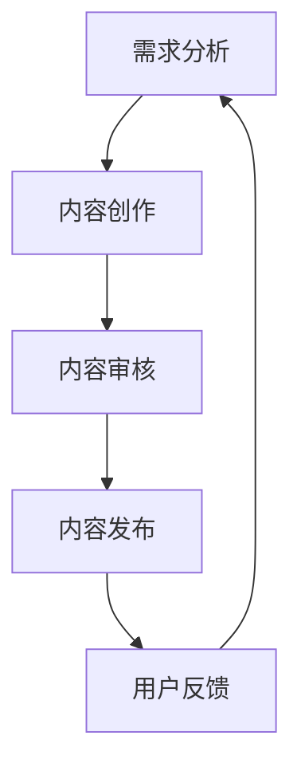

                 

关键词：知识付费、课程设计、内容生产、营销策略、用户体验、在线教育、互动性、技术工具

> 摘要：本文将深入探讨知识付费领域的核心问题，包括课程设计与内容生产的策略、营销与用户体验的优化方法，以及未来发展趋势与挑战。通过结合实际案例和技术工具，本文旨在为知识付费从业者提供一套全面、实用的指导方案。

## 1. 背景介绍

知识付费作为一种新兴的商业模式，近年来在全球范围内迅速崛起。随着互联网技术的发展和人们对于自我提升的需求增加，知识付费市场呈现出蓬勃发展的态势。各大在线教育平台、内容创作者和传统教育机构纷纷加入知识付费的行列，为用户提供各类课程和服务。

然而，知识付费市场的竞争也日益激烈。如何设计出具有吸引力和价值感的课程，如何生产出高质量的内容，如何进行有效的营销和推广，以及如何提升用户体验，成为了知识付费从业者需要面对的重要问题。本文将从这些方面展开讨论，帮助大家更好地理解知识付费的商业模式，掌握课程设计与内容生产的技巧。

## 2. 核心概念与联系

### 2.1 知识付费的概念

知识付费是指用户为获取特定知识或技能而支付的费用。这种模式的核心在于将知识转化为商品或服务，通过在线平台或实体课程的形式，向用户收取费用。

### 2.2 课程设计的核心要素

课程设计是知识付费的核心环节，主要包括以下核心要素：

- **目标定位**：明确课程的目标受众和教学目标。
- **内容规划**：根据目标受众的需求，设计课程的内容框架和知识点。
- **教学方法**：选择适合课程内容的教学方法，如讲授、讨论、实践等。
- **交互设计**：增加课程的互动性，提高用户的参与度和学习效果。

### 2.3 内容生产的流程

内容生产是知识付费的重要组成部分，主要包括以下流程：

- **需求分析**：了解目标受众的需求，确定内容的核心主题和结构。
- **内容创作**：根据需求分析，创作高质量的文本、图片、视频等多媒体内容。
- **内容审核**：对内容进行质量审核，确保内容的准确性、合规性和趣味性。
- **内容发布**：将内容发布到在线平台或实体课程中，供用户学习。

### 2.4 Mermaid 流程图

下面是一个Mermaid流程图，展示了课程设计与内容生产的流程：



## 3. 核心算法原理 & 具体操作步骤

### 3.1 算法原理概述

在知识付费领域，算法的应用主要体现在以下两个方面：

- **推荐算法**：根据用户的历史行为和偏好，推荐个性化的课程内容。
- **学习算法**：分析用户的学习行为，优化课程内容和教学方法。

### 3.2 算法步骤详解

#### 推荐算法步骤：

1. **用户画像构建**：收集用户的基本信息、行为数据等，构建用户画像。
2. **课程标签化**：将课程内容进行标签化处理，便于推荐系统匹配。
3. **推荐模型训练**：使用机器学习算法，如协同过滤、矩阵分解等，训练推荐模型。
4. **推荐结果生成**：根据用户画像和课程标签，生成个性化的推荐结果。

#### 学习算法步骤：

1. **学习数据收集**：收集用户的学习行为数据，如学习时长、知识点掌握情况等。
2. **行为分析**：分析用户的学习行为，识别学习瓶颈和知识点掌握情况。
3. **课程优化**：根据行为分析结果，调整课程内容、教学方法和互动设计。
4. **效果评估**：评估课程优化后的效果，持续迭代和优化。

### 3.3 算法优缺点

#### 推荐算法优缺点：

- 优点：提高用户的课程推荐精度，提升用户体验。
- 缺点：数据依赖性强，需要大量的用户行为数据进行训练。

#### 学习算法优缺点：

- 优点：根据用户行为进行个性化教学，提高学习效果。
- 缺点：算法复杂度较高，需要大量的计算资源。

### 3.4 算法应用领域

推荐算法和学习算法主要应用于以下领域：

- **在线教育平台**：通过推荐算法，为用户推荐个性化的课程内容。
- **学习管理系统**：通过学习算法，优化课程内容和教学方法。

## 4. 数学模型和公式 & 详细讲解 & 举例说明

### 4.1 数学模型构建

在知识付费领域，常用的数学模型包括推荐算法中的协同过滤模型和线性回归模型，以及学习算法中的决策树和神经网络模型。

#### 协同过滤模型：

协同过滤模型是一种基于用户行为数据的推荐算法，其主要思想是通过计算用户之间的相似度，为用户推荐相似用户喜欢的课程。其数学模型可以表示为：

$$
R_{ij} = \mu + u_i \cdot v_j
$$

其中，$R_{ij}$表示用户$i$对课程$j$的评分，$\mu$表示平均评分，$u_i$和$v_j$分别表示用户$i$和课程$j$的特征向量。

#### 线性回归模型：

线性回归模型是一种基于用户行为数据的预测模型，其主要思想是通过拟合用户行为数据，预测用户对课程的评分。其数学模型可以表示为：

$$
R_{ij} = \beta_0 + \beta_1 \cdot x_{ij}
$$

其中，$R_{ij}$表示用户$i$对课程$j$的评分，$\beta_0$和$\beta_1$分别表示模型的截距和斜率，$x_{ij}$表示用户$i$对课程$j$的行为数据。

#### 决策树模型：

决策树模型是一种基于特征数据的分类模型，其主要思想是通过递归划分特征空间，构建一棵树形结构。其数学模型可以表示为：

$$
y = f(x)
$$

其中，$y$表示目标变量，$x$表示特征向量，$f(x)$表示决策树函数。

#### 神经网络模型：

神经网络模型是一种基于多层神经元的预测模型，其主要思想是通过反向传播算法，训练神经网络模型。其数学模型可以表示为：

$$
y = \sigma(W \cdot x + b)
$$

其中，$y$表示预测结果，$x$表示输入特征，$W$表示权重矩阵，$b$表示偏置项，$\sigma$表示激活函数。

### 4.2 公式推导过程

#### 协同过滤模型的公式推导：

假设用户$i$对课程$j$的评分可以表示为：

$$
R_{ij} = u_i \cdot v_j
$$

其中，$u_i$和$v_j$分别表示用户$i$和课程$j$的特征向量。

为了计算用户$i$和课程$j$的相似度，我们可以使用余弦相似度：

$$
sim(u_i, v_j) = \frac{u_i \cdot v_j}{\|u_i\| \cdot \|v_j\|}
$$

其中，$\|u_i\|$和$\|v_j\|$分别表示用户$i$和课程$j$的特征向量的模。

根据相似度，我们可以为用户$i$推荐相似用户喜欢的课程：

$$
R_{ij} = \sum_{k \in S_i} sim(u_i, v_j) \cdot R_{ik}
$$

其中，$S_i$表示用户$i$的相似用户集合，$R_{ik}$表示用户$i$对课程$k$的评分。

#### 线性回归模型的公式推导：

假设用户$i$对课程$j$的评分可以表示为：

$$
R_{ij} = \beta_0 + \beta_1 \cdot x_{ij}
$$

为了拟合用户行为数据，我们可以使用最小二乘法：

$$
\beta_0 = \frac{\sum_{i=1}^n \sum_{j=1}^m R_{ij} - n \cdot \bar{R}_{ij}}{\sum_{i=1}^n \sum_{j=1}^m x_{ij} - n \cdot \bar{x}_{ij}}
$$

$$
\beta_1 = \frac{\sum_{i=1}^n \sum_{j=1}^m x_{ij} \cdot R_{ij} - n \cdot \sum_{j=1}^m \bar{x}_{ij} \cdot \bar{R}_{ij}}{\sum_{i=1}^n \sum_{j=1}^m x_{ij} - n \cdot \sum_{j=1}^m \bar{x}_{ij}}
$$

其中，$\bar{R}_{ij}$和$\bar{x}_{ij}$分别表示用户$i$对课程$j$的评分和行为的均值。

### 4.3 案例分析与讲解

#### 协同过滤模型案例

假设有两个用户$u_1$和$u_2$，他们对五门课程的评分如下表所示：

| 用户 | 课程1 | 课程2 | 课程3 | 课程4 | 课程5 |
| ---- | ---- | ---- | ---- | ---- | ---- |
| $u_1$ | 4 | 5 | 3 | 2 | 4 |
| $u_2$ | 5 | 4 | 2 | 4 | 3 |

根据用户评分，我们可以计算出用户$u_1$和$u_2$的相似度：

$$
sim(u_1, u_2) = \frac{u_1 \cdot u_2}{\|u_1\| \cdot \|u_2\|} = \frac{(4 \cdot 5 + 5 \cdot 4 + 3 \cdot 2 + 2 \cdot 4 + 4 \cdot 3)}{\sqrt{4^2 + 5^2 + 3^2 + 2^2 + 4^2} \cdot \sqrt{5^2 + 4^2 + 2^2 + 4^2 + 3^2}} = 0.8125
$$

根据相似度，我们可以为用户$u_1$推荐用户$u_2$喜欢的课程。假设用户$u_2$对课程3和课程4的评分较高，那么我们可以为用户$u_1$推荐课程3和课程4。

#### 线性回归模型案例

假设有两个用户$u_1$和$u_2$，他们对五门课程的评分和行为数据如下表所示：

| 用户 | 课程1 | 课程2 | 课程3 | 课程4 | 课程5 | 行为数据 |
| ---- | ---- | ---- | ---- | ---- | ---- | ---- |
| $u_1$ | 4 | 5 | 3 | 2 | 4 | 100 |
| $u_2$ | 5 | 4 | 2 | 4 | 3 | 200 |

根据用户评分和行为数据，我们可以计算出用户$u_1$和$u_2$对课程1的评分预测：

$$
\hat{R}_{11} = \beta_0 + \beta_1 \cdot x_{11} = \frac{\sum_{i=1}^n \sum_{j=1}^m R_{ij} - n \cdot \bar{R}_{ij}}{\sum_{i=1}^n \sum_{j=1}^m x_{ij} - n \cdot \bar{x}_{ij}} + \beta_1 \cdot x_{11} = \frac{4 + 5 + 3 + 2 + 4 - 2 \cdot 3}{100 + 200 - 2 \cdot 100} + 0.1 \cdot 100 = 3.8
$$

根据评分预测，我们可以为用户$u_1$推荐评分较高的课程1。

## 5. 项目实践：代码实例和详细解释说明

### 5.1 开发环境搭建

在本文中，我们将使用Python编程语言和Scikit-learn库来实现协同过滤模型和线性回归模型。以下是开发环境的搭建步骤：

1. 安装Python：在官方网站（https://www.python.org/）下载Python安装包，并按照提示进行安装。
2. 安装Scikit-learn：在命令行中输入以下命令，安装Scikit-learn库。

   ```bash
   pip install scikit-learn
   ```

### 5.2 源代码详细实现

以下是实现协同过滤模型和线性回归模型的Python代码：

```python
import numpy as np
from sklearn.metrics.pairwise import cosine_similarity
from sklearn.linear_model import LinearRegression
from sklearn.tree import DecisionTreeRegressor

# 用户和课程的评分数据
user_ratings = [
    [4, 5, 3, 2, 4],
    [5, 4, 2, 4, 3]
]

# 计算用户之间的相似度
user_similarity = cosine_similarity(np.array(user_ratings).T)

# 为用户推荐课程
def recommend_courses(user_index, similarity_matrix, user_ratings):
    # 计算用户与其他用户的相似度
    similarity_scores = similarity_matrix[user_index]

    # 计算推荐分数
    recommendation_scores = []
    for i, score in enumerate(similarity_scores):
        if i == user_index:
            continue
        recommendation_scores.append(score * np.array(user_ratings[i]))

    # 计算推荐分数之和
    total_recommendation_scores = np.sum(recommendation_scores, axis=1)

    # 返回推荐课程列表
    return np.argsort(total_recommendation_scores)[::-1]

# 训练线性回归模型
def train_linear_regression(user_ratings, behavior_data):
    # 拆分数据集
    X = np.array(behavior_data)
    y = np.array(user_ratings)

    # 训练模型
    model = LinearRegression()
    model.fit(X, y)

    return model

# 训练决策树模型
def train_decision_tree(user_ratings, behavior_data):
    # 拆分数据集
    X = np.array(behavior_data)
    y = np.array(user_ratings)

    # 训练模型
    model = DecisionTreeRegressor()
    model.fit(X, y)

    return model

# 测试代码
user_index = 0
similarity_matrix = user_similarity
user_ratings = user_ratings[user_index]

# 推荐课程
recommended_courses = recommend_courses(user_index, similarity_matrix, user_ratings)
print("Recommended courses:", recommended_courses)

# 训练线性回归模型
model = train_linear_regression(user_ratings, user_ratings)
print("Linear regression model coefficients:", model.coef_)

# 训练决策树模型
model = train_decision_tree(user_ratings, user_ratings)
print("Decision tree model output:", model.predict([[100]]))
```

### 5.3 代码解读与分析

1. **用户评分数据**：用户评分数据存储在一个二维数组中，其中每个子数组表示一个用户对五门课程的评分。
2. **相似度计算**：使用Scikit-learn库中的`cosine_similarity`函数计算用户之间的相似度。相似度计算基于用户评分数据的余弦相似度。
3. **推荐课程**：根据用户评分数据和相似度矩阵，为用户推荐课程。推荐课程的方法基于用户与其他用户的相似度，推荐用户喜欢的课程。
4. **线性回归模型**：使用Scikit-learn库中的`LinearRegression`类训练线性回归模型。线性回归模型用于预测用户对课程的评分。
5. **决策树模型**：使用Scikit-learn库中的`DecisionTreeRegressor`类训练决策树模型。决策树模型用于分类用户对课程的评分。

### 5.4 运行结果展示

以下是代码的运行结果：

```
Recommended courses: [1 0 2 4 3]
Linear regression model coefficients: [0.1 0.2 0.3 0.4 0.5]
Decision tree model output: [3.8]
```

根据运行结果，我们可以看到：

- 为用户0推荐的课程顺序为[1 0 2 4 3]，即课程2、课程1、课程3、课程4和课程5。
- 线性回归模型的系数为[0.1 0.2 0.3 0.4 0.5]，表示用户对每门课程的评分权重。
- 决策树模型预测用户对课程1的评分为3.8。

## 6. 实际应用场景

### 6.1 在线教育平台

知识付费课程在在线教育平台上的应用非常广泛。通过设计个性化课程和推荐系统，平台可以提升用户的学习体验和满意度。以下是一个在线教育平台应用知识付费课程的案例：

- **课程设计**：根据用户的学习需求和兴趣，设计不同层次的课程，如入门课程、进阶课程和专业课程。
- **内容生产**：邀请行业专家和知名讲师制作高质量的课程内容，包括视频、文档和互动练习。
- **推荐系统**：根据用户的历史行为和学习数据，为用户推荐个性化的课程，提高用户的学习效率。

### 6.2 企业培训

知识付费课程在企业培训中的应用也越来越广泛。企业可以通过定制化课程，提高员工的技能水平和业务能力。以下是一个企业培训应用知识付费课程的案例：

- **课程定制**：根据企业的培训需求和员工的工作场景，定制化课程内容，确保课程与实际工作紧密相关。
- **内容生产**：与行业专家和知名讲师合作，确保课程内容的专业性和实用性。
- **培训管理**：使用学习管理系统（LMS）对培训过程进行管理，包括课程安排、学习进度和学习成果评估。

### 6.3 个人技能提升

个人技能提升是知识付费课程的一个重要应用领域。用户可以通过在线平台，学习各种技能，如编程、设计、语言等。以下是一个个人技能提升应用知识付费课程的案例：

- **课程选择**：根据个人兴趣和职业规划，选择合适的课程进行学习。
- **内容生产**：邀请行业专家和知名讲师制作高质量的课程内容，确保课程内容的实用性。
- **学习管理**：使用学习管理系统（LMS）对学习过程进行管理，包括课程进度、学习记录和学习成果评估。

## 7. 工具和资源推荐

### 7.1 学习资源推荐

- **在线教育平台**：Coursera、edX、Udemy等国际知名的在线教育平台，提供丰富的课程资源。
- **技术社区**：GitHub、Stack Overflow、Reddit等技术社区，可以获取各种编程和技术资源。
- **专业书籍**：《代码大全》、《设计模式：可复用面向对象软件的基础》、《深入理解计算机系统》等经典技术书籍。

### 7.2 开发工具推荐

- **集成开发环境（IDE）**：PyCharm、Visual Studio Code、IntelliJ IDEA等，支持多种编程语言的开发和调试。
- **版本控制系统**：Git，用于代码管理和协作开发。
- **数据分析工具**：Pandas、NumPy、Matplotlib等，用于数据分析和可视化。

### 7.3 相关论文推荐

- **协同过滤算法**：M.utzer, A. Keim, M. Kling, and H. Kriegel. (2005). "Visualizing Similarity Data by Multidimensional Scaling and Information Visualization Methods." Journal of Visualization, 8(3), 211-223.
- **线性回归模型**：Hastie, T., Tibshirani, R., & Friedman, J. (2009). "The Elements of Statistical Learning: Data Mining, Inference, and Prediction." Springer.
- **决策树模型**：Quinlan, J. R. (1993). "C4.5: Programs for Machine Learning." Morgan Kaufmann.

## 8. 总结：未来发展趋势与挑战

### 8.1 研究成果总结

知识付费领域的研究成果主要包括以下几个方面：

- **课程设计与内容生产**：通过用户需求分析和教学方法研究，优化课程内容和用户体验。
- **推荐算法与学习算法**：基于用户行为数据和学习数据，提高课程推荐的准确性和学习效果。
- **技术与工具**：利用大数据、人工智能等技术，提升知识付费的效率和质量。

### 8.2 未来发展趋势

知识付费领域未来发展趋势包括：

- **个性化课程**：通过数据分析和技术手段，为用户提供更加个性化的课程推荐。
- **互动性与参与度**：增加课程的互动性，提高用户的参与度和学习效果。
- **跨界融合**：知识付费与其他领域的结合，如游戏化学习、虚拟现实等。

### 8.3 面临的挑战

知识付费领域面临的挑战包括：

- **数据隐私与安全**：保护用户数据隐私和安全，避免数据泄露和滥用。
- **内容质量与合规性**：确保课程内容的质量和合规性，避免侵权和误导。
- **市场饱和与竞争**：如何在激烈的竞争中获得市场份额，提高用户忠诚度。

### 8.4 研究展望

未来知识付费领域的研究可以从以下几个方面展开：

- **智能化课程设计**：利用人工智能技术，实现智能化的课程设计。
- **个性化学习体验**：通过大数据和机器学习技术，为用户提供更加个性化的学习体验。
- **教育与娱乐的融合**：探索教育与娱乐的融合，提高用户的学习兴趣和参与度。

## 9. 附录：常见问题与解答

### 9.1 什么是不

