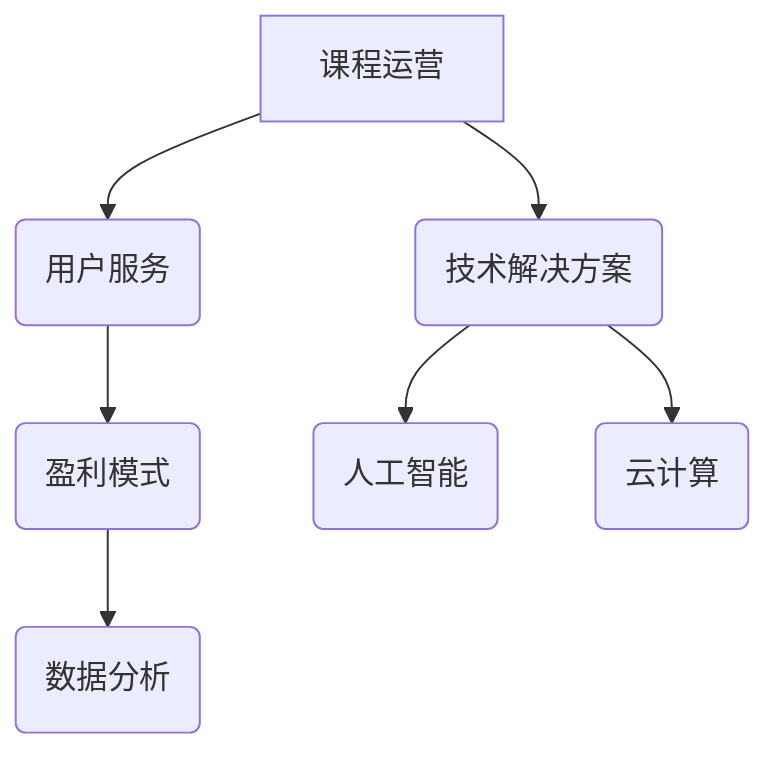

                 

关键词：知识付费、课程运营、用户服务、盈利模式、技术解决方案、用户体验、案例分析

> 摘要：本文将从知识付费的市场背景出发，深入探讨课程运营与用户服务的核心策略，分析其盈利模式，并介绍一系列技术解决方案，旨在为知识付费平台提供实用的运营思路和用户体验优化的方法。

## 1. 背景介绍

在信息化时代，知识付费逐渐成为了一个新的商业模式。随着互联网的普及，用户对于优质内容的需求日益增长，知识付费市场也迎来了爆发式增长。知识付费平台通过提供专业课程、讲座、电子书等形式，满足了用户在职业发展、兴趣爱好、自我提升等方面的需求。

知识付费市场的快速增长带来了巨大的商业机会，但也带来了诸多挑战。如何有效地运营课程、服务用户，提升用户体验，从而实现盈利，是每一个知识付费平台必须面对的问题。

## 2. 核心概念与联系

### 2.1. 课程运营

课程运营是指通过一系列策略和活动，优化课程内容、提升课程质量、扩大课程影响力，从而吸引并留住用户。课程运营的核心概念包括课程设计、课程推广、课程维护等。

### 2.2. 用户服务

用户服务是指通过提供优质的客户服务，满足用户的需求，提升用户的满意度和忠诚度。用户服务的核心概念包括用户调研、用户反馈、客户支持等。

### 2.3. 盈利模式

盈利模式是指知识付费平台通过何种方式实现盈利。常见的盈利模式包括课程收费、会员订阅、广告收入、周边产品销售等。

### 2.4. 技术解决方案

技术解决方案是指利用现代信息技术，提高课程运营效率、优化用户服务体验、实现精准营销等方面的策略。技术解决方案包括数据分析、人工智能、云计算等。

### 2.5. Mermaid 流程图



## 3. 核心算法原理 & 具体操作步骤

### 3.1 算法原理概述

课程运营、用户服务、盈利模式和技术解决方案共同构成了知识付费平台的核心算法。通过数据分析，可以了解用户的行为和需求，从而优化课程内容和推广策略；人工智能可以帮助平台实现个性化推荐和智能客服；云计算则提供了强大的计算能力和存储资源，支持平台的稳定运行和快速扩展。

### 3.2 算法步骤详解

#### 3.2.1 数据分析

1. 收集用户数据：通过用户注册、课程学习、互动评论等行为，收集用户的基本信息和行为数据。
2. 数据处理：对收集到的数据进行分析和处理，提取有价值的信息。
3. 数据可视化：利用图表和报告，展示数据分析结果，帮助运营团队了解用户需求和市场趋势。

#### 3.2.2 人工智能

1. 个性化推荐：利用用户行为数据和推荐算法，为用户推荐感兴趣的课程。
2. 智能客服：利用自然语言处理和机器学习技术，实现智能客服机器人，提高客户服务效率。

#### 3.2.3 云计算

1. 系统架构设计：根据业务需求，设计合理的云计算架构，确保系统的可扩展性和稳定性。
2. 资源调度：利用云计算平台，实现计算资源和存储资源的动态调度，提高资源利用率。

### 3.3 算法优缺点

#### 3.3.1 数据分析

优点：可以深入了解用户需求，优化课程内容和推广策略。

缺点：数据处理和分析需要大量时间和计算资源，成本较高。

#### 3.3.2 人工智能

优点：可以实现个性化推荐和智能客服，提高用户体验。

缺点：需要大量数据训练和优化，对算法工程师的要求较高。

#### 3.3.3 云计算

优点：提供强大的计算和存储能力，支持系统的快速扩展和稳定运行。

缺点：需要一定的技术门槛，且云服务费用较高。

### 3.4 算法应用领域

数据分析、人工智能和云计算广泛应用于知识付费平台，如课程推荐、用户行为分析、智能客服、系统架构设计等。

## 4. 数学模型和公式 & 详细讲解 & 举例说明

### 4.1 数学模型构建

在知识付费平台中，常见的数学模型包括用户行为预测模型、课程推荐模型和盈利预测模型。

#### 4.1.1 用户行为预测模型

用户行为预测模型旨在预测用户在未来的行为，如购买课程、学习时长、互动评论等。常见的用户行为预测模型有：

- 逻辑回归模型（Logistic Regression）
- 支持向量机（Support Vector Machine, SVM）
- 决策树（Decision Tree）

#### 4.1.2 课程推荐模型

课程推荐模型旨在为用户推荐感兴趣的课程。常见的课程推荐模型有：

- 协同过滤（Collaborative Filtering）
- 基于内容的推荐（Content-Based Recommendation）
- 混合推荐（Hybrid Recommendation）

#### 4.1.3 盈利预测模型

盈利预测模型旨在预测平台的未来盈利情况，以指导运营决策。常见的盈利预测模型有：

- 线性回归（Linear Regression）
- 朴素贝叶斯（Naive Bayes）

### 4.2 公式推导过程

#### 4.2.1 逻辑回归模型

逻辑回归模型是一种广泛应用于分类问题的模型，其公式如下：

$$
P(y=1) = \frac{1}{1 + e^{-(\beta_0 + \beta_1 x_1 + ... + \beta_n x_n})}
$$

其中，$y$ 表示分类标签，$x_1, x_2, ..., x_n$ 表示特征值，$\beta_0, \beta_1, ..., \beta_n$ 为模型参数。

#### 4.2.2 协同过滤模型

协同过滤模型是基于用户行为数据进行推荐的模型，其公式如下：

$$
r_{ui} = \sum_{j \in N(i)} \frac{q_{uj} r_{uj}}{\|N(i)\|} + b_u + b_i
$$

其中，$r_{ui}$ 表示用户 $u$ 对课程 $i$ 的评分，$q_{uj}$ 表示用户 $u$ 对课程 $j$ 的评分，$N(i)$ 表示与课程 $i$ 相关的用户集合，$b_u$ 和 $b_i$ 分别为用户和课程的偏置项。

### 4.3 案例分析与讲解

#### 4.3.1 用户行为预测案例

假设我们有一个用户行为数据集，包含用户ID、课程ID、学习时长、互动评论等特征。我们使用逻辑回归模型预测用户是否会在未来购买某门课程。

1. 数据预处理：对数据进行归一化处理，将数值特征转换为相同的量纲。
2. 特征选择：选择与用户行为相关的特征，如学习时长、互动评论等。
3. 模型训练：使用训练集数据训练逻辑回归模型，得到模型参数。
4. 模型评估：使用测试集数据评估模型性能，如准确率、召回率等。
5. 模型应用：将模型应用到实际场景中，预测用户是否购买课程。

#### 4.3.2 课程推荐案例

假设我们有一个用户行为数据集，包含用户ID、课程ID、学习时长、互动评论等特征。我们使用协同过滤模型为用户推荐课程。

1. 数据预处理：对数据进行归一化处理，将数值特征转换为相同的量纲。
2. 特征选择：选择与用户行为相关的特征，如学习时长、互动评论等。
3. 模型训练：使用训练集数据训练协同过滤模型，得到推荐结果。
4. 模型评估：使用测试集数据评估模型性能，如平均绝对误差等。
5. 模型应用：将模型应用到实际场景中，为用户推荐课程。

## 5. 项目实践：代码实例和详细解释说明

### 5.1 开发环境搭建

1. 安装Python环境：在本地电脑上安装Python，版本建议为3.8以上。
2. 安装相关库：使用pip安装所需的库，如NumPy、Pandas、Scikit-learn等。

### 5.2 源代码详细实现

以下是一个简单的用户行为预测模型的实现：

```python
import numpy as np
import pandas as pd
from sklearn.linear_model import LogisticRegression
from sklearn.model_selection import train_test_split
from sklearn.metrics import accuracy_score

# 读取数据
data = pd.read_csv('user_behavior.csv')

# 数据预处理
data['learning_time'] = data['learning_time'].apply(lambda x: 1 if x > 0 else 0)
data['comment'] = data['comment'].apply(lambda x: 1 if x > 0 else 0)

# 特征选择
X = data[['learning_time', 'comment']]
y = data['purchase']

# 划分训练集和测试集
X_train, X_test, y_train, y_test = train_test_split(X, y, test_size=0.2, random_state=42)

# 模型训练
model = LogisticRegression()
model.fit(X_train, y_train)

# 模型评估
y_pred = model.predict(X_test)
accuracy = accuracy_score(y_test, y_pred)
print(f'Accuracy: {accuracy:.2f}')

# 模型应用
user_data = pd.DataFrame([[1, 0], [0, 1]], columns=['learning_time', 'comment'])
user_pred = model.predict(user_data)
print(f'Prediction: {user_pred}')
```

### 5.3 代码解读与分析

1. **数据读取与预处理**：首先读取用户行为数据，并对数据进行归一化处理，将数值特征转换为相同的量纲。然后，根据购买行为对数据标签进行分类。
2. **特征选择**：选择与用户行为相关的特征，如学习时长和互动评论。
3. **模型训练**：使用训练集数据训练逻辑回归模型。
4. **模型评估**：使用测试集数据评估模型性能，计算准确率。
5. **模型应用**：将模型应用到实际场景中，预测新用户的购买行为。

## 6. 实际应用场景

知识付费平台可以在多个场景中应用课程运营、用户服务和盈利模式，以下是一些实际应用案例：

1. **在线教育平台**：通过个性化推荐和智能客服，提高用户的学习体验和满意度。
2. **职业培训平台**：利用数据分析，优化课程内容和推广策略，提高课程转化率。
3. **知识付费社区**：通过社区互动和用户服务，提升用户活跃度和忠诚度，实现盈利。

## 7. 未来应用展望

随着人工智能、大数据和云计算等技术的不断发展，知识付费市场将迎来更广阔的应用前景。未来，知识付费平台将更加注重用户需求分析、个性化推荐和智能客服，提升用户体验和满意度，从而实现可持续发展。

## 8. 总结：未来发展趋势与挑战

### 8.1 研究成果总结

本文通过分析知识付费市场的背景、核心概念、算法原理、数学模型和实际应用场景，总结了知识付费平台在课程运营、用户服务和盈利模式方面的研究成果。

### 8.2 未来发展趋势

未来，知识付费平台将更加注重用户需求分析、个性化推荐和智能客服，提升用户体验和满意度，从而实现可持续发展。

### 8.3 面临的挑战

知识付费平台在发展过程中将面临数据隐私、技术门槛和市场竞争等方面的挑战。

### 8.4 研究展望

未来，可以进一步研究知识付费平台的盈利模式、用户行为预测和推荐算法，探索更高效、更智能的课程运营和用户服务策略。

## 9. 附录：常见问题与解答

### 9.1 什么是知识付费？

知识付费是指用户为获取特定知识或技能，通过支付一定费用来购买相关课程或服务。

### 9.2 数据分析在知识付费中的作用是什么？

数据分析可以帮助知识付费平台深入了解用户需求，优化课程内容和推广策略，提高用户满意度和转化率。

### 9.3 如何实现个性化推荐？

个性化推荐通过分析用户行为数据和用户特征，为用户提供个性化的课程推荐，从而提高用户满意度和留存率。

### 9.4 知识付费平台如何实现盈利？

知识付费平台可以通过课程收费、会员订阅、广告收入、周边产品销售等多种方式实现盈利。

## 作者署名

作者：禅与计算机程序设计艺术 / Zen and the Art of Computer Programming
----------------------------------------------------------------


