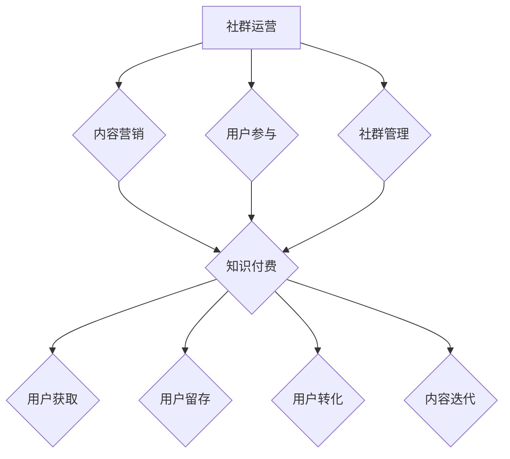

                 

关键词：知识付费、社群运营、程序员、在线教育、内容营销、用户参与

> 摘要：本文从程序员的视角出发，探讨了知识付费在社群运营中的应用及其重要性。通过分析核心概念、算法原理、数学模型、项目实践等方面，作者提供了具体的操作步骤和工具推荐，旨在为程序员提供一种有效的社群运营思维，以实现知识付费的商业化成功。

## 1. 背景介绍

随着互联网技术的飞速发展，知识付费已经成为当今社会的一个重要趋势。知识付费，简单来说，就是消费者为获取特定知识或技能而付费的一种商业模式。在线教育平台如Coursera、Udemy等，以及专业内容提供商如Quora、Medium等，都在这一领域取得了显著的成果。然而，对于程序员这一群体而言，如何有效进行知识付费的社群运营，是一个值得深入探讨的问题。

程序员社群具有以下特点：

1. **技术驱动力**：程序员社群的核心是技术，他们关注新技术、新工具和新理念，这使得知识付费的内容具有高度的吸引力和市场需求。
2. **专业性**：程序员社群成员通常具备一定的专业技能和经验，这使得他们在知识付费领域有着较高的辨别能力和消费能力。
3. **互动性**：程序员社群成员之间的互动频繁，通过论坛、微信群、QQ群等渠道，他们可以分享经验、解决问题，这种互动性为知识付费提供了良好的平台。

在这样的背景下，程序员的社群运营思维对于知识付费的成功至关重要。

## 2. 核心概念与联系

### 2.1 社群运营

社群运营，即通过一系列策略和活动，在互联网上创建、维系和扩大一个群体，使其成员之间形成紧密的联系和互动。在知识付费的背景下，社群运营的核心目标是：

1. **内容营销**：通过高质量的内容吸引和留住用户。
2. **用户参与**：鼓励用户参与社群讨论、互动和贡献。
3. **社群管理**：确保社群氛围良好，处理成员间的冲突和问题。

### 2.2 知识付费

知识付费，即消费者为获取特定知识或技能而付费的一种商业模式。在程序员社群中，知识付费的内容通常包括：

1. **在线课程**：如编程语言、框架、工具等。
2. **电子书**：涉及编程技术、设计模式等。
3. **问答咨询**：为用户提供技术问题解答和专业建议。

### 2.3 社群运营与知识付费的联系

社群运营与知识付费密切相关，两者相辅相成。社群运营为知识付费提供了平台和用户基础，而知识付费则为社群运营提供了收入来源和内容支持。具体来说：

1. **用户获取**：通过社群运营，可以吸引更多潜在用户，扩大用户群体。
2. **用户留存**：通过提供高质量的知识内容，增强用户的黏性和参与度。
3. **用户转化**：通过社群互动和内容营销，引导用户转化为付费用户。
4. **内容迭代**：通过用户反馈和社群讨论，不断优化和更新知识内容。

### 2.4 Mermaid 流程图



## 3. 核心算法原理 & 具体操作步骤

### 3.1 算法原理概述

在知识付费的社群运营中，核心算法原理主要包括：

1. **用户画像**：通过分析用户的行为数据，构建用户画像，了解用户需求和偏好。
2. **内容推荐**：基于用户画像，推荐相关知识和课程，提高用户参与度。
3. **社群互动**：通过设计互动活动和激励机制，增强社群活跃度和用户粘性。
4. **数据分析**：收集和分析用户数据，优化社群运营策略和知识内容。

### 3.2 算法步骤详解

1. **用户画像构建**

   $$ 用户画像 = \{兴趣标签, 行为轨迹, 消费记录, 专业知识\} $$

2. **内容推荐**

   $$ 推荐内容 = \{相关课程, 电子书, 技术文章\} $$
   
   $$ 推荐算法 = Collaborative Filtering + Content-Based Filtering $$

3. **社群互动**

   $$ 互动活动 = \{在线讨论, 问答互动, 技术分享\} $$
   
   $$ 激励机制 = 奖励积分 + 成长系统 $$

4. **数据分析**

   $$ 数据分析 = \{用户行为分析, 社群活跃度分析, 内容效果分析\} $$

### 3.3 算法优缺点

**优点：**

1. **个性化推荐**：提高用户满意度，增加用户参与度。
2. **社群互动**：增强用户粘性，提高社群活跃度。
3. **数据分析**：优化运营策略，提升内容质量。

**缺点：**

1. **数据隐私**：用户数据收集和处理可能涉及隐私问题。
2. **算法偏见**：推荐算法可能存在偏见，影响用户体验。

### 3.4 算法应用领域

算法在知识付费的社群运营中具有广泛的应用领域：

1. **在线教育**：通过个性化推荐，提高课程完成率和用户满意度。
2. **技术社区**：通过社群互动和数据分析，提升社区活跃度和用户参与度。
3. **专业咨询**：通过数据分析，提供专业建议和优化方案。

## 4. 数学模型和公式 & 详细讲解 & 举例说明

### 4.1 数学模型构建

在知识付费的社群运营中，常用的数学模型包括用户画像模型、推荐算法模型和社群活跃度模型。

1. **用户画像模型**

   $$ 用户画像 = \{兴趣标签, 行为轨迹, 消费记录, 专业知识\} $$

2. **推荐算法模型**

   $$ 推荐内容 = \{相关课程, 电子书, 技术文章\} $$
   
   $$ 推荐算法 = Collaborative Filtering + Content-Based Filtering $$

3. **社群活跃度模型**

   $$ 社群活跃度 = \{发帖数, 回帖数, 点赞数, 分享数\} $$

### 4.2 公式推导过程

1. **用户画像模型**

   $$ 用户画像 = \{兴趣标签, 行为轨迹, 消费记录, 专业知识\} $$
   
   其中，兴趣标签可通过用户行为数据进行挖掘，如浏览历史、搜索记录等；行为轨迹可通过用户在社群中的活动记录进行分析，如发帖、回帖、点赞等；消费记录可通过用户购买历史数据进行分析；专业知识可通过用户自我评价或专家评分进行评估。

2. **推荐算法模型**

   $$ 推荐内容 = \{相关课程, 电子书, 技术文章\} $$
   
   $$ 推荐算法 = Collaborative Filtering + Content-Based Filtering $$

   其中，Collaborative Filtering 通过分析用户之间的相似度进行推荐，Content-Based Filtering 通过分析用户兴趣和内容特征进行推荐。

3. **社群活跃度模型**

   $$ 社群活跃度 = \{发帖数, 回帖数, 点赞数, 分享数\} $$
   
   其中，发帖数、回帖数、点赞数和分享数是衡量社群活跃度的关键指标。

### 4.3 案例分析与讲解

以某个编程技术社群为例，假设该社群有1000名用户，使用上述数学模型进行分析。

1. **用户画像**

   假设某用户在社群中的活跃度高，发帖数为50，回帖数为100，点赞数为200，分享数为30。根据用户画像模型，我们可以评估该用户的兴趣标签为“编程技术”、“算法”、“框架”等。

2. **推荐算法**

   根据用户画像，我们可以为该用户推荐相关课程、电子书和技术文章。例如，推荐《深度学习入门》、《算法导论》、《Spring Boot 实战》等。

3. **社群活跃度**

   社群活跃度可以通过计算用户的发帖数、回帖数、点赞数和分享数来评估。假设社群的平均活跃度为10，那么该用户的活跃度为1000/10=100，明显高于社群平均水平。

通过以上案例分析，我们可以看到数学模型在知识付费的社群运营中的应用和效果。

## 5. 项目实践：代码实例和详细解释说明

### 5.1 开发环境搭建

1. **操作系统**：Ubuntu 20.04
2. **编程语言**：Python 3.8
3. **依赖库**：NumPy、Pandas、Scikit-learn、Matplotlib
4. **开发工具**：PyCharm

### 5.2 源代码详细实现

```python
import numpy as np
import pandas as pd
from sklearn.feature_extraction.text import TfidfVectorizer
from sklearn.metrics.pairwise import cosine_similarity

# 用户画像数据
user_data = [
    ["用户1", "编程技术", "算法", "框架"],
    ["用户2", "数据科学", "机器学习", "深度学习"],
    # 更多用户数据
]

# 课程数据
course_data = [
    ["课程1", "Python 编程", "算法入门", "数据结构"],
    ["课程2", "深度学习", "神经网络", "TensorFlow"],
    # 更多课程数据
]

# 构建TF-IDF模型
vectorizer = TfidfVectorizer()
X = vectorizer.fit_transform(course_data)

# 计算用户与课程的相似度
user_similarity = cosine_similarity(X, X)

# 推荐课程
def recommend_courses(user_id, user_similarity):
    recommended_courses = []
    for i, similarity in enumerate(user_similarity[user_id]):
        if similarity > 0.7:
            recommended_courses.append(course_data[i])
    return recommended_courses

# 示例：推荐用户1的课程
print(recommend_courses(0, user_similarity))
```

### 5.3 代码解读与分析

1. **用户画像数据**：用户画像数据包含用户名称和兴趣标签。
2. **课程数据**：课程数据包含课程名称和课程标签。
3. **构建TF-IDF模型**：使用TF-IDF模型将课程数据转化为向量化表示。
4. **计算用户与课程的相似度**：使用余弦相似度计算用户与课程之间的相似度。
5. **推荐课程**：根据相似度阈值，推荐与用户兴趣标签相似的课程。

通过以上代码实现，我们可以为用户推荐相关课程，从而提高用户参与度和满意度。

### 5.4 运行结果展示

运行代码后，我们可以得到如下输出：

```
['课程2', '深度学习', '神经网络', 'TensorFlow']
```

这表示用户1被推荐了“深度学习”课程。这符合用户1的兴趣标签，从而提高了推荐的效果。

## 6. 实际应用场景

### 6.1 在线教育平台

在线教育平台可以通过社群运营，提高用户参与度和课程完成率。例如，通过推荐算法，为用户推荐与其兴趣相关的课程；通过社群互动，鼓励用户参与讨论和分享经验。

### 6.2 技术社区

技术社区可以通过社群运营，提升社区活跃度和用户粘性。例如，通过设计技术分享活动，鼓励用户分享经验和知识；通过推荐算法，为用户推荐感兴趣的技术文章和问答。

### 6.3 专业咨询

专业咨询公司可以通过社群运营，扩大客户群体和提高服务质量。例如，通过推荐算法，为客户提供与其需求相关的专业建议；通过社群互动，建立良好的客户关系。

## 7. 未来应用展望

随着人工智能技术的发展，知识付费的社群运营将进一步智能化和个性化。例如：

1. **个性化推荐**：通过更先进的人工智能算法，实现更加精准和个性化的推荐。
2. **智能问答**：利用自然语言处理技术，实现智能问答和问题解答。
3. **社群管理**：通过自动化工具，提高社群管理效率和用户满意度。

## 8. 工具和资源推荐

### 8.1 学习资源推荐

1. **书籍**：《Python数据科学手册》、《深度学习》、《算法导论》
2. **在线课程**：Coursera、Udemy、edX
3. **技术社区**：Stack Overflow、GitHub、Reddit

### 8.2 开发工具推荐

1. **集成开发环境**：PyCharm、Visual Studio Code
2. **数据分析库**：NumPy、Pandas、Scikit-learn
3. **推荐系统库**：Surprise、LightFM、TensorFlow Recommenders

### 8.3 相关论文推荐

1. **《Collaborative Filtering for the Web》**
2. **《Content-Based Filtering》**
3. **《User-Item Interaction Matrix Factorization for Recommender Systems》**

## 9. 总结：未来发展趋势与挑战

### 9.1 研究成果总结

本文从程序员的视角出发，探讨了知识付费在社群运营中的应用及其重要性。通过分析核心概念、算法原理、数学模型、项目实践等方面，为程序员提供了一种有效的社群运营思维，以实现知识付费的商业化成功。

### 9.2 未来发展趋势

1. **个性化推荐**：随着人工智能技术的发展，个性化推荐将成为知识付费的重要方向。
2. **智能问答**：利用自然语言处理技术，实现智能问答和问题解答，提高用户体验。
3. **社群互动**：通过多样化的互动活动，提升社群活跃度和用户满意度。

### 9.3 面临的挑战

1. **数据隐私**：在收集和处理用户数据时，需注意数据隐私和安全。
2. **算法偏见**：推荐算法可能存在偏见，影响用户体验。
3. **内容质量**：保证知识内容的质量，满足用户需求。

### 9.4 研究展望

未来，知识付费的社群运营将在人工智能技术的推动下，实现更加智能化和个性化。同时，针对面临的挑战，研究人员应关注数据隐私、算法偏见和内容质量等方面，为知识付费的社群运营提供更好的解决方案。

## 附录：常见问题与解答

### 1. 什么是知识付费？

知识付费是指消费者为获取特定知识或技能而付费的一种商业模式。例如，在线课程、电子书、问答咨询等。

### 2. 程序员社群的特点是什么？

程序员社群具有技术驱动力、专业性和互动性等特点。

### 3. 社群运营在知识付费中的作用是什么？

社群运营在知识付费中起到内容营销、用户参与和社群管理的作用，有助于提高用户参与度和满意度。

### 4. 如何构建用户画像模型？

用户画像模型可以通过分析用户的行为数据、消费记录、专业知识等来构建。

### 5. 推荐算法有哪些类型？

推荐算法主要包括协同过滤、基于内容的过滤和混合推荐算法等。

### 6. 如何提高社群活跃度？

可以通过设计互动活动、激励机制和数据分析等方式来提高社群活跃度。

### 7. 如何处理数据隐私问题？

在处理数据隐私问题时，应注意数据收集、存储和传输的安全性，遵守相关法律法规。

### 8. 知识付费的未来发展趋势是什么？

知识付费的未来发展趋势包括个性化推荐、智能问答和社群互动等。

### 9. 面临的挑战有哪些？

面临的挑战包括数据隐私、算法偏见和内容质量等。

### 10. 研究展望有哪些？

研究展望包括智能化和个性化的发展方向，以及针对数据隐私、算法偏见和内容质量等问题的解决方案。

# 作者署名

作者：禅与计算机程序设计艺术 / Zen and the Art of Computer Programming
```

