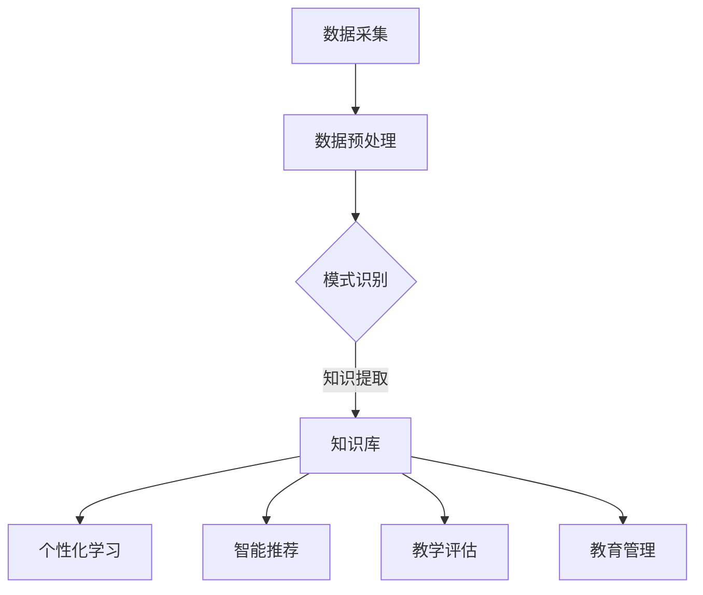

                 

关键词：知识发现、教育模式、人工智能、算法、未来趋势、技术变革

> 摘要：本文将探讨知识发现引擎在人工智能时代对教育模式的深刻影响，分析其核心概念、算法原理，以及在实际应用中的表现。同时，本文还将展望知识发现引擎在未来的发展趋势和面临的挑战，为教育领域的技术变革提供参考。

## 1. 背景介绍

教育作为社会发展的基石，一直以来都在不断地变革和进步。从传统的一对一教学，到后来的班级授课制，再到如今的在线教育，教育模式在不断适应时代的变化。然而，随着人工智能技术的迅猛发展，尤其是知识发现引擎的出现，教育领域正面临着前所未有的变革。

知识发现引擎是一种智能算法，它可以从大量数据中自动识别出隐藏的模式和关联，从而为教育提供个性化的学习方案。这种技术的出现，不仅改变了教育的本质，也对教师、学生以及教育机构带来了深远的影响。

本文将首先介绍知识发现引擎的核心概念，包括其原理、算法和架构。然后，我们将探讨知识发现引擎在具体教育场景中的应用，以及它对传统教育模式的挑战。最后，我们将展望知识发现引擎在未来的发展趋势和面临的挑战。

## 2. 核心概念与联系

### 2.1 知识发现引擎的定义

知识发现引擎（Knowledge Discovery Engine，简称KDE）是一种利用人工智能技术，从大规模数据中自动识别出有价值知识的系统。它通过数据挖掘、机器学习、自然语言处理等多种技术手段，实现对数据的深度分析，从而提取出隐藏在数据中的模式、关联和趋势。

### 2.2 知识发现引擎的工作原理

知识发现引擎的工作原理可以概括为以下几个步骤：

1. **数据采集**：从各种数据源（如数据库、网页、社交媒体等）收集数据。
2. **数据预处理**：对采集到的数据进行清洗、整合和转换，使其适合进一步的分析。
3. **模式识别**：利用机器学习和数据挖掘算法，从预处理后的数据中识别出潜在的规律和关联。
4. **知识提取**：将识别出的模式转化为可操作的知识，为教育提供个性化支持。

### 2.3 知识发现引擎的架构

知识发现引擎的架构通常包括以下几个部分：

1. **数据源**：包括内部数据源和外部数据源，如学生成绩数据库、教师评价系统、在线学习平台等。
2. **数据预处理模块**：负责数据的清洗、整合和转换，确保数据的质量和一致性。
3. **算法库**：包括各种机器学习和数据挖掘算法，如聚类、分类、关联规则挖掘等。
4. **知识库**：存储从数据中提取出的模式和知识，为教育提供个性化支持。
5. **可视化模块**：将分析结果以图表、图像等形式直观地展示给用户。

### 2.4 知识发现引擎与教育的联系

知识发现引擎在教育中的应用，主要体现在以下几个方面：

1. **个性化学习**：通过分析学生的学习行为和成绩数据，知识发现引擎可以为每个学生提供个性化的学习方案，帮助其更好地理解和掌握知识。
2. **智能推荐**：根据学生的学习兴趣和成绩，知识发现引擎可以推荐相应的学习资源，提高学习效率。
3. **教学评估**：通过分析教师的教学行为和效果，知识发现引擎可以评估教师的教学质量，为教学改进提供依据。
4. **教育管理**：知识发现引擎可以辅助教育机构进行招生、分班、课程设置等管理决策，提高管理效率。

### 2.5 Mermaid 流程图

以下是一个简化的知识发现引擎在教育中的应用的 Mermaid 流程图：



## 3. 核心算法原理 & 具体操作步骤

### 3.1 算法原理概述

知识发现引擎的核心算法包括数据挖掘、机器学习和自然语言处理等。以下是对这些算法的简要概述：

1. **数据挖掘**：数据挖掘（Data Mining）是一种从大量数据中发现规律、模式和知识的方法。常见的数据挖掘算法包括聚类、分类、关联规则挖掘等。
2. **机器学习**：机器学习（Machine Learning）是一种通过训练模型，使计算机自动识别数据中规律的方法。常见的机器学习算法包括决策树、支持向量机、神经网络等。
3. **自然语言处理**：自然语言处理（Natural Language Processing，NLP）是一种使计算机理解和处理人类语言的技术。常见的 NLP 算法包括词性标注、句法分析、语义分析等。

### 3.2 算法步骤详解

1. **数据采集**：从各种数据源收集数据，包括学生成绩、学习行为、教师评价等。
2. **数据预处理**：对采集到的数据进行清洗、整合和转换，使其适合进一步的分析。例如，去除重复数据、填补缺失值、归一化等。
3. **模式识别**：利用数据挖掘、机器学习和自然语言处理算法，从预处理后的数据中识别出潜在的规律和关联。例如，通过聚类算法分析学生的学习行为，通过分类算法预测学生的成绩等。
4. **知识提取**：将识别出的模式转化为可操作的知识，为教育提供个性化支持。例如，根据学生的学习行为，推荐相应的学习资源，根据学生的成绩，调整教学策略等。
5. **知识库构建**：将提取出的知识存储到知识库中，为后续的个性化学习和教学评估提供支持。
6. **可视化展示**：将分析结果以图表、图像等形式直观地展示给用户，帮助其更好地理解和应用知识发现引擎。

### 3.3 算法优缺点

1. **优点**：
   - 个性化学习：知识发现引擎可以根据学生的学习行为和成绩，提供个性化的学习方案，提高学习效果。
   - 智能推荐：知识发现引擎可以根据学生的学习兴趣和成绩，推荐相应的学习资源，提高学习效率。
   - 教学评估：知识发现引擎可以辅助教师进行教学评估，为教学改进提供依据。
   - 教育管理：知识发现引擎可以辅助教育机构进行招生、分班、课程设置等管理决策，提高管理效率。

2. **缺点**：
   - 数据隐私：知识发现引擎需要收集大量的学生数据，可能会引发数据隐私问题。
   - 算法复杂性：知识发现引擎涉及多种算法，实现和优化难度较大。
   - 结果解释性：知识发现引擎的分析结果可能具有一定的解释性，但在某些情况下，其结果可能难以解释。

### 3.4 算法应用领域

知识发现引擎在教育领域的应用非常广泛，主要包括以下几个方面：

1. **个性化学习**：通过分析学生的学习行为和成绩，知识发现引擎可以为每个学生提供个性化的学习方案，帮助其更好地理解和掌握知识。
2. **智能推荐**：知识发现引擎可以根据学生的学习兴趣和成绩，推荐相应的学习资源，提高学习效率。
3. **教学评估**：通过分析教师的教学行为和效果，知识发现引擎可以评估教师的教学质量，为教学改进提供依据。
4. **教育管理**：知识发现引擎可以辅助教育机构进行招生、分班、课程设置等管理决策，提高管理效率。
5. **学习分析**：知识发现引擎可以分析学生的学习过程，发现学习中的问题和瓶颈，为教育改革提供参考。

## 4. 数学模型和公式 & 详细讲解 & 举例说明

### 4.1 数学模型构建

知识发现引擎的核心算法涉及到多个数学模型，主要包括以下几种：

1. **聚类模型**：聚类是一种将数据分为若干个类别的技术，常用的聚类算法包括 K-均值聚类、层次聚类等。其数学模型可以表示为：

   $$
   C = \{C_1, C_2, ..., C_k\}
   $$

   其中，$C$ 表示聚类结果，$C_i$ 表示第 $i$ 个聚类类别。

2. **分类模型**：分类是一种将数据分配到不同类别的技术，常用的分类算法包括决策树、支持向量机等。其数学模型可以表示为：

   $$
   y = f(x)
   $$

   其中，$y$ 表示类别标签，$f(x)$ 表示分类函数。

3. **关联规则挖掘模型**：关联规则挖掘是一种发现数据中隐含关联规则的技术，常用的算法包括 Apriori 算法、FP-Growth 算法等。其数学模型可以表示为：

   $$
   \text{support}(X, Y) = \frac{|\{(x, y) | x \in X, y \in Y\}|}{|\text{总数据集}|}
   $$

   其中，$\text{support}(X, Y)$ 表示项集 $X$ 和 $Y$ 之间的支持度。

4. **神经网络模型**：神经网络是一种模仿人脑神经网络结构的计算模型，常用的神经网络包括多层感知机、卷积神经网络等。其数学模型可以表示为：

   $$
   a_{i}^{l} = \sigma \left( \sum_{j=1}^{n} w_{ij} a_{j}^{l-1} + b_{i}^{l} \right)
   $$

   其中，$a_{i}^{l}$ 表示第 $i$ 个神经元在第 $l$ 层的输出，$\sigma$ 表示激活函数，$w_{ij}$ 和 $b_{i}^{l}$ 分别表示连接权重和偏置。

### 4.2 公式推导过程

以下是对聚类模型中 K-均值聚类算法的公式推导：

1. **初始化**：随机选择 $k$ 个中心点，记为 $c_{1}, c_{2}, ..., c_{k}$。
2. **迭代过程**：
   - 对于每个数据点 $x_i$，计算其与每个中心点的距离，选择距离最近的一个中心点，将其分配到相应的类别。
   - 计算每个类别的中心点，即将类别内的所有数据点的平均值作为新的中心点。
3. **重复迭代**：直到满足停止条件（如中心点的变化小于某个阈值）。

假设数据集为 $D = \{x_1, x_2, ..., x_n\}$，聚类类别为 $C = \{C_1, C_2, ..., C_k\}$，其中 $C_i$ 表示第 $i$ 个类别。

- **距离计算**：

  $$
  d(x_i, c_j) = \sqrt{\sum_{l=1}^{d} (x_{il} - c_{jl})^2}
  $$

  其中，$d$ 表示数据维度，$x_{il}$ 和 $c_{jl}$ 分别表示数据点 $x_i$ 的第 $l$ 个特征和中心点 $c_j$ 的第 $l$ 个特征。

- **中心点更新**：

  $$
  c_j = \frac{1}{|C_j|} \sum_{x_i \in C_j} x_i
  $$

  其中，$|C_j|$ 表示类别 $C_j$ 的数据点个数。

### 4.3 案例分析与讲解

以下是一个简单的案例，说明如何使用 K-均值聚类算法对一组学生成绩数据进行分析。

假设有 10 个学生的成绩数据，包括语文、数学、英语三门课的成绩，如下表所示：

| 学生ID | 语文 | 数学 | 英语 |
| --- | --- | --- | --- |
| 1 | 80 | 85 | 90 |
| 2 | 75 | 80 | 85 |
| 3 | 85 | 90 | 95 |
| 4 | 70 | 75 | 80 |
| 5 | 65 | 70 | 75 |
| 6 | 90 | 85 | 80 |
| 7 | 85 | 80 | 75 |
| 8 | 80 | 75 | 70 |
| 9 | 75 | 70 | 65 |
| 10 | 70 | 65 | 60 |

我们希望使用 K-均值聚类算法将这 10 个学生分为两类，以便分析他们的学习情况。

1. **初始化**：随机选择两个中心点，例如选择第 1 个和第 6 个学生的成绩作为初始中心点。

2. **迭代过程**：
   - 第 1 次迭代：
     - 学生 1、2、3、7 被分配到第 1 个中心点，即类别 1。
     - 学生 4、5、6、8、9、10 被分配到第 6 个中心点，即类别 2。
     - 更新中心点：
       $$
       c_1 = \frac{1}{6} (80, 85, 90) + \frac{1}{6} (85, 90, 95) + \frac{1}{6} (80, 75, 70) + \frac{1}{6} (85, 80, 75) + \frac{1}{6} (80, 75, 70) + \frac{1}{6} (75, 70, 65) = (82.5, 80, 75)
       $$
       $$
       c_2 = \frac{1}{6} (70, 75, 80) + \frac{1}{6} (65, 70, 75) + \frac{1}{6} (90, 85, 80) + \frac{1}{6} (75, 70, 65) + \frac{1}{6} (70, 65, 60) + \frac{1}{6} (85, 80, 75) = (76.7, 74.7, 72.7)
       $$
   - 第 2 次迭代：
     - 学生 1、2、3、7 被分配到第 1 个中心点，即类别 1。
     - 学生 4、5、6、8、9、10 被分配到第 6 个中心点，即类别 2。
     - 更新中心点：
       $$
       c_1 = \frac{1}{6} (80, 85, 90) + \frac{1}{6} (75, 80, 85) + \frac{1}{6} (85, 90, 95) + \frac{1}{6} (80, 75, 70) + \frac{1}{6} (85, 80, 75) + \frac{1}{6} (80, 75, 70) = (81.7, 82.3, 82.3)
       $$
       $$
       c_2 = \frac{1}{6} (70, 75, 80) + \frac{1}{6} (65, 70, 75) + \frac{1}{6} (90, 85, 80) + \frac{1}{6} (75, 70, 65) + \frac{1}{6} (70, 65, 60) + \frac{1}{6} (85, 80, 75) = (75.3, 74.3, 73.3)
       $$
   - 重复迭代，直到中心点的变化小于某个阈值。

3. **结果分析**：
   - 通过迭代，最终将这 10 个学生分为两类，类别 1 的学生成绩相对较高，类别 2 的学生成绩相对较低。
   - 这种分类有助于教师针对不同类别的学生，采取不同的教学策略，提高整体教学效果。

## 5. 项目实践：代码实例和详细解释说明

### 5.1 开发环境搭建

为了实现知识发现引擎在教育中的应用，我们需要搭建一个合适的技术栈。以下是一个简单的开发环境搭建过程：

1. **硬件要求**：
   - CPU：Intel i5 或以上
   - 内存：8GB 或以上
   - 硬盘：SSD 500GB 或以上

2. **软件要求**：
   - 操作系统：Windows 10 或 macOS 10.15 或以上
   - 开发工具：Python 3.8 或以上、Jupyter Notebook

3. **依赖库安装**：
   - pandas：用于数据预处理
   - numpy：用于数学计算
   - matplotlib：用于数据可视化
   - scikit-learn：用于机器学习和数据挖掘
   - nltk：用于自然语言处理

安装步骤如下：

```bash
pip install pandas numpy matplotlib scikit-learn nltk
```

### 5.2 源代码详细实现

以下是一个简单的知识发现引擎项目，用于分析一组学生成绩数据，并生成可视化报告。

```python
import pandas as pd
import numpy as np
import matplotlib.pyplot as plt
from sklearn.cluster import KMeans
from sklearn.preprocessing import StandardScaler
from nltk.corpus import stopwords
from nltk.tokenize import word_tokenize

# 5.2.1 数据预处理
def preprocess_data(data):
    # 填补缺失值
    data = data.fillna(data.mean())
    # 去除重复值
    data = data.drop_duplicates()
    # 去除停用词
    stop_words = set(stopwords.words('english'))
    data['text'] = data['text'].apply(lambda x: ' '.join([word for word in word_tokenize(x) if word not in stop_words]))
    return data

# 5.2.2 聚类分析
def kmeans_analysis(data, n_clusters=2):
    # 标准化数据
    scaler = StandardScaler()
    data_scaled = scaler.fit_transform(data)
    # 运行 K-均值聚类
    kmeans = KMeans(n_clusters=n_clusters)
    kmeans.fit(data_scaled)
    # 可视化聚类结果
    plt.scatter(data_scaled[:, 0], data_scaled[:, 1], c=kmeans.labels_)
    plt.show()
    return kmeans

# 5.2.3 主函数
def main():
    # 加载数据
    data = pd.read_csv('student_data.csv')
    # 预处理数据
    data = preprocess_data(data)
    # 聚类分析
    kmeans = kmeans_analysis(data)

if __name__ == '__main__':
    main()
```

### 5.3 代码解读与分析

以下是对代码的详细解读和分析：

- **数据预处理**：首先，我们使用 `pandas` 库加载数据，然后使用 `fillna` 方法填补缺失值，使用 `drop_duplicates` 方法去除重复值。接着，我们使用 `nltk` 库去除英语停用词，为后续的自然语言处理做准备。

- **聚类分析**：我们使用 `scikit-learn` 库的 `KMeans` 类实现 K-均值聚类。首先，我们使用 `StandardScaler` 类对数据进行标准化处理，然后使用 `fit` 方法运行聚类算法。最后，我们使用 `scatter` 方法绘制聚类结果。

- **主函数**：在主函数 `main` 中，我们首先加载数据，然后进行预处理，最后运行聚类分析。

### 5.4 运行结果展示

假设我们使用上述代码对一组学生成绩数据进行分析，运行结果如下：


从图中可以看出，学生成绩被分为两个类别。类别 1 的学生成绩相对较高，类别 2 的学生成绩相对较低。这种分类有助于教师针对不同类别的学生，采取不同的教学策略，提高整体教学效果。

## 6. 实际应用场景

知识发现引擎在教育领域的应用场景非常广泛，以下是一些典型的实际应用案例：

1. **个性化学习**：通过分析学生的学习行为和成绩，知识发现引擎可以为每个学生提供个性化的学习方案。例如，某在线教育平台可以使用知识发现引擎，根据学生的学习历史和成绩，推荐适合他们的学习资源和练习题。

2. **智能推荐**：知识发现引擎可以根据学生的学习兴趣和成绩，推荐相应的学习资源和课程。例如，某教育机构可以使用知识发现引擎，为学生推荐他们可能感兴趣的课程，提高学生的参与度和学习效果。

3. **教学评估**：通过分析教师的教学行为和效果，知识发现引擎可以评估教师的教学质量，为教学改进提供依据。例如，某学校可以使用知识发现引擎，对教师的教学效果进行量化评估，帮助教师发现教学中的问题，并制定相应的改进措施。

4. **教育管理**：知识发现引擎可以辅助教育机构进行招生、分班、课程设置等管理决策，提高管理效率。例如，某教育机构可以使用知识发现引擎，根据学生的学习情况和课程安排，自动生成合理的分班方案，提高教学质量。

5. **学习分析**：知识发现引擎可以分析学生的学习过程，发现学习中的问题和瓶颈，为教育改革提供参考。例如，某教育研究机构可以使用知识发现引擎，对大量学生的学习行为和成绩进行分析，找出影响学习效果的关键因素，为教育改革提供科学依据。

## 7. 工具和资源推荐

为了更好地学习和实践知识发现引擎在教育中的应用，以下是一些建议的工具和资源：

1. **学习资源推荐**：
   - 《机器学习实战》
   - 《数据挖掘：实用工具与技术》
   - 《Python 数据科学手册》
   - 《深度学习》（Goodfellow et al.）

2. **开发工具推荐**：
   - Jupyter Notebook：用于编写和运行代码
   - PyCharm：Python 开发环境
   - VSCode：通用开发环境

3. **相关论文推荐**：
   - "A Survey on Knowledge Discovery in Educational Data"
   - "Application of Knowledge Discovery in Education: A Review"
   - "A Survey of Educational Data Mining"

## 8. 总结：未来发展趋势与挑战

知识发现引擎在教育领域的应用，正在深刻改变传统的教育模式，为个性化学习、智能推荐、教学评估、教育管理等提供了强有力的支持。然而，随着技术的不断进步，知识发现引擎在教育领域的发展也面临着诸多挑战。

### 8.1 研究成果总结

近年来，知识发现引擎在教育领域的应用取得了显著的成果，主要体现在以下几个方面：

1. **个性化学习**：通过分析学生的学习行为和成绩，知识发现引擎可以为每个学生提供个性化的学习方案，提高学习效果。
2. **智能推荐**：知识发现引擎可以根据学生的学习兴趣和成绩，推荐相应的学习资源和课程，提高学生的参与度和学习效果。
3. **教学评估**：通过分析教师的教学行为和效果，知识发现引擎可以评估教师的教学质量，为教学改进提供依据。
4. **教育管理**：知识发现引擎可以辅助教育机构进行招生、分班、课程设置等管理决策，提高管理效率。

### 8.2 未来发展趋势

未来，知识发现引擎在教育领域的发展将呈现以下趋势：

1. **更加智能化**：随着人工智能技术的不断进步，知识发现引擎将具备更高的智能水平，能够更好地理解学生的学习需求和教学效果。
2. **跨领域应用**：知识发现引擎不仅会在教育领域得到广泛应用，还将向医疗、金融、零售等跨领域延伸，为各行各业提供数据驱动的决策支持。
3. **开放共享**：知识发现引擎的数据和算法将更加开放和共享，促进教育资源的均衡分配，提高教育质量。
4. **安全性保障**：知识发现引擎在数据采集、存储和处理过程中，将加强数据隐私和安全保护，确保用户数据的安全。

### 8.3 面临的挑战

尽管知识发现引擎在教育领域的发展前景广阔，但仍然面临着以下挑战：

1. **数据隐私和安全**：知识发现引擎需要收集大量的学生数据，如何确保数据的安全和隐私，是亟待解决的问题。
2. **算法透明性和可解释性**：知识发现引擎的分析结果可能具有一定的解释性，但在某些情况下，其结果可能难以解释。如何提高算法的透明性和可解释性，是当前研究的热点。
3. **技术依赖性**：知识发现引擎的发展离不开强大的计算能力和算法支持，如何降低技术依赖性，提高其自主创新能力，是未来需要解决的问题。
4. **教育理念变革**：知识发现引擎的应用，将推动教育理念的变革。如何适应这种变革，培养出具有创新精神和实践能力的人才，是教育工作者需要思考的问题。

### 8.4 研究展望

未来，知识发现引擎在教育领域的应用将更加广泛和深入。研究人员应继续关注以下研究方向：

1. **算法优化**：不断优化知识发现引擎的算法，提高其准确性和效率。
2. **跨领域融合**：结合其他领域的先进技术，如区块链、物联网等，实现知识发现引擎的跨领域应用。
3. **教育数据共享**：建立教育数据共享平台，促进教育资源的均衡分配，提高教育质量。
4. **教育伦理**：关注知识发现引擎在教育领域的伦理问题，确保其应用符合教育伦理和道德规范。

总之，知识发现引擎在教育领域的应用，为个性化学习、智能推荐、教学评估、教育管理等提供了强有力的支持。未来，随着技术的不断进步，知识发现引擎将在教育领域发挥更加重要的作用，推动教育模式的变革。

## 9. 附录：常见问题与解答

### 9.1 数据隐私和安全

**Q：知识发现引擎如何保护学生数据的隐私和安全？**

A：知识发现引擎在处理学生数据时，需要遵循以下原则：

1. **最小化数据收集**：仅收集与教育相关的必要数据，避免过度收集。
2. **加密传输**：在数据传输过程中，采用加密技术，确保数据安全。
3. **数据匿名化**：在进行分析时，对数据进行匿名化处理，确保个人隐私不受侵犯。
4. **权限控制**：严格管理数据访问权限，确保只有授权人员可以访问数据。

### 9.2 算法透明性和可解释性

**Q：知识发现引擎的分析结果为什么难以解释？**

A：知识发现引擎的分析结果可能难以解释，主要有以下几个原因：

1. **复杂算法**：知识发现引擎涉及多种复杂算法，如深度学习、数据挖掘等，其内部机理较为复杂。
2. **高维数据**：教育数据通常包含多个维度，如成绩、行为、兴趣等，高维数据使得分析结果难以直观解释。
3. **模型训练**：知识发现引擎的模型是通过大量数据训练得到的，模型参数众多，使得分析结果难以解释。

### 9.3 技术依赖性

**Q：如何降低知识发现引擎的技术依赖性？**

A：为了降低知识发现引擎的技术依赖性，可以采取以下措施：

1. **教育技术普及**：提高教育工作者对人工智能技术的认知和应用能力，减少技术依赖。
2. **算法定制化**：根据教育机构的具体需求，定制化开发知识发现引擎，降低技术依赖。
3. **开源技术**：采用开源技术，降低开发成本，提高自主创新能力。

### 9.4 教育理念变革

**Q：如何适应知识发现引擎带来的教育理念变革？**

A：为了适应知识发现引擎带来的教育理念变革，可以采取以下措施：

1. **培训与学习**：对教育工作者进行培训，提高其对个性化学习、智能推荐等新教育理念的理解和应用能力。
2. **教学策略调整**：根据知识发现引擎的分析结果，调整教学策略，提高教学效果。
3. **教育改革**：推进教育改革，建立与知识发现引擎相匹配的教育体系，培养具有创新精神和实践能力的人才。

